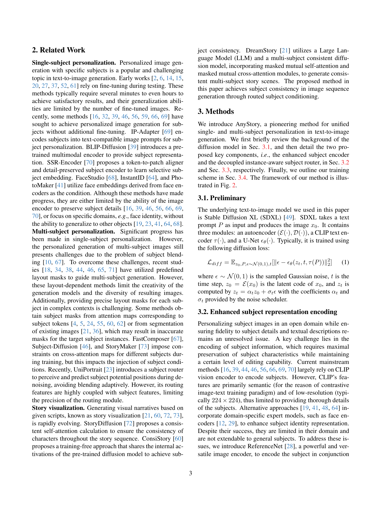

 


 2501.09503 
 Junjie He et el. 
 
 🤗 2025-01-17 
 



↗ arXiv


↗ Hugging Face


↗ Papers with Code


### TL;DR



텍스트-이미지 생성 모델은 최근 괄목할 만한 발전을 이루었지만, 특정 주체를 가진 개인화된 이미지를 생성하는 것은 여전히 어려운 과제입니다.  특히, **다중 주체가 포함된 경우 주체 간의 혼합 현상이 발생**하고, **주체의 세부 정보가 손상될 위험**이 있습니다.  기존 방법들은 주체 마스크를 사용하거나 특정 종류의 객체에만 국한되는 등 한계를 가지고 있습니다.

본 논문에서는 **AnyStory라는 통합 프레임워크**를 제시합니다. AnyStory는 **향상된 주체 표현 인코더**와 **분리된 인스턴스 인식 주체 라우터**를 사용하여 **단일 및 다중 주체 모두에 대한 고품질 개인화**를 달성합니다.  **주체 특징을 정확하게 인식하고 예측**하여 주체 조건의 적용 영역을 효과적으로 제어함으로써 주체 혼합 문제를 해결합니다. 실험 결과는 AnyStory의 우수한 성능을 입증합니다.



#### Key Takeaways


 AnyStory는 단일 ë° 다중 주체 모두에 대해 고품질의 개인화된 이미지를 생성하는 통합 프레임워크를 제시합니다. 



 AnyStory는 향상된 주체 표현 인코더와 분리된 인스턴스 인식 주체 라우터를 사용하여 주체 충실도를 유지하면서 다중 주체를 개인화합니다. 



 AnyStory는 텍스트 설명과 주체 세부 정보를 정확하게 유지하면서 다양한 주체, 포즈, 뷰를 허용하는 강력하고 유연한 솔루션입니다. 


#### Why does it matter?
**본 논문은 개인 맞춤형 이미지 생성 분야에서 중요한 진전을 이루었습니다.**  **단일 및 다중 주체에 대한 고품질 개인화를 달성하는 통합 프레임워크를 제시하여**, 이 분야의 연구에 새로운 방향을 제시하고 있습니다.  **다양한 주제 및 배경에 대한 적응력을 높여** 실제 응용 분야에서의 활용 가능성을 높였으며, **향후 연구를 위한 새로운 가능성을 제시**하고 있습니다.  **특히, 멀티-주제 이미지 생성에서의 주제 혼합 문제를 효과적으로 해결하는 방법을 제시**한 점이 중요합니다. 이는 다양한 주제의 이미지 생성에 대한 연구의 어려움을 극복하는데 기여할 수 있습니다.

------
#### Visual Insights

> 🔼 AnyStory는 '인코딩 후 라우팅' 조건부 생성 패러다임을 따릅니다. 먼저 단순화된 ReferenceNet과 CLIP 비전 인코더를 결합하여 피사체를 인코딩한 다음, 분리된 인스턴스 인식 피사체 라우터를 사용하여 피사체 조건 주입을 안내합니다. 학습 과정은 피사체 인코더 학습 단계와 라우터 학습 단계의 두 단계로 나뉩니다. 간결성을 위해 텍스트 조건부 분기는 생략했습니다. 그림은 AnyStory 프레임워크의 개요를 보여줍니다.
> 

> 
read the caption

> Figure 1:  Overview of AnyStory framework. AnyStory follows the “encode-then-route” conditional generation paradigm. It first utilizes a simplified ReferenceNet combined with a CLIP vision encoder to encode the subject (Sec. 3.2), and then employs a decoupled instance-aware subject router to guide the subject condition injection (Sec. 3.3). The training process is divided into two stages: the subject encoder training stage and the router training stage (Sec. 3.4). For brevity, we omit the text conditional branch here.
> 


| Architecture | #Params (B) | Speed (ms/img) |
|---|---|---|
| Original ReferenceNet [28] | 2.57 | 62.0 |
| Simplified ReferenceNet | 2.02 | 53.2 |

> 🔼 이 표는 논문에서 제안하는 단순화된 ReferenceNet의 통계를 보여줍니다.  특히, 매개변수 수와 A100 GPU를 사용하여 배치 크기 1, 입력(잠재) 해상도 64x64일 때의 속도(이미지당 밀리초)를 비교하여 단순화된 모델의 효율성을 강조합니다.  단순화 과정에서 크로스 어텐션 계층을 제거함으로써 성능 저하 없이 속도 향상을 달성했음을 보여줍니다.
> 

> 
read the caption

> Table 1: Statistics of the simplified ReferenceNet. The speed is measured on an A100 GPU with a batch size of 1 and an input (latent) resolution of 64×64646464\times 6464 × 64.
> 

### In-depth insights

#### Unified Personalization
본 논문에서 제시된 "통합 개인화(Unified Personalization)" 개념은 **단일 주제와 다중 주제 모두에 대한 개인화된 이미지 생성을 하나의 프레임워크로 통합**하는 것을 의미합니다. 기존의 접근 방식들은 단일 주제에 초점을 맞추거나, 다중 주제를 처리하는 경우 주제 간 혼동이 발생하는 문제를 안고 있었습니다. 하지만 통합 개인화는 이러한 제한점을 극복하고 **주제 충실도를 유지하면서 단일 및 다중 주제 모두에 대한 고품질 개인화 이미지 생성**을 목표로 합니다. 이를 위해 **향상된 주제 표현 인코더와 분리된 인스턴스 인식 주제 라우터**라는 두 가지 주요 모듈을 도입하여 주제 정보를 효과적으로 인코딩하고, U-Net 내에서 주제 조건을 정확하게 적용합니다. 이는 **주제 특징을 정확하게 인식하고 예측하여, 배경이나 다른 주제에 대한 영향을 최소화**함으로써 이미지 생성의 정확성과 유연성을 높여줍니다.  **결과적으로, 다양한 주제와 텍스트 설명에 대한 높은 충실도를 유지하며, 복잡하고 환상적인 내러티브를 포함한 이미지 생성**을 가능하게 합니다.

#### ReferenceNet Encoding
본 논문에서 제시된 ReferenceNet Encoding은 기존 CLIP vision encoder의 한계를 극복하기 위한 효과적인 방법으로 제시됩니다. **기존 방법들이 주로 CLIP vision encoder에 의존하여 저해상도의 의미론적 특징만을 추출하는 데 그쳤다면**, ReferenceNet을 활용하여 **고해상도의 세밀한 외형 정보까지 효과적으로 인코딩**하는 것을 목표로 합니다.  ReferenceNet의 VAE(Variational Autoencoder) 구조를 통해, 주어진 이미지의 고해상도 특징을 효율적으로 학습하고, U-Net과의 호환성을 높여 주제에 대한 정확하고 세부적인 표현을 가능하게 합니다. 특히, **크로스 어텐션 레이어를 생략하여 계산 비용을 줄이면서도** CLIP vision encoder와의 조합을 통해 의미론적 이해와 시각적 세부 정보를 동시에 제공하는 강점을 지닙니다. 이는 다양한 배경, 자세, 시점에서 동일한 주제를 인식하는 데 도움이 되며, **결과적으로 주제의 정확성과 충실도를 높여** 단일 또는 다중 주제 개인화 이미지 생성의 질을 향상시킵니다.  또한, 사전 훈련된 U-Net 가중치를 초기화에 사용하여 일반적인 주제 개념 학습에 유리한 환경을 조성합니다.

#### Instance-Aware Routing
본 논문에서 제시된 '인스턴스 인식 라우팅'은 **다중 객체 이미지 생성 시 발생하는 객체 혼합 문제를 해결하기 위한 핵심 모듈**입니다. 기존 방법들은 객체 특징을 단순히 결합하여 사용하는 반면, 본 모듈은 **각 객체의 위치를 정확하게 예측하고, 해당 위치에 객체 정보를 주입**함으로써 객체 혼합을 방지하고, 개별 객체의 특징을 명확하게 유지합니다. **마스크된 크로스 어텐션 메커니즘**을 활용하여 배경과의 구분을 명확히 하고, 각 객체에 대한 라우팅 결과를 개선합니다. 특히, **독립적인 라우팅 분기**를 통해 유연성을 확보하고, **인스턴스 인식 정규화 손실 함수**를 도입하여 여러 객체의 위치 예측 정확도를 높입니다. 이러한 기법들은 **고품질의 다중 객체 이미지 생성**을 가능하게 합니다.  결과적으로, 본 논문의 '인스턴스 인식 라우팅'은 **단순한 객체 정보 결합을 넘어 객체 위치 예측 및 정밀 제어**를 통해 다중 객체 이미지 생성의 질적 향상에 크게 기여합니다.

#### AnyStory's Limits
AnyStory는 놀라운 성과를 보여주지만, **제한적인 측면**도 존재합니다. 우선, **배경의 개인화**에는 아직 미흡합니다. 이미지 배경의 일관성 유지는 시퀀셜 이미지 생성에서 중요한데, AnyStory는 이 부분에 대한 제어 능력이 부족합니다.  또한, **복제-붙여넣기 효과(copy-paste effect)**는 여전히 존재합니다.  **주제의 다양성** 또한 고려해야 할 부분입니다.  현재 AnyStory는 다양한 주제를 처리하는 능력을 보여주지만, 특정 유형의 주제에 편향되어 있거나, 특정 주제에 대한 성능이 다른 주제보다 떨어질 가능성이 있습니다. 마지막으로, **더욱 강력한 text-to-image 모델**을 사용하면 AnyStory의 성능을 더욱 향상시킬 수 있을 것입니다.  **미래 연구**는 이러한 제한점들을 해결하고, AnyStory의 기능을 더욱 확장하는 데 집중해야 합니다.

#### Future Work
본 논문의 "향후 연구 방향" 부분에서 언급되지 않은 내용을 바탕으로, 저는 **AnyStory 모델의 개선 및 확장**에 대한 심도있는 생각을 제시하고자 합니다. 우선, **배경 이미지의 개인화**는 중요한 개선 과제입니다. 현재 모델은 주제에 대한 고해상도의 정확한 표현에 초점을 맞추고 있지만, 배경 또한 사용자 정의가 가능하도록 개선하여, 보다 풍부하고 입체적인 이미지 생성을 가능하게 해야 합니다.  **다양한 주제의 혼합 및 상호 작용**에 대한 연구 또한 필요합니다.  **복잡한 시나리오에서의 주제 조화 및 충돌 해결**은 향후 연구의 핵심이 될 것입니다.  **일관성 있는 시퀀스 이미지 생성** 기능을 강화하여, 스토리텔링이나 애니메이션 제작과 같은 응용 분야에서의 활용성을 높여야 합니다. 마지막으로, **모델의 효율성 개선**을 통해, 실시간 응용이나 대규모 데이터 처리에 대한 적용성을 확보하는 연구가 필요합니다. 이러한 개선들을 통해 AnyStory는 더욱 강력하고 다양한 활용성을 갖춘 모델로 진화할 수 있을 것입니다.  **특히, 비디오 생성으로의 확장**은 큰 가능성을 지니고 있으며, 이를 위한 추가적인 연구가 매우 중요합니다.

### More visual insights

More on figures

> 🔼 그림 2는 AnyStory 프레임워크에서 제안된 향상된 객체 표현 인코딩의 효과를 보여줍니다.  기존의 CLIP 비전 인코더만 사용했을 때보다 ReferenceNet 인코더를 추가하여 객체의 세부적인 특징을 더 잘 보존하는 것을 보여줍니다.  즉, ReferenceNet 인코더가 객체의 디테일을 더욱 정확하게 유지하면서 이미지 생성의 정확도를 높이는 데 기여함을 시각적으로 보여주는 그림입니다.  다양한 객체 예시를 통해 ReferenceNet의 효과를 명확히 하고 있습니다.
> 

> 
read the caption

> Figure 2:  Effect of ReferenceNet encoding. The ReferenceNet encoder enhances the preservation of subject details.
> 

> 🔼 그림 3은 AnyStory 모델의 라우터 모듈의 효과를 보여줍니다. 라우터는 각 객체의 조건 영역을 제한하여, 여러 객체가 혼합되는 것을 방지하고 이미지 품질을 향상시킵니다.  이는 서로 다른 객체의 특징이 섞이는 것을 방지하고 생성된 이미지의 전반적인 질을 높이는 역할을 합니다.  특히, 단일 객체를 생성하는 경우에도 배경의 품질을 향상시키는 효과가 있습니다. 라우터는 객체 특징의 영향력을 제한하여 편향된 결과(예: 단색 배경 선호도)를 줄입니다.
> 

> 
read the caption

> Figure 3:  The effectiveness of the router. The router restricts the influence areas of the subject conditions, thereby avoiding the blending of characteristics between multiple subjects and improving the quality of the generated images.
> 

> 🔼 그림 4는 U-Net의 각 크로스 어텐션 레이어 내에서의 라우팅 맵을 시각화한 것입니다. SDXL U-Net에는 총 70개의 크로스 어텐션 레이어가 있으며, 각 하위 그림에는 이 레이어들이 위에서 아래로, 왼쪽에서 오른쪽으로 순차적으로 표시되어 있습니다. 노란색은 효과적인 영역을 나타냅니다. EDM 샘플링의 25단계를 사용했습니다. 각 행은 하나의 개체에 해당하며, 배경 라우팅 맵은 모든 개체의 라우팅 맵의 보완이므로 제외되었습니다. 색상으로 보는 것이 좋으며, 확대하여 보는 것이 좋습니다.
> 

> 
read the caption

> Figure 4:  Visualization of routing maps. We visualize the routing maps within each cross-attention layer in the U-Net at different diffusion time steps. There are a total of 70 cross-attention layers in the SDXL U-Net, and we sequentially display them in each subfigure in a top-to-bottom and left-to-right order (yellow represents the effective region). We utilize T=25𝑇25T=25italic_T = 25 steps of EDM sampling. Each complete row corresponds to one entity. The background routing map has been ignored, which is the complement of the routing maps of all subjects. Best viewed in color and zoomed in.
> 

> 🔼 그림 5는 제안된 라우터 구조의 효과를 보여줍니다. 그림 4를 참조하여 각 그림의 의미를 확인하십시오.  이 그림은 U-Net의 각 크로스 어텐션 레이어에서 서로 다른 확산 시간 단계에서 얻어진 라우팅 맵을 시각화한 것입니다. 라우팅 맵은 인스턴스 분할 마스크와 유사하게 동작하며, 참조 이미지를 사용하여 디노이징 U-Net 및 훈련된 라우터를 통해 이미지 분할을 수행할 가능성을 보여줍니다. 또한, 제안된 라우터가 단일 객체 설정에서도 이미지 품질, 특히 배경 이미지 품질을 향상시키는 데 효과적임을 보여줍니다. 이는 라우터가 객체 조건의 영향 영역을 제한하여 객체 특징(예: 단순 흰색 배경)의 편향을 줄이기 때문입니다.
> 

> 
read the caption

> Figure 5: Effectiveness of the proposed router structure. For the meaning of each illustration, please refer to Fig. 4.
> 

> 🔼 이 그림은 AnyStory 모델이 생성한 다양한 이미지들을 보여줍니다.  AnyStory는 텍스트 기반 이미지 생성 모델로, 단일 주제 또는 다중 주제를 가진 이미지를 개인화하여 생성하는 것을 목표로 합니다. 그림에는 다양한 스타일, 배경, 그리고 여러 캐릭터들이 포함되어 있으며, 모델의 다양한 생성 능력을 보여줍니다. 특히, 여러 주제가 있는 복잡한 장면에서도 각 주제의 디테일을 잘 유지하고, 텍스트 설명과 일관성을 유지하는 것을 강조합니다.
> 

> 
read the caption

> Figure 6:  Example generations II from AnyStory.
> 

More on tables


| | 
|---|---|
> 🔼 표 5는 U-Net의 각 크로스 어텐션 레이어에서 서로 다른 확산 단계에서의 라우팅 맵을 시각화한 것입니다. SDXL에는 총 70개의 크로스 어텐션 레이어가 있으며, 각 하위 그림에서 위에서 아래로, 왼쪽에서 오른쪽으로 순차적으로 표시됩니다. 노란색은 효과적인 영역을 나타냅니다. EDM 샘플링의 25단계를 사용합니다. 각 완전한 행은 하나의 엔티티에 해당합니다. 배경 라우팅 맵은 무시됩니다. (즉, 모든 주제의 라우팅 맵의 보완). 색상으로 보는 것이 가장 좋으며 확대하여 보는 것이 좋습니다.
> 

> 
read the caption

> ((a)) Coarse routing maps
> 


| Reference | URL |
|---|---| 
|  | [https://pixabay.com/illustrations/ai-generated-dwarf-story-fantasy-8697130/](https://pixabay.com/illustrations/ai-generated-dwarf-story-fantasy-8697130/) |
|  | [https://pixabay.com/illustrations/girl-coat-night-night-city-8836068/](https://pixabay.com/illustrations/girl-coat-night-night-city-8836068/) |
|  | [https://pixabay.com/vectors/man-warrior-art-character-cartoon-9093563/](https://pixabay.com/vectors/man-warrior-art-character-cartoon-9093563/) |
|  | [https://pixabay.com/photos/mario-figure-game-nintendo-super-1558068/](https://pixabay.com/photos/mario-figure-game-nintendo-super-1558068/) |
|  | [https://pixabay.com/illustrations/panda-cartoon-2d-art-character-7918136/](https://pixabay.com/illustrations/panda-cartoon-2d-art-character-7918136/) |
|  | [https://pixabay.com/illustrations/avocado-food-fruit-6931344/](https://pixabay.com/illustrations/avocado-food-fruit-6931344/) |
|  | [https://pixabay.com/vectors/guy-anime-cartoon-chibi-character-7330732/](https://pixabay.com/vectors/guy-anime-cartoon-chibi-character-7330732/) |
|  | [https://pixabay.com/vectors/guy-anime-cartoon-chibi-character-7330788/](https://pixabay.com/vectors/guy-anime-cartoon-chibi-character-7330788/) |
|  | [https://pixabay.com/photos/young-male-man-japanese-anime-3815077/](https://pixabay.com/photos/young-male-man-japanese-anime-3815077/) |
|  | [https://pixabay.com/photos/young-male-man-japanese-anime-3816557/](https://pixabay.com/photos/young-male-man-japanese-anime-3816557/) |
|  | [https://pixabay.com/illustrations/shark-jaws-fish-animal-marine-life-2317422/](https://pixabay.com/illustrations/shark-jaws-fish-animal-marine-life-2317422/) |
|  | [https://unsplash.com/photos/white-egg-with-face-illustration-WtolM5hsj14](https://unsplash.com/photos/white-egg-with-face-illustration-WtolM5hsj14) |
|  | [https://pixabay.com/vectors/alligator-crocodile-suit-cartoon-576481/](https://pixabay.com/vectors/alligator-crocodile-suit-cartoon-576481/) |
|  | [https://pixabay.com/illustrations/snowman-winter-christmas-time-snow-7583640/](https://pixabay.com/illustrations/snowman-winter-christmas-time-snow-7583640/) |
|  | [https://pixabay.com/illustrations/monster-cartoon-funny-creature-8534186/](https://pixabay.com/illustrations/monster-cartoon-funny-creature-8534186/) |
|  | [https://unsplash.com/photos/a-cartoon-character-wearing-a-face-mask-and-running-6-adg66qleM](https://unsplash.com/photos/a-cartoon-character-wearing-a-face-mask-and-running-6-adg66qleM) |
|  | [https://pixabay.com/illustrations/car-vehicle-drive-transportation-8316057/](https://pixabay.com/illustrations/car-vehicle-drive-transportation-8316057/) |
|  | [https://pixabay.com/vectors/camel-desert-two-humped-animal-7751098/](https://pixabay.com/vectors/camel-desert-two-humped-animal-7751098/) |
|  | [https://pixabay.com/illustrations/cartoon-samurai-characters-4790355/](https://pixabay.com/illustrations/cartoon-samurai-characters-4790355/) |
|  | [https://pixabay.com/illustrations/caveman-prehistoric-character-9211043/](https://pixabay.com/illustrations/caveman-prehistoric-character-9211043/) |
|  | [https://pixabay.com/illustrations/boy-walk-nature-anime-smile-8350034/](https://pixabay.com/illustrations/boy-walk-nature-anime-smile-8350034/) |
|  | [https://pixabay.com/illustrations/fish-jaw-angry-cartoon-parrot-fish-1402423/](https://pixabay.com/illustrations/fish-jaw-angry-cartoon-parrot-fish-1402423/) |
|  | [https://pixabay.com/illustrations/fish-telescope-fish-cartoon-1450768/](https://pixabay.com/illustrations/fish-telescope-fish-cartoon-1450768/) |
|  | [https://pixabay.com/vectors/cat-pet-animal-kitty-kitten-cute-6484941/](https://pixabay.com/vectors/cat-pet-animal-kitty-kitten-cute-6484941/) |
|  | [https://pixabay.com/vectors/child-costume-bee-character-8320341/](https://pixabay.com/vectors/child-costume-bee-character-8320341/) |
|  | [https://pixabay.com/vectors/guy-anime-cartoon-chibi-character-7330758/](https://pixabay.com/vectors/guy-anime-cartoon-chibi-character-7330758/) |
|  | [https://pixabay.com/vectors/girl-anime-chibi-cartoon-character-7346667/](https://pixabay.com/vectors/girl-anime-chibi-cartoon-character-7346667/) |
|  | [https://unsplash.com/photos/white-and-blue-cat-figurine-u3ZUSIH_eis](https://unsplash.com/photos/white-and-blue-cat-figurine-u3ZUSIH_eis) |
|  | [https://unsplash.com/photos/sock-monkey-plush-toy-on-brown-panel-5INN0oj12u4](https://unsplash.com/photos/sock-monkey-plush-toy-on-brown-panel-5INN0oj12u4) |
|  | [https://pixabay.com/illustrations/karate-fighter-cartoon-character-8537724/](https://pixabay.com/illustrations/karate-fighter-cartoon-character-8537724/) |
|  | [https://pixabay.com/illustrations/ai-generated-giraffe-doctor-8647702/](https://pixabay.com/illustrations/ai-generated-giraffe-doctor-8647702/) |
|  | [https://pixabay.com/illustrations/ai-generated-skull-character-8124354/](https://pixabay.com/illustrations/ai-generated-skull-character-8124354/) |
|  | [https://unsplash.com/photos/a-red-robot-is-standing-on-a-pink-background-unt3066GV-E](https://unsplash.com/photos/a-red-robot-is-standing-on-a-pink-background-unt3066GV-E) |
|  | [https://pixabay.com/illustrations/cartoon-dinosaur-dragon-animal-8539364/](https://pixabay.com/illustrations/cartoon-dinosaur-dragon-animal-8539364/) |
|  | [https://pixabay.com/illustrations/man-book-read-hanfu-chinese-hanfu-7364886/](https://pixabay.com/illustrations/man-book-read-hanfu-chinese-hanfu-7364886/) |
|  | [https://pixabay.com/vectors/muslim-hijab-child-cartoon-doodle-7747745/](https://pixabay.com/vectors/muslim-hijab-child-cartoon-doodle-7747745/) |
|  | [https://pixabay.com/illustrations/tambourine-musician-woman-character-9073083/](https://pixabay.com/illustrations/tambourine-musician-woman-character-9073083/) |
|  | [https://pixabay.com/illustrations/ai-generated-man-agent-character-9050849/](https://pixabay.com/illustrations/ai-generated-man-agent-character-9050849/) |
|  | [https://pixabay.com/illustrations/ai-generated-superhero-hero-heroine-7977051/](https://pixabay.com/illustrations/ai-generated-superhero-hero-heroine-7977051/) |
|  | [https://unsplash.com/photos/a-woman-in-a-tan-jacket-and-tan-pants-QVyAUDUOlMw](https://unsplash.com/photos/a-woman-in-a-tan-jacket-and-tan-pants-QVyAUDUOlMw) |
|  | [https://unsplash.com/photos/a-woman-in-a-yellow-shirt-and-black-pants-rdHrrFA1KKg](https://unsplash.com/photos/a-woman-in-a-yellow-shirt-and-black-pants-rdHrrFA1KKg) |
|  | [https://pixabay.com/vectors/fashion-boy-cartoon-spring-summer-8515751/](https://pixabay.com/vectors/fashion-boy-cartoon-spring-summer-8515751/) |
|  | [https://pixabay.com/illustrations/woman-girl-fashion-model-female-8859569/](https://pixabay.com/illustrations/woman-girl-fashion-model-female-8859569/) |
|  | [https://pixabay.com/illustrations/woman-cartoon-character-anime-8926994/](https://pixabay.com/illustrations/woman-cartoon-character-anime-8926994/) |
|  | [https://pixabay.com/photos/apple-red-delicious-fruit-vitamins-256268/](https://pixabay.com/photos/apple-red-delicious-fruit-vitamins-256268/) |
|  | [tps://pixabay.com/photos/apple-food-fresh-fruit-green-1239300/](tps://pixabay.com/photos/apple-food-fresh-fruit-green-1239300/) |
|  | [https://pixabay.com/illustrations/fox-animal-wildlife-wild-mammal-9267914/](https://pixabay.com/illustrations/fox-animal-wildlife-wild-mammal-9267914/) |
|  | [https://pixabay.com/illustrations/christmas-deer-animal-rudolph-8380345/](https://pixabay.com/illustrations/christmas-deer-animal-rudolph-8380345/) |
|  | [https://pixabay.com/illustrations/ai-generated-man-portrait-7953120/](https://pixabay.com/illustrations/ai-generated-man-portrait-7953120/) |
|  | [https://pixabay.com/illustrations/created-by-ai-hedgehog-cartoon-8635844/](https://pixabay.com/illustrations/created-by-ai-hedgehog-cartoon-8635844/) |
|  | [https://pixabay.com/vectors/dragon-creature-baby-dragon-8480029/](https://pixabay.com/vectors/dragon-creature-baby-dragon-8480029/) |
|  | [https://pixabay.com/vectors/boy-cartoon-fashion-chibi-kawaii-8515729/](https://pixabay.com/vectors/boy-cartoon-fashion-chibi-kawaii-8515729/) |
|  | [https://pixabay.com/vectors/blonde-boy-cartoon-character-comic-1300066/](https://pixabay.com/vectors/blonde-boy-cartoon-character-comic-1300066/) |
> 🔼 표 5는 U-Net의 각 크로스 어텐션 레이어에서 서로 다른 확산 시간 단계에서 얻은 라우팅 맵을 시각화한 것입니다.  각 하위 그림에는 U-Net의 총 70개 크로스 어텐션 레이어가 상하좌우 순서로 순차적으로 표시되어 있습니다. 노란색은 유효 영역을 나타냅니다. EDM 샘플링의 25단계를 사용하며, 각 행은 하나의 개체에 해당합니다. 배경 라우팅 맵은 모든 개체의 라우팅 맵을 보완하는 부분이므로 생략했습니다.
> 

> 
read the caption

> ((b)) Refined routing maps
> 

### Full paper



