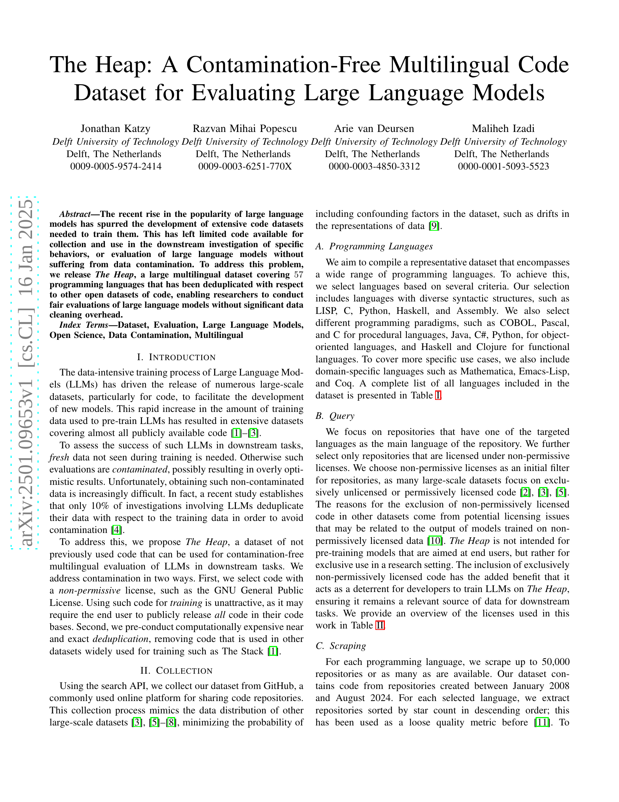

 


 2501.09653 
 Jonathan Katzy et el. 
 
 🤗 2025-01-17 
 



↗ arXiv


↗ Hugging Face


↗ Papers with Code


### TL;DR



대규모 언어 모델(LLM)의 발전으로 코드 데이터셋의 중요성이 커지고 있지만, 기존 데이터셋들은 LLM의 학습 데이터와 중복되는 경우가 많아 공정한 평가가 어렵다는 문제가 있습니다.  이로 인해 LLM 성능 평가의 신뢰성이 떨어지고, 객관적인 비교 분석이 어려워지고 있습니다. 또한,  기존 데이터셋들은 특정 언어나 라이선스에 치우쳐 다양한 언어와 프로그래밍 패러다임을 포괄하지 못하는 경우가 많습니다.

본 논문에서는 이러한 문제를 해결하기 위해 **오염되지 않은 다국어 코드 데이터셋인 The Heap**을 제시합니다. The Heap은 다양한 프로그래밍 언어(57개)와 비허가적 라이선스를 가진 코드를 포함하며, 기존 데이터셋과의 중복을 최소화하기 위해 정교한 중복 제거 과정을 거쳤습니다.  **The Heap은 다국어 지원 및 엄격한 중복 제거를 통해 LLM의 공정한 평가를 가능하게 하고, 다양한 프로그래밍 언어와 패러다임에 대한 연구를 지원**합니다. 본 연구는 LLM 평가의 신뢰성을 높이고, 다양한 언어와 프로그래밍 패러다임에 대한 연구를 촉진하는 데 크게 기여할 것으로 기대됩니다.



#### Key Takeaways


 The Heap은 기존 코드 데이터셋과 중복되지 않는 57개 언어의 방대한 코드 데이터셋입니다. 



 The Heap은 LLM의 공정한 평가를 가능하게 하여 데이터 오염 문제를 해결합니다. 



 The Heap은 다양한 프로그래밍 언어와 라이선스 정보를 제공하여 다양한 연구를 지원합니다. 


#### Why does it matter?
본 논문은 **오염되지 않은 다국어 코드 데이터셋인 The Heap**을 제시하여 **대규모 언어 모델(LLM)의 공정한 평가**를 가능하게 합니다. 기존 LLM 평가의 데이터 오염 문제를 해결하고, 다양한 프로그래밍 언어를 포함하여 폭넓은 연구를 지원하며, 향후 연구를 위한 새로운 가능성을 제시합니다.  이는 **LLM 연구의 신뢰성과 투명성을 높이는 데 크게 기여**할 것입니다.  데이터셋의 규모와 다국어 지원은  **LLM 성능 향상 및 다양한 응용 분야 확장에 중요한 영향**을 미칠 것입니다.

------
#### Visual Insights


| Language | Repositories | Raw Files | Unique Files |
|---|---|---|---|
| Ada | 676 | 41,367 | 35,425 |
| Agda | 142 | 5,483 | 5,113 |
| ANTLR | 101 | 564 | 541 |
| Apex | 253 | 17,833 | 7,641 |
| Assembly | 7,100 | 208,896 | 104,901 |
| C | 50,000 | 16,585,280 | 4,960,192 |
| C# | 50,000 | 5,906,716 | 3,770,829 |
| C++ | 50,000 | 14,891,856 | 4,811,620 |
| Clojure | 27,107 | 380,567 | 273,181 |
| Cobol | 341 | 2,242 | 1,208 |
| Common Lisp | 796 | 45,083 | 16,968 |
| Coq | 477 | 54,137 | 26,175 |
| Crystal | 368 | 11,606 | 7,300 |
| Cuda | 1,191 | 26,948 | 13,359 |
| D | 1,185 | 185,630 | 126,111 |
| Dart | 11,907 | 484,935 | 413,203 |
| EJS | 1,475 | 15,513 | 12,884 |
| Elixir | 2,371 | 643,856 | 127,910 |
| Emacs Lisp | 377 | 8,260 | 7,963 |
| Erlang | 1,240 | 55,932 | 32,049 |
| F# | 876 | 22,152 | 16,015 |
| Forth | 222 | 28,287 | 7,932 |
| Go | 50,000 | 8,506,379 | 2,355,716 |
| Groovy | 2,198 | 60,299 | 48,353 |
| Hack | 1,379 | 84,916 | 37,405 |
| Haskell | 8,023 | 122,788 | 111,234 |
| Java | 50,000 | 6,989,601 | 5,197,338 |
| JavaScript | 50,000 | 8,289,901 | 3,393,747 |
| Julia | 2,859 | 46,284 | 38,381 |
| Kotlin | 21,665 | 1,467,343 | 1,045,396 |
| Less | 433 | 17,276 | 7,389 |
| Lua | 42,241 | 4,605,230 | 913,898 |
| Mathematica | 1,528 | 164,498 | 89,853 |
| MATLAB | 20,828 | 1,051,354 | 665,659 |
| NetLogo | 332 | 900 | 863 |
| NewLisp | 35 | 5,819 | 5,148 |
| Nix | 1,892 | 75,093 | 71,199 |
| Objective-C | 7,700 | 1,899,714 | 698,137 |
| OCaml | 1,961 | 121,890 | 69,171 |
| Pascal | 5,218 | 330,832 | 225,749 |
| Perl | 14,673 | 1,798,520 | 629,769 |
| PHP | 50,000 | 12,707,727 | 3,363,040 |
| Processing | 2,950 | 24,723 | 20,343 |
| Prolog | 1,071 | 38,995 | 20,279 |
| Python | 50,000 | 2,290,182 | 1,792,451 |
| R | 44,993 | 589,139 | 374,812 |
| Raku | 158 | 1,384 | 1,306 |
| Ruby | 13,378 | 1,579,655 | 794,364 |
| Rust | 42,847 | 2,496,177 | 844,258 |
| Scala | 5,893 | 749,370 | 224,021 |
| Scheme | 1,878 | 106,620 | 54,226 |
| Scilab | 199 | 4,531 | 4,084 |
| SQL | 130 | 47,185 | 41,178 |
| Starlark | 146 | 524 | 498 |
| Swift | 13,924 | 633,819 | 439,565 |
| Vue | 14,858 | 457,605 | 323,672 |
| WebAssembly | 68 | 834 | 587 |
| Total | 733,663 | 96,990,250 | 38,681,609 |

> 🔼 본 표는 논문의 데이터셋에 포함된 프로그래밍 언어 목록을 보여줍니다. 각 언어별 저장소 수, 원시 파일 수, 고유 파일 수를 보여주어 데이터셋의 규모와 다양성을 보여줍니다.  표에는 총 57개의 언어가 포함되어 있으며, 각 언어에 대한 통계는 해당 언어로 작성된 저장소, 파일 수 및 중복 제거 후 남은 고유 파일 수를 나타냅니다.
> 

> 
read the caption

> TABLE I: Languages included in the dataset
> 

### In-depth insights

#### LLM Code Contamination
LLM 코드 오염은 대규모 언어 모델(LLM)이 훈련 데이터에 존재하는 코드와 유사한 코드를 생성할 때 발생하는 문제입니다. 이는 모델이 훈련 데이터를 단순히 암기하여 새로운 코드를 생성하는 것이 아니라, 훈련 데이터에 있는 코드를 변형하거나 조합하여 생성하는 것을 의미합니다. **LLM 코드 오염은 모델의 성능 평가를 어렵게 만들고, 새로운 코드를 생성하는 능력을 과대평가할 수 있습니다.**  **오염된 데이터셋으로 평가된 모델은 실제 성능보다 높게 평가될 가능성이 높습니다.** 따라서, LLM의 성능을 정확하게 평가하기 위해서는 훈련 데이터와 중복되지 않는, 깨끗한 데이터셋을 사용하는 것이 중요합니다.  이를 위해서는 **데이터셋을 신중하게 선별하고, 중복 검사를 철저히 수행해야 합니다.**  또한, **다양한 프로그래밍 언어와 라이선스를 고려하여 데이터셋을 구성**함으로써, 모델의 일반화 능력을 향상시키고 오염 가능성을 줄일 수 있습니다.  **라이선스 제약을 고려한 데이터셋 구축** 또한 중요한데, 공개 라이선스 코드만을 사용하는 것은 편향성을 유발할 수 있기 때문입니다.  **다양한 라이선스 조건의 코드를 포함하는 데이터셋**을 통해 더욱 객관적이고 포괄적인 평가가 가능합니다.

#### Multilingual Code Heap
**다국어 코드 힙**은 다양한 프로그래밍 언어로 작성된 방대한 코드 데이터셋으로, 대규모 언어 모델(LLM)의 성능 평가를 위해 **오염되지 않은** 데이터를 제공하는 데 중점을 둡니다.  **기존 데이터셋과의 중복 제거**를 통해  LLM의 과적합 문제를 해결하고, 공정한 성능 비교를 가능하게 합니다.  **다양한 라이선스 정책**을 고려하여 데이터셋을 구성하고, 코드 품질 지표를 포함하여 연구자의 편의성을 높였습니다.  하지만, **지속적인 데이터셋 업데이트 및 정제**, 그리고 **윤리적 문제** (예: 코드 저작권) 에 대한 지속적인 고려가 필요합니다. 특히,  데이터셋에 포함된 코드의 자연어 부분에 대한 분석 및 처리, 그리고 **새로운 프로그래밍 언어에 대한 확장**은 향후 개선 과제입니다.  **데이터 유출 방지**를 위해 엄격한 라이선스 관리와  데이터 접근 제한 등의 보안 조치 또한 중요합니다.

#### Deduplication Strategies
본 논문에서 제시된 중복 제거 전략은 **정확한 중복 제거와 근접 중복 제거** 두 가지 방식으로 구성됩니다. 정확한 중복 제거는 SHA-256 해시 함수를 이용하여 파일의 정확한 일치 여부를 판별합니다.  **충돌 확률이 낮은 SHA-256 해시 함수**를 사용함으로써 위양성을 최소화하고 효율적인 중복 제거를 수행합니다.  근접 중복 제거는 MinHash Locality-Sensitive Hashing(LSH) 기법을 적용하여 파일 간 유사도를 측정합니다.  **7글자의 싱글 크기**와 **40%-60%의 정밀도-재현율 가중치 분포**를 사용하여, 코드 파일 특성에 맞춘 최적의 파라미터 설정을 통해 허위 양성을 제어하면서 재현율을 높였습니다. 이러한 두 가지 전략을 병행함으로써 다양한 유형의 중복을 효과적으로 제거하고, 연구자들이 **데이터 누출 없이 공정한 평가를 수행**할 수 있는 청결한 데이터셋을 제공하는 것을 목표로 합니다.  **다양한 공개 데이터셋과의 비교**를 통해 중복 여부를 검증하는 추가적인 단계를 거침으로써 데이터셋의 신뢰성을 더욱 높였습니다.

#### Future Dataset Enhancements
미래 데이터셋 개선에 대한 심도있는 논의는 **데이터 중복 제거 전략 개선**, **새로운 훈련 데이터셋의 출시**, **코드 내 자연어에 대한 상세 정보 제공**, 그리고 **코드베이스의 진화 추적** 등의 주요 방향을 제시합니다. 특히 **중복 제거 전략**은 단순한 해싱과 유사도 해싱을 넘어, 보다 세분화된 중복 검출 기법과 코드 조각의 기원 추적을 포함하는 다차원적 접근이 필요하며, **새로운 훈련 데이터셋의 등장**에 따른 지속적인 업데이트가 필수적임을 강조합니다. 아울러 **코드 내 자연어 처리**와 관련, 다국어 지원을 위한 자연어 처리 기술 적용 및 코드 내 다국어 혼용 현상 분석 등의 고급 기능 추가가 예상되며, 코드베이스의 변화 추적을 위한 **버전 관리 시스템 연동** 및 코드 변화 분석 기법 도입의 필요성도 제기됩니다. **데이터 품질 향상**을 위한 코드 자동 생성 여부 판별 및 불필요한 코드 조각 제거 기능 등도 중요한 개선 과제로 언급됩니다.  전반적으로, 미래 데이터셋은 단순히 양적 확장을 넘어, **질적 개선**과 **활용성 증대**를 위한 다양한 시도가 예상됨을 알 수 있습니다.

#### Ethical Considerations
본 논문은 대규모 언어 모델(LLM) 평가를 위한 새로운 코드 데이터셋인 "The Heap"을 제시합니다.  **윤리적 고려 사항**은 주로 데이터셋의 구성 및 사용과 관련되어 있습니다.  **비허가 라이선스 코드만 포함**하여 기존 LLM 학습에 사용된 데이터와의 중복을 최소화하고, **학습 데이터 유출 문제**를 방지하려는 노력이 보입니다.  하지만, **저작권** 및 **개발자의 동의** 문제는 여전히 남아 있습니다.  **개발자의 사전 동의 없이 코드를 사용**하는 것에 대한 윤리적 우려를 인지하고 있지만, 현재로서는 개발자의 참여를 의무화할 수 있는 **효과적인 기제가 부족**하고 **기존 관행과의 조화**를 고려한 것으로 보입니다.  **향후 개선 방향**으로 개발자의 **참여 및 동의 절차** 개선 및 **데이터 출처 투명성** 강화를 제시하며, **윤리적 문제 해결**을 위한 지속적인 노력을 시사합니다.  **데이터 접근 제한** 등의 추가적인 보호 장치가 필요할 수 있습니다. 

### More visual insights

More on tables


| License | Family | Description |
|---|---|---|
| CECILL-1.0 CECILL-1.1 CECILL-2.0 CECILL-2.1 CECILL-C EPL-1.0 EPL-2.0 LGPL-2.1 LGPL-3.0 MS-RL MPL-2.0 | Weak Copyleft | Share changes and additions to the licensed software when redistributing. |
| GPL-2.0 GPL-3.0 | Strong Copyleft | Share larger programs built with the licensed software when redistributing. This extends weak copyleft requirements. |
| AGPL-3.0 EUPL-1.1 EUPL-1.2 OSL-3.0 | Network Copyleft | Share larger programs built with the licensed software when redistributing or running it over a network. This extends strong copyleft requirements. |
> 🔼 표 II는 논문에서 사용된 데이터셋에 포함된 복사금지 라이선스 목록을 보여줍니다.  각 라이선스의 이름, 라이선스 계열(Weak Copyleft, Strong Copyleft, Network Copyleft), 그리고 라이선스에 대한 간략한 설명을 포함합니다. 이 표는 데이터셋의 라이선스 정책을 명확히 하여, 데이터 사용에 대한 잠재적인 법적 문제를 피하는데 도움을 줍니다.
> 

> 
read the caption

> TABLE II: Copyleft licenses included in the dataset.
> 


| Dataset | Source |
|---|---| 
| The Stack V2 [3] | All permissively licensed and unlicensed files collected in the Software Heritage [14] archive. |
| The Stack [1] | All permissively licensed repositories collected in the GHArchive [15] and scraped from GitHub. |
| Red Pajama [2] | Repositories from the GitHub dataset hosted by Google BigQuery [16] licensed under MIT, BSD, or Apache licenses. |
| GitHub Code [8] | Repositories from the GitHub dataset hosted by Google BigQuery [16]. |
| CodeParrot [7] | All Python files from the GitHub dataset hosted by Google BigQuery [16]. |
> 🔼 표 III은 논문에서 중복 제거를 위해 사용된 공개적으로 이용 가능한 데이터셋 목록을 보여줍니다.  각 데이터셋의 이름, 데이터셋에 포함된 코드의 라이선스 종류, 데이터셋의 출처 및 데이터 수집 방법에 대한 간략한 설명이 포함되어 있습니다. 이 표는 논문의 중복 제거 과정을 이해하는 데 중요한 역할을 합니다.  The Heap 데이터셋이 다른 공개 데이터셋과 얼마나 차별화되는지, 그리고 데이터 오염을 방지하기 위해 어떤 노력을 기울였는지 보여줍니다.
> 

> 
read the caption

> TABLE III: List of publicly-available datasets used for deduplication
> 

### Full paper



