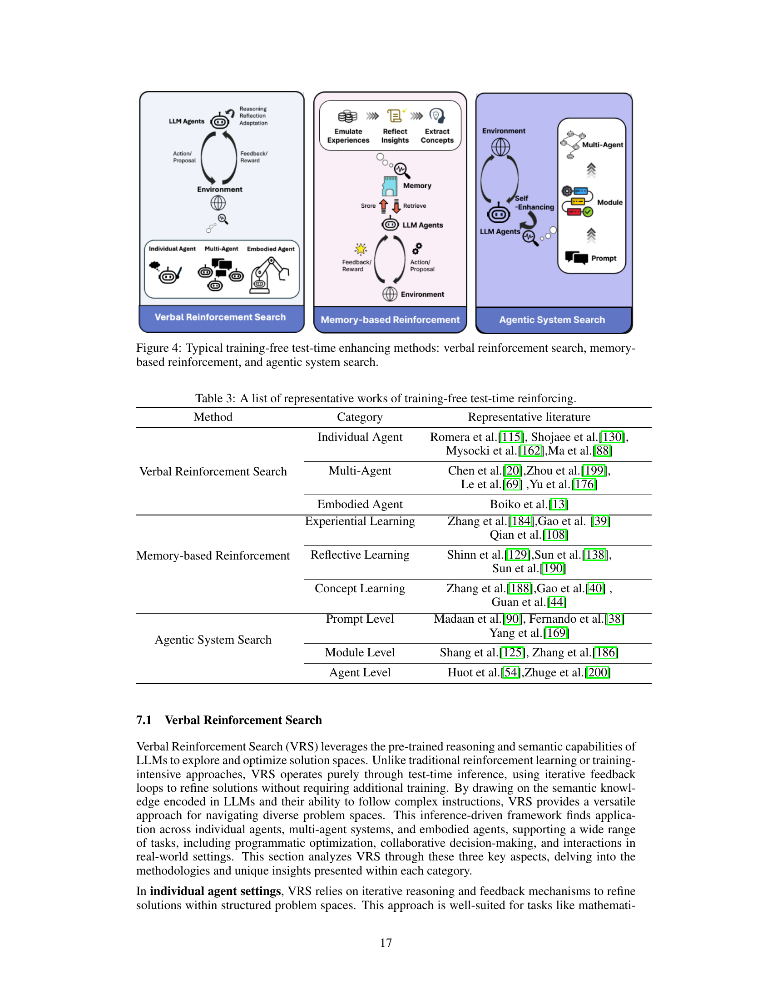

 


 2501.09686 
 Fengli Xu et el. 
 
 🤗 2025-01-17 
 



↗ arXiv


↗ Hugging Face


↗ Papers with Code


### TL;DR



대규모 언어 모델(LLM)은 자연어 처리를 넘어 복잡한 추론 작업에도 활용되고 있으나, 여전히 복잡한 추론 과정에서 어려움을 겪고 있습니다. 기존의 지도 학습 기반의 미세 조정 방법은 고품질의 라벨링된 데이터가 많이 필요하고 비용이 많이 들며, **과적합 및 망각 문제**가 발생할 수 있다는 한계가 있습니다. 

본 논문에서는 이러한 문제를 해결하기 위해 **강화 학습 기반의 추론 학습 방법 및 테스트 시간 확장 기법**을 제시합니다.  특히, **프로세스 보상 모델(PRM)**을 이용하여 중간 단계의 추론 과정에 대한 피드백을 제공하고, 시행착오 학습을 통해 고품질의 추론 경로를 자동 생성하는 방법을 제시합니다. 또한, 테스트 시간에 더 많은 토큰을 사용하여 추론 정확도를 높이는 **테스트 시간 확장 기법**을 제시하고, 이를 통해 대규모 추론 모델 개발에 대한 새로운 가능성을 제시합니다.  이러한 방법들은 사람의 개입을 최소화하면서 LLM의 추론 능력을 크게 향상시킬 수 있는 잠재력을 가지고 있습니다.



#### Key Takeaways


 LLM의 추론 능력 향상을 위한 강화 학습 기반의 새로운 학습 패러다임 제시 



 훈련 데이터 자동 생성 및 테스트 시간 확장을 통한 LLM 추론 성능 향상 



 OpenAI의 o1 시리즈를 포함한 대규모 추론 모델 개발 현황 및 향후 연구 방향 제시 


#### Why does it matter?
본 논문은 **대규모 언어 모델(LLM)**의 추론 능력 향상에 대한 최근 연구 동향을 종합적으로 분석하고, **강화 학습 기반의 추론 학습 방법 및 테스트 시간 확장 기법**을 중점적으로 다룹니다.  이는 LLM의 추론 능력을 획기적으로 향상시키는 새로운 연구 분야를 제시하며, 앞으로 **대규모 추론 모델 개발**에 중요한 이정표를 제시합니다.  또한, **오픈소스 프로젝트 분석 및 향후 연구 방향 제시**를 통해 LLM 추론 연구의 발전에 크게 기여할 것으로 예상됩니다.

------
#### Visual Insights

> 🔼 그림 1은 LLM 추론 데이터에 주석을 다는 서로 다른 방법들을 보여줍니다. 인간에 의한 주석은 고품질이지만 비용이 많이 들고 확장성이 떨어지는 반면, LLM 자동화는 비용 효율적이지만 검증에 어려움이 있습니다. 이 그림은 인간 주석, 인간-LLM 공동 작업, 그리고 LLM 자동화를 포함한 세 가지 주요 방법을 비교하여 각 방법의 장단점과 규모를 보여줍니다. 특히 단계별 추론 과정에 대한 주석 작업의 어려움을 강조합니다.
> 

> 
read the caption

> Figure 1: Illustrating different paradigms for annotating LLM reasoning data.
> 


| Method | Label | Paper | Year | Task | Brief Description |
|---|---|---|---|---|---| 
| Human Annotation | Outcome | [98] | 2024 | Text classification, Semantic analysis | Voting annotation |
|  |  | [104] | 2022 | Preference Alignment | Preference ranking |
| Process |  | [75] | 2023 | Mathematical reasoning | Stepwise annotation |
| Human-LLM Collaboration | Outcome | [42] | 2023 | Semantic analysis | Human correction |
|  |  | [152] | 2024 | Text classification | Human correction |
|  |  | [74] | 2023 | Text classification, Semantic analysis | Task allocation, Uncertainty assessment |
| LLM Automation | Outcome | [106] | 2020 | Commonsense reasoning | Text extraction |
|  |  | [120] | 2024 | Tool use | Trial and error |
|  |  | [65] | 2024 | Embodied tasks | Synthetic augmentation |
|  |  | [109] | 2024 | Commonsense reasoning, Domain knowledge reasoning | Multi-agent collaboration |
| Process |  | [84] | 2023 | Mathematical reasoning | Stronger LLM |
|  |  | [148] | 2024 | Mathematical reasoning | Monte Carlo simulation |
|  |  | [156] | 2024 | Mathematical reasoning, Programming | Monte Carlo simulation |
|  |  | [85] | 2024 | Mathematical reasoning | MCTS simulation |
| LLM Automation with feedback | Outcome | [70] | 2024 | Text classification, Mathematical reasoning, Domain knowledge reasoning | Self-refining |
|  |  | [135] | 2024 | Embodied tasks | Contrastive learning |
| Process |  | [183] | 2024 | Mathematical reasoning, Domain knowledge reasoning | MCTS simulation, Self-refining |

> 🔼 본 논문의 표 1은 LLM 추론을 위한 훈련 데이터 구성 방법에 대한 개요를 보여줍니다. 표에는 훈련 데이터 생성에 사용된 방법(인간 주석, 인간-LLM 공동 작업, LLM 자동화), 데이터 유형(결과, 과정), 그리고 각 방법에 대한 간략한 설명과 해당 작업 유형이 포함되어 있습니다.  표는 인간 주석의 고비용 및 소규모 데이터셋이라는 한계와 LLM 자동화의 저비용 및 대규모 데이터셋이라는 장점을 비교하여 보여줍니다.  이는 LLM 추론 성능 향상을 위한 데이터 구성 방법의 발전 과정을 이해하는 데 도움이 됩니다.
> 

> 
read the caption

> Table 1: Training data construction for LLM reasoning.
> 

### In-depth insights

#### LLM Reasoning Rise
LLM 추론의 부상은 **대규모 언어 모델(LLM)**이 복잡한 추론 과제를 해결하는 능력에서 괄목할 만한 발전을 보여주는 현상입니다.  초기에는 단순한 자동 회귀 토큰 생성에 머물렀지만, **'사고 과정'(chain-of-thought)** 개념의 도입으로 LLM은 중간 단계를 거치는 다단계 추론을 수행하며 인간의 복잡한 사고 과정을 모방하기 시작했습니다.  강화 학습(RL)의 적용은 시행착오를 통한 고품질 추론 경로의 자동 생성을 가능하게 하여 **LLM의 추론 능력을 크게 향상**시켰습니다.  **훈련 시간 및 테스트 시간 확장**을 결합한 연구는 대규모 추론 모델(Large Reasoning Model) 개발에 대한 새로운 가능성을 열었습니다.  이러한 발전은 오픈소스 프로젝트의 등장과 함께 더욱 가속화될 전망입니다.

#### RL Training Methods
본 논문에서 다루는 강화 학습(RL) 기반의 언어 모델 학습 방법은 **자동화된 데이터 생성**, **효율적인 보상 모델 설계**, 그리고 **테스트 시간 확장**이라는 세 가지 주요 측면에 초점을 맞춥니다.  **자동화된 데이터 생성**은 사람의 개입을 최소화하면서 대량의 고품질 학습 데이터를 확보하는 데 중점을 둡니다.  **효율적인 보상 모델 설계**는 과정 보상 모델(PRM)과 같은 기법을 통해 중간 단계의 추론 과정까지 평가함으로써 학습 효율을 높이는 전략입니다.  마지막으로 **테스트 시간 확장**은 추론 과정에서 더 많은 토큰을 사용하여 모델의 추론 능력을 향상시키는 방법입니다. 이 세 가지 측면은 상호 보완적으로 작용하며, 대규모 추론 모델 개발에 중요한 역할을 합니다.  특히, PRM을 활용한 강화 학습은 **인간의 개입을 줄이면서 모델의 추론 능력을 획기적으로 향상**시킬 수 있다는 점에서 주목할 만합니다.  하지만,  **보상 모델 설계 및 학습 과정의 복잡성**, 그리고 **계산 자원의 소모**는 향후 해결해야 할 과제로 남아 있습니다.

#### Test-Time Scaling Laws
본 논문에서 제시된 'Test-Time Scaling Laws'는 **추론 성능 향상을 위한 테스트 시간 연산량 증가의 효과**를 다룹니다.  이는 기존의 학습 단계(train-time) 최적화와 달리, **실제 추론(inference) 단계에서 연산량을 늘려 정확도를 높이는 방법**에 대한 새로운 관점입니다.  **더 많은 토큰을 사용하여 더욱 심도있는 추론 과정을 거치도록 함으로써, 제한된 학습 데이터의 한계를 극복하고, 더욱 정확한 결과를 얻을 수 있다는 것을 보여줍니다.**  이는 단순히 모델 크기만 키우는 기존의 접근 방식과는 다르게, **연산 자원의 효율적인 활용**이라는 측면에서 중요한 의미를 갖습니다.  **특히, Process Reward Model (PRM)과 같은 보상 모델을 활용하여 중간 단계의 추론 과정을 평가하고, 이를 바탕으로 더욱 효과적인 탐색 전략을 구현하는 방법**이 주목할 만합니다.  이는 **테스트 시간 최적화의 새로운 가능성**을 보여주는 동시에, **대규모 추론 모델 개발을 위한 새로운 방향**을 제시합니다.

#### OpenAI's o1 Impact
OpenAI의 o1 모델은 **대규모 언어 모델(LLM)의 추론 능력을 획기적으로 향상**시킨 혁신적인 사례입니다.  기존의 LLM들이 갖고 있던 제한적인 추론 능력을 극복하고, 수학, 코딩, 과학적 문제 해결 등 복잡한 추론 작업에서 인간 수준의 성과를 보여주었습니다. 이는 **훈련 데이터의 질적 향상**, **강화 학습 기법의 효과적인 적용**, 그리고 **테스트 시간 연산량 확대를 통한 추론 과정의 정교화** 등 여러 요인이 복합적으로 작용한 결과입니다.  특히 **중간 과정(chain-of-thought)을 명시적으로 생성하도록 유도**하는 프롬프팅 기법과 **프로세스 보상 모델(PRM)**을 활용한 강화 학습은 o1 모델의 성공에 중요한 역할을 했습니다.  **PRM은 추론 과정의 각 단계에 대한 보상을 제공**, 모델이 보다 정교하고 효율적인 추론 과정을 학습할 수 있도록 돕습니다. o1 모델의 등장은 **대규모 추론 모델(Large Reasoning Model)** 연구에 새로운 이정표를 제시하였으며, 향후 LLM의 발전 방향에 큰 영향을 미칠 것으로 예상됩니다.  **오픈소스를 통한 재현 및 개선 노력**도 활발히 진행되고 있으며,  이는 LLM 추론 기술의 전반적인 발전을 가속화할 것으로 기대됩니다.

#### Future Research Gaps
본 논문에서 제시된 연구는 대규모 언어 모델(LLM)의 추론 능력 향상에 대한 중요한 통찰력을 제공하지만, 여전히 해결해야 할 중요한 연구 과제들이 남아 있습니다. **데이터 품질**은 여전히 큰 과제입니다. 고품질의 추론 데이터셋 구축은 많은 비용과 노력이 필요하며, 특히 단계별 추론 과정을 수동으로 주석 처리하는 데 어려움이 있습니다. 따라서 **자동화된 데이터 생성 기법**에 대한 연구가 더욱 필요합니다.  **강화 학습 기반의 미세 조정 기법**은 LLM 추론 능력 향상에 효과적이지만, 보상 모델의 설계 및 학습 과정의 안정성 확보가 중요합니다. 또한, **테스트 시간 확장**에 대한 연구도 필요합니다.  LLM의 추론 능력을 극대화하기 위해서는 단순히 모델의 크기만 키우는 것이 아니라, 추론 과정에서의 계산 자원을 효율적으로 관리하는 기법을 개발해야 합니다.  마지막으로, **다양한 응용 분야**에서 LLM 추론의 성능을 평가하고 개선하기 위한 표준화된 벤치마크 개발이 중요합니다.  **일반적인 추론 능력**을 넘어, 특정 도메인 지식을 효과적으로 활용하고 복잡한 상황에서도 안정적으로 추론할 수 있는 LLM의 개발은 앞으로 해결해야 할 중요한 과제입니다.

### More visual insights

More on figures

> 🔼 그림 2는 LLM 추론의 훈련 시간 강화 학습에 사용되는 보상 모델 세 가지를 보여줍니다. (a) 직접 RL은 LLM이 행동을 취하고 보상 신호를 받아 매개변수를 업데이트하는 기본적인 RL 프레임워크를 보여줍니다. (b) ORM(Outcome Reward Model)을 사용한 다단계 RL은 LLM의 중간 추론 단계에 대한 보상 신호를 제공하여 최종 결과뿐만 아니라 추론 과정 자체의 품질을 향상시킵니다. (c) PRM(Process Reward Model)을 사용한 다단계 RL은 LLM의 중간 추론 단계마다 밀집된 보상 신호를 제공하여 더욱 세분화된 피드백을 제공하고 추론 능력을 더욱 향상시킵니다. 각 모델은 훈련 데이터 구성과 성능에 미치는 영향이 다릅니다. 이 그림은 세 가지 보상 모델의 차이점과 각각의 장단점을 이해하는 데 도움을 줍니다.
> 

> 
read the caption

> Figure 2: Reward models for Train-time Reinforcement of LLM Reasoning.
> 

> 🔼 그림 3은 테스트 시간 추론 향상을 위한 다양한 검색 알고리즘의 다이어그램을 보여줍니다. 이 그림은 주어진 질문에 대해 LLM이 답을 생성하는 과정에서 사용하는 여러 가지 검색 전략들을 시각적으로 나타냅니다.  각 알고리즘은 다양한 방식으로 가능한 답변 후보들을 탐색하고 평가하여 최적의 답변을 찾아내는 과정을 보여줍니다.  예를 들어, Majority Vote는 여러 개의 추론 경로에서 도출된 답변 중 가장 많은 득표를 얻은 답변을 선택하는 방법을 보여주고, Tree Search는 트리 구조를 이용한 체계적인 탐색을, Beam Search는 여러 후보 경로를 동시에 유지하면서 탐색하는 방법을, Lookahead Search는 미래의 단계까지 고려하여 현재 단계의 의사결정을 하는 방법을 각각 보여줍니다.
> 

> 
read the caption

> Figure 3: Diagrams of Different Search Algorithms for Test-time Reasoning Enhancement.
> 

> 🔼 그림 4는 본 논문 7장(Other Test-time Enhancing Techniques)에서 다루는 세 가지 테스트 시간 강화 방법을 보여줍니다. 각 방법은 사전 훈련된 언어 모델의 능력을 활용하여 추가 훈련 없이 추론 결과를 개선하는 데 중점을 둡니다.  먼저, verbal reinforcement search는 반복적인 피드백 루프를 통해 해결책 공간을 탐색하고 미세 조정합니다.  memory-based reinforcement는 과거 경험을 기억하고 이를 활용하여 향후 행동을 안내합니다. 마지막으로, agentic system search는 에이전트 시스템의 디자인 자체를 최적화하여 언어 모델의 추론 능력을 향상시키는 메타 학습 접근 방식입니다.  각 방법은 다양한 작업 환경(개별 에이전트, 다중 에이전트, 구현된 에이전트)에 적용될 수 있으며, 복잡한 문제 해결에 대한 새로운 관점을 제시합니다.
> 

> 
read the caption

> Figure 4: Typical training-free test-time enhancing methods: verbal reinforcement search, memory-based reinforcement, and agentic system search.
> 

> 🔼 이 그림은 논문의 8장 '평가 벤치마크' 섹션에 있는 그림으로, 다양한 종류의 LLM 추론 벤치마크를 계층적으로 분류한 계층 구조를 보여줍니다.  수학 문제, 논리 문제, 상식 문제, 코딩 문제, 에이전트 문제 등 다양한 유형의 문제들이 각각의 하위 범주로 세분화되어 있으며, 각 범주에는 대표적인 벤치마크 데이터셋들이 포함되어 있습니다.  이 그림은 LLM의 추론 능력을 평가하는 데 사용되는 다양한 벤치마크 데이터셋들을 한눈에 이해하기 쉽게 정리하여 보여줍니다.
> 

> 
read the caption

> Figure 5: A Taxonomy for LLM Reasoning Benchmarks.
> 

More on tables


| Text classification | Semantic analysis |
|---|---|
> 🔼 표 2는 OpenAI의 o1 모델과 같은 고급 추론 기능을 구현하기 위한 오픈소스 프레임워크의 주요 시도들을 보여줍니다. 각 프레임워크는 추론 능력 향상을 위해 다양한 전략을 사용하며, 데이터 구성, 사전 훈련, 추가 훈련 및 테스트 시간 개선에 대한 관점에서 비교 분석됩니다. 이 표는 각 프레임워크의 독특한 방법론과 강점을 이해하는 데 도움이 되는 상세한 정보를 제공합니다.
> 

> 
read the caption

> Table 2: Open-source Attempts of Large Reasoning Models: A Contribution Point of View.
> 


| Text classification | Semantic analysis |
|---|---|
> 🔼 표 3은 본 논문의 7장, 'Other Test-time Enhancing Techniques' 섹션에 있는 표로, 추가적인 훈련 없이 테스트 시간에 추론 성능을 향상시키는 다양한 방법들을 개괄적으로 보여줍니다.  각 방법은 Verbal Reinforcement Search, Memory-based Reinforcement, 그리고 Agentic System Search 라는 세 가지 주요 범주로 분류되어 있으며, 각 범주 내에서 사용된 구체적인 기법과 대표적인 연구 논문들이 나열되어 있습니다.  이 표는 테스트 시간에 LLMs의 추론 능력 향상에 기여하는 다양한 기법들을 한눈에 비교하고 이해하는 데 도움을 줍니다.
> 

> 
read the caption

> Table 3: A list of representative works of training-free test-time reinforcing.
> 

### Full paper



