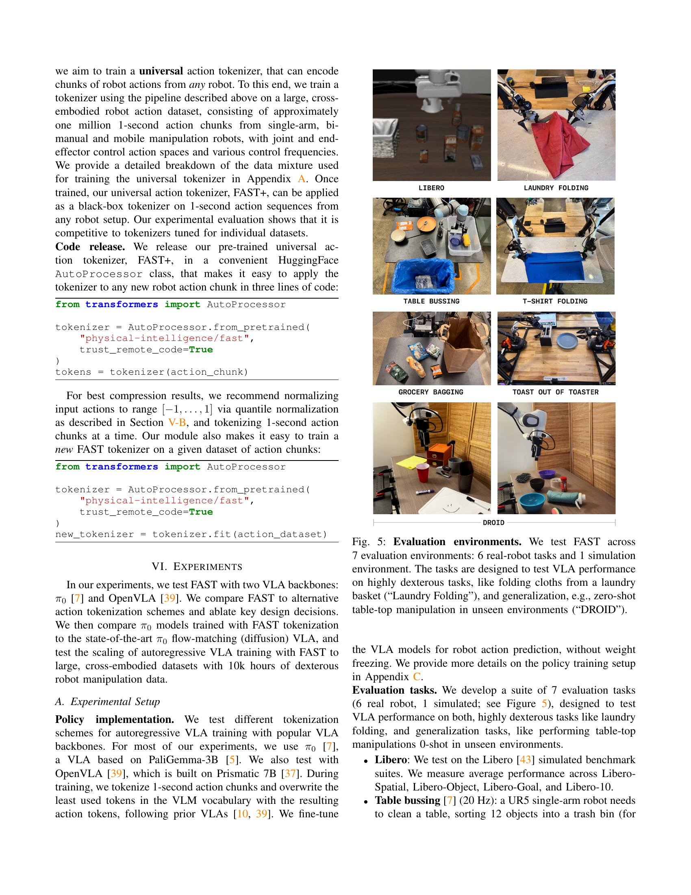
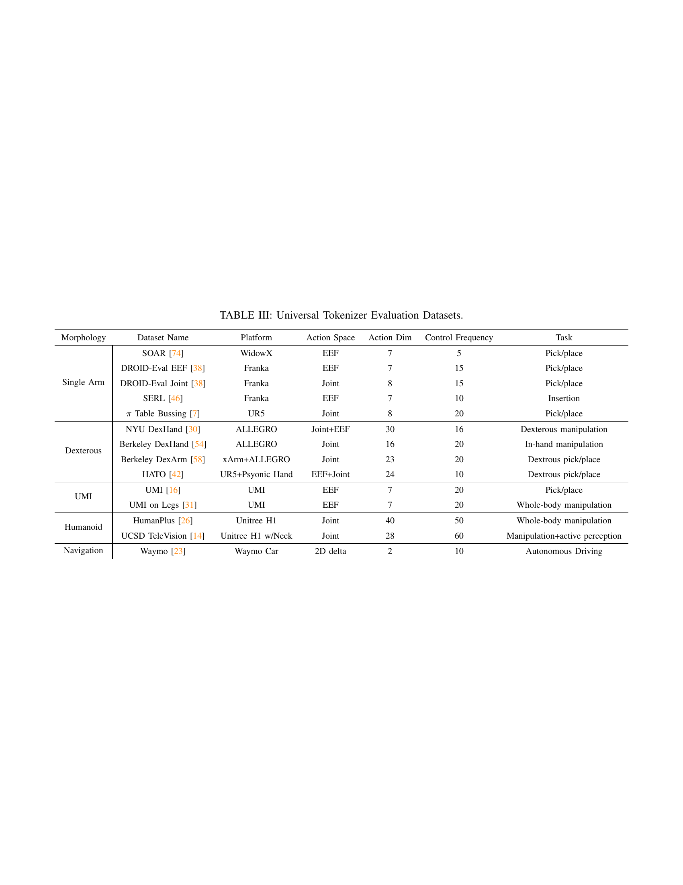

 


 2501.09747 
 Karl Pertsch et el. 
 
 🤗 2025-01-17 
 



↗ arXiv


↗ Hugging Face


↗ Papers with Code


### TL;DR



기존의 시계열 로봇 행동 데이터 토큰화 방식은 고주파수 데이터에서 성능이 저하되는 문제가 있습니다.  이는 모델이 연속적인 행동 신호를 이산적인 토큰으로 변환하는 과정에서 시간적 상관관계를 제대로 포착하지 못하기 때문입니다.  이러한 문제는 특히 정교한 작업을 학습하는 데 큰 어려움을 야기합니다. 

본 논문에서는 이러한 문제를 해결하기 위해 **이산 코사인 변환(DCT)** 기반의 새로운 토큰화 기법인 **FAST**를 제안합니다.  FAST는 로봇 행동 시계열을 효율적으로 압축하여 시간적 상관관계를 줄이고, 고주파수 데이터에서도 높은 성능을 유지합니다.  실험 결과, FAST는 기존 방법보다 훨씬 우수한 성능을 보였으며, **대규모 데이터셋 학습**에도 효과적임을 입증했습니다.  또한, 다양한 로봇 플랫폼과 제어 주파수에 적용 가능한 **범용 토큰화 모델인 FAST+**를 공개하여, 로봇 연구자들에게 유용한 도구를 제공합니다.



#### Key Takeaways


 고주파수 로봇 행동 데이터에 대한 효율적인 토큰화 기법인 FAST를 제시 



 FAST는 기존 방법보다 우수한 성능으로 복잡한 로봇 작업 학습 및 일반화 성능 향상 



 FAST+는 다양한 로봇에 적용 가능한 범용 로봇 행동 토큰화 모델로, 훈련 시간을 최대 5배 단축 


#### Why does it matter?
본 논문은 **고주파수 로봇 데이터를 사용한 숙련된 기술 학습**이라는 어려운 문제를 해결하는 데 기여합니다.  **새로운 토큰화 기법인 FAST**는 기존의 단순한 방법보다 훨씬 우수한 성능을 보이며, **자율 주행 로봇 정책 개발** 및 **고성능 로봇 제어** 연구에 중요한 영향을 미칠 것입니다.  또한, **대규모 데이터셋을 활용한 훈련**에 대한 새로운 가능성을 제시하여, 앞으로의 로봇 제어 연구 방향에 큰 영향을 줄 것으로 예상됩니다.

------
#### Visual Insights

> 🔼 본 논문에서는 로봇 동작 시계열의 압축을 통한 토큰화를 위한 간단하면서도 효과적인 방법인 FAST를 제안합니다.  FAST는 복잡한 숙련된 조작 작업을 해결하고 새로운 환경에 광범위하게 일반화되는 자기회귀 VLA(Vision-Language-Action) 모델의 훈련을 가능하게 합니다.  본 논문에서는 FAST를 사용하여  최첨단 π0 확산 VLA와 동일한 성능을 발휘하면서 훈련 시간을 5배 단축하는 일반적인 로봇 정책인 π0-FAST를 훈련시켰습니다.  상단 그래프는 훈련 반복 횟수에 따른 평가 점수를 보여주며, FAST를 사용한 π0 모델이 기존 π0 모델보다 훨씬 빠르게 수렴하는 것을 보여줍니다. 하단 이미지는 다양한 복잡한 조작 작업을 수행하는 π0-FAST의 예시를 보여줍니다.
> 

> 
read the caption

> Figure 1: We propose FAST, a simple yet effective approach for tokenization of robot action trajectories via time-series compression. FAST enables training of autoregressive VLAs that solve complex dexterous manipulation tasks and generalize broadly to new scenes. We use it to train π0subscript𝜋0\pi_{0}italic_π start_POSTSUBSCRIPT 0 end_POSTSUBSCRIPT-FAST, a generalist robot policy that matches the performance of the state-of-the-art π0subscript𝜋0\pi_{0}italic_π start_POSTSUBSCRIPT 0 end_POSTSUBSCRIPT diffusion VLA on dexterous and long-horizon manipulation tasks, while training 5x faster (top).
> 


| Dataset | Action\Dimension | Control\Frequency | Avg. Token\Naive | Avg. Token\FAST | Compression |
|---|---|---|---|---|---| 
| BridgeV2 | 7 | 5 Hz | 35 | 20 | 1.75 |
| DROID | 7 | 15 Hz | 105 | 29 | 3.6 |
| Bussing | 7 | 20 Hz | 140 | 28 | 5.0 |
| Shirt Fold | 14 | 50 Hz | 700 | 53 | 13.2 |

> 🔼 이 표는 기존의 단순한 방법(naïve tokenization)과 본 논문에서 제안하는 FAST 방법을 사용했을 때, 1초 동안의 로봇 동작을 토큰화했을 때 각 방법당 평균 토큰 개수를 비교한 표입니다.  데이터셋(BridgeV2, DROID, Table Bussing, T-Shirt Folding)별로 1초 동안의 로봇 동작 데이터를  두 가지 방법으로 토큰화하여 각각의 토큰 수를 비교함으로써, FAST 방법이 특히 고주파수 동작(예: 티셔츠 접기)에서 중복성을 제거하는 데 훨씬 효과적임을 보여줍니다.  즉, 동일한 시간의 로봇 동작을 훨씬 적은 수의 토큰으로 표현할 수 있음을 의미합니다.
> 

> 
read the caption

> TABLE I: Comparison of the average token count per action chunk for naïve tokenization and FAST. We use 1-second chunks in all datasets. With our method, each chunk requires many fewer tokens, particularly for high-frequency domains such as the T-shirt folding task, indicating that it is more effective at removing redundancy.
> 

### In-depth insights

#### FAST Action Tokens
본 논문에서 제시된 FAST (Frequency-space Action Sequence Tokenization)는 고주파수 로봇 동작 데이터를 효율적으로 처리하기 위한 새로운 토큰화 기법입니다. 기존의 단순한 1차원/시간 단위 분할 방식과 달리, **FAST는 이산 코사인 변환(DCT)을 이용하여 연속적인 로봇 동작 신호를 주파수 공간으로 변환**, 고주파수 성분의 상관관계를 줄이고 정보 손실을 최소화하면서 데이터를 압축합니다.  **DCT는 영상 압축(JPEG)에서도 사용되는 효과적인 압축 기법**이며, 이를 로봇 동작 데이터에 적용함으로써, 고주파수 동작에서도 높은 성능을 유지하는 자기회귀적 Vision-Language-Action(VLA) 모델 학습이 가능해졌습니다.  또한, **BPE(Byte Pair Encoding)를 통해 DCT 계수를 추가로 압축**, 토큰의 수를 줄이고 학습 효율을 높였습니다.  **FAST의 핵심은 고주파수 로봇 동작의 높은 상관성 문제를 주파수 공간 변환과 압축을 통해 해결**,  기존 VLA 모델의 한계를 극복하고,  **다양한 로봇 동작 및 제어 주파수에 적용 가능한 범용적인 토큰화 방법론**을 제공한다는 점입니다.  이러한 FAST 토큰은 고차원 연속 데이터를 효율적으로 저차원 이산 데이터로 변환하여, 고성능의 VLA 모델 학습을 가능하게 하는 핵심적인 역할을 수행합니다.

#### VLA Training Gains
본 논문에서 제시된 FAST 알고리즘을 이용한 VLA 모델 학습에서의 성과는 크게 두 가지 측면으로 요약할 수 있습니다. 첫째, **높은 주파수의 로봇 액션 데이터를 효과적으로 처리**하여 기존 방법들보다 훨씬 **빠른 속도로 학습**을 수행합니다. 둘째, **다양한 로봇 시스템과 작업 환경에 대한 일반화 성능**이 뛰어나, 기존의 제한적인 VLA 모델의 성능을 획기적으로 향상시켰습니다. 특히, 복잡하고 정교한 조작 기술을 요구하는 작업에서도 우수한 성능을 보여주어, **실제 로봇 제어 분야에의 적용 가능성**을 크게 높였습니다.  이는 단순히 학습 속도 향상을 넘어, **더욱 복잡하고 정교한 로봇 작업의 자동화**를 가능하게 하는 중요한 발전으로 볼 수 있습니다.

#### Universal Tokenizer
본 논문에서 제시된 핵심 개념 중 하나인 "범용 토크나이저(Universal Tokenizer)"는 **다양한 로봇 시스템과 제어 주파수에 관계없이 로봇 동작 데이터를 효과적으로 토큰화**할 수 있는 능력을 보여줍니다.  이는 기존의 단순한 이산화 방법과 달리, **이산 코사인 변환(DCT)과 바이트 쌍 인코딩(BPE)**을 결합하여 로봇 동작의 시간적 상관관계를 효과적으로 압축하고 정보 손실을 최소화합니다.  **1백만 개 이상의 실제 로봇 동작 데이터**로 학습된 범용 토크나이저는 블랙박스처럼 작동하여, 다양한 로봇 플랫폼과 작업에 적용 가능하며, **데이터 집합별로 별도의 토크나이저를 학습할 필요성을 줄여** 개발 효율성을 높입니다.  이는 **일반화된 로봇 정책 학습을 위한 중요한 전환점**으로, 다양한 로봇 시스템을 위한 정책 개발의 문턱을 낮추고 보다 효율적인 로봇 제어 시스템 구축에 기여할 것으로 기대됩니다. 특히 고주파수 동작 데이터 처리에 강점을 보이며, **기존 방법의 한계를 극복**하고 향상된 성능을 보여줍니다.

#### High-Freq. Control
본 논문에서 "고주파 제어(High-Freq. Control)"는 **로봇의 동작을 매우 빠른 속도로 제어하는 것**을 의미합니다. 기존의 단순한 이산화 기법(discretization)은 고주파 제어 데이터에서 효과적이지 못하며, **높은 상관관계를 가진 연속적인 행동 토큰**으로 인해 모델의 성능이 저하되는 현상을 보입니다.  이러한 문제를 해결하기 위해, 논문에서는 **주파수 영역에서 행동 시퀀스를 압축하는 새로운 토큰화 기법인 FAST**를 제안합니다.  FAST는 **DCT(Discrete Cosine Transform)**을 사용하여 연속적인 행동 신호를 압축하고, BPE(Byte Pair Encoding)를 통해 고차원 행동 데이터를 효율적으로 이산화하여 모델 학습 및 일반화 성능을 향상시킵니다. **고주파수 데이터에 대한 효과적인 토큰화**는 고난도의 정교한 로봇 작업 학습에 필수적이며, FAST는 이러한 **고주파 제어 문제에 대한 효과적인 해결책**을 제시합니다.  결론적으로 FAST는 **고주파 제어 로봇 시스템의 성능 향상**에 크게 기여할 것으로 기대됩니다.

#### Future of VLAs
**비전-언어-액션(VLA) 모델의 미래는 매우 밝습니다.**  더욱 강력하고 일반화된 로봇 제어 정책을 개발하는 데 중요한 역할을 할 것으로 예상됩니다.  **고품질의 대규모 로봇 데이터셋을 활용한 학습**은 VLA의 성능 향상에 필수적이며, **더욱 정교하고 효율적인 토크나이제이션 기법**의 개발 또한 중요한 과제입니다.  **고주파수 로봇 데이터에 대한 효과적인 처리 방식**의 연구가 필요하며, **다양한 로봇 플랫폼과 작업 환경에 대한 일반화 성능을 높이는 것**도 중요한 연구 목표가 될 것입니다.  **다양한 모달리티(시각, 언어, 촉각 등)의 정보를 통합**하는 VLA 모델의 개발 또한 미래의 중요한 방향이며, **강화 학습 및 자가 지도 학습 기법과의 결합**을 통해 더욱 효율적인 학습이 가능해질 것입니다.  **실제 세계의 복잡하고 예측 불가능한 상황에 대한 적응력**을 높이는 연구 또한 활발히 진행될 것으로 예상됩니다.  궁극적으로 VLA 모델은 인간과 로봇의 상호 작용을 더욱 풍부하고 자연스럽게 만들어줄 뿐만 아니라, 다양한 산업 분야에서 로봇의 활용 범위를 획기적으로 넓히는 데 크게 기여할 것입니다.

### More visual insights

More on figures

> 🔼 그림 2는 FAST 토큰화 기법의 효과를 보여주는 두 가지 측면을 나타냅니다. 왼쪽은 고차원의 연속적인 로봇 액션을 FAST 토큰화를 통해 이산적인 토큰으로 변환하여, 단순한 다음 토큰 예측 방식으로 자기회귀 트랜스포머 모델을 훈련하는 과정을 보여줍니다. 이는 기존의 복잡한 로봇 제어 방식 대비 간소화된 접근법임을 시사합니다. 오른쪽은 다양한 제어 주파수에서 FAST 토큰화와 OpenVLA [39] 에서 사용되는 일반적인 이산화 기법(binning)의 성능을 비교합니다. 특히 고주파수 로봇 데이터에서 FAST 토큰화가 훨씬 우수한 성능을 보임을 보여줍니다.
> 

> 
read the caption

> Figure 2: Left: FAST tokenization enables training of autoregressive Transformers for dexterous robot control via simple next token prediction. Right: FAST outperforms popular binning tokenization schemes, e.g., used in OpenVLA [39], particularly for high-frequency robot data.
> 

> 🔼 그림 3은 샘플링 속도가 예측 성능에 미치는 영향을 보여줍니다. 네트워크가 네 개의 원으로 주어진 검은색 점선 곡선을 예측해야 하는 단순한 보간 작업에서 작은 자기 회귀 변환기 모델을 학습시켰습니다. 이전 VLA [10, 39]에서 사용된 이진화 토큰화 기법으로 학습된 모델은 기저 신호의 샘플링 주파수가 증가함에 따라 점점 더 나쁜 예측을 생성하는 반면, 이산 코사인 변환(DCT)을 기반으로 하는 저희의 FAST 토큰화 기법은 이 문제를 해결하고 모든 샘플링 속도에 걸쳐 고품질 예측을 제공합니다.
> 

> 
read the caption

> Figure 3: Effect of sampling rate on prediction performance. We train a small autoregressive transformer model on a didactic interpolation task, in which the network must predict the black dashed curve given the four circles. We find that models trained with the binning tokenization approach used in prior VLAs [10, 39] produce increasingly poor predictions as we increase the sampling frequency of the underlying signal, due to strong correlation between consecutive tokens at high frequencies. Our FAST tokenization approach, based on the discrete cosine transform (DCT), addresses the problem and leads to high-quality predictions across all sampling rates.
> 

> 🔼 그림 4는 FAST 동작 토큰화 파이프라인의 개요를 보여줍니다. 먼저, 정규화된 동작 청크에 대해 이산 코사인 변환(DCT)을 적용하여 주파수 영역으로 변환합니다. 그런 다음, DCT 계수들을 양자화하고, 바이트 쌍 인코딩(BPE)을 사용하여 각 차원의 DCT 계수들의 평평화된 시퀀스를 최종 동작 토큰 시퀀스로 압축합니다. 자세한 내용은 5-B절을 참조하십시오.
> 

> 
read the caption

> Figure 4: Overview of the FAST action tokenization pipeline. Given a normalized chunk of actions, we apply discrete cosine transform (DCT) to convert the signal to the frequency domain. We then quantize the DCT coefficients and use byte-pair encoding (BPE) to compress the flattened sequence of per-dimension DCT coefficients into the final action token sequence. See Section V-B for a detailed description.
> 

> 🔼 그림 5는 논문에서 제시된 FAST 알고리즘의 성능을 평가하기 위해 사용된 7가지 실험 환경을 보여줍니다. 여기에는 6가지 실제 로봇 작업(세탁물 개기, 테이블 정리, 식료품 포장, 토스터에서 토스트 꺼내기, 티셔츠 접기, 탁상 조작)과 1가지 시뮬레이션 환경(DROID)이 포함됩니다. 이러한 작업들은 세탁물 개기와 같이 매우 숙련된 작업 능력이 필요한 작업과 미지의 환경에서 제로샷 탁상 조작과 같이 일반화 능력을 평가하기 위한 작업으로 구성되어, FAST의 탁월한 성능을 보여줍니다.
> 

> 
read the caption

> Figure 5: Evaluation environments. We test FAST across 7 evaluation environments: 6 real-robot tasks and 1 simulation environment. The tasks are designed to test VLA performance on highly dexterous tasks, like folding cloths from a laundry basket (“Laundry Folding”), and generalization, e.g., zero-shot table-top manipulation in unseen environments (“DROID”).
> 

> 🔼 그림 6은 다양한 토큰화 기법을 사용한 정책 성능 비교를 보여줍니다.  액션 대상을 압축하는 토큰화 기법(FAST, FSQ)은 기존 VLA에서 사용되던 단순한 binning 토큰화보다 훨씬 효율적인 학습을 가능하게 합니다.  특히, FAST는 FSQ보다 더 효과적인 학습을 제공하며, 복잡한 실제 로봇 작업에서 그 차이가 더욱 두드러집니다.  범용 토크나이저인 FAST+는 데이터셋별 토크나이저와 동등한 성능을 보입니다.  그림에는 평균과 95% 신뢰 구간이 표시되어 있습니다.
> 

> 
read the caption

> Figure 6: Comparison of policy performance using different tokenization approaches. We find that tokenization approaches that compress action targets (FAST, FSQ) lead to substantially more efficient training than the naïve binning tokenization used in prior VLAs. Overall, we find that FAST leads to more effective policy training than FSQ, particularly on dexterous real-robot tasks. Our universal tokenizer, FAST+, matches the performance of dataset-specific tokenizers. We report mean and 95% CI.
> 

> 🔼 그림 7은 DROID 데이터셋 [38]으로 학습된 FAST 정책의 평가 환경을 보여줍니다. 동일한 정책 체크포인트가 세 개의 다른 대학 캠퍼스에서 다양한 간단한 테이블톱 작업을 제로샷으로 수행하는 것을 보여줍니다.  즉,  이미지와 언어 설명만으로 새로운 환경에서도 테이블톱 작업을 성공적으로 수행함을 의미합니다. 이는 정책의 뛰어난 일반화 능력을 보여주는 예시입니다.
> 

> 
read the caption

> Figure 7: Evaluation environments of FAST policy trained on DROID [38]. We find that the same policy checkpoint generalizes robustly, and performs various simple table-top tasks zero-shot across three university campuses.
> 

> 🔼 그림 8은 본 논문에서 제안하는 FAST+ 토크나이저의 압축 성능을 기존의 단순 토크나이저와 비교 분석한 결과를 보여줍니다.  토크나이저 학습 과정에서 사용되지 않은 다양한 로봇 데이터셋을 대상으로 실험을 진행하였습니다.  실험 결과, FAST+ 토크나이저는 로봇의 형태, 동작 공간, 제어 주파수가 다양한 광범위한 상황에서도 효과적으로 동작하는 것을 확인하였습니다.  다양한 로봇 데이터셋에 걸쳐 일관되게 우수한 압축률을 보임으로써, FAST+ 토크나이저의 범용성과 효율성을 입증합니다.
> 

> 
read the caption

> Figure 8: Universal tokenizer. We test the compression rate achieved by our FAST+ tokenizer vs. naïve tokenization across diverse robot datasets, unseen during tokenizer training. We find that FAST is effective across a wide range of robot morphologies, action spaces and control frequencies.
> 

> 🔼 그림 9는 단일 작업 학습에서 FAST 디코딩을 사용한 저희의 π₀ 모델과 확산 π₀ [7] 모델의 성능을 비교한 것입니다. 작은 데이터셋(Libero, 티셔츠 접기)에서는 두 모델 모두 비슷한 성능을 보입니다. 큰 데이터셋(테이블 정리)에서는 FAST가 더 빠르게 수렴합니다. DROID 데이터셋에서는 FAST가 언어 지침을 더 잘 따르는 것으로 나타났습니다. 평균 및 95% 신뢰 구간을 보고합니다.
> 

> 
read the caption

> Figure 9: Comparison of diffusion π0subscript𝜋0\pi_{0}italic_π start_POSTSUBSCRIPT 0 end_POSTSUBSCRIPT [7] to our π0subscript𝜋0\pi_{0}italic_π start_POSTSUBSCRIPT 0 end_POSTSUBSCRIPT model with FAST decoding on single-task training. On small datasets (Libero, T-Shirt Folding), both perform comparably. On large datasets (Table Bussing), FAST converges faster. In DROID, we find that FAST follows language instructions better. We report mean and 95% CI.
> 

> 🔼 그림 10은 세탁물 접기 작업에 대한 π0-FAST의 실행 결과를 보여줍니다. FAST 토큰화는 자기 회귀 VLA가 이전의 토큰화 방식으로는 불가능했던 복잡하고 장기적인 숙련된 작업을 수행할 수 있도록 합니다. 이 그림은 여러 단계에 걸쳐 세탁물을 정확하게 접는 로봇의 동작을 보여주는 일련의 이미지를 포함합니다.  이는 고주파수 제어와 장기적인 계획이 필요한 복잡한 작업에서 FAST 토큰화의 효과를 보여줍니다.
> 

> 
read the caption

> Figure 10: Rollout of π0subscript𝜋0\pi_{0}italic_π start_POSTSUBSCRIPT 0 end_POSTSUBSCRIPT-FAST on the laundry folding task. FAST tokenization enables autoregressive VLAs to perform complex, long-horizon, and dexterous tasks that were impossible with previous tokenization schemes.
> 

> 🔼 그림 11은 본 논문에서 제안하는  π0-FAST 와 기존 확산 기반 π0 [7] 모델의 성능을 비교 분석한 결과를 보여줍니다.  π0-FAST는  훨씬 적은 연산량으로 확산 기반 π0와 동등한 수준의 성능을 달성합니다.  도표에는 평균과 95% 신뢰구간이 표시되어 있습니다.  즉,  π0-FAST가 훈련에 필요한 연산량을 상당히 줄이면서도 확산 기반 π0와 동일한 성능을 보인다는 것을 시각적으로 보여줍니다.
> 

> 
read the caption

> Figure 11: Comparison of π0subscript𝜋0\pi_{0}italic_π start_POSTSUBSCRIPT 0 end_POSTSUBSCRIPT-FAST and diffusion π0subscript𝜋0\pi_{0}italic_π start_POSTSUBSCRIPT 0 end_POSTSUBSCRIPT [7] generalist policies. π0subscript𝜋0\pi_{0}italic_π start_POSTSUBSCRIPT 0 end_POSTSUBSCRIPT-FAST matches the performance of diffusion π0subscript𝜋0\pi_{0}italic_π start_POSTSUBSCRIPT 0 end_POSTSUBSCRIPT while requiring significantly less compute for training. Reported: mean and 95% CI.
> 

> 🔼 그림 12는 여섯 가지 훈련 데이터 세트에 대한 압축-재구성 절충에 대한 비교입니다. 어떤 이산화 방법이라도 재구성 충실도와 압축 수준 간의 절충을 제어하는 하이퍼파라미터를 포함하며, 여기서는 출력에서 토큰 수로 표현됩니다(모든 토크나이저에서 어휘 크기는 일정하게 유지됨). 하이퍼파라미터(FAST: 반올림 배율, 단순 토크나이저: 하위 샘플링 빈도, FSQ: 잠재 토큰 수)를 변경하면서 FAST가 광범위한 범위의 배율에서 잘 작동함을 발견했습니다. 특히, 낮은 충실도에서는 VQ 기반 토크나이저보다 효율성이 떨어지지만, 더 높은 재구성 충실도로 확장성이 훨씬 뛰어나므로, FAST는 세밀한 제어 문제에 훨씬 더 적합합니다. 각 토크나이저(FAST+, 하위 샘플링 없는 단순 토크나이저)의 특정 인스턴스도 표시되어 있습니다.
> 

> 
read the caption

> Figure 12: Comparison of compression-reconstruction tradeoff on six training datsets. Any discretization method includes some hyperparameter that controls the tradeoff between reconstruction fidelity and compression level, represented here as number of tokens in the output (vocab size is held constant across all tokenizers). We sweep this hyperparameter (FAST: rounding scale; naïve tokenization: subsampling frequency; FSQ: number of latent tokens) and find that FAST performs well across a wide range of scales. In particular, although it is less efficient than VQ-based tokenizers at low fidelities, it exhibits much better scaling to higher reconstruction fidelity, making FAST much more applicable to fine-grained control problems. Specific instantiations of each tokenizer (FAST+, and naïve tokenization without subsampling) are also shown.
> 

> 🔼 (a)는 테이블 정리를 보여주는 그림입니다.  UR5e 로봇 팔이 접시, 그릇, 컵, 식기류 등 다양한 물건들을 쓰레기통과 플라스틱 용기에 정리하는 모습을 보여줍니다. 이 작업은 다양한 물체들을 정확하게 잡고 옮기는 정교한 동작을 요구합니다. 그림은 로봇이 테이블 정리 작업을 수행하는 과정의 한 순간을 보여주는 것이며, 작업 성공 여부를 판단하는 데 도움이 되는 시각적 정보를 제공합니다.  이 그림은 논문의 실험 결과를 시각적으로 보여주는 데 사용됩니다.
> 

> 
read the caption

> (a) Table Bussing
> 

> 🔼 그림 (b)는 로봇이 티셔츠를 접는 작업을 보여줍니다. 그림에는 여러 각도에서 촬영된 티셔츠 접는 과정의 다양한 이미지들이 포함되어 있습니다. 이 작업은 로봇의 정밀한 조작 능력과 복잡한 동작 계획 능력을 요구하는 어려운 작업입니다. 이미지들은 로봇이 티셔츠를 집어 올리고, 펴고, 접는 과정을 보여주는 연속적인 시퀀스로 구성되어 있습니다.  이를 통해 로봇이 얼마나 정확하고 효율적으로 복잡한 작업을 수행할 수 있는지 보여줍니다. 이 그림은 본 논문에서 제안하는 FAST 토크나이제이션 기법을 사용하여 고주파수 로봇 데이터를 효율적으로 학습하는 방식을 보여주는 실험 결과의 일부입니다.
> 

> 
read the caption

> (b) T-Shirt Folding
> 

> 🔼 그림 (c)는 '식료품 가방에 담기' 로봇 작업을 보여줍니다. UR5 단일 암 로봇이 테이블에 있는 다양한 물건들을(모양, 크기, 재질, 무게가 다양함) 식료품 가방에 넣어야 합니다.  로봇은 물건들을 가방에 조심스럽게 넣어서 가방이 넘어지거나 찢어지지 않도록 해야 하는 어려운 과제를 수행합니다. 이 그림은 평가 작업의 초기 설정을 보여줍니다.
> 

> 
read the caption

> (c) Grocery Bagging
> 

> 🔼 그림 (d)는 토스터에서 토스트를 꺼내는 작업을 보여줍니다. 두 개의 로봇 팔이 달린 Trossen Viper-X 로봇이 토스터에서 두 조각의 빵을 꺼내 접시에 놓는 과정을 보여줍니다. 이 작업은 정확한 움켜짐과 배치를 필요로 하는 어려운 작업입니다. 각각의 토스트 조각을 제거하고 접시에 놓는 데 성공하면 한 점씩 부여되며 총 네 점 만점으로 점수가 매겨집니다.
> 

> 
read the caption

> (d) Toast out of Toaster
> 

> 🔼 그림 (e)는 세탁물 개기를 보여줍니다. 이 과제는 양팔 로봇이 바구니에서 셔츠와 반바지를 집어 테이블에 펼친 다음 개어서 쌓는 것을 포함합니다. 이는 정밀한 파지, 옷감을 펼치기 위한 역동적인 움직임, 옷감이 엉킬 때 재시도와 수정, 접힌 옷감을 기존 쌓음 위에 정확하게 놓는 등 높은 수준의 숙련도가 요구되는 매우 어려운 과제입니다. 성공률은 개별 의류 품목에 대한 성공 여부로 측정됩니다.
> 

> 
read the caption

> (e) Laundry Folding
> 

> 🔼 그림 13은 논문에서 다루는 7가지 평가 작업의 초기 설정을 보여줍니다. 각 이미지는 로봇이 작업을 시작하기 전 물체의 초기 배치를 보여주는 스냅샷입니다.  이러한 작업들은 로봇의 숙련된 조작 능력을 평가하기 위해 고안되었으며, 세탁물 개기, 테이블 정리, 식료품 포장, 토스터에서 토스트 꺼내기, 그리고 식료품 포장 등 다양한 난이도와 유형의 작업이 포함되어 있습니다. 각 이미지는 해당 작업의 복잡성과 다양한 어려움을 보여줍니다.
> 

> 
read the caption

> Figure 13: Sampled initial configurations of evaluation tasks.
> 

> 🔼 그림 14는 논문에서 제시된 DROID 데이터셋을 정량적으로 평가하기 위해 사용된 실험 환경 설정들을 보여줍니다. 그림에는 다양한 작업들을 수행하는 로봇의 모습이 여러 각도에서 묘사되어 있으며, 각 사진 아래에는 해당 작업에 대한 간략한 설명이 함께 제공됩니다. 이 그림을 통해 독자는 DROID 데이터셋의 다양성과 복잡성을 보다 쉽게 이해할 수 있습니다.
> 

> 
read the caption

> Figure 14: Setups used for quantitative DROID evaluation.
> 

> 🔼 그림 15는 동일한 양의 훈련 연산을 사용하여 훈련된 경우,  π0-FAST가 확산 π0 [7] 일반 정책보다 성능이 훨씬 뛰어나다는 것을 보여줍니다. π0-FAST는 더 빠른 수렴으로 인해 확산 VLA보다 훨씬 더 효율적입니다. 그림에는 평균 및 95% CI가 표시되어 있습니다.
> 

> 
read the caption

> Figure 15: Comparison of π0subscript𝜋0\pi_{0}italic_π start_POSTSUBSCRIPT 0 end_POSTSUBSCRIPT-FAST and compute-matched diffusion π0subscript𝜋0\pi_{0}italic_π start_POSTSUBSCRIPT 0 end_POSTSUBSCRIPT [7] generalist policies. π0subscript𝜋0\pi_{0}italic_π start_POSTSUBSCRIPT 0 end_POSTSUBSCRIPT-FAST clearly outperforms the diffusion VLA when trained with the same amount of training compute, due to its faster convergence. Reported: mean and 95% CI.
> 

More on tables


| Dataset Name | Morphology | Action Space | Control Frequency (Hz) | Mixture Weight (%) |
|---|---|---|---|---|
| ARX | Bi-manual | Joint | 50 | 7.2 |
| AgileX | Bi-manual | Joint | 50 | 1.8 |
| Fibocom | Mobile | Joint | 50 | 2.9 |
| Franka FR3 | Single arm | Joint | 20 | 3.7 |
| Mobile Trossen | Mobile | Joint | 50 | 2.5 |
| Trossen Biarm | Bi-manual | Joint | 50 | 4.3 |
| UR5 single | Single arm | Joint | 20 | 10.3 |
| UR5 biarm | Bi-manual | Joint | 20 | 2.4 |
| ARX slate mobile | Mobile | Joint | 50 | 2.5 |
| ARX EE | Bi-manual | EE | 50 | 3.6 |
| AgileX EE | Bi-manual | EE | 50 | 0.9 |
| Fibocom EE | Mobile | EE | 50 | 1.4 |
| Franka FR3 EE | Single arm | EE | 20 | 1.9 |
| Mobile Trossen EE | Mobile | EE | 50 | 1.2 |
| Trossen Biarm EE | Bi-manual | EE | 50 | 2.1 |
| UR5 single EE | Single arm | EE | 20 | 5.2 |
| UR5 biarm EE | Bi-manual | EE | 20 | 1.2 |
| ARX slate mobile EE | Mobile | EE | 50 | 1.2 |
| ARX Cam | Bi-manual | CamFrame | 50 | 3.6 |
| AgileX Cam | Bi-manual | CamFrame | 50 | 0.9 |
| Fibocom Cam | Mobile | CamFrame | 50 | 1.4 |
| Franka FR3 Cam | Single arm | CamFrame | 20 | 1.9 |
| Mobile Trossen Cam | Mobile | CamFrame | 50 | 1.2 |
| Trossen Biarm Cam | Bi-manual | CamFrame | 50 | 2.1 |
| UR5 single Cam | Single arm | CamFrame | 20 | 5.2 |
| UR5 biarm Cam | Bi-manual | CamFrame | 20 | 1.2 |
| ARX slate mobile Cam | Mobile | CamFrame | 50 | 1.2 |
| ALOHA [69] | Bi-manual | Joint | 50 | 5.0 |
| DROID [38] | Single arm | Joint | 15 | 11.2 |
| Bridge V2 [60] | Single arm | EE | 5 | 5.0 |
| OpenX [52] | Single arm | EE | mixed | 3.8 |
> 🔼 표 II는 논문의 실험에서 사용된 DROID 데이터셋의 평가 작업 목록을 보여줍니다. 각 작업은 로봇이 수행해야 하는 특정 조작 작업을 설명하며, 작업의 복잡성과 필요한 기술 수준을 나타냅니다.  각 작업에 대한 시도 횟수도 함께 제시되어 있습니다. 이 표는 논문의 실험적 결과를 해석하고 로봇의 성능을 평가하는 데 중요한 역할을 합니다.
> 

> 
read the caption

> TABLE II: DROID evaluation tasks.
> 


| Task | Trials |
|---|---| 
| Put the spoon in the dish rack | 4 |
| Put carrot in bowl | 4 |
| Put plate in dish rack | 2 |
| Wipe the table | 2 |
| Put the plate on the table | 2 |
| Clean up the table | 2 |
| Close the drawer | 4 |
| Put the stapler on the notebook | 2 |
| Put stapler in the drawer | 4 |
| Clean the whiteboard | 2 |
| Put the marker in the cup | 4 |
| Put the black sponge in the blue bowl | 2 |
| Put the red bottle in the black bowl | 2 |
| Put the watermelon in the purple bowl | 2 |
| Move the watermelon from the purple bowl to the blue bowl | 2 |
| Put the tape in the purple bowl | 2 |
| Put the water bottle on the left side of the table | 2 |
| **Total** | **44** |
> 🔼 표 III는 본 논문에서 제안하는 범용 로봇 동작 토크나이저의 성능을 평가하기 위해 사용된 다양한 데이터셋을 보여줍니다.  각 데이터셋은 로봇의 형태(단일 암, 이중 암, 휴머노이드), 플랫폼, 동작 공간(관절 공간, 말단 효과기 공간, 카메라 프레임), 동작 차원, 제어 주파수, 그리고 수행된 작업을 나타냅니다. 이 표는 제안된 토크나이저의 일반화 능력을 평가하는 데 사용되었습니다.
> 

> 
read the caption

> TABLE III: Universal Tokenizer Evaluation Datasets.
> 

### Full paper



