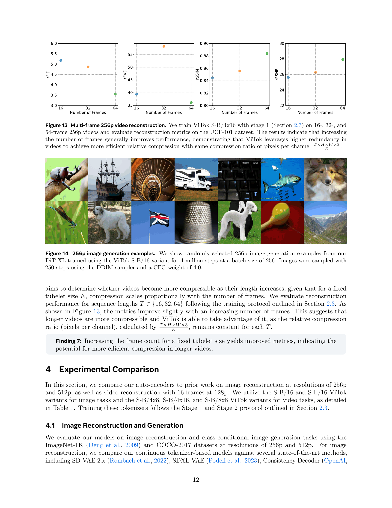

 


 2501.09755 
 Philippe Hansen-Estruch et el. 
 
 🤗 2025-01-17 
 



↗ arXiv


↗ Hugging Face


↗ Papers with Code


### TL;DR



최근 몇 년 동안, **트랜스포머 기반 생성 모델의 확장**을 통해 이미지 및 비디오 생성 분야에서 괄목할 만한 발전이 있었습니다. 하지만, 이러한 모델의 핵심 구성 요소인 **시각적 토크나이저(visual tokenizer)**는 상대적으로 적게 연구되어 왔습니다. 이는 토크나이저 설계 방식이 재구성 및 생성 성능에 미치는 영향에 대한 명확한 이해가 부족하기 때문입니다. 본 논문에서는 이러한 문제를 해결하기 위해 **대규모 이미지 및 비디오 데이터셋을 사용하여 비전 변환기 아키텍처 기반의 새로운 토크나이저인 ViTok을 제시합니다.**

ViTok은 기존의 합성곱 신경망(CNN) 기반 토크나이저 대신 **Vision Transformer 아키텍처**를 사용하여 설계되었으며, **독립적으로 인코더와 디코더의 크기를 조절**하여 재구성 및 생성 성능에 미치는 영향을 분석했습니다.  실험 결과, **인코더 크기 확장은 성능 향상에 거의 기여하지 않지만, 디코더 크기 확장은 재구성 성능을 향상**시키는 것으로 나타났습니다. 또한, ViTok은 기존의 최첨단 토크나이저보다 훨씬 적은 계산 비용으로 경쟁력 있는 성능을 달성함을 보였습니다. 이는 **대규모 데이터셋을 활용한 시각적 토크나이저의 확장성 연구**에 대한 중요한 기여이며, 향후 이미지 및 비디오 생성 모델 개발에 큰 영향을 줄 것으로 기대됩니다.



#### Key Takeaways


 자동 인코더의 병목 크기(bottleneck size)는 재구성 성능과 밀접한 관련이 있지만, 생성 성능과의 관계는 복잡하다. 



 인코더 확장은 재구성 및 생성 성능 향상에 거의 기여하지 않지만, 디코더 확장은 재구성 성능을 향상시키는 효과를 보인다. 



 ViTok은 기존 자동 인코더보다 2~5배 적은 FLOP을 사용하면서 ImageNet-1K 및 COCO 재구성 작업과 UCF-101 비디오 재구성 작업에서 경쟁력 있는 성능을 달성한다. 


#### Why does it matter?
본 논문은 **비전 변환기 토크나이저(ViTok)의 확장성 연구**를 통해 이미지 및 비디오 생성 모델의 성능 향상에 기여합니다.  **자동 인코더의 확장성에 대한 체계적인 탐구를 통해 얻은 결과는, 기존의 컨볼루션 기반 토크나이저를 능가하는 경쟁력 있는 성능을 보이는 동시에 계산 비용을 크게 줄이는 경량화된 토크나이저 설계에 대한 새로운 지침을 제시합니다.** 이는 향후 연구에 큰 영향을 미칠 것이며, 특히 **대규모 데이터셋을 사용하는 이미지 및 비디오 생성 모델의 개발에 중요한 의미**를 지닙니다.

------
#### Visual Insights

> 🔼 본 그림은 논문에서 제시된 ViTok 아키텍처와 크기 조정에 대한 주요 결과를 보여줍니다. 왼쪽에는 비대칭 오토인코더 프레임워크인 ViTok의 아키텍처가 나와 있습니다. ViTok은 기존 CNN 기반 오토인코더를 개선하여 비전 트랜스포머(ViT)와 업그레이드된 Llama 아키텍처를 통합합니다. 시각적 입력은 패치 또는 튜블릿으로 임베딩되고, 컴팩트한 Llama 인코더로 처리되어 잠재 코드를 생성합니다. 인코딩된 표현은 업샘플링되어 더 큰 Llama 디코더로 처리되어 입력을 재구성합니다. 오른쪽에는 인코더 크기 조정, 병목 크기 조정, 디코더 크기 조정의 효과를 강조하는 색상 코드가 포함된 텍스트 상자가 있습니다. 또한 손실 최적화의 절충 및 비디오 데이터에 대한 모델 적응성을 논의합니다. 최고 성능의 ViTok 변형은 기존 최첨단 토큰화기와 비교하여 경쟁력 있는 성능을 달성하면서 계산 부담을 줄입니다.
> 

> 
read the caption

> Figure 1: Our learnings from scaling ViTok. We showcase our ViTok architecture (left) and key findings (right) from scaling auto-encoders for image and video reconstruction and generation. We enhance traditional CNN-based auto-encoders by integrating Vision Transformers (ViTs) with an upgraded Llama architecture into an asymmetric auto-encoder framework forming Vision Transformer Tokenizer or ViTok. Visual inputs are embedded as patches or tubelets, processed by a compact Llama Encoder, and bottlenecked to create a latent code. The encoded representation is then upsampled and handled by a larger Llama Decoder to reconstruct the input. Color-coded text boxes highlight the effects of scaling the encoder, adjusting the bottleneck size, and expanding the decoder. Additionally, we discuss trade-offs in loss optimization and the model’s adaptability to video data. Our best performing ViTok variant achieves competitive performance with prior state-of-the-art tokenizers while reducing computational burden.
> 


| Model | Hidden Dimension | Blocks | Heads | Parameters (M) | GFLOPs |
|---|---|---|---|---|---| 
| Small (S) | 768 | 6 | 12 | 43.3 | 11.6 |
| Base (B) | 768 | 12 | 12 | 85.8 | 23.1 |
| Large (L) | 1152 | 24 | 16 | 383.7 | 101.8 |

> 🔼 표 1은 논문에서 제시된 ViTok 모델의 크기와 FLOPs(Floating Point Operations)를 보여줍니다. ViTok 모델은 인코더와 디코더의 크기, 그리고 tubelet 크기(q와 p)를 조합하여 다양한 변형을 만들 수 있습니다. 예를 들어, ViTok S-B/4x16은 작은(Small) 인코더와 기본(Base) 디코더를 사용하고, tubelet 크기는 q=4, p=16인 모델입니다. 논문에서는 기존의 작은(Small) 모델을 수정하여 히든 차원을 384에서 768로 늘리고, 블록 수를 12에서 6으로 줄여 FLOPs와 파라미터 수를 약간 증가시켰습니다. 또한, 큰(Large) 모델의 경우 3D RoPE(Rotary Position Embedding) 통합을 위해 히든 차원을 1024에서 1152로 늘렸습니다.  표에는 각 모델의 히든 차원, 블록 수, 헤드 수, 파라미터 수(백만 단위), 그리고 FLOPs가 나와 있습니다.
> 

> 
read the caption

> Table 1: Model Sizes and FLOPs for ViTok. We describe ViTok variants by specifying the encoder and decoder sizes separately, along with the tubelet sizes. For example, ViTok S-B/4x16 refers to a model with an encoder of size Small (S) and a decoder of size Base (B), using tubelet size q=4𝑞4q=4italic_q = 4 and p=16𝑝16p=16italic_p = 16. We modified the traditional Small (S) model by increasing its hidden dimension from 384 to 768 and reducing the number of blocks from 12 to 6 to increase flops and parameters slightly. Additionally, for the Large (L) model, we increased the hidden dimension to 1152 from 1024 to ensure divisibility by 3 for 3D RoPE integration.
> 

### In-depth insights

#### Scaling Autoencoders
본 논문에서 다룬 오토인코더의 스케일링에 대한 심층적인 분석은 **bottleneck 크기, 인코더 크기, 그리고 디코더 크기** 등 세 가지 주요 요소의 영향을 조사함으로써 시작됩니다. 연구 결과에 따르면, **bottleneck 크기는 재구성 성능과 밀접한 관련이 있지만, 생성 성능과의 관계는 더 복잡**하다는 것을 보여줍니다. 특히, bottleneck이 너무 커지면 재구성 품질은 향상되지만 생성 성능은 저하될 수 있습니다. **인코더 크기의 확장은 재구성 또는 생성 성능에 거의 영향을 미치지 않거나 오히려 해가 될 수 있다는 점이 밝혀졌습니다.** 이는 더 복잡한 잠재 공간을 모델링하는 것이 더 어려울 수 있음을 시사합니다. 반면에 **디코더 크기의 확장은 재구성 성능을 향상시키는 효과가 있지만 생성 성능에 미치는 영향은 제한적**입니다. 이는 디코더가 제한된 정보를 기반으로 이미지의 지역적 특징을 채우는 생성 모델의 역할을 일부 수행하기 때문일 수 있습니다.  **손실 함수의 최적화**는 재구성 정확도와 생성 품질 사이의 균형을 맞추는 데 중요한 역할을 합니다.  결론적으로, 오토인코더의 단순한 스케일링만으로는 생성 성능을 향상시킬 수 없다는 것을 알 수 있습니다. **오히려 생성 모델 자체를 스케일링하는 것이 더 효과적일 수 있습니다.**

#### ViTok Architecture
본 논문에서 제시된 ViTok 아키텍처는 기존의 합성곱 신경망(CNN) 기반의 자동 인코더 대신 **비전 트랜스포머(ViT)**와 **라마(Llama)** 아키텍처를 결합하여 이미지와 비디오 토큰화에 효율성과 성능을 개선한 모델입니다.  **비대칭적인 구조**를 가지는데, 이미지 패치 또는 비디오 튜블릿을 입력받아 라마 인코더를 통해 저차원의 잠재 공간으로 압축하고, 라마 디코더를 통해 고해상도의 이미지나 비디오를 재구성합니다.  **인코더와 디코더의 비대칭적인 스케일링**을 통해 재구성과 생성 성능 간의 균형을 맞추는 전략을 사용하는 점이 특징입니다.  **병목 현상(bottleneck) 크기 조절**을 통해 재구성 품질과 생성 성능 간의 상관관계를 분석하고,  **데이터 제약 없이 대규모 데이터셋**을 이용하여 모델을 학습시킴으로써 토큰화 과정의 스케일링 효과를 극대화하는 것을 목표로 합니다.  **경량화된 설계**를 통해 기존의 최첨단 자동 인코더보다 적은 연산량(FLOPs)으로 경쟁력 있는 성능을 달성하는 것을 확인하였습니다.

#### Bottleneck Analysis
본 논문에서 병목 분석은 주로 **자동 인코더의 차원 축소(Bottleneck)**에 초점을 맞추고 있습니다.  이는 입력 이미지 또는 비디오의 고차원 픽셀 데이터를 저차원의 잠재 벡터로 압축하는 과정에서 발생하는 제약을 분석하는 것을 의미합니다.  논문은 이러한 병목 현상이 재구성(Reconstruction) 성능과 생성(Generation) 성능에 미치는 영향을 면밀히 조사하여, **병목 크기가 재구성 성능과 밀접한 상관관계를 가지지만, 생성 성능과의 관계는 더 복잡함**을 보여줍니다.  **병목 크기를 늘리면 재구성 성능은 향상되지만,  일정 수준을 넘어서면 생성 성능이 저하**될 수 있음을 발견했습니다. 이는 병목 현상이 단순히 데이터 압축 문제가 아니라, 생성 모델의 학습 및 추론 과정에도 영향을 미치는 복합적인 요소임을 시사합니다. 따라서, 최적의 생성 성능을 위해서는 **재구성과 생성 간의 균형을 고려하여 병목 크기를 조절**해야 한다는 결론을 도출합니다.  **인코더와 디코더의 개별적인 스케일링 효과**에 대한 분석도 포함되어 있으며, 이를 통해 효율적인 모델 설계를 위한 중요한 시사점을 제공합니다.

#### Decoder's Role
본 논문은 디코더의 역할에 대해 심도있게 다루고 있습니다. **디코더는 단순한 재구성(reconstruction)을 넘어 생성적 모델(generative model)의 역할도 수행**한다는 점을 강조하고 있습니다. 특히, 손실 함수(loss function)의 선택에 따라 디코더의 역할이 재구성 정확도(fidelity)와 생성 품질(quality) 사이에서 **균형을 이루는 방식**으로 변화한다는 점을 보여줍니다.  **GAN(Generative Adversarial Network) 손실 함수를 추가하면 디코더는 생성적 모델의 특성을 더욱 강하게 갖게 되어 재구성 정확도는 다소 떨어지지만, 생성 품질은 향상**됩니다. 이는 디코더가 단순히 인코더로부터 받은 잠재 표현(latent representation)을 복원하는 것이 아니라,  **제한적인 정보를 바탕으로 새로운 이미지나 비디오를 생성하는 역할**을 한다는 것을 의미합니다.  따라서, **디코더의 크기 조정(scaling)은 단순히 재구성 성능만을 향상시키는 것이 아니라 생성 성능에도 영향**을 미치며,  **두 가지 성능을 모두 고려하여 최적의 디코더 크기를 결정**해야 함을 시사합니다.  결론적으로, 디코더는 재구성과 생성 모두에 중요한 역할을 하며, **손실 함수와 디코더 크기 조정을 통해 생성 성능을 최적화** 할 수 있다는 점이 중요한 발견입니다.

#### Video Tokenization
이 논문은 비디오 토큰화에 대한 심층적인 통찰력을 제공합니다. **비디오 토큰화는 픽셀을 저차원잠재 공간으로 압축하는 과정**으로, 최근 몇 년간 이미지 및 비디오 생성 모델에서 괄목할 만한 발전을 이끌었습니다. 이는 **변환기 기반 생성기의 확장**과 밀접한 관련이 있으며, 이를 통해 고해상도 이미지 및 비디오 생성이 가능해졌습니다.  **자동 인코더 설계 선택**이 재구성 및 다운스트림 생성 성능에 미치는 영향에 대한 질문에 초점을 맞추고 있습니다.  논문에서는 기존의 합성곱 신경망(CNN) 백본을 향상된 비전 변환기 아키텍처로 대체하여 비디오 토큰화를 개선하는 방안을 제시합니다. 이러한 개선을 통해 대규모 이미지 및 비디오 데이터 세트에서 자동 인코더를 확장할 수 있으며, 이로 인해 토큰화 확장에 대한 데이터 제약이 제거되었습니다.  **결과적으로, 향상된 재구성 및 생성 성능**을 달성하였으며, 특히 16프레임 128p 비디오 재구성 작업에서 기존 자동 인코더를 능가하는 경쟁력 있는 성능을 달성하였습니다.  **전체적으로, 이 논문은 비디오 토큰화의 확장에 대한 중요한 통찰력을 제공하며, 향후 이미지 및 비디오 생성 모델 개발에 귀중한 기여를 할 것으로 예상됩니다.**

### More visual insights

More on figures

> 🔼 본 그림은 256픽셀 해상도 이미지의 재구성 작업에서 총 부동 소수점 연산 수(E)의 영향을 조사한 실험 결과를 보여줍니다. ViTok S-B 모델을 사용하여 패치 크기(p)와 채널 수(c)를 다양하게 조합하여 E 값을 변화시키면서, 재구성 성능 평가 지표인 FID, IS, SSIM, PSNR의 변화를 측정했습니다. 실험 결과, E의 로그 값과 재구성 성능 지표들의 로그 값 사이에 강한 상관관계가 있음을 보여줍니다.  이는 오토인코더가 사용하는 FLOPs의 수와는 무관하게, E가 재구성 성능의 주요 병목 현상임을 시사합니다. 또한, ImageNet-1K와 COCO 데이터셋 모두에서 유사한 경향이 관찰되어, 이러한 패턴이 데이터셋 종류와 무관하게 일관됨을 확인했습니다.
> 

> 
read the caption

> Figure 2: 256p image reconstruction sweep over floating points E𝐸Eitalic_E. We evaluate ViTok S-B trained with stage 1 (Section 2.3) using combinations of patch sizes p∈8,16,32𝑝81632p\in{8,16,32}italic_p ∈ 8 , 16 , 32 and channel widths c∈4,8,16,32,64𝑐48163264c\in{4,8,16,32,64}italic_c ∈ 4 , 8 , 16 , 32 , 64 to investigate how the total floating points E=2562p2⋅c𝐸⋅superscript2562superscript𝑝2𝑐E=\frac{256^{2}}{p^{2}}\cdot citalic_E = divide start_ARG 256 start_POSTSUPERSCRIPT 2 end_POSTSUPERSCRIPT end_ARG start_ARG italic_p start_POSTSUPERSCRIPT 2 end_POSTSUPERSCRIPT end_ARG ⋅ italic_c influences FID, IS, SSIM, and PSNR in reconstruction tasks. Our findings reveal a strong correlation between log⁡(E)𝐸\log(E)roman_log ( italic_E ) and log⁡(rFID)rFID\log(\text{rFID})roman_log ( rFID ), log⁡(E)𝐸\log(E)roman_log ( italic_E ) and rIS, log⁡(E)𝐸\log(E)roman_log ( italic_E ) and rSSIM, as well as log⁡(E)𝐸\log(E)roman_log ( italic_E ) and rPSNR, independent of the number of FLOPs utilized by the auto-encoder. This indicates that E𝐸Eitalic_E is the primary bottleneck for reconstruction, irrespective of the code shape or FLOPs expended. Additionally, similar trends are observed across the ImageNet-1K and COCO datasets, indicating that these patterns are consistent regardless of the dataset used.
> 

> 🔼 그림 3은 ViTok S-B/16 모델을 사용하여 채널 크기(c)를 64, 32, 16, 8, 4로 조절함으로써 얻은, 다양한 부동소수점 E 값에 따른 256p 이미지 재구성 시각화를 보여줍니다. 각 행은 채널 크기가 다른 이미지를 보여주며, E 값이 감소함에 따라 고주파수 디테일이 줄어들고 작은 색상과 미세한 디테일이 점차 사라지는 것을 보여줍니다. E가 4096보다 작으면 질감이 섞이고 디테일 손실이 상당히 발생합니다.  즉, E 값(잠재 공간의 차원)이 클수록 더욱 정교하고 세밀한 이미지 재구성이 가능하지만, E 값이 너무 작으면 이미지의 중요한 디테일이 손실되어 재구성 품질이 저하되는 것을 보여줍니다.
> 

> 
read the caption

> Figure 3:  256p image reconstruction visualization over floating points E𝐸Eitalic_E. Example reconstructions for varying the number of floating points E𝐸Eitalic_E values on ViTok S-B/16, achieved by adjusting the channel size c=64,32,16,8,4𝑐64321684c={64,32,16,8,4}italic_c = 64 , 32 , 16 , 8 , 4 for each image across the row. As E𝐸Eitalic_E decreases, high-frequency details diminish, with small colors and fine details gradually lost. When E<4096𝐸4096E<4096italic_E < 4096, textures merge, and significant detail loss becomes apparent.
> 

> 🔼 그림 4는 512픽셀 해상도 이미지에 대한 재구성 성능을 보여줍니다.  ViTok S-B 모델을 사용하여 패치 크기(p)를 8, 16, 32로 다양하게 변경하면서 채널 너비(c)는 16으로 고정하고 실험하였습니다.  총 부동 소수점 연산 횟수(E)는 512²/(p²) * c 로 계산됩니다.  이 그림은 E가 FID, IS, SSIM, PSNR과 같은 재구성 지표에 미치는 영향을 분석합니다. 256픽셀 해상도 결과(그림 2)와 유사한 경향을 보이지만, 512픽셀 해상도에서 256픽셀 해상도와 동일한 rPSNR/rSSIM을 달성하려면 E 값이 4배 필요하다는 것을 보여줍니다. 즉, 성능을 유지하려면 픽셀 대비 채널 비율을 고정해야 함을 시사합니다.
> 

> 
read the caption

> Figure 4: 512p Image reconstruction over E𝐸Eitalic_E. We evaluate ViTok S-B trained with stage 1 (Section 2.3) across all combinations of patch sizes p∈8,16,32𝑝81632p\in{8,16,32}italic_p ∈ 8 , 16 , 32 and a fixed channel width c=16𝑐16c=16italic_c = 16, analyzing how the total floating-point operations, calculated as E=5122p2⋅c𝐸⋅superscript5122superscript𝑝2𝑐E=\frac{512^{2}}{p^{2}}\cdot citalic_E = divide start_ARG 512 start_POSTSUPERSCRIPT 2 end_POSTSUPERSCRIPT end_ARG start_ARG italic_p start_POSTSUPERSCRIPT 2 end_POSTSUPERSCRIPT end_ARG ⋅ italic_c, influence reconstruction metrics such as FID, IS, SSIM, and PSNR. E𝐸Eitalic_E shows trends similar to 256p results (Figure 2). However, achieving comparable rPSNR/rSSIM to 256p requires 4×E4𝐸4\times E4 × italic_E for 512p reconstruction, which indicates that compression ratio of pixels to channels should be fixed to maintain performance.
> 

> 🔼 그림 5는 다양한 크기의 잠재 코드(E)를 사용하여 이미지 생성 성능을 평가한 결과를 보여줍니다. 그림 2에서 사용된 토크나이저를 DiT 모델에 적용하여 CFG(classifier-free guidance) 비율 1.5와 3.0에 대한 결과를 각각 왼쪽과 오른쪽에 나타냈습니다. log(E)와 생성 성능 간에는 강한 선형 상관관계가 없음을 보여줍니다. 대신, 각 패치 크기(p)에 대해 최적의 E 값이 존재하는 2차 함수 형태의 경향이 나타났습니다. 즉, E와 채널 수(c) 간의 복잡한 상호작용이 있음을 의미합니다. 따라서 재구성 품질과 생성 성능 간의 균형을 맞추려면 두 매개변수(E와 c)를 모두 최적화해야 함을 시사합니다.
> 

> 
read the caption

> Figure 5: 256p image generation over E𝐸Eitalic_E. We evaluate each tokenizer from Figure 2 on DiT following Section 2.3. Results for CFG scales of 1.5 and 3.0 are on the left two and right two plots respectively. Our results show no strong linear correlation between log⁡(E)𝐸\log(E)roman_log ( italic_E ) and generation performance. Instead, a second-order trend reveals an optimal E𝐸Eitalic_E for each patch size p𝑝pitalic_p, indicating a complex interplay between E𝐸Eitalic_E and c𝑐citalic_c. This highlights the necessity of optimizing both parameters to balance reconstruction quality with generative capabilities.
> 

> 🔼 그림 6은 256p 이미지 재구성에 대한 인코더 크기 조정 결과를 보여줍니다.  고정된 패치 크기(p=16), 채널 수(c=16), 토큰 수(L=256), 총 부동 소수점 수(E=4096)를 유지한 채, 인코더 크기를 S-S, B-S, S-B, B-B, B-L, L-L 로 변경하면서 실험을 진행했습니다.  실험 결과, 인코더 크기와 재구성 성능 간에는 상관관계가 없음을 확인했습니다. 즉, 인코더 크기를 키운다고 해서 재구성 성능이 향상되지 않았다는 의미입니다. 이는 시각적 인코딩에 많은 계산이 필요하지 않다는 것을 시사합니다.
> 

> 
read the caption

> Figure 6: Encoder scaling on 256p image reconstruction. We evaluate reconstruction metrics of ViTok trained with stage 1 (Section 2.3) over model sizes S-S, B-S, S-B, B-B, B-L, L-L with fixed p=16,c=16,L=256,E=4096formulae-sequence𝑝16formulae-sequence𝑐16formulae-sequence𝐿256𝐸4096p=16,c=16,L=256,E=4096italic_p = 16 , italic_c = 16 , italic_L = 256 , italic_E = 4096. There is no correlation between encoder size and reconstruction performance indicating that scaling the encoder is unhelpful in improving reconstruction capabilities. This argues that visual encoding does not require much computation.
> 

> 🔼 그림 7은 256p 이미지 재구성에 대한 디코더 크기 조정 결과를 보여줍니다. 그림 6의 결과를 바탕으로, 다양한 디코더 크기(S, B, L)에 따른 재구성 성능을 비교 분석했습니다. 분석 결과, 디코더 크기와 재구성 성능 간에는 강한 상관관계가 있음을 확인했습니다. 즉, 디코더 크기를 키울수록 재구성 성능이 향상됩니다. 하지만, 디코더 크기를 Base에서 Large로 증가시키는 것보다 E를 4096에서 8192로 두 배 증가시키는 것이 재구성 성능 향상에 더 효과적임을 보여줍니다.
> 

> 
read the caption

> Figure 7: Decoder scaling on 256p image reconstruction. Using the results from Figure 6, we plot various decoder sizes (S, B, L) over reconstruction performance. There is a strong correlation between decoder size and reconstruction performance, which indicates scaling the decoder improves reconstruction. Although, increasing the decoder size from Base to Large does not provide the same boost of performance as doubling E𝐸Eitalic_E to 8192819281928192 from 4096409640964096.
> 

> 🔼 그림 8은 256p 이미지 생성에 대한 인코더 크기 조정 결과를 보여줍니다. 그림 6의 각 토크나이저를 섹션 2.3에 따라 DiT에서 평가하고, 인코더 크기에 따른 생성 지표 결과를 CFG 배율 1.5와 3.0에 대해 각각 왼쪽 두 그래프와 오른쪽 두 그래프에 표시합니다. 인코더 크기가 커질수록 성능이 다소 저하되는 약한 음의 상관관계가 나타나며, 인코더 크기 증가는 훈련 속도 저하로 이어집니다.
> 

> 
read the caption

> Figure 8: Encoder scaling on 256p image generation. We evaluate each tokenizer from Figure 6 on DiT following Section 2.3. We plot encoder size over generation metric results for CFG scales of 1.5 and 3.0 on the left two and right two plots respectively. There is a weak negative correlation between encoder size and final performance indicating that scaling the encoder is harmful for generation results. This is coupled by the fact that increased encoder sizes make training slower due to increased computational overhead.
> 

> 🔼 그림 9는 256픽셀 이미지 생성에 대한 디코더 크기 조정 결과를 보여줍니다. 그림 6의 결과를 바탕으로, 다양한 디코더 크기(S, B, L)에 따른 생성 성능을 보여줍니다. CFG 배율 1.5와 3.0에 대한 생성 지표 결과를 왼쪽 두 그래프와 오른쪽 두 그래프에 각각 표시했습니다. 재구성과 달리, 디코더 크기와 생성 성능 간에는 명확한 상관관계가 없습니다. 이는 디코더 크기 조정이 자동 인코딩에 미치는 영향이 미미함을 시사합니다.
> 

> 
read the caption

> Figure 9: Decoder scaling on 256p image generation. Using the results from Figure 6, we plot various decoder sizes (S, B, L) over generation performance. We plot decoder size over generation metric results for CFG scales of 1.5 and 3.0 on the left two and right two plots respectively. Unlike reconstruction, there is no clear correlation between decoder size and generation performance. This indicates that scaling the decoder has minimal benefits overall for auto-encoding.
> 

More on tables


| Ground Truth | 16384 | 8192 | 4096 | 2048 | 1024 |
|---|---|---|---|---|---|---|
|  |  |  |  |  |  |
|  |  |  |  |  |  |
|  |  |  |  |  |  |
> 🔼 표 2는 다양한 정밀도(float32 및 bfloat16)를 사용하여 훈련된 ViTok S-B/16 모델의 256p 이미지 재구성 성능을 비교 분석한 표입니다. 그림 2와 동일한 방식으로 훈련된 모델의 성능을 비교하여, E 값(잠재 공간의 총 부동소수점 수)이 재구성 성능에 영향을 미치는 반면, 정밀도 변화는 영향을 미치지 않음을 보여줍니다.  즉, 높은 정밀도를 사용해도 E 값의 변화 없이 성능 향상은 제한적임을 의미합니다.
> 

> 
read the caption

> Table 2: Precision comparison for E𝐸Eitalic_E. We train ViTok S-B/16 with full float32 precision and bfloat16 autocasting on 256p images in same fashion as Figure 2. The performance is close indicating that E𝐸Eitalic_E isn’t effected by changing precision.
> 


| Precision | rFID | rIS | rSSIM | rPSNR |
|---|---|---|---|---|
| BFloat16 | 1.63 | 194 | 0.79 | 26.1 |
| Float32 | 1.62 | 194 | 0.80 | 26.1 |
> 🔼 표 3은 256픽셀 해상도의 이미지 재구성 성능을 비교 분석한 표입니다.  ImageNet-1K와 COCO-2017 검증 세트에서 ViTok의 재구성 성능을 평가하고, 동등한 압축률(16배 공간 압축)을 가진 CNN 기반 토크나이저와 비교 분석했습니다.  ViTok S-B/16 토크나이저는 ImageNet-1K와 COCO 데이터 세트 모두에서 최첨단(SOTA) rFID 점수를 달성하여 다른 CNN 기반 연속 토크나이저보다 뛰어난 성능을 보였으며, FLOP(부동 소수점 연산) 사용량은 훨씬 적었습니다.  또한 ViTok은 기존 방식들과 비교하여 SSIM 및 PSNR 지표에서도 경쟁력 있는 성능을 유지했습니다. 디코더 크기를 Large로 확장하면 ViTok의 모든 재구성 수치가 향상됩니다.
> 

> 
read the caption

> Table 3: 256p image reconstruction comparison. We assess the reconstruction performance of ViTok on the 256p ImageNet-1K and COCO-2017 validation sets, benchmarking them against CNN-based tokenizers with an equivalent compression ratio (×16absent16\times 16× 16 spatial compression). Our ViTok S-B/16 tokenizer achieves state-of-the-art (SOTA) rFID scores on both ImageNet-1K and COCO datasets, outperforming other CNN-based continuous tokenizers while utilizing significantly fewer FLOPs. Furthermore, ViTok maintains competitive performance in SSIM and PSNR metrics compared to prior methods. When scaling decoder size to Large, ViTok improves all its reconstruction numbers.
> 


| Name | Params (M) | GFLOPs | ImageNet rFID ↓ | ImageNet PSNR ↑ | ImageNet SSIM ↑ | COCO rFID ↓ | COCO PSNR ↑ | COCO SSIM ↑ |
|---|---|---|---|---|---|---|---|---|
| SD-VAE | 59.3 | 162.2 | 0.78 | 25.08 | 0.705 | 4.63 | 24.82 | 0.720 |
| SDXL-VAE | - | - | 0.68 | 26.04 | **0.834** | 4.07 | 25.76 | **0.845** |
| OAI | - | - | 0.81 | 24.43 | 0.786 | 4.59 | 24.19 | 0.800 |
| Cosmos-CI | - | - | 2.02 | **31.74** | 0.700 | 5.6 | **31.74** | 0.703 |
| ViTok S-B/16 | 129.0 | 34.8 | 0.50 | 24.36 | 0.747 | 3.94 | 24.45 | 0.759 |
| ViTok S-L/16 | 426.8 | 113.4 | **0.46** | 24.74 | 0.758 | **3.87** | 24.82 | 0.771 |
> 🔼 표 4는 512p 해상도의 이미지 재구성 성능을 비교 분석한 표입니다. 최고 성능을 보이는 ViTok 토크나이저를 ImageNet-1K 및 COCO-2017 검증 세트에 대해 평가하고, 공간 압축률이 동일한 CNN 기반 토크나이저와 비교 분석했습니다. ViTok S-B/16 토크나이저는 모든 지표에서 최첨단(SOTA) 결과를 유지하면서 계산 비용을 크게 줄였습니다.
> 

> 
read the caption

> Table 4: 512p image reconstruction comparison. We assess the reconstruction performance of our top-performing tokenizers on the 512p ImageNet-1K and COCO-2017 validation sets, benchmarking them against a CNN-based tokenizer with an equivalent compression ratio (×16absent16\times 16× 16 spatial compression). Our ViTok S-B/16 tokenizer maintains state-of-the-art (SOTA) results across all metrics, while maintaining computational significantly reducing flops.
> 


| Name | Params(M) | GFLOPs | ImageNet rFID↓ | ImageNet PSNR↑ | ImageNet SSIM↑ | COCO rFID↓ | COCO PSNR↑ | COCO SSIM↑ |
|---|---|---|---|---|---|---|---|---|
| SD-VAE | 59.3 | 653.8 | 0.19 | - | - | - | - | - |
| ViTok S-B/16 | 129.0 | 160.8 | **0.18** | 26.72 | 0.803 | **2.00** | 26.14 | 0.790 |
> 🔼 표 5는 128p 비디오 재구성 결과를 보여줍니다.  UCF-101 데이터셋의 11,000개 영상을 사용하여 ViTok의 세 가지 변형 모델 (S-B/4x8, S-B/8x8, S-B/4x16)의 성능을 평가했습니다.  각 모델은 비디오 프레임 크기 16x128x128에 대해 서로 다른 압축률을 적용했습니다.  ViTok S-B/4x8 모델은 rFVD(Fréchet Video Distance) 및 다양한 압축 통계 지표에서 최첨단(SOTA) 성능을 달성했습니다.  S-B/8x8과 S-B/4x16 모델 또한 경쟁력 있는 재구성 결과를 보여주었습니다.  ViTok은 기존의 트랜스포머 기반 방법들에 비해 필요한 FLOPs(연산량)을 줄였습니다.
> 

> 
read the caption

> Table 5: 128p Video Reconstruction. We evaluate S-B/4x8, S-B/8x8, and S-B/4x16 on video reconstruction for 16×\times×128×\times×128 video on UCF-101 11k train set. ViTok S-B/4x8 achieves SOTA performance in rFVD and various compression statistics. ViTok S-B/8x8 and ViTok S-B/4x16 also provide competitive reconstruction numbers for the compression rate performed. ViTok also reduces the total FLOPs required from prior transformer based methods.
> 


| Method | Params(M) | GFLOPs | # Tokens | rFID↓ | rFVD↓ | PSNR↑ | SSIM↑ |
|---|---|---|---|---|---|---|---| 
| TATS | 32 | Unk | 2048 | - | 162 | - | - |
| MAGViT | 158 | Unk | 1280 | - | 25 | 22.0 | .701 |
| MAGViTv2 | 158 | Unk | 1280 | - | 16.12 | - | - |
| LARP-L-Long | 174 | 505.3 | 1024 | - | 20 | - | - |
| ViTok S-B/4x8 | 129 | 160.8 | 1024 | 2.13 | 8.04 | 30.11 | 0.923 |
| ViTok S-B/8x8 | 129 | 73.2 | 512 | 2.78 | 20.05 | 28.55 | 0.898 |
| ViTok S-B/4x16 | 129 | 34.8 | 256 | 4.46 | 53.98 | 26.26 | 0.850 |
> 🔼 표 6은 ImageNet-1K 데이터셋에서 256p 및 512p 해상도로 수행된 조건부 이미지 생성 작업에 대한 결과를 보여줍니다.  기존의 연속 확산 생성 모델(예: SD-VAE + DiT)과 비교하여 ViTok의 성능을 평가했습니다.  결과는 256p와 512p 해상도 모두에서 ViTok의 성능이 기존 모델들과 경쟁력이 있음을 보여줍니다.
> 

> 
read the caption

> Table 6: Class Conditional Image Generation Results. We evaluate our tokenizers on class-conditional generation at resolutions of 256p and 512p on the ImageNet-1K dataset compared to prior methods. ViTok performance is competitive with prior continuous diffusion geneation methods like SD-VAE + DiT for both 256p and 512p generation.
> 


| Tokenizer | Generator | Params (M) | 256p Generation gFID↓ | 256p Generation gIS↑ | 512p Generation gFID↓ | 512p Generation gIS↑ |
|---|---|---|---|---|---|---|
| SD-VAE | LDM-4 | 400 | 3.60 | 247.7 | - | - |
| SD-VAE | DiT-XL/2 | 675 | 2.27 | 278.24 | 3.04 | 240.82 |
| Taming-VQGAN | Taming-Transformer | 1400 | 15.78 | - | - | - |
| TikTok-B | MaskGIT-ViT | 177 | 2.48 | - | 2.49 | - |
| ViTok S-B/16 | DiT-XL | 675 | 2.45 | 284.39 | 3.41 | 251.46 |
> 🔼 표 7은 128p 해상도의 비디오에 대한 클래스 조건부 생성 성능을 보여줍니다.  UCF-101 데이터셋을 사용하여 다양한 토크나이저(ViTok 포함)의 성능을 비교 분석했습니다.  압축률이 비슷한 다른 방법들과 비교했을 때, ViTok S-B/4x8은 최첨단(SOTA) 성능을 달성했습니다.  더 공격적인 토크나이저 변형인 ViTok S-B/8x8 또한 기존 방법들보다 우수한 성능을 보였습니다.
> 

> 
read the caption

> Table 7: 128p class conditional video generation. We evaluate our tokenizers on class-conditional generation 16×\times×128×\times×128 on the UCF-101 dataset compared to prior methods. ViTok S-B/4x8 achieves SOTA performance when used with a comparable compression ratio with prior methods, though even our more aggressive tokenizer variant ViTok S-B/8x8 achieves SOTA results compared to prior methods.
> 

### Full paper



