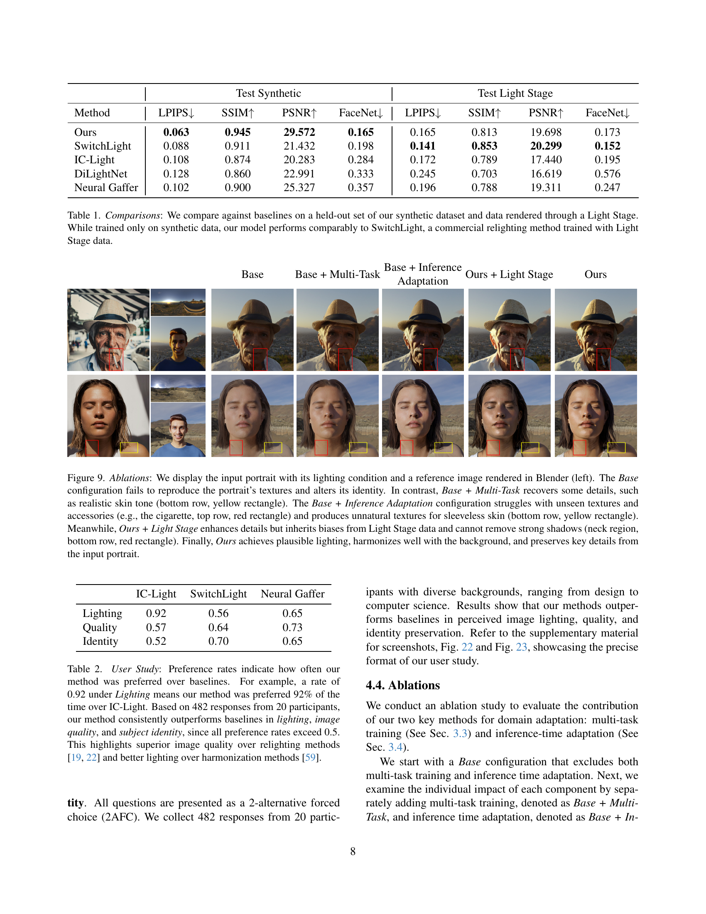
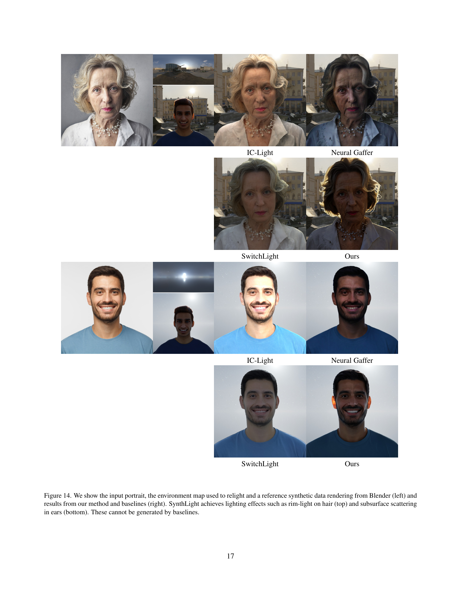

 


 2501.09756 
 Sumit Chaturvedi et el. 
 
 🤗 2025-01-17 
 



↗ arXiv


↗ Hugging Face


↗ Papers with Code


### TL;DR



기존의 초상화 조명 재현 방법들은 실제 데이터에 대한 의존도가 높거나, 물리 기반 렌더링 엔진을 이용한 복잡한 처리 과정이 필요하다는 한계점을 가지고 있습니다.  **이러한 문제를 해결하기 위해 본 논문에서는 합성 데이터를 이용한 새로운 방법을 제시**합니다.  특히, 물리 기반 렌더링 엔진을 사용하여 합성 데이터셋을 생성하고, 이를 통해 확산 모델을 학습시켜 실제 사진의 조명을 재현하는 기술을 개발했습니다.

본 연구는 **합성 데이터와 실제 이미지 간의 차이를 최소화하기 위해 다중 작업 학습 및 추론 시간 적응 전략을 제시**합니다.  **다중 작업 학습 전략은 실제 이미지 데이터를 활용하여 모델의 일반화 성능을 향상**시키고, **추론 시간 적응 전략은 실제 사진의 세부적인 특징을 보존**하도록 합니다.  실험 결과, 제시된 방법은 기존의 방법들보다 우수한 성능을 보이며, 다양한 실제 사진에 대해서도 높은 정확도를 보였습니다. 이를 통해 **사실적이고 다양한 조명 효과를 가진 초상화 이미지를 생성**할 수 있습니다.



#### Key Takeaways


 합성 데이터 기반의 초상화 조명 재현 모델 SynthLight 개발 



 다중 작업 학습 및 추론 시간 적응 전략을 통해 실제 이미지와의 차이를 최소화 



 다양한 실제 사진에 대한 일반화 성능 우수 및 기존 방법 대비 성능 향상 


#### Why does it matter?
본 논문은 **합성 데이터를 사용하여 초상화 사진의 조명을 재현하는 새로운 방법**을 제시하여, 실제 사진의 조명을 조작하는 데 있어서의 어려움을 극복하고자 합니다. **기존의 방법들은 실제 데이터에 대한 의존도가 높거나 복잡한 처리 과정을 필요로** 했지만, 본 연구는 **합성 데이터를 활용하여 이러한 문제점들을 해결**하고, **다양한 환경에서의 조명 효과를 사실적으로 재현**할 수 있음을 보여줍니다. 이는 **실제 이미지 처리 분야에 큰 영향을 미칠** 수 있으며, **새로운 연구 방향을 제시**할 수 있다는 점에서 중요합니다. 또한, 본 연구에서 제시된 **다중 작업 학습 및 추론 시간 적응 전략은 다른 영역에서의 이미지 처리 작업에도 적용 가능**합니다.

------
#### Visual Insights

> 🔼 SynthLight는 환경 맵 조명을 사용하여 인물 사진에 대한 재조명을 수행합니다. 합성 인간 얼굴을 재 렌더링하는 것을 학습함으로써, 확산 모델은 목 부분의 뚜렷한 그림자와 피부의 자연스러운 반사광을 포함하여 실제 인물 사진에 사실적인 조명 효과를 생성합니다. 재조명을 위해 합성 머리 사진으로만 학습되었음에도 불구하고, 이 모델은 다양한 시나리오에 대해 놀라운 일반화 능력을 보여주며, 반신 사진과 전신 조각상까지도 성공적으로 처리합니다.
> 

> 
read the caption

> Figure 1: SynthLight performs relighting on portraits using an environment map lighting. By learning to re-render synthetic human faces, our diffusion model produces realistic illumination effects on real portrait photographs, including distinct cast shadows on the neck and natural specular highlights on the skin. Despite being trained exclusively on synthetic headshot images for relighting, the model demonstrates remarkable generalization to diverse scenarios, successfully handling half-body portraits and even full-body figurines.
> 


|---|---|---|---|---|---|---|---|
|https://arxiv.org/html/2501.09756/figures/extra_results/teaser_row_11/col_00.jpg|https://arxiv.org/html/2501.09756/figures/extra_results/teaser_row_11/col_03.jpg|https://arxiv.org/html/2501.09756/figures/extra_results/teaser_row_11/col_06.jpg|https://arxiv.org/html/2501.09756/figures/extra_results/teaser_row_11/col_09.jpg|https://arxiv.org/html/2501.09756/figures/extra_results/teaser_row_10/col_00.jpg|https://arxiv.org/html/2501.09756/figures/extra_results/teaser_row_10/col_02.jpg|https://arxiv.org/html/2501.09756/figures/extra_results/teaser_row_10/col_05.jpg|https://arxiv.org/html/2501.09756/figures/extra_results/teaser_row_10/col_08.jpg|
|https://arxiv.org/html/2501.09756/figures/extra_figures/extra_teaser_row_06/col_00.jpg|https://arxiv.org/html/2501.09756/figures/extra_figures/extra_teaser_row_06/col_01.jpg|https://arxiv.org/html/2501.09756/figures/extra_figures/extra_teaser_row_06/col_03.jpg|https://arxiv.org/html/2501.09756/figures/extra_figures/extra_teaser_row_06/col_09.jpg|https://arxiv.org/html/2501.09756/figures/teaser_figure/teaser_row_22/col_00.jpg|https://arxiv.org/html/2501.09756/figures/toy_figures_3/toy_figure_row_00/col_08.jpg|https://arxiv.org/html/2501.09756/figures/toy_figures_3/toy_figure_row_00/col_02.jpg|https://arxiv.org/html/2501.09756/figures/toy_figures_3/toy_figure_row_00/col_09.jpg|


> 🔼 이 표는 합성 데이터와 Light Stage 데이터에서 훈련된 여러 기법들의 성능을 비교 분석한 결과를 보여줍니다. SynthLight는 합성 데이터로만 훈련되었지만, Light Stage 데이터로 훈련된 상용 이미지 재조명 기법인 SwitchLight와 비슷한 수준의 성능을 보여줍니다. LPIPS, SSIM, PSNR, FaceNet과 같은 다양한 지표를 사용하여 합성 데이터셋과 Light Stage 데이터셋에서의 성능을 정량적으로 평가했습니다.
> 

> 
read the caption

> Table 1: Comparisons: We compare against baselines on a held-out set of our synthetic dataset and data rendered through a Light Stage. While trained only on synthetic data, our model performs comparably to SwitchLight, a commercial relighting method trained with Light Stage data.
> 

### In-depth insights

#### Diffusion Model Relighting
본 논문에서 제시된 확산 모델을 이용한 조명 재현 기법은 **합성 데이터**를 기반으로 실제 인물 사진의 조명을 사실적으로 재현하는 데 초점을 맞추고 있습니다.  **물리 기반 렌더링 엔진**을 사용하여 다양한 조명 환경에서 합성 얼굴 데이터셋을 생성하고, 이를 통해 조명 변화에 따른 픽셀 변환을 학습합니다.  **다중 작업 학습 전략**을 통해 실제 사진 데이터의 도메인 지식을 활용하여 합성 데이터와의 차이를 줄이고, 추론 단계에서는 **분류기 없는 안내** 기법을 통해 입력 이미지의 세부 정보를 유지하면서 조명 효과를 적용합니다.  **합성 데이터의 한계**를 극복하기 위해 실제 이미지 데이터를 활용하는 다중 작업 학습과 입력 이미지의 세부 정보를 보존하는 추론 단계의 기법은 **실제 이미지에 대한 일반화 능력**을 높이는 데 중요한 역할을 합니다. 이러한 접근 방식은 기존의 역그래픽스 기반 방법에 비해 **복잡한 조명 효과**를 더욱 사실적으로 구현할 수 있다는 장점을 가지고 있습니다. 

#### Multi-Task Training
본 논문에서 제안하는 다중 작업 학습(Multi-Task Training) 전략은 **합성 데이터와 실제 이미지 데이터 간의 차이를 줄이기 위한 핵심**입니다. 단순히 합성 데이터만으로 학습할 경우, 실제 이미지에 대한 일반화 성능이 저하될 수 있습니다. 이를 해결하기 위해, **텍스트-이미지 생성 작업을 추가적인 작업으로 도입**하여, 모델이 실제 이미지의 특징을 학습하도록 유도합니다.  **두 가지 작업을 동시에 학습**함으로써, 모델은 합성 데이터에서 relighting에 대한 지식을 얻는 동시에, 실제 이미지의 다양한 특성을 학습하여, **도메인 간격(Domain Gap)을 효과적으로 해소**합니다. 이는 **실제 이미지에 대한 일반화 성능을 향상**시키고, 더욱 사실적이고 세밀한 relighting 결과를 얻는 데 중요한 역할을 합니다. **합성 데이터의 한계를 보완**하고, **모델의 성능을 극대화**하는 효과적인 전략임을 보여줍니다.

#### Domain Gap Bridging
이 논문에서 **도메인 간극 해소**는 합성 데이터로 훈련된 확산 모델이 실제 사진에 사실적으로 적용될 수 있도록 하는 핵심 과제입니다.  **합성 데이터**는 물리 기반 렌더링 엔진을 사용하여 생성되지만, 실제 사진과는 차이가 존재합니다. 따라서, 이러한 차이를 줄이기 위해 **다중 작업 학습**과 **추론 시간 적응 기법**이 제시됩니다. 다중 작업 학습은 실제 사진 데이터를 활용하여 모델의 일반화 능력을 향상시키고, 추론 시간 적응 기법은 입력 이미지의 세부 정보를 보존하면서 재조명 효과를 생성합니다. 이러한 접근 방식은 **합성 데이터와 실제 사진 데이터 간의 차이를 줄이는 데 효과적**임을 보여주며, **실제 사진에 대한 모델의 일반화 성능을 크게 향상**시키는 것으로 나타났습니다.  **도메인 간극**을 효과적으로 해소함으로써,  이 연구는 **합성 데이터만을 사용한 훈련**에도 불구하고, **실제 사진에서도 우수한 성능**을 보이는 **실용적인 포트레이트 재조명 모델**을 제시합니다.

#### Real-world Generalization
본 논문에서 다룬 합성 데이터 기반의 초상화 재조명 모델의 실세계 일반화 능력은 매우 중요한 평가 지표입니다. **합성 데이터는 실제 이미지와 차이가 있기 때문에, 모델이 실제 이미지에도 효과적으로 적용될 수 있는지 확인하는 것이 필수적입니다.** 이는 모델의 견고성과 실용성을 판단하는 데 중요한 역할을 합니다.  **실세계 이미지에 대한 일반화 성능은 모델의 학습 과정과 데이터 구성에 크게 좌우됩니다.**  다양한 조명 조건, 얼굴 표정, 배경 등을 포함하는 다양한 실제 이미지 데이터셋을 활용하여 모델을 평가해야 합니다. **모델의 성능을 정량적으로 평가하기 위해서는 PSNR, SSIM과 같은 객관적인 지표와 더불어, 사람의 주관적인 평가를 반영한 사용자 연구도 함께 진행하는 것이 필요합니다.**  실제 이미지에 대한 일반화 능력을 향상시키기 위해서는 **도메인 적응 기법**을 활용하는 것을 고려해야 합니다.  **이를 통해 합성 데이터와 실제 데이터 간의 차이를 줄이고, 모델의 성능을 향상시킬 수 있습니다.**  결론적으로, 실세계 일반화는 재조명 모델의 성공 여부를 결정하는 중요한 요소이며, **모델 개발 과정에서 충분한 고려와 엄격한 평가가 이루어져야 합니다.**

#### Future Improvements
향후 개선 방향으로는 **합성 데이터의 질 향상**을 위한 노력이 중요합니다. 보다 다양한 조명 환경, 얼굴 표정, 의상, 배경 등을 포함하는 고품질 합성 데이터셋을 구축하면 모델의 일반화 성능을 크게 향상시킬 수 있습니다.  또한, **실제 이미지와의 도메인 격차를 줄이기 위한 연구**도 필요합니다.  이를 위해 실제 이미지 데이터를 활용한 다양한 도메인 적응 기법을 모색하거나,  **합성 이미지의 현실감을 높이는 새로운 렌더링 기법**을 개발할 수 있습니다.  마지막으로, **모델의 효율성 및 추론 속도 개선**을 위한 연구도 중요합니다.  현재 모델은 상당한 계산 자원을 필요로 하므로, 경량화된 모델 구조를 설계하거나, 효율적인 추론 알고리즘을 개발하여 실시간 응용에 적합하게 만들 수 있습니다. 이러한 개선들을 통해 더욱 정교하고 효율적인 초상화 재조명 모델을 개발할 수 있을 것입니다.

### More visual insights

More on figures

> 🔼 이 그림은 논문의 3.1절(Synthetic Data for Relighting)에서 설명하는 합성 얼굴 데이터셋을 보여줍니다. 각 쌍은 동일한 3D 얼굴 모델을 두 가지 다른 환경 맵 조명(environment map lighting) 아래에서 렌더링한 결과입니다.  신경망은 하나의 환경 맵으로 렌더링된 이미지를 다른 환경 맵으로 렌더링된 이미지로 변환하는 작업을 학습합니다. 즉, 조명 변화에 따른 이미지의 변화를 학습하는 것입니다. 이는 초상화의 재조명(relighting)을 위한 합성 데이터셋을 생성하는 방법을 보여주는 예시입니다.
> 

> 
read the caption

> Figure 2: Synthetic Faces: Subjects are rendered under various lighting conditions (details in  Sec. 3.1). We show two examples, where each pair consists of a subject rendered using two different environment maps. The network is trained to re-render synthetic faces by transforming a subject rendered with one environment map into its counterpart rendered with the other environment map.
> 

> 🔼 SynthLight의 훈련 과정을 보여주는 그림입니다. 그림 상단(Task 1)은 3.2절에서 자세히 설명하는 합성 데이터를 사용하여 확산 모델의 기본 구조를 훈련시켜 재조명 모델링을 가능하게 하는 과정을 나타냅니다. 합성 이미지와 실제 이미지 영역 간의 차이를 줄이기 위해 실제 이미지를 사용하지 않고 텍스트-이미지 생성 작업(Task 2, 하단)을 추가하여 함께 훈련시킵니다(3.3절). 이 모델은 LDM [34]을 기반으로 하며 VAE와 U-Net으로 구성됩니다. 그림에서는 단순화를 위해 VAE는 생략되었습니다.
> 

> 
read the caption

> Figure 3: Training pipeline of SynthLight. We first enable the relighting modeling by training the diffusion backbone with synthetic relighting tuples (Task 1, top row), detailed in Sec. 3.2. To further alleviate the domain gap between synthetic and real image domain, we include a joint training of the text-to-image task (Task 2, bottom row), detailed in Sec. 3.3. Our model is based on LDM [34] and is composed of a VAE and a UNet. For simplicity, VAE is omitted in the diagram.
> 

> 🔼 이 그림은 SynthLight 모델의 추론 과정에서 이미지 조건화 분류기 없는 안내(classifier-free guidance)를 사용하여 초상화의 원본 특징을 유지하면서 조명 효과를 조절하는 방법을 보여줍니다.  구체적으로, 입력 이미지와 조명 환경 맵을 네트워크에 입력하여 초상화의 재조명 결과를 생성합니다.  여기서, 이미지 조건화 분류기 없는 안내는 입력 이미지의 세부 정보를 보존하면서 조명 효과의 강도를 조절하는 데 사용됩니다.  그림은 입력 이미지, 조명 맵, 그리고 다양한 안내 비율(guidance scale, λ₁)에 따른 재조명 결과를 보여줌으로써 안내 비율의 변화가 초상화의 디테일 보존과 조명 효과 사이의 균형에 미치는 영향을 시각적으로 보여줍니다.  최종 점수 계산은 본문의 식 (2)에 따라 이루어집니다.
> 

> 
read the caption

> Figure 4: We employ the image-conditioning classifier-free guidance during inference to proportionally balance between identity preservation, and relighting effects. The final score estimate is computed as per Eq. 2.
> 

More on tables


|---|---|---|---|
| {width=76 height=76} | {width=76 height=76} | {width=76 height=76} | {width=76 height=76} |
> 🔼 이 표는 사용자 연구 결과를 보여줍니다. 20명의 참가자로부터 482개의 응답을 기반으로, 제시된 세 가지 기준(조명, 이미지 품질, 피사체 식별)에서 SynthLight 방법이 기준 방법들보다 일관되게 우수하다는 것을 보여줍니다. 각 기준에 대해 SynthLight가 다른 방법보다 선호된 비율을 백분율로 나타냅니다. 예를 들어 조명 기준에서 0.92는 SynthLight가 IC-Light보다 92% 더 선호되었음을 의미합니다. 모든 선호율이 0.5를 초과하여 SynthLight의 우수성을 보여줍니다. 특히 기존의 재조명 방법들 [22, 19]에 비해 이미지 품질이 뛰어나고, 조화 방법 [59]에 비해 조명이 더 우수함을 강조합니다.
> 

> 
read the caption

> Table 2: User Study: Preference rates indicate how often our method was preferred over baselines. For example, a rate of 0.92 under Lighting means our method was preferred 92% of the time over IC-Light. Based on 482 responses from 20 participants, our method consistently outperforms baselines in lighting, image quality, and subject identity, since all preference rates exceed 0.5. This highlights superior image quality over relighting methods [22, 19] and better lighting over harmonization methods [59].
> 


|---|---|---|---|---|---|---|
| {width=122 height=122} | {width=81 height=122} | {width=81 height=122} | {width=81 height=122} | {width=122 height=122} | {width=81 height=122} | {width=81 height=122} |
> 🔼 표 3은 SynthLight 모델의 성능에 기여하는 각 구성 요소(다중 작업 학습 및 추론 시간 적응)의 기여도를 보여줍니다. 다중 작업 학습은 실제 이미지 데이터를 추가하여 모델의 일반화 능력을 향상시키고, 추론 시간 적응은 입력 이미지의 세부 정보를 보존하는 데 도움이 됩니다. 추가적으로 Light Stage 데이터를 사용하여 학습하면 Light Stage 테스트 세트의 성능이 향상되고, 이미지의 세부 정보가 향상되지만 조명에 편향이 발생할 수 있습니다(그림 9 참조).
> 

> 
read the caption

> Table 3: Ablations highlight the contributions of each component i.e. Multi-Task training and Inference-time Adaptation (Sec. 3.3 and Sec. 3.4 respectively). Adding Light Stage data during training improves performance on Light Stage Test set, and qualitatively improves details but brings lighting biases (See Fig. 9).
> 


|---|---|---|---|---|---|---|
| {width=122 height=122} | {width=81 height=122} | {width=81 height=122} | {width=122 height=122} | {width=81 height=122} | {width=81 height=122} | {width=81 height=122} |

> 🔼 표 4는 훈련된 확산 모델의 초기화 방법에 따른 성능 비교 결과를 보여줍니다. IC-Light와 SD 1.5 두 가지 방법으로 초기화한 모델을 평가하여, 각 초기화 방법에 따른 성능 차이를 분석합니다. 본 논문의 모든 표는 classifier-free guidance 매개변수 λT=2, λI=3을 사용하여 생성되었으며, 세부 내용은 본 논문을 참조하십시오.
> 

> 
read the caption

> Table 4: Ablating initial checkpoint: We evaluate our method, initialized with IC-Light, against initialization with SD 1.5. All tables in both main paper and supplementary, including non-inference specific ablations, are generated with classifier-free guidance parameters, λT=2subscript𝜆𝑇2\lambda_{T}=2italic_λ start_POSTSUBSCRIPT italic_T end_POSTSUBSCRIPT = 2, λI=3subscript𝜆𝐼3\lambda_{I}=3italic_λ start_POSTSUBSCRIPT italic_I end_POSTSUBSCRIPT = 3. See main paper for detailed descriptions of them.
> 

### Full paper



