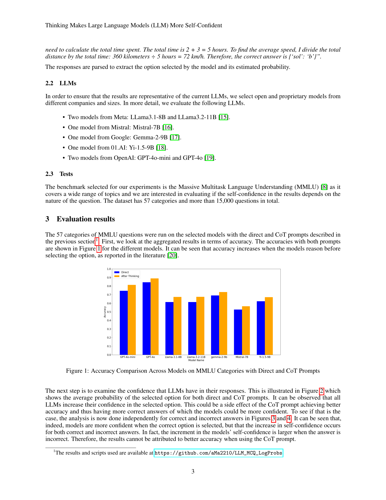

 


 2501.09775 
 Tairan Fu et el. 
 
 🤗 2025-01-20 
 



↗ arXiv


↗ Hugging Face


↗ Papers with Code


### TL;DR



대규모 언어 모델(LLM)의 성능 평가는 어렵습니다. 특히, 답변이 자연어로 제공되고 다양한 주제를 다루기 때문입니다.  기존의 정확도 기반 평가 방식은 모델의 불확실성이나 신뢰도에 대한 정보를 제공하지 못합니다.  본 연구는 이러한 한계를 극복하기 위해 다지선다형 문제를 이용한 새로운 평가 방식을 제안합니다. 

본 연구에서는 LLM이 답변을 직접 제시하는 경우와 추론 과정을 거쳐 답변을 제시하는 두 가지 경우를 비교 분석했습니다.  그 결과, 추론 과정을 거친 경우 LLM의 자체 신뢰도가 높아지는 것을 발견했습니다. 이는 정답 여부와 무관하게 나타나는 현상이며, 다양한 LLM 모델과 주제에 걸쳐 일관되게 관찰되었습니다.  이러한 결과는 LLM의 내부 동작 방식과 인간의 인지 과정에 대한 이해를 높이는 데 기여할 수 있습니다.



#### Key Takeaways


 LLM이 다지선다 문제에 대한 답변을 제시하기 전에 추론 과정을 거치도록 하면, 정답 여부에 관계없이 모델이 자신의 답변에 대한 확신을 더 크게 갖게 됩니다. 



 LLM의 자체 신뢰도는 정확도와 높은 상관관계를 보이지 않으며, 이는 LLM의 신뢰도 추정에 내재된 한계를 보여줍니다. 



 이러한 현상은 인간의 인지 과정에서도 관찰되는 현상으로, 답변에 대한 설명이 신뢰도를 높이는 것과 유사합니다. 


#### Why does it matter?
본 논문은 **LLM의 자체 신뢰도 측정에 대한 새로운 관점**을 제시하며, **추론 과정이 포함된 답변**에서 신뢰도가 향상되는 현상을 밝혔습니다. 이는 LLM 평가 방법 개선 및 인간의 인지 과정 이해에 중요한 시사점을 제공하며, **향후 연구 방향**을 제시합니다.  LLM의 신뢰도를 정확하게 평가하는 것은 LLM의 안전성 및 신뢰성을 확보하는 데 매우 중요하며, 본 연구는 이러한 측면에서 **중요한 기여**를 합니다.

------
#### Visual Insights

> 🔼 본 그림은 다양한 언어 모델들에 대해, 질문에 대한 답변을 바로 제시하는 방식(Direct)과, 먼저 추론 과정을 거친 후 답변을 제시하는 방식(Chain of Thought, CoT)을 비교하여, Massive Multitask Language Understanding (MMLU) 벤치마크에서 각 모델의 정확도를 보여줍니다.  Direct 방식과 CoT 방식의 정확도 차이를 시각적으로 비교하여 어떤 방식이 각 모델의 성능 향상에 더 효과적인지 보여주는 비교 분석 결과를 나타냅니다.
> 

> 
read the caption

> Figure 1: Accuracy Comparison Across Models on MMLU Categories with Direct and CoT Prompts
> 

### In-depth insights

#### LLM Confidence Metrics
LLM 신뢰도 측정은 **정확도만으로는 불충분**하며, 모델의 응답에 대한 확신 정도를 나타내는 추가적인 지표가 필요합니다.  본 논문은 다양한 LLM의 MCQ 응답에서 **신뢰도 척도로서 예측 확률**을 활용하였습니다.  **추론 과정을 거친 후의 답변에 대한 신뢰도가 더 높게 나타났는데**, 이는 추론 과정이 예측 확률을 수정하여 최종 선택에 영향을 미치기 때문으로 해석됩니다.  **정답 여부와 무관하게 신뢰도가 증가**하는 현상은 주목할 만하며,  LLM의 내재적 한계를 보여주는 동시에 인간의 응답 과정과 유사한 점을 시사합니다.  **인간처럼 설명을 제공하는 행위가 신뢰도를 높이는 경향**은 LLM 평가 방식에 대한 심도있는 이해를 요구하며, **신뢰도 측정 지표의 한계와 개선 방향**에 대한 추가 연구가 필요함을 강조합니다.

#### Reasoning's Impact
이 논문은 큰 언어 모델(LLM)이 다중 선택 질문(MCQ)에 답할 때 추론의 영향을 심층적으로 분석합니다. **추론 과정을 거친 후의 답변에 대한 LLM의 확신도가 높아지는 경향**을 보여줍니다. 이는 정답 여부와 무관하게 나타나는 현상이며, 모델의 추론 능력 향상과 직접적인 상관관계는 없음을 시사합니다. **LLM이 부정확한 답변에 대해 더욱 확신하는 경향**은 인간의 인지 과정과 유사하며, 이는 LLM의 확신도 측정 방식의 한계를 보여줍니다. **추론 과정은 LLM의 확신도에 영향**을 미치지만, 정확도와는 일관된 관계를 보이지 않아, LLM 평가에 있어서 확신도만으로는 부족함을 강조합니다. 따라서 LLM의 성능 평가에는 정확도와 더불어 추론 과정의 질적 분석이 필수적임을 시사합니다.

#### MCQ Evaluation
본 논문은 대규모 언어 모델(LLM)의 성능 평가에서 **객관식 질문(MCQ)**의 중요성을 강조합니다. MCQ 평가는 자동화된 처리가 가능하고 다양한 주제에 대한 지식을 효율적으로 평가할 수 있다는 장점이 있습니다. 그러나 단순 정답률만으로는 LLM의 자신감 수준을 파악하기 어렵다는 한계가 존재합니다.  본 연구는 LLM이 답변을 직접 제시하는 경우와 추론 과정을 거쳐 답변을 제시하는 경우의 자신감 수준을 비교 분석하여 **추론 과정이 LLM의 자신감을 높이는 데 기여한다는 사실**을 밝혀냈습니다. 이는 정답 여부와 무관하게 나타나는 현상이며, 추론 과정이 답변에 대한 확률을 수정함으로써 자신감에 영향을 미친다는 가설을 제시합니다. **인간의 경우에도 답변에 대한 설명을 추가하면 자신감이 증가하는 것**과 유사한 현상임을 지적하며, LLM의 확률 추정 방식에 내재된 한계를 인지하고 평가 절차에 활용하는 방법을 제안합니다.

#### Cross-Model Analysis
본 논문에서는 다양한 대규모 언어 모델(LLM)에 대한 비교 분석이 부족합니다. 따라서 **다양한 LLM을 대상으로 한 교차 모델 분석(Cross-Model Analysis)**은 매우 중요한 부분입니다. 이 분석은 모델 간의 성능 차이를 밝히고, 각 모델의 강점과 약점을 파악하는 데 도움이 됩니다. 특히, **모델의 크기, 학습 데이터, 아키텍처 등의 차이가 성능에 어떻게 영향을 미치는지** 분석하는 것은 매우 중요합니다. 또한, **각 모델의 신뢰도(Confidence)를 비교 분석**하여 신뢰도 추정 방법의 효율성 및 한계를 파악하는 것도 중요한 연구 주제가 될 것입니다.  **다양한 질문 유형에 대한 모델의 성능을 비교 분석**하는 것도 중요합니다. 이를 통해 어떤 유형의 질문에 특정 모델이 더 강점을 보이는지 파악할 수 있습니다. 마지막으로, **모델의 일반화 능력(Generalization)**을 평가하기 위해 다양한 데이터셋에 대한 성능을 비교 분석하는 것이 중요합니다. 이러한 교차 모델 분석을 통해 LLM의 성능 향상 및 신뢰도 개선에 기여할 수 있을 것입니다.

#### Future Research
미래 연구는 **LLM의 자신감과 정확도 간의 관계를 더 깊이 있게 탐구**하는 데 초점을 맞춰야 합니다.  인간의 인지 과정과 LLM의 행동 간의 유사점과 차이점을 비교 분석하여, LLM의 자신감 추정치를 평가 절차에 효과적으로 활용할 수 있는 방안을 모색해야 합니다.  **다양한 유형의 질문과 과제에 대한 LLM의 성능 및 자신감 수준을 비교 분석**하여, 모델의 강점과 약점을 파악하고 개선 방향을 제시해야 합니다. 특히, 추론 과정이 필요한 복잡한 질문에 대한 LLM의 성능을 개선하는 연구가 중요하며, 이를 위해 **추론 과정을 명시적으로 모델링하고 평가하는 새로운 방법론** 개발이 필요합니다.  또한, LLM의 자신감 추정치를 보다 정확하고 신뢰할 수 있도록 하는 기술 개발도 중요한 연구 과제입니다.  **LLM의 편향성을 고려한 자신감 추정 및 평가 방법론**을 개발하고, 다양한 도메인 및 언어에 대한 일반화 성능을 향상시키는 연구도 필요합니다. 최종적으로는, **LLM의 자신감 추정치를 활용하여 보다 효율적이고 신뢰할 수 있는 LLM 평가 시스템**을 구축하는 데 기여해야 합니다.

### More visual insights

More on figures

> 🔼 본 그림은 다양한 언어 모델(LLM)에서 직접적인 프롬프트와 사고 과정(Chain of Thoughts, CoT) 프롬프트를 사용하여 MMLU(Massive Multitask Language Understanding) 벤치마크의 질문들에 대한 답변 선택지의 평균 확률을 보여줍니다. CoT 프롬프트는 모델이 답변하기 전에 추론 과정을 제공하도록 유도합니다.  그림을 통해 각 모델에서 직접적인 프롬프트와 CoT 프롬프트를 사용했을 때의 정답 선택 확률을 비교하여, CoT 프롬프트가 모델의 자신감에 어떤 영향을 미치는지 확인할 수 있습니다.
> 

> 
read the caption

> Figure 2: Average Probabilities of Selected Option Across Models on MMLU with Direct and CoT Prompts
> 

> 🔼 이 그림은 MMLU(Massive Multitask Language Understanding) 벤치마크를 사용하여 다양한 언어 모델에서 직접적인 프롬프트와 사고 과정(CoT) 프롬프트를 사용했을 때 정답을 선택한 비율을 보여줍니다.  각 모델에 대해 정답을 선택했을 때의 평균 확률을 직접적인 질문 방식과 사고 과정을 거친 질문 방식으로 나누어 비교합니다.  이를 통해 모델이 답변하기 전에 추론 과정을 거치는 것이 정답에 대한 확신도에 어떤 영향을 미치는지 보여줍니다.
> 

> 
read the caption

> Figure 3: Average Probabilities of Correctly Selected Option Across Models on MMLU with Direct and CoT Prompts
> 

> 🔼 그림 4는 MMLU 벤치마크에서 다양한 모델들이 직접적인 프롬프트와 사고 과정(CoT) 프롬프트를 사용하여 질문에 답변했을 때, 잘못된 답변을 선택했을 확률의 평균값을 보여줍니다.  직접적인 프롬프트는 모델이 답변을 바로 선택하도록 하는 반면, CoT 프롬프트는 모델이 먼저 추론 과정을 거친 후 답변을 선택하도록 유도합니다. 이 그림은 각 모델에 대한 잘못된 답변 선택 확률을 비교하여 CoT 프롬프트 사용 시 잘못된 답변에 대한 모델의 확신도 변화를 분석합니다.
> 

> 
read the caption

> Figure 4: Average Probabilities of Incorrectly Selected Option Across Models on MMLU with Direct and CoT Prompts
> 

> 🔼 본 그림은 MMLU 벤치마크에서 다양한 모델들이 정답을 정확하게 선택했을 때, 선택된 옵션의 확률 분포를 보여줍니다. 각 모델별로 정답을 선택한 확률의 분포를 히스토그램으로 나타내어, 모델들이 정답에 대해 얼마나 확신을 가지고 있는지를 시각적으로 보여줍니다.  Direct 프롬프트와 CoT(Chain of Thought) 프롬프트를 사용한 결과를 비교하여, 어떤 프롬프트에서 모델의 확신도가 더 높아지는지를 보여줍니다.
> 

> 
read the caption

> Figure 5: Probability Distribution of Correctly Selected Option Across Models in MMLU
> 

> 🔼 이 그림은 MMLU(Massive Multitask Language Understanding) 벤치마크에서 다양한 언어 모델이 오답을 선택했을 때, 그 확률 분포를 보여줍니다. 각 모델별로 잘못된 답변을 선택했을 때의 확률 값을 막대 그래프 형태로 나타내어, 각 모델의 자신감 수준과 오류 패턴을 비교 분석하는 데 활용됩니다. Direct 프롬프트와 CoT(Chain of Thoughts) 프롬프트 두 가지 조건에 따른 결과를 비교하여, 추론 과정을 거쳤을 때 모델의 확률 분포가 어떻게 변하는지 확인할 수 있습니다.
> 

> 
read the caption

> Figure 6: Probability Distribution of Incorrectly Selected Option Across Models in MMLU
> 

> 🔼 그림 7은 다양한 모델에서 MMLU(Massive Multitask Language Understanding) 벤치마크의 여러 과목에 대해 정확도, 선택된 옵션의 확률 증가분, 정답에 대한 선택된 옵션의 확률 증가분, 오답에 대한 선택된 옵션의 확률 증가분을 보여줍니다.  각 과목에 대한 모델별로 계산된 세 가지 지표의 변화량을 비교하여, Chain-of-Thought 프롬프트 사용 여부에 따른 모델의 확신도 변화와 정확도 변화의 상관관계를 시각적으로 보여줍니다.
> 

> 
read the caption

> Figure 7: Increments in accuracy, in the probability of the selected option, in the probability of the selected option for correct answers and in the probability of the selected option for incorrect answers for the different subjects in MMLU across models.
> 

### Full paper



