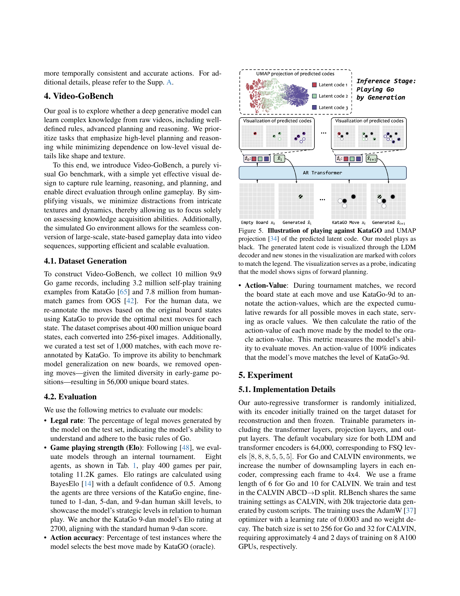

 


 2501.09781 
 Zhongwei Ren et el. 
 
 🤗 2025-01-21 
 



↗ arXiv


↗ Hugging Face


↗ Papers with Code


### TL;DR



기존 AI 연구는 주로 텍스트 기반의 대규모 언어 모델에 집중되어 왔습니다. 하지만, **실제 세계의 지식은 텍스트뿐 아니라 시각적 정보에도 풍부하게 담겨있습니다.**  이러한 한계를 극복하고 시각 정보를 통해 지식을 학습하는 모델을 개발하는 것이 중요한 과제로 떠오르고 있습니다.  특히, **비디오 데이터는 다양한 상황과 복잡한 상호작용을 담고 있어 지식 학습에 유용하지만,  대량의 비표시 데이터를 효율적으로 처리하는 기술이 부족한 상황**입니다.

본 연구는 **비표시 비디오 데이터만을 사용하여 지식을 학습하는 새로운 AI 모델 VideoWorld를 제안**합니다.  **자기 회귀적 비디오 생성 모델**을 기반으로 비디오 데이터에서 **잠재적 동역학 모델(LDM)**을 이용하여 시각적 변화를 효율적으로 표현하고,  **바둑 게임 및 로봇 제어 과제에서 VideoWorld의 성능을 평가**합니다.  실험 결과, VideoWorld는 **바둑 게임에서 전문가 수준의 실력**을, **로봇 제어 과제에서는 기존 모델과 유사한 성능**을 보였습니다.  이는 **비디오 데이터만으로도 고차원적인 추론 및 계획 능력을 학습할 수 있음**을 시사하는 중요한 결과입니다.



#### Key Takeaways


 비디오 데이터만으로도 복잡한 지식 습득이 가능함 



 시각적 변화 표현이 지식 습득에 중요함 



 VideoWorld는 로봇 제어 및 게임에서 우수한 성능을 보임 


#### Why does it matter?
**비지도 학습 방식으로 비디오 데이터만을 사용하여 지식 습득이 가능함을 보여준 본 연구는 AI 분야의 패러다임 전환을 제시합니다.**  이는 **텍스트 기반 모델에 대한 의존성을 줄이고, 시각적 정보를 기반으로 한 보다 직관적이고 강력한 AI 시스템 개발의 가능성을 열어줍니다.**  **특히 로봇 제어 및 게임 분야에서의 성과는 실제 응용 가능성을 시사하며, 추후 연구를 위한 새로운 방향을 제시합니다.**

------
#### Visual Insights

> 🔼 그림 1은 비디오 월드(VideoWorld)가 비표시 비디오로부터 지식 학습을 탐구하는 방식을 보여줍니다.  작업별 규칙부터 고차원 추론 및 계획 기능까지 다양한 수준의 지식을 다룹니다. 강화 학습(RL), 지도 학습(SL), 텍스트 기반 학습과 비교하여 VideoWorld는 세 가지 이점을 제공합니다. 1) 다양한 작업과 인터페이스에 대한 통합된 시각적 표현을 사용하여 일반화 성능이 우수합니다. 2) 수동 주석 작업 부담이 적습니다. 3) 텍스트 설명보다 풍부한 실제 세계 정보를 학습합니다.
> 

> 
read the caption

> Figure 1: VideoWorld explores learning knowledge from unlabeled videos, ranging from task-specific rules to high-level reasoning and planning capabilities. Compared to other learning methods: reinforcement learning (RL), supervised learning (SL) and text-based learning, it offers three advantages: 1) better generalization with unified visual representation for various tasks and interfaces, 2) lower manual annotation burden, and 3) learning richer real-world information than text description.
> 


| Idx | Agent | Train | w/o Search | Input | Legal rate (%) | Action-Value (%) | Best Action Acc. (%) | Tournament Elo |
|---|---|---|---|---|---|---|---|---|
| 1 | KataGO-human-1d | RL | ✗ | State | 100 | 67.6 | 64.5 | 2019 ± 23 |
| 2 | KataGO-human-5d | RL | ✗ | State | 100 | 83.5 | 83.7 | 2253 ± 20 |
| 3 | KataGO-human-9d (Oracle) | RL | ✗ | State | 100 | 100 | 100 | 2700 |
| 4 | Transformer 300M | SL | ✓ | State | 99.8 | 79.7 | 87.2 | 2308 ± 21 |
| 5 | Transformer 300M | SL | ✓ | Video | 99.6 | 59.7 | 58.9 | 1998 ± 38 |
| 6 | VideoWorld 50M (ours) | SL | ✓ | Video | 99.5 | 73.9 | 80.9 | 2093 ± 25 |
| 7 | VideoWorld 150M (ours) | SL | ✓ | Video | 99.7 | 82.0 | 86.7 | 2218 ± 23 |
| 8 | VideoWorld 300M (ours) | SL | ✓ | Video | 99.7 | 83.7 | 88.1 | 2317 ± 25 |

> 🔼 표 1은 Video-GoBench에 대한 비교 결과를 보여줍니다. KataGO-human-9d는 최고 수준의 인간 실력을 나타내며 최적의 행동에 대한 오라클 역할을 합니다. 이 표는 Video-GoBench 데이터셋에서 다양한 모델들의 성능을 비교 분석한 결과를 제시합니다.  모델의 합법적인 수의 비율, 게임 실력(Elo 등급), 행동 정확도, 행동 가치 등의 지표를 통해 모델의 규칙 이해도, 추론 능력, 계획 수립 능력을 평가합니다.  특히 KataGO-human-9d 모델은 인간의 최고 수준 실력을 기준으로 삼아 각 모델의 성능을 객관적으로 평가하는 데 사용됩니다.
> 

> 
read the caption

> Table 1: Comparison on Video-GoBench. KataGO-human-9d represents the highest human level and serve as the Oracle for best actions.
> 

### In-depth insights

#### Vision-only Learning
본 논문은 비지도 학습 방식을 통해 **비디오 데이터만을 이용하여 지식을 학습**하는 비전 전용 학습(Vision-only Learning)에 대한 탐구를 제시합니다.  이는 기존의 텍스트 기반 모델의 한계를 극복하고 시각 정보의 풍부함을 활용하고자 하는 시도입니다.  **비디오 데이터 내 시각적 변화의 표현이 지식 습득에 매우 중요**하며, 효율성을 높이기 위해 잠재 역동 모델(LDM)을 도입하여 압축된 시각 정보 표현을 사용하는 방식을 제안합니다.  실험 결과, 비디오 전용 학습으로도 규칙, 추론 및 계획 능력 등을 포함한 **다양한 지식을 효과적으로 학습**할 수 있음을 보여줍니다. 특히, 바둑 게임과 로봇 제어 작업에서 **전문가 수준의 성능**을 달성했고, 다양한 환경에서 일반화 능력을 갖추는 것을 확인했습니다.  **비디오 전용 학습은 시각 정보를 통해 지식을 습득하는 생물학적 시스템의 원리를 모방**함으로써 인공지능의 새로운 가능성을 제시하며,  향후 연구에 중요한 발판을 마련할 것으로 기대됩니다.

#### Latent Dynamics
잠재 역동성(Latent Dynamics)은 관측 불가능한 변수들의 시간에 따른 변화를 모델링하는 접근 방식입니다. 이는 특히 비디오 데이터에서 **시계열적 패턴과 움직임**을 이해하는 데 중요합니다. 본 논문에서 잠재 역동성 모델은 비디오 프레임의 시퀀스에서 **미래의 시각적 변화를 압축적으로 표현**하기 위해 사용됩니다. 이를 통해 모델은 단순히 현재 프레임만을 고려하는 대신, **장기적인 시계열 정보**를 활용하여 보다 효율적이고 효과적으로 학습할 수 있습니다.  이는 특히 복잡한 추론과 계획 능력이 필요한 Go 게임이나 로봇 제어와 같은 작업에서 중요한 역할을 합니다.  **잠재 공간(latent space) 내에서의 역동성을 모델링**함으로써, 모델은 비효율적인 중복 정보 없이 핵심적인 시각적 변화만을 포착하여 학습 효율을 높이고, 장기적인 예측 및 계획 능력을 향상시킬 수 있습니다.  **잠재 변수들의 시간적 상호작용**을 효과적으로 학습하는 것이 핵심이며, 이를 통해 모델은 단순한 패턴 인식을 넘어 복잡한 시각적 정보의 이해와 추론 능력을 발휘하게 됩니다.  결론적으로, 잠재 역동성 모델은 비디오 기반 지식 학습에서 **효율성과 효과성을 높이는 핵심 요소**입니다.

#### Go & Robotics
본 논문에서 제시된 "Go & Robotics" 섹션은 비지도 학습을 통해 에이전트가 복잡한 지식을 습득하는 능력을 보여주는 핵심적인 부분입니다.  **Go 게임**은 규칙 기반의 추론과 전략적 계획 능력을 평가하는 데 적합한 환경이며, **로봇 제어**는 실제 세계 상호작용과 일반화 능력을 테스트하는 데 이상적입니다.  두 영역 모두에서 모델은 비디오 데이터만으로 훈련되었음에도 불구하고 **놀라운 성능**을 달성했습니다.  Go에서는 전문가 수준에 근접했으며, 로봇 제어에서는 오라클 모델과 유사한 성능을 보였습니다. 이는 **단순한 패턴 인식을 넘어서 추론, 계획, 일반화**와 같은 고차원적인 인지 능력을 획득했음을 시사합니다.  이는 컴퓨터 비전과 강화 학습 분야에 상당한 발전이며, **실제 세계 문제 해결**을 위한 AI 시스템 개발에 중요한 의미를 가집니다.  **비디오 데이터만을 이용한 지식 습득**이 가능하다는 점은 앞으로의 연구 방향에 대한 중요한 함의를 제공하며,  비디오 데이터 기반의 지능형 시스템 개발에 새로운 가능성을 제시합니다.

#### Benchmarking
본 논문에서 제시된 벤치마킹은 **단순히 성능 비교를 넘어, 모델의 지식 습득 능력을 다각적으로 평가하기 위한 설계**임을 알 수 있습니다.  Go 게임과 로봇 조작이라는 상이한 작업에서 모델의 일반화 능력과 추론 능력을 측정하여, 단순히 특정 작업에 대한 학습 성과뿐 아니라 **지식의 범용성과 전이 가능성**을 평가하고 있습니다.  특히, **비지도 학습 환경에서의 성능**을 중점적으로 비교함으로써, 기존의 지도 학습 방식에 의존하는 모델들과의 차별점을 명확히 드러내고 있습니다.  다양한 지표 (합법성, 게임 실력, 행동 정확도 등)를 통해 다차원적인 분석을 수행하여, 모델의 강점과 약점을 포괄적으로 파악하고, 향후 연구 방향을 제시하는 데 기여합니다.  **시각적 정보만으로 복잡한 작업을 수행하는 능력**을 평가하는 벤치마킹의 독창성과, **다양한 실험 환경을 통해 얻어낸 풍부한 데이터**는 연구의 신뢰성을 높입니다.  결론적으로, 이 벤치마킹은 **비지도 시각적 지식 학습 분야의 발전**에 중요한 기여를 할 것으로 예상됩니다.

#### Future Work
**비디오 기반 지식 학습 분야의 발전을 위해서는 대규모 비표지 비디오 데이터셋 구축 및 효율적인 표현 학습 기법 개발이 필수적입니다.**  **VideoWorld 모델의 확장성을 높이기 위한 추가 연구**가 필요하며, 이를 위해서는 **더욱 정교한 시각적 표현 학습 및 효과적인 지식 추론 기법 개발**에 집중해야 합니다.  **다양한 복잡한 작업에 대한 일반화 성능 향상**을 위해 **다중 모달 정보 통합** 및 **강화 학습과의 결합**을 고려해 볼 수 있습니다.  **영상 생성 모델의 효율성 향상**을 위해 **압축된 시각적 정보 표현 기법**을 더욱 개선하고, **모델의 해석성을 높이는 연구**도 병행되어야 합니다.  **실제 로봇 시스템 및 다양한 환경에서의 실험**을 통해 **실제 세계 적용 가능성**을 검증하는 것도 중요한 과제입니다.  **전반적으로, VideoWorld 모델은 비표지 비디오 데이터로부터 복잡한 지식을 학습하는 잠재력을 보여주었지만, 향후 연구를 통해 더욱 발전된 성능 및 일반화 능력을 갖춘 모델 개발이 기대됩니다.**

### More visual insights

More on figures

> 🔼 그림 2는 세 가지 다른 예측 목표 간의 비교를 보여줍니다. '상태', '비디오', 'LDM 포함 비디오'는 세 가지 다른 예측 목표를 나타냅니다.  '상태'는 바둑에서 수의 위치 정보와 같은 상태 시퀀스를 의미합니다. '비디오'는 원시 비디오 시퀀스를, 'LDM 포함 비디오'는 미래의 시각적 변화를 나타내는 잠재 코드로 보강된 비디오 시퀀스를 의미합니다(VideoWorld에서 사용하는 방법).  '행동 가치'는 각 수의 점수를 나타내며, 자세한 내용은 4.2절을 참조하십시오. 풍부한 비디오 정보와 압축된 시각적 변화 표현을 결합함으로써 VideoWorld는 더 효과적인 학습을 가능하게 합니다.
> 

> 
read the caption

> Figure 2: Comparison of prediction targets. “State”, “Video” and “Video w/ LDM” refer to three different prediction targets: a state sequence (e.g., labeled positions of moves in Go), a raw video sequence, and a video sequence augmented with latent codes representing future visual changes (this approach is adopted by VideoWorld). “Action-Value” denotes the score for each move in the game, with details provided in Sec. 4.2. By combining rich video information with a compact representation of visual changes, VideoWorld enables more effective learning.
> 

> 🔼 그림 3은 제안된 VideoWorld 모델 아키텍처의 개요를 보여줍니다. 왼쪽은 전체 아키텍처를, 오른쪽은 제안된 잠재 역동 모델(LDM)을 보여줍니다.  먼저 LDM은 각 프레임에서 후속 H 프레임까지의 시각적 변화를 압축하여 일련의 잠재 코드로 만듭니다. 그런 다음, 자동 회귀 변환기는 LDM의 출력을 다음 토큰 예측 패러다임과 원활하게 통합합니다. 이는 VideoWorld 모델이 비디오 프레임 시퀀스의 시각적 변화를 효율적으로 압축하고 표현하여 비디오로부터 지식을 학습하는 핵심 메커니즘을 보여줍니다.
> 

> 
read the caption

> Figure 3: Overview of the proposed VideoWorld model architecture. (Left) Overall architecture. (Right) The proposed latent dynamics model (LDM). First, LDM compresses the visual changes from each frame to its subsequent H𝐻Hitalic_H frames into a set of latent codes. Then, an auto-regressive transformer seamlessly integrates the output of LDM with the next token prediction paradigm.
> 

> 🔼 그림 4는 학습된 잠재 코드의 UMAP 투영을 보여줍니다. 왼쪽은 바둑, 오른쪽은 CALVIN 로봇 작업에 대한 학습 데이터셋을 나타냅니다. 각 점은 LDM에 의해 생성된 연속적인(양자화 전) 잠재 코드를 나타냅니다. 바둑 예시에서는 홀수 단계가 흰색 돌의 이동을, 짝수 단계가 검은색 돌의 이동을 나타냅니다. 검은색 돌의 이동에 대한 잠재 코드를 2, 4, 6 단계에서 시각화했습니다. 범례는 새로운 검은색 돌 이동에 대해 학습된 일반적인 패턴을 보여줍니다. 명확성을 위해, 이러한 이동은 보드에 추가 색상과 선을 사용하여 강조 표시되어 패턴을 나타냅니다. 오른쪽에는 로봇 팔의 움직임에 대한 잠재 코드를 X, Y, Z축을 따라 1, 5, 10 프레임 간격으로 시각화했습니다. 점들은 변위 범위에 따라 색상이 코딩되어 있으며, 보라색과 빨간색은 서로 반대 방향으로 최대 변위를 나타냅니다.
> 

> 
read the caption

> Figure 4: UMAP projection [34] of the learned latent code on the Go (Left) and CALVIN (right) training set. Each point represents the continuous (pre-quantization) latent code generated by the LDM. In Go examples, odd steps represent white’s moves, and even steps represent black’s moves. We visualize the latent codes of black moves in steps 2/4/6. The legend shows examples of common patterns learned for new black moves. For clarity, these moves are highlighted on the board with added colors and lines to indicate new patterns. On the right, we visualize the latent codes of the robotic arm’s movement along the X/Y/Z axes at intervals of 1, 5, and 10 frames. Points are color-coded by displacement range, with purple and red indicating the maximum displacement in opposite directions along each axis.
> 

> 🔼 그림 5는 KataGO와의 대결 및 예측된 잠재 코드의 UMAP 투영을 보여줍니다. 본 모델은 흑돌을 둡니다. 생성된 잠재 코드는 LDM 디코더를 통해 시각화되며, 시각화된 새로운 돌들은 범례와 일치하는 색상으로 표시됩니다. 이 시각화는 모델이 전향적 계획의 징후를 보여준다는 것을 나타내는 탐침 역할을 합니다. 즉, 모델이 현재의 게임 상황을 넘어 미래의 가능성을 고려하여 수를 선택하는 것을 보여줍니다.
> 

> 
read the caption

> Figure 5: Illustration of playing against KataGO and UMAP projection [34] of the predicted latent code. Our model plays as black. The generated latent code is visualized through the LDM decoder and new stones in the visualization are marked with colors to match the legend. The visualization serves as a probe, indicating that the model shows signs of forward planning.
> 

> 🔼 그림 (a)는 제시된 논문의 4.1절 데이터셋 생성 부분에서 Video-GoBench의 데이터셋 통계를 보여줍니다.  x축은 수를 나타내며, y축은 훈련 세트에 있는 보드 상태의 수를 나타냅니다.  이 그래프는 훈련 데이터셋 내의 보드 상태 수의 분포를 보여주는 히스토그램입니다. 대부분의 보드 상태는 게임 초반(움직임 수가 적은 경우)에 집중되어 있고, 게임이 진행됨에 따라 보드 상태 수가 감소하는 것을 알 수 있습니다.  이것은 다양한 게임 단계를 반영하며 모델이 다양한 게임 상황을 학습하는 데 도움이 됨을 시사합니다.
> 

> 
read the caption

> (a)
> 

> 🔼 그림 (b)는 CALVIN 환경에서의 압축 길이에 따른 성능 변화를 보여줍니다. 기준 모델(baseline)에 비해 압축 길이가 1, 5, 10일 때의 성능을 비교합니다. 압축 길이가 길어짐에 따라 성능이 향상되는 것을 확인할 수 있으며, 이는 LDM이 시계열적 변화를 효과적으로 압축하고 표현함으로써 모델 학습의 효율성과 효과성을 높인다는 것을 시사합니다.
> 

> 
read the caption

> (b)
> 

> 🔼 이 그림은 VideoWorld 모델의 아키텍처를 보여줍니다. 왼쪽에는 전체 아키텍처가, 오른쪽에는 잠재 역동 모델(LDM)이 자세히 나와 있습니다. LDM은 각 프레임에서 후속 프레임들로의 시각적 변화를 잠재 코드 집합으로 압축합니다. 그런 다음 자동 회귀 변환기가 LDM의 출력을 다음 토큰 예측 패러다임과 매끄럽게 통합합니다.
> 

> 
read the caption

> (c)
> 

> 🔼 그림 (d)는 VideoWorld 모델의 LDM에서 사용되는 코드북 크기가 성능에 미치는 영향을 보여줍니다. 코드북 크기가 작을수록 (729) Go와 CALVIN 작업 모두에서 성능이 저하되는 것을 확인할 수 있습니다. 그러나 코드북 크기가 커짐에 따라 (15,625, 64,000) 성능이 향상되다가 특정 지점을 넘어서면 (262,144) 성능이 다시 감소하는 것을 알 수 있습니다. 이는 적절한 크기의 코드북이 효율적인 학습과 지식 획득에 중요함을 시사합니다.  더 큰 코드북은 과도한 정보로 인해 성능을 저하시키고, 작은 코드북은 정보 부족으로 인해 성능 저하를 초래할 수 있습니다.
> 

> 
read the caption

> (d)
> 

> 🔼 이 그림은 데이터 소스 제거 실험의 결과를 보여줍니다.  VideoWorld 모델의 성능에 대한 인간 데이터와 KataGo 데이터의 기여도를 비교 분석합니다.  인간 데이터만 사용했을 때와 KataGo 데이터만 사용했을 때, 그리고 두 데이터를 모두 사용했을 때의 정확도와 성공률을 보여주어, 각 데이터 소스의 VideoWorld 모델 학습에 대한 영향을 정량적으로 평가합니다.
> 

> 
read the caption

> (e)
> 

> 🔼 그림 6은 로봇 조작 과정과 추론 중 예측된 잠재 코드의 UMAP 투영을 보여줍니다. 잠재 코드는 LDM 디코더를 통해 시각화됩니다. UMAP 투영은 서로 다른 작업에 걸쳐 예측된 9개의 잠재 코드(H=9)를 보여주며, 각 점은 작업 유형에 따라 색상이 다릅니다. 노란색 배경의 시각화는 추론 중 모델의 실제 로봇 팔 제어를 보여주고, 녹색 배경의 시각화는 훈련 중 모델의 다음 프레임 예측을 보여줍니다.  이 그림은 모델이 다양한 작업에 대한 잠재적 코드를 생성하고, 실제 로봇 동작과 모델의 예측을 비교하여 모델의 이해도를 보여줍니다.
> 

> 
read the caption

> Figure 6: Illustration of robotic manipulation and UMAP projection of the predicted latent code during inference. Latent codes are visualized through the LDM decoder. The UMAP projection illustrates the 9 predicted latent codes (i.e. H=9𝐻9H=9italic_H = 9) across different tasks, with each point color-coded by task type. Visualizations with a yellow background show the model’s actual robotic arm control during inference, while those with a green background represent the model’s next-frame predictions during training.
> 

> 🔼 (a)는 VideoWorld 모델의 전체 구조를 보여줍니다.  왼쪽은 모델의 전체 아키텍처를, 오른쪽은 잠재 역동 모델(LDM)의 세부 구조를 나타냅니다. VQ-VAE는 비디오 프레임을 잠재 코드로 압축하고, 변환기는 다음 토큰 예측 패러다임과 함께 이 코드를 통합하여 새로운 프레임을 생성합니다. LDM은 연속적인 여러 프레임의 시각적 변화를 잠재 코드 세트로 압축하여 모델의 효율성과 효과를 높입니다.  시각적 변화 패턴(예: 팔의 움직임, 패턴의 변화)은 잠재 역동 모델에 의해 압축되어 잠재 코드로 표현됩니다.
> 

> 
read the caption

> (a)
> 

More on tables


| Agents | Input/Ouput | Task Success Rate (%) - Push | Task Success Rate (%) - Open/Close | Task Success Rate (%) - Turn on/off |
|---|---|---|---|---|
| MCIL [39] | Video/Lab. Action | 33.0 | 38.7 | 41.2 |
| HULC [38] | Video/Lab. Action | 65.8 | 80.9 | 85.3 |
| Transformer (Oracle) | Video/Lab. Action | 75.4 | 95.3 | 96.2 |
| Transformer | Video | 17.3 | 24.1 | 19.2 |
| VideoWorld | Video | 56.2 | 75.4 | 72.1 |
| VideoWorld (+10k data) † | Video | 65.3 | 81.2 | 79.3 |
| VideoWorld (+30k data) ‡ | Video | 72.7 | 91.0 | 93.8 |
> 🔼 표 2는 CALVIN 벤치마크에 대한 비교 결과를 보여줍니다. 'Lab.'은 주석이 달린 레이블을 의미하며, 모든 모델은 3억 개의 매개변수를 가지고 있습니다. †와 ‡는 훈련을 위해 추가적으로 1만 개와 3만 개의 CALVIN 궤적을 사용했음을 나타냅니다.  이 표는 세 가지 로봇 조작 작업(블록 밀기, 서랍 열고 닫기, 조명 켜고 끄기)에 대한 성공률을 비교하여 VideoWorld 모델의 성능을 다른 모델들(MCIL, HULC, Transformer)과 비교 분석합니다. 특히, 비디오 전용 훈련을 받은 VideoWorld 모델이 주석 레이블을 사용한 모델과 비교하여 어느 정도의 성능을 달성하는지 보여줍니다.
> 

> 
read the caption

> Table 2: Comparison on CALVIN benchmark. “Lab.” means annotated labels. All models have 300M parameters. † and ‡ denote using an additional 10k and 30k CALVIN trajectories for training, respectively.
> 


| Agents | CALVIN |  |  | RLBench |  |
|---|---|---|---|---|---|---|
|  | Push | Open/Close | Turn on/off | Microwave | Fridge |
| Transformer (Oracle) | 61.3 | 79.5 | 78.0 | 72.1 | 69.0 |
| Transformer | 6.5 | 13.0 | 15.6 | 12.0 | 10.9 |
| VideoWorld | 56.0 | 74.8 | 74.5 | 67.1 | 62.5 |
> 🔼 표 3은 CALVIN과 RLBench 환경에서 모델을 공동으로 학습시킨 결과를 보여줍니다.  CALVIN과 RLBench는 로봇 조작 작업을 위한 두 가지 다른 환경이며, 이 표는 VideoWorld 모델이 두 환경 모두에서 얼마나 잘 일반화되는지를 보여줍니다.  세 가지 로봇 조작 작업(블록 밀기, 서랍 열고 닫기, 조명 켜고 끄기)에 대한 성공률이 제시됩니다.  'Transformer (Oracle)' 행은 정답 레이블을 사용하여 학습된 모델의 성능을 나타내며, VideoWorld 모델의 성능을 비교하는 기준으로 사용됩니다.  '+10k data' 와 '+30k data' 행은 추가적인 데이터로 학습시킨 VideoWorld 모델의 결과를 보여주어 데이터 확장의 효과를 확인할 수 있도록 합니다.
> 

> 
read the caption

> Table 3: Results of joint training on CALVIN and RLBench.
> 


| Compression length H | Go | Go |
|---|---|---|
| baseline | 47.5 | 44.3 |
| 1 | 70.3 | 77.0 |
| 3 | 72.5 | 80.6 |
| 5 | 73.9 | 80.9 |
> 🔼 표 4는 5천만 매개변수 모델을 기반으로 한 실험 결과를 보여주는 ablation study 결과와 분석을 제시합니다.  다양한 설정 (압축 길이, 코드북 크기, 데이터 소스) 에 따른 성능 변화를 비교 분석하여 VideoWorld 모델의 주요 구성 요소들이 성능에 미치는 영향을 정량적으로 보여줍니다.  Go 게임과 CALVIN 로봇 작업에 대한 결과를 각각 제시하며,  각 요소의 중요성과 효과에 대한 심층적인 이해를 제공합니다.
> 

> 
read the caption

> Table 4: Ablations and analysis. We conduct all experiments based on our 50M model.
> 


| Compression length <math>H</math> | CALVIN |
|---|---|---|
|  | Push | Open/Close | Turn On/Off |
| baseline | 12.7 | 20.8 | 15.6 |
| 1 | 33.7 | 53.6 | 67.3 |
| 5 | 46.8 | 66.1 | 69.6 |
| 10 | 50.3 | 71.1 | 69.7 |
> 🔼 본 표는 5천만개의 파라미터만 사용하여 잠재 코드 예측을 수행했을 때의 결과를 보여줍니다.  Go와 CALVIN 환경에서 비디오와 잠재 코드를 각각 예측 대상으로 설정했을 때의 성능(Action-Value, Action Accuracy)을 보여주는 것을 넘어,  두 가지 정보를 결합하여 예측했을 때의 성능 또한 제시합니다.  잠재 코드만을 이용한 예측이 전체 비디오를 이용한 예측과 비교하여 어느 정도의 성능을 보이는지, 그리고 잠재 코드와 비디오를 함께 사용했을 때 어떤 시너지 효과가 발생하는지 확인할 수 있습니다.
> 

> 
read the caption

> Table 5: Latent code prediction only with 50M parameters.
> 


| Code | Index | Go | Go | 
|---|---|---|---|
| None | Act-Value | 73.9 | 80.9 |
| 1 | 46.2 | 42.1 |
| 2 | 69.5 | 76.6 |
| 3 | 72.1 | 80.6 |
| All | 45.8 | 43.7 |
> 🔼 표 A.1은 본 논문에서 사용된 잠재 역동 모델(LDM)과 자기회귀(AR) 변환기에 대한 학습 설정을 보여줍니다.  LDM과 AR 변환기의 최적화 알고리즘, 학습률, 가중치 감쇠, 모멘텀, 배치 크기, 학습률 스케줄, 웜업 반복 횟수, 최대 반복 횟수, 증강 기법, 손실 함수, 그리고 LDM과 AR 변환기에 대한 학습 목표를 포함하고 있습니다. 이 표는 모델 학습 과정에 대한 자세한 정보를 제공하여, 실험 결과의 재현성을 높이고 연구의 신뢰도를 향상시키는 데 기여합니다.
> 

> 
read the caption

> Table A.1: Training configurations for the latent dynamics model (LDM) and auto-regressive (AR) transformer.
> 

### Full paper



