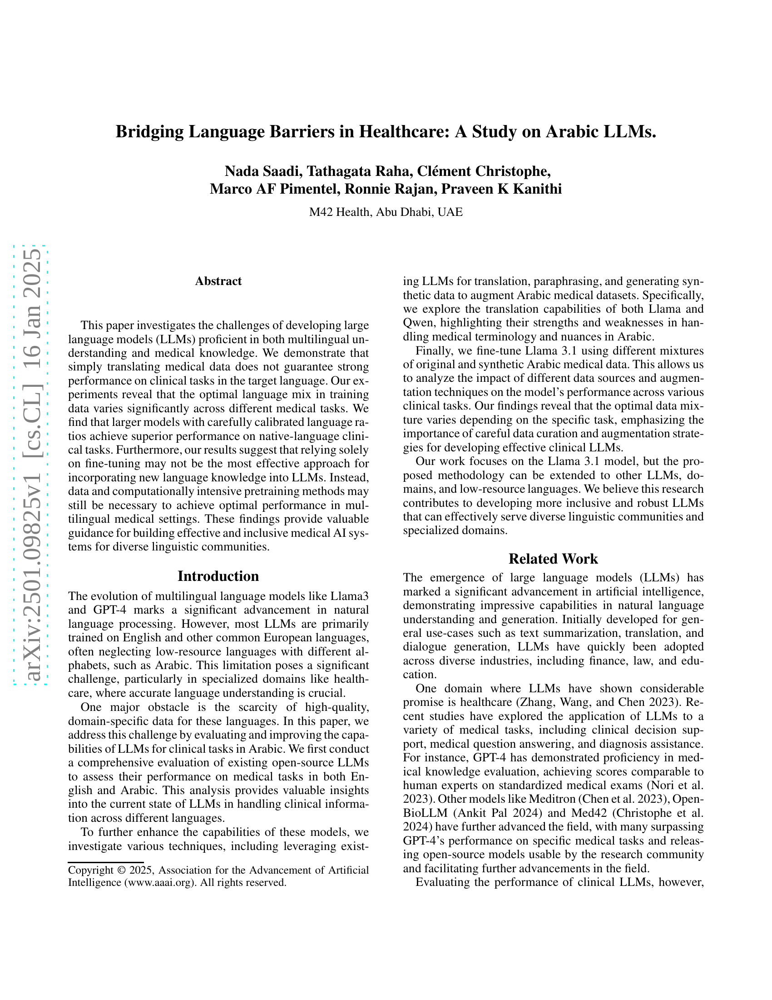
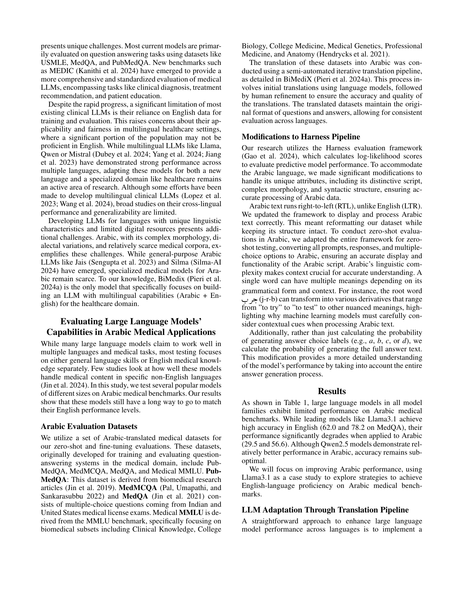
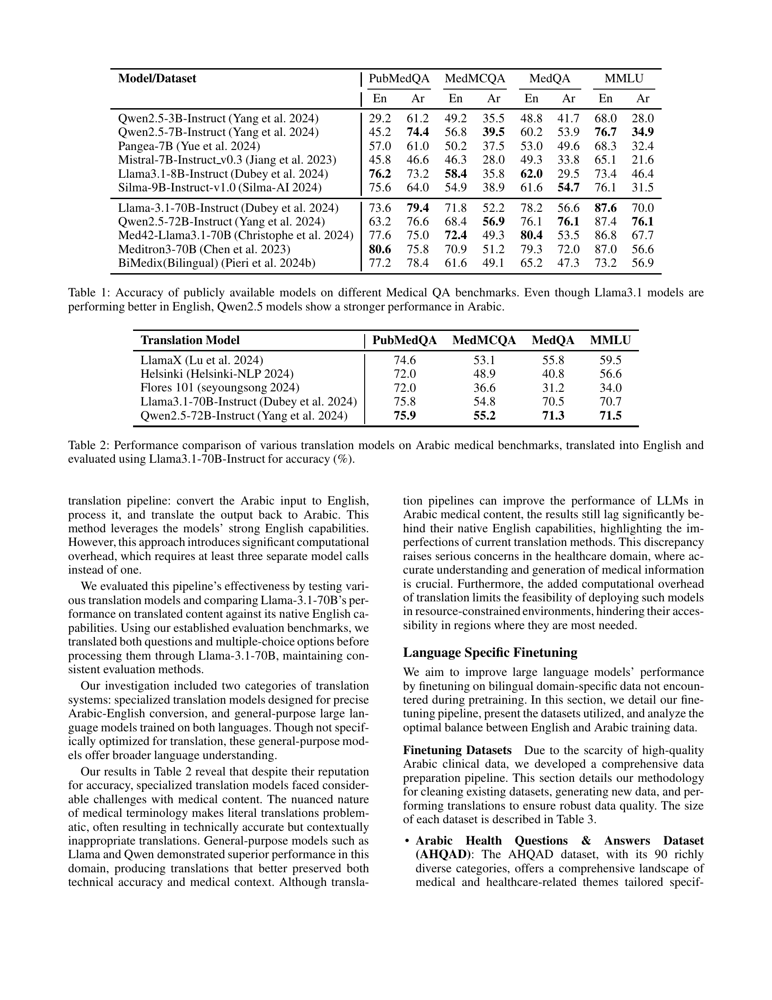
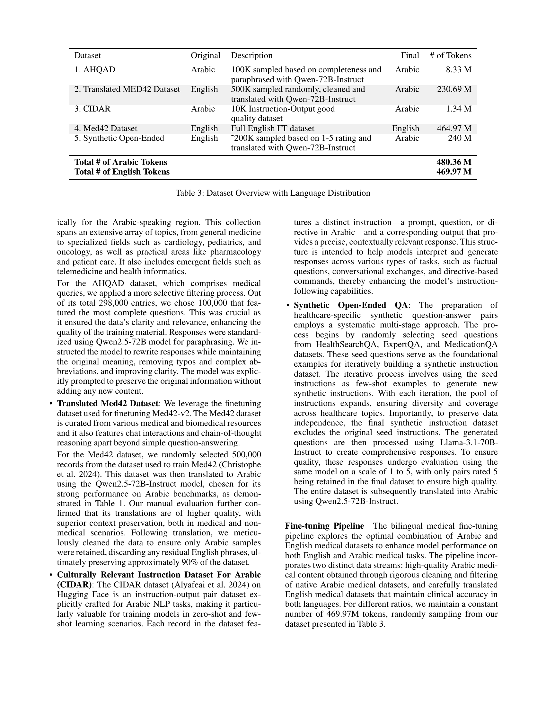
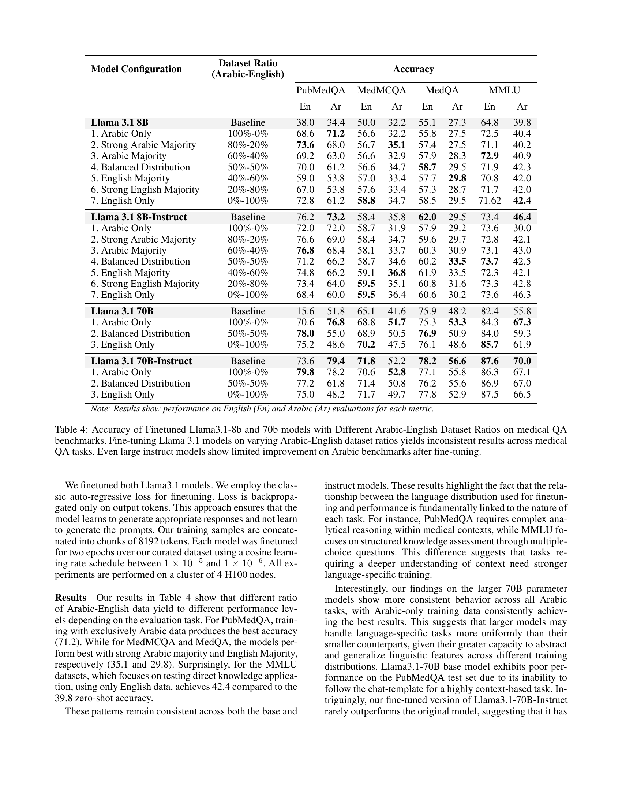
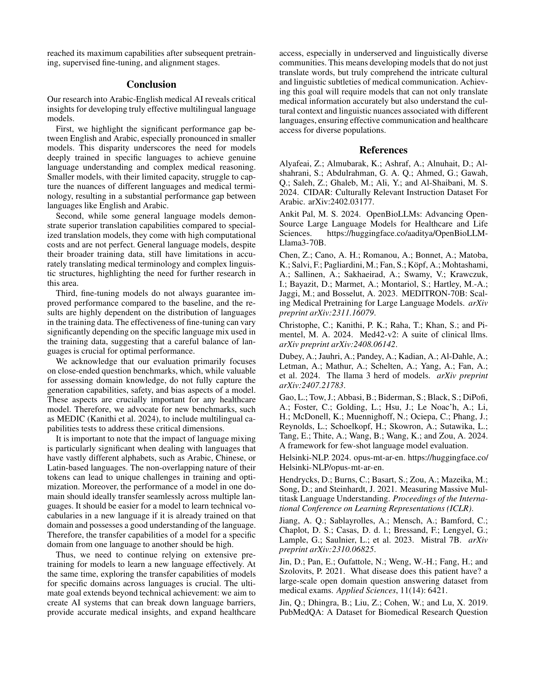
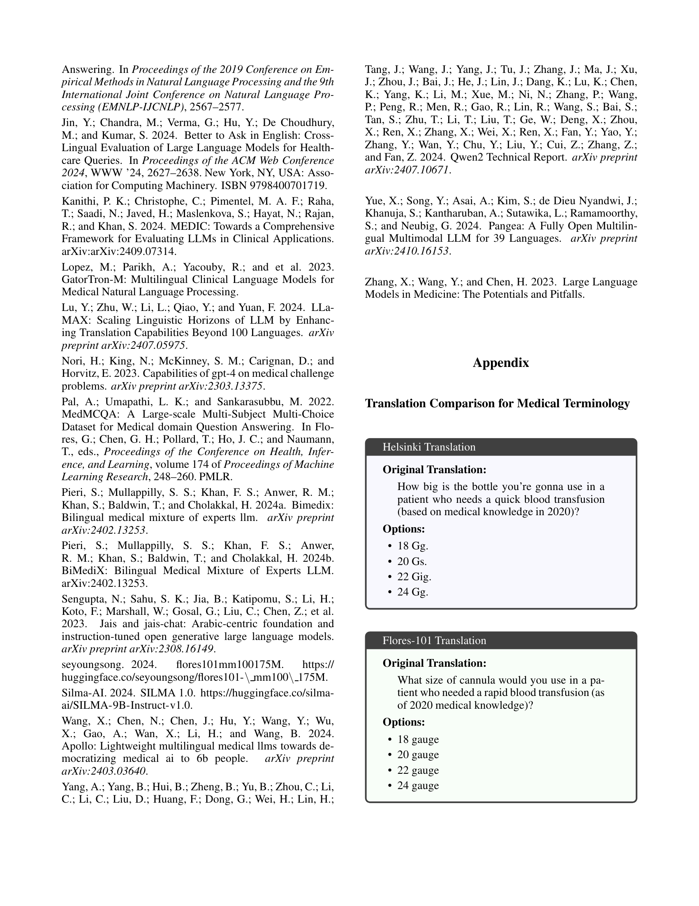
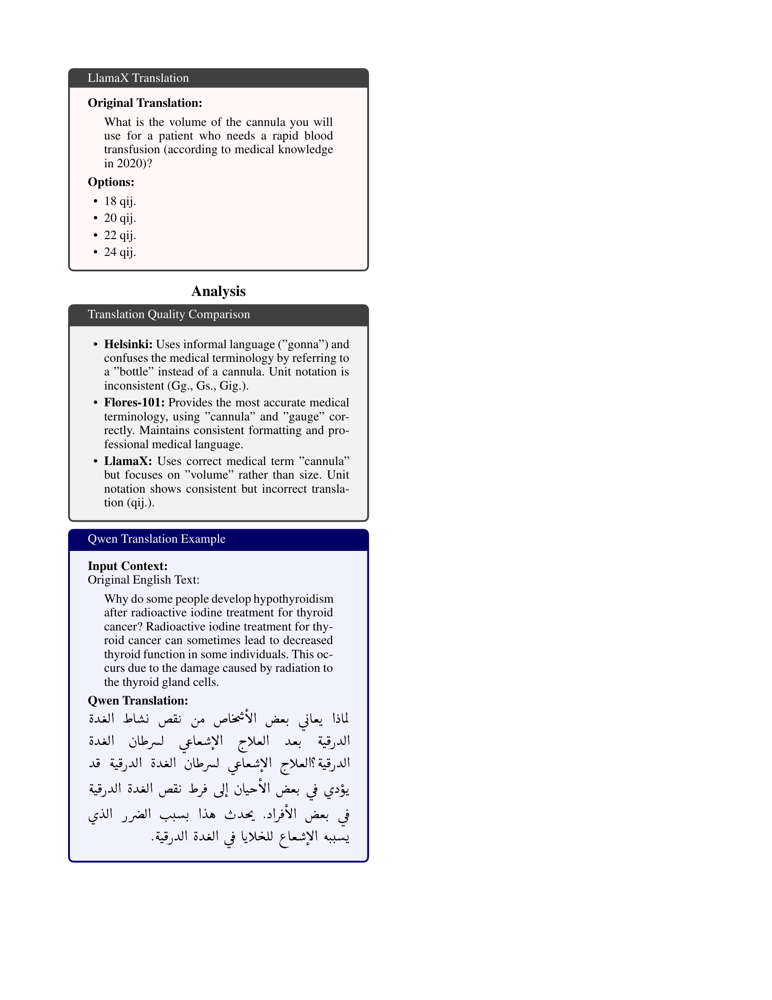

 


 2501.09825 
 Nada Saadi et el. 
 
 🤗 2025-01-20 
 



↗ arXiv


↗ Hugging Face


↗ Papers with Code


### TL;DR



의료 서비스는 언어 장벽으로 인해 접근성이 떨어지는 경우가 많습니다. 특히 아랍어와 같은 저자원 언어는 고품질의 도메인 특정 데이터가 부족하여 의료 LLM 개발에 어려움을 겪고 있습니다. 이 연구는 아랍어 의료 LLM의 성능을 평가하고 개선하는 방법을 조사했습니다. 기존의 오픈소스 LLM을 영어와 아랍어 의료 과제에서 평가하여 그 성능을 분석했습니다.

연구팀은 번역, 의역, 합성 데이터 생성 등 다양한 기법을 활용하여 아랍어 의료 데이터셋을 확장했습니다. Llama 3.1 모델을 미세 조정하여 다양한 아랍어 의료 데이터 조합의 영향을 분석했습니다. **결과적으로, 특정 과제에 따라 최적의 데이터 조합이 다르다는 것을 발견하여, 신중한 데이터 선별 및 증강 전략의 중요성을 강조했습니다.** 이 연구는 다양한 언어적 배경을 가진 사람들에게 효과적이고 포괄적인 의료 AI 시스템을 구축하기 위한 귀중한 지침을 제공합니다.



#### Key Takeaways


 아랍어 의료 데이터를 단순히 번역하는 것만으로는 아랍어 의료 과제에서 강력한 성능을 보장할 수 없다. 



 다양한 의료 과제에 따라 최적의 언어 조합이 다르며, 신중하게 언어 비율을 조정한 대규모 모델이 우수한 성능을 발휘한다. 



 새로운 언어 지식을 LLM에 통합하는 가장 효과적인 방법은 미세 조정이 아니라, 데이터 및 컴퓨팅 집약적인 사전 훈련일 수 있다. 


#### Why does it matter?
**이 연구는 의료 분야에서 다국어 대규모 언어 모델(LLM)의 성능을 평가하고 개선하는 데 중점을 두고 있으며, 특히 아랍어와 같은 저자원 언어에 대한 연구를 확장합니다.** 이는 의료 서비스 접근성 향상 및 건강 형평성 증진에 중요한 영향을 미칠 수 있습니다. 또한, **다국어 의료 LLM 개발의 어려움과 과제를 다루는 방법론을 제시하여, 향후 연구를 위한 귀중한 지침을 제공합니다.** 다양한 언어 및 의료 과제에 대한 다양한 데이터 조합에 대한 연구 결과는 **다국어 의료 AI 시스템의 효율성 및 포괄성을 높이기 위한 미래 연구에 중요한 통찰력을 제공합니다.**

------
#### Visual Insights


| Model/Dataset | PubMedQA |  | MedMCQA |  | MedQA |  | MMLU |  |
|---|---|---|---|---|---|---|---|---|
|  | En | Ar | En | Ar | En | Ar | En | Ar |
| Qwen2.5-3B-Instruct (Yang et al. 2024) | 29.2 | 61.2 | 49.2 | 35.5 | 48.8 | 41.7 | 68.0 | 28.0 |
| Qwen2.5-7B-Instruct (Yang et al. 2024) | 45.2 | 74.4 | 56.8 | 39.5 | 60.2 | 53.9 | 76.7 | 34.9 |
| Pangea-7B (Yue et al. 2024) | 57.0 | 61.0 | 50.2 | 37.5 | 53.0 | 49.6 | 68.3 | 32.4 |
| Mistral-7B-Instruct_v0.3 (Jiang et al. 2023) | 45.8 | 46.6 | 46.3 | 28.0 | 49.3 | 33.8 | 65.1 | 21.6 |
| Llama3.1-8B-Instruct (Dubey et al. 2024) | 76.2 | 73.2 | 58.4 | 35.8 | 62.0 | 29.5 | 73.4 | 46.4 |
| Silma-9B-Instruct-v1.0 (Silma-AI 2024) | 75.6 | 64.0 | 54.9 | 38.9 | 61.6 | 54.7 | 76.1 | 31.5 |
| Llama-3.1-70B-Instruct (Dubey et al. 2024) | 73.6 | 79.4 | 71.8 | 52.2 | 78.2 | 56.6 | 87.6 | 70.0 |
| Qwen2.5-72B-Instruct (Yang et al. 2024) | 63.2 | 76.6 | 68.4 | 56.9 | 76.1 | 76.1 | 87.4 | 76.1 |
| Med42-Llama3.1-70B (Christophe et al. 2024) | 77.6 | 75.0 | 72.4 | 49.3 | 80.4 | 53.5 | 86.8 | 67.7 |
| Meditron3-70B (Chen et al. 2023) | 80.6 | 75.8 | 70.9 | 51.2 | 79.3 | 72.0 | 87.0 | 56.6 |
| BiMedix(Bilingual) (Pieri et al. 2024b) | 77.2 | 78.4 | 61.6 | 49.1 | 65.2 | 47.3 | 73.2 | 56.9 |

> 🔼 표 1은 여러 공개적으로 사용 가능한 언어 모델들이 다양한 의료 질의응답(QA) 벤치마크에서 달성한 정확도를 보여줍니다.  Llama 3.1 모델이 영어 기반 과제에서 더 나은 성능을 보이는 반면, Qwen 2.5 모델은 아랍어 기반 과제에서 더 우수한 성능을 나타냅니다. 이 표는 모델의 언어 및 과제별 성능 차이를 보여주어, 의료 분야에서 다국어 지원 언어 모델 개발의 어려움을 강조합니다. 각 모델의 영어 및 아랍어 성능을 여러 의료 QA 데이터셋(PubMedQA, MedMCQA, MedQA, MMLU)에 대해 비교 분석하여, 모델의 다국어 처리 능력과 의료 지식 수준을 평가합니다.
> 

> 
read the caption

> Table 1: Accuracy of publicly available models on different Medical QA benchmarks. Even though Llama3.1 models are performing better in English, Qwen2.5 models show a stronger performance in Arabic.
> 

### In-depth insights

#### Arabic LLMs in Med
의료 분야에서 아랍어 LLMs의 활용은 **아랍어 의료 데이터의 부족**으로 인해 어려움을 겪고 있습니다.  **기존 영어 중심의 LLMs를 아랍어로 번역하는 것만으로는 충분한 성능을 보장할 수 없다**는 점이 연구를 통해 드러났습니다.  **다양한 의료 과제에 따라 최적의 언어 조합이 상이하며, 신중한 데이터 선별 및 증강 전략**이 필요합니다.  더 나아가, 단순한 미세 조정(fine-tuning) 보다는 **대규모 데이터와 계산 집약적인 사전 학습**이 아랍어 의료 LLMs의 성능 향상에 중요한 역할을 합니다.  **다양한 아랍어 방언과 복잡한 형태론적 특징**을 고려해야 하며, 이를 위해서는 아랍어 의료 데이터셋 구축에 대한 지속적인 노력이 필요합니다.  **이 연구는 아랍어 의료 분야의 포괄적이고 견고한 LLMs 개발을 위한 귀중한 지침**을 제공합니다.

#### Data Mix Impact
본 연구는 **다국어 의료 데이터를 사용한 대규모 언어 모델(LLM) 학습에서 언어 혼합 비율의 영향**을 심층적으로 분석합니다. 단순히 의학 데이터를 번역하는 것만으로는 목표 언어에서 강력한 성능을 보장할 수 없다는 점을 보여줍니다. **최적의 언어 혼합 비율은 의료 과제에 따라 크게 달라지며**, 신중한 데이터 관리 및 증강 전략이 효과적인 임상 LLM 개발에 필수적임을 강조합니다.  **모델 크기가 클수록 교정된 언어 비율을 통해 모국어 임상 과제에서 우수한 성능**을 달성할 수 있습니다. 단순 미세 조정에만 의존하는 것은 새로운 언어 지식을 LLM에 통합하는 가장 효과적인 방법이 아니라는 점을 시사합니다. **데이터 집약적이고 계산적으로 집약적인 사전 훈련 기법**이 다국어 의료 환경에서 최적의 성능을 달성하는 데 여전히 필요할 수 있습니다.

#### Translation Pipeline
본 논문에서 제시된 번역 파이프라인은 아랍어 의료 데이터를 영어로 번역하고 처리한 후 다시 아랍어로 재번역하는 방식입니다. 이는 **영어 기반 대규모 언어 모델의 강점을 활용**하여 아랍어 의료 데이터의 처리 성능을 향상시키기 위한 전략입니다. 하지만 이 과정은 **계산 비용이 높고 번역 오류 발생 가능성**이 존재하며, 아랍어의 특수한 언어적 특징을 완벽하게 반영하지 못할 수 있다는 한계를 가집니다.  특히 의학 용어의 정확한 번역은 의료 AI 시스템의 정확도에 직접적인 영향을 미치므로, **전문적인 의학 번역가의 검수**가 필수적입니다.  번역 파이프라인의 효율성을 높이기 위해서는 **더욱 정교한 번역 모델**과 **효과적인 오류 검출 및 수정 기법**의 개발이 필요합니다.  더 나아가, 아랍어 의료 데이터의 부족 문제를 해결하기 위한 **데이터 확보 및 증강 전략**과 함께, 아랍어 자체의 특징을 고려한 **다국어 언어 모델의 개발**이 미래 연구 방향으로 제시될 수 있습니다.

#### Fine-tuning Effects
본 논문에서 다룬 파인튜닝 효과는 **다국어 의료 데이터셋의 비율 조정**을 통해 아랍어 의료 LLM 성능 향상에 미치는 영향을 분석한 결과를 보여줍니다. 영어 데이터셋 비율이 높을수록 특정 의료 과제에서 성능이 향상되지만, 아랍어 데이터셋 비율이 높을 때 다른 과제에서 더 나은 결과를 얻는다는 점을 발견했습니다. 이는 **과제 특수성**과 **데이터 균형**의 중요성을 시사합니다. 단순히 대규모 모델을 사용하거나 단일 언어로만 학습하는 것보다, **다양한 언어 데이터셋을 적절히 조합하여 파인튜닝**하는 것이 아랍어 의료 LLM의 성능 향상에 효과적임을 보여줍니다.  **모델 크기와 과제 유형에 따른 최적의 언어 비율은 다르게 나타나므로**,  실제 의료 환경에 적용하기 위한 추가 연구가 필요함을 시사합니다.

#### Future Directions
미래 방향에 대한 심도있는 고찰은 **다국어 의료 언어 모델의 성능 향상 및 공정성 확보**에 초점을 맞춰야 합니다.  **저자원 언어에 대한 데이터 확보 및 모델 학습 전략 개선**은 필수적이며, **다양한 의료 과제에 대한 모델 성능 평가 지표 개발 및 표준화**를 통해 실제 임상 적용 가능성을 높여야 합니다.  **의료 전문가와의 긴밀한 협력**을 통해 모델의 신뢰성과 설명 가능성을 높이고, **윤리적 문제 및 개인정보보호**에 대한 철저한 고려가 필요합니다.  **모델의 편향성을 최소화**하고 다양한 문화적 배경을 고려한 포괄적인 시스템 구축은 중요한 과제입니다.  궁극적으로 **의료 격차 해소**와 **포괄적인 의료 서비스 제공**을 위한 다국어 의료 언어 모델의 발전이 중요합니다.

### More visual insights

More on tables


| Translation Model | PubMedQA | MedMCQA | MedQA | MMLU |
|---|---|---|---|---|
| LlamaX (Lu et al. 2024) | 74.6 | 53.1 | 55.8 | 59.5 |
| Helsinki (Helsinki-NLP 2024) | 72.0 | 48.9 | 40.8 | 56.6 |
| Flores 101 (seyoungsong 2024) | 72.0 | 36.6 | 31.2 | 34.0 |
| Llama3.1-70B-Instruct (Dubey et al. 2024) | 75.8 | 54.8 | 70.5 | 70.7 |
| Qwen2.5-72B-Instruct (Yang et al. 2024) | **75.9** | **55.2** | **71.3** | **71.5** |
> 🔼 표 2는 여러 번역 모델이 아랍어 의학 벤치마크를 영어로 번역한 후 Llama3.1-70B-Instruct를 사용하여 정확도를 평가한 결과를 보여줍니다.  각 번역 모델의 아랍어 의학 벤치마크 번역 성능을 정량적으로 비교하여 어떤 모델이 아랍어 의학 텍스트를 영어로 가장 정확하게 번역하는지 보여줍니다.  이는 아랍어 의료 데이터를 사용하는 다국어 LLM 개발에 있어서 번역 모델 선택의 중요성을 강조합니다.
> 

> 
read the caption

> Table 2: Performance comparison of various translation models on Arabic medical benchmarks, translated into English and evaluated using Llama3.1-70B-Instruct for accuracy (%).
> 


| Dataset | Original | Description | Final | # of Tokens |
|---|---|---|---|---|
| 1. AHQAD | Arabic | 100K sampled based on completeness and paraphrased with Qwen-72B-Instruct | Arabic | 8.33 M |
| 2. Translated MED42 Dataset | English | 500K sampled randomly, cleaned and translated with Qwen-72B-Instruct | Arabic | 230.69 M |
| 3. CIDAR | Arabic | 10K Instruction-Output good quality dataset | Arabic | 1.34 M |
| 4. Med42 Dataset | English | Full English FT dataset | English | 464.97 M |
| 5. Synthetic Open-Ended | English | ~200K sampled based on 1-5 rating and translated with Qwen-72B-Instruct | Arabic | 240 M |
| **Total # of Arabic Tokens** |  |  |  | **480.36 M** |
| **Total # of English Tokens** |  |  |  | **469.97 M** |
> 🔼 표 3은 논문에서 사용된 데이터셋의 개요와 각 언어별 데이터 분포를 보여줍니다.  AHQAD, 번역된 MED42 데이터셋, CIDAR, Med42 데이터셋, 그리고 합성 개방형 질문 답변 데이터셋 등 다섯 가지 데이터셋이 포함되어 있으며, 각 데이터셋의 원래 언어, 설명, 그리고 토큰 수가 제시되어 있습니다. 아랍어와 영어 데이터의 토큰 수를 합산하여 각 언어의 총 토큰 수를 나타냅니다. 이 표는 다양한 아랍어 의료 데이터셋을 어떻게 준비하고 사용했는지 이해하는 데 도움이 됩니다.
> 

> 
read the caption

> Table 3: Dataset Overview with Language Distribution
> 


| 100K sampled based on completeness and | paraphrased with Qwen-72B-Instruct |

> 🔼 표 4는 다양한 아랍어-영어 데이터 비율로 미세 조정된 Llama 3.1-8B 및 70B 모델의 의료 QA 벤치마크에 대한 정확도를 보여줍니다. 다양한 아랍어-영어 데이터 비율로 Llama 3.1 모델을 미세 조정하면 의료 QA 작업 전반에 걸쳐 일관성 없는 결과가 나타납니다. 대규모 instruction 모델조차도 미세 조정 후 아랍어 벤치마크에서 성능 향상이 제한적입니다.
> 

> 
read the caption

> Table 4: Accuracy of Finetuned Llama3.1-8b and 70b models with Different Arabic-English Dataset Ratios on medical QA benchmarks. Fine-tuning Llama 3.1 models on varying Arabic-English dataset ratios yields inconsistent results across medical QA tasks. Even large instruct models show limited improvement on Arabic benchmarks after fine-tuning.
> 

### Full paper



