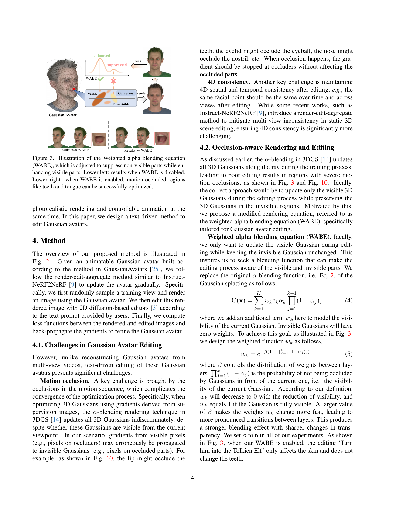
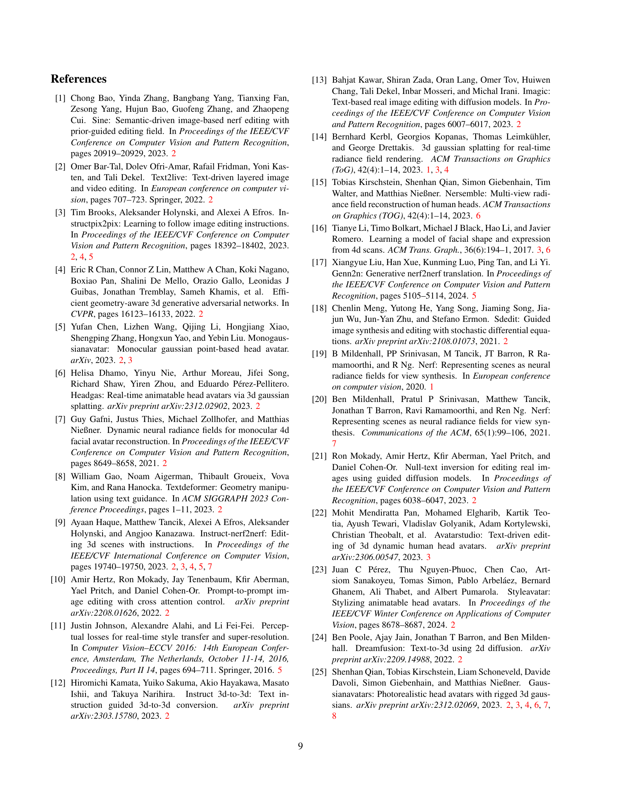

 


 2501.09978 
 Xiangyue Liu et el. 
 
 🤗 2025-01-20 
 



↗ arXiv


↗ Hugging Face


↗ Papers with Code


### TL;DR



본 논문은 **실시간 애니메이션이 가능한 3D 헤드 아바타 편집**에 대한 새로운 프레임워크인 GaussianAvatar-Editor를 소개합니다. 기존의 3D 아바타 편집 방법은 **모션 폐색**으로 인해 정확한 편집이 어렵고 **시공간적 일관성**을 유지하기 어려운 문제점을 가지고 있습니다.  특히, 움직임이 있는 아바타에서는 입술이 치아를 가리거나 눈꺼풀이 눈동자를 가리는 등의 폐색 현상이 발생하며, 이로 인해 편집 결과가 부자연스러워지는 문제가 발생합니다. 또한, 다른 시점이나 시간에서의 편집 결과가 서로 일관성이 없어 아바타의 움직임이 자연스럽지 않을 수 있습니다.

GaussianAvatar-Editor는 이러한 문제점을 해결하기 위해 **가중치 알파 블렌딩 방정식(WABE)**와 **조건부 적대적 학습** 기법을 제시합니다. WABE는 가시적인 가우시안에 대한 가중치를 높이고 비가시적인 가우시안의 영향을 줄여 모션 폐색 문제를 해결합니다.  조건부 적대적 학습은 편집 결과의 품질을 높이고 4D 일관성을 유지하는 데 도움을 줍니다.  실험 결과, GaussianAvatar-Editor는 기존 방법보다 우수한 성능을 보이며, 실시간으로 사실적이고 일관된 애니메이션 아바타 편집을 가능하게 합니다.



#### Key Takeaways


 텍스트 기반으로 3D 헤드 아바타의 표정, 자세, 시점을 완벽하게 제어 가능 



 모션 폐색 문제 해결을 위한 WABE(Weighted Alpha Blending Equation) 및 4D 일관성 유지를 위한 적대적 학습 기법 제시 



 기존 방법 대비 우수한 실시간 사실적 편집 결과를 다양한 실험을 통해 검증 


#### Why does it matter?
본 논문은 **실시간으로 애니메이션이 가능한 3D 헤드 아바타 편집**에 대한 혁신적인 프레임워크를 제시하여, **텍스트 기반 편집을 통해 아바타의 표정, 자세, 시점을 완벽하게 제어**할 수 있게 합니다.  이는 **현실감 있는 아바타 생성 및 편집** 기술 발전에 크게 기여하며, **다양한 분야(영상 통신, 가상현실, 영화 제작 등)**에 활용될 수 있는 잠재력을 가지고 있습니다. 특히, **모션 폐색 문제와 시공간적 일관성 유지를 위한 혁신적인 기법**을 제시함으로써, 기존 방법의 한계를 극복하고 더욱 향상된 결과를 얻을 수 있게 합니다. 따라서, **아바타 생성 및 편집 분야 연구자들에게 중요한 참고 자료**가 될 것이며, **향후 연구 방향을 제시**하는 데에도 큰 의미를 가집니다.

------
#### Visual Insights

> 🔼 그림 1은 GaussianAvatar-Editor의 추론 결과를 보여줍니다. GaussianAvatar-Editor는 사용자가 텍스트를 통해 애니메이션 가우시안 헤드 아바타를 편집할 수 있는 새로운 방법입니다. 표정, 자세, 시점을 완전히 제어할 수 있으며, 편집된 아바타는 공간적, 시간적으로 일관성이 뛰어난 사실적인 편집 결과를 제공합니다. 그림에서는 다양한 텍스트 프롬프트를 사용하여 생성된 다양한 아바타 편집 결과를 보여줍니다.
> 

> 
read the caption

> Figure 1:  We introduce GaussianAvatar-Editor, a method for text-driven editing of animatable Gaussian head avatars with fully controllable expression, pose, and viewpoint. We show qualitative results of our GaussianAvatar-Editor at the inference time above. Our edited avatars can achieve photorealistic editing results with strong spatial and temporal consistency.
> 


|                   | Novel view rendering | Novel view rendering | Self-reenactment | Self-reenactment | Cross-identity reenactment | Cross-identity reenactment |
| :----------------- | :-------------------- | :-------------------- | :---------------- | :---------------- | :-------------------------- | :-------------------------- |
|                   | CLIP-S ↑                | CLIP-C ↑                | CLIP-S ↑           | CLIP-C ↑           | CLIP-S ↑                     | CLIP-C ↑                     |
| INSTA+I-N2N        | 0.181                  | 0.955                  | 0.042              | 0.923              | 0.043                       | 0.936                       |
| GA+I-N2N           | 0.236                  | 0.968                  | 0.044              | 0.938              | 0.069                       | 0.941                       |
| Control4D          | 0.222                  | 0.980                  | 0.058              | 0.938              | /                           | /                           |
| Ours w/o WABE      | 0.236                  | 0.968                  | 0.061              | 0.948              | 0.077                       | 0.950                       |
| Ours w/o adv      | 0.266                  | 0.976                  | 0.077              | 0.950              | 0.070                       | 0.946                       |
| Ours               | **0.275**               | **0.978**               | **0.081**           | **0.951**           | **0.081**                    | **0.951**                    |

> 🔼 표 1은 CLIP-S와 CLIP-C 지표를 사용하여 정량적으로 비교 분석한 결과와 ablation study 결과를 보여줍니다. 새로운 뷰 렌더링, 셀프 재연출, 교차 신원 재연출 세 가지 작업에 대해 제안된 방법을 기존 방법들과 비교 분석했습니다. 결과적으로 제안된 방법이 다른 방법들보다 우수한 성능을 보임을 확인했습니다.
> 

> 
read the caption

> Table 1: Quantitative comparisons and ablation studies with CLIP-S and CLIP-C. We compare our method with existing methods for novel view rendering, self-reenactment, and cross-identity reenactment. Our method obtains superior results than other methods.
> 

### In-depth insights

#### 4D Gaussian Editing
본 논문에서 제안하는 4D 가우시안 편집은 **기존의 정적 3D 가우시안 편집의 한계를 뛰어넘어** 애니메이션 가우시안 헤드 아바타의 표현, 자세, 시점을 완벽하게 제어할 수 있는 혁신적인 프레임워크입니다. 특히, **움직임에 의한 가려짐(motion occlusion)** 문제와 **시간적, 공간적 일관성 유지**라는 어려움을 해결하기 위해 가중치 알파 블렌딩 방정식(WABE)과 조건부 적대적 학습(adversarial learning) 기법을 도입했습니다. WABE는 가시적인 가우시안의 가중치를 높이고 비가시적인 가우시안의 영향을 억제하여 가려짐 문제를 효과적으로 해결합니다. 조건부 적대적 학습은 편집 품질을 향상시키고 애니메이션 전반에 걸쳐 일관성을 유지하는 데 중요한 역할을 합니다. **결과적으로, 이러한 기법들을 통합함으로써** 실시간으로 사실적인 편집 결과를 얻을 수 있으며, 다양한 대상과 시나리오에서 그 우수성이 입증되었습니다.

#### WABE Function
본 논문에서 제안하는 가중 알파 블렌딩 방정식(WABE)은 **움직임에 의한 가시성 변화**에 효과적으로 대응하는 핵심 기능입니다. 기존의 알파 블렌딩 방식은 가우시안 스플랫의 가시 여부와 무관하게 모든 가우시안에 대해 일괄적으로 업데이트를 수행하여 모션 폐색 영역에서의 편향된 결과를 초래했습니다. 반면 WABE는 **가시적인 가우시안에 대한 가중치를 높이고 비가시적인 가우시안의 영향을 억제**함으로써, 움직임에 따른 가시성 변화를 고려하여 정확도를 높입니다. 특히 입술이 이빨을 가리는 등의 폐색 현상에서 가시적인 부분만 정확히 업데이트하고, 비가시적인 부분의 왜곡을 방지하는 데 효과적입니다. 이를 통해 **시간적·공간적 일관성**을 유지하면서 고품질의 애니메이션 편집 결과를 얻을 수 있습니다.

#### Adversarial Learning
본 논문에서 제안하는 적대적 학습(Adversarial Learning) 방법은 **일관성 있는 4D 애니메이션 생성**에 초점을 맞춥니다. 기존의 텍스트 기반 편집 방법은 시간적, 공간적 일관성이 부족하여 애니메이션 결과물의 품질 저하를 야기하는데, 이를 해결하기 위해 **시간적 일관성을 강화하는 손실 함수**를 도입했습니다.  이는 실제 이미지와 편집된 이미지의 차이를 최소화하고, 인접한 시간 프레임 간의 일관성을 유지하도록 설계되었습니다. **시간에 따른 일관성 유지를 위해 실제 이미지와 편집된 이미지 쌍을 구분하도록 설계된 판별자(Discriminator)를 훈련**하여, 이를 통해 생성된 애니메이션의 시각적 품질을 향상시키고, 시간에 걸쳐 일관된 결과를 얻을 수 있도록 합니다. **결론적으로, 본 논문의 적대적 학습 전략은 단순히 이미지 재구성을 넘어, 시간적 일관성을 고려한 고품질 애니메이션 생성에 중요한 역할**을 수행합니다.

#### Occlusion Handling
본 논문에서 다루는 핵심 과제 중 하나는 **운동에 의한 가시성 변화(motion occlusion)**입니다.  특히, 애니메이션 헤드 아바타 편집 과정에서 입술이 치아를 가리거나 눈꺼풀이 눈동자를 가리는 등의 상황에서 발생하는 문제를 해결하는 것이 중요합니다.  기존의 방법들은 이러한 가시성 변화를 고려하지 않고 모든 3D 가우시안에 일괄적으로 기울기를 적용하기 때문에, **가려진 부분의 가우시안에 잘못된 기울기가 전파되어 아티팩트가 발생**하는 문제가 있었습니다.  이를 해결하기 위해 본 논문에서는 **가중치 알파 블렌딩 방정식(WABE)**을 제안합니다.  WABE는 가시적인 가우시안의 가중치를 높이고, 가려진 가우시안의 영향을 억제함으로써 가시성 변화 문제를 효과적으로 해결합니다.  **가시성에 따른 가중치 조절**을 통해 가려진 부분의 잘못된 편집을 방지하고, 보다 정확하고 자연스러운 아바타 편집 결과를 얻을 수 있게 됩니다.  본 논문의 WABE는 **운동 가시성 문제**에 대한 효과적인 해결책을 제시하며, **시간적 일관성 유지**에 중요한 역할을 수행합니다.

#### Future Directions
본 논문에서 제시된 GaussianAvatar-Editor는 3D Gaussian 기반의 애니메이션 헤드 아바타 편집에 있어 괄목할 만한 성과를 보였지만, **여전히 개선의 여지가 존재**합니다.  **미래 연구 방향**으로는 다음과 같은 세 가지를 제시할 수 있습니다. 첫째, **더욱 정교한 occlusion 처리 알고리즘** 개발입니다. 현재 WABE(Weighted Alpha Blending Equation)는 효과적이지만, 복잡한 움직임이나 다층 구조의 오클루전에는 한계를 보입니다.  다양한 오클루전 유형을 효과적으로 처리하는 더욱 강건한 알고리즘 개발이 필요합니다. 둘째, **다양한 아바타 유형에 대한 확장성 연구**입니다. 현재는 헤드 아바타에 국한되어 있으나, 전신 아바타나 다른 유형의 3D 모델에 대한 적용 가능성을 탐구하여 활용 범위를 넓히는 것이 중요합니다. 마지막으로, **사용자 인터페이스 개선**입니다.  텍스트 기반 편집 방식은 편리하지만, 더욱 직관적이고 정확한 편집을 위한 GUI 개발 및 제스처, 음성 등 다양한 입력 방식을 통합하는 연구가 필요합니다. 이러한 연구들을 통해 **더욱 실용적이고 사용자 친화적인 아바타 편집 시스템**을 구축할 수 있을 것입니다.  또한, **다양한 도메인**으로의 적용 확장성을 고려하여, 의료 영상 분석, 게임 개발, 가상/증강현실 등 여러 분야에서 활용될 수 있는 가능성을 탐색해야 할 것입니다.

### More visual insights

More on figures

> 🔼 본 그림은 논문에서 제안하는 방법의 개요를 보여줍니다. Instruct-NeRF2NeRF [9]와 유사하게 렌더링-편집-집계 최적화 파이프라인을 따릅니다.  움직임에 의한 폐색 문제를 해결하기 위해 가중 알파 블렌딩 방정식(WABE)을 도입하고, 시간적 일관성을 높이기 위해 새로운 손실 함수를 사용합니다. 편집된 아바타는 고품질의 일관된 4D 렌더링을 생성하며 다른 배우에 의해 제어될 수 있습니다.  구체적으로, (1) 애니메이션 가우시안 아바타를 렌더링하고, (2) 텍스트 프롬프트를 사용하여 2D 확산 모델로 렌더링된 이미지를 편집하고, (3) 가중 알파 블렌딩 방정식(WABE)을 사용하여 가우시안 움직임 폐색을 해결하며, (4) 새로운 손실 함수를 사용하여 시간적 일관성을 향상시키고, (5) 편집된 가우시안 아바타를 생성하는 과정을 보여줍니다.
> 

> 
read the caption

> Figure 2: The overview of our method. We follow a render-edit-aggregate optimization pipeline as in Instruct-NeRF2NeRF [9]. We introduce a Weighted Alpha Blending Equation (WABE) to overcome the motion occlusion problem and our novel loss functions to enhance the spatial-temporal consistency. Our edited avatars can generate high-quality and consistent 4D renderings and can be controlled by other actors.
> 

> 🔼 그림 3은 제안된 가중 알파 블렌딩 방정식(WABE)을 보여줍니다. WABE는 가시적인 부분은 강화하고 비가시적인 부분은 억제하도록 조정됩니다. 그림 왼쪽 아래는 WABE를 사용하지 않은 결과를, 오른쪽 아래는 WABE를 사용하여 치아와 혀와 같은 움직임으로 인한 가려짐 영역이 성공적으로 최적화된 결과를 보여줍니다.  이는 움직임에 따른 가려짐 현상을 해결하기 위해 가중치를 조절하여 가시적인 영역의 가우시안에 더 높은 가중치를 부여하고, 가려진 영역의 가우시안의 영향은 억제하는 WABE의 효과를 시각적으로 보여줍니다.
> 

> 
read the caption

> Figure 3:  Illustration of the Weighted alpha blending equation (WABE), which is adjusted to suppress non-visible parts while enhancing visible parts. Lower left: results when WABE is disabled. Lower right: when WABE is enabled, motion-occluded regions like teeth and tongue can be successfully optimized.
> 

> 🔼 그림 4는 본 논문에서 제안하는 방법을 사용하여 새로운 뷰를 합성한 결과를 보여줍니다.  특히, '톨킨의 요정으로 만들어줘' 라는 텍스트 프롬프트를 사용하여 원본 아바타를 편집한 결과를 다양한 각도에서 보여줍니다.  이를 통해, 제안된 방법이 다양한 시점에서도 일관되고 사실적인 결과를 생성할 수 있음을 보여줍니다.
> 

> 
read the caption

> Figure 4: Our results on novel view synthesis. We show our edited results using the text prompt “Turn her into the Tolkien Elf”.
> 

> 🔼 그림 5는 새로운 뷰 합성에 대한 비교 결과를 보여줍니다. 제시된 텍스트 프롬프트를 기반으로, 여러 기준 방법들과 GaussianAvatar-Editor의 결과를 비교하여 다양한 각도에서의 렌더링 결과의 질과 일관성을 평가합니다. GaussianAvatar-Editor는 다른 방법들보다 더 높은 화질과 멀티뷰 일관성을 보이는 결과를 생성합니다. 특히, 얼굴의 세부 특징과 텍스쳐 표현의 질적 향상을 눈으로 확인할 수 있습니다.
> 

> 
read the caption

> Figure 5: Comparison on novel view synthesis. Our method produces more high-quality and multi-view consistent results than baselines.
> 

> 🔼 그림 6은 제시된 방법을 사용하여 생성한 애니메이션 아바타의 자가 재현 결과를 보여줍니다.  자가 재현이란, 훈련 중 사용된 16개의 카메라 시점에서, 이전에 보지 못한 새로운 머리 자세와 표정을 가진 아바타를 렌더링하는 것을 의미합니다. 그림 아래쪽에는 각각의 렌더링에 사용된 텍스트 프롬프트가 함께 제시되어 있습니다. 이를 통해 사용자가 원하는 표정이나 자세를 텍스트로 지정하여 아바타를 생성할 수 있음을 보여줍니다.
> 

> 
read the caption

> Figure 6: Our results on self-reenactment. Self-reenactment renders held-out unseen head pose and expressions from 16 training camera viewpoints. The bottom part shows the text prompts.
> 

> 🔼 이 그림은 제안된 방법을 사용하여 편집된 아바타가 동일한 피사체의 이전에 보지 못한 표정과 머리 자세에서도 정확하게 세부적인 얼굴 특징을 생성할 수 있음을 보여줍니다.  기존 방법들과 비교하여, 제안된 방법이 훨씬 더 정확하고 자연스러운 결과를 생성함을 시각적으로 보여줍니다. 특히, 눈, 입술, 코와 같은 미세한 부분까지도 정확하게 재현합니다. 이는 제안된 방법의 우수성을 보여주는 중요한 증거입니다.
> 

> 
read the caption

> Figure 7: Comparison of self-reenactment. Our edited avatar can correctly produce detailed facial features under unseen expressions and head poses from the same subject.
> 

> 🔼 그림 8은 본 논문에서 제안하는 방법을 사용하여 수행한 교차 신원 재연 결과를 보여줍니다. 교차 신원 재연은 다른 사람의 시퀀스에서 보이지 않는 머리 자세와 표정을 사용하여 아바타를 애니메이션화하여 이미지를 렌더링하는 것을 의미합니다. 그림의 아래쪽에는 사용된 텍스트 프롬프트들이 나열되어 있습니다. 이를 통해 사용자가 원하는 대로 아바타의 모습을 바꾸는 다양한 예시를 보여줍니다.  다양한 텍스트 프롬프트를 사용하여 아바타의 모습을 얼마나 정확하고 사실적으로 변환할 수 있는지 보여주는 중요한 결과입니다.
> 

> 
read the caption

> Figure 8: Our results on cross-identity reenactment. Cross-identity reenactment animates the avatar to render images with unseen head poses and expressions from sequences of a different actor. The bottom part shows the text prompts.
> 

> 🔼 이 그림은 논문의 5.2절 'Head Avatar Editing and Animation'에서 다루고 있으며, 동일한 소스 배우의 조종 하에 서로 다른 편집된 아바타를 비교 분석한 결과를 보여줍니다. 본 논문의 방법론을 사용하면 새로운 표정을 가진 고품질의 결과물을 생성할 수 있는 반면, 기존 방법론들은 인공물이 발생하는 문제점을 보입니다.  즉, 본 논문의 방법이 얼굴 표정 재현에 있어 우수함을 시각적으로 보여주는 대표적인 예시입니다.
> 

> 
read the caption

> Figure 9: Comparison of Cross-identity reenactment. Different edited avatars are controlled by the same source actor. Our method can render high-quality results with novel expressions, while baseline methods suffer from artifacts.
> 

### Full paper



