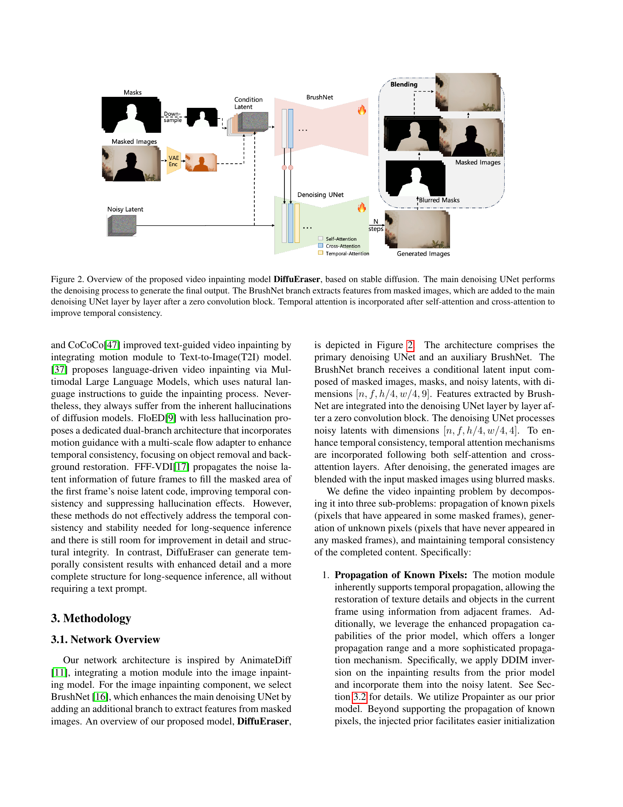

 


 2501.10018 
 Xiaowen Li et el. 
 
 🤗 2025-01-24 
 



↗ arXiv


↗ Hugging Face


↗ Papers with Code


### TL;DR



기존의 비디오 복원 알고리즘은 큰 마스크 영역을 처리하거나 시간적 일관성을 유지하는 데 어려움을 겪었습니다. 특히, 변환기 기반 모델은 세부적인 텍스처 복원에 어려움을 겪고, 흐릿한 결과물이나 시간적 불일치를 초래하는 경우가 많았습니다. 이러한 문제를 해결하기 위해, 많은 연구자들이 흐름 기반 방법과 변환기 기반 방법을 결합하는 시도를 했지만, 여전히 한계점이 존재했습니다.

본 논문에서는 **안정적인 확산 모델(stable diffusion)**을 기반으로 하는 새로운 비디오 복원 모델인 DiffuEraser를 제안합니다. DiffuEraser는 **마스크 영역의 사전 정보를 활용하여 초기화 과정을 개선하고, 노이즈 아티팩트를 줄이며, 시간적 일관성을 높이는 데 집중**합니다. 또한, **시간적 수용 영역을 확장하여 장시간 비디오에 대한 처리 성능을 개선**하였습니다. 실험 결과, DiffuEraser는 기존의 최첨단 모델들을 능가하는 성능을 보였으며, 보다 세밀하고 일관성 있는 비디오 복원 결과를 제공함을 보여주었습니다.



#### Key Takeaways


 안정적인 확산 모델을 이용하여 고품질의 비디오 복원 결과를 생성합니다. 



 대규모 마스크 영역에 대한 효과적인 처리 및 높은 시간적 일관성을 달성합니다. 



 기존 방법보다 효율적이며, 장시간 비디오 처리에도 적용 가능합니다 


#### Why does it matter?
본 논문은 **비디오 복원 분야의 난제인 큰 마스크 영역의 처리 및 시간적 일관성 유지**에 대해 새로운 접근 방식을 제시합니다. **안정적인 확산 모델(stable diffusion)**을 기반으로 설계된 DiffuEraser는 기존 방법의 한계를 극복하고, 고품질의 복원 결과와 높은 시간적 일관성을 동시에 달성합니다. 이는 **향후 비디오 편집 및 생성 기술 발전**에 큰 영향을 미칠 것으로 예상되며, 특히 장시간 비디오 처리 및 복잡한 시각 효과 생성에 있어서 유용할 것입니다.  더 나아가, 본 연구는 **초고해상도 비디오 처리 및 다양한 비디오 편집 작업**에 대한 추가 연구를 위한 새로운 가능성을 제시합니다.

------
#### Visual Insights

> 🔼 이 그림은 안정적인 확산 모델을 기반으로 하는 제안된 비디오 인페인팅 모델인 DiffuEraser의 개요를 보여줍니다. 주요 잡음 제거 UNet은 잡음 제거 과정을 수행하여 최종 출력을 생성합니다. BrushNet 분기는 마스크된 이미지에서 특징을 추출하고, 이 특징들은 0 합성곱 블록 이후 계층별로 주요 잡음 제거 UNet에 추가됩니다. 시간적 일관성을 향상시키기 위해 자기 주의 및 교차 주의 이후에 시간적 주의가 통합됩니다.  간단히 말해, 마스크된 영역을 채우기 위해 안정적인 확산과 BrushNet, 그리고 시간적 주의 메커니즘을 사용하는 DiffuEraser 모델의 구조를 보여줍니다.
> 

> 
read the caption

> Figure 1: Overview of the proposed video inpainting model DiffuEraser, based on stable diffusion. The main denoising UNet performs the denoising process to generate the final output. The BrushNet branch extracts features from masked images, which are added to the main denoising UNet layer by layer after a zero convolution block. Temporal attention is incorporated after self-attention and cross-attention to improve temporal consistency.
> 

### In-depth insights

#### Diffusion Video Inpaint
**확산 비디오 인페인팅**은 손상되거나 누락된 비디오 프레임 영역을 복구하는 혁신적인 기술입니다. 기존의 프레임 보간법과 달리, **확산 모델**을 기반으로 하여 **자연스럽고 사실적인** 결과물을 생성합니다. 이는 노이즈가 많은 데이터에서도 고품질의 비디오를 복원할 수 있는 가능성을 열어줍니다. **시간적 일관성**을 유지하면서 움직임과 텍스처를 정확하게 재현하는 것이 중요하며, **고해상도** 비디오에서의 성능이 특히 중요합니다.  **다양한 손상 유형**에 대한 적응력 및 **효율적인 처리 속도** 역시 실용적인 측면에서 고려해야 할 중요한 요소입니다.  **데이터 증강** 및 **모델 구조 개선**을 통한 성능 향상 연구는 앞으로의 과제입니다.  특히, **대규모 데이터셋**을 활용한 학습과 **다중 모달 정보**를 통합하는 연구는 더욱 자연스럽고 정교한 비디오 인페인팅을 가능하게 할 것입니다.

#### Prior-Guided Diffusion
**Prior-Guided Diffusion**은 기존의 diffusion model의 한계를 극복하기 위한 중요한 개념입니다. **기존 diffusion model은 잡음이 많은 결과물을 생성하거나 원치 않는 물체를 생성하는 경향**이 있습니다. 이러한 문제를 해결하기 위해, Prior-Guided Diffusion은 **추가적인 정보(prior)**를 diffusion process에 통합합니다. 이 prior는 다양한 형태를 가질 수 있으며, 예를 들어 **이미지의 일부분, optical flow, 또는 다른 모델의 예측 결과** 등이 있습니다. Prior는 diffusion model의 초기 상태를 안내하고, 잡음을 줄이며, 원하는 특징을 강조하는 역할을 합니다. **Prior를 효과적으로 사용하면 diffusion model의 성능을 향상시키고 더욱 정확하고 일관된 결과물을 생성**할 수 있습니다. 본 논문에서 제시된 DiffuEraser는 이러한 Prior-Guided Diffusion의 개념을 video inpainting에 적용한 사례로, **Propainter와 같은 다른 모델의 결과를 prior로 사용하여 더욱 세밀하고 일관성있는 결과를 생성**합니다.  **Prior의 선택과 통합 방식은 매우 중요**하며, 이는 최종 결과물의 질에 큰 영향을 미칩니다.

#### Temporal Consistency
본 논문에서 "시간적 일관성"은 비디오 복원에서 매우 중요한 요소로 다뤄집니다.  **기존의 방법들은 큰 마스크 영역이나 긴 시퀀스 처리 시 시간적 일관성을 유지하는 데 어려움을 겪었습니다.** 이러한 문제를 해결하기 위해, **본 논문에서는 비디오 확산 모델의 시간적 평활화 특성을 활용하여 클립 간의 경계에서 일관성을 향상시키는 전략을 제시합니다.** 이는 짝수/홀수 타임스텝에 대한 다른 접근 방식을 통해 구현됩니다.  또한, **시간적 수용 영역을 확장하여 장기간 시퀀스 추론 시 원거리 프레임으로부터 정보를 활용**하여 시간적 일관성을 더욱 개선하고자 하였습니다. 이러한 개선을 통해, **본 논문의 방법은 기존 방법들보다 더욱 자연스럽고 일관된 비디오 복원 결과를 생성**할 수 있음을 보여줍니다. 특히, **프레임 간의 경계에서 발생하는 흔들림이나 어색함을 최소화**하는 데 효과적임을 강조하고 있습니다.

#### Long-Seq Inference
본 논문에서 다룬 장면(clip) 경계에서의 일관성 문제는 **장기간 시퀀스 추론(Long-Seq Inference)**의 주요 과제임을 보여줍니다.  단순히 clip을 이어 붙이는 방식은 시간적 일관성을 저해하며, 이는 인접 프레임 간의 정보 불일치로 이어집니다. 이러한 문제를 해결하기 위해 **시간적 수용 영역(temporal receptive field) 확장** 및 **VDM의 시간적 평활화 특성 활용**이라는 두 가지 전략이 제시됩니다.  **시간적 수용 영역 확장**은 단순히 인접 프레임이 아닌 먼 프레임까지 고려하여 정보를 효과적으로 전파함으로써 장기간에 걸친 일관성을 유지하는 데 도움이 됩니다. 또한, **VDM의 시간적 평활화 특성**을 활용하여 clip 간의 전환을 부드럽게 함으로써 끊김 없는 시각적 경험을 제공합니다.  이러한 접근 방식은 단순히 프레임 간의 연결을 넘어 **전반적인 시간적 일관성을 확보**하는 데 중요한 역할을 하며, **장기간 시퀀스 추론**의 성능 향상에 기여한다는 것을 시사합니다.  결론적으로, 이 논문은 장기간 시퀀스 추론에서의 시간적 일관성 문제를 효과적으로 해결하기 위한 심도 있는 분석과 실용적인 해결책을 제시하여, **비디오 복원 알고리즘의 실용성을 크게 높입니다.**

#### Future Enhancements
미래 개선 방향에 대한 심도있는 고찰은 **비디오 잉페인팅 분야의 난제 해결과 모델 성능 향상**에 초점을 맞춰야 합니다.  **장면 전환 시 일관성 유지**를 위한 보다 정교한 시간적 일관성 메커니즘 개발, **대규모 마스크 처리 시 효율성 개선**, 그리고 **다양한 비디오 유형 및 해상도에 대한 일반화 능력 강화**가 중요한 과제입니다.  또한, **에지 효과 감소와 디테일 향상**을 위한 새로운 아키텍처 및 손실 함수 연구,  **메모리 효율 및 연산 속도 개선**을 통한 실시간 처리 가능성 확보도 필요합니다.  **사용자 맞춤형 컨트롤 기능**을 추가하여 사용자의 창의적인 비디오 편집 요구 충족 또한 중요합니다.  **다양한 손상 유형**에 대한 강건성을 확보하는 연구와 **실제 환경에서의 성능 검증**을 위한 실험도 필요합니다.  궁극적으로 **인공지능 기반 비디오 편집 기술의 대중화**를 위한 접근성 향상 및 사용 편의성 확보를 위한 노력이 필요합니다.  **윤리적 문제 고려**도 중요하며,  개발 과정에서 발생 가능한 편향이나 오용 문제에 대한 심도있는 논의가 필요합니다.

### More visual insights

More on figures

> 🔼 이 그림은 모델이 생성한 노이즈 아티팩트의 예시를 보여줍니다. 바다 위쪽의 가려진 영역이 제대로 완성되지 못하고 무작위 노이즈처럼 보이는 것을 보여줍니다.  이는 안정적인 확산 모델 기반 비디오 인페인팅 모델이 가진 한계점을 보여주는 것으로, 마스크 영역의 세부 정보를 충실히 복원하지 못하고 불완전한 결과물을 생성할 수 있음을 시사합니다.  따라서 본 논문에서는 이러한 문제를 해결하기 위해 사전 정보를 주입하고 시간적 일관성을 개선하는 방법을 제시합니다.
> 

> 
read the caption

> Figure 2: Example of noisy artifacts generated by the model. The masked region above the sea level is not completed correctly and resembles random noise.
> 

> 🔼 이 그림은 DiffuEraser 모델에서 사전 정보(priors)를 어떻게 통합하는지 보여줍니다.  기존의 비디오 인페인팅 모델(여기서는 Propainter)의 출력에 DDIM (Denoising Diffusion Implicit Models) 역변환을 적용하여 얻은 결과를 잡음이 포함된 잠재 벡터(noisy latent)에 추가합니다. 이를 통해 모델이 더욱 의미있는 결과를 생성하고, 잡음 아티팩트 및 원치 않는 물체의 생성을 억제하는 데 도움이 됩니다. 즉, 사전 정보는 모델 초기화를 용이하게 하고 약한 조건화 역할을 하여 좀 더 안정적이고 세밀한 인페인팅 결과를 얻을 수 있도록 합니다.
> 

> 
read the caption

> Figure 3: Incorporation of priors. We introduce priors during inference by performing DDIM inversion on the outputs of the prior model and adding them to the noisy latent.
> 

> 🔼 이 그림은 프라이어(prior)를 통합하기 전과 후의 이미지 복원 결과를 비교하여 보여줍니다.  프라이어를 통합하면 노이즈 아티팩트가 줄어들고 원치 않는 물체가 생성되는 것을 억제하여 더욱 의미있는 완성된 콘텐츠를 생성하는 것을 확인할 수 있습니다.  이는 즉, 안정적인 확산 모델의 강력한 생성 능력을 보여주는 동시에 노이즈 감소 효과와 원하지 않는 결과 생성 억제 효과를 시각적으로 증명합니다. 
> 

> 
read the caption

> Figure 4: Comparison of inpainting results before and after incorporating priors.
> 

> 🔼 이 그림은 비디오 확산 모델(VDM)의 시간적 평활화 특성을 활용하여 클립의 경계면에서 일관성을 높이는 방법을 보여줍니다.  VDM은 연속적인 프레임들 간의 부드러운 전이를 지원하는데, 이 그림은 짝수 번째 시간 단계는 클립의 시작점에서, 홀수 번째 시간 단계는 클립의 중간점에서 추론하여 이러한 특성을 활용하는 방식을 시각적으로 나타냅니다.  이렇게 함으로써 클립 간의 경계에서 발생할 수 있는 갑작스러운 변화를 완화하고, 더 매끄럽고 시간적으로 일관된 비디오 인페인팅 결과를 얻을 수 있습니다.
> 

> 
read the caption

> Figure 5: Utilizing the temporal smoothing property of the Video Diffusion Model (VDM) to enhance consistency at the intersections of clips.
> 

> 🔼 그림 6은 장시간 추론 시 일관성을 최적화하는 방법을 보여줍니다. 비디오의 여러 클립을 처리할 때, 각 클립 내에서는 일관성이 유지되지만 클립 간의 경계에서 불일치가 발생할 수 있습니다. 이러한 문제를 해결하기 위해, 이 논문에서는 비디오 확산 모델(VDM)의 시간적 평활화 특성을 활용하고, 시간적 수용 영역을 확장하는 두 가지 방법을 제시합니다. 첫째, 엇갈린 탈잡음화를 통해 클립 경계에서 부드러운 전환을 만듭니다. 둘째, 사전 추론을 통해 넓은 시간적 맥락을 고려하여 클립 간의 일관성을 높입니다. 이러한 최적화를 통해 전체 비디오에 걸쳐 매끄럽고 일관된 결과를 얻을 수 있습니다.
> 

> 
read the caption

> Figure 6: Temporal consistency optimization for long-sequence inference.
> 

> 🔼 그림 7은 비디오의 시간적 수용 영역을 확장하기 위해 사전 전파 또는 사전 추론을 수행하는 과정을 보여줍니다.  긴 비디오 시퀀스에서 일관성 있는 결과를 얻기 위해, 모델은 전체 시퀀스를 한 번에 처리하지 않고, 일부 프레임을 샘플링하여 먼저 처리(pre-inference 또는 pre-propagation)합니다. 이를 통해 모델은 더 넓은 시간적 맥락을 파악하여, 이후 프레임 단위 처리(frame-by-frame inference)에서 더욱 일관성 있는 결과를 생성할 수 있습니다.  (a)는 사전 전파(pre-propagation) 과정, (b)는 사전 추론(pre-inference) 과정을 나타냅니다. 각 과정 모두 전체 시퀀스의 시간적 일관성을 향상시키는 데 목표를 두고 있습니다.
> 

> 
read the caption

> Figure 7: Perform pre-propagation or pre-inference to expand the temporal receptive field of model.
> 

> 🔼 그림 8은 DiffuEraser 모델이 장시간 시퀀스 추론에서 일관성을 유지하기 위해 사용하는 전처리 과정(pre-propagation 또는 pre-inference)을 보여줍니다.  전처리 단계를 거치면 얻어진 일관성이 나머지 프레임들에 유지되어, 전체 비디오에서 일관된 결과를 얻을 수 있음을 시각적으로 보여주는 그림입니다.  구체적으로는,  pre-propagation의 경우 미리 전체 비디오 프레임들을 처리하여  알려진 픽셀(known pixels)들을  전파하는 것을, pre-inference의 경우에는 미리 전체 비디오의 일부를 처리하여 얻은 정보를  후속 프레임 처리에 활용하는 것을 보여줍니다.
> 

> 
read the caption

> Figure 8: The temporal consistency obtained from pre-propagation or pre-inference is maintained throughout all remaining frames.
> 

> 🔼 그림 9는 DiffuEraser와 ProPainter 두 비디오 인페인팅 모델의 성능을 비교한 이미지들을 보여줍니다. 각 이미지는 마스크 처리된 프레임(Masked Frames), ProPainter를 사용한 결과, 그리고 DiffuEraser를 사용한 결과를 보여주는 세 개의 열로 구성되어 있습니다. 이를 통해 두 모델의 질감 품질(texture quality)을 시각적으로 비교하여 DiffuEraser가 보다 자세하고 정교한 질감을 생성하는 것을 확인할 수 있습니다. 특히 ProPainter에 비해 DiffuEraser가 더 나은 디테일과 일관성을 제공함을 보여줍니다.
> 

> 
read the caption

> Figure 9: Texture quality comparison between DiffuEraser and Propainter.
> 

> 🔼 그림 10은 DiffuEraser와 Propainter의 질감 품질을 비교한 것입니다. 각 열은 마스크된 프레임, Propainter의 결과, DiffuEraser의 결과를 보여줍니다. DiffuEraser는 Propainter보다 더욱 세밀하고 정교한 질감을 생성하여, 특히 큰 마스크 영역에서의 성능 차이가 두드러짐을 확인할 수 있습니다.  전체적으로 DiffuEraser는 더 자연스럽고 현실적인 질감을 생성하여, 비디오 복원의 질을 향상시켰음을 보여줍니다.
> 

> 
read the caption

> Figure 10: Texture quality comparison between DiffuEraser and Propainter.
> 

> 🔼 그림 11은 DiffuEraser와 Propainter의 비디오 복원 결과에서 시간적 일관성을 비교한 것입니다. 마스크 처리된 프레임을  DiffuEraser와 Propainter 모델로 복원한 결과를 보여줍니다.  각 모델의 복원 성능을 시각적으로 비교하여 시간적 일관성(Temporal Consistency) 측면에서 어떤 모델이 더 우수한지 확인할 수 있도록 디자인되었습니다.  특히 장면의 흐름과 객체의 움직임 등을 중점적으로 살펴봄으로써, 시간에 따른 자연스러운 변화를 얼마나 잘 유지하는지를 평가합니다.
> 

> 
read the caption

> Figure 11: Temporal consistency comparison between DiffuEraser and Propainter.
> 

> 🔼 그림 12는 DiffuEraser와 Propainter의 비디오 복원 결과에서 시간적 일관성을 비교한 것입니다. 마스크된 영역을 복원하는 과정에서,  DiffuEraser가 Propainter보다 시간에 따른 일관성이 훨씬 우수함을 보여줍니다. 특히 여러 프레임에 걸쳐 객체나 배경의 모양이나 텍스처가 더 자연스럽고 일관되게 유지됩니다. 이는 DiffuEraser가 시간적 정보를 더 효과적으로 활용하고, 인접 프레임들 간의 정보 전달을 더 잘 수행함을 시사합니다.
> 

> 
read the caption

> Figure 12: Temporal consistency comparison between DiffuEraser and Propainter.
> 

### Full paper



