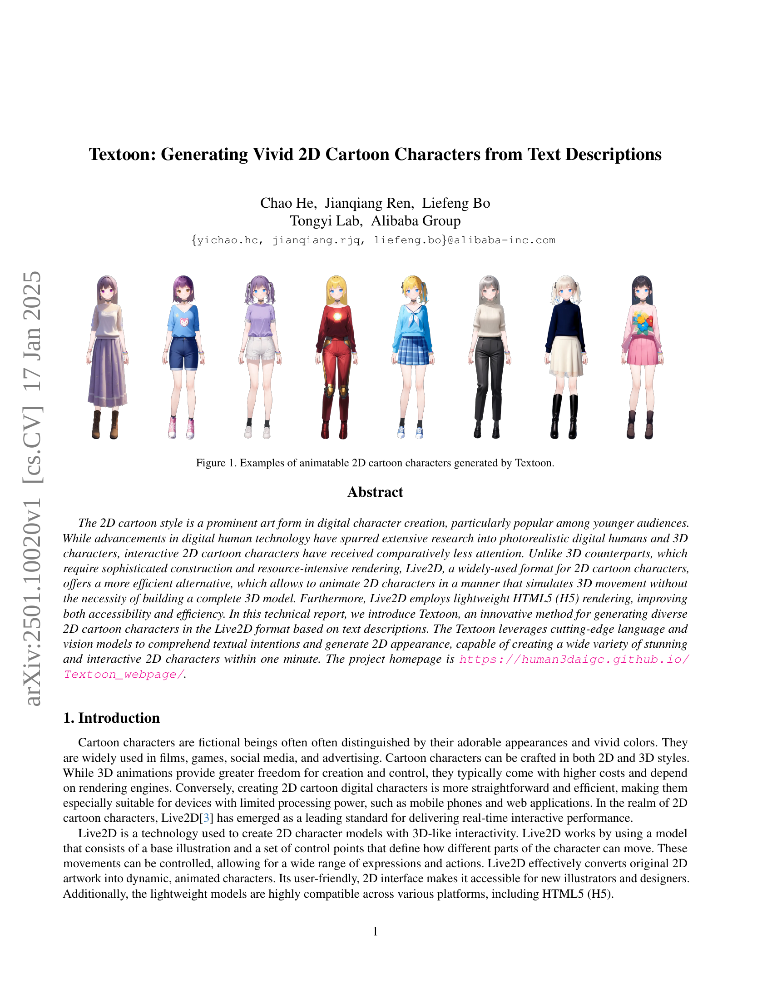
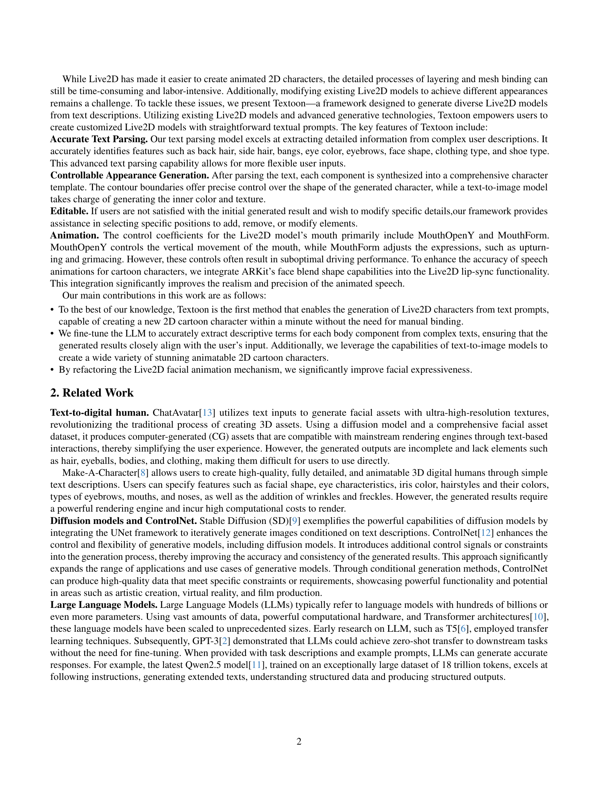
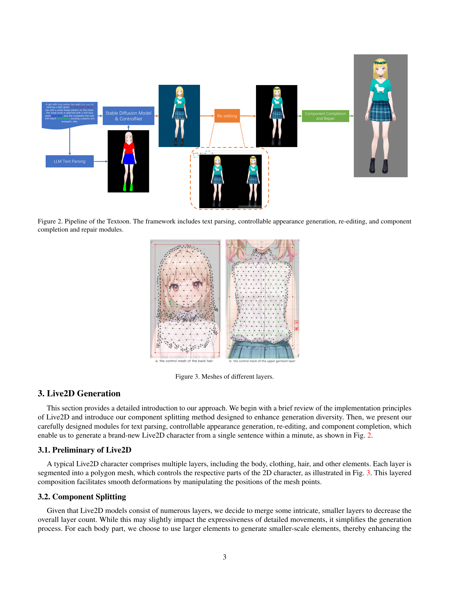
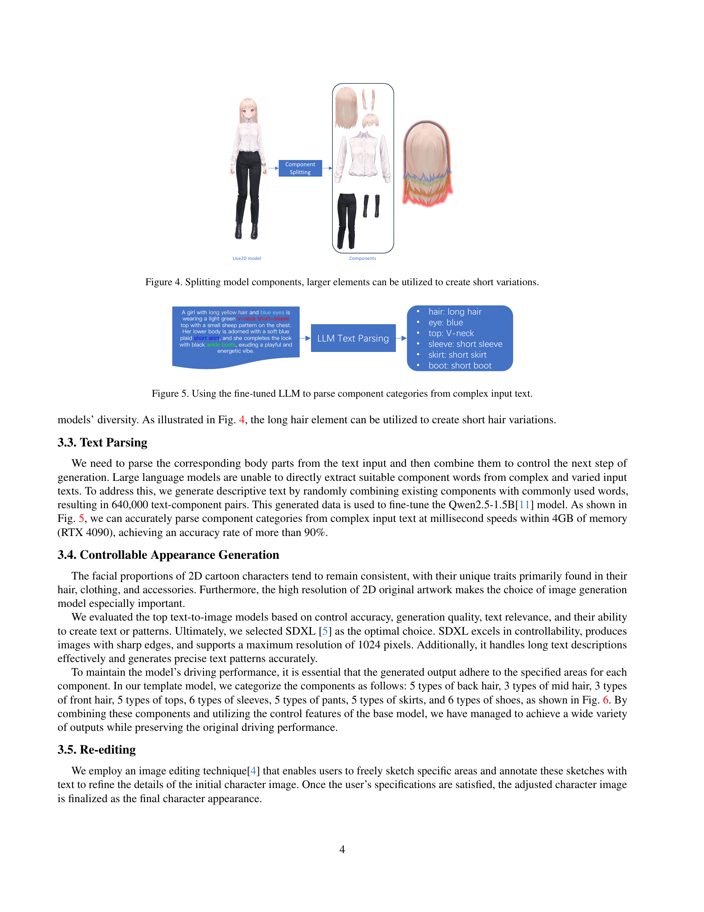
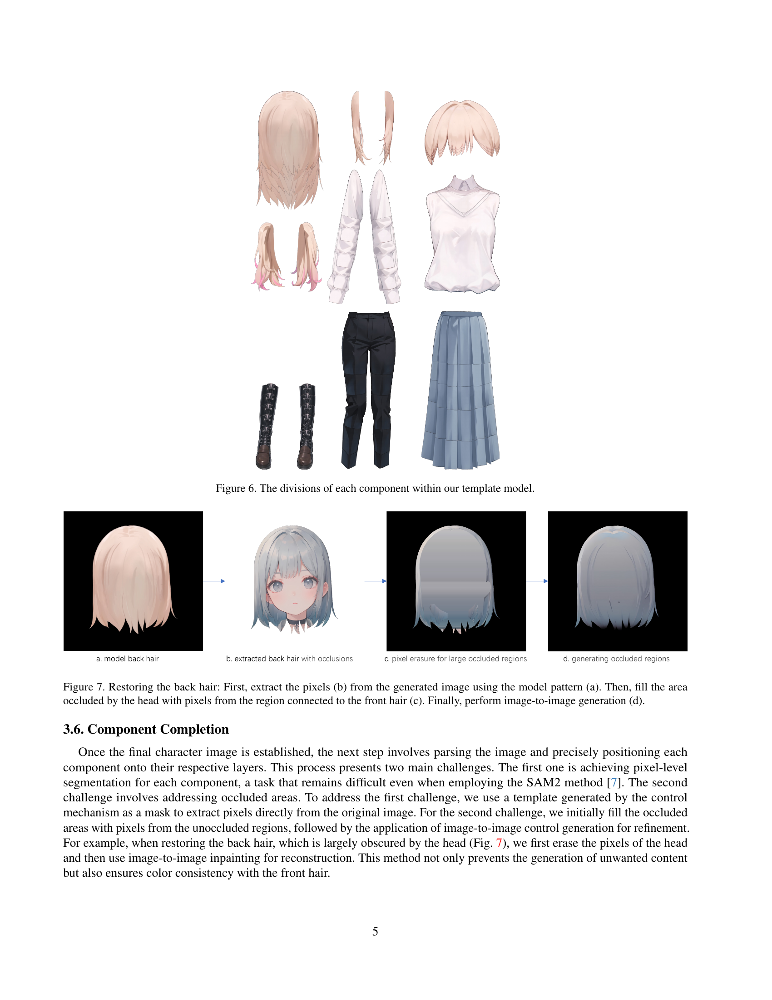
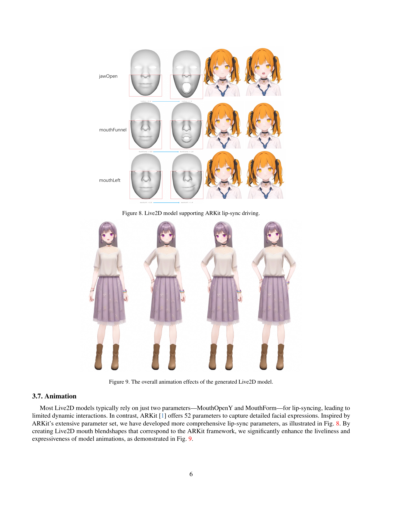
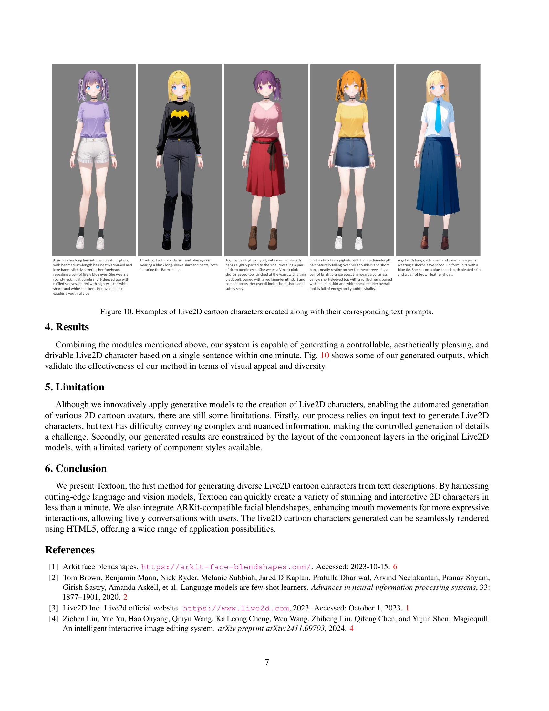
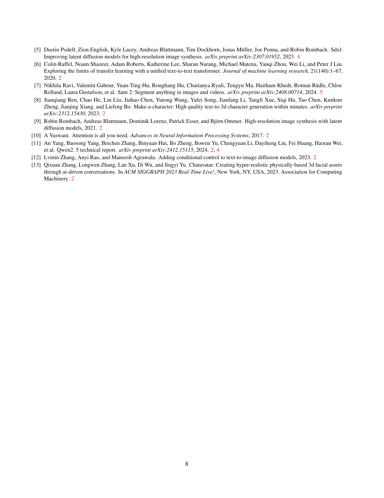

 


 2501.10020 
 Chao He et el. 
 
 🤗 2025-01-20 
 



↗ arXiv


↗ Hugging Face


↗ Papers with Code


### TL;DR



기존의 2D 만화 캐릭터 제작은 **복잡한 레이어링 및 메시 바인딩 과정**으로 인해 시간이 많이 걸리고 노동 집약적이었습니다.  또한, 기존 Live2D 모델을 수정하여 다른 외형을 얻는 것도 어려움이 있었습니다.  이러한 문제를 해결하기 위해, 본 논문에서는 **텍스트 설명을 사용하여 다양한 Live2D 모델을 생성하는 Textoon 프레임워크**를 제시합니다. Textoon은 기존 Live2D 모델과 첨단 생성 기술을 활용하여 사용자가 간단한 텍스트 프롬프트만으로 맞춤형 Live2D 모델을 생성할 수 있도록 합니다.

Textoon의 핵심 기능은 **정확한 텍스트 파싱, 제어 가능한 외형 생성, 편집 기능, 구성 요소 완성 및 복구 기능**입니다.  **LLM 기반 텍스트 파싱 모델**은 복잡한 사용자 설명에서 세부 정보를 추출하여 머리카락, 눈 색깔, 옷 스타일 등 다양한 특징을 정확하게 식별합니다. **제어 가능한 외형 생성 모듈**은 텍스트를 파싱한 후 각 구성 요소를 종합적인 캐릭터 템플릿으로 합성합니다. 사용자가 생성 결과에 만족하지 않을 경우, **편집 기능**을 통해 특정 부분을 추가, 제거 또는 수정할 수 있습니다. **애니메이션 기능**은 ARKit의 얼굴 블렌드 쉐이프 기능을 통합하여 애니메이션의 정확도를 높였습니다.  본 연구는 **텍스트 프롬프트를 통해 Live2D 캐릭터를 생성하는 최초의 방법**이며, **1분 안에 새로운 2D 만화 캐릭터를 생성**할 수 있습니다. 또한, **Live2D 얼굴 애니메이션 메커니즘을 개선**하여 얼굴 표정의 표현력을 크게 향상시켰습니다.



#### Key Takeaways


 Textoon은 텍스트 설명만으로 다양한 Live2D 만화 캐릭터를 빠르게 생성합니다. 



 최첨단 언어 및 비전 모델을 활용, 사용자 친화적이며, HTML5 렌더링으로 효율성을 높였습니다. 



 ARKit 기반의 얼굴 블렌드 쉐이프 기능 통합으로 애니메이션의 사실성과 표현력이 향상되었습니다. 


#### Why does it matter?
본 논문은 **텍스트 설명만으로 다양한 2D 만화 캐릭터를 Live2D 형식으로 생성하는 혁신적인 방법인 Textoon을 제시**합니다. 이는 기존의 복잡하고 시간이 많이 소요되는 2D 캐릭터 제작 과정을 간소화하고, 다양한 애니메이션 캐릭터를 빠르게 생성할 수 있는 가능성을 열어줍니다.  **최첨단 언어 및 비전 모델을 활용하여 텍스트 의도를 파악하고 2D 외형을 생성**하며, 사용자 친화적인 인터페이스를 제공합니다.  **연구는 HTML5 렌더링을 통해 접근성과 효율성을 향상시키고, ARKit 기반의 얼굴 블렌드 쉐이프 기능을 통합하여 애니메이션의 사실성을 높였습니다.**  이는 2D 애니메이션 캐릭터 제작 분야의 발전에 크게 기여할 뿐 아니라, 게임, 광고, 소셜 미디어 등 다양한 분야에서 활용될 수 있는 잠재력을 지닙니다.

------
#### Visual Insights

> 🔼 Textoon이 생성한 애니메이션 2D 만화 캐릭터의 다양한 예시들을 보여주는 그림입니다. 각 캐릭터는 고유한 디자인, 의상, 표정, 헤어스타일을 가지고 있으며,  다양한 스타일과 특징을 가진 2D 캐릭터를 생성하는 Textoon의 능력을 보여줍니다. 그림은 Textoon이 생성할 수 있는 다양하고 매력적인 캐릭터의 가능성을 보여주는 시각적 증거입니다.
> 

> 
read the caption

> Figure 1: Examples of animatable 2D cartoon characters generated by Textoon.
> 

### In-depth insights

#### Live2D Text-to-Avatar
**Live2D Text-to-Avatar**는 텍스트 설명만으로 애니메이션 2D 캐릭터를 생성하는 혁신적인 기술입니다. 기존 Live2D 모델 편집의 어려움과 시간 소모를 해결하며, **텍스트 분석, 외형 생성, 편집, 구성 요소 완성** 등의 모듈로 구성되어 있습니다.  **LLM(대규모 언어 모델) 기반의 정확한 텍스트 파싱**을 통해 사용자의 복잡한 설명을 정확히 이해하고, **제어 가능한 외형 생성**을 위해 텍스트-이미지 모델을 활용, 다양한 캐릭터를 생성합니다.  **구성요소 분할** 기법으로 생성 다양성을 높이고, **ARKit 연동**으로 실감나는 입 모양 동기화를 구현하여 생동감 있는 애니메이션을 제공합니다.  **단시간 내에 고품질의 Live2D 캐릭터 생성**을 가능하게 하지만, 복잡한 설명이나 세부 묘사 전달의 어려움, 기존 Live2D 모델 레이어 구조의 제약 등은 여전히 한계로 남습니다.  **향후 연구**는 보다 정교한 텍스트 이해 및 세부 디테일 제어, 다양한 스타일 지원 등을 통해 기술의 완성도를 더욱 높이는 방향으로 진행될 것입니다.  전반적으로 **사용자 편의성과 생성 효율성을 극대화**한 획기적인 기술이며, 애니메이션, 광고, 게임 등 다양한 분야에서 활용 가능성이 매우 높습니다.

#### Controllable Appearance
본 논문에서 제시된 "제어 가능한 외형(Controllable Appearance)" 개념은 텍스트 기반으로 2D 만화 캐릭터 생성 과정에서 사용자의 세밀한 요구사항을 반영하는 중요한 요소입니다. **텍스트 분석 모델의 정확성**은 사용자가 입력한 복잡한 묘사(예: 머리 스타일, 눈 색깔, 의상 등)를 정확히 파악하여, **세분화된 속성값으로 변환하는 능력**에 달려 있습니다.  이를 통해 시스템은 사용자의 의도를 정확하게 이해하고, **다양한 외형 요소들을 개별적으로 제어**할 수 있게 됩니다.  이는 단순히 이미지를 생성하는 것을 넘어, **사용자가 원하는 특징들을 정밀하게 조절하고 조합**하여 **개성있는 캐릭터를 만들 수 있게 하는 핵심 기능**입니다.  **각 구성 요소(머리카락, 눈, 의상 등)의 경계를 명확하게 정의**하고, **텍스트-이미지 모델을 활용하여 내부 색상과 질감을 생성**하는 방식은 **제어 가능성을 극대화**하고, **다양한 스타일의 캐릭터를 생성**할 수 있도록 합니다.  **사용자 편의성을 위해 수정 기능**도 제공되어, 초기 생성 결과에 만족하지 못할 경우, 특정 부분을 추가, 제거, 수정할 수 있도록 합니다.  결론적으로, 본 논문의 "제어 가능한 외형"은 사용자의 창의성과 표현의 자유도를 높이는 핵심적인 기술적 발전입니다.

#### Component Generation
본 논문에서 제시된 컴포넌트 생성 과정은 **텍스트 기반의 설명을 Live2D 캐릭터의 다양한 구성 요소로 변환하는 핵심적인 부분**입니다.  **LLM(Large Language Model)을 활용하여 입력 텍스트에서 각 구성요소(머리카락, 눈, 옷 등)에 대한 세부 정보를 정확하게 추출**합니다. 이렇게 추출된 정보는 **텍스트-이미지 생성 모델(예: Stable Diffusion)에 입력**되어 각각의 컴포넌트에 대한 이미지를 생성하는데 사용됩니다. 생성된 이미지들은 **Live2D 모델의 레이어 구조에 맞춰 정렬 및 결합**되는 과정을 거칩니다.  이 과정에서 **ControlNet과 같은 기술을 활용하여 생성 과정의 정확도 및 제어성을 높일 수 있으며, 필요에 따라 수정 및 보완 작업**도 수행됩니다.  특히, **부분적으로 가려진 영역(예: 머리카락이 얼굴을 가리는 부분)을 복원하기 위한 이미지 복원 기술**이 적용되어 완성도 높은 결과물을 얻을 수 있다는 점이 주목할 만합니다.  **전체적인 과정은 자동화되어 있어 사용자는 짧은 시간 안에 다양한 Live2D 캐릭터를 생성**할 수 있습니다. 그러나, **복잡한 설명이나 미묘한 차이를 정확히 반영하는 데는 한계**가 있을 수 있으며, 향후 연구를 통해 이러한 부분의 개선이 필요할 것으로 예상됩니다.

#### ARKit-Driven Animation
본 논문에서 제시된 ARKit 기반 애니메이션은 기존 Live2D 모델의 제한적인 표현력을 극복하기 위한 핵심적인 부분입니다. **기존 Live2D는 MouthOpenY와 MouthForm이라는 두 개의 파라미터만을 사용하여 입 모양 변화를 제한적으로 표현**했지만, ARKit의 52개 파라미터를 활용하여 **훨씬 세밀하고 다양한 얼굴 표정을 구현**합니다. 이는 ARKit의 풍부한 얼굴 표정 데이터를 Live2D 모델에 적용하여 **자연스럽고 생동감 있는 애니메이션을 가능하게** 합니다.  **단순한 입 모양 변화를 넘어 훨씬 현실적이고 다채로운 표정 변화를 구현**함으로써, 생성된 2D 캐릭터의 몰입도와 상호작용성을 크게 향상시킵니다. 특히, **실제 사람의 얼굴 움직임을 보다 정확하게 반영**하여 더욱 사실적인 애니메이션 효과를 제공합니다. 이는 단순히 기술적인 발전을 넘어, **사용자에게 보다 뛰어난 몰입감과 감성적 경험을 제공**하는 데 크게 기여하며,  텍스트 기반으로 생성된 2D 캐릭터의 표현력을 한층 끌어올리는 핵심 요소가 됩니다. 따라서 ARKit 기반 애니메이션은  **기술적 완성도와 사용자 경험 향상 모두를 만족시키는 중요한 부분**이라고 볼 수 있습니다.

#### Textoon Limitations
Textoon은 텍스트 기반 Live2D 캐릭터 생성의 혁신적인 시도이지만, 몇 가지 중요한 한계점을 가지고 있습니다. **텍스트만으로 복잡하고 미묘한 정보를 전달하는 데는 어려움이 있으며, 이는 세부적인 제어에 제약을 가져옵니다.** 따라서, 사용자의 의도와 실제 생성 결과 사이에는 차이가 발생할 수 있습니다. 또한, **원본 Live2D 모델의 레이아웃에 의존하기 때문에 생성 가능한 캐릭터의 스타일과 종류가 제한적입니다.**  기존 모델의 구성 요소를 재활용하기 때문에 다양성 확보에 어려움이 있고, 완전히 새로운 스타일의 캐릭터를 생성하는 데에는 한계가 있습니다.  **텍스트 분석 모델의 정확도 또한 완벽하지 않아, 오류가 발생할 가능성이 있습니다.**  더욱이,  **복잡한 이미지 생성 과정으로 인해 처리 시간이 오래 걸릴 수 있으며, 고성능 하드웨어를 필요로 합니다.**  향후 연구에서는 텍스트 이외의 다양한 입력 방식을 도입하거나, 생성 가능한 스타일의 다양성을 확장하여 이러한 한계를 극복하는 방안을 모색해야 할 것입니다.  더욱 정교한 제어 기능을 제공하여 사용자의 창의성을 극대화하는 것도 중요한 과제입니다.

### More visual insights

More on figures

> 🔼 본 그림은 논문에서 제시된 Textoon 프레임워크의 파이프라인을 보여줍니다.  텍스트 파싱 모듈을 통해 사용자의 텍스트 입력을 분석하고, 이를 기반으로 제어 가능한 외형 생성 모듈에서 캐릭터의 외모를 생성합니다. 생성된 캐릭터는 재편집 모듈을 통해 세부적인 수정이 가능하며, 부품 완성 및 복구 모듈을 통해 누락되거나 불완전한 부분을 보완합니다.  최종적으로 완성된 Live2D 캐릭터가 생성됩니다.  각 모듈은 서로 연계되어 작동하며, 효율적인 Live2D 캐릭터 생성 과정을 보여줍니다.
> 

> 
read the caption

> Figure 2: Pipeline of the Textoon. The framework includes text parsing, controllable appearance generation, re-editing, and component completion and repair modules.
> 

> 🔼 그림은 Live2D 캐릭터의 다양한 레이어(층)에 해당하는 메쉬(mesh)를 보여줍니다.  (a)는 뒷머리, (b)는 상의의 윗부분 레이어에 대한 메쉬를 각각 나타냅니다.  각 레이어는 폴리곤 메쉬로 분할되어 있으며, 이를 조작하여 2D 캐릭터의 각 부분의 변형을 부드럽게 제어할 수 있습니다.  이러한 계층적 구성은 Live2D 캐릭터의 자연스러운 애니메이션을 가능하게 합니다.
> 

> 
read the caption

> Figure 3: Meshes of different layers.
> 

> 🔼 그림 4는 Live2D 모델 구성 요소를 분할하는 방법을 보여줍니다. 더 큰 요소들을 활용하여 머리카락 길이 등의 변형을 쉽게 만들 수 있다는 것을 보여주는 예시입니다.  짧은 머리 스타일을 만들기 위해 긴 머리 요소를 재사용하는 등의 다양한 변형이 가능함을 시각적으로 보여줍니다. 이를 통해 더욱 다양하고 유연한 캐릭터 생성이 가능해집니다.
> 

> 
read the caption

> Figure 4: Splitting model components, larger elements can be utilized to create short variations.
> 

> 🔼 이 그림은 복잡한 입력 텍스트에서 구성 요소 범주를 파싱하기 위해 미세 조정된 대규모 언어 모델(LLM)의 사용을 보여줍니다.  그림은 복잡한 문장을 입력으로 받아,  LLM이 머리카락, 눈, 상의, 소매, 치마, 부츠 등과 같은 다양한 의류 및 외모 특징과 같은 구성 요소 범주들을 정확하게 식별하는 과정을 시각적으로 보여줍니다. 이는 Textoon 시스템이 사용자의 텍스트 설명을 정확하게 해석하고,  그에 따라 캐릭터의 외모를 생성하는 데 중요한 단계입니다.
> 

> 
read the caption

> Figure 5: Using the fine-tuned LLM to parse component categories from complex input text.
> 

> 🔼 그림 6은 논문에서 제시하는 템플릿 모델 내에서 각 구성 요소가 어떻게 나뉘는지를 보여줍니다. 머리, 상의, 하의, 신발 등 각 의상 요소들이 개별적인 부분으로 나뉘어져 있으며, 이는 사용자가 각 부분을 따로 제어하여 다양한 스타일의 캐릭터를 생성할 수 있도록 하기 위함입니다. 각 구성 요소는 서로 중복되지 않고 명확하게 구분되어 있으며, 이는 이미지 생성 과정에서 각 요소의 정확한 위치와 형태를 제어하는 데 중요한 역할을 합니다. 이러한 분리는 Live2D 모델 생성 과정의 효율성을 높이고, 사용자의 편의성을 증대시키는 데 기여합니다.
> 

> 
read the caption

> Figure 6: The divisions of each component within our template model.
> 

> 🔼 그림 7은 뒷머리 복원 과정을 보여줍니다. 먼저 (a)의 모델 패턴을 사용하여 생성된 이미지에서 픽셀 (b)를 추출합니다. 그런 다음 머리카락으로 가려진 영역을 앞머리에 연결된 영역의 픽셀 (c)로 채웁니다. 마지막으로 이미지 간 생성 (d)을 수행하여 뒷머리를 완성합니다. 이 과정은 머리카락이 머리에 의해 가려진 부분을 복구하는 방법을 보여주는 단계별 설명을 제공합니다.
> 

> 
read the caption

> Figure 7: Restoring the back hair: First, extract the pixels (b) from the generated image using the model pattern (a). Then, fill the area occluded by the head with pixels from the region connected to the front hair (c). Finally, perform image-to-image generation (d).
> 

> 🔼 그림 8은 ARKit 기반의 입술 동기화 구동을 지원하는 Live2D 모델을 보여줍니다.  Live2D 모델은 일반적으로 MouthOpenY와 MouthForm이라는 두 개의 매개변수만을 사용하여 입술 싱크를 수행하기 때문에 역동적인 상호 작용이 제한적입니다. 하지만 ARKit은 보다 자세한 얼굴 표정을 캡처하기 위해 52개의 매개변수를 제공합니다. 본 논문에서는 ARKit의 광범위한 매개변수 세트에서 영감을 얻어, ARKit 프레임워크에 해당하는 Live2D 입술 모양 변형을 생성함으로써 모델 애니메이션의 생동감과 표현력을 크게 향상시켰습니다. 그림은 ARKit 기반 입술 동기화를 지원하는 Live2D 모델의 입 모양 변화를 보여줍니다.
> 

> 
read the caption

> Figure 8: Live2D model supporting ARKit lip-sync driving.
> 

> 🔼 그림 9는 본 논문에서 제안하는 방법으로 생성된 Live2D 모델의 전반적인 애니메이션 효과를 보여줍니다.  Live2D 모델의 입 모양 변화를 ARKit의 얼굴 표정 매개변수를 이용하여 보다 자연스럽고 다양하게 표현할 수 있음을 시각적으로 보여주는 이미지입니다. 여러가지 입 모양과 표정 변화를 통해 더욱 생동감 있는 애니메이션을 구현했음을 보여줍니다.
> 

> 
read the caption

> Figure 9: The overall animation effects of the generated Live2D model.
> 

> 🔼 그림 10은 본 논문에서 제시된 방법을 사용하여 생성한 Live2D 캐릭터들과 각 캐릭터에 해당하는 텍스트 프롬프트들을 보여줍니다. 다양한 스타일과 특징을 가진 여러 캐릭터들이 생성되었으며, 각 캐릭터의 외형적 특징들은 텍스트 프롬프트에 잘 반영되어 있음을 확인할 수 있습니다. 이는 본 논문에서 제안하는 방법의 효과성과 다양성을 보여주는 좋은 예시입니다.
> 

> 
read the caption

> Figure 10: Examples of Live2D cartoon characters created along with their corresponding text prompts.
> 

### Full paper



