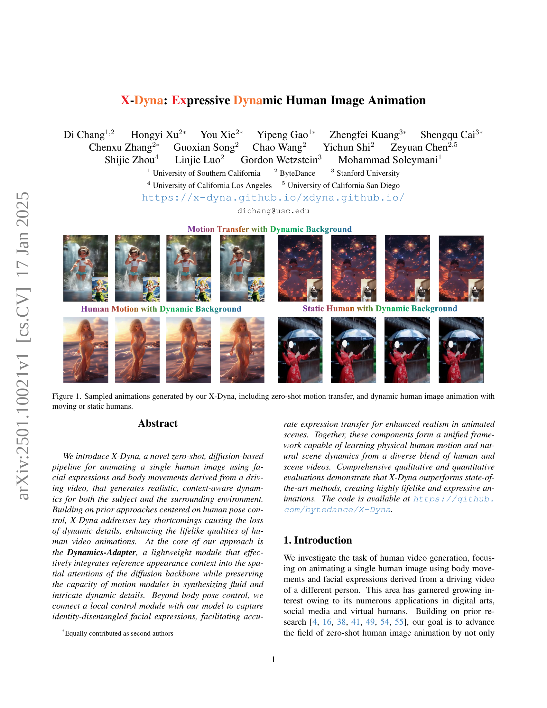

 


 2501.10021 
 Di Chang et el. 
 
 🤗 2025-01-20 
 



↗ arXiv


↗ Hugging Face


↗ Papers with Code


### TL;DR



기존의 인간 이미지 애니메이션 연구는 **역동적인 동작과 표정을 자연스럽게 생성하는 데 어려움**을 겪어 왔습니다. 특히, 배경과 인물의 움직임을 동시에 사실적으로 표현하는 것은 큰 과제였습니다. 또한, **기존의 방법들은 배경이 정적인 영상 데이터에 주로 기반**하여, 실제 세상의 역동적인 장면을 잘 반영하지 못했습니다. 이러한 한계는 애니메이션의 현실감을 떨어뜨리고, 다양한 응용 분야에서의 활용성을 제한했습니다.

본 논문에서는 이러한 문제를 해결하기 위해 **X-Dyna라는 새로운 제로샷 기반의 인공지능 모델**을 제안합니다. X-Dyna는 **단일 이미지와 동작 영상만으로도 인물과 배경의 움직임을 실감나게 재현**할 수 있습니다.  핵심은 **Dynamics-Adapter**라는 경량화된 모듈과 **얼굴 표정을 제어하는 모듈**입니다. Dynamics-Adapter는 배경과 인물의 움직임을 자연스럽게 연결하고, 얼굴 표정 제어 모듈은 보다 정교한 표정을 애니메이션에 반영합니다.  실험 결과, X-Dyna는 **기존 방법들보다 훨씬 사실적이고 표현력 넘치는 애니메이션**을 생성하는 것으로 나타났습니다.  이 연구는 인간 이미지 애니메이션 분야의 발전에 크게 기여하며, 향후 다양한 분야에서 활용될 수 있을 것으로 기대됩니다.



#### Key Takeaways


 제로샷 방식으로 단일 이미지를 사용하여 사실적인 동적 인간 애니메이션을 생성하는 X-Dyna 제안 



 Dynamics-Adapter 모듈을 통해 동적 디테일 손실 문제 해결 및 현실감 향상 



 얼굴 표정 제어 모듈을 통한 정교한 표정 전달 및 애니메이션 표현력 향상 


#### Why does it matter?
본 논문은 **영상 기반 제로샷 인간 이미지 애니메이션 분야에 대한 중요한 발전**을 제시합니다. 기존 방법들의 한계를 극복하고 **실제와 같은 동적인 디테일과 표현력 있는 애니메이션 생성**을 가능하게 함으로써, 디지털 아트, 소셜 미디어, 가상 인간 등 다양한 분야에서 활용될 수 있는 잠재력을 지닙니다.  **새로운 Dynamics-Adapter 모듈**과 **얼굴 표정 제어 모듈**을 제안하여 **영상의 역동성과 정확성을 향상**시키고 **연구 분야에 새로운 가능성**을 제시합니다.  이는 **향후 연구 방향**을 제시하며 **다양한 응용 분야**에 파급 효과를 가지는 중요한 결과입니다.

------
#### Visual Insights

> 🔼 본 그림은 제안된 X-Dyna 모델의 아키텍처를 보여줍니다. X-Dyna는 사전 훈련된 확산 UNet 백본을 사용하여 제어된 사람 이미지 애니메이션을 생성합니다.  이 모델은 역동적이고 정교한 디테일과 정밀한 모션 제어를 가능하게 합니다. 특히, 참조 이미지 컨텍스트를 공간적 어텐션에 훈련 가능한 잔차로써 매끄럽게 통합하는 역할을 하는 Dynamics Adapter(D)를 도입했습니다.  이 과정은 잡음 제거 프로세스와 병행하여 진행되며, 기존의 UNet 내 공간적 및 시간적 어텐션 메커니즘은 그대로 유지됩니다.  또한, ControlNet(CP)을 통한 신체 자세 제어 외에도, 합성된 교차 신원 얼굴 패치로부터 얼굴 표정 제어를 암묵적으로 학습하는 로컬 얼굴 제어 모듈(CF)을 도입했습니다.  모델은 다양한 인간 동작 비디오와 자연 장면 비디오 데이터셋으로 동시에 훈련됩니다. 결과적으로, 신체 자세와 얼굴 표정을 뛰어나게 전이하고, 사람과 장면 모두에 매우 생생하고 상세한 역동성을 제공합니다.
> 

> 
read the caption

> Figure 1:  We leverage a pretrained diffusion UNet backbone for controlled human image animation, enabling expressive dynamic details and precise motion control. Specifically, we introduce a dynamics adapter D𝐷Ditalic_D that seamlessly integrates the reference image context as a trainable residual to the spatial attention, in parallel with the denoising process, while preserving the original spatial and temporal attention mechanisms within the UNet. In addition to body pose control via a ControlNet CPsubscript𝐶𝑃C_{P}italic_C start_POSTSUBSCRIPT italic_P end_POSTSUBSCRIPT , we introduce a local face control module CFsubscript𝐶𝐹C_{F}italic_C start_POSTSUBSCRIPT italic_F end_POSTSUBSCRIPT that implicitly learns facial expression control from a synthesized cross-identity face patch. We train our model on a diverse dataset of human motion videos and natural scene videos simultaneously. Our model achieves remarkable transfer of body poses and facial expressions, as well as highly vivid and detailed dynamics for both the human and the scene.
> 


| Method | FG-DTFVD ↓ | BG-DTFVD ↓ | DTFVD ↓ |
|---|---|---|---|
| MagicAnimate [49] | 1.753 | 2.142 | 2.601 |
| Animate-Anyone [16] | 1.789 | 2.034 | 2.310 |
| MagicPose [4] | 1.846 | 1.901 | 2.412 |
| MimicMotion [54] | 2.639 | 3.274 | 3.590 |
| X-Dyna | **0.900** | **1.101** | **1.518** |

> 🔼 표 1은 X-Dyna와 최근 최첨단(SOTA) 방법들을 역동적인 텍스처 생성 측면에서 정량적으로 비교한 표입니다.  화살표는 값이 낮을수록 좋다는 것을 나타냅니다. DTFVD [5]는 FVD 사전 훈련 백본을 DTDB [10]에서 훈련된 백본으로 바꿔 계산한 것입니다. FG-DTFVD는 영상 분할 후 전경 부분에서 DTFVD를 실행한 것이고, BG-DTFVD는 배경 부분의 DTFVD를 나타냅니다.  즉,  다양한 모델들의 영상 생성 성능을 역동적인 텍스처 생성 능력에 초점을 맞춰 비교 분석한 표이며,  전경과 배경 영상의 질에 대한 분석까지 포함하고 있습니다.
> 

> 
read the caption

> Table 1: Quantitative comparisons of X-Dyna with the recent state-of-the-art (SOTA) methods on dynamics texture generation. A downward-pointing arrow indicates that lower values are better and vise versa. DTFVD [5] is calculated by replacing the FVD pre-trained backbone with one trained on DTDB [10]. FG-DTFVD denotes the DTFVD is running on the foreground parts of the videos after segmentation, and BG-DTFVD denotes the DTFVD of the background parts.
> 

### In-depth insights

#### X-Dyna: Core Idea
X-Dyna는 **영상 기반의 제로샷(zero-shot)** 휴먼 이미지 애니메이션을 위한 새로운 확산 기반(diffusion-based) 모델입니다.  기존 방법들의 한계를 극복하고자 **역동적인 디테일과 자연스러운 움직임**을 생성하는 데 초점을 맞췄습니다. 핵심 아이디어는 **Dynamics-Adapter** 모듈을 통해 참조 이미지의 외형 정보를 효과적으로 통합하는 것입니다. 이 모듈은 기존의 UNet 백본의 공간적 주의(spatial attention)에 참조 이미지 컨텍스트를 추가하여 **역동적인 디테일 손실을 최소화**합니다. 또한, **Local Face Control Module**을 통해 신원과 분리된 얼굴 표정 제어를 가능하게 하여 애니메이션의 사실성을 높입니다.  **다양한 종류의 영상 데이터**를 학습하여 휴먼 모션과 배경 역학을 모두 학습하며,  **실제 같은 애니메이션**을 생성하는 것이 주요 목표입니다.

#### Dynamic Adapter
본 논문에서 제안하는 다이나믹 어댑터(Dynamics Adapter)는 **기존 방식의 한계점을 극복하기 위해 등장한 핵심 모듈**입니다. 이전의 참조 이미지 정보 활용 방식은 배경의 역동적인 움직임을 제대로 반영하지 못하고 정적인 결과물을 생성하는 문제점이 있었습니다. 이에 비해 다이나믹 어댑터는 **참조 이미지의 외형 정보를 효과적으로 통합하면서도, 동시에 확산 모델의 동적 디테일 생성 능력을 유지**합니다. **가볍고 효율적인 구조**를 통해, 참조 이미지 맥락을 공간적 어텐션에 효과적으로 통합하여 실제와 같은 생동감 있는 애니메이션을 생성합니다. **기존 방식과 달리, 다이나믹 어댑터는 참조 이미지의 외형 정보를 추가적인 손실 없이 효율적으로 주입**하여, 인물과 배경의 역동적인 움직임을 모두 포착하는 뛰어난 성능을 보여줍니다.  **제안하는 모듈의 핵심은 공간적 어텐션에 참조 이미지 맥락을 효과적으로 통합하면서 원본 모델의 동적 디테일 생성 능력을 유지**하는 데 있습니다. 이를 통해 기존의 한계를 뛰어넘는, 보다 사실적이고 표현력이 뛰어난 애니메이션 생성이 가능해졌습니다.

#### ControlNet Fusion
논문에서 "ControlNet Fusion"이라는 제목의 내용을 직접적으로 다루지는 않지만, 제시된 내용을 바탕으로 ControlNet과 관련된 융합 기술에 대한 심층적인 생각을 정리해 보겠습니다. **본 논문의 핵심은 다양한 조건(포즈, 표정, 배경 등)을 동시에 만족하는, 현실감 있는 동적 인물 영상 생성입니다.** 이를 위해 단순한 Pose ControlNet을 넘어, **얼굴 표정 제어를 위한 별도의 ControlNet 모듈(S-Face ControlNet)** 과 **영상의 동적인 요소를 효과적으로 반영하는 Dynamics-Adapter 모듈**을 제안합니다.  **Dynamics-Adapter는 기존의 ReferenceNet 방식의 단점(동적인 세부 묘사의 부족)**을 극복하기 위해,  **참조 이미지의 외관 정보를 확산 모델의 공간적 주의 메커니즘에 효율적으로 통합하는 경량화된 모듈입니다.** S-Face ControlNet과 Dynamics-Adapter는 서로 독립적으로 동작하면서, **전체적으로 일관되고 자연스러운 동적 인물 영상 생성을 위한 융합 기술**이라고 볼 수 있습니다.  즉, ControlNet Fusion이라는 개념은 **다양한 ControlNet의 조합과, 이를 확산 모델에 효과적으로 통합하는 기술**을 의미하며, 이는 **단순한 합산 이상의 시너지 효과**를 창출한다는 점에서 주목할 만합니다.  **이를 통해, 단일 이미지에서 출발하여 다양한 동작과 배경을 반영한 고품질 동적 인물 영상 생성**이 가능해집니다.

#### X-Dyna: Limits
X-Dyna는 영상 생성 분야에서 뛰어난 성능을 보이지만, 여전히 몇 가지 제한점을 가지고 있습니다. **극단적인 확대 또는 축소 변환**의 경우, 외관 및 정체성이 완벽하게 보존되지 않을 수 있습니다. 또한, **손동작 생성**에 어려움을 겪는 것으로 나타났습니다. 이러한 한계는 더욱 고품질의 데이터를 수집하고, **고급 손동작 표현 기법**을 적용함으로써 해결될 수 있을 것으로 예상됩니다.  **다양한 배경 및 환경**에서의 안정적인 성능 확보 또한 중요한 과제이며, 향후 연구를 통해 개선될 필요가 있습니다.  **트레이닝 데이터의 다양성 확보**는 X-Dyna의 일반화 성능 향상에 필수적입니다. 마지막으로, 사용자 친화적인 인터페이스 제공을 위해 **카메라 궤적 제어나 드래그 제어**와 같은 기능을 추가적으로 연구하는 것이 필요합니다.

#### Future of X-Dyna
X-Dyna는 영상 합성 분야에 혁신적인 발전을 가져왔지만, 여전히 개선의 여지가 있습니다. **향후 X-Dyna의 발전 방향은 고해상도 영상 합성, 더욱 정교한 제어 기능, 다양한 스타일 지원 및 실시간 처리 성능 향상**에 초점을 맞춰야 합니다.  고해상도 영상 합성을 위해서는 더욱 강력한 모델과 효율적인 학습 방법론이 필요하며, 정교한 제어 기능은 사용자의 의도를 더욱 정확하게 반영하는 다양한 매개변수 및 제어 인터페이스 개발을 통해 가능해집니다.  **다양한 스타일 지원은 다양한 데이터셋을 활용한 학습 및 스타일 변환 기술 발전**을 통해 이루어질 수 있으며, **실시간 처리 성능 향상은 경량화된 모델 구조 개발과 하드웨어 가속화 기술**을 통해 실현될 수 있습니다.  이러한 발전을 통해 X-Dyna는 보다 현실감 있고 몰입도 높은 영상 합성을 제공하고, 다양한 분야에서 활용될 수 있을 것입니다.  **특히, 3D 모델링 및 애니메이션, 가상현실, 증강현실 및 메타버스와의 결합**은 X-Dyna의 잠재력을 극대화하는 중요한 방향이 될 것입니다.

### More visual insights

More on figures

> 🔼 그림 2는 세 가지 다른 방법으로 참조 이미지의 외관을 활용하여 이미지 생성에 접근하는 방식을 보여줍니다. (a) IP-Adapter는 참조 이미지로부터 생생한 질감을 생성하지만 외관을 유지하는 데 실패합니다. (b) ReferenceNet은 사람 참조 이미지의 정체성을 유지하지만 역동적인 배경 없이 정적인 배경을 생성합니다. (c) Dynamics-Adapter는 표현력 있는 세부 정보와 일관된 정체성을 모두 제공합니다.
> 

> 
read the caption

> Figure 2:  a) IP-Adapter [50] can generate vivid texture from the reference image but fails to preserve the appearance. b) Though ReferenceNet [16] can preserve the identity from the human reference, it generates a static background without any dynamics. c) Dynamics-Adapter provides both expressive details and consistent identities.
> 

> 🔼 그림 4는 세 가지 다른 방식으로 참조 이미지를 사용하여 이미지 생성 모델에 외관 정보를 통합하는 방법을 보여줍니다. a) IP-Adapter는 참조 이미지를 CLIP 임베딩으로 인코딩하고, 이 정보를 SD의 크로스 어텐션 레이어에 잔차(residual)로 주입합니다. b) ReferenceNet은 학습 가능한 병렬 UNet을 사용하고, 자체 어텐션 특징의 연결을 통해 의미론적 정보를 SD에 공급합니다. c) Dynamics-Adapter는 부분적으로 공유된 가중치의 UNet을 사용하여 참조 이미지를 인코딩합니다. 외관 제어는 학습 가능한 질의(query) 및 출력 선형 레이어를 사용하여 자체 어텐션 내 잔차를 학습함으로써 수행됩니다. 다른 모든 구성 요소는 SD와 동일한 고정 가중치를 공유합니다.
> 

> 
read the caption

> Figure 3: a) IP-Adapter [50] encodes the reference image as an image CLIP embedding and injects the information into the cross-attention layers in SD as the residual. b) ReferenceNet [16] is a trainable parallel UNet and feeds the semantic information into SD via concatenation of self-attention features. c) Dynamics-Adapter encodes the reference image with a partially shared-weight UNet. The appearance control is realized by learning a residual in the self-attention with trainable query and output linear layers. All other components share the same frozen weight with SD.
> 

> 🔼 본 그림은 제안된 X-Dyna 모델과 기존 최첨단(SOTA) 모델들이 동적인 배경 속 인물을 애니메이션화한 결과를 비교 분석한 것입니다. 기존 SOTA 모델들은 인물과 배경의 동적인 상호작용을 일관되고 현실적으로 생성하는 데 어려움을 겪는 반면, X-Dyna 모델은 참조 이미지의 구조를 유지하면서 역동적인 인물-배경 상호작용을 성공적으로 생성하여 더욱 사실적이고 일관성 있는 애니메이션을 만들어냄을 보여줍니다.
> 

> 
read the caption

> Figure 4: Qualitative Comparison on Human in Dynamic Scene. While existing SOTA methods struggle to generate consistent and realistic scene dynamics involving humans, our method successfully produces dynamic human-scene interactions while preserving the structure of the reference image.
> 

> 🔼 그림 5는 제안된 X-Dyna 모델과 기존의 다른 모델들이 얼굴 표정과 자세 제어를 얼마나 잘 수행하는지 비교 분석한 결과를 보여줍니다. 동일한 기준 이미지와 자세 골격을 사용하여 각 모델의 결과를 보여주며, 더욱 명확한 비교를 위해 얼굴 영역을 확대하여 보여줍니다. 결과적으로, 제안된 X-Dyna 모델이 실제 정답과 가장 유사하며 얼굴 식별 정보를 가장 잘 보존함을 보여줍니다.
> 

> 
read the caption

> Figure 5: Qualitative Comparison on Poses and Face Expressions Control. We show each method on test cases using the same reference image and pose skeleton. For improved visualization, a zoomed-in view of the face area is also provided. Our method produces results that most closely match the ground truth and best preserve face identity.
> 

More on tables


| Method | L1 ↓ | PSNR ↑ | LPIPS ↓ | SSIM ↑ | Face-Cos ↑ | Face-Det ↑ | FID ↓ | cd-FVD ↓ | FID ↓ | cd-FVD ↓ |
|---|---|---|---|---|---|---|---|---|---|---|
| MagicAnimate [4] | 7.42e-05 | 17.143 | 0.228 | 0.739 | 0.297 | 92.1% | 31.97 | 237.59 | 38.86 | 176.17 |
| Animate-Anyone* [16] | 11.8e-05 | 13.411 | 0.338 | 0.605 | 0.402 | 89.0% | 33.75 | 233.39 | 34.27 | 203.59 |
| MagicPose [4] | 13.7e-05 | 12.639 | 0.345 | 0.618 | 0.396 | 85.5% | 18.52 | 537.96 | 24.43 | 480.14 |
| MimicMotion [54] | 9.78e-05 | 14.903 | 0.278 | 0.647 | 0.193 | 92.0% | 45.67 | 150.01 | 60.32 | 194.17 |
| X-Dyna | 7.15e-05 | 17.201 | 0.249 | 0.724 | 0.497 | 94.8% | 22.56 | 325.35 | 25.59 | 281.78 |
> 🔼 표 2는 최근 최첨단(SOTA) 방법들과 X-Dyna의 인간 비디오 애니메이션 결과에 대한 정량적 비교를 보여줍니다. 화살표는 값이 낮을수록 좋다는 것을 나타냅니다. Face-Cos는 생성된 이미지와 실제 이미지의 얼굴 영역에서 AdaFace [21]에 의해 추출된 특징 간의 코사인 유사도를 나타내고, Face-Det는 모든 프레임에서 감지된 유효한 얼굴의 비율을 나타냅니다. *는 방법이 공개 소스가 아니라는 것을 나타내며, 따라서 비공식 구현 [29]을 사용하여 해당 방법을 실행했습니다.
> 

> 
read the caption

> Table 2: Quantitative comparisons of X-Dyna with the recent SOTA methods on human video animation. A downward-pointing arrow indicates that lower values are better and vise versa. Face-Cos represents the cosine similarity of the extracted feature by AdaFace [21] of face area between generation and ground truth image. Face-Det denotes the percentage rate of detected valid faces among all frames. ∗ denotes the method is not open-sourced; hence, we used the unofficial implementation from [29] to run their method for inference.
> 


| Method | FG-Dyn | BG-Dyn | ID | Overall |
|---|---|---|---|---|
| MagicAnimate [49] | 2.34 | 2.78 | 3.45 | 2.86 |
| Animate-Anyone [16] | 2.21 | 2.57 | 3.89 | 2.89 |
| MagicPose [4] | 2.23 | 2.18 | 3.85 | 2.75 |
| MimicMotion [54] | 2.02 | 2.63 | 2.79 | 2.48 |
| X-Dyna | 3.87 | 4.26 | 4.14 | 4.09 |
> 🔼 본 표는 논문의 사용자 연구 결과를 보여줍니다. 100명의 참가자들이 테스트 세트의 50개 테스트 사례에 대해 0점에서 5점까지의 등급을 매겼습니다. 각 사례에 대해 참가자들은 전경 역동성(FG-Dyn), 배경 역동성(BG-Dyn), 그리고 정체성 보존(ID)의 세 가지 측면을 평가했습니다. 이 표는 X-Dyna 모델이 이 세 가지 측면 모두에서 높은 평가를 받았다는 것을 보여줍니다.
> 

> 
read the caption

> Table 3: User study of X-Dyna. We collect the ratings (0-5) from 100 participants for 50 test cases in the test set. We ask them to rate the generation in terms of Foreground Dynamics (FG-Dyn), Background Dynamics (BG-Dyn) and Identity Preserving (ID).
> 


| Method | FG-DTFVD ↓ | BG-DTFVD ↓ | DTFVD ↓ | Face-Cos ↑ |
|---|---|---|---|---|
| w/RefNet | 2.137 | 2.694 | 2.823 | 0.466 |
| w/IP-A | 3.738 | 4.702 | 4.851 | 0.292 |
| w/lmk | 0.914 | 1.125 | 1.589 | 0.406 |
| wo/face | 0.912 | **1.098** | 1.550 | 0.442 |
| wo/fusion | 1.301 | 1.467 | 1.652 | **0.495** |
| X-Dyna | **0.900** | 1.101 | **1.518** | **0.497** |
> 🔼 표 4는 X-Dyna 모델의 성능에 대한 ablation study 결과를 보여줍니다.  Dynamics-Adapter를 ReferenceNet, IP-Adapter로 교체했을 때, S-Face ControlNet을 사용하지 않고 얼굴 랜드마크만 사용했을 때, S-Face ControlNet을 사용하지 않았을 때, 그리고 Harmonic Data Fusion Training을 사용하지 않았을 때의 성능 변화를 보여줍니다. 각 변수를 제거했을 때 역동적인 텍스처 생성 및 얼굴 표정 생성에 미치는 영향을 정량적으로 분석합니다.
> 

> 
read the caption

> Table 4: Ablation Analysis of X-Dyna on dynamics texture generation and local facial expressions generation. w/RefNet denotes Dynamics-Adapter is replaced by a ReferenceNet. w/IP-A denotes Dynamics-Adapter is replaced by an IP-Adapter. w/lmk denotes S-Face ControlNet is not used for fine-tuning and face landmarks are used together with the pose skeleton. wo/face denotes S-Face ControlNet is not used for fine-tuning. wo/fusion denotes Harmonic Data Fusion Training is not used for disentangled animation.
> 


| Method | DTFVD ↓ | FID ↓ | Face-Exp ↓ |
|---|---|---|---|
| MagicAnimate [49] | 6.708 | 250.75 | 0.134 |
| Animate-Anyone [16] | 6.820 | 253.29 | 0.123 |
| MagicPose [4] | 7.062 | 244.25 | 0.121 |
| MimicMotion [54] | 6.823 | 258.91 | 0.109 |
| X-Dyna | 5.923 | 246.16 | 0.105 |
> 🔼 표 5는 X-Dyna와 최신 최첨단(SOTA) 방법들을 비교하여 교차 구동 인간 애니메이션의 정량적 비교 결과를 보여줍니다. 화살표는 값이 낮을수록 좋다는 것을 나타냅니다. 생성된 비디오의 전반적인 품질을 평가하기 위해 DTFVD와 FID를 사용했습니다. Face-Exp는 생성된 비디오와 구동 비디오 간의 얼굴 표정의 절대 오차를 나타냅니다.
> 

> 
read the caption

> Table 5: Quantitative comparisons of X-Dyna with recent state-of-the-art (SOTA) methods on cross-driving human animation. A downward-pointing arrow indicates that lower values are better. DTFVD and FID are used to evaluate the overall quality of generated videos. Face-Exp denotes the absolute error of facial expressions between generated videos and driving videos.
> 


| Metric | F-statistic | p-value |
|---|---|---|
| FG-Dyn | 7.495 | 0.000007 |
| BG-Dyn | 5.327 | 0.000331 |
| ID | 4.685 | 0.001016 |
| Overall | 5.617 | 0.000199 |
> 🔼 본 표는 사용자 연구에서 나온 평점에 대한 일원 분산 분석(ANOVA) 결과를 보여줍니다.  ANOVA는 여러 그룹(본 연구에서는 다섯 가지 방법)의 평균값에 유의미한 차이가 있는지를 검정하는 통계적 방법입니다. 표에는 각 평가 기준(배경 동작의 역동성, 전경 인물의 역동성, 신원 보존)에 대한 F 통계량과 p 값이 제시되어 있습니다. F 통계량은 그룹 간 분산과 그룹 내 분산의 비율을 나타내며, p 값은 귀무 가설(모든 그룹의 평균이 같다)을 기각할 수 있는지 여부를 나타냅니다. p 값이 0.05보다 작으면 귀무 가설을 기각하고, 그룹 간에 유의미한 차이가 있다고 결론 내립니다.  본 표는 X-Dyna가 다른 방법들에 비해 통계적으로 유의미하게 높은 평점을 받았음을 보여줍니다.
> 

> 
read the caption

> Table 6: ANOVA Test Results for Ratings from the User Study.
> 

### Full paper



