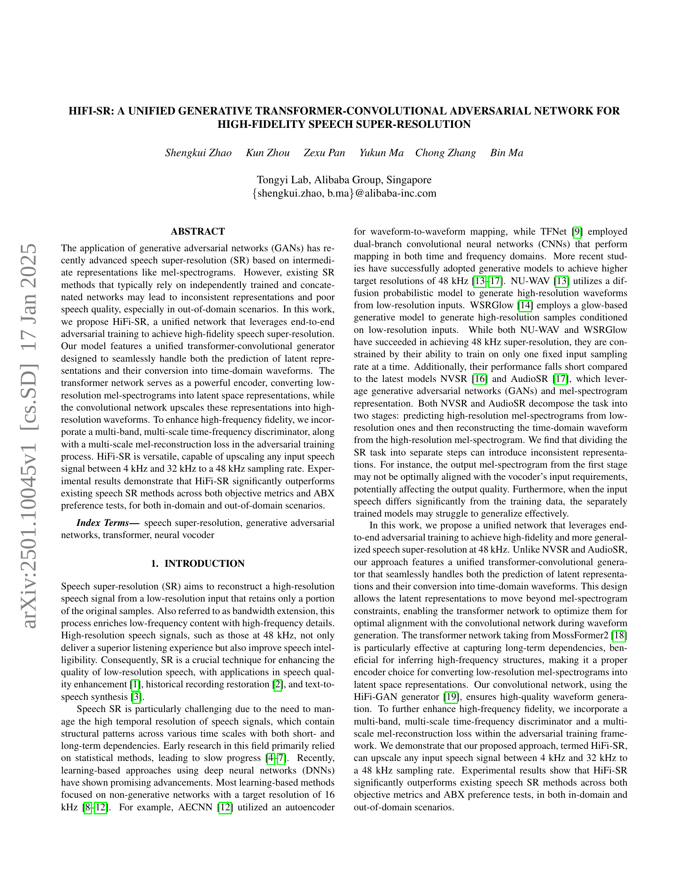
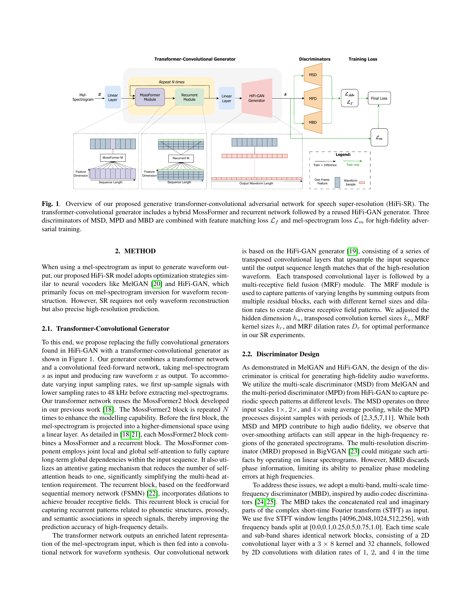
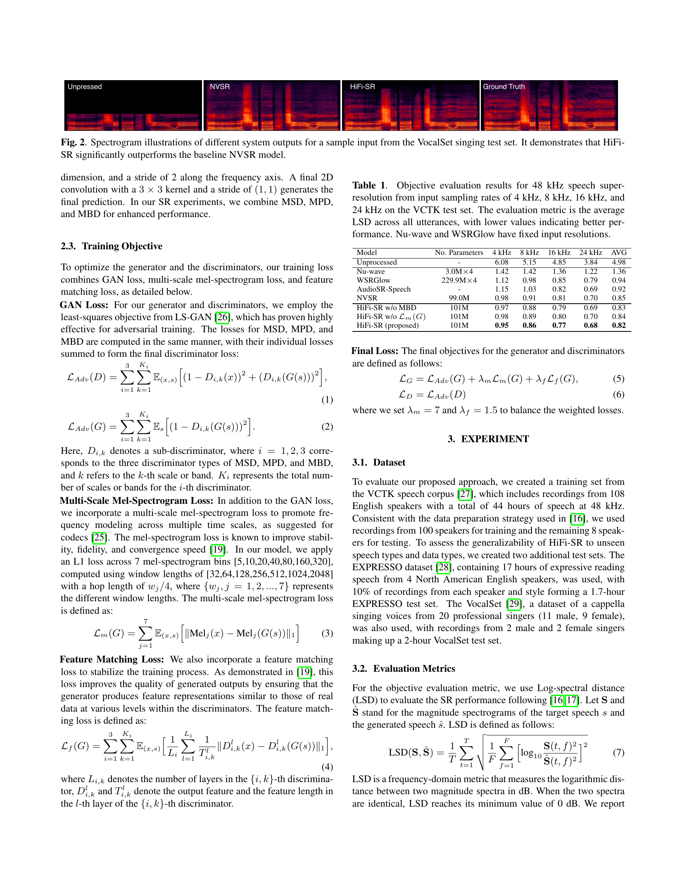
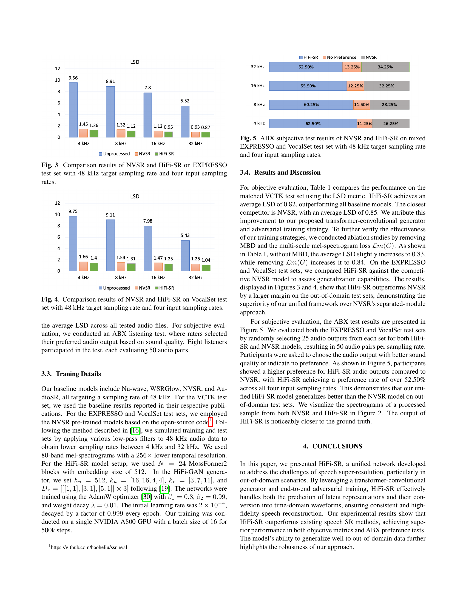
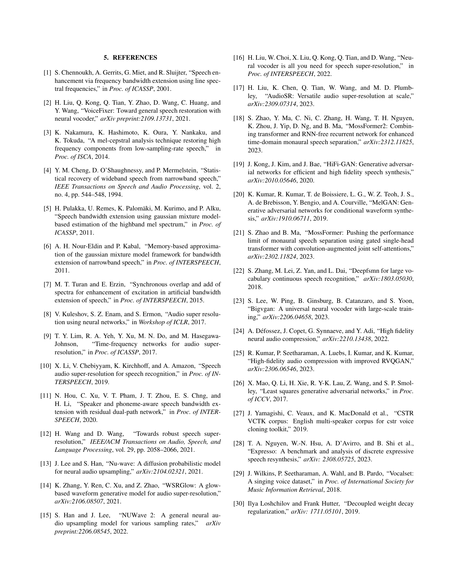

 


 2501.10045 
 Shengkui Zhao et el. 
 
 🤗 2025-01-20 
 



↗ arXiv


↗ Hugging Face


↗ Papers with Code


### TL;DR



기존의 음성 초고해상도(SR) 연구는 독립적으로 훈련된 네트워크를 연결하여 사용하는 방식으로, 불일치하는 표현과 낮은 음질이라는 문제점이 있었습니다. 특히, 훈련 데이터와 다른 도메인의 음성에 대해서는 성능이 저하되는 경향이 있었습니다.

본 논문에서는 이러한 문제를 해결하기 위해 **통합된 생성적 변환기-합성곱 적대적 신경망(GAN)인 HiFi-SR**을 제안합니다. HiFi-SR은 변환기 네트워크를 이용해 저해상도 멜 스펙트로그램을 잠재 공간 표현으로 변환하고, 합성곱 네트워크를 이용해 이를 고해상도 음성으로 변환합니다.  **다중 대역 및 다중 스케일 시간-주파수 판별기**와 **다중 스케일 멜 재구성 손실**을 사용하여 고주파수의 충실도를 높였습니다. 실험 결과, HiFi-SR은 기존의 음성 SR 방법들보다 객관적 지표와 ABX 선호도 테스트 모두에서 뛰어난 성능을 보였으며, 특히 도메인에 상관없이 우수한 성능을 보였습니다.



#### Key Takeaways


 통합된 변환기-합성곱 GAN 구조를 통해 일관된 고품질 음성 초고해상도 결과를 얻음 



 다중 대역, 다중 스케일 판별기와 손실 함수를 사용하여 고주파수 정확도 향상 



 도메인에 상관없이 4kHz~32kHz의 다양한 입력 음성을 48kHz로 성공적으로 변환 


#### Why does it matter?
본 논문은 **고품질 음성 초고해상도(SR)** 분야에 중요한 기여를 합니다. **통합된 생성적 변환기-합성곱 적대적 신경망(GAN)**을 통해 기존의 독립적으로 훈련된 네트워크의 한계를 극복하고, **도메인에 상관없이 높은 성능**을 달성합니다. 이는 향후 음성 향상, 복원, 합성 기술 발전에 큰 영향을 미칠 것이며, 특히 **다양한 음성 데이터 및 저해상도 음성**을 다루는 연구에 중요한 시사점을 제공합니다. 또한, 제시된 **다중 대역, 다중 스케일 시간-주파수 판별기** 및 **다중 스케일 멜 재구성 손실**은 고품질 음성 생성을 위한 새로운 방향을 제시합니다.

------
#### Visual Insights

> 🔼 그림 1은 제안된 고해상도 음성 초고해상도(HiFi-SR)를 위한 생성적 트랜스포머-합성곱 적대적 신경망의 개요를 보여줍니다. 트랜스포머-합성곱 생성기는 MossFormer와 순환 신경망을 결합한 하이브리드 모델과 재사용된 HiFi-GAN 생성기를 포함합니다. MSD, MPD, MBD 세 개의 판별기는 특징 매칭 손실(ℒf)과 멜 스펙트로그램 손실(ℒm)과 결합되어 고충실도 적대적 학습을 수행합니다.  즉, 저해상도 음성을 고해상도로 변환하는 과정에서 트랜스포머는 저해상도 멜 스펙트로그램을 잠재 공간 표현으로 변환하고, 합성곱 신경망은 이 표현을 고해상도 파형으로 확장합니다. 다중 대역 및 다중 스케일 판별기와 멀티스케일 멜 재구성 손실은 고주파 충실도를 높입니다.
> 

> 
read the caption

> Fig. 1: Overview of our proposed generative transformer-convolutional adversarial network for speech super-resolution (HiFi-SR). The transformer-convolutional generator includes a hybrid MossFormer and recurrent network followed by a reused HiFi-GAN generator. Three discriminators of MSD, MPD and MBD are combined with feature matching loss ℒfsubscriptℒ𝑓\mathcal{L}_{f}caligraphic_L start_POSTSUBSCRIPT italic_f end_POSTSUBSCRIPT and mel-spectrogram loss ℒmsubscriptℒ𝑚\mathcal{L}_{m}caligraphic_L start_POSTSUBSCRIPT italic_m end_POSTSUBSCRIPT for high-fidelity adversarial training.
> 


| Model | No. Parameters | 4 kHz | 8 kHz | 16 kHz | 24 kHz | AVG |
|---|---|---|---|---|---|---|
| Unprocessed | - | 6.08 | 5.15 | 4.85 | 3.84 | 4.98 |
| Nu-wave | 3.0M 
× 4 | 1.42 | 1.42 | 1.36 | 1.22 | 1.36 |
| WSRGlow | 229.9M 
× 4 | 1.12 | 0.98 | 0.85 | 0.79 | 0.94 |
| AudioSR-Speech | - | 1.15 | 1.03 | 0.82 | 0.69 | 0.92 |
| NVSR | 99.0M | 0.98 | 0.91 | 0.81 | 0.70 | 0.85 |
| HiFi-SR w/o MBD | 101M | 0.97 | 0.88 | 0.79 | 0.69 | 0.83 |
| HiFi-SR w/o 
ℒm(G) | 101M | 0.98 | 0.89 | 0.80 | 0.70 | 0.84 |
| HiFi-SR (proposed) | 101M | **0.95** | **0.86** | **0.77** | **0.68** | **0.82** |

> 🔼 표 1은 VCTK 테스트 세트에서 4kHz, 8kHz, 16kHz, 24kHz 입력 샘플링률로부터 48kHz 음성 초고해상도에 대한 객관적 평가 결과를 보여줍니다. 평가 지표는 모든 발화에 대한 평균 LSD(Log-spectral distance)이며, 값이 낮을수록 성능이 우수함을 나타냅니다. Nu-wave와 WSRGlow는 고정된 입력 해상도를 갖습니다.
> 

> 
read the caption

> Table 1: Objective evaluation results for 48 kHz speech super-resolution from input sampling rates of 4 kHz, 8 kHz, 16 kHz, and 24 kHz on the VCTK test set. The evaluation metric is the average LSD across all utterances, with lower values indicating better performance. Nu-wave and WSRGlow have fixed input resolutions.
> 

### In-depth insights

#### Unified GANs for SR
본 논문은 단일 네트워크 내에서 저해상도 음성 신호의 고해상도 음성 신호 변환을 위한 **통합 GAN(Generative Adversarial Network)** 구조를 제안합니다. 기존의 독립적으로 학습된 생성자-판별자 네트워크를 연결하는 방식과 달리, **단일 통합 네트워크**는 특징 표현의 일관성을 유지하고, 도메인 간 불일치 문제를 해결하여 고품질의 초고해상도 음성을 생성하는 데 효과적입니다. **변환기(Transformer)와 합성곱 신경망(CNN)**을 결합한 생성자는 잠재 표현 예측과 시간 영역 파형 변환을 매끄럽게 처리하며, 다중 주파수 대역 판별자와 다중 스케일 손실 함수는 고주파수 특징 복원을 향상시킵니다. **종합적으로, 통합 GAN 기반의 초해상도 음성 생성 방법론은 기존 방법보다 뛰어난 성능을 보이며, 특히 도메인 간 일반화 능력이 우수함을 강조합니다.**

#### Transformer-CNN Synergy
본 논문에서 제안하는 **트랜스포머-합성곱 신경망(CNN) 시너지**는 저해상도 음성 신호의 초해상도 변환에 있어 혁신적인 접근 방식을 제시합니다. **트랜스포머 네트워크는 장기 의존성을 효과적으로 포착하여 저해상도 멜-스펙트로그램을 효율적으로 잠재 공간 표현으로 변환**하는 역할을 합니다. 이렇게 생성된 잠재 표현은 **CNN을 통해 고해상도 음성 파형으로 확장**됩니다. 이러한 결합은 **단순히 연결된 네트워크보다 일관성 있는 표현을 생성**하고 **도메인 외 상황에서도 우수한 음질**을 제공합니다.  트랜스포머의 장기 의존성 파악 능력과 CNN의 고해상도 파형 생성 능력이 시너지를 이루어 **고품질의 초해상도 음성 생성**이 가능해집니다.  **다중 스케일 손실 함수 및 다중 대역 판별기**를 활용하여 고주파 성분의 충실도까지 높였으며, **종합적인 성능 향상**을 확인했습니다.

#### Multi-band Discriminator
다중 대역 판별기는 고해상도 오디오 생성을 위한 **핵심 구성 요소**입니다. 기존의 단일 대역 판별기는 고주파수 영역에서의 세부 정보를 포착하는 데 어려움이 있었지만, 다중 대역 판별기는 **여러 주파수 대역을 동시에 분석**하여 이러한 문제를 해결합니다.  **다양한 주파수 대역에 대한 특징을 결합**함으로써, 생성된 오디오의 고주파수 정확도를 향상시키고 인공물을 줄일 수 있습니다. 이는 특히 음성 초고해상도 작업에서 중요한데, 고주파수 성분이 음성의 명료도와 자연스러움에 큰 영향을 미치기 때문입니다. **다중 스케일 시간-주파수 분석**을 통해 다양한 시간적 해상도에서 주파수 정보를 포착하여, 더욱 정확하고 세밀한 판별을 가능하게 합니다.  **결과적으로, 다중 대역 판별기는 고품질의 사실적인 오디오 생성에 기여하며, 음성 초고해상도 기술의 성능 향상에 크게 기여**할 것으로 예상됩니다.

#### High-fidelity Speech
고품질 음성은 **높은 주파수 충실도**와 **자연스러운 음질**을 특징으로 하는 음성 신호를 의미합니다. 이는 단순히 높은 샘플링 레이트만을 의미하는 것이 아니라, **원본 음성의 미세한 특징까지 정확하게 재현**하는 것을 포함합니다. 본 논문에서는 고품질 음성 생성을 위해 **변환기-합성곱 생성적 적대 신경망(GAN)** 기반의 통합 네트워크를 제안합니다. 이 네트워크는 저해상도 멜 스펙트로그램을 고해상도 웨이브폼으로 변환하는 과정에서 **잠재 표현의 일관성을 유지**하며, **다중 스케일 및 다중 주파수 대역 판별기를 통해 고주파수 정보의 정확성을 높입니다.** 특히, 기존 연구들과 달리 **단일 네트워크 내에서 잠재 표현 예측과 웨이브폼 변환을 통합**하여 모델의 일반화 능력을 향상시키고 도메인 간의 불일치 문제를 해결하는 데 주력합니다. 이를 통해 다양한 저해상도 음성 입력에 대해 높은 품질의 고해상도 음성 출력을 생성할 수 있습니다.

#### Beyond Mel-specs
멜스펙트로그램을 넘어서는 연구는 **음성의 고품질 초해상도를 달성하기 위한 새로운 표현 방법 및 모델 아키텍처** 탐색에 초점을 맞춥니다. 기존의 멜스펙트로그램 기반 방법은 주파수 정보 손실 및 시간 정보의 부정확성으로 인해 고주파수 영역에서의 정확도가 떨어지는 한계를 지닙니다. 따라서 **원시 파형을 직접적으로 다루거나, 멜스펙트로그램보다 더욱 풍부한 정보를 담고 있는 다른 표현** (예: 복소수 스펙트로그램, 위상 정보 포함)을 활용하는 연구가 활발히 진행 중입니다.  **생성 모델의 발전** 또한 중요한데, **GAN, diffusion model, flow-based model 등 다양한 생성 모델이 고품질의 음성 신호 생성**에 활용되고 있으며, 이를 통해 멜스펙트로그램의 한계를 극복하고 더욱 자연스럽고 정확한 초해상도 음성을 생성할 수 있습니다.  **여러 가지 손실 함수** 조합과 **다중 스케일, 다중 주파수 대역의 판별자**를 통한 **세련된 학습 전략** 도 고해상도 음성 생성에 중요한 역할을 합니다.  **결론적으로,** 멜스펙트로그램을 넘어서는 연구는 **보다 정확하고 자연스러운 음성 초해상도 기술**을 구현하는데 필수적이며, **향후 음성 합성 및 음성 인식 기술 발전**에도 큰 영향을 미칠 것으로 예상됩니다.

### More visual insights

More on figures

> 🔼 그림 2는 VocalSet 싱잉 테스트 세트의 샘플 입력에 대한 다양한 시스템 출력의 스펙트로그램을 보여줍니다. HiFi-SR 모델의 출력이 기준 NVSR 모델의 출력보다 훨씬 원본 신호와 유사하며, 고주파수 성분까지도 잘 복원하고 있음을 시각적으로 보여줍니다.  HiFi-SR이 NVSR보다 훨씬 우수한 성능을 보임을 보여주는 증거입니다.
> 

> 
read the caption

> Fig. 2: Spectrogram illustrations of different system outputs for a sample input from the VocalSet singing test set. It demonstrates that HiFi-SR significantly outperforms the baseline NVSR model.
> 

> 🔼 그림 3은 EXPRESSO 테스트 세트에서 다양한 입력 샘플링 속도(4kHz, 8kHz, 16kHz, 32kHz)를 사용하여 48kHz의 목표 샘플링 속도로 초고해상도 음성을 생성하는 NVSR과 HiFi-SR 모델의 비교 결과를 보여줍니다.  각 입력 샘플링 속도에 대한 LSD(Log-spectral distance) 값을 통해 두 모델의 성능 차이를 정량적으로 비교 분석하고 있습니다.  낮은 LSD 값은 더 높은 음성 품질을 나타냅니다.
> 

> 
read the caption

> Fig. 3: Comparison results of NVSR and HiFi-SR on EXPRESSO test set with 48 kHz target sampling rate and four input sampling rates.
> 

> 🔼 그림 4는 VocalSet 테스트 세트에서 다양한 입력 샘플링 속도(4kHz, 8kHz, 16kHz, 32kHz)와 48kHz의 목표 샘플링 속도를 사용하여 NVSR과 HiFi-SR의 성능 비교 결과를 보여줍니다.  두 모델의 음질을 LSD(Log-spectral distance) 지표를 사용하여 객관적으로 평가하여 비교 분석하였습니다. 이 그래프를 통해 각 입력 샘플링 속도에 따른 두 모델의 LSD 값을 비교하고 HiFi-SR이 NVSR보다 우수한 성능을 보이는지 확인할 수 있습니다.
> 

> 
read the caption

> Fig. 4: Comparison results of NVSR and HiFi-SR on VocalSet test set with 48 kHz target sampling rate and four input sampling rates.
> 

> 🔼 그림 5는 4kHz, 8kHz, 16kHz, 32kHz의 네 가지 입력 샘플링 레이트와 48kHz의 목표 샘플링 레이트를 사용하여 EXPRESSO와 VocalSet 테스트 세트를 혼합한 데이터셋에서 NVSR과 HiFi-SR의 ABX 주관적 테스트 결과를 보여줍니다.  ABX 테스트는 청취자들이 두 개의 오디오 샘플(하나는 기준 오디오, 다른 하나는 NVSR 또는 HiFi-SR에 의해 생성된 오디오) 중 어느 것이 원본에 더 가까운지 선택하는 방식으로 진행되었습니다. 이 그림은 각 입력 샘플링 레이트에 대한 HiFi-SR과 NVSR의 선호도 비율을 보여주어 HiFi-SR의 성능 우수성을 시각적으로 나타냅니다.
> 

> 
read the caption

> Fig. 5: ABX subjective test results of NVSR and HiFi-SR on mixed EXPRESSO and VocalSet test set with 48 kHz target sampling rate and four input sampling rates.
> 

### Full paper



