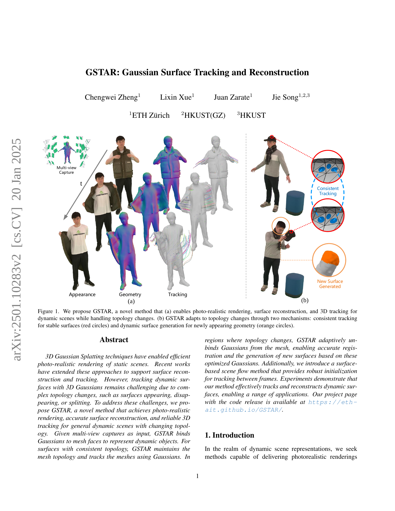

 


 2501.10283 
 Chengwei Zheng et el. 
 
 🤗 2025-01-24 
 



↗ arXiv


↗ Hugging Face


↗ Papers with Code


### TL;DR



기존의 3D 표면 재구성 및 추적 방법들은 동적 장면에서의 복잡한 토폴로지 변화(표면 생성, 소멸, 분할)를 효과적으로 처리하지 못하는 어려움을 가지고 있습니다. 이는 시각 효과, 마커리스 모션 캡처 등 다양한 분야에서 정확한 표면 정보를 얻는 것을 어렵게 만들었습니다. 특히 기존 방법들은 일관된 추적을 유지하면서 동시에 새로운 표면이 나타나는 상황에 적응하는 데 한계가 있었습니다. 

본 논문에서는 이러한 문제를 해결하기 위해 GSTAR라는 새로운 방법을 제시합니다. GSTAR는 메쉬와 결합된 가우시안을 사용하여 동적 객체를 표현하고, 토폴로지 변화가 발생하는 영역에서는 가우시안을 메쉬에서 분리하여 새로운 표면을 생성합니다. 또한, 프레임 간의 일관된 추적을 위해 표면 기반의 장면 흐름(scene flow) 방법을 도입하여 강력한 초기화를 제공합니다. 실험 결과, GSTAR는 기존 방법들보다 우수한 성능을 보이며, 다양한 애플리케이션에서 활용될 수 있음을 보여줍니다.



#### Key Takeaways


 GSTAR는 동적 장면에서의 토폴로지 변화를 다루는 강력한 3D 표면 추적 및 재구성 방법입니다. 



 GSTAR는 메쉬와 결합된 가우시안을 사용하여 사실적인 렌더링과 정확한 기하학적 재구성을 달성합니다. 



 GSTAR는 새로운 표면 생성과 기존 표면 추적을 위한 혁신적인 기법을 통해 다양한 애플리케이션을 지원합니다. 


#### Why does it matter?
이 논문은 **동적인 장면에서의 표면 재구성 및 추적에 대한 새로운 방법**을 제시하여, **토폴로지 변화를 효과적으로 처리**하고 **사실적인 렌더링을 가능하게** 합니다. 이는 시각 효과, 마커리스 모션 캡처, 로보틱스와 같은 다양한 분야의 연구에 **중요한 영향**을 미칠 수 있으며, 앞으로 **가우시안 기반의 표면 재구성 연구에 새로운 방향**을 제시할 것으로 기대됩니다. 특히 **가우시안 서피스(Gaussian Surfaces)를 사용한 혁신적인 추적 및 재구성 기법**은 향후 연구자들에게 귀중한 지침을 제공합니다.

------
#### Visual Insights

> 🔼 그림 1은 제안된 GSTAR 방법의 개념을 보여줍니다. (a)는 GSTAR이 동적인 장면에서 토폴로지 변화를 처리하면서 동시에 사실적인 렌더링, 표면 재구성 및 3D 추적을 가능하게 함을 보여줍니다. (b)는 GSTAR이 안정적인 표면(빨간색 원)에 대해서는 일관된 추적을, 새롭게 나타나는 형상(주황색 원)에 대해서는 동적인 표면 생성을 통해 토폴로지 변화에 적응하는 두 가지 메커니즘을 설명합니다.
> 

> 
read the caption

> Figure 1:  We propose GSTAR, a novel method that (a) enables photo-realistic rendering, surface reconstruction, and 3D tracking for dynamic scenes while handling topology changes. (b) GSTAR adapts to topology changes through two mechanisms: consistent tracking for stable surfaces (red circles) and dynamic surface generation for newly appearing geometry (orange circles).
> 


| Method | PSNR ↑ | SSIM ↑ | LPIPS ↓ | CD ↓ | F-Score ↑ | 3D ATE ↓ | 2D ATE ↓ |
|---|---|---|---|---|---|---|---| 
| HumanRF [17] | 30.59 | 0.947 | 0.128 | 0.284 | 0.968 | - | - |
| Dynamic 3D Gaussians [26] | 27.61 | 0.905 | 0.214 | 1.113 † | 0.733 † | 3.15 | 13.84 |
| PhysAvatar-general [50] | 22.69 | 0.893 | 0.216 | 1.372 | 0.793 | 12.94 | 56.95 |
| PhysAvatar-SMPLX [50] | 24.50 | 0.908 | 0.193 | 0.625 | 0.837 | 8.98 | 39.61 |
| 2D Gaussian Splatting [16] | 30.17 | 0.938 | 0.155 | 0.699 | 0.946 | - | - |
| GSTAR w/o IR input | 30.05 | 0.946 | 0.110 | 0.335 | 0.960 | 0.671 | 3.02 |
| GSTAR (Ours) | **31.87** | **0.952** | **0.102** | **0.237** | **0.980** | **0.452** | **2.03** |

> 🔼 표 1은 다양한 방법들을 사용하여 동적 장면의 외관, 기하학적 구조 및 추적 성능을 정량적으로 비교한 결과를 보여줍니다.  PSNR, SSIM, LPIPS, CD, F-Score, 3D ATE, 2D ATE 와 같은 다양한 지표들을 사용하여 각 방법의 성능을 평가했으며,  최고, 두 번째, 세 번째로 좋은 성능을 보이는 결과들을 강조 표시했습니다. 제안된 GSTAR 방법은 재구성 및 추적 작업에서 가장 좋은 성능을 보였으며, CD 및 3D ATE는 cm 단위로 보고되었습니다.  참고로, Dynamic 3D Gaussians [26] 방법은 표면 재구성 기능을 제공하지 않으므로, TSDF fusion [16]을 사용하여 프레임별 메시를 추출했습니다.
> 

> 
read the caption

> Table 1: Quantitative comparisons on appearance, geometry, and tracking. The best, second-best, and third-best results are highlighted. Our method achieves the best performance on reconstruction and tracking. CD and 3D ATE are reported in cm. ††{\dagger}†: Dynamic 3D Gaussians [26] doesn’t provide surface reconstruction and we extract per-frame meshes using TSDF fusion [16].
> 

### In-depth insights

#### Gaussian Surface Tracking
본 논문에서 제시된 "Gaussian Surface Tracking"은 **3D Gaussian Splatting 기법**을 기반으로 동적인 표면의 형태 변화와 토폴로지 변화를 효과적으로 추적하는 기술입니다. 기존의 3D Gaussian Splatting이 정적인 장면 렌더링에 주로 사용되었던 것과 달리, **시간에 따른 표면의 변화**를 추적하여 동적인 장면을 재구성하고 렌더링하는 데 초점을 맞추고 있습니다. 이를 위해 **Gaussian과 Mesh를 결합한 Gaussian Surface**라는 새로운 표현 방식을 도입하여, 일관성 있는 추적을 통해 정적인 부분은 유지하면서, **토폴로지 변화가 발생하는 영역**에서는 Gaussian을 메쉬로부터 분리하여 새로운 표면을 생성함으로써 **정확한 표면 재구성 및 추적**을 가능하게 합니다.  **Scene Flow 기법**을 통해 프레임 간의 초기화를 강화하여 더욱 강건한 추적을 제공합니다.  이는 **다양한 동적 시나리오**에서의 3D 표면 추적 및 재구성에 유용한 기술로써, **실시간 렌더링, VR/XR 애플리케이션, 로보틱스** 등 다양한 분야에 응용될 수 있습니다.

#### Adaptive Topology Handling
본 논문에서 제안하는 **적응형 토폴로지 처리**는 동적 장면의 표현에 있어서 핵심적인 역할을 합니다. 기존의 방법들이 고정된 토폴로지를 가정하여 변화하는 형태에 제한적으로 대응하는 것과 달리, **가우시안 표면(Gaussian Surfaces)**을 이용하여 메쉬 토폴로지의 변화에 유연하게 적응합니다.  **가우시안 분리(Gaussian Unbinding)** 메커니즘을 통해 새로운 표면이 나타나거나 기존 표면이 분리되는 상황에서 가우시안을 메쉬에서 분리하여 독립적으로 최적화함으로써, **정확한 표면 재구성**을 가능하게 합니다.  또한, **표면 기반 씬 플로우(surface-based scene flow)** 방법을 도입하여 프레임 간의 일관성 있는 추적을 보장하고 **새로운 표면 생성**을 위한 초기화를 제공합니다. **메쉬 재구성(Re-meshing)** 과정을 통해 토폴로지 변화에 따른 메쉬의 갱신 및 새로운 표면과 기존 표면의 매끄러운 통합을 실현합니다. 이러한 일련의 과정은 **실시간 렌더링**과 **정확한 3D 추적**을 동시에 달성하는 데 기여합니다.  결론적으로, 본 논문의 적응형 토폴로지 처리는 동적 장면 처리의 **범용성과 정확성**을 크게 향상시키는 핵심 기술입니다.

#### Scene Flow for Robustness
장면 흐름(Scene Flow)은 **동적인 장면에서의 정확한 표면 추적 및 재구성에 중요한 역할**을 합니다.  특히, 프레임 간의 큰 변형이나 빠른 움직임이 존재하는 경우, 장면 흐름을 이용하여 이전 프레임의 결과를 왜곡함으로써(Warping) 현재 프레임의 초기화를 강건하게 할 수 있습니다.  **광학 흐름(Optical Flow)을 깊이 정보와 결합**하여 3차원 장면 흐름을 계산하는 과정은 매우 중요한데, 부정확한 흐름으로 인한 오류를 최소화하기 위해 **양방향 일관성 검사와 깊이 불연속 검출을 통해 신뢰할 수 있는 흐름만을 선택적으로 사용**하는 것이 중요합니다.  또한, **표면 인식 기반의 평활화 기법**을 통해 장면 흐름을 더욱 정제하여 노이즈를 줄이고 정확도를 높일 수 있습니다. 이러한 장면 흐름 기반의 전처리 과정은 추후 표면 재구성 과정의 정확성과 효율성을 크게 높여주며, 특히 **토폴로지 변화가 심한 동적인 장면**에서 그 효과가 더욱 두드러집니다.

#### Mesh-Gaussian Binding
본 논문에서 제시된 'Mesh-Gaussian Binding' 개념은 **메시의 기하학적 구조와 가우시안의 외형적 특징을 결합**하여 동적 장면을 효율적으로 표현하는 핵심 전략입니다.  **메시는 3D 형상의 기본 골격을 제공**하고, 각 면에 **여러 가우시안을 할당**함으로써 **미세한 표면 디테일과 사실적인 렌더링을 가능**하게 합니다.  이러한 결합은 **토폴로지 변화에 대한 적응력을 높여**주는 데 중요한 역할을 합니다.  **메시의 변형 및 새로운 가우시안 생성**을 통해 시스템은 **동적인 지오메트리 변화에 유연하게 대처**할 수 있습니다.  **가우시안의 독립적인 움직임**을 허용하여, **메시 구조와 분리된 가우시안의 생성 및 추적**을 가능하게 하며, **표면 분할 및 결합 등 복잡한 토폴로지 변화**를 처리하는 데 효과적입니다.  **메시와 가우시안 간의 상호작용** 및 **최적화 전략**은 시스템의 전반적인 성능과 정확도에 중요한 영향을 미치며, **실시간 렌더링과 정확한 3D 추적을 동시에 달성**하는 데 기여합니다.  결론적으로, Mesh-Gaussian Binding은 가우시안 기반 방법론의 한계를 극복하고 동적 장면 처리의 새로운 가능성을 제시하는 중요한 아이디어입니다.

#### Dynamic Scene Reconstruction
동적 장면 재구성은 **시간에 따라 변화하는 장면을 3차원으로 재현**하는 어려운 문제입니다. 이는 물체의 움직임, 변형, 그리고 새로운 물체의 출현 및 소멸 등 복잡한 상호작용을 고려해야 하기 때문입니다. **정확한 동적 장면 재구성**을 위해서는 **높은 시간 해상도**, **정확한 공간 정보 획득**, 그리고 **변화하는 토폴로지를 처리**할 수 있는 강력한 알고리즘이 필요합니다. 이러한 과제를 해결하기 위한 다양한 방법들이 연구되고 있으며, 이는 심층 신경망 기반 기법, 3차원 가우시안 표현 기법, 그리고 메쉬 기반 기법 등을 포함합니다.  **특히, 3차원 가우시안 표현 기법은 실시간 렌더링 및 효율적인 추적에 유리한 반면, 토폴로지 변화 처리가 어려운 점이 있습니다.**  따라서, **토폴로지 변화에 강인한 추적 및 재구성 알고리즘 개발**,  **시간에 걸친 일관된 표면 표현**, 그리고 **다양한 동적 현상 처리**가 향후 연구의 중요한 과제가 될 것입니다.  **실시간 애플리케이션을 위한 효율성과 정확성의 균형**을 맞추는 것도 중요한 고려 사항입니다.

### More visual insights

More on figures

> 🔼 본 그림은 GSTAR의 동작 과정을 보여줍니다. 다중 뷰 영상을 입력받아 GSTAR는 각 프레임마다 이전 프레임의 결과를 씬 플로우를 이용하여 왜곡 보정합니다 (섹션 3.2).  그런 다음 고정 토폴로지 재구성을 통해 가우시안 표면(가우시안이 부착된 메쉬, 섹션 3.1)을 재구축합니다 (섹션 3.3). 토폴로지가 변하는 표면을 처리하기 위해 GSTAR는 토폴로지 변화를 감지하고, 해당 표면의 가우시안을 분리하며, 필요에 따라 새로운 가우시안을 추가합니다 (섹션 3.4). 마지막으로 메쉬 재구성을 통해 가우시안 표면을 업데이트합니다 (섹션 3.5).
> 

> 
read the caption

> Figure 2: Taking multi-view captures as input, GSTAR tracks and reconstructs dynamic objects frame by frame. For each frame, GSTAR first warps the previous frame’s result using scene flow (Sec. 3.2). It then reconstructs Gaussian Surfaces (Gaussian-attached mesh, Sec. 3.1) by fixed-topology reconstruction (Sec. 3.3). To handle topology-changing surfaces, GSTAR detects topology changes, unbinds Gaussians on these surfaces, and adds new Gaussians as needed (Sec. 3.4). Finally, the Gaussian Surfaces are updated through re-meshing (Sec. 3.5).
> 

> 🔼 그림 3은 메시 업데이트 과정의 세부 사항을 보여줍니다. (a)는 식 10에서 정의된 언바인딩 가중치의 시각화로, 빨간색은 토폴로지가 변화하는 영역에서 높은 가중치를 나타냅니다. 높은 가중치는 해당 영역의 메시가 업데이트되어야 함을 의미합니다. (b)는 원래 표면과 새로 생성된 표면 사이의 메시 연결 과정을 보여줍니다. 파란색 점선은 정점 간의 대응 관계를 나타냅니다. 이를 통해 원래 메시와 새로 생성된 메시가 원활하게 연결되어 토폴로지 변화가 있는 영역에서도 일관된 표면을 유지할 수 있습니다.
> 

> 
read the caption

> Figure 3: Details of the mesh update process. (a) Visualization of unbinding weights defined in Eq. 10, where red indicates high weights in topology-changing regions. (b) Mesh connection process between original and new surfaces, with blue dotted lines showing vertex correspondences.
> 

> 🔼 그림 4는 다양한 방법으로 동적 장면의 외관과 기하학적 구조를 재구성한 결과를 비교한 것입니다. Dynamic 3D Gaussians [26]과 PhysAvatar [50]는 최적화되지 않은 재구성 결과를 보여주는 반면, HumanRF [17]와 2DGS [16]는 추적 기능이 부족하여 심한 폐색이 있는 경우 어려움을 겪습니다.  반면에 GSTAR는 추적 기능을 지원하면서 고품질의 재구성 결과를 제공합니다. 보충 자료에는 추가적인 비교 결과가 포함되어 있습니다.
> 

> 
read the caption

> Figure 4: Comparisons of appearance and geometry reconstruction. Dynamic 3D Gaussians [26] and PhysAvatar [50] yield suboptimal reconstruction results. HumanRF [17] and 2DGS [16], lacking tracking capabilities, struggle under heavy occlusion. In contrast, GSTAR provides high-quality reconstruction while supporting tracking. Additional comparisons are provided in our supplementary materials.
> 

> 🔼 그림 5는 AprilTags를 이용한 추적 결과 비교를 보여줍니다.  빨간색은 예측된 궤적이고, 파란색은 실제 궤적입니다. 이 그림은 GSTAR가 AprilTags 중심의 궤적을 더 정확하게 추적한다는 것을 보여주기 위해 AprilTags의 예측 궤적과 실제 궤적을 비교하여 보여줍니다.  각 AprilTag의 중심과 네 모서리의 총 5개 점을 추적하고, 3D 및 2D 지상 진실(ground truth) 데이터를 사용하여 정확도를 평가합니다. 이를 통해 GSTAR의 추적 성능이 다른 방법보다 우수함을 시각적으로 확인할 수 있습니다.
> 

> 
read the caption

> Figure 5:  Tracking comparisons using AprilTags. GSTAR achieves more accurate tracking results, with predicted (red) and ground truth (blue) trajectories of tag centers shown.
> 

### Full paper



