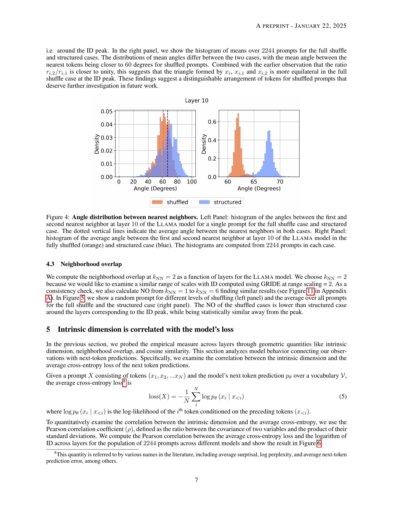
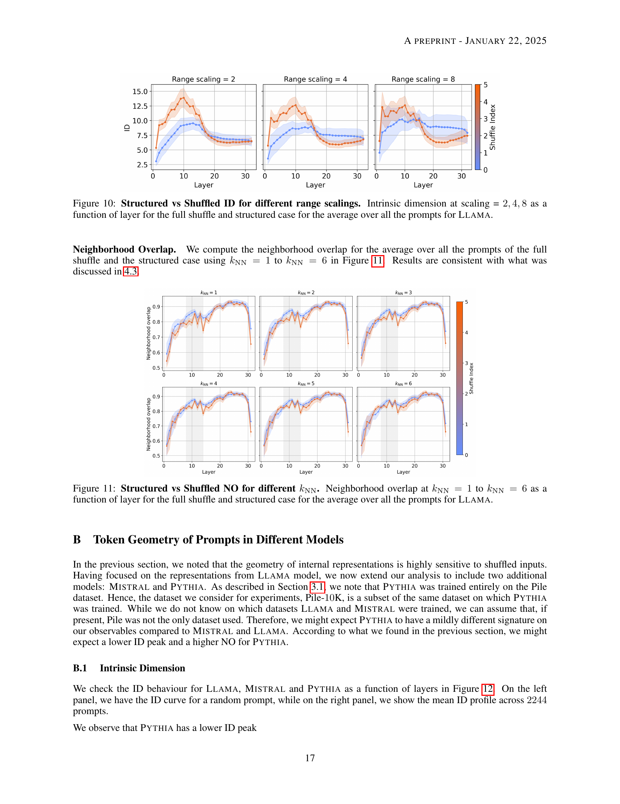

 


 2501.10573 
 Karthik Viswanathan et el. 
 
 🤗 2025-01-22 
 



↗ arXiv


↗ Hugging Face


↗ Papers with Code


### TL;DR



본 연구는 **대규모 언어 모델(LLM)**의 내부 동작에 대한 이해를 높이기 위해 **토큰 임베딩의 기하학적 특성**을 분석합니다. 기존 연구들에서는 주로 프롬프트 전체에 대한 기하학적 특성 분석에 집중했으나, 본 연구는 개별 토큰의 기하학적 특성을 분석하여 LLM의 내부 동작 메커니즘에 대한 새로운 통찰력을 제공합니다. 특히, 토큰의 분포를 나타내는 경험적 측도 개념을 활용하여 토큰 표현의 변화를 분석하고, **내재적 차원, 근접도 중복, 코사인 유사도**와 같은 지표를 사용하여 토큰 임베딩의 기하학적 특성을 분석합니다.

본 연구는 **토큰 셔플링**을 통해 토큰의 구문론적 및 의미론적 구조를 변화시켜, 이러한 변화가 토큰 임베딩의 기하학적 특성에 미치는 영향을 분석합니다. 그 결과, **토큰 임베딩의 기하학적 특성과 다음 토큰 예측의 교차 엔트로피 손실 간에 상관관계**가 있음을 발견하고, 이는 **높은 손실 값을 갖는 프롬프트는 고차원 공간에 표현되는 토큰을 가짐**을 시사합니다. 본 연구의 결과는 LLM의 내부 동작 메커니즘에 대한 이해를 증진시키고, 향후 모델 해석성 향상 및 성능 개선을 위한 새로운 연구 방향을 제시합니다.



#### Key Takeaways


 토큰 임베딩의 기하학적 특성(내재적 차원, 근접도 중복, 코사인 유사도)이 모델의 내부 동작을 이해하는 데 유용한 지표임을 제시 



 토큰 셔플링 실험을 통해 토큰 임베딩의 기하학적 특성과 다음 토큰 예측의 정확도 간의 상관관계를 규명 



 높은 손실값을 갖는 프롬프트는 고차원 공간에 표현되는 토큰을 가짐을 발견 


#### Why does it matter?
본 논문은 **대규모 언어 모델의 내부 표현에서 토큰의 기하학적 특성과 다음 토큰 예측의 상관관계**를 밝힘으로써, 모델 해석성 향상 및 성능 개선에 기여할 수 있는 새로운 연구 방향을 제시합니다. **기하학적 측정법**을 활용하여 모델의 내부 동작을 분석하고, **다음 토큰 예측의 정확도와 토큰 임베딩의 기하학적 특성 간의 상관관계**를 규명한 것은 향후 연구에 중요한 시사점을 제공합니다. 또한, 제시된 방법론은 다른 유형의 모델이나 작업에도 적용 가능하여 폭넓은 영향력을 가질 것으로 예상됩니다.

------
#### Visual Insights

> 🔼 그림 1은 토큰 셔플링 알고리즘을 보여줍니다. 위쪽 패널은 4장에서 설명된 셔플링 절차의 알고리즘적 설명을 보여주고, 아래쪽 패널은 N=16개의 토큰을 사용한 셔플링 알고리즘의 예시를 보여줍니다. 첫 번째 행(S=0)은 셔플링되지 않은 순서를 나타내고, S=1일 때는 토큰이 4개의 블록으로 나뉘고 블록이 셔플링됩니다. 마지막 행(S=2)은 토큰이 무작위로 순열되는 완전히 셔플링된 경우를 보여줍니다.
> 

> 
read the caption

> Figure 1: The shuffling algorithm with an example. Top Panel: Algorithmic description of the shuffling procedure described in Section 4. Bottom Panel: An example of the shuffling algorithm using N=16𝑁16N=16italic_N = 16 tokens. The first row (S=0𝑆0S=0italic_S = 0) corresponds to the unshuffled sequence. When S=1𝑆1S=1italic_S = 1, the tokens are split into 41superscript414^{1}4 start_POSTSUPERSCRIPT 1 end_POSTSUPERSCRIPT blocks first and then, the blocks are shuffled. The last row S=2𝑆2S=2italic_S = 2 shows the fully shuffled case where the tokens are randomly permuted.
> 


| Prompt level (ESS) | Prompt level (2NN) | Prompt level (high scaling) (many models \(\times\) corpus) | Token level (2NN) | Token level (scaling = 8) |
|---|---|---|---|---|
| Spearman \(\rho\) | 0.51 | 0.13 | -0.46 | 0.69 | 0.73 |
| p-value | 0.01 | 0.5 | 0.09 | < 0.01 | < 0.01 |

> 🔼 표 1은 Opt-6.7B 모델에 대한 프롬프트 수준 및 토큰 수준 분석에서 ID와 손실 간의 Spearman 상관 관계를 요약한 것입니다.  토큰 수준 결과는 그림 20에서, 프롬프트 수준 결과는 [19]와 [20]에서 가져왔습니다.  즉, 이 표는 서로 다른 분석 수준(전체 프롬프트를 하나의 데이터 포인트로 보는 프롬프트 수준과, 프롬프트 내 각 토큰을 개별 데이터 포인트로 보는 토큰 수준)에서 모델의 내부 표현 차원(ID)과 다음 토큰 예측의 손실 간의 관계를 비교 분석하여,  각 분석 방법의 결과를 간략하게 정리하고 있습니다.  두 분석 결과를 비교하여 토큰 수준 분석이 손실과의 상관관계가 더 높은 것을 확인할 수 있습니다.
> 

> 
read the caption

> Table 1: Summary of Spearman correlations between ID and loss from prompt and token level analysis for Opt-6.7B. The results for token level are from Figure 20 and the prompt level are from [19] and [20].
> 

### In-depth insights

#### Token Geometry
본 논문에서 '토큰 기하학(Token Geometry)'은 **트랜스포머 모델 내부에서 토큰 임베딩의 기하학적 특성과 다음 토큰 예측 성능 간의 관계**를 탐구하는 핵심 개념입니다.  연구진은 토큰들이 고차원 공간상에서 어떻게 분포하는지, 그리고 그 분포가 모델의 성능에 어떤 영향을 미치는지 분석합니다.  **내재적 차원, 이웃 중첩, 코사인 유사도**와 같은 다양한 기하학적 측정값을 사용하여 토큰 표현의 기하학적 특성을 탐색합니다.  특히, **토큰 순서를 섞는 실험**을 통해 토큰의 구문론적, 의미론적 구조가 기하학적 특성에 미치는 영향을 규명하려고 시도합니다.  **결과적으로, 토큰 임베딩의 기하학적 특성은 다음 토큰 예측의 교차 엔트로피 손실과 상관관계**가 있다는 것을 발견하며, 이는 **손실 값이 높은 프롬프트일수록 더 고차원 공간에 토큰이 표현**된다는 것을 시사합니다.  즉, 토큰 기하학 분석을 통해 모델의 내부 동작과 예측 성능을 이해하는 데 중요한 통찰력을 제공합니다.

#### Shuffle Experiments
본 논문에서 제시된 ‘Shuffle Experiments’는 **토큰의 순서를 섞어서 언어 모델의 내부 표현에 대한 통찰력을 얻고자 하는 실험**입니다.  단순히 토큰 순서를 무작위로 변경함으로써, **구문론적 및 의미론적 구조가 파괴**되고, 이에 따라 언어 모델이 정보를 처리하는 방식에 어떤 변화가 일어나는지 관찰할 수 있습니다.  **실험 결과는 셔플링의 정도에 따라 토큰 임베딩의 기하학적 특성이 변화하며, 이러한 변화가 다음 토큰 예측 성능에 영향을 미친다는 것을 보여줍니다.**  즉, **토큰 순서의 변화가 언어 모델의 내부 표현 공간의 차원성 및 토큰 간의 유사도에 영향**을 주고, 결과적으로 예측 정확도에 영향을 미치는 것입니다.  이러한 실험은 언어 모델의 내부 작동 원리를 이해하는 데 중요한 역할을 하며, 모델의 강점과 약점을 파악하고 향후 모델 개선에 활용될 수 있는 귀중한 정보를 제공합니다.  **셔플링 실험을 통해, 언어 모델이 단순히 통계적 패턴만 학습하는 것이 아니라, 실제로 언어의 구문론적 및 의미론적 구조를 이해하고 활용한다는 점을 확인할 수 있습니다.**  하지만 단순한 셔플링은 언어의 복잡한 구조를 완벽하게 반영하지 못할 수 있다는 점을 고려해야 합니다.

#### ID-Loss Correlation
본 논문에서 제시된 ID-Loss 상관관계는 **트랜스포머 모델의 내부 표현에서 토큰의 기하학적 특성과 다음 토큰 예측의 정확도 사이의 중요한 연관성**을 보여줍니다.  높은 손실값을 가진 프롬프트는 고차원 공간에 토큰을 표현하는 경향이 있으며, 이는 모델이 해당 프롬프트에 대한 예측에 어려움을 겪고 있음을 시사합니다.  **고차원 공간에서의 토큰 표현은 예측 확률 분포의 엔트로피가 높음**을 의미하며, 이는 **모델의 불확실성**을 나타냅니다.  즉, **토큰의 기하학적 특성을 분석함으로써 모델의 예측 성능을 평가하고, 모델의 내부 동작을 이해**할 수 있는 가능성을 보여줍니다.  이러한 상관관계 분석은 모델 해석성 향상에 기여하며, 향후 모델 개발 및 개선에 중요한 지침을 제공할 수 있습니다. 특히, **토큰 수준의 분석**을 통해 프롬프트 수준의 분석보다 더욱 세밀한 정보를 얻을 수 있다는 점이 중요합니다.  본 연구는 모델의 내부 동작에 대한 이해를 심화시키고, 향후 연구를 위한 중요한 기반을 마련합니다.

#### Multi-model Analysis
다양한 언어 모델에 대한 멀티모델 분석은 **일관된 패턴**을 찾고, 모델 간의 차이점을 이해하는 데 도움이 됩니다.  본 연구에서는 여러 모델에서 토큰의 기하학적 특징과 다음 토큰 예측 성능 간의 상관관계를 분석합니다. 이를 통해 특정 모델의 강점과 약점을 파악하고, **모델 개선**을 위한 방향을 제시할 수 있습니다.  **다양한 모델의 비교**를 통해 얻어진 결과는 특정 모델에 국한되지 않고, 더 넓은 범위의 언어 모델에 적용 가능한 일반적인 원리를 제시할 수 있습니다.  **실험 결과의 재현성**을 확보하기 위해 사용된 모델과 데이터셋에 대한 자세한 정보와 분석 방법에 대한 명확한 설명이 중요합니다. 또한, 본 연구의 한계점과 향후 연구 방향을 제시하여 **연구의 지속적인 발전**에 기여해야 합니다. 이러한 분석을 통해 **모델의 일반화 성능 향상** 및 **해석 가능성 개선**에 대한 귀중한 통찰력을 얻을 수 있습니다.

#### Future Work
본 논문은 대규모 언어 모델 내 토큰의 기하학적 특성과 다음 토큰 예측에서의 역할에 대한 통찰력 있는 연구입니다. **향후 연구 방향**으로는 여러 가지 흥미로운 가능성이 제시됩니다. 첫째, **근접 이웃의 다양한 스케일을 고려한 다중 스케일 분석**을 통해 토큰 표현 간의 관계에 대한 더욱 풍부한 이해를 얻을 수 있을 것입니다. 둘째, **토큰 셔플링 실험의 확장**을 통해 구문 및 의미 구조의 변화에 따른 기하학적 특성의 변화를 더욱 정교하게 분석하고, 모델의 내부 동작 메커니즘에 대한 이해도를 높일 수 있을 것입니다. 셋째, 본 연구에서 제시된 기하학적 측정값과 다음 토큰 예측의 상관관계를 **다양한 모델과 데이터셋에 적용**하여 일반화 가능성을 검증하고, **모델 아키텍처 및 훈련 과정의 영향**을 면밀히 분석할 필요가 있습니다. 마지막으로, **다른 기하학적 측정값**들을 활용하여 토큰 간의 관계를 보다 다각적으로 분석하고, 다음 토큰 예측의 확률 분포와의 연관성을 심층적으로 탐구하는 연구가 필요합니다. 이러한 후속 연구들을 통해, 대규모 언어 모델의 해석 가능성을 높이고, 성능 향상 및 개선을 위한 새로운 방향을 제시할 수 있을 것으로 기대됩니다. 특히, **훈련 과정에서의 기하학적 변화**에 대한 분석은 모델의 발달 과정을 이해하고, 더욱 효율적이고 해석 가능한 모델을 개발하는 데 중요한 단서를 제공할 것입니다.

### More visual insights

More on figures

> 🔼 이 그림은 Llama 모델을 사용하여 토큰 간의 평균 코사인 유사도를 보여줍니다. 왼쪽 패널은 단일 프롬프트에 대한 각 레이어별 평균 코사인 유사도를 보여줍니다. 오른쪽 패널은 전체 셔플(S=5) 및 구조화된 경우(S=0)에 대한 2244개 프롬프트에 걸친 평균 코사인 유사도를 레이어의 함수로 보여줍니다. 색상 막대는 셔플 인덱스 S를 나타내며 음영 영역은 평균값으로부터의 표준 편차를 나타냅니다.
> 

> 
read the caption

> Figure 2: Average Cosine Similarity. Left Panel: average cosine similarity among tokens for a single prompt as a function of model layers. Right Panel: average cosine similarity averaged over 2244224422442244 prompts as a function of layers for the full shuffle (S=5𝑆5S=5italic_S = 5) and the structured case (S=0𝑆0S=0italic_S = 0). The color bar indicates the shuffle index S𝑆Sitalic_S. The shaded regions indicate the standard deviation from the mean. All curves have been calculated for the Llama model.
> 

> 🔼 이 그림은 Llama 모델을 사용하여 토큰의 기하학적 특성이 모델 레이어에 따라 어떻게 변하는지 보여줍니다. 왼쪽 패널은 무작위로 선택된 단일 프롬프트에 대한 각 레이어의 고유 차원을 보여줍니다. 오른쪽 패널은 셔플링(S=5)된 경우와 셔플링되지 않은(S=0) 경우의 2244개 프롬프트에 대한 평균 고유 차원을 레이어의 함수로 보여줍니다. 음영 영역은 평균값으로부터의 표준 편차를 나타냅니다. 색상 막대는 셔플링 색인 S를 나타냅니다. 이 그림은 토큰 임베딩의 기하학적 특징과 다음 토큰 예측의 상관관계를 이해하는 데 도움이 됩니다.
> 

> 
read the caption

> Figure 3: Intrinsic Dimension. Left Panel: intrinsic dimension for a single random prompt as a function of model layers. Right Panel: intrinsic dimension averaged over 2244224422442244 prompts as a function of layers for the full shuffle (S=5𝑆5S=5italic_S = 5) and the structured case (S=0𝑆0S=0italic_S = 0). The shaded regions indicate the standard deviation from the mean. The color bar indicates the shuffle index S𝑆Sitalic_S. All curves have been calculated for the Llama model.
> 

> 🔼 그림 4는 가장 가까운 이웃 간의 각도 분포를 보여줍니다. 왼쪽 패널은 완전히 섞인 경우와 구조화된 경우에 대한 단일 프롬프트에 대해 Llama 모델의 10번째 레이어에서 첫 번째 및 두 번째 가장 가까운 이웃 사이의 각도 히스토그램을 보여줍니다. 점선은 두 경우 모두에서 가장 가까운 이웃 사이의 평균 각도를 나타냅니다. 오른쪽 패널은 완전히 섞인 경우(주황색)와 구조화된 경우(파란색)에 대해 Llama 모델의 10번째 레이어에서 첫 번째 및 두 번째 가장 가까운 이웃 사이의 평균 각도 히스토그램을 보여줍니다. 히스토그램은 각 경우에 2244개의 프롬프트로 계산됩니다. 이 그림은 섞인 토큰의 기하학적 특성이 구조화된 토큰과 어떻게 다른지, 그리고 이러한 차이가 모델의 내부 동작에 어떻게 영향을 미치는지를 보여줍니다.
> 

> 
read the caption

> Figure 4: Angle distribution between nearest neighbors. Left Panel: histogram of the angles between the first and second nearest neighbor at layer 10101010 of the Llama model for a single prompt for the full shuffle case and structured case. The dotted vertical lines indicate the average angle between the nearest neighbors in both cases. Right Panel: histogram of the average angle between the first and second nearest neighbor at layer 10101010 of the Llama model in the fully shuffled (orange) and structured case (blue). The histograms are computed from 2244224422442244 prompts in each case.
> 

> 🔼 이 그림은 모델 계층에 따른 이웃 중복도(Neighborhood Overlap, NO)를 보여줍니다. 왼쪽 패널은 무작위로 선택된 단일 프롬프트에 대한 NO를, 오른쪽 패널은 2244개의 프롬프트에 대한 평균 NO를 보여줍니다.  kNN(k-Nearest Neighbors) 값은 2로 설정되었습니다. 색상 막대는 섞임 지수(Shuffle Index, S)를 나타냅니다. S=0은 토큰 순서가 변경되지 않은 구조화된(structured) 경우이고, S=5는 토큰 순서가 완전히 섞인(fully shuffled) 경우입니다. 회색 영역은 ID(Intrinsic Dimension) 피크 주변 영역을 나타내며, 이 영역에서 섞인 프롬프트의 NO가 구조화된 프롬프트보다 낮음을 보여줍니다.  모든 그래프는 Llama 모델에 대한 결과입니다. 그림은 섞임 정도에 따른 토큰 간 관계의 변화를 시각적으로 보여주는 유용한 도구입니다.
> 

> 
read the caption

> Figure 5: Neighborhood Overlap. Left Panel: neighborhood overlap for a single random prompt as a function of model layers for kNN=2subscript𝑘NN2k_{\rm{NN}}=2italic_k start_POSTSUBSCRIPT roman_NN end_POSTSUBSCRIPT = 2. The colorbar indicates the shuffle index S𝑆Sitalic_S. Right Panel: neighborhood overlap averaged over 2244224422442244 prompts as a function of layers for the full shuffle (S=5𝑆5S=5italic_S = 5) and the structured case (S=0𝑆0S=0italic_S = 0). The shaded regions indicate the standard deviation from the mean and the grey region indicates the region around the ID peak when the shuffled prompts have a lower NO than the structured prompts. All curves have been calculated for the Llama model.
> 

> 🔼 본 그림은 모델 손실과 내재적 차원 간의 상관관계를 보여줍니다.  각 레이어별로 모델 손실의 로그와 내재적 차원의 로그 간의 피어슨 상관 계수를 계산하여 세 가지 모델 (Llama, Mistral, Pythia)의 결과를 비교합니다. 음영 영역은 평균으로부터의 표준 편차를 나타냅니다. Pythia 모델의 마지막 레이어를 제외하고 모든 레이어에서 피어슨 상관계수의 p-값은 0.01 미만입니다. 이는 모델 손실이 높을수록 토큰이 고차원 공간에 표현될 가능성이 높음을 시사합니다.
> 

> 
read the caption

> Figure 6: Correlation between intrinsic dimension and the average cross-entropy loss. Pearson coefficient between the logarithm of the intrinsic dimension and model loss for different models as a function of layers. The shaded regions indicate the standard deviation from the mean. The three curves correspond to Llama (orange), Mistral (magenta), and Pythia (blue). The p𝑝pitalic_p-values for the Pearson coefficients in this plot are below 0.010.010.010.01 except for the last layer in Pythia.
> 

> 🔼 그림 7은 모델의 마지막 계층에서 고유 차원과 교차 엔트로피 손실 간의 상관관계를 보여줍니다. 왼쪽 패널은 스케일링 2(부록의 그림 18에서는 스케일링 4, 8에 대한 분석이 제시됨)에서 로그 고유 차원과 문맥 엔트로피 간의 상관관계 분석을 보여주고, 오른쪽 패널은 평균 문맥 엔트로피와 평균 교차 엔트로피 손실을 비교합니다.  Llama 모델에 대해 논문에서 고려된 2244개의 프롬프트를 사용하여 계산되었습니다.
> 

> 
read the caption

> Figure 7: Correlating intrinsic dimension at the last layer to cross-entropy loss. The points in the following plots are calculated using the 2244224422442244 prompts considered in this paper for the Llama model. - (a) Left Panel: analysis of the correlation between the logits ID at scaling = 2222 (refer to Figure 18 in the Appendix for scaling = 4,8484,84 , 8) and the contextual entropy to the average contextual entropy and (b) Right Panel: comparing the average contextual entropy to the average cross-entropy loss.
> 

> 🔼 이 그림은 Llama 모델을 사용하여 Pile-10K 데이터셋에서 무작위로 선택한 6개의 프롬프트에 대한 내재적 차원(ID) 프로파일을 보여줍니다.  Pile 데이터셋의 필터링된 버전(본 논문의 3.1절 데이터셋 부분에 설명됨)에서 프롬프트를 가져왔으며, 프롬프트 번호는 Pile-10K 데이터셋을 참조합니다.  각 그래프는 레이어별 ID 값을 나타내며, GRIDE 알고리즘을 사용하여 스케일링 계수 2로 계산되었습니다. 이 그림은 모델의 내부 표현에서 토큰의 기하학적 특성을 분석하는 데 사용된 방법을 보여줍니다.  각 프롬프트는 고유한 ID 프로파일을 가지며, 이는 모델의 다양한 레이어에서 토큰이 어떻게 분포하는지를 보여줍니다.  여러 프롬프트에 대한 ID 프로파일을 비교함으로써, 본 논문에서는 모델 내부에서 토큰의 기하학적 특성이 어떻게 변하는지, 그리고 이것이 모델의 성능과 어떤 관계가 있는지를 분석합니다.
> 

> 
read the caption

> Figure 8: ID profiles of 6 random prompts for Llama. The prompts are taken from the filtered version of Pile described in the dataset section 3.1, but the prompt numbers refer to the Pile-10K dataset. The ID profiles are calculated using GRIDE at scaling = 2.
> 

> 🔼 그림 9는 다양한 모델에 대한 셔플링에 따른 ID 프로파일을 보여줍니다. (a)는 Pile-10K 데이터셋에서 3218번 프롬프트에 대한 다양한 모델의 ID 프로파일을 보여줍니다. 색상이 밝을수록 셔플링 인덱스가 높고, 어두울수록 구조화된 프롬프트를 나타냅니다. (b)는 구조화된 및 완전히 셔플된 경우에 대해 50개의 Pile-10K 프롬프트에 대한 평균 ID 프로파일을 보여줍니다. 색상이 밝을수록 셔플링 인덱스가 높고, 어두울수록 구조화된 프롬프트를 나타냅니다. 음영 영역은 평균으로부터의 표준 편차를 나타냅니다.
> 

> 
read the caption

> Figure 9: ID profiles for shuffling for different models. (a) ID profiles for prompt number 3218321832183218 from Pile-10K for different models across different levels of shuffling. Lighter colors represent a higher shuffle index, and darker colors indicate a more structured prompt, and (b) ID profiles for Pile-10K prompt number, averaged over 50505050 prompts, for both structured and fully shuffled cases. Lighter colors indicate higher shuffle indices and darker colors represent a more structured prompt. The shaded regions show the standard deviation from the mean.
> 

> 🔼 본 그림은 Llama 모델에 대해 모든 프롬프트의 평균을 고려하여 전체 셔플 및 구조화된 경우에 대해 레이어의 함수로서 스케일링 2, 4, 8에서 고유 차원을 보여줍니다.  다양한 스케일링 값에서 고유 차원 프로파일이 어떻게 변하는지 보여줍니다. 이는 고유 차원 추정치의 스케일 의존성을 보여주는 추가 분석입니다.
> 

> 
read the caption

> Figure 10: Structured vs Shuffled ID for different range scalings. Intrinsic dimension at scaling = 2,4,82482,4,82 , 4 , 8 as a function of layer for the full shuffle and structured case for the average over all the prompts for Llama.
> 

> 🔼 본 그림은 Llama 모델에 대해 모든 프롬프트의 평균에 대한 전체 셔플과 구조화된 경우에 대한 k-최근접 이웃(kNN) 수를 1에서 6까지 변화시키면서 계층별 이웃 중첩(NO)을 보여줍니다. 이는 모델의 내부 표현에서 토큰 간의 관계의 변화를 보여주는 지표입니다. 그림은 셔플링의 정도가 증가함에 따라 구조화된 데이터보다 셔플된 데이터에서 이웃 간의 일관성이 떨어짐을 시각적으로 보여줍니다.
> 

> 
read the caption

> Figure 11: Structured vs Shuffled NO for different kNNsubscript𝑘NNk_{\rm NN}italic_k start_POSTSUBSCRIPT roman_NN end_POSTSUBSCRIPT. Neighborhood overlap at kNN=1subscript𝑘NN1k_{\rm NN}=1italic_k start_POSTSUBSCRIPT roman_NN end_POSTSUBSCRIPT = 1 to kNN=6subscript𝑘NN6k_{\rm NN}=6italic_k start_POSTSUBSCRIPT roman_NN end_POSTSUBSCRIPT = 6 as a function of layer for the full shuffle and structured case for the average over all the prompts for Llama.
> 

> 🔼 그림 12는 세 가지 다른 대규모 언어 모델(LLaMA, Mistral, Pythia)에서 토큰의 내부 표현의 기하학적 특성을 보여줍니다. 왼쪽 패널은 무작위로 선택된 단일 프롬프트에 대해 계층별 내재 차원을 보여주는 반면, 오른쪽 패널은 2244개의 프롬프트에 걸쳐 평균화된 내재 차원을 보여줍니다. 음영 영역은 평균값으로부터의 표준 편차를 나타냅니다. 각 곡선은 각기 다른 모델(LLaMA는 주황색, Mistral은 자홍색, Pythia는 파란색)에 해당합니다. 이 그림은 모델의 내부 동작에 대한 통찰력을 제공하고, 다른 모델 간의 차이점을 보여줍니다.
> 

> 
read the caption

> Figure 12: Intrinsic Dimension. Left Panel: intrinsic dimension for a single prompt as a function of layers. Right Panel: intrinsic dimension averaged over 2244224422442244 prompts as a function of layers. The shaded regions indicate standard deviation from the mean. The curves correspond to Llama (orange), Mistral (magenta) and Pythia (blue).
> 

> 🔼 그림 13은 이웃 관계 중복도(Neighborhood Overlap)를 보여줍니다. 왼쪽 패널은 단일 프롬프트에 대한 계층별 이웃 관계 중복도를 나타내고, 오른쪽 패널은 2244개의 프롬프트에 대한 평균 계층별 이웃 관계 중복도를 보여줍니다. 음영 영역은 평균값으로부터의 표준 편차를 나타냅니다. 각 곡선은 Llama(주황색), Mistral(마젠타색), Pythia(파란색) 모델에 해당합니다. 이 그림은 여러 모델에서 이웃 관계 중복도가 어떻게 변하는지 보여주는 것으로, 모델의 내부 동작을 이해하는 데 도움이 될 수 있습니다.
> 

> 
read the caption

> Figure 13: Neighborhood Overlap. Left Panel: neighborhood overlap for a single prompt as a function of layers. Right Panel: intrinsic dimension averaged over 2244224422442244 prompts as a function of layers. Shaded regions indicate standard deviation from the mean. The curves correspond to Llama (orange), Mistral (magenta) and Pythia (blue).
> 

> 🔼 이 그림은 섞인 프롬프트(3218번 프롬프트)에 대한 GRIDE 스케일 분석 결과를 보여줍니다. GRIDE는 데이터의 고유 차원을 추정하는 알고리즘입니다. 이 그림에서는 서로 다른 스케일(range scaling)에서 각 레이어의 고유 차원을 계산하여, 셔플된 프롬프트의 고유 차원 변화를 시각적으로 보여줍니다.  즉,  모델의 내부 표현에서 토큰의 기하학적 특성이 어떻게 변하는지, 특히 프롬프트의 구조가 훼손되었을 때 어떻게 변하는지를 보여주는 분석 결과입니다.  여러 개의 서로 다른 레이어를 분석하여 각 레이어에서의 차원 변화 양상을 보여줍니다.
> 

> 
read the caption

> (a) Shuffled - GRIDE scale analysis for a shuffled prompt (prompt 3218321832183218) across layers.
> 

> 🔼 이 그림은 논문의 4.2절(내재적 차원)에서 언급된 GRIDE 알고리즘의 다양한 스케일을 사용하여 셔플링되지 않은 프롬프트(3218번)의 내재적 차원을 계층별로 분석한 결과를 보여줍니다.  다양한 스케일(2, 4, 8, 32, 128)에서 각 레이어의 내재적 차원을 계산하여,  프롬프트의 구조적 특징을 다양한 해상도로 파악하고자 합니다. 이는 모델이 입력 데이터의 구조적 정보를 어떻게 처리하는지에 대한 통찰력을 제공합니다.
> 

> 
read the caption

> (b) Unshuffled - GRIDE scale analysis for an unshuffled prompt (prompt number 3218321832183218) across layers.
> 

> 🔼 이 그림은 다양한 모델에 걸쳐 평균화된 여러 프롬프트에 대한 GRIDE 추정에 대한 스케일 분석을 보여줍니다.  각 모델에 대해, 다양한 레이어에서 계산된 고유 차원을 다양한 범위 스케일링(range scaling)값에 따라 보여줍니다. 이는 GRIDE 알고리즘의 스케일 의존성을 확인하고, 사용된 스케일링 매개변수가 모델의 고유 차원 추정에 미치는 영향을 평가하기 위해 수행되었습니다. 초기 레이어는 밝은 색상으로, 후기 레이어는 어두운 색상으로 표시되어 시간에 따른 변화를 시각적으로 보여줍니다.
> 

> 
read the caption

> (c) Scale analysis for GRIDE estimation across models averaged among prompts for different layers.
> 

> 🔼 이 그림은 GRIDE (Grid-based Intrinsic Dimension Estimator) 추정에 대한 스케일 분석을 다양한 모델과 셔플 및 셔플되지 않은 프롬프트에 대해 보여줍니다. (a)는 단일 셔플된 프롬프트(프롬프트 번호 3218)에 대한 결과를, (b)는 단일 프롬프트(프롬프트 번호 3218)에 대한 결과를, (c)는 셔플되지 않은 프롬프트에 대한 평균 결과를 보여줍니다. 각각의 경우 초기 레이어는 밝은 색상으로, 후기 레이어는 어두운 색상으로 표현되어 있습니다. 이 그림은 GRIDE 알고리즘의 스케일 매개변수에 따른 ID 추정치의 변화를 보여주어, 모델 및 프롬프트의 특성에 따른 차이를 분석하는 데 도움이 됩니다.
> 

> 
read the caption

> Figure 14: Scale analysis for GRIDE estimation across models for shuffled and unshuffled prompts. (a) Results for a single shuffled prompt (prompt number 3218321832183218), (b) Results for a single prompt (prompt number 3218321832183218), and (c) averaged results across unshuffled prompts, both showing different layers with early layers in lighter colors and late layers in darker colors.
> 

> 🔼 이 그림은 다양한 범위 스케일(2, 4, 8)에서 계산된 2244개의 프롬프트에 대한 평균 고유 차원 프로파일을 보여줍니다. 음영 영역은 평균값으로부터의 표준 편차를 나타냅니다. 이 그림을 통해 서로 다른 범위 스케일에서의 고유 차원 프로파일을 비교하고, 모델의 내부 표현의 기하학적 특성에 대한 스케일링 효과를 분석할 수 있습니다.
> 

> 
read the caption

> Figure 15: Scale analysis for average ID profile. The ID profile averaged over 2244224422442244 prompts for range scaling = 2,4,82482,4,82 , 4 , 8, with shaded regions indicating the standard deviation from the mean.
> 

> 🔼 이 그림은 다양한 범위 스케일링(2, 4, 8)에 따른 2244개의 프롬프트에 대한 평균 근접 이웃 중복 프로필을 보여줍니다. 음영 영역은 평균값으로부터의 표준 편차를 나타냅니다. 이 그림은 모델의 내부 표현에서 토큰 간의 관계가 레이어에 따라 어떻게 변하는지, 그리고 이러한 변화가 범위 스케일링에 따라 어떻게 달라지는지를 보여줍니다.
> 

> 
read the caption

> Figure 16: Scale analysis for average NO profile. The neighborhood overlap profile averaged over 2244224422442244 prompts for range scaling = 2,4,82482,4,82 , 4 , 8, with shaded regions indicating the standard deviation from the mean.
> 

> 🔼 그림 17은 내재적 차원과 손실 간의 상관관계에 대한 스케일 분석을 보여줍니다. 서로 다른 모델에 대해 스케일링 값이 2, 4, 8일 때 내재적 차원의 로그와 모델 손실 간의 피어슨 상관 계수를 나타냅니다.  이 그래프는 서로 다른 스케일링에서 모델 손실과 내재적 차원 간의 상관관계가 어떻게 변하는지 보여줍니다.  즉, 스케일링 값을 변화시켰을 때 LLAMA, MISTRAL, PYTHIA 세 가지 모델에서 내재적 차원과 손실의 상관관계가 어떻게 달라지는지 보여주는 것입니다.
> 

> 
read the caption

> Figure 17: Scale analysis for the correlation between intrinsic dimension and loss. Pearson coefficient between the logarithm of intrinsic dimension and model loss at scalings =2,4,8absent248=2,4,8= 2 , 4 , 8 for different models.
> 

> 🔼 본 그림은 Llama 모델에 대해 로그릿의 내재적 차원과 문맥적 엔트로피 간의 상관관계에 대한 스케일 분석을 보여줍니다.  다양한 스케일링(2, 4, 8)에서 로그릿의 내재적 차원과 모델의 문맥적 엔트로피 간의 로그 변환 값의 피어슨 상관 계수를 나타냅니다. 이 분석은 모델의 출력 확률 분포의 엔트로피와 내재적 차원 간의 관계를 이해하는 데 도움이 됩니다.  그림은 각 스케일링에 대한 산점도와 선형 회귀선을 포함하여 상관관계의 강도와 방향을 시각적으로 보여줍니다.
> 

> 
read the caption

> Figure 18: Scale analysis for the correlation between intrinsic dimension of logits and contextual entropy. Pearson coefficient between the logarithm of the intrinsic dimension of the logits and model contextual entropy for scalings =2,4,8absent248=2,4,8= 2 , 4 , 8 for Llama.
> 

### Full paper



