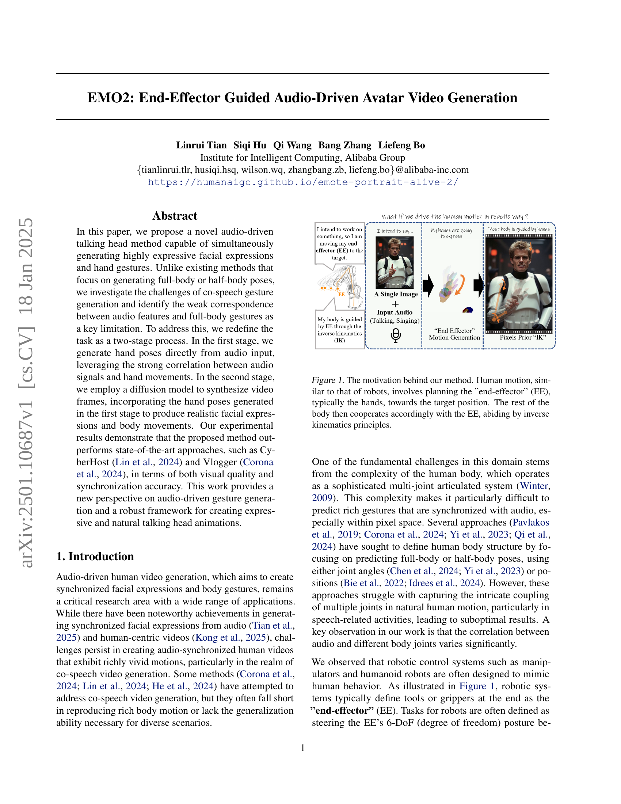

 


 2501.10687 
 Linrui Tian et el. 
 
 🤗 2025-01-22 
 



↗ arXiv


↗ Hugging Face


↗ Papers with Code


### TL;DR



기존의 오디오 기반 아바타 비디오 생성 연구는 전신 또는 반신 자세 생성에 집중하여, 오디오와 신체 동작 간의 약한 상관관계로 인해 자연스러운 동작 생성에 어려움을 겪었습니다. 특히 **말하는 동안의 손 제스처 생성**은 정확한 오디오-비디오 동기화가 어려운 과제였습니다. 이러한 문제점을 해결하기 위해, 본 논문에서는 오디오와 손 동작의 강한 상관관계를 활용하여 **두 단계로 구성된 새로운 방법론**을 제시합니다.  첫 번째 단계에서는 오디오 입력으로부터 손 제스처를 직접 생성하고, 두 번째 단계에서는 확산 모델을 이용하여 생성된 손 제스처를 바탕으로 얼굴 표정과 신체 동작을 포함한 비디오 프레임을 생성합니다. 

본 논문에서 제안된 방법은 **오디오 입력에서 손 제스처를 직접 생성**하고, 이를 **확산 모델을 이용한 비디오 생성**에 활용하는 독창적인 두 단계 접근 방식을 사용합니다.  이를 통해 기존 방법들이 겪었던 오디오-비디오 동기화 문제와 자연스러운 동작 생성의 어려움을 효과적으로 해결하고, **고품질의 시각적 결과물과 높은 동기화 정확도**를 달성했습니다.  **다양한 실험 결과**를 통해 기존 최첨단 기술보다 우수한 성능을 입증하였으며, 자연스럽고 표현력 있는 아바타 비디오 생성을 위한 새로운 프레임워크를 제시합니다.



#### Key Takeaways


 오디오와 손 동작 간의 강한 상관관계를 활용하여 효율적인 제스처 생성. 



 확산 모델 기반의 2단계 프레임워크를 통해 고품질의 시각적 결과와 정확한 동기화 달성. 



 기존 방법보다 우수한 화질, 동기화 정확도, 모션 다양성을 보이는 실험 결과. 


#### Why does it matter?
이 논문은 **오디오 기반의 제스처 생성에 대한 새로운 관점**을 제시하고, **표현력 있고 자연스러운 대화형 아바타 애니메이션 생성을 위한 강력한 프레임워크**를 제공합니다. 이는 현재 활발하게 연구되고 있는 **오디오-비디오 동기화**, **인간 동작 생성**, **디지털 아바타 기술** 분야의 연구에 중요한 영향을 미칠 것으로 예상됩니다. 특히 **손 동작과 오디오 간의 강력한 상관관계를 활용**하여 문제를 단순화하고, **확산 모델을 이용한 효율적인 비디오 합성**을 통해 고품질의 결과물을 얻어냄으로써, 향후 연구를 위한 새로운 가능성을 제시합니다.  또한 제안된 방법론은 **다양한 시나리오와 다양한 스타일의 애니메이션 생성**에 적용될 수 있어 실용적인 가치를 더욱 높입니다.

------
#### Visual Insights

> 🔼 이 그림은 본 논문에서 제안하는 방법의 핵심 개념을 보여줍니다. 로봇의 동작과 유사하게, 사람의 움직임도 '말단 효과기(End-Effector, EE)', 즉 손을 목표 위치로 계획하는 과정을 포함합니다.  손의 움직임이 결정되면, 나머지 신체 부위는 역기구학(Inverse Kinematics) 원리에 따라 손의 움직임과 조화를 이루도록 움직입니다.  즉, 손의 움직임을 먼저 결정하고 이에 맞춰 나머지 신체 부위의 움직임을 계산하는 2단계 과정을 시각적으로 설명합니다.  이는 음성에 따른 손동작 생성을 단순화하여 전체 신체 움직임 생성의 어려움을 해결하는 접근 방식입니다.
> 

> 
read the caption

> Figure 1: The motivation behind our method. Human motion, similar to that of robots, involves planning the ”end-effector” (EE), typically the hands, towards the target position. The rest of the body then cooperates accordingly with the EE, abiding by inverse kinematics principles.
> 


| Method | DIV↑ | BA↑ | PCK↑ | FGD↓ | DIV(smpl)↑ | BA(smpl)↑ | PCK(smpl)↑ | FGD(smpl)↓ |
|---|---|---|---|---|---|---|---|---|
| Talkshow | 0.0961 | 0.6743 | 0.7872 | 0.0329 | 0.0400 | 0.6769 | 0.9529 | 0.4170 |
| Diffsheg | 0.0158 | 0.7198 | 0.8300 | 0.03676 | 0.0306 | 0.7312 | 0.7635 | 4.2189 |
| Ours on SMPL | 0.0886 | 0.7290 | 0.8163 | 0.0301 | 0.1442 | 0.7285 | 0.7345 | 4.5746 |
| Ours on MANO | 0.1345 | 0.7626 | 0.8126 | 0.0373 | - | - | - | - |

> 🔼 표 1은 제안된 방법과 다른 동작 생성 방법들의 정량적 비교 결과를 보여줍니다.  다양한 지표(DIV, BA, PCK, FGD)를 사용하여 생성된 동작의 다양성, 오디오와의 정합성, 정확성 및 자연스러움을 평가합니다.  SMPL 기반과 MANO 기반의 두 가지 버전에 대한 결과를 제시하여 비교 분석합니다.
> 

> 
read the caption

> Table 1: The Quantitative comparisons with other motion generation methods.
> 

### In-depth insights

#### Audio-driven Gesture
본 논문은 오디오 기반 제스처 생성에 대한 심도있는 논의를 제공합니다. **음성 신호와 신체 움직임 간의 상관관계가 강한 부분과 약한 부분**을 명확히 구분하여, **손 동작을 중심으로 하는 2단계 접근 방식**을 제안합니다.  1단계는 오디오 입력으로부터 손 제스처를 직접 생성하고, 2단계에서는 확산 모델을 사용하여 1단계에서 생성된 손 제스처를 바탕으로 얼굴 표정과 신체 움직임을 동시에 생성합니다.  **손 제스처와 오디오 신호 간의 강한 상관관계**를 이용하여 과제의 복잡성을 줄이고 정확도를 높이며, **'픽셀 사전 역기구학(Pixels prior IK)'** 개념을 도입하여 효율적인 방법을 제시합니다.  전체적으로 자연스럽고 표현력 있는 영상 생성을 위한 강력하고 견고한 프레임워크를 제공하며, 기존 연구들의 한계점을 극복하고 새로운 관점을 제시합니다. 특히, **손 동작에 대한 집중적 연구**는 전체 신체 움직임 생성의 효율성을 높이고, 표현력을 증진시키는 핵심 요소임을 시사합니다.  **다양한 스타일과 속도의 제스처 생성**을 지원하며, 실험 결과를 통해 기존 최첨단 기법들을 능가하는 성능을 보여줍니다.

#### Two-Stage Framework
본 논문에서 제안하는 **두 단계 프레임워크**는 오디오 기반 아바타 비디오 생성에 있어 기존 방법들의 한계를 극복하기 위한 창의적인 해결책을 제시합니다. 첫 번째 단계에서는 오디오 신호와 손 동작 간의 강한 상관관계를 활용하여 오디오 입력으로부터 직접 손 동작을 생성합니다. 이는 복잡한 전신 자세 예측 대신 **손 동작에 초점을 맞춤**으로써 문제를 단순화하고 정확도를 높입니다. 두 번째 단계에서는 생성된 손 동작을 활용하여 **확산 모델**을 통해 얼굴 표정과 신체 움직임을 포함한 비디오 프레임을 합성합니다. 이는 손 동작이 다른 신체 부위의 움직임을 유도하는 역할을 함을 이용한 효율적인 접근 방식입니다. **픽셀 기반 역운동학(IK)** 개념을 도입하여 손 동작으로부터 나머지 신체 부위의 움직임을 간접적으로 제어함으로써 자연스럽고 일관성 있는 동작을 생성합니다.  **두 단계의 효율적인 분할**을 통해 오디오와 시각 정보 간의 동기화 정확도와 시각적 품질을 향상시키고 다양한 표현을 가능하게 합니다.  이러한 접근 방식은 로봇 제어 시스템에서의 엔드 이펙터(EE) 개념을 차용, **문제의 복잡성을 줄이고 해결 가능성을 높이는** 중요한 전략적 시사점을 제공합니다.

#### Diffusion Model
본 논문에서 다루는 확산 모델은 **두 가지 주요 단계**에서 사용됩니다. 첫째, 오디오 입력을 동기화된 부분 신체 동작 신호로 변환하는 모션 확산 모델로 활용됩니다. 이를 통해 오디오와 손 동작 간의 강한 상관관계를 활용하여 **복잡한 매핑 공간을 단순화**하고 제스처 생성을 보다 정밀하게 제어할 수 있습니다. 둘째, 생성된 손 동작을 통합하여 사실적인 얼굴 표정과 신체 동작을 생성하는 비디오 프레임 합성에 사용됩니다.  **ReferenceNet 기반 확산 아키텍처**를 채택하여 오디오 및 모션 신호의 안내에 따라 참조 이미지를 동기화된 음성 비디오로 애니메이션화합니다.  이러한 **두 단계 접근 방식**은 오디오와 다양한 신체 관절 간의 상관 관계 차이를 고려하여 효율적인 처리를 가능하게 합니다.  **손을 엔드 이펙터로 정의**함으로써,  인간의 복잡한 다관절 시스템을 단순화하고 작업을 간소화하며 오디오와의 강한 상관관계를 활용할 수 있다는 점이 핵심입니다.  **손 동작을 먼저 생성하고 이를 바탕으로 전체 신체 동작을 유추**하는 방식은 효율적일 뿐만 아니라, 자연스러운 신체 움직임을 생성하는데 중요한 역할을 합니다.  또한,  확산 모델의 학습 과정에서 **손의 정확도를 나타내는 신뢰도 점수**를 활용하여 생성된 손의 품질을 높이고,  **키포인트 기반 제어**를 통해 자연스러운 상체 움직임을 생성하는 데 기여합니다.

#### Hand Pose Generation
본 논문에서 제안하는 핵심적인 부분 중 하나는 **오디오 입력으로부터 손동작을 생성하는 단계**입니다. 이는 단순히 이미지나 비디오를 생성하는 것이 아니라, **오디오 신호와 손동작 사이의 강한 상관관계를 활용**하여 보다 자연스럽고 표현력 있는 결과물을 얻기 위한 전략입니다.  **두 단계로 나누어진 과정**에서 첫 번째 단계가 바로 이 손동작 생성이며, 이를 통해 풀 바디 포즈 생성의 어려움을 해결하고자 합니다.  **오디오 특징과 손동작 간의 직접적인 매핑**은 효율적인 처리와 정확한 제어를 가능하게 하며, 후속 단계인 비디오 합성에 필요한 중요한 정보를 제공합니다.  **디퓨전 모델을 이용한 효과적인 손동작 생성**은 전체 시스템의 성능 향상에 크게 기여할 것으로 예상되며, **다양한 스타일과 속도의 손동작 생성** 또한 가능하도록 설계되어 있어, 보다 다채로운 결과물 생성이 가능해질 것으로 기대됩니다.  특히 **손 가림이나 부정확한 어노테이션 문제를 해결하기 위한 메커니즘**도 함께 제시되어 있어, 실제 적용 가능성을 높였습니다.

#### Future Directions
본 논문의 "미래 방향"에 대한 심층적인 고찰은 **고해상도 및 장시간 비디오 생성**, **다양한 스타일 및 감정 표현 확장**, **실시간 처리 성능 개선**, 그리고 **상호 작용 기능 통합** 등의 주요 연구 분야를 제시합니다.  특히, 고해상도와 장시간 비디오 생성은 현실감 있는 아바타 생성에 중요하며, diffusion model의 발전과 더불어 대용량 데이터 학습 및 효율적인 계산 기법 개발이 관건입니다. 다양한 스타일과 감정 표현은 사용자 경험을 풍부하게 하며, 이를 위해서는 **다양한 데이터셋 확보 및 생성 모델의 제어 메커니즘 개선**이 필요합니다.  더 나아가 실시간 처리를 위해서는 모델 경량화 및 최적화, 그리고 하드웨어 가속화 기술 도입이 필수적입니다.  마지막으로, 아바타와 사용자 간의 상호 작용 기능은 몰입도를 높이고 실용성을 제고하는 데 중요한 역할을 하며, 이를 위해서는 **자연어 처리, 제스처 인식, 시선 추적 등 다양한 기술의 융합**이 필요합니다.  이러한 미래 방향에 대한 깊이 있는 연구를 통해 더욱 자연스럽고 상호작용이 풍부한 아바타 비디오 생성 기술이 가능해질 것으로 기대됩니다.

### More visual insights

More on figures

> 🔼 그림 2는 제1단계 손 동작 생성 프레임워크의 개요를 보여줍니다. 이 프레임워크는 여러 DiT 블록을 백본으로 사용합니다. 오디오 임베딩은 교차 어텐션을 통해 주입되고, 스타일 및 속도 임베딩은 시간 단계에 추가됩니다. 이전 모션 잠재 시퀀스는 현재 노이즈 모션 잠재 시퀀스에 연결되어 부드러운 전환을 제공합니다. 보이지 않는 손 프레임을 가리는 손 마스크는 노이즈 모션 잠재값에 직접 추가됩니다.  즉, 오디오 정보, 스타일, 속도, 그리고 이전 프레임의 정보를 활용하여 현재 프레임의 손 동작을 생성하는 과정을 보여줍니다.  손이 보이지 않는 부분은 마스크로 처리되어 생성 과정의 정확도를 높입니다.
> 

> 
read the caption

> Figure 2: Overview of the stage 1 hand motion generation framework. The framework includes serveral DiT blocks as backbone. Audio embeddings are injected via cross-attention, style and speed embeddings are added on timestep, previous motion latent sequence is concatenated on current noisy motion latent sequence for smooth transition. Hand masks that mask out invisible hands frames are directly added on noisy motion latent.
> 

> 🔼 이 그림은 논문의 3.4절 'Co-Speech Video Generation' 섹션에 속하며, 오디오 기반 아바타 비디오 생성의 두 번째 단계인 프레임 생성 파이프라인을 보여줍니다.  Parallel Reference Network 구조를 기반으로, ReferenceNet은 참조 이미지와 모션 프레임에서 시각적 특징을 추출합니다. 1단계에서 생성된 MANO 맵과 키포인트 맵은 잡음 제거 백본 네트워크를 통해 전달되어 캐릭터의 움직임을 안내합니다. 또한, 학습 가능한 손 신뢰도 임베딩은 생성된 손의 품질을 향상시키고, 오디오 임베딩은 오디오와 시각적 요소 간의 동기화를 보장합니다.  간단히 말해, 오디오와 1단계에서 생성된 손 동작 정보를 바탕으로 실제 같은 얼굴 표정과 신체 움직임을 가진 아바타 비디오를 생성하는 과정을 보여주는 그림입니다.
> 

> 
read the caption

> Figure 3:  The overview of the Stage 2 video generation pipeline, which is based on the Parallel Reference Network structure. The ReferenceNet extracts visual features from both the reference image and motion frames. The MANO maps and keypoint maps generated in Stage 1 are passed through the denoising Backbone Network to guide the character’s motion. Additionally, trainable hand confidence embeddings enhance the quality of the generated hands. The audio embeddings are injected to ensure synchronization between audio and visual elements.
> 

> 🔼 그림 4는 Talkshow 데이터셋을 기반으로 다양한 동시 발화 제스처 생성 방법에서 생성된 손의 위치 분포를 보여줍니다. 왼쪽부터 순서대로 제안된 MANO 기반 방법, 제안된 SMPL 기반 방법, Talkshow, Diffsheg의 결과가 나타나 있습니다. 이 그림은 각 방법의 손 위치 생성의 다양성과 정확성을 시각적으로 비교하여, 제안된 방법의 우수성을 보여주는 역할을 합니다. 특히, 제안된 MANO 기반 방법은 더욱 다양하고 자연스러운 손의 움직임을 생성하는 것을 확인할 수 있습니다.
> 

> 
read the caption

> Figure 4:  The distribution of the generated hand positions from co-speech gesture generation methods based on Talkshow dataset. From left to right: Ours MANO based,Ours SMPL based, Talkshow, Diffsheg.
> 

> 🔼 이 그림은 EMTD 데이터셋을 기반으로 자세 기반 신체 애니메이션 방법들과 제안된 방법의 질적 비교를 보여줍니다.  그림은 기준 이미지, EchoMimicV2, MimicMotion, 그리고 제안된 방법(손 신뢰도 고려 여부에 따른 두 가지 버전)을 사용한 결과 비디오 프레임들을 보여주어 각 방법의 시각적 결과를 비교 분석할 수 있도록 합니다. 특히 손의 자연스러움과 움직임의 다양성, 그리고 얼굴 표정의 자연스러움 등을 중점적으로 비교하여 제안된 방법의 우수성을 시각적으로 보여주는 데 초점을 맞추고 있습니다.
> 

> 
read the caption

> Figure 5: The qualitative comparisons with pose-driven body animation methods, based on the EMTD dataset.
> 

> 🔼 그림 6은 오디오 기반 신체 애니메이션 방법들과 제안된 방법의 비교 결과를 보여줍니다.  각 방법의 결과 영상은 참조 이미지와 함께 제시되어,  얼굴 표정, 손동작, 신체 움직임 등의 자연스러움과 오디오와의 동기화 정도를 시각적으로 비교할 수 있게 합니다. 특히, 제안된 방법의 결과는 다른 방법들에 비해 더욱 자연스럽고 사실적인 신체 움직임과 오디오 동기화를 보여줍니다.
> 

> 
read the caption

> Figure 6: The qualitative comparisons with audio-driven body animation methods.
> 

### Full paper



