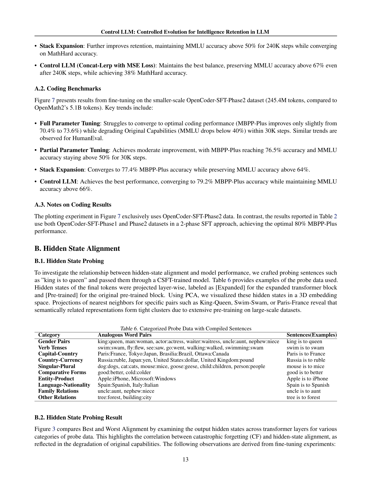

 


 2501.10979 
 Haichao Wei et el. 
 
 🤗 2025-01-24 
 



↗ arXiv


↗ Hugging Face


↗ Papers with Code


### TL;DR



대규모 언어 모델(LLM)은 방대한 데이터를 학습하여 놀라운 성능을 보이지만, **새로운 데이터를 지속적으로 학습하는 과정에서 기존 지식을 잊어버리는 '끔찍한 망각(CF)' 문제**에 직면합니다.  기존의 해결책들은 계산 비용이 많이 들거나 성능 저하를 야기하는 등 한계점을 가지고 있습니다.

Control LLM은 이 문제를 해결하기 위해 **병렬로 작동하는 기존 및 확장된 트랜스포머 블록**을 사용하여 새로운 지식을 효율적으로 통합하는 새로운 아키텍처를 제안합니다.  **블록 간의 은닉 상태 정렬 전략**을 통해 기존 과제의 성능 저하를 최소화하면서 새로운 과제에 대한 성능을 향상시킵니다.  실험 결과, Control LLM은 다양한 과제에서 기존 최고 성능을 뛰어넘는 성과를 보이며, **LLM의 지속적 학습 및 성능 향상에 새로운 가능성**을 제시합니다.



#### Key Takeaways


 Control LLM은 **LLM의 지속적 학습 시 끔찍한 망각 문제**를 효과적으로 해결합니다. 



 병렬 전이 트랜스포머 블록과 상호 보완 전략을 통해 **기존 과제 성능 유지 및 새로운 지식 효율적 통합**을 달성합니다. 



 수학, 코딩, 다국어 능력 등 다양한 과제에서 **기존 최고 성능(SOTA)을 뛰어넘는 성과**를 달성했습니다. 


#### Why does it matter?
본 논문은 **지속적인 학습(CPT) 및 지도 미세 조정(CSFT) 중 대규모 언어 모델(LLM)에서 발생하는 끔찍한 망각(CF) 문제**를 해결하는 새로운 방법을 제시합니다.  **기존 방법의 한계점을 극복**하고, **새로운 지식을 효율적으로 통합하면서 기존 성능을 유지**하는 Control LLM 아키텍처를 제안하여 연구자들에게 중요한 시사점을 제공합니다. 이는 **LLM의 지속적인 발전**에 기여하며, **새로운 연구 방향**을 제시하는 **중요한 연구 성과**입니다.

------
#### Visual Insights

> 🔼 본 그림은 논문에서 제시된 Control LLM 모델과 기존 최첨단(SOTA) Llama 기반 모델들의 성능을 비교한 것입니다.  다양한 하위 작업(Math-Hard, MMLU, MBPP-PLUS, CMMLU, GPQA, ARC)에서 Control LLM이 SOTA 모델들보다 우수한 성능을 보임을 시각적으로 보여줍니다. 각 작업에 대한 점수를 통해 Control LLM의 성능 개선 정도를 명확하게 확인할 수 있습니다.
> 

> 
read the caption

> Figure 1: Comparison: Ours vs SOTA Llama-tuned models.
> 


| Model | MathHard | Math | GSM8K | Avg. | ARC | GPQA | MMLU | MMLUP | Avg. | Avg. |
|---|---|---|---|---|---|---|---|---|---|---|
| Llama3.1-8B-Instruct | 23.7 | 50.9 | 85.6 | 52.1 | 83.4 | 29.9 | 72.4 | 46.7 | 60.5 | 56.3 |
| OpenMath2-Llama3.1 | 38.4 | 64.1 | 90.3 | 64.3 | 45.8 | 1.3 | 4.5 | 19.5 | 12.9 | 38.6 |
| Full Param Tune | 38.5 | 63.7 | 90.2 | 63.9 | 58.2 | 1.1 | 7.3 | 23.5 | 16.5 | 40.1 |
| Partial Param Tune | 36.4 | 61.4 | 89.0 | 61.8 | 66.2 | 6.0 | 25.7 | 30.9 | 29.3 | 45.6 |
| Stack Expansion | 35.6 | 61.0 | 90.8 | 61.8 | 69.3 | 18.8 | 61.8 | 43.1 | 53.3 | 57.6 |
| Hybrid Expansion | 34.4 | 61.1 | 90.1 | 61.5 | 81.8 | 25.9 | 67.2 | 43.9 | 57.1 | 59.3 |
| Control LLM* | 38.1 | 62.7 | 90.4 | 63.2 | 79.7 | 25.2 | 68.1 | 43.6 | 57.2 | 60.2 |

> 🔼 표 1은 연속적인 지도 학습 미세 조정(CSFT)을 사용하여 수행된 0-shot 수학적 추론 실험 결과를 보여줍니다.  다양한 CPT(연속적 사전 학습) 접근 방식과 오픈 소스 모델들을 비교 분석하여 ControlLLM(Concat-Lerp-MSE)의 성능을 평가합니다.  구체적으로, Llama3.1-8B-Instruct 모델을 기반으로 MathHard, Math, GSM8K, ARC, GPQA, MMLU, MMLUP 등 다양한 지표에 대한 결과를 제시하며, ControlLLM이 기존 방법보다 우수한 성능을 보임을 보여줍니다.
> 

> 
read the caption

> Table 1: [Result] CSFT on mathematical(0-shot): Open-source models, various CPT approaches, and ControlLLM(Concat-Lerp-MSE).
> 

### In-depth insights

#### Control LLM Overview
Control LLM은 기존 LLM의 재학습 없이 성능을 향상시키는 새로운 방법으로, **파괴적 망각(Catastrophic Forgetting)** 문제를 해결하는 데 중점을 둡니다.  이는 **병렬로 학습된 전이 학습 블록과 확장된 트랜스포머 블록**을 활용하여, 은닉 상태(hidden-states) 보간 전략을 통해 이들을 정렬함으로써 기존 과제에 대한 성능을 유지하면서 새로운 지식을 통합합니다.  **수학적 추론, 코딩, 다국어 능력** 등 다양한 과제에서 기존 방법들을 능가하는 성능 향상을 보이며, 특히 **계산 자원을 효율적으로 사용**하는 것이 강점입니다.  **LinkedIn의 GenAI 제품**에도 성공적으로 적용되어 실용성을 입증하였습니다.  하지만, **보간 전략의 최적화 및 다양한 LLM 아키텍처**에 대한 적용 가능성 등 추가적인 연구가 필요합니다.

#### Catastrophic Forgetting
본 논문에서 'Catastrophic Forgetting'은 **대규모 언어 모델(LLM)의 지속적인 학습 과정에서 발생하는 주요 문제**로 제시됩니다.  LLM이 새로운 지식을 학습하는 동안 기존에 학습된 중요한 지식을 잊어버리는 현상을 의미하며, **지속적인 사전 학습(CPT) 및 지속적인 지도 미세 조정(CSFT)** 과정에서 성능 저하의 주요 원인이 됩니다. 이러한 **CF 문제는 기존 모델을 재훈련하지 않고 성능을 향상시키려는 노력을 방해**하며,  새로운 데이터가 기존 지식을 덮어쓰는 현상으로 이어져 모델의 전반적인 성능 저하를 초래합니다. 따라서 논문에서는 **CF 문제를 완화하고 LLM의 지능 유지를 위한 효과적인 전략**을 제시하는 Control LLM 모델을 제안합니다.

#### Hidden-State Alignment
본 논문에서 'Hidden-State Alignment'는 **대규모 언어 모델(LLM)의 지능 유지를 위한 핵심 전략**으로 제시됩니다.  기존 LLM들은 새로운 지식을 학습하는 과정에서 기존 지식을 잊어버리는 재앙적 망각(Catastrophic Forgetting) 문제에 직면합니다.  이를 해결하기 위해, 본 연구는 **병렬로 학습되는 기존의 사전 훈련된 트랜스포머 블록과 확장된 트랜스포머 블록의 은닉 상태를 정렬**하는 기법을 제시합니다.  이러한 정렬을 통해 새로운 지식과 기존 지식 간의 충돌을 최소화하고, **성능 저하 없이 새로운 기능을 통합**하는 것을 목표로 합니다.  **보간(Interpolation) 전략**은 두 블록의 은닉 상태를 효과적으로 조정하여, 최적의 성능을 달성하는 데 중요한 역할을 합니다.  실험 결과, 이 기법은 수학적 추론, 코딩, 다국어 능력 등 다양한 작업에서 성능 향상을 보이며, **재앙적 망각을 효과적으로 완화**하는 것을 보여줍니다.

#### Ablation Study Analysis
본 논문의 **절제 연구 분석** 부분은 제안된 방법의 각 구성 요소(예: 상호 작용 전략, 손실 함수, 레이어 수)가 전체 성능에 미치는 영향을 체계적으로 평가합니다. 이를 통해 **Control LLM의 핵심 구성 요소**들의 중요성을 밝히고, **성능 향상에 가장 큰 기여를 한 요소**를 확인할 수 있습니다.  **다양한 변수들을 조합하여 실험**함으로써, 각 구성 요소의 독립적인 효과뿐 아니라 상호 작용 효과도 파악하여 **최적의 모델 구성**을 도출하는 데 도움이 될 것입니다. 또한, **절제 연구는 모델의 강건성과 일반화 성능**을 평가하는 데에도 중요한 역할을 합니다. 각 구성 요소를 제거하거나 변경했을 때 성능이 얼마나 저하되는지를 분석하여, 모델의 취약점을 파악하고 개선 방향을 제시하는 데 활용될 수 있습니다.  결론적으로, 절제 연구 분석은 Control LLM의 성능과 신뢰성을 높이는 데 중요한 역할을 하는 동시에, **추후 연구를 위한 귀중한 통찰력**을 제공합니다.

#### Future Research
본 논문에서 제시된 Control LLM은 지속적인 학습 환경에서의 catastrophic forgetting 문제를 효과적으로 완화하는 아키텍처를 제안하지만, **여전히 개선의 여지가 많다.**  향후 연구 방향으로는 **더욱 효율적인 다중 모달 및 강화 학습 모델을 위한 아키텍처 설계**가 중요하다.  **은닉 상태 정렬의 이론적 토대에 대한 심층적인 탐구**를 통해 일반화 능력을 향상시키는 연구가 필요하다.  또한, **다양한 발산 손실 함수 및 적응형 가중치 전략**을 탐색하여 성능을 최적화하는 연구도 중요하다.  **대규모 언어 모델에서 지속적인 학습의 기초에 대한 이론적 연구**는 Control LLM의 성능 향상과 더불어 지속적인 학습의 효율성 및 안정성을 높이는 데 기여할 것이다. 마지막으로, **Control LLM의 실제 적용 사례 확장**을 통해 실제 문제 해결에 대한 효과성 검증 및 개선이 필요하다.

### More visual insights

More on figures

> 🔼 그림 2는 제안된 Control LLM 방법과 다른 오픈소스 모델들의 비교 결과를 보여줍니다.  OpenMath와 OpenCoder 두 가지 오픈소스 데이터셋에서 지속적 사전 훈련(CPT)과 지속적 지도 미세 조정(CSFT) 과정 중 발생하는  catastrophic forgetting(CF) 현상을 얼마나 잘 극복하는지 비교 분석한 결과입니다. 왼쪽은 수학적 추론(OpenMath 데이터셋)에 대한 결과이고, 오른쪽은 코딩(OpenCoder 데이터셋)에 대한 결과입니다. 각 그래프의 막대는 특정 모델의 성능을 나타내며, Control LLM이 다른 방법들보다 CF를 더 효과적으로 완화하면서 성능을 향상시켰음을 시각적으로 보여줍니다.
> 

> 
read the caption

> Figure 2: [Result] Comparison of CF - our method vs others on open-source datasets: (left) OpenMath, (right) OpenCoder.
> 

> 🔼 본 그림은 Control LLM에서 제안하는 병렬 전처리 및 확장된 트랜스포머 블록의 은닉 상태 정렬의 효과를 보여줍니다.  Control LLM은 기존의 사전 훈련된 블록과 새롭게 학습되는 블록의 은닉 상태를 보간법을 통해 정렬하여 기존 과제의 성능을 유지하면서 새로운 지식을 효과적으로 통합합니다. 그림은 최적의 정렬을 달성한 Control LLM과 최악의 정렬을 보인 전체 매개변수 미세 조정 방법을 비교하여,  잘 정렬된 은닉 상태가 기존의 능력을 유지하면서 새로운 과제를 학습하는 데 중요함을 시각적으로 보여줍니다.  특히, 수학 과제(OpenMath2)에서 Control LLM은 Math Hard 정확도를 14.4% 향상시키는 반면 MMLU는 4.3%만 감소시키는 반면, 잘못 정렬된 방법은 Math Hard에서 +14.8%를 달성하지만 MMLU는 65.1%나 감소하는 것을 보여줍니다.
> 

> 
read the caption

> Figure 3: [Why] Hidden State Alignment Comparison: Best Alignment(Control LLM) vs Worst Alignment(Full-Parameter Tuning).
> 

> 🔼 그림 4는 Control LLM의 아키텍처를 보여줍니다. (a)는 N-1개의 레이어마다 추가된 확장 블록이 인터폴레이터를 통해 고정된 블록에 연결되는 방식을 나타냅니다. (b)는 인터폴레이터가 최종 표현을 생성하기 위해 히든 상태를 정렬하는 방법을 보여줍니다. (c)는 다양한 인터폴레이션 전략을 보여줍니다.  본 논문에서는 여러 인터폴레이션 기법(Linear Interpolation, Dynamic Linear Interpolation, Progressive Linear Interpolation 등)을 사용하여, pre-trained된 트랜스포머 블록과 fine-tuning을 통해 새 지식을 학습하는 expanded 트랜스포머 블록의 히든 상태를 정렬하는 방법을 제시합니다.  이를 통해 기존 과제의 성능을 유지하면서 새로운 지식을 통합하는 Control LLM의 핵심 메커니즘을 시각적으로 보여줍니다.
> 

> 
read the caption

> Figure 4: [How] Control LLM Architecture. (a) Expanded blocks added every N−1𝑁1N-1italic_N - 1 layers connect to frozen blocks via interpolators. (b) Interpolators align hidden-states to produce final representations. (c) Different interpolation strategies are explored.
> 

> 🔼 그림 5는 Control LLM의 세 가지 모델 확장 전략을 보여줍니다. (concat)는 기본 이중 구조로, 기존의 사전 훈련된 트랜스포머 블록에 새로운 트랜스포머 블록을 병렬로 추가하는 방식입니다. (stack)는 LLaMA Pro 모델을 따르는 방식으로, 새로운 블록을 기존 블록 위에 쌓는 방식입니다. (hybrid)는 concat과 stack 방식을 혼합한 방식입니다. 각 전략은 특정 레이어에 적용되며, 모델의 성능과 연산 비용에 영향을 미칩니다.
> 

> 
read the caption

> Figure 5: [How] Structure analysis: (concat) the default dual structure. (stack) stack the expanded block following LLaMA Pro. (hybrid) hybrid structure of concat and stack.
> 

> 🔼 그림 6은 OpenMath 데이터셋을 사용하여 Llama-3.1-8B-Instruct 모델을 미세 조정하는 네 가지 방법의 벤치마크 결과를 보여줍니다.  (a) 전체 파라미터 미세 조정은 모든 파라미터를 학습하지만, 기존 성능 저하를 초래합니다. (b) 부분적 파라미터 미세 조정은 모든 4개의 트랜스포머 레이어 중 1개만 학습하여 기존 성능을 보존하려고 시도하지만, 장기적인 성능 유지를 어렵게 만듭니다. (c) 스택 확장은 기존 레이어를 동결하면서 8개의 새로운 트랜스포머 레이어를 추가하여 성능을 향상시키려는 방법입니다. (d) Concat-Lerp 확장은 보간기를 사용하여 8개의 새로운 레이어를 기존 레이어에 연결하는 Control LLM의 방법으로, MSE 발산 손실을 통해 기존 성능을 보존하면서 새로운 작업 학습을 향상시킵니다.  각 그래프는 Math-Hard(새로운 작업)와 MMLU(기존 작업)의 정확도를 글로벌 단계에 따라 보여줍니다.
> 

> 
read the caption

> Figure 6: [OpenMath + Llama-3.1-8B-Instruct] Benchmark comparison of training methods. (a) Full Parameter Tuning. (b) Partial Parameter Tuning: Freeze all except 1 of every 4 transformer layers (8 total). (c) Stack Expansion: Add 8 transformer layers (1 per 4) while freezing originals. (d) Concat-Lerp Expansion: Add 8 transformer layers connected via interpolator with MSE divergence loss.
> 

> 🔼 그림 7은 OpenCoder SFT Phase2 데이터셋을 사용하여 Llama-3.1-8B-Instruct 모델을 미세 조정하는 다양한 방법들의 벤치마크 결과를 보여줍니다. (a)는 모든 파라미터를 미세 조정하는 방법, (b)는 4개의 트랜스포머 레이어 중 3개를 고정하고 1개만 미세 조정하는 부분적 파라미터 미세 조정 방법, (c)는 원본 레이어를 고정하고 8개의 새로운 레이어를 추가하는 스택 확장 방법, 그리고 (d)는 보간기를 사용하여 8개의 새로운 레이어를 연결하는 Concat-Lerp 확장 방법을 보여줍니다. 각 방법은 MBPP-Plus 및 MMLU 성능에 미치는 영향을 비교 분석하여 최적의 방법을 제시합니다.  각 그래프는 훈련 단계별 MBPP-Plus(새로운 코딩 기술 습득 능력)와 MMLU(기존 능력 유지 능력) 성능을 나타냅니다. 이를 통해  새로운 지식을 학습하면서 기존 능력을 얼마나 잘 유지하는지 시각적으로 비교할 수 있습니다.
> 

> 
read the caption

> Figure 7: [OpenCoder SFT Phase2 + Llama-3.1-8B-Instruct] Benchmark comparison of training methods. (a) Full Parameter Tuning. (b) Partial Parameter Tuning: Freeze all except 1 of every 4 transformer layers (8 total). (c) Stack Expansion: Add 8 transformer layers (1 per 4) while freezing originals. (d) Concat-Lerp Expansion: Add 8 transformer layers connected via interpolator with MSE divergence loss.
> 

> 🔼 그림은 사전 훈련된 모델(Pre-trained Model)과 컨트롤 LLM의 성능 비교를 보여줍니다. (a)는 사전 훈련된 모델의 Math Hard 점수가 0.237, MMLU 점수가 0.724임을 나타냅니다. 이는 컨트롤 LLM이 기존 지식을 유지하면서 새로운 지식을 학습하는 데 얼마나 효과적인지 보여주는 기준점 역할을 합니다.  Math Hard는 새로운 수학 문제 해결 능력을, MMLU는 다양한 지식 영역에 대한 일반적인 언어 이해 능력을 평가합니다. 즉, 사전 훈련된 모델은 MMLU 점수가 높지만 새로운 수학 문제(Math Hard)에는 약하다는 것을 의미합니다. 이후 그림의 다른 부분에서는 컨트롤 LLM의 다양한 구성과 그에 따른 성능 변화를 보여줍니다.
> 

> 
read the caption

> (a) Pre-trained Model - Math Hard 0.237 - MMLU 0.724
> 

> 🔼 그림 (b)는 Control LLM의 아키텍처에서 Lerp(Linear Interpolation) 보간법과 MSE(Mean Squared Error) 손실 함수를 사용한 결과를 보여줍니다.  'Math Hard' 작업에서는 0.360의 정확도를 달성하였고, 'MMLU' 작업에서는 0.716의 정확도를 유지했습니다. 이는 새로운 지식을 효과적으로 통합하면서 기존의 성능을 잘 유지하는 Control LLM의 성능을 보여주는 예시입니다.  'Math Hard'는 수학적 추론 능력을 평가하는 지표이고, 'MMLU'는 다양한 지식 영역에 대한 일반적인 언어 이해 능력을 평가하는 지표입니다.
> 

> 
read the caption

> (b) Lerp with MSE - Math Hard 0.360 - MMLU 0.716
> 

> 🔼 그림은 OpenMath2와 Llama-3.1-8B-Instruct 모델을 사용하여 다양한 정렬 전략의 영향을 시각화한 것입니다.  (c)는 Dlerp(Dynamic Linear Interpolation) 기법을 사용했지만, 발산 손실(Divergence Loss) 없이 학습한 결과를 보여줍니다. Math Hard 작업에서는 35.7%의 정확도를, MMLU(Massive Multitask Language Understanding) 작업에서는 66%의 정확도를 달성했습니다.  발산 손실이 없어 기존 지식의 보존에 어려움을 겪었음을 나타냅니다.
> 

> 
read the caption

> (c) Dlerp without Divergence Loss - Math Hard 0.357 - MMLU 0.66
> 

> 🔼 그림 (d)는 코사인 유사도를 사용한 선형 보간(Lerp) 방법을 사용했을 때의 결과를 보여줍니다.  수치적으로는 Math Hard 문제 정확도가 0.362, MMLU 정확도가 0.54로 나타났습니다.  이 방법은 이전에 학습된 지식과 새로 학습하는 지식 간의 조화를 찾는 데 초점을 맞추고 있습니다.  본 그림은  Control LLM의 다양한 방법론들을 비교 분석하는 부분에서 제시된 것으로, 특히  hidden-state alignment 전략의 효과를 시각적으로 보여주고 있습니다.  낮은 MMLU 정확도는 코사인 유사도 기반의 정렬 전략이 catastrophic forgetting 문제를 완화하는 데 부족함을 시사합니다.
> 

> 
read the caption

> (d) Lerp with Cosine Alignment - Math Hard 0.362 - MMLU 0.54
> 

> 🔼 그림은 OpenMath2 + Llama-3.1-8B-Instruct 모델에서 다양한 정렬 전략의 영향을 비교 분석한 결과입니다.  (e)는 발산 손실 없이 선형 보간(Lerp) 방법을 사용한 결과를 보여줍니다. Math Hard 작업에 대한 정확도는 0.359, MMLU 작업에 대한 정확도는 0.41로 나타났습니다.  이는 발산 손실을 적용하지 않아 기존 지식(MMLU)이 상당히 손상되었음을 의미하며, 새로운 작업(Math Hard) 학습에만 집중된 결과임을 보여줍니다.  선형 보간 자체는 효과적이나 발산 손실의 부재로 인해 catastrophic forgetting 현상이 발생한 것을 알 수 있습니다.
> 

> 
read the caption

> (e) Lerp without Divergence Loss - Math Hard 0.359 - MMLU 0.41
> 

> 🔼 그림은 OpenMath2 + Llama-3.1-8B-Instruct 모델을 사용하여 수행한 미세 조정 실험의 결과를 보여줍니다.  (f)는 전체 매개변수 미세 조정(Full Parameter Training) 방법을 사용했을 때의 결과를 나타냅니다.  Math Hard 작업에서는 0.368의 정확도를 달성했지만, MMLU 작업에서는 0.07의 정확도로 성능이 매우 저하되었습니다. 이는 새로운 작업 학습 과정에서 기존 지식이 심각하게 손실되는 파국적 망각(Catastrophic Forgetting) 현상을 보여주는 예시입니다.  본 그림은 파국적 망각 문제를 해결하기 위한 Control LLM의 효과를 보여주기 위한 비교 대조군으로 사용되었습니다.
> 

> 
read the caption

> (f) Full Parameter Training - Math Hard 0.368 - MMLU 0.07
> 

> 🔼 그림 8은 OpenMath2 데이터셋으로 Llama-3.1-8B-Instruct 모델을 미세 조정하는 다양한 정렬 전략이 모델 성능에 미치는 영향을 보여줍니다.  (a)는 사전 훈련된 모델로, [사전 훈련] 및 [확장] 블록의 은닉 상태가 모든 계층에서 동일합니다.  높은 의미적 안정성과 계층별 클러스터링을 보여줍니다. (b) Control LLM (MSE 발산 손실)은 의미적 안정성과 계층별 클러스터링을 유지하며, 강력한 급격한 망각(CF) 완화를 보여줍니다. (c) 발산 손실 없는 Dlerp는 (b)보다 거리가 약 2배 더 큼을 보여주며, 정렬 품질이 저하됨을 나타냅니다. (d) 코사인 발산 손실을 사용하는 Lerp는 계층별 클러스터링을 유지하지만 의미적 안정성이 약화됩니다.  (e) 발산 손실이 없는 Lerp는 의미적 안정성이 더욱 저하됩니다. (f) 전체 매개변수 미세 조정은 보간이 없이 [확장]과 [사전 훈련] 간에 의미적 차이가 발생합니다.
> 

> 
read the caption

> Figure 8: [OpenMath2 + Llama-3.1-8B-Instruct] Comparison of various alignment strategies and their impact on model performance. (a) Pre-trained Model: Hidden states from [Pretrained] and [Expanded] blocks are identical for all layers. 1) Semantic Stability: Analogous sentences exhibit high similarity in both cosine and Euclidean distances. 2) Layer-wise Clustering: Distinct clusters are formed for each layer. (b) Control LLM (MSE Divergence Loss): Maintains both semantic stability and layer-wise clustering, exhibiting strong catastrophic forgetting (CF) mitigation. (c) Dlerp without Divergence Loss: Shows distances approximately 2x larger than (b), reducing alignment quality. (d) Lerp with Cosine Divergence Loss: Preserves layer-wise clustering but weakens semantic stability. Nearest neighbors for [Pretrained] drift in Euclidean distance, while cosine similarity is maintained. (e) Lerp without Divergence Loss: Semantic stability degrades further between [Pretrained] and [Expanded] blocks, particularly in cosine similarity. (f) Full Parameter Tuning: Semantic drift is observed between [Expanded] and [Pretrained], with no interpolation applied.
> 

> 🔼 그림 9는 OpenMath2 데이터셋을 사용하여 Llama-3.1-8B-Instruct 모델을 미세 조정하는 동안 다양한 절삭 연구 설정의 벤치마크 결과를 매 1K 단계마다 비교한 것입니다.  각 하위 그림은 다른 설정을 보여줍니다. (a) MSE 손실을 사용하는 Lerp 보간 전략, (b) 발산 손실 없이 Lerp 보간 전략, (c) MSE 손실을 사용하는 Dlerp 보간 전략, (d) 발산 손실 없이 Dlerp 보간 전략, (e) 하이브리드 확장 전략, (f) Plerp 보간 전략, (g) DlerpIn 보간 전략, (h) MoE 게이팅입니다. 이 그림은 서로 다른 설정이 모델의 성능, 특히 갑작스러운 망각(catastrophic forgetting) 및 새로운 작업 학습에 미치는 영향을 보여줍니다.
> 

> 
read the caption

> Figure 9: [OpenMath2 + Llama-3.1-8B-Instruct] Comparison of benchmark results of different ablation study settings every 1K steps during training. (a) Lerp Interporation Strategy with MSE loss. (b) Lerp Interporation Strategy without Divergence Loss. (c) Dlerp Interporation Strategy with MSE loss. (d) Dlerp Interporation Strategy without Divergence Loss. (e) Hybrid Expansion Strategy. (e) Plerp Interporation Strategy. (f) DlerpIn Interporation Strategy. (e) MoE gating.
> 

> 🔼 그림 10은 OpenCoder와 Llama-3.1-8B-Instruct 모델을 사용하여 다양한 제거 연구 설정에서 훈련 중 성능 벤치마크 결과를 비교한 그래프입니다. (a)는 MSE 손실을 사용한 Lerp 보간 전략, (b)는 (a)보다 3배 더 긴 시간 동안 훈련된 MSE 손실을 사용한 Lerp 보간 전략, (c)는 하이브리드 확장 전략, (d)는 MoE 게이팅을 보여줍니다.  각 그래프는 훈련 중 특정 지표의 변화를 시간에 따라 보여주어, 각 설정이 새로운 작업 학습과 기존 기능 유지를 어떻게 조화시키는지 시각적으로 보여줍니다.
> 

> 
read the caption

> Figure 10: [OpenCoder + Llama-3.1-8B-Instruct] Comparison of benchmark results of different ablation study settings during training. (a) Lerp Interporation Strategy with MSE Loss. (b) Lerp Interporation Strategy with MSE Loss. Trained 3X longer than (a) (c) Hybrid Expansion Strategy. (d) MoE gating.
> 

More on tables


| Model | MBPP+ | MBPPS | HE+ | HE | Avg. | ARC | GPQA | MMLU | MMLUP | Avg. | Avg. |
|---|---|---|---|---|---|---|---|---|---|---|---|
| Llama3.1-8B-Ins | 70.4 | 67.7 | 66.5 | 70.7 | 69.1 | 83.4 | 29.9 | 72.4 | 46.7 | 60.5 | 64.8 |
| OpenCoder-8B-Ins | 81.2 | 76.3 | 78.0 | 82.3 | 79.5 | 8.2 | 25.4 | 37.4 | 11.3 | 24.6 | 52.1 |
| Full Param Tune | 75.1 | 69.6 | 71.3 | 76.8 | 73.3 | 24.4 | 21.9 | 43.0 | 19.2 | 31.5 | 52.4 |
| Partial Param Tune | 75.7 | 71.6 | 74.4 | 79.3 | 75.0 | 70.2 | 28.1 | 60.7 | 32.4 | 48.3 | 61.7 |
| Stack Expansion | 77.2 | 72.8 | 73.2 | 78.7 | 75.6 | 80.0 | 26.3 | 66.6 | 38.2 | 54.2 | 64.9 |
| Hybrid Expansion* | 77.5 | 73.5 | 76.2 | 82.3 | 77.1 | 80.9 | 32.6 | 68.1 | 40.3 | 56.0 | 66.6 |
| Control LLM* | 80.4 | 75.9 | 74.4 | 81.1 | 78.3 | 82.5 | 29.7 | 68.2 | 40.9 | 56.3 | 67.3 |
> 🔼 표 2는 지속적인 지도 미세 조정(CSFT)에서 제로샷(0-shot) 코드 생성 작업에 대한 결과를 보여줍니다.  ControlLLM(Concat-Lerp-MSE) 모델의 성능을 다양한 기준(MBPP+, HE+, MMLUP 등)과 비교하여 보여줍니다.  본 표는 4.1.3절에서 약어를 설명하고 있습니다.  ControlLLM 모델의 성능을 평가하기 위해 사용된 벤치마크와 평가 지표를 자세히 제시합니다.
> 

> 
read the caption

> Table 2: [Result] CSFT on coding(0-shot). ControlLLM(Concat-Lerp-MSE). Abbr.(e.g. MBPP+, HE+, MMLUP) in Section 4.1.3.
> 


| Model | CEval | CEvalC | CMMLU | CMMLUC | Avg. | BBH | MMLU | MMLUP | Avg. | Avg. |
|---|---|---|---|---|---|---|---|---|---|---|
| Llama3.1-8B | 48.3 | 12.8 | 51.1 | 14.1 | 29.1 | 65.2 | 65.4 | 35.5 | 55.4 | 42.3 |
| Llama-3-SynE | 57.7 | 22.3 | 57.1 | 22.8 | 32.5 | 61.9 | 64.0 | 32.6 | 52.8 | 42.7 |
| Full Param Tune* | 59.0 | 40.2 | 60.2 | 44.3 | 51.2 | 64.8 | 64.9 | 35.0 | 55.0 | 53.1 |
| Stack Expansion | 56.0 | 32.7 | 55.2 | 33.4 | 44.3 | 62.3 | 65.6 | 35.3 | 54.4 | 49.4 |
| Concat-Lerp* | 57.1 | 34.8 | 57.0 | 37.4 | 46.6 | 64.4 | 64.6 | 35.8 | 55.0 | 50.8 |
| Hybrid Expansion* | 58.9 | 44.7 | 57.9 | 44.3 | 51.5 | 65.1 | 65.7 | 36.9 | 55.9 | 53.7 |
| Control LLM* | 57.0 | 44.7 | 56.0 | 44.9 | 50.7 | 68.2 | 65.6 | 37.9 | 57.2 | 54.0 |
> 🔼 표 3은 지속적 사전 훈련(CPT) 중 중국어에 대한 Control LLM의 성능을 보여줍니다.  Control LLM은 Concat-Dlerp 방법을 사용했으며, CEvalC는 C-Eval-0shot-CoT를, CMMLUC는 CMMLU-0shot-CoT를 나타냅니다. 이 표는 다양한 모델(Llama-3-SynE, Llama-3-8B,  Control LLM의 여러 변형)을 사용하여  중국어 관련 벤치마크(C-Eval, C-Eval-CoT, CMMLU, CMMLU-CoT)에서의 성능과 원래 기능을 비교하여  Control LLM의 효과를 보여줍니다.  각 모델의 중국어 능력 향상 정도와 원래 기능 유지 수준을 수치화하여 제시합니다.
> 

> 
read the caption

> Table 3: [Result] CPT on Chinese. Control LLM(Concat-Dlerp). Abbr.: CEvalC(C-Eval-0shot-CoT), CMMLUC(CMMLU-0shot-CoT).
> 


| Dataset | Task | Samples | Tokens |
|---|---|---|---| 
| Llama3-SynE (-EN) | Multilingual | 47M | 35.8B |
| OpenMath2 | Mathematics | 13.27M | 5.1B |
| OpenCoder-SFT-Phase1 | Coding | 4.02M | 2.4B |
| OpenCoder-SFT-Phase2 | Coding | 0.43M | 245.4M |
> 🔼 표 4는 본 논문의 실험에 사용된 데이터셋을 요약한 표입니다. 작업 유형별로 분류하고, 각 데이터셋의 샘플 수와 토큰 수를 보여줍니다.  본 표는 다양한 언어 모델의 지속적 사전 훈련 및 지속적 지도 미세 조정 성능을 평가하기 위한 실험에 사용된 데이터셋들을 보여주는 것으로,  실험의 규모와 데이터셋의 특징을 이해하는 데 유용한 정보를 제공합니다.
> 

> 
read the caption

> Table 4: [What] Summary of datasets used in experiments, categorized by task type, with sample and token counts.
> 


| Model | MathH | G8K | GPQA | MMLU | Avg. |
|---|---|---|---|---|---| 
| **Model** | **Math** |  | **Original** |  | **Avg.** |
|  | **MathH** | **G8K** | **GPQA** | **MMLU** |  |
| Full-Param | **38.5** | 90.2 | 1.1 | 7.3 | 34.3 |
| Lerp8 | 36.1 | 90.2 | 18.5 | 58.8 | 50.9 |
| Lerp8-MSE | 35.9 | 90.1 | 28.4 | **71.7** | **56.5** |
| Lerp8-Cos | 34.9 | 89.2 | 29.5 | 71.0 | 56.2 |
| Dlerp8 | **36.7** | 90.0 | **28.8** | 69.1 | 56.2 |
| Dlerp8-MSE | 35.6 | 89.5 | 19.9 | 66.1 | 52.8 |
| Dlerp8-Cos | 36.5 | **90.2** | 26.1 | 69.1 | 55.5 |
| DlerpIn8 | 34.1 | 87.6 | **25.7** | **68.2** | **53.9** |
| Plerp8 | **36.5** | **90.9** | 9.2 | 41.9 | 44.6 |
| MoE8 | 34.1 | 89.7 | 20.5 | 63.3 | 51.9 |
| Lerp16-MSE | 38.1 | 90.4 | **25.2** | **68.1** | **55.5** |
| Dlerp16 | 37.7 | **91.1** | 22.3 | 64.2 | 53.8 |
| Dlerp32 | **38.6** | 91.4 | 22.1 | 60.9 | 53.3 |
| Lerp8MSE0 | **35.8** | **90.6** | 7.4 | 53.4 | 46.8 |
| Lerp8MSE0* | 35.1 | 89.3 | 31.3 | **72.4** | **57.0** |
| Lerp8MSE0*M | 33.9 | 89.1 | **32.4** | 72.2 | 56.9 |
| Lerp8MSEα | 32.6 | 87.3 | 29.8 | 71.8 | 55.4 |
> 🔼 표 5는 다양한 설정(보간 전략, 손실 함수, 층 수)을 사용하여 OpenMath2 데이터셋에서 Llama-3.1-8B-Instruct 모델을 미세 조정했을 때의 결과를 보여줍니다.  각 설정에 따른 Math Hard 정확도, GSM8K 정확도, GPQA 정확도, MMLU 정확도를 비교하여 최적의 설정을 찾고자 하였습니다.  Math Hard는 새로 학습한 과제의 성능을, MMLU는 기존 지식의 보존 정도를 나타냅니다.  이를 통해 Catastrophic Forgetting (CF) 완화와 새로운 지식 습득 사이의 균형을 찾는 데 초점을 맞추었습니다.
> 

> 
read the caption

> Table 5: [Where] Ablation Study. Abbr. MathH(Math Hard), Cos(Cosine), G8K(GSM8K)
> 


| Category | Analogous Word Pairs | Sentences(Examples) |
|---|---|---|
| **Gender Pairs** | king:queen, man:woman, actor:actress, waiter:waitress, uncle:aunt, nephew:niece | king is to queen |
| **Verb Tenses** | swim:swam, fly:flew, see:saw, go:went, walking:walked, swimming:swam | swim is to swam |
| **Capital-Country** | Paris:France, Tokyo:Japan, Brasilia:Brazil, Ottawa:Canada | Paris is to France |
| **Country-Currency** | Russia:ruble, Japan:yen, United States:dollar, United Kingdom:pound | Russia is to ruble |
| **Singular-Plural** | dog:dogs, cat:cats, mouse:mice, goose:geese, child:children, person:people | mouse is to mice |
| **Comparative Forms** | good:better, cold:colder | good is to better |
| **Entity-Product** | Apple:iPhone, Microsoft:Windows | Apple is to iPhone |
| **Language-Nationality** | Spain:Spanish, Italy:Italian | Spain is to Spanish |
| **Family Relations** | uncle:aunt, nephew:niece | uncle is to aunt |
| **Other Relations** | tree:forest, building:city | tree is to forest |
> 🔼 본 논문의 표 6는 숨겨진 상태 정렬 분석을 위한 탐침 문장(Probe Sentences)들을 범주화하여 보여줍니다.  각 범주 (성별 쌍, 동사 시제, 수도-국가, 국가-통화, 단수-복수, 비교 형태, 개체-제품, 언어-국적, 가족 관계, 기타 관계)에 해당하는 문장 예시들을 제시하여,  다양한 유형의 의미 관계를 포괄하는 탐침 문장들의 구성을 설명합니다.  이를 통해,  모델의 숨겨진 상태 벡터 간의 의미적 유사성과 일관성을 평가하는 데 사용되는 데이터의 다양성을 확인할 수 있습니다.
> 

> 
read the caption

> Table 6: Categorized Probe Data with Compiled Sentences
> 


| Task | Dataset (Abbreviation) | Data Source | Prompt Template |
|---|---|---|---|
| **Math** | Math-0shot (Math) | [1] | [15]* |
|  | Math-Hard-0shot (MathH) | [2] | [16]* |
|  | GSM8K (G8K) | [3] | [17]* |
| **Coding** | MBPP-Sanitize-0shot (MBPPS) | [4] | [18]* |
|  | MBPP-Plus-0shot (MBPP+) | [5] | [19]* |
|  | HumanEval-Greedy (HE) | [6] | [20]* |
|  | HumanEval-Plus-Greedy (HE+) | [7] | [21]* |
| **Chinese** | C-Eval-0shot (CEval) | [8] | [22]* |
|  | C-Eval-0shot-CoT (CEvalC) | [8] | C.1 |
|  | CMMLU-0shot (CMMLU) | [9] | [23]* |
|  | CMMLU-0shot-CoT (CMMLUC) | [9] | C.1 |
| **Original Capabilities-CSFT** | ARC_Challenge-0shot (ARC) | [10] | [10]* |
|  | GPQA-0shot (GPQA) | [11] | [11]* |
|  | MMLU-0shot (MMLU) | [12] | [12]* |
|  | MMLU_Pro-5shot (MMLUP) | [13] | [13]* |
| **Original Capabilities-CPT** | BBH-3shot (BBH) | [14] | [14]* |
|  | MMLU-5shot (MMLU) | [12] | [12]* |
|  | MMLU_Pro-5shot (MMLUP) | [13] | [13]* |
> 🔼 표 7은 논문에서 사용된 평가 데이터셋, 약어, 데이터 출처, 프롬프트 템플릿을 보여줍니다.  각 행은 특정 과제(수학, 코딩, 중국어, 원본 기능)에 대한 데이터셋을 나타내며, 약어, 데이터 출처가 함께 제시됩니다.  `*` 표시는 `input_final_prompts` 열의 데이터가 최종 입력 프롬프트임을 의미합니다. 이 표는 다양한 과제에 대한 데이터셋과 프롬프트 정보를 한눈에 파악할 수 있도록 정리한 것입니다.  본 논문의 실험 결과를 이해하는 데 필수적인 정보를 담고 있습니다.
> 

> 
read the caption

> Table 7: Evaluation datasets, abbreviations, data source, and prompt templates. ∗*∗ - input_final_prompts column
> 


| Question | Answer |
|---|---| 
| 在以下问题和四个候选答案（A、B、C 和 D）中，选择最佳答案。问题：… | A. … |
|  | B. … |
|  | C. … |
|  | D. … |
| 对于简单的问题：尽量简洁地解释, 并提供答案。对于复杂的问题：使用以下逐步格式： |  步骤 1: [简明描述] [简要解释] |
|  | 步骤 2: [简明描述] [简要解释] |
|  | 无论采用哪种方法，始终以以下内容结束： 最佳答案是 [答案字母]。[答题结束] 其中 [答案字母] 是 A、B、C 或 D 中的一个。让我们一步一步思考。 | 
> 🔼 본 표는 논문의 C.1절에서 언급된 CEvalC와 CMMLUC에 대한 Chain-of-Thought 프롬프트를 보여줍니다.  중국어 기반의 벤치마크에서 복잡한 문제에 대한 구조적 추론과 간단한 문제에 대한 간결한 답변을 보장하기 위해 설계된 프롬프트의 구조와 예시를 보여줍니다.  일관된 평가를 위해 단계별 추론 방식을 권장하는 내용을 포함합니다.
> 

> 
read the caption

> Table 8: Chain-of-Thought Prompt for Chinese Benchmarks - CEvalC and CMMLUC
> 

### Full paper



