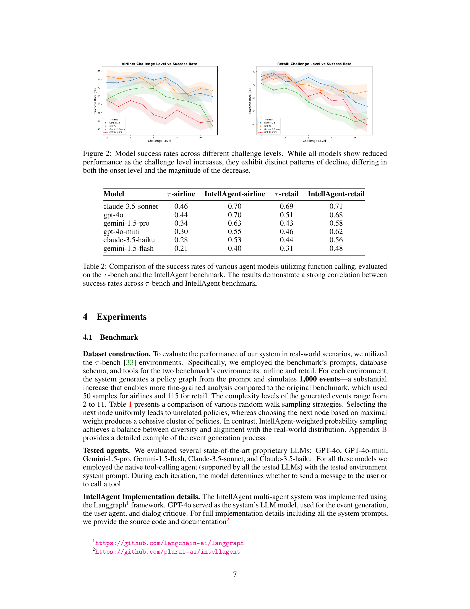

 


 2501.11067 
 Elad Levi et el. 
 
 🤗 2025-01-23 
 



↗ arXiv


↗ Hugging Face


↗ Papers with Code


### TL;DR



기존의 대화형 AI 시스템 평가 방법은 실제 상황의 복잡성과 다양성을 충분히 반영하지 못하고,  정책 준수 및 도구 사용 등의 복잡한 상호 작용을 포착하는 데 어려움이 있었습니다. 이러한 문제를 해결하기 위해 본 논문에서는 IntellAgent라는 새로운 프레임워크를 제시합니다.

IntellAgent는 **정책 기반 그래프 모델링**, **현실적인 이벤트 생성**, **대화형 사용자-에이전트 시뮬레이션**을 통합하여 다양한 합성 벤치마크를 자동 생성합니다.  여러 수준의 복잡성을 가진 시나리오를 시뮬레이션하여 에이전트의 능력과 정책 제약 조건 간의 미묘한 상호 작용을 포착하며, 세분화된 진단을 제공합니다.  오픈소스로 공개되어 새로운 도메인, 정책, API의 통합을 지원하고, 재현성과 공동 연구를 촉진합니다.  실험 결과는 IntellAgent가 대화형 AI 발전에 효과적인 프레임워크임을 보여줍니다.



#### Key Takeaways


 IntellAgent는 대화형 AI 시스템의 종합적인 평가를 위한 확장 가능하고 오픈소스인 다중 에이전트 프레임워크입니다. 



 정책 기반 그래프 모델링, 현실적인 이벤트 생성, 대화형 사용자-에이전트 시뮬레이션을 결합하여 다양한 합성 벤치마크를 자동으로 생성합니다. 



 세분화된 진단을 제공하여 기존의 정적이고 수동으로 관리되는 벤치마크의 한계를 극복하고, 모델 성능에 대한 실행 가능한 통찰력을 제공합니다. 


#### Why does it matter?
본 논문은 **대화형 AI 시스템 평가의 어려움을 해결하기 위해 IntellAgent라는 확장 가능하고 오픈소스인 다중 에이전트 프레임워크를 제시**합니다.  **다양한 합성 벤치마크를 자동으로 생성**하여 실제 환경의 복잡성과 다양성을 포착하고, **세분화된 진단**을 제공하여 **연구와 배포 간의 간격을 메우는 데 기여**합니다.  이를 통해 대화형 AI 시스템의 연구 및 개발에 상당한 영향을 미칠 수 있습니다.

------
#### Visual Insights

> 🔼 그림 1은 IntellAgent 시스템의 작동 방식을 보여주는 다이어그램입니다. 시스템은 챗봇 프롬프트와 스키마 DB를 입력받아 (1) 정책의 하위 집합을 대상으로 하는 이벤트를 생성합니다. 이 이벤트는 사용자 요청과 시스템 DB 상태를 포함합니다. 그런 다음 (2) 각 이벤트에 대해 시스템은 사용자와 챗봇 간의 대화를 시뮬레이션합니다. 마지막으로 (3) 챗봇 성능에 대한 세부적인 보고서가 생성됩니다.
> 

> 
read the caption

> Figure 1: System diagram. (1) Given a chatbot prompt and a Schema DB, the system generates an event that targets a subset of policies, which includes a user request and a system DB state. (2) For each event the system simulates a conversation between the user and the chatbot. (3) A fine-grained report on the chatbot performances is generated.
> 


| Model | τ-airline | IntellAgent-airline | τ-retail | IntellAgent-retail |
|---|---|---|---|---|
| claude-3.5-sonnet | 0.46 | 0.70 | 0.69 | 0.71 |
| gpt-4o | 0.44 | 0.70 | 0.51 | 0.68 |
| gemini-1.5-pro | 0.34 | 0.63 | 0.43 | 0.58 |
| gpt-4o-mini | 0.30 | 0.55 | 0.46 | 0.62 |
| claude-3.5-haiku | 0.28 | 0.53 | 0.44 | 0.56 |
| gemini-1.5-flash | 0.21 | 0.40 | 0.31 | 0.48 |

> 🔼 표 1은 세 가지 다른 랜덤 워크 샘플링 전략을 비교하여 보여줍니다. 왼쪽 열은 다음 노드를 균일하게 샘플링하는 전략을, 가운데 열은 가장 큰 가중치를 가진 가장자리에 있는 노드를 선택하는 전략을, 오른쪽 열은 다양성과 실제 분포와의 정렬을 균형 있게 맞추는 IntellAgent 가중 확률 샘플링 전략을 각각 보여줍니다. 이 표는 각 전략의 결과를 시각적으로 비교하여, 어떤 전략이 더 다양하고 현실적인 결과를 생성하는지 보여줍니다.
> 

> 
read the caption

> Table 1: Comparison of random walk sampling strategies. (Left) Uniform sampling of the next node. (Middle) Selection of the next node based on maximal edge weight. (Right) IntellAgent weighted probability sampling, which balances diversity and alignment with real-world distributions.
> 

### In-depth insights

#### LLM Eval Challenges
LLM 평가의 어려움은 **다양한 측면**에서 나타납니다. 우선, **실제 세계의 복잡성을 반영하는 벤치마크 생성**이 어렵습니다. 기존의 정적이고 수동으로 기획된 벤치마크는 다양한 상황과 정책 제약을 제대로 포착하지 못하며, 실제 대화의 복잡성과 변화를 충분히 반영하지 못합니다.  **정책 준수**, **도구 사용**, **다회차 대화**, **도메인 특이적 API 통합** 등의 요소가 상호 작용하는 복잡성을 평가하기 위해서는 **새로운 평가 프레임워크**가 필요합니다.  **정량적 지표**만으로는 한계가 있으며, **정성적 분석**을 통합하여 보다 종합적인 평가가 필요합니다.  또한, **재현성과 공동 연구**를 위한 **오픈소스 프레임워크**의 필요성이 커지고 있습니다.  마지막으로, 연구와 배포 간의 **갭을 메우는 것**도 중요한 과제입니다. **실제 환경에 배포하기 전에 다양한 상황에서의 성능을 검증**할 수 있는 체계가 필요하며, 이를 위해서는 연구 결과를 실제 시스템에 효율적으로 통합하는 방법론이 중요합니다.

#### IntellAgent Framework
IntellAgent 프레임워크는 **대화형 AI 시스템의 종합적인 평가를 위한 확장 가능한 오픈소스 멀티에이전트 프레임워크**입니다. 기존의 정적이고 수동으로 관리되는 벤치마크의 한계를 극복하고, 정책 기반 그래프 모델링, 현실적인 이벤트 생성, 대화형 사용자-에이전트 시뮬레이션을 결합하여 다양하고 현실적인 시나리오를 자동으로 생성합니다. 이를 통해 **에이전트의 능력과 정책 제약 조건 간의 상호 작용을 세밀하게 분석**하고, **정책 위반 및 대화 흐름 오류와 같은 미묘한 문제점**까지 포착합니다.  **모듈화된 설계**로 새로운 도메인, 정책, API의 통합을 원활하게 지원하며, 재현성과 커뮤니티 협업을 촉진합니다.  **다양한 복잡성 수준과 정책 조합**을 시뮬레이션하여 실제 환경에서의 AI 에이전트 성능을 정확하게 예측하고, **향상된 진단 기능**을 통해 표적화된 최적화를 위한 실행 가능한 통찰력을 제공합니다.  **합성 데이터를 사용**함에도 불구하고, 기존 벤치마크와 강력한 상관관계를 보여주어, **실제 환경과의 높은 일치성**을 입증합니다.

#### Synthetic Data Gen
합성 데이터 생성(Synthetic Data Gen)은 인공지능(AI) 모델, 특히 대화형 AI 시스템의 평가에 있어 **중추적인 역할**을 합니다.  기존의 수동으로 제작된 데이터셋은 규모가 작고 다양성이 부족하여 실제 환경을 제대로 반영하지 못하는 한계가 있습니다.  반면, 합성 데이터 생성은 **대규모의 다양한 데이터**를 자동으로 생성할 수 있어 이러한 한계를 극복합니다.  **정책 기반 그래프 모델링**과 같은 혁신적인 기법을 통해 실제와 유사한 대화 시나리오를 생성하고, 다양한 정책 및 API 조합을 시뮬레이션하여 AI 시스템의 복잡한 상호작용을 포괄적으로 평가할 수 있습니다.  **세분화된 진단**을 제공하여 단순한 성능 측정을 넘어, AI 시스템의 강점과 약점을 정확하게 파악하고 개선 방향을 제시하는 데 기여합니다.  **오픈소스 및 확장성**을 갖춘 합성 데이터 생성 프레임워크는 연구와 개발의 간극을 메우고,  AI 시스템의 지속적인 발전을 위한 협업을 촉진하는 데 중요한 역할을 할 것입니다.  **결론적으로**, 합성 데이터 생성은 대화형 AI 시스템 평가의 패러다임을 전환하는 핵심 요소이며,  실제 환경 적용을 위한 필수적인 기술입니다.

#### Benchmark Analysis
본 논문의 벤치마크 분석 부분은 **기존 벤치마크의 한계점을 명확히 제시**하고, 이를 극복하기 위해 제안된 IntellAgent 프레임워크의 우수성을 보여주는 데 초점을 맞추고 있습니다. **다양한 복잡도 수준의 시나리오를 자동 생성**하여 기존 수동 방식의 한계를 극복하고, **정교한 지표를 통해 에이전트의 강점과 약점을 세밀하게 분석**합니다. 특히, 정책 기반 그래프 모델링을 통해 **정책 간의 상호 작용과 복잡성을 효과적으로 포착**하여 종합적인 평가를 수행합니다. IntellAgent의 벤치마크 결과는 기존 벤치마크와의 상관관계를 분석하여 **신뢰성을 검증**하고, 다양한 정책 범주에 따른 성능 차이를 보여줌으로써 **개선 방향을 제시**합니다. 이러한 분석을 통해 IntellAgent가 **대규모 실험과 상세한 진단을 가능하게 함으로써 실제 환경에서의 컨버세이셔널 AI 시스템의 성능 향상에 기여**할 수 있음을 강조합니다.

#### Future Work
본 논문의 "향후 연구" 부분은 **IntellAgent의 강점인 확장성과 다양성을 더욱 발전시키는 방향**으로 진행될 것으로 예상됩니다.  **실제 사용자-챗봇 상호작용 데이터를 통합**하여 정책 그래프의 가중치 및 노드 난이도를 보다 정확하게 산정하고, **더욱 현실적인 시나리오 생성**을 가능하게 할 수 있습니다.  이는 인공지능 시스템 평가의 정확도와 신뢰성을 높이는 데 크게 기여할 것입니다.  또한, 다양한 도메인과 정책의 통합을 위한 **모듈화된 설계를 개선**하고, **새로운 API 및 데이터베이스 스키마 통합 기능을 확장**하여 IntellAgent의 활용성을 높이는 연구가 수행될 것으로 예상됩니다.  이를 통해 IntellAgent는 **연구와 배포 간의 간극을 해소**하고, 컨버세이셔널 AI 분야의 발전에 더욱 크게 기여할 수 있을 것입니다.  **정책 특정 평가의 세분화**를 통해 모델의 강점과 약점을 더욱 명확하게 파악하고, 개선 방향을 제시하는 연구도 중요한 부분이 될 것입니다.

### More visual insights

More on figures

> 🔼 그림 2는 다양한 난이도 수준에서 모델의 성공률을 보여줍니다. 모든 모델은 난이도 수준이 증가함에 따라 성능이 저하됨을 보여주지만, 성능 저하 패턴은 모델마다 다릅니다. 즉, 성능 저하가 시작되는 시점과 저하 정도가 모델에 따라 다르다는 것을 의미합니다.
> 

> 
read the caption

> Figure 2: Model success rates across different challenge levels. While all models show reduced performance as the challenge level increases, they exhibit distinct patterns of decline, differing in both the onset level and the magnitude of the decrease.
> 

> 🔼 그림 3은 다양한 정책 범주에서 상위 4개 모델의 성공률을 비교하여 어떤 범주가 다른 범주보다 더 어려운지 보여줍니다. 또한, 모델의 상대적 성능 순서는 범주에 따라 다릅니다.  즉, 특정 정책 범주(예: 인증, 에스컬레이션, 지식 추출, 허위 정보, 결제 처리, 정책 시행, 도구 사용, 사용자 동의)에서 모델의 성능이 다른 범주보다 현저히 낮거나 높을 수 있음을 보여줍니다.  각 모델의 강점과 약점을 명확히 보여주는 시각적 자료입니다.
> 

> 
read the caption

> Figure 3: Comparison of the success rates of the top four models across various policy categories, highlighting that some categories are more challenging than others. Additionally, the relative performance order of different models varies across categories.
> 

### Full paper



