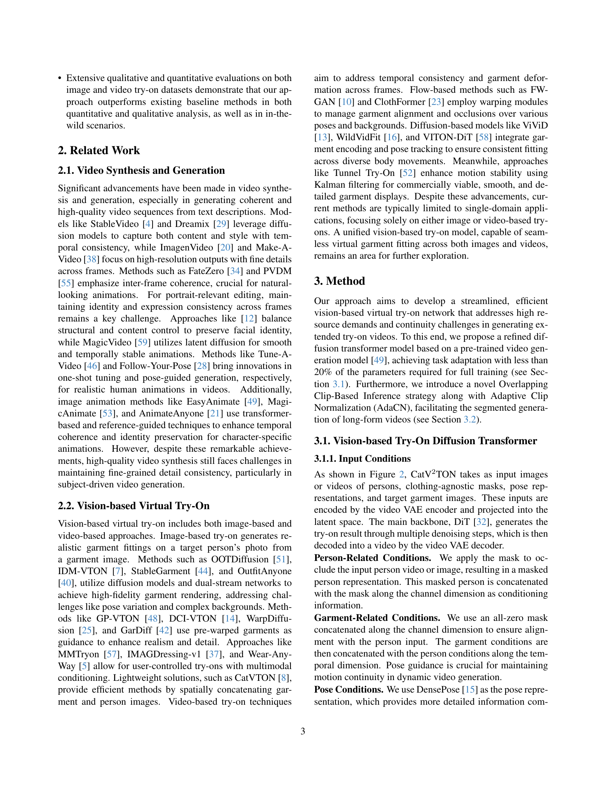

 


 2501.11325 
 Zheng Chong et el. 
 
 🤗 2025-01-27 
 



↗ arXiv


↗ Hugging Face


↗ Papers with Code


### TL;DR



현재 이미지 기반 가상 시착은 정지된 이미지에 국한되고, 비디오 기반 가상 시착은 장시간 비디오 생성의 어려움과 품질 저하 문제를 가지고 있습니다. 또한 기존 데이터셋은 뒷면 정보 부족 및 시간적 불일치 문제를 가지고 있습니다. 

CatV2TON은 이러한 문제를 해결하기 위해 **단일 확산 변환기 모델**을 이용하여 이미지 및 비디오 가상 시착을 통합합니다. **의류와 사람 이미지를 시간적으로 연결**하고 **다양한 데이터셋으로 학습**하여 정지 및 동적 환경 모두에서 강력한 성능을 보입니다.  **중첩 클립 기반 추론 전략**과 **AdaCN(적응형 클립 정규화)**를 통해 장시간 비디오를 효율적으로 생성하고, **인물의 방향을 인식하여 뒷면 프레임을 제거**하고 **3D 마스크 스무딩**을 적용하여 개선된 비디오 시착 데이터셋 ViViD-S를 제작합니다.



#### Key Takeaways


 CatV2TON은 단일 모델로 이미지 및 비디오 가상 시착을 모두 지원합니다. 



 시간적 연결 및 AdaCN을 사용하여 장시간 비디오의 일관성을 유지하며 효율적으로 생성합니다. 



 개선된 비디오 시착 데이터 세트 ViViD-S를 통해 더욱 사실적인 가상 시착 결과를 얻을 수 있습니다. 


#### Why does it matter?
본 논문은 **단일 확산 변환기 모델을 사용하여 이미지 및 비디오 기반 가상 시착 모두를 지원하는 CatV2TON이라는 새로운 방법론**을 제시함으로써 비디오 기반 가상 시착 분야의 연구자들에게 중요합니다. **시간적 연결 및 적응형 클립 정규화**를 통해 장시간 비디오 생성을 위한 효율적인 전략을 제공하고 **개선된 비디오 시착 데이터 세트 ViViD-S**를 소개하여 향후 연구를 위한 새로운 가능성을 제시합니다. 이는 현실적이고 효율적인 가상 시착 경험을 제공하는 데 기여하며, **온라인 소매 및 패션 기술 분야의 발전**에 기여할 수 있습니다.

------
#### Visual Insights

> 🔼 그림 1은 CatV2TON의 통합된 가상 피팅 기능을 보여줍니다. 이미지 기반과 비디오 기반 피팅 작업 모두에서 고품질 의류 일관성을 보여주며, 동적인 긴 비디오 시나리오도 포함합니다.  다양한 의류와 자세에 걸쳐 자연스럽고 현실감 있는 가상 피팅 결과를 확인할 수 있습니다. 이미지 기반 피팅에서는 정지된 이미지에 의류를 입힌 모습을, 비디오 기반 피팅에서는 동작이 있는 비디오에 의류를 입힌 모습을 보여줍니다. 특히 긴 비디오에서의 의류 일관성 유지가 중요한 부분입니다.
> 

> 
read the caption

> Figure 1: Examples of CatV2TON’s unified virtual try-on capabilities, demonstrating high-quality garment consistency across both image-based and video-based try-on tasks, including dynamic long-video scenarios.
> 


| Methods | Paired SSIM ↑ | Paired FID ↓ | Paired KID ↓ | Paired LPIPS ↓ | Unpaired FID ↓ | Unpaired KID ↓ |
|---|---|---|---|---|---|---|
| StableGarment [44] | 0.8029 | 15.567 | 8.519 | 0.1042 | 17.115 | 8.851 |
| MV-VTON [43] | 0.8083 | 15.442 | 7.501 | 0.1171 | 17.900 | 3.861 |
| LaDI-VTON [31] | 0.8603 | 11.386 | 7.248 | 0.0733 | 14.648 | 8.754 |
| DCI-VTON [14] | 0.8620 | 9.408 | 4.547 | 0.0606 | 12.531 | 5.251 |
| OOTDiffusion [51] | 0.8187 | 9.305 | 4.086 | 0.0876 | 12.408 | 4.689 |
| GP-VTON [48] | 0.8701 | 8.726 | 3.944 | 0.0585 | 11.844 | 4.310 |
| StableVTON [24] | 0.8543 | 6.439 | 0.942 | 0.0905 | 11.054 | 3.914 |
| CatV2TON (Ours) | 0.8902 | 8.095 | 2.245 | 0.0570 | 11.222 | 2.986 |

> 🔼 표 1은 VITON-HD 데이터셋을 기반으로 한 기존의 다른 방법들과의 정량적 비교 결과를 보여줍니다.  SSIM, FID, KID, LPIPS 네 가지 지표를 사용하여 이미지 기반 가상 피팅 성능을 평가했습니다.  각 지표에서 최고 성능과 두 번째로 높은 성능을 각각 굵은 글씨와 밑줄로 표시하여, CatV2TON 모델의 성능 우수성을 강조하고 있습니다.  'Paired' 와 'Unpaired' 설정에 대한 결과를 모두 포함하여, 데이터셋의 다양한 조건 하에서 CatV2TON 모델의 견고함을 보여주는 것을 목표로 합니다.
> 

> 
read the caption

> Table 1: Quantitative comparison with other methods on VITON-HD [6] dataset. The best and second-best results are demonstrated in bold and underlined, respectively.
> 

### In-depth insights

#### VTON Diffusion
VTON(가상 피팅) 분야에서 확산 모델(Diffusion Model)의 활용은 **사실적인 의류 시각화**를 가능하게 하여 온라인 쇼핑 경험을 혁신적으로 변화시킬 잠재력을 가지고 있습니다.  기존의 VTON 방법들은 이미지 기반 또는 비디오 기반으로 나뉘어 각각의 한계를 지녔으나, **확산 모델 기반 VTON**은 이미지와 비디오 데이터를 통합하여 단일 모델로 양쪽 모두를 처리할 수 있는 가능성을 제시합니다.  특히, **시간적 연속성**을 유지하는 것은 비디오 기반 VTON에서 중요한 과제인데, 확산 모델의 장점을 활용하여 시간에 따른 일관성 있는 가상 피팅 결과를 생성할 수 있습니다.  하지만, **고해상도의 장기 비디오 생성**은 여전히 계산 비용이 많이 들고, 효율적인 추론 전략이 필요합니다.  **중첩 클립 기반 추론 및 적응적 클립 정규화**와 같은 기술은 이러한 문제를 해결하는 데 도움이 될 수 있지만,  **실제 물리 법칙**을 준수하는 사실적인 움직임 생성은 추가적인 연구가 필요한 부분입니다.  **데이터셋의 질** 또한 중요한데,  실제와 유사한 다양한 자세와 의상을 포함한 고품질의 데이터셋이 모델 성능에 큰 영향을 미칩니다.

#### Temporal Modeling
본 논문에서 제시된 CatV2TON 모델은 **비디오 기반 가상 피팅**에 있어 시간적 일관성을 유지하는 데 중점을 둡니다. 이는 단순히 이미지 프레임들을 나열하는 것이 아니라, **시간적 연관성을 고려한 모델링**을 통해 이전 프레임들의 정보를 활용하여 다음 프레임을 예측하는 방식을 사용하기 때문입니다.  특히, **중첩 클립 기반 추론 전략**과 **적응적 클립 정규화 (AdaCN)** 기법은 장시간 비디오 생성 시 발생할 수 있는 계산 비용 증가 및 시간적 일관성 저하 문제를 효과적으로 해결합니다.  AdaCN은 이전 프레임의 특징을 기반으로 현재 프레임을 조정하여 시간적 일관성을 유지합니다.  또한, **3D 마스크 스무딩** 기법은 프레임 간 일관성 있는 마스크를 제공하여 섬세한 디테일을 유지합니다. 전체적으로 CatV2TON은 시간적 차원을 효과적으로 모델링하여 **고품질의 장시간 가상 피팅 비디오**를 생성하는 데 기여합니다.  이러한 시간적 모델링 전략은  기존의 단순한 프레임 연결 방식에 비해 **더욱 자연스럽고 현실감 있는 비디오 생성**을 가능하게 합니다.

#### Video Try-on
이 논문은 비디오 기반 가상 피팅 기술에 대해 심도 있게 논의합니다. **기존의 이미지 기반 가상 피팅의 한계를 넘어** 동적인 비디오 시퀀스에서도 높은 품질의 의류 피팅 결과를 제공하는 것을 목표로 합니다. 특히, **장기간의 비디오 생성에서의 효율성 및 일관성 유지를 위한 혁신적인 방법**을 제시하고 있습니다. 이는 단순히 프레임을 연결하는 것이 아니라, **시간적 연관성을 유지하는 알고리즘**을 통해 자연스럽고 매끄러운 비디오를 생성하는 데 초점을 맞추고 있습니다. 또한, **실제 비디오 데이터의 한계점을 보완하기 위해 개선된 데이터셋을 활용**함으로써 모델의 성능 향상을 도모합니다. 이러한 노력을 통해, **보다 현실적이고 실용적인 가상 피팅 경험**을 제공하는 데 기여할 것으로 기대됩니다.  **특히, 겹치는 클립 기반 추론 전략과 적응형 클립 정규화 기법은 장기 비디오 생성의 효율성과 일관성을 크게 개선**하는 핵심 요소입니다.

#### Dataset Refinement
본 논문에서 제시된 데이터셋 개선은 단순히 기존 데이터의 양적 확장을 넘어, **질적 향상**에 초점을 맞추고 있습니다. 특히, 비디오 기반 가상 피팅 데이터셋의 경우, 사람의 자세와 옷의 정합성을 높이기 위해 **후면 시야각 영상 제거 및 3D 마스크 스무딩**이라는 두 가지 주요 전략을 사용합니다.  **후면 시야각 영상 제거**는 사람의 방향을 인식하는 모델을 훈련하여, 가상 피팅에 적합하지 않은 후면 영상을 제거함으로써 데이터 품질을 높입니다.  또한, **3D 마스크 스무딩** 기법을 통해 시간적 일관성을 유지하고 프레임 간 불일치를 감소시켜, 보다 자연스럽고 실제와 가까운 가상 피팅 결과를 얻을 수 있도록 데이터를 정제합니다. 이러한 개선을 통해, **더욱 정확하고 일관성 있는 가상 피팅 모델 훈련**이 가능해지고, 최종적으로 더욱 현실감 있는 가상 피팅 결과를 제공하는 데 기여할 것으로 예상됩니다.  **데이터셋의 정제는 단순히 양적인 확장이 아닌, 질적인 개선을 통해 모델의 성능 향상과 현실적인 가상 피팅 경험 제공에 필수적인 요소**임을 잘 보여주는 사례입니다.

#### Ablation Studies
본 논문의 "Ablation Studies" 부분은 **PoseEncoder와 AdaCN의 영향력을 평가**하는 실험 결과를 제시합니다. PoseEncoder를 제거한 모델은 복잡한 포즈 처리에서 성능 저하를 보였고, AdaCN을 사용하지 않은 모델은 장시간 비디오 생성 시 색상 불일치 및 부드러운 전환 부족 등의 문제를 보였습니다. 이는 **PoseEncoder가 포즈 정보를 효과적으로 활용하여 정확도를 높이고, AdaCN이 시간적 일관성을 유지하는 데 중요한 역할**을 한다는 것을 의미합니다.  **결과적으로, PoseEncoder와 AdaCN 모두 모델의 전체적인 성능 향상에 기여**하며, 특히 장시간 비디오 생성의 질적 향상에 큰 영향을 미친다는 것을 알 수 있습니다.  이는 **모델 설계의 효율성과 실용성을 보여주는 중요한 증거**이며, 제안된 방법의 강점을 뒷받침합니다.  **추가적으로, ablation study는 각 구성요소의 중요성을 정량적으로 확인**하여 CatV2TON 모델의 신뢰성을 높입니다.

### More visual insights

More on figures

> 🔼 그림 2는 CatV2TON 아키텍처의 개요를 보여줍니다. CatV2TON은 백본으로 DiT [32]를 사용하며, 첫 번째 DiT 블록은 Pose Encoder로 복제됩니다. 사람과 의류 조건은 시계열적으로 연결되어 시도 조건이 됩니다. 전체 훈련 가능 부분은 자기 주의 계층과 Pose Encoder로 구성되며, 총 매개변수의 1/5 미만을 차지합니다.  이 그림은 CatV2TON의 구조를 자세히 설명하며, DiT 백본, Pose Encoder의 역할, 그리고 사람과 의류 정보가 어떻게 결합되는지 보여줍니다. 특히, 전체 모델에서 훈련 가능한 부분이 전체 매개변수의 극히 일부분만 차지한다는 점을 강조하여 효율성을 나타냅니다.
> 

> 
read the caption

> Figure 2: Overview of the CatV2TON architecture. CatV2TON uses DiT [32] as the backbone, with the first DiT block duplicated as the Pose Encoder. The person and garment conditions are concatenated temporally as try-on conditions. The entire trainable portion consists only of the self-attention layers and Pose Encoder, accounting for less than 1/5 of the total parameters.
> 

> 🔼 그림 3(a)는 CatV2TON의 긴 비디오 시퀀스를 위한 오버랩핑 클립 기반 추론 전략을 보여줍니다. 긴 비디오는 겹치는 여러 클립으로 나뉘고, 각 클립은 반복되는 프레임을 포함합니다. 각 클립에 대한 추론 결과의 마지막 k 프레임은 다음 클립 생성을 위한 프롬프트 프레임으로 사용됩니다. 이 과정은 전체 비디오에 걸쳐 반복됩니다.  이러한 방식을 통해 CatV2TON은 비디오의 일부분을 생성하는 대신 긴 비디오 전체를 효율적으로 생성할 수 있습니다.
> 

> 
read the caption

> (a) Overlapping Clip-based Inference
> 

> 🔼 그림 3(b)는 제안된 어댑티브 클립 정규화(AdaCN) 기법을 보여줍니다.  긴 비디오를 생성할 때, 이전에 생성된 클립의 마지막 프레임들을 다음 클립 생성을 위한 가이드 프레임으로 사용하는데, 이 과정에서 색상 불일치 및 움직임 정렬 문제가 발생할 수 있습니다. AdaCN은 이러한 문제를 해결하기 위해 이전 가이드 프레임들의 평균과 표준편차를 계산하여, 현재 클립의 특징들을 정규화합니다. 이를 통해 클립 간 일관성을 유지하고 부드러운 전환을 가능하게 합니다.
> 

> 
read the caption

> (b) AdaCN
> 

> 🔼 그림 3은 긴 비디오를 처리하기 위한 중첩 클립 기반 추론 전략을 보여줍니다. (a)는 긴 비디오가 중복된 프레임을 가진 n개의 중첩 클립으로 나뉘는 것을 보여줍니다. 각 클립의 마지막 k개의 프레임은 다음 클립 생성을 위한 프롬프트 프레임으로 사용됩니다. (b)는 어댑티브 클립 정규화(AdaCN)를 사용하여 프롬프트 프레임 특징과 잡음 제거된 프롬프트 프레임의 평균과 표준 편차를 기반으로 전체 클립을 정규화하여 생성된 비디오에서 클립 간의 원활한 연속성을 보장하는 것을 보여줍니다.
> 

> 
read the caption

> Figure 3: Illustration of the Overlapping Clip-Based Inference strategy. (a) A long video is divided into n𝑛nitalic_n overlapping clips, with each clip consisting of repeated frames. The last k𝑘kitalic_k frames of each clip are used as prompt frames for generating the next clip. (b) Adaptive Clip Normalization (AdaCN) is applied to normalize the entire clip based on the mean and standard deviation of the prompt frame features and the denoised prompt frames, ensuring smooth continuity across clips in the generated video.
> 

> 🔼 그림 4는 ViViD 데이터셋의 드레스에 대한 정성적 비교 결과를 보여줍니다. StableVITON(Stable로 약칭)과 OOTDiffusion(OOTD로 약칭)의 결과와 비교하여 CatV2TON의 성능을 보여줍니다.  각 방법은 드레스 이미지와 마스크, 그리고 생성된 드레스를 입은 사람 이미지를 보여주며, CatV2TON이 더 자연스럽고 현실적인 결과를 생성했음을 보여줍니다. 보다 자세한 비교 결과는 보충 자료에서 확인할 수 있습니다. 그림을 확대하여 자세히 보시기 바랍니다.
> 

> 
read the caption

> Figure 4: Qualitative comparison on the ViViD [13] dataset for dresses. We use Stable and OOTD as the short for StableVITON [24] and OOTDiffusion [51]. Additional comparison results are provided in the supplementary materials. Please zoom in for more details.
> 

> 🔼 그림 5는 ViViD 데이터셋의 하의 가상 피팅 결과를 보여줍니다. StableVITON과 OOTDiffusion 방법과 비교하여 CatV2TON의 성능을 정성적으로 평가합니다. 그림에는 각 방법의 가상 피팅 결과가 제시되어 있으며, 보다 자세한 비교 결과는 보충 자료에서 확인할 수 있습니다. 그림을 확대하여 자세히 살펴보는 것이 좋습니다.
> 

> 
read the caption

> Figure 5: Qualitative comparison on the ViViD [13] dataset for lower. We use Stable and OOTD as the short for StableVITON [24] and OOTDiffusion [51]. Additional comparison results are provided in the supplementary materials. Please zoom in for more details.
> 

> 🔼 그림 6은 ViViD 데이터셋의 상의(upper)에 대한 다양한 가상 피팅 결과를 비교한 것입니다. StableVITON (Stable로 약칭)과 OOTDiffusion (OOTD로 약칭)을 포함한 다른 방법들과 CatV2TON의 결과를 보여줍니다. 그림을 확대하면 더 자세한 내용을 확인할 수 있으며, 보충 자료에는 추가 비교 결과가 포함되어 있습니다.  각 방법의 상의 가상 피팅 품질을 시각적으로 비교하여 CatV2TON의 성능을 보여줍니다.
> 

> 
read the caption

> Figure 6: Qualitative comparison on the ViViD [13] dataset for upper. We use Stable and OOTD as the short for StableVITON [24] and OOTDiffusion [51]. Additional comparison results are provided in the supplementary materials. Please zoom in for more details.
> 

More on tables


| Methods | Paired SSIM ↑ | Paired FID ↓ | Paired KID ↓ | Paired LPIPS ↓ | Unpaired FID ↓ | Unpaired KID ↓ |
|---|---|---|---|---|---|---|
| GP-VTON [48] | 0.7711 | 9.927 | 4.610 | 0.1801 | 12.791 | 6.627 |
| LaDI-VTON [31] | 0.7656 | 9.555 | 4.683 | 0.2366 | 10.676 | 5.787 |
| IDM-VTON [7] | 0.8797 | 6.821 | 2.924 | 0.0563 | 9.546 | 4.320 |
| OOTDiffusion [51] | 0.8854 | 4.610 | 0.955 | 0.0533 | 12.567 | 6.627 |
| CatV2TON (Ours) | 0.9222 | 5.722 | 2.338 | 0.0367 | 8.627 | 3.838 |
> 🔼 표 2는 DressCode 데이터셋에서 다른 방법들과의 정량적 비교 결과를 보여줍니다.  이 표는 다양한 평가 지표(SSIM, FID, KID, LPIPS)를 사용하여 이미지 기반 가상 피팅 성능을 정확하게 측정합니다.  각 지표는 이미지의 유사성과 품질을 다양한 측면에서 평가하며, 가장 높은 점수를 기록한 결과는 굵은 글씨체로 강조 표시되어 모델의 성능을 명확하게 비교할 수 있도록 합니다.  'Paired' 와 'Unpaired' 섹션은 각각 짝지어진 데이터셋과 짝지어지지 않은 데이터셋을 사용한 실험 결과를 구분하여 보여줍니다.
> 

> 
read the caption

> Table 2: Quantitative comparison with other methods on DressCode [30] dataset. The best and second-best results are demonstrated in bold and underlined, respectively.
> 


| Methods | Paired VFIDI ↓ | Paired VFIDR ↓ | Paired SSIM ↑ | Paired LPIPS ↓ | Unpaired VFIDI ↓ | Unpaired VFIDR ↓ |
|---|---|---|---|---|---|---|
| FW-GAN [11] | 8.019 | 0.1215 | 0.675 | 0.283 | - | - |
| MV-TON [7] | 8.367 | 0.0972 | 0.853 | 0.233 | - | - |
| ClothFormer [23] | 3.967 | 0.0505 | **0.921** | **0.081** | - | - |
| WildVidFit [16] | 4.202 | - | - | - | - | - |
| ViViD [13] | **3.793** | **0.0348** | 0.822 | 0.107 | **3.994** | **0.0416** |
| CatV2TON (Ours) | **1.778** | **0.0103** | 0.900 | **0.0385** | **1.902** | **0.0141** |
> 🔼 표 3은 VVT 데이터셋(11)을 사용한 다른 방법들과의 정량적 비교 결과를 보여줍니다.  이 표는 다양한 비디오 기반 가상 피팅 방법들의 성능을 평가하기 위해 SSIM, LPIPS, VFID1, VFIDR 등의 지표를 사용하여 이미지 및 비디오 품질을 정량적으로 측정합니다. 'Paired' 열은 쌍으로 이루어진 데이터셋에 대한 결과를, 'Unpaired' 열은 쌍으로 이루어지지 않은 데이터셋에 대한 결과를 보여줍니다.  각 지표의 값이 높을수록(SSIM) 또는 낮을수록(나머지) 성능이 우수함을 나타냅니다.  가장 좋은 결과와 두 번째로 좋은 결과는 각 지표별로 굵은 글씨와 밑줄로 표시되어 있습니다. 이를 통해 CatV2TON 모델이 다른 방법들에 비해 VVT 데이터셋에서 얼마나 우수한 성능을 보이는지 명확하게 비교할 수 있습니다.
> 

> 
read the caption

> Table 3: Quantitative comparison with other methods on VVT [11] dataset. The best and second-best results are demonstrated in bold and underlined, respectively.
> 


| Methods | Paired VFIDI ↓ | Paired VFIDR ↓ | Paired SSIM ↑ | Paired LPIPS ↓ | Unpaired VFIDI ↓ | Unpaired VFIDR ↓ |
|---|---|---|---|---|---|---|
| StableVITON [24] | 34.2446 | 0.7735 | 0.8019 | 0.1338 | 36.8985 | 0.9064 |
| OOTDiffusion [51] | 29.5253 | 3.9372 | 0.8087 | 0.1232 | 35.3170 | 5.7078 |
| IDM-VTON [7] | 20.0812 | 0.3674 | 0.8227 | 0.1163 | 25.4972 | 0.7167 |
| StableVITON+AM | 19.9239 | 0.7586 | 0.8207 | 0.1291 | 22.0262 | 0.8283 |
| OOTDiffusion+AM | 19.3173 | 0.9382 | 0.8154 | 0.1244 | 23.3938 | 1.1485 |
| IDM-VTON+AM | 18.2048 | 0.4481 | 0.8252 | 0.1212 | 22.5881 | 0.5397 |
| ViViD [13] | 17.2924 | 0.6209 | 0.8029 | 0.1221 | 21.8032 | 0.8212 |
| CatV2TON (Ours) | 13.5962 | 0.2963 | 0.8727 | 0.0639 | 19.5131 | 0.5283 |
> 🔼 표 4는 ViViD 데이터셋을 기반으로 다른 방법들과의 정량적 비교 결과를 보여줍니다.  이 표는 다양한 비디오 기반 가상 피팅 방법들의 성능을 평가하기 위해, 여러 지표 (VFID₁, VFIDR, SSIM, LPIPS) 를 사용하여 정확도와 시각적 품질을 측정했습니다.  각 지표의 결과 값은 쌍을 이루는(Paired) 실험과 쌍을 이루지 않는(Unpaired) 실험 두 가지 상황 모두에 대해 제시됩니다.  가장 높은 값과 두 번째로 높은 값은 각각 굵은체와 밑줄로 표시되어, 어떤 방법이 주어진 지표에서 가장 우수한 성능을 보였는지 명확하게 알 수 있도록 했습니다.  이를 통해, CatV2TON을 포함한 각 알고리즘의 강점과 약점을 정량적으로 비교 분석할 수 있습니다.
> 

> 
read the caption

> Table 4: Quantitative comparison with other methods on ViViD dataset. The best and second-best results are demonstrated in bold and underlined, respectively.
> 


| Variations | VFIDI ↓ | VFIDR ↓ | SSIM ↑ | LPIPS ↓ |  | VFIDI ↓ | VFIDR ↓ |
|---|---|---|---|---|---|---|---| 
| w/o Pose | 4.6398 | 0.0562 | 0.8280 | 0.0990 |  | 4.9894 | 0.0598 |
| w/o AdaCN | 4.5125 | 0.0438 | 0.8507 | 0.0842 |  | 4.4474 | 0.0522 |
| CatV2TON | 4.3657 | 0.0491 | 0.8461 | 0.0983 |  | 4.4324 | 0.0506 |
> 🔼 표 5는 AdaCN과 PoseEncoder의 효과를 비교 분석한 실험 결과를 보여줍니다.  PoseEncoder 없이 모델을 학습시킨 결과와 AdaCN을 사용하지 않고 비디오를 생성한 결과를 CatV2TON 모델의 결과와 비교하여 정량적으로 평가했습니다.  VFID₁, VFIDR↓, SSIM↑, LPIPS↓ 지표를 사용하여 비디오 생성 품질을 다양한 측면에서 비교 분석했습니다. 표에서 볼 수 있듯이, PoseEncoder와 AdaCN 모두 모델 성능 향상에 기여하며, 특히 AdaCN은 비디오의 일관성과 부드러움을 향상시키는 데 중요한 역할을 합니다.  두 지표 모두에서 가장 좋은 결과는 CatV2TON 모델로 나타났습니다.  'best'와 'second-best' 결과는 각각 굵은 글씨체와 밑줄로 표시되어 있습니다.
> 

> 
read the caption

> Table 5: Ablation results of AdaCN, PoseEncoder. The best and second-best results are demonstrated in bold and underlined, respectively.
> 

### Full paper



