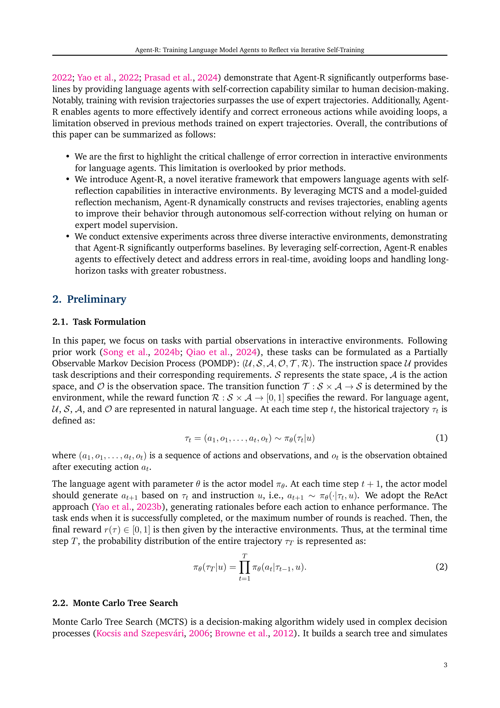
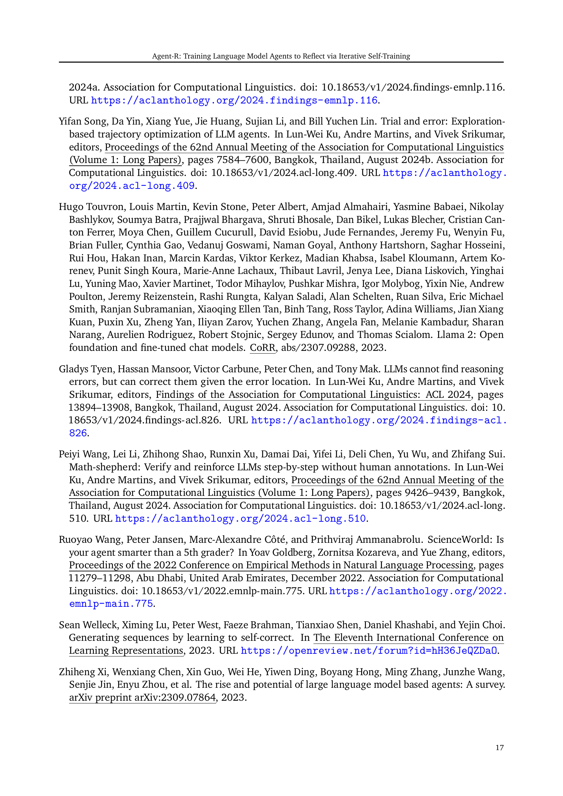
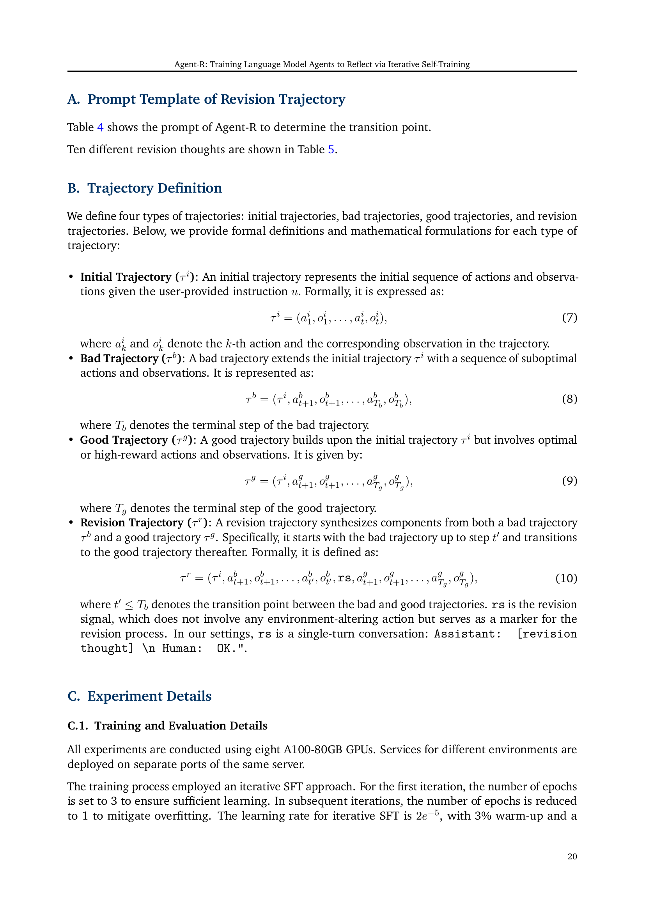

 


 2501.11425 
 Siyu Yuan et el. 
 
 🤗 2025-01-22 
 



↗ arXiv


↗ Hugging Face


↗ Papers with Code


### TL;DR



대규모 언어 모ë¸(LLM) 기반 ì—ì´ì „트는 ìƒí˜¸ ì‘ìš© 환경ì—ì„œ ë³µì¡í•œ ì‘ì—…ì„ ìˆ˜í–‰í•˜ëŠ” ë° ì ì  중요해지고 ìˆìŠµë‹ˆë‹¤. 하지만 ê¸°ì¡´ì˜ í–‰ë™ ë³µì œ ë°©ì‹ì€ 실제 환경ì—ì„œ 오류 복구가 어려워 ì„±ëŠ¥ì´ ì €í•˜ë  ìˆ˜ ìˆìŠµë‹ˆë‹¤.  특íˆ, 단계별 ë¹„í‰ ë°ì´í„° ìˆ˜ì§‘ì˜ ì–´ë ¤ì›€ì€ ì´ëŸ¬í•œ 문제를 ë”ìš± 악화시키고 ìˆìŠµë‹ˆë‹¤. 

Agent-Rì€ ì´ëŸ¬í•œ 문제를 해결하기 위해 반복ì ì¸ ì기 학습 프레ì„워í¬ë¥¼ 제안합니다. ì´ëŠ” ë‹¨ìˆœíˆ ì •í™•ì„±ì— ë”°ë¼ í–‰ë™ì„ ë³´ìƒí•˜ê±°ë‚˜ 처벌하는 기존 ë°©ì‹ê³¼ 달리, MCTS를 사용하여 오류를 수정하는 훈련 ìƒ˜í”Œì„ ìƒì„±í•©ë‹ˆë‹¤.  **ì—ì´ì „트는 오류 ë°œìƒ ì‹œì ì— 바로 ìˆ˜ì •ì„ ì‹œë„**,  효율ì ì¸ í•™ìŠµì„ ê°€ëŠ¥í•˜ê²Œ 합니다. 세 가지 대표ì ì¸ ìƒí˜¸ ì‘ìš© 환경ì—ì„œì˜ ì‹¤í—˜ ê²°ê³¼, **Agent-Rì€ ê¸°ì¡´ 방법보다 ì„±ëŠ¥ì´ 5.59% í–¥ìƒ**ë˜ëŠ” ê²ƒì„ í™•ì¸í–ˆìŠµë‹ˆë‹¤.  **ì—ì´ì „트가 오류를 효과ì ìœ¼ë¡œ ì‹ë³„하고 수정하면서 루프를 방지**하는 ê²ƒì„ ë³´ì—¬ì£¼ëŠ” ê²°ê³¼ì…니다.



#### Key Takeaways


 Agent-Rì€ MCTS를 활용하여 ì—ì´ì „íŠ¸ì˜ ì‹¤ì‹œê°„ ì기 반성 ë° ì˜¤ë¥˜ 수정 ê¸°ëŠ¥ì„ í–¥ìƒì‹œí‚¨ë‹¤. 



 Agent-Rì€ ë°˜ë³µì ì¸ ì기 í•™ìŠµì„ í†µí•´ ì—ì´ì „íŠ¸ì˜ ì˜¤ë¥˜ 수정 능력과 ë°ì´í„°ì…‹ ìƒì„± ëŠ¥ë ¥ì„ ì§€ì†ì ìœ¼ë¡œ í–¥ìƒì‹œí‚¨ë‹¤. 



 Agent-Rì€ ë‹¤ì–‘í•œ ìƒí˜¸ ì‘ìš© 환경ì—ì„œ 기존 방법보다 우수한 ì„±ëŠ¥ì„ ë³´ì´ë©°, ì—ì´ì „íŠ¸ì˜ ì§€ëŠ¥ê³¼ ììœ¨ì„±ì„ í–¥ìƒì‹œí‚¨ë‹¤. 


#### Why does it matter?
본 ë…¼ë¬¸ì€ **ìƒí˜¸ì‘ìš© 환경ì—ì„œ 언어 ëª¨ë¸ ì—ì´ì „íŠ¸ì˜ ì˜¤ë¥˜ 수정 능력 í–¥ìƒ**ì´ë¼ëŠ” 중요한 문제를 해결하는 ë° ê¸°ì—¬í•©ë‹ˆë‹¤. ê¸°ì¡´ì˜ ì ‘ê·¼ ë°©ì‹ì˜ 한계를 극복하고, **새로운 ì기 개선 패러다ì„**ì„ ì œì‹œí•˜ì—¬ ì—ì´ì „íŠ¸ì˜ **실시간 ì기 반성 ë° ì˜¤ë¥˜ 수정 능력**ì„ í–¥ìƒì‹œí‚¤ëŠ” ë°©ë²•ì„ ì œì‹œí•©ë‹ˆë‹¤. ì´ëŠ” **ì율ì ì´ê³  지능ì ì¸ ì—ì´ì „트 개발**ì— ì¤‘ìš”í•œ 함ì˜ë¥¼ 가지며, 관련 연구 ë¶„ì•¼ì˜ ë°œì „ì— í° ì˜í–¥ì„ 미칠 것으로 예ìƒë©ë‹ˆë‹¤.

------
#### Visual Insights

> 🔼 그림 1ì€ ì—ì´ì „트가 ìƒì„±í•˜ëŠ” 과정ì—ì„œ 오류 ìˆ˜ì •ì— ì–´ë ¤ì›€ì„ ê²ªëŠ” 언어 ì—ì´ì „트를 ë³´ì—¬ì¤ë‹ˆë‹¤. ì´ëŸ¬í•œ 오류는 ì—ì´ì „트가 반복ì ì¸ ë™ì‘ì„ í•˜ê²Œ 만들어 ì¥ê¸°ì ì¸ 경로 복구를 방해하고 최ì ì´ ì•„ë‹Œ 결과를 ì´ˆë˜í•  수 ìˆìŠµë‹ˆë‹¤. Agent-Rì€ ì—ì´ì „트가 실시간으로 오류를 효과ì ìœ¼ë¡œ ê°ì§€í•˜ê³  해결하여 ì¥ê¸°ì ì¸ ì‘ì—…ì„ ì²˜ë¦¬í•˜ê³  반복ì ì¸ ë™ì‘ì„ í”¼í•˜ë©´ì„œ í–¥ìƒëœ ì기 반성 ëŠ¥ë ¥ì„ ê°–ë„ë¡ í•©ë‹ˆë‹¤.
> 

> 
read the caption

> Figure 1: Illustration of language agents struggling with error correction in trajectory generation. These errors can cause agents to enter loops, hindering recovery in long trajectories and resulting in suboptimal outcomes. Agent-R enables agents to effectively detect and address errors in real-time, handling long-horizon tasks and avoiding loops with greater self-reflection capabilities.
> 


| Dataset | Simulation # | MCTS w/ Iter 1 Revision | MCTS w/ Iter 1 Good | MCTS w/ Iter 2 Revision | MCTS w/ Iter 2 Good | MCTS w/ Iter 3 Revision | MCTS w/ Iter 3 Good | Test Size |
|---|---|---|---|---|---|---|---|---|
| WebShop | 300 | 5500 | 600 | 8500 | 1800 | 9000 | 2000 | 200 |
| SciWorld | 200 | 8000 | 2500 | 4200 | 1800 | 5400 | 1200 | 200 |
| TextCraft | 200 | 6000 | 2000 | 7000 | 3200 | 8000 | 4000 | 100 |

> 🔼 í‘œ 1ì€ ì„¸ 가지 ì—ì´ì „트 ìƒí˜¸ì‘ìš© í™˜ê²½ì˜ í†µê³„ë¥¼ ë³´ì—¬ì¤ë‹ˆë‹¤.  ë°ì´í„°ì…‹, 시뮬레ì´ì…˜ 수, MCTS를 사용한 반복 횟수, 수정 ë°ì´í„°ì™€ 정답 ë°ì´í„° 수, 테스트 ë°ì´í„° í¬ê¸° ë“±ì˜ ì •ë³´ë¥¼ í¬í•¨í•˜ê³  ìˆìŠµë‹ˆë‹¤.  ì„ íƒ ê¸°ì¤€ì— ë”°ë¼ MCTS는 학습 단계ì—ì„œ 서로 다른 ìˆ˜ì˜ ìˆ˜ì • ë°ì´í„°ì™€ 정답 ë°ì´í„°ë¥¼ 수집할 수 ìˆìŠµë‹ˆë‹¤.  즉, ê° í™˜ê²½ì— ë”°ë¼ ë‹¤ì–‘í•œ íšŸìˆ˜ì˜ ìˆ˜ì • ë°ì´í„°ì™€ 성공ì ì¸ ì‹œë„ ë°ì´í„°ë¥¼ 통해 ì—ì´ì „트 í•™ìŠµì´ ì§„í–‰ë¨ì„ ì˜ë¯¸í•©ë‹ˆë‹¤.
> 

> 
read the caption

> Table 1: Statistics of three agent interactive environments. Due to different selection thresholds, MCTS can collect different numbers of revision data and good data for the training phase.
> 

### In-depth insights

#### Agent-R Framework
Agent-R 프레ì„워í¬ëŠ” 대화형 환경ì—ì„œ 언어 ëª¨ë¸ ì—ì´ì „íŠ¸ì˜ **ì기 ë°˜ì„±ì  ì˜¤ë¥˜ 수정 능력**ì„ í–¥ìƒì‹œí‚¤ëŠ” í˜ì‹ ì ì¸ 방법ì…니다. **MCTS(Monte Carlo Tree Search)**를 활용하여 ì—ì´ì „트가 ìì‹ ì˜ í–‰ë™ì— 대한 **즉ê°ì ì¸ 피드백**ì„ ìƒì„±í•˜ê³ , ì˜ëª»ëœ 경로를 수정하는 **수정 경로**를 ë™ì ìœ¼ë¡œ ìƒì„±í•©ë‹ˆë‹¤. ì´ëŠ” ê¸°ì¡´ì˜ ì „ì ìœ¼ë¡œ ì •ë‹µë§Œì„ í•™ìŠµí•˜ëŠ” ë°©ì‹ê³¼ 달리, **실시간 오류 ê°ì§€ ë° ìˆ˜ì •**ì— ì¤‘ì ì„ ë‘ì–´ 보다 강건하고 효율ì ì¸ í•™ìŠµì„ ê°€ëŠ¥í•˜ê²Œ 합니다.  **반복ì ì¸ ì기 학습**ì„ í†µí•´ ì—ì´ì „트는 오류 수정 능력과 ë°ì´í„° ìƒì„± ëŠ¥ë ¥ì„ í–¥ìƒì‹œí‚¤ë©°, ì¥ê¸°ì ì¸ 대화ì—ì„œë„ **ë£¨í”„ì— ë¹ ì§€ì§€ ì•Šê³  최ì ì˜ 경로**를 찾아나갈 수 ìˆìŠµë‹ˆë‹¤.  **ëª¨ë¸ ê¸°ë°˜ì˜ ìˆ˜ì • 메커니즘**ì€ ì—ì´ì „트가 ìì‹ ì˜ í˜„ì¬ ëŠ¥ë ¥ ë‚´ì—ì„œ 오류를 ì‹ë³„하고, 효율ì ì¸ ìˆ˜ì •ì„ ê°€ëŠ¥í•˜ê²Œ 하여 학습 íš¨ìœ¨ì„±ì„ ë†’ì…니다.  Agent-Rì€ ë‹¤ì–‘í•œ 대화형 환경ì—ì„œ 우수한 ì„±ëŠ¥ì„ ë³´ì´ë©°, **ì—ì´ì „íŠ¸ì˜ ì기 반성 능력**ì„ ê³ ë„화하는 중요한 발걸ìŒì…니다.

#### Iterative Self-Training
ë°˜ë³µì  ì기 í•™ìŠµì€ **ì—ì´ì „트가 ìŠ¤ìŠ¤ë¡œì˜ ì‹¤ìˆ˜ë¥¼ ì¸ì§€í•˜ê³  수정하는 ëŠ¥ë ¥ì„ í–¥ìƒì‹œí‚¤ëŠ” 핵심 ì „ëµ**ì…니다. ì´ë¥¼ 통해 모ë¸ì€ ê³¼ê±°ì˜ ì˜ëª»ëœ í–‰ë™ì„ 바탕으로 ë” ë‚˜ì€ ê²°ì •ì„ ë‚´ë¦¬ê³ , ì¥ê¸°ì ì¸ ìƒí˜¸ ì‘ìš© 환경ì—ì„œ 반복ë˜ëŠ” 오류를 피할 수 ìˆìŠµë‹ˆë‹¤. **몬테 카를로 트리 íƒìƒ‰(MCTS)ê³¼ ê°™ì€ ì•Œê³ ë¦¬ì¦˜**ì€ ì—ì´ì „트가 다양한 경로를 íƒìƒ‰í•˜ê³  최ì ì˜ 경로를 찾는 ë° ë„ì›€ì´ ë˜ì–´, **ì기 ë°˜ì„±ì„ ìœ„í•œ ê³ í’ˆì§ˆì˜ í•™ìŠµ ë°ì´í„° ìƒì„±**ì„ ê°€ëŠ¥í•˜ê²Œ 합니다. ì´ ê³¼ì •ì—ì„œ **모ë¸ì˜ ì기 수정 능력과 ë°ì´í„° ìƒì„± ëŠ¥ë ¥ì„ ë™ì‹œì— í–¥ìƒì‹œí‚¤ëŠ” ë°˜ë³µì  ê°œì„ **ì€ ì„±ëŠ¥ í–¥ìƒì— 중요한 ì—­í• ì„ í•©ë‹ˆë‹¤.  **실시간 오류 ìˆ˜ì •ì„ ê°€ëŠ¥í•˜ê²Œ 하는 ì ì‹œ 수정**ì€ ì—°ì‡„ì ì¸ 실패를 막고 최ì ì˜ ì„±ëŠ¥ì„ ë‹¬ì„±í•˜ëŠ” ë° í•„ìˆ˜ì ì…니다.  **다양한 대화형 환경ì—ì„œì˜ ê´‘ë²”ìœ„í•œ 실험**ì€ ì´ ì ‘ê·¼ ë°©ì‹ì˜ 효과를 ì…ì¦í•˜ê³  기존 방법보다 ë›°ì–´ë‚œ ì„±ëŠ¥ì„ ë³´ì—¬ì¤ë‹ˆë‹¤.

#### MCTS-Guided Reflection
**MCTS 기반 반성 ê¸°ë²•ì€ ì—ì´ì „트가 ìƒí˜¸ì‘ìš© 환경 ë‚´ì—ì„œ ìì‹ ì˜ í–‰ë™ì„ 반추하고 수정하는 ê³¼ì •ì„ íš¨ìœ¨ì ìœ¼ë¡œ 안내하는 핵심 요소ì…니다.**  **몬테 카를로 트리 íƒìƒ‰(MCTS) ì•Œê³ ë¦¬ì¦˜ì„ í™œìš©í•˜ì—¬ ì—ì´ì „트는 다양한 í–‰ë™ ê²½ë¡œë¥¼ íƒìƒ‰í•˜ê³ , ê·¸ 중ì—ì„œ 최ì ì˜ 경로를 ì„ íƒí•  수 ìˆìŠµë‹ˆë‹¤.** ì´ ê³¼ì •ì—ì„œ ì—ì´ì „트는 **ì˜ëª»ëœ 경로를 ì‹ë³„하고, ì´ë¥¼ 수정하는 ë°©ë²•ì„ í•™ìŠµí•˜ê²Œ ë©ë‹ˆë‹¤.** ì´ë¥¼ 통해 ì—ì´ì „트는 ì¥ê¸°ì ì¸ ìƒí˜¸ì‘ìš©ì—ì„œ ë°œìƒí•  수 ìˆëŠ” **ëˆ„ì  ì˜¤ë¥˜ë¥¼ 방지하고, 보다 효율ì ì´ê³  성공ì ì¸ 결과를 달성할 수 ìˆìŠµë‹ˆë‹¤.** MCTS 기반 ë°˜ì„±ì€ ë‹¨ìˆœíˆ ì„±ê³µ/실패 ì—¬ë¶€ë§Œì„ í‰ê°€í•˜ëŠ” ê¸°ì¡´ì˜ ê°•í™” 학습 ë°©ì‹ê³¼ 달리, ì—ì´ì „íŠ¸ì˜ **ê° í–‰ë™ ë‹¨ê³„ì— ëŒ€í•œ ë°˜ì„±ì„ ê°€ëŠ¥í•˜ê²Œ 함으로ì¨, 보다 ì •êµí•˜ê³  지능ì ì¸ í•™ìŠµì„ ê°€ëŠ¥í•˜ê²Œ 합니다.**  **실시간으로 오류 ìˆ˜ì •ì„ ê°€ëŠ¥í•˜ê²Œ 함으로ì¨, ì—ì´ì „트는 ì¥ê¸°ì ì¸ ìƒí˜¸ì‘ìš©ì—ë„ íš¨ê³¼ì ìœ¼ë¡œ ì ì‘하고, 최ì ì˜ 성과를 달성할 수 ìˆë‹¤ëŠ” ì ì´ 중요합니다.**  ì „ì²´ì ìœ¼ë¡œ, MCTS 기반 ë°˜ì„±ì€ ì—ì´ì „íŠ¸ì˜ ì기 개선 ëŠ¥ë ¥ì„ í–¥ìƒì‹œí‚¤ê³ , ë³µì¡í•œ ìƒí˜¸ì‘ìš© 환경ì—ì„œì˜ ë¬¸ì œ í•´ê²° ëŠ¥ë ¥ì„ ê°•í™”í•˜ëŠ” ë° í¬ê²Œ 기여할 것으로 예ìƒë©ë‹ˆë‹¤. 특íˆ, **실시간 오류 수정 ë° ì¥ê¸°ì ì¸ ìƒí˜¸ì‘ìš© ì ì‘ 능력 í–¥ìƒ**ì´ë¼ëŠ” 측면ì—ì„œ 중요한 ì˜ë¯¸ë¥¼ 지닌다고 í•  수 ìˆìŠµë‹ˆë‹¤.

#### Multi-task Learning
본 논문ì—ì„œ 다루는 다중 ì‘ì—… 학습(Multi-task Learning)ì€ **여러 ì‘ì—…ì„ ë™ì‹œì— 학습하여 모ë¸ì˜ ì¼ë°˜í™” ì„±ëŠ¥ì„ í–¥ìƒì‹œí‚¤ëŠ” 기법**ì…니다.  특íˆ, ìƒí˜¸ì‘ìš©ì  í™˜ê²½ì—ì„œ ì—ì´ì „íŠ¸ì˜ ì기 반성 능력 í–¥ìƒì— ì´ˆì ì„ ë§ì¶˜ 본 연구는 다중 ì‘ì—… í•™ìŠµì„ í†µí•´ ì—ì´ì „트가 **다양한 환경ì—ì„œ ë°œìƒí•˜ëŠ” 오류를 효율ì ìœ¼ë¡œ 수정하고, 반복ì ì¸ 실수를 피하며, ì¥ê¸°ì ì¸ ìƒí˜¸ì‘ìš© 과제를 성공ì ìœ¼ë¡œ 수행**í•  수 ìˆë„ë¡ ì§€ì›í•©ë‹ˆë‹¤.  **개별 ì‘ì—…ì— ëŒ€í•œ ì „ë¬¸ì„±ì„ í–¥ìƒì‹œí‚¤ëŠ” ë™ì‹œì— 다양한 ì‘ì—… ê°„ì˜ ì§€ì‹ ì „ì´ë¥¼ 가능하게 하여** 모ë¸ì˜ 견고성과 ì ì‘ë ¥ì„ ë†’ì´ëŠ” 효과를 기대할 수 ìˆìŠµë‹ˆë‹¤.  **모ë¸ì´ 여러 ì‘ì—…ì—ì„œ 축ì í•œ 경험과 지ì‹ì„ ê³µìœ í•¨ìœ¼ë¡œì¨ ê°œë³„ ì‘ì—…ì— ëŒ€í•œ 학습 íš¨ìœ¨ì„ ë†’ì´ê³ , 새로운 ì‘ì—…ì— ëŒ€í•œ ì ì‘ë ¥ì„ í–¥ìƒ**시킬 수 ìˆë‹¤ëŠ” ì ì´ 핵심ì…니다. 다만, **다중 ì‘ì—… í•™ìŠµì˜ ì„±ëŠ¥ì€ ì‘ì—… ê°„ì˜ ìƒê´€ê´€ê³„ì— í¬ê²Œ 좌우ë˜ë¯€ë¡œ**,  ì‘ì—… ì„ ì • ë° ì„¤ê³„ì— ëŒ€í•œ 신중한 고려가 필요합니다.  ë˜í•œ, **ê³¼ë„í•œ ì‘ì—…ì˜ ì¶”ê°€ëŠ” 오íˆë ¤ 성능 저하를 야기할 수 ìˆìœ¼ë¯€ë¡œ** ì ì ˆí•œ ì‘ì—… 수를 ì„ íƒí•˜ëŠ” ê²ƒì´ ì¤‘ìš”í•©ë‹ˆë‹¤.

#### Error Correction
본 논문ì—ì„œ ì œì‹œëœ ì—러 수정 ê¸°ë²•ì€ **LLM 기반 ì—ì´ì „íŠ¸ì˜ ìê°€ 수정 ëŠ¥ë ¥ì„ í–¥ìƒ**시키는 ë° ì´ˆì ì„ ë§ì¶”ê³  ìˆìŠµë‹ˆë‹¤. ê¸°ì¡´ì˜ ê°•í™” 학습 ë°©ì‹ê³¼ 달리, ì—ì´ì „트는 ë‹¨ìˆœíˆ ë³´ìƒì´ë‚˜ ì²˜ë²Œì„ í†µí•´ 학습하는 ê²ƒì´ ì•„ë‹ˆë¼, **실패한 ì‹œë„ì—서부터 올바른 경로를 스스로 찾아가는 과정**ì„ ê±°ì¹©ë‹ˆë‹¤. ì´ëŠ” MCTS(Monte Carlo Tree Search) ê¸°ë°˜ì˜ ëª¨ë¸ ê°€ì´ë“œí˜• ì—러 수정 경로 ìƒì„± ë©”ì»¤ë‹ˆì¦˜ì„ í†µí•´ 구현ë©ë‹ˆë‹¤. ì—ì´ì „트는 실패한 ì‹œë„ì˜ ì²« 번째 ì—러 지ì ì„ 파악하고, ì´ ì§€ì ë¶€í„°ëŠ” 성공 경로를 ë”°ë¼ê°€ë„ë¡ í•™ìŠµí•©ë‹ˆë‹¤.  **실시간 ì—러 수정**ì´ ê°€ëŠ¥í•˜ë„ë¡ ì„¤ê³„ë˜ì–´ ìˆì–´, ì—°ì†ì ì¸ 실패를 방지하고 ì‘ì—… 수행 íš¨ìœ¨ì„ ë†’ì…니다.  **반복ì ì¸ ìê°€ 학습** ê³¼ì •ì„ ê±°ì¹˜ë©´ì„œ ì—ì´ì „íŠ¸ì˜ ì—러 수정 능력과 ë°ì´í„° ìƒì„± ëŠ¥ë ¥ì´ ë™ì‹œì— 개선ë˜ëŠ” ëª¨ìŠµì„ ë³´ì…니다.  **다양한 ìƒí˜¸ ì‘ìš© 환경**ì—ì„œ ì‹¤í—˜ì„ í†µí•´, ì œì‹œëœ ë°©ë²•ì˜ íš¨ê³¼ë¥¼ ê²€ì¦í•˜ì˜€ê³ , 기존 ë°©ë²•ë“¤ì— ë¹„í•´ ë›°ì–´ë‚œ 성능 í–¥ìƒì„ 확ì¸í•˜ì˜€ìŠµë‹ˆë‹¤. 특íˆ, ì¥ê¸°ì ì¸ ìƒí˜¸ ì‘ìš©ì´ í•„ìš”í•œ ì‘ì—…ì—ì„œ ë”ìš± 효과ì ì´ë©°, ì—ì´ì „트가 반복ì ì¸ ë£¨í”„ì— ë¹ ì§€ëŠ” ê²ƒì„ ë°©ì§€í•˜ëŠ” ë°ì—ë„ ë„ì›€ì´ ë©ë‹ˆë‹¤.

### More visual insights

More on figures

> 🔼 그림 2는 Agent-Rì˜ í”„ë ˆì„워í¬ë¥¼ ë‘ ë‹¨ê³„ë¡œ ë³´ì—¬ì¤ë‹ˆë‹¤. 1단계ì—서는 MCTS와 ëª¨ë¸ ê¸°ë°˜ì˜ ë°˜ì„± ë©”ì»¤ë‹ˆì¦˜ì„ ì‚¬ìš©í•˜ì—¬ ìˆ˜ì •ëœ ê²½ë¡œ(revision trajectories)를 ìƒì„±í•©ë‹ˆë‹¤. 2단계ì—서는 ìˆ˜ì§‘ëœ ìˆ˜ì •ëœ ê²½ë¡œë¥¼ 사용하여 ì—ì´ì „트를 훈련시킵니다. ì´ ë‘ ë‹¨ê³„ëŠ” 반복ì ìœ¼ë¡œ ìˆ˜í–‰ë  ìˆ˜ ìˆìŠµë‹ˆë‹¤.  rs는 수정 신호(revision signal), t′는 ì˜ëª»ëœ 경로와 올바른 경로 사ì´ì˜ 전환ì (transition point), L(θ)는 최ì í™”해야 í•  ì†ì‹¤ 함수(loss function)를 나타냅니다.  ìˆ˜ì •ëœ ê²½ë¡œëŠ” ì˜ëª»ëœ 경로를 수정하여 올바른 경로를 ìƒì„±í•˜ëŠ” 과정ì—ì„œ 만들어집니다.  본 논문ì—서는 ì´ëŸ¬í•œ ìˆ˜ì •ëœ ê²½ë¡œë¥¼ 통해 ì—ì´ì „íŠ¸ì˜ ìê°€ 학습 ë° ì„±ëŠ¥ í–¥ìƒì„ ì´ëŒì–´ë‚´ëŠ” ë°©ë²•ì„ ì œì‹œí•©ë‹ˆë‹¤.
> 

> 
read the caption

> Figure 2: The framework of Agent-R consists of two phases. In Phase I, we adopt MCTS and a model-guided reflection mechanism to construct revision trajectories. In Phase II, the agents are trained using the collected revision trajectories. These two phases can be repeated iteratively. rs is the revision signal, t′superscriptğ‘¡â€²t^{\prime}italic_t start_POSTSUPERSCRIPT ′ end_POSTSUPERSCRIPT is the transition point between the bad and good trajectories, and Lâ¢(θ)ğ¿ğœƒL(\theta)italic_L ( italic_θ ) is the loss function to be optimized.
> 

> 🔼 그림 3ì€ ì„¸ 가지 ìƒí˜¸ì‘ìš© 환경(WebShop, SciWorld, TextCraft)ì—ì„œ 서로 다른 반복 íšŸìˆ˜ì— ë”°ë¥¸ 다양한 훈련 ê²½ë¡œì˜ ê²°ê³¼ë¥¼ ë³´ì—¬ì¤ë‹ˆë‹¤. ê° í™˜ê²½ì— ëŒ€í•´ 세 가지 훈련 방법(기준, ìµœì  ê²½ë¡œ, Agent-R)ì˜ í‰ê·  최종 ì ìˆ˜ë¥¼ 반복 횟수별로 ë¹„êµ ë¶„ì„하여 Agent-Rì˜ ì„±ëŠ¥ í–¥ìƒì„ ì‹œê°ì ìœ¼ë¡œ ë³´ì—¬ì¤ë‹ˆë‹¤.  세 가지 환경 모ë‘ì—ì„œ Agent-Rì„ ì‚¬ìš©í•œ í›ˆë ¨ì´ ë°˜ë³µ 횟수가 ì¦ê°€í•¨ì— ë”°ë¼ ì„±ëŠ¥ì´ ì§€ì†ì ìœ¼ë¡œ í–¥ìƒë˜ëŠ” ê²ƒì„ ì•Œ 수 ìˆìŠµë‹ˆë‹¤. ì´ëŠ” Agent-Rì´ ë°˜ë³µì ì¸ ì기 í•™ìŠµì„ í†µí•´ ì—ì´ì „íŠ¸ì˜ ì„±ëŠ¥ì„ ê°œì„ í•˜ëŠ” ë° íš¨ê³¼ì ì„ì„ ì‹œì‚¬í•©ë‹ˆë‹¤.
> 

> 
read the caption

> Figure 3: Results of different training trajectories under different iterations on three interactive environments.
> 

> 🔼 ì´ ê·¸ë¦¼ì€ ì„¸ 가지 ìƒí˜¸ ì‘ìš© 환경(WebShop, SciWorld, TextCraft)ì—ì„œ 반복ë˜ëŠ” í–‰ë™ì˜ í‰ê·  횟수를 다양한 훈련 경로와 반복 íšŸìˆ˜ì— ë”°ë¼ ë³´ì—¬ì¤ë‹ˆë‹¤.  ê° í™˜ê²½ì— ëŒ€í•´, 초기 ìƒíƒœ(Vanilla), ìµœì  ê²½ë¡œë§Œ 사용한 훈련(w/ Optimal), Agent-Rì„ ì‚¬ìš©í•œ 훈련(w/ Agent-R #Iter1, #Iter2, #Iter3)ì˜ ë„¤ 가지 ê²½ìš°ì— ëŒ€í•œ 반복 í–‰ë™ ì‹œí€€ìŠ¤ì˜ í‰ê·  길ì´ë¥¼ ë³´ì—¬ì¤ë‹ˆë‹¤.  Agent-R í›ˆë ¨ì˜ ë°˜ë³µ 횟수가 ì¦ê°€í•¨ì— ë”°ë¼ ë°˜ë³µë˜ëŠ” í–‰ë™ì˜ 횟수가 줄어드는 ê²ƒì„ í™•ì¸í•  수 ìˆìŠµë‹ˆë‹¤.  ì´ëŠ” Agent-Rì´ ì—ì´ì „트가 반복ì ì¸ í–‰ë™ì— 빠지는 ê²ƒì„ ë°©ì§€í•˜ëŠ” ë° íš¨ê³¼ì ì„ì„ ì‹œì‚¬í•©ë‹ˆë‹¤.
> 

> 
read the caption

> Figure 4: Average count of repeated action lengths for different training trajectories and different iterations in three interactive environments.
> 

> 🔼 그림 5는 세 가지 ìƒí˜¸ ì‘ìš© 환경(WebShop, SciWorld, TextCraft)ì—ì„œ Agent-Rì˜ ë°˜ë³µ 훈련 íšŸìˆ˜ì— ë”°ë¥¸ í‰ê·  수정 길ì´ë¥¼ ë³´ì—¬ì¤ë‹ˆë‹¤.  수정 길ì´ëŠ” ì˜ëª»ëœ 경로를 ì²˜ìŒ ì¸ì‹í•œ ì‹œì ë¶€í„° 올바른 경로로 전환하기까지 걸린 í–‰ë™(action)ì˜ ìˆ˜ë¥¼ 나타냅니다.  반복 í›ˆë ¨ì´ ì§„í–‰ë ìˆ˜ë¡ í‰ê·  수정 길ì´ê°€ 짧아지는 ê²ƒì„ í™•ì¸í•  수 ìˆìœ¼ë©°, ì´ëŠ” Agent-Rì´ ì˜ëª»ëœ í–‰ë™ì„ ë”ìš± 빠르고 효율ì ìœ¼ë¡œ ì¸ì§€í•˜ê³  수정할 수 ìˆìŒì„ 시사합니다.  ì´ëŠ” ì—ì´ì „íŠ¸ì˜ ì기 반성 능력 í–¥ìƒê³¼ ë” ë‚˜ì€ ê²½ë¡œ ê³„íš ëŠ¥ë ¥ì„ ë³´ì—¬ì£¼ëŠ” 지표ì…니다.
> 

> 
read the caption

> Figure 5: Average revision length of different iterations on three interactive environments.
> 

> 🔼 그림 6ì€ ì„¸ 가지 ìƒí˜¸ì‘ìš© 환경(WebShop, SciWorld, TextCraft)ì—ì„œ 서로 다른 학습 방법(ë‹¨ì¼ ì‘ì—… 학습, ì§ì ‘ 수정, Agent-Rì˜ ë‹¤ì¤‘ ì‘ì—… 학습)ì˜ ì„±ëŠ¥ì„ ë¹„êµí•œ ê·¸ë˜í”„ì…니다. Agent-Rì˜ ë‹¤ì¤‘ ì‘ì—… 학습 ë°©ë²•ì´ ë‹¤ë¥¸ 방법들보다 우수한 ì„±ëŠ¥ì„ ë³´ì—¬ì¤ë‹ˆë‹¤. íŠ¹íˆ ë°˜ë³µ í•™ìŠµì„ ê±°ë“­í• ìˆ˜ë¡ ê·¸ ì°¨ì´ê°€ ë”ìš± 커지는 ê²ƒì„ í™•ì¸í•  수 ìˆìŠµë‹ˆë‹¤.
> 

> 
read the caption

> Figure 6: Comparison of different training methods on three interactive environments.
> 

More on tables


| Method | WebShop | SciWorld | TextCraft | Average |
|---|---|---|---|---|
| *Close-sourced Models* |  |  |  |  |
| DeepSeek-Chat [2024a] | 11.00 | 16.80 | 23.00 | 16.93 |
| Claude-3-Haiku [2024] | 5.50 | 0.83 | 0.00 | 2.11 |
| Claude-3-Sonnet [2024] | 1.50 | 2.78 | 38.00 | 14.09 |
| GPT-3.5-Turbo [2022] | 12.50 | 7.64 | 47.00 | 22.38 |
| GPT-4-Turbo [2023] | 15.50 | 14.38 | 77.00 | 35.63 |
| GPT-4o [2023] | 25.48 | 46.91 | 64.00 | 45.46 |
| *Open-sourced Models* |  |  |  |  |
| Llama2-Chat-13B [2023] | 1.00 | 0.83 | 0.00 | 0.61 |
| AgentLM-7B [2024a] | 36.50 | 2.75 | 0.00 | 13.08 |
| AgentLM-13B [2024a] | 39.50 | 10.68 | 4.00 | 18.06 |
| Agent-FLAN [2024d] | 40.35 | 28.64 | 16.00 | 28.33 |
| Llama-3.1-8B-Instruct [2024] | 19.65 | 14.36 | 26.00 | 20.00 |
| w/ ETO [2024b] | 52.80 | 67.55 | 75.00 | 65.12 |
| w/ Direct-Revision | 54.44 | 66.65 | 66.00 | 62.36 |
| 1-5
w/ Agent-R | **63.91** | **70.23** | **78.00** | **70.71** |
> 🔼 í‘œ 2는 세 가지 ìƒí˜¸ì‘ìš© 환경(WebShop, SciWorld, TextCraft)ì—ì„œ 세 가지 모ë¸(Close-sourced, Open-sourced, Agent-R)ì˜ ì„±ëŠ¥ì„ ë¹„êµí•œ í‘œì…니다.  Agent-Rì€ Llama-3.1-8B 모ë¸ì— Agent-Rì—ì„œ ìƒì„±ëœ ìˆ˜ì •ëœ ê²½ë¡œ(revision trajectories)를 사용하여 3ë²ˆì˜ ë°˜ë³µ í•™ìŠµì„ ê±°ì¹œ 모ë¸ì…니다.  í‘œì—는 다양한 기준 모ë¸ë“¤ê³¼ 비êµí•˜ì—¬ Agent-Rì˜ ì„±ëŠ¥ í–¥ìƒì„ ë³´ì—¬ì¤ë‹ˆë‹¤.  Close-sourced 모ë¸ì€ GPT-3.5-Turbo, GPT-4-Turbo, GPT-40, Claude 3, DeepSeek-Chat ë“±ì˜ ìƒìš© 모ë¸ë“¤ì´ê³ , Open-sourced 모ë¸ì€ Llama2-Chat, AgentLM, Agent-FLAN, Llama-3.1-8B-Instruct ë“±ì˜ ì˜¤í”ˆì†ŒìŠ¤ 모ë¸ë“¤ì…니다.  Agent-Rì€ ê¸°ì¤€ 모ë¸ë“¤ì— 비해 ìƒë‹¹íˆ ë†’ì€ ì„±ëŠ¥ì„ ë³´ì—¬ì£¼ëŠ” ê²ƒì„ ì•Œ 수 ìˆìŠµë‹ˆë‹¤.
> 

> 
read the caption

> Table 2: Results of three interactive environments. We train Llama-3.1-8B on revision trajectories collected from Agent-R for three iterations and compare its performance with various models.
> 


| Method | WebShop | SciWorld | TextCraft | Average |
|---|---|---|---|---|
| GPT-4o | 24.10 | 35.56 | 8.22 | 22.63 |
| AgentLM-7B | 20.96 | 0.00 | 0.00 | 6.99 |
| AgentLM-13B | 23.20 | 0.22 | 0.00 | 7.81 |
| Agent-FLAN | 19.37 | 0.00 | 0.00 | 6.46 |
| _Llama-3.1-8B_ |  |  |  |  |
| w/ Optimal | 31.38 | 1.15 | 0.00 | 10.84 |
| w/ Optimal+ | 25.03 | 0.00 | 0.00 | 8.34 |
| w/ ETO | 35.78 | 3.47 | 0.00 | 13.08 |
| _Llama-3.1-8B w/ Direct-Revision Trajectories_ |  |  |  |  |
| # Iter1 | 40.26 | 19.09 | 11.35 | 23.57 |
| # Iter2 | 40.35 | 27.45 | 22.97 | 30.26 |
| # Iter3 | 42.02 | 35.27 | 29.73 | 35.67 |
| _Llama-3.1-8B w/ Trajectories from Agent-R_ |  |  |  |  |
| # Iter1 | 46.51 | 40.82 | 32.43 | 39.92 |
| # Iter2 | 47.51 | 45.22 | 35.14 | 42.62 |
| # Iter3 | 48.22 | 48.79 | 43.24 | 46.75 |
> 🔼 í‘œ 3ì€ ë‹¤ì–‘í•œ ë°©ë²•ì˜ ìˆ˜ì • 결과를 ë³´ì—¬ì¤ë‹ˆë‹¤.  Llama-3.1-8B ëª¨ë¸ í•™ìŠµì— ì‚¬ìš©ëœ ìµœì ì˜ 궤ì ì´ GPT-40ì—ì„œ ìƒì„±ë˜ì—ˆë‹¤ëŠ” ê²ƒì„ ì˜ë¯¸í•˜ëŠ” 'w/ Optimal+'ì€ ìµœì ì˜ 궤ì ì„ 나타냅니다.  표는 다양한 방법(ìµœì  ê¶¤ì ë§Œ 사용, ìµœì  ë° ìš°ìˆ˜ ê¶¤ì  ê²°í•©, ì§ì ‘ 수정 ê¶¤ì  ë“±)ì„ ì‚¬ìš©í•˜ì—¬ Llama-3.1-8B 모ë¸ì„ í•™ìŠµì‹œì¼°ì„ ë•Œì˜ ì„±ëŠ¥ì„ ë¹„êµí•˜ì—¬ Agent-Rì˜ íš¨ê³¼ë¥¼ ë³´ì—¬ì¤ë‹ˆë‹¤.
> 

> 
read the caption

> Table 3: The revision results of different methods. w/ Optimal+ means the golden trajectories for training Llama-3.1-8B are generated from GPT-4o.
> 


| Action: Action | Observation: Observation |
|---|---| 
| Log: Task Description: `{task description}` |  {history log} |
| Current Action: `{node action}` | Current Observation: `{node observation}` |
|  | You need to verify whether the current action is good or bad or uncertain. |
|  | - A good action is one that is greatly helpful to solve the task. |
|  | - A bad action is one that is greatly harmful to solve the task. |
|  | - An uncertain action is one that is neither good nor bad. You cannot judge based on the current information. |
|  | You must give reasons first and then give the response with the format: Judgment: <Good or Bad or Uncertain> |
> 🔼 í‘œ 4는 Agent-Rì—ì„œ 전환ì ì„ 결정하기 위한 프롬프트 í…œí”Œë¦¿ì„ ë³´ì—¬ì¤ë‹ˆë‹¤.  Agent-Rì€ ì—ì´ì „트가 ì˜ëª»ëœ 경로를 수정하여 올바른 경로를 ì°¾ì„ ìˆ˜ ìˆë„ë¡ ë•ëŠ” 반복ì ì¸ ì기 학습 프레ì„워í¬ì…니다. ì´ í”„ë¡¬í”„íŠ¸ëŠ” ì—ì´ì „트가 í˜„ì¬ ì‘ì—…ì´ ì„±ê³µì ì¸ì§€ 실패했는지 íŒë‹¨í•˜ê³ , 실패했다면 어디서부터 ì˜ëª»ë˜ì—ˆëŠ”지 파악하는 ë° ì‚¬ìš©ë©ë‹ˆë‹¤.  ì´ë¥¼ 통해 ì—ì´ì „트는 ì˜ëª»ëœ 경로ì—ì„œ 나아가 올바른 경로로 ì´ì–´ì§€ëŠ” 수정 경로를 ìƒì„±í•  수 ìˆìŠµë‹ˆë‹¤. 프롬프트는 ì—ì´ì „íŠ¸ì˜ í–‰ë™, 관찰, ì‘ì—… 설명, 그리고 í˜„ì¬ ì‹œì ê¹Œì§€ì˜ ì´ë ¥ 로그를 í¬í•¨í•©ë‹ˆë‹¤.
> 

> 
read the caption

> Table 4: Prompt templates of determining transition point in Agent-R.
> 


| Revision Thoughts |
|---|---| 
| Thought 1: I realize my approach was flawed. I need to revise it. |
| Thought 2: I took the wrong actions. I need to identify the right path. |
| Thought 3: My actions were incorrect. I must adjust my strategy. |
| Thought 4: I see an error in my actions. I need to fix it. |
| Thought 5: My judgment was incorrect. I need to rethink it. |
| Thought 6: I overlooked something important. I need to address it. |
| Thought 7: I recognize my mistake. Let’s find a better solution. |
| Thought 8: I recognize my failure. I need to learn and move forward. |
| Thought 9: My decision was wrong. I should reevaluate. |
| Thought 10: I made an error. I must determine how to correct it. |
> 🔼 í‘œ 5는 ì—ì´ì „트가 ì˜ëª»ëœ 경로를 수정하고 올바른 경로를 ìƒì„±í•˜ëŠ” ë° ì‚¬ìš©ë˜ëŠ” 10가지 수정 사고 ë°©ì‹ì„ ë³´ì—¬ì¤ë‹ˆë‹¤. ê°ê°ì˜ 수정 사고는 ì˜ëª»ëœ í–‰ë™ì„ 수정하고 ì‘ì—…ì„ ì™„ë£Œí•˜ê¸° 위한 ì—ì´ì „íŠ¸ì˜ ì‚¬ê³  ê³¼ì •ì„ ë°˜ì˜í•©ë‹ˆë‹¤. ì´ëŸ¬í•œ 수정 ì‚¬ê³ ë“¤ì€ ì—ì´ì „트가 스스로 반성하고 복구하는 ëŠ¥ë ¥ì„ í–¥ìƒì‹œí‚¤ëŠ” ë° ì‚¬ìš©ë˜ëŠ” ì기 학습 프레ì„워í¬ì˜ 핵심 구성 요소ì…니다.
> 

> 
read the caption

> Table 5: Ten revision thoughts to construct revision trajectories.
> 


| Dataset | Iteration | Method | WebShop | SciWorld | TextCraft | Average |
|---|---|---|---|---|---|---|
| Direct-Revision + Good Trajectory | 1 | Single | 48.06 | 64.52 | 57.00 | 56.53 |
|  |  | Multi | 42.66 | 63.10 | 48.00 | 51.25 |
| 2-7 | 2 | Single | 55.56 | 64.52 | 63.00 | 61.03 |
|  |  | Multi | 46.93 | 64.23 | 64.00 | 58.39 |
| 2-7 | 3 | Single | 58.82 | 65.51 | 71.00 | 65.11 |
|  |  | Multi | 54.44 | 66.65 | 66.00 | 62.36 |
| Trajectory from Agent-R | 1 | Single | 49.80 | 64.02 | 60.00 | 57.94 |
|  |  | Multi | 45.84 | 66.71 | 64.00 | 58.85 |
| 2-7 | 2 | Single | 56.34 | 65.62 | 71.00 | 64.32 |
|  |  | Multi | 52.05 | 68.28 | 76.00 | 65.44 |
| 2-7 | 3 | Single | 60.66 | 67.22 | 76.00 | 67.96 |
|  |  | Multi | 63.91 | 70.23 | 78.00 | 70.71 |
> 🔼 í‘œ 6ì€ ì„¸ 가지 ìƒí˜¸ ì‘ìš© 환경(WebShop, SciWorld, TextCraft)ì—ì„œ 다양한 학습 방법(ë‹¨ì¼ ì‘ì—… 학습, 다중 ì‘ì—… 학습, ì§ì ‘ 수정 ë° ìš°ìˆ˜ 사례 병합)ì„ ì‚¬ìš©í–ˆì„ ë•Œì˜ ìƒì„¸ 결과를 ë³´ì—¬ì¤ë‹ˆë‹¤. ê° í™˜ê²½ì— ëŒ€í•´ 반복 횟수(1, 2, 3)별로 ì„±ê³µë¥ ì„ ë¹„êµí•˜ì—¬ Agent-Rì„ í¬í•¨í•œ 다양한 ë°©ë²•ì˜ ì„±ëŠ¥ì„ í‰ê°€í•©ë‹ˆë‹¤.  표는 ê° í•™ìŠµ 방법과 반복 íšŸìˆ˜ì— ë”°ë¥¸ 세 가지 환경ì—ì„œì˜ í‰ê·  최종 ë³´ìƒ ë˜ëŠ” ì„±ê³µë¥ ì„ ë³´ì—¬ì¤ë‹ˆë‹¤.
> 

> 
read the caption

> Table 6: Detailed Results of different training methods on three interactive environments.
> 


| WebShop |  |  |
|---|---|---|
| **WebShop** |  |  |
| *Example 1:* |  |  |
| `Assistant`: Thought: I think I should search for light blue shorts in a specific size and price range to get more accurate results. Action: search[light blue 36w 30l price:40] |  |  |
| `Human`: [Search Result] |  |  |
| `Assistant`: Thought: I went in the wrong direction with my search. I need to reset and try again. |  |  |
| `Human`: ok. |  |  |
| `Assistant`: Thought: I need to back to search. Action: click[Back to Search] |  |  |
| `Human`: [Search Result] |  |  |
| *Example 2:* |  |  |
| `Assistant`: Thought: I think the second option is a bit off-topic, but it’s a good price, so I’ll consider it. Action: click[B08226NDZW] |  |  |
| `Human`: [Search Result] |  |  |
| `Assistant`: Thought: I recognize my mistake. Let’s find a better solution. Action: wait |  |  |
| `Human`: ok. |  |  |
| `Assistant`: Thought: I think the search query is not specific enough, so I’ll try to refine it by adding more keywords. Action: search[machine wash men’s dress shirts polyester heathered cotton classic fit men 3t price:50.00] |  |  |
| `Human`: [Search Result] |  |  |
| **Sciworld** |  |  |
| *Example 1:* |  |  |
| `Assistant`: Thought: I should open door to kitchen. Action: open door to kitchen |  |  |
| `Human`: The door is now open. |  |  |
| `Assistant`: Thought: I took the wrong steps. I need to identify the right path. Action: wait |  |  |
| `Human`: ok. |  |  |
| `Assistant`: Thought: I should go to kitchen. Action: go to kitchen |  |  |
| `Human`: You move to the kitchen. |  |  |
| *Example 2:* |  |  |
| `Assistant`: Thought: I think I should try to determine the temperature of the unknown substance B. Action: use thermometer on unknown substance B |  |  |
| `Human`: the thermometer measures a temperature of 19 degrees celsius |  |  |
| `Assistant`: Thought: I misunderstood the situation. Time to reassess. Action: wait |  |  |
| `Human`: ok. |  |  |
| `Assistant`: Thought: I think I should check the unknown substance B again to make sure the temperature is accurate. Action: use thermometer on unknown substance B |  |  |
| `Human`: the thermometer measures a temperature of 16 degrees celsius |  |  |
| **TextCraft** |  |  |
| *Example 1:* |  |  |
| `Assistant`: Thought: I should check if I can get blackstone directly from the environment or the inventory. Action: inventory |  |  |
| `Human`: Inventory: You are not carrying anything. |  |  |
| `Assistant`: Thought: I recognize my mistake. Let’s find a better solution. Action: wait |  |  |
| `Human`: ok. |  |  |
| `Assistant`: Thought: I should go get the blackstone from the environment. Action: get 3 blackstone |  |  |
| `Human`: Got 3 blackstone |  |  |
| *Example 2:* |  |  |
| `Assistant`: Thought: I can use the quartz slab to craft something else that might be useful. Action: craft quartz wall using 4 quartz slab |  |  |
| `Human`: Could not find enough items to craft minecraft:quartz_wall |  |  |
| `Assistant`: Thought: I realize I chose poorly. I must change direction. Action: wait |  |  |
| `Human`: ok. |  |  |
| `Assistant`: Thought: I think I should try to get more quartz to craft the quartz wall. Action: get 2 quartz slab |  |  |
| `Human`: Got 2 quartz slab |  |  |
> 🔼 í‘œ 7ì€ Agent-Rì—ì„œ ìƒì„±ëœ 궤ì ì„ 사용하여 세 번째 반복ì—ì„œ Llama-3.1-8Bì— ì˜í•´ ìƒì„±ëœ 궤ì ì—ì„œ 오류 ìˆ˜ì •ì˜ ì˜ˆë¥¼ ë³´ì—¬ì¤ë‹ˆë‹¤. WebShopì˜ ê²€ìƒ‰ 결과는 길ì´ê°€ 길어 ìƒëµë˜ì—ˆìŠµë‹ˆë‹¤. ì´ í‘œëŠ” ì˜ëª»ëœ í–‰ë™ì„ ì‹ë³„하고 수정하는 Agent-Rì˜ ëŠ¥ë ¥ì„ ë³´ì—¬ì£¼ëŠ” 구체ì ì¸ 예시를 제공합니다. ê° ì˜ˆì‹œëŠ” 초기 ì˜ëª»ëœ í–‰ë™, Agent-Rì˜ ë¶„ì„ ë° ìˆ˜ì •ëœ í–‰ë™ì„ 보여주는 대화 형ì‹ìœ¼ë¡œ 제시ë©ë‹ˆë‹¤. ì´ë¥¼ 통해 Agent-Rì´ ì–´ë–»ê²Œ 긴 ì‹œí€€ìŠ¤ì˜ í–‰ë™ì—ì„œ 오류를 ê°ì§€í•˜ê³  수정하는지 보다 ìì„¸íˆ ì´í•´í•  수 ìˆìŠµë‹ˆë‹¤.
> 

> 
read the caption

> Table 7: Example of error correction from the trajectory generated by Llama-3.1-8B, trained on trajectories from Agent-R during the third iteration. The search results in WebShop are omitted due to their length.
> 


| Platform | Judgment Category | Description |
|---|---|---|
| WebShop | Invalid Actions | The action is bad because it does not match the original search criteria. Therefore, Judgment: Bad |
|  | Mismatch Observation | However, the product does not match the description of a machine wash men’s dress shirt with polyester heathers, heathers cotton, cotton heather, needle sleeve, classic fit, and color heather grey, as specified in the task description. Therefore, Judgment: Bad |
|  | Irrelevant Actions | The action is bad because it is not relevant to the task of finding men’s shirts with specific characteristics. Therefore, Judgment: Bad |
| Sciworld | Invalid Actions | There is no orange mentioned in the environment, so this action is invalid. It’s not a helpful action, but rather an invalid input. Therefore, Judgment: Bad |
|  | Mismatch Observation | The current task is to determine if the aluminum foil is electrically conductive. The agent has already connected the aluminum foil to the battery and the green light bulb, and observed that the light bulb turned on. This suggests that the aluminum foil is electrically conductive. Moving the aluminum foil to the yellow box would mean that the agent is giving up on the possibility of the aluminum foil being conductive, which is not in line with the current observation. Therefore, Judgment: Bad |
|  | Irrelevant Actions | The agent is not using the art studio’s resources effectively, as the cup containing red paint is not related to the task of creating green paint. Therefore, Judgment: Bad |
| TextCraft | Invalid Actions | The agent is stuck in an infinite loop of trying to execute an invalid action, which is not helpful in solving the task. Therefore, Judgment: Bad |
|  | Mismatch Observation | The action is not good because it is not possible to craft a dried kelp block with 9 dried kelp. The observation suggests that the agent lacks the necessary items to craft the block. This action is actually harmful to the task of crafting the block. Therefore, Judgment: Bad |
|  | Irrelevant Actions | The agent is trying to craft diamond boots, which requires 4 diamonds. The agent has already obtained 4 diamonds, which is sufficient to craft the boots. However, the agent is trying to craft a diamond block instead, which requires 9 diamonds. This action is not helpful in achieving the goal of crafting diamond boots, as it will waste the 4 diamonds the agent already has. Therefore, Judgment: Bad |
> 🔼 í‘œ 8ì€ ì ì‘형 ì „í™˜ì  í‰ê°€ì˜ 예시 결과를 ë³´ì—¬ì¤ë‹ˆë‹¤. ì´ íŒë‹¨ë“¤ì€ ëª¨ë‘ Agent-Rì—ì„œ ìƒì„±ëœ 궤ì ì„ 사용하여 세 번째 반복 과정ì—ì„œ í›ˆë ¨ëœ Llama-3.1-8Bì— ì˜í•´ ìƒì„±ë˜ì—ˆìŠµë‹ˆë‹¤. ì´ í‘œëŠ” 세 가지 ìœ í˜•ì˜ ì˜ëª»ëœ í–‰ë™(무효 í–‰ë™, 불ì¼ì¹˜ 관측, 무관 í–‰ë™)ì„ ë³´ì—¬ì£¼ëŠ” 세 가지 예시를 제시하여 Agent-Rì´ ìƒì„±í•œ 훈련 ë°ì´í„°ê°€ ì—ì´ì „íŠ¸ì˜ ìê°€ 반성 능력 í–¥ìƒì— 어떻게 기여하는지 ë³´ì—¬ì¤ë‹ˆë‹¤.
> 

> 
read the caption

> Table 8: Example results from the evaluation of adaptive transition points. These judgments are all generated by Llama-3.1-8B, trained on trajectories from Agent-R during the third iteration.
> 

### Full paper



