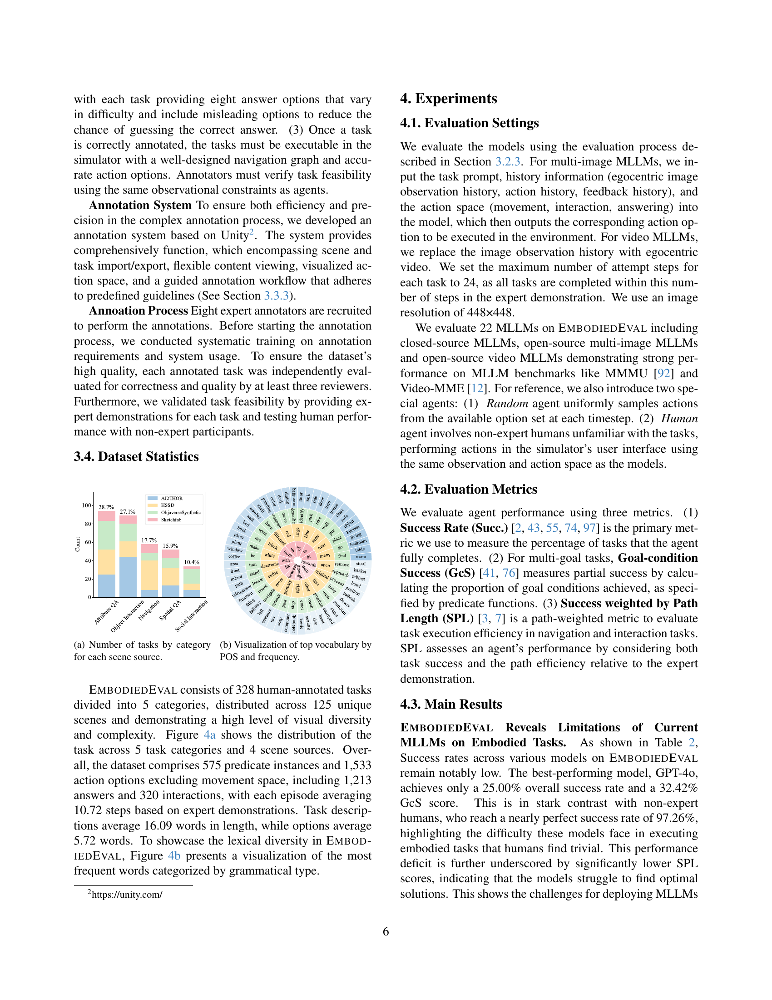

 


 2501.11858 
 Zhili Cheng et el. 
 
 🤗 2025-01-24 
 



↗ arXiv


↗ Hugging Face


↗ Papers with Code


### TL;DR



기존의 벤치마크들은 정적인 이미지나 비디오를 주로 사용하여 상호작용이 없는 환경에서 MLLM을 평가하는 데에만 초점을 맞추고 있었으며, 기존의 구현된 AI 벤치마크들은 특정 작업에만 국한되어 MLLM의 다양한 능력을 충분히 평가하지 못했습니다. 또한, 기존 벤치마크들은 MLLM의 입력 및 출력 형식에 대한 요구사항이 특정되어 있어, 주류 MLLM을 효율적으로 평가하는 데에 어려움이 있었습니다.

본 연구에서는 이러한 문제점들을 해결하기 위해, EmbodiedEval이라는 새로운 벤치마크를 제시합니다. EmbodiedEval은 다양한 3D 환경에서 328개의 상호 작용적인 작업을 포함하며, 항해, 객체 상호 작용, 사회적 상호 작용, 속성 질문 답변, 공간 질문 답변 등 다양한 능력을 평가하도록 설계되었습니다.  **EmbodiedEval은 통합적인 시뮬레이션 및 평가 프레임워크를 제공하여 MLLM의 구현 능력을 포괄적으로 평가**할 수 있도록 합니다. 실험 결과, 최첨단 MLLM은 인간 수준에 비해 상당한 성능 차이를 보였으며, 이는 MLLM의 구현 능력 향상을 위한 연구 방향을 제시합니다.



#### Key Takeaways


 EmbodiedEval은 **다양한 상호작용과 작업, 다양한 3D 장면**을 포함하는 포괄적인 MLLM 평가 벤치마크 



 기존 벤치마크의 한계를 극복하고 **MLLMì˜ 구현 능력을 종합적으로 평가** 



 **인간 수준의 성능과 비교하여 MLLMì˜ 한계를 보여주고 향후 발전 방향 제시** 


#### Why does it matter?
이 논문은 **다양한 3D 환경에서 멀티모달 대규모 언어 모델(MLLM)의 구현 능력을 종합적으로 평가하는 최초의 벤치마크인 EmbodiedEval을 제시**함으로써, 연구자들에게 중요한 의미를 지닙니다. **MLLM의 실제 세계 적용 가능성을 평가하고 향후 발전 방향을 제시**하여, 로보틱스, 컴퓨터 비전, 자연어 처리 분야 연구에 새로운 가능성을 열어줍니다.  EmbodiedEval은 다양한 상호 작용과 작업, 그리고 다양한 3D 장면을 특징으로 하여 기존의 제한적인 벤치마크를 넘어서는 포괄적인 평가를 제공합니다. 이는 **MLLM의 실제 세계 적용 가능성을 높이는 데 크게 기여**할 것으로 기대됩니다.

------
#### Visual Insights

> 🔼 그림 1은 EmbodiedEval의 다섯 가지 작업 범주에 대한 예시를 보여줍니다. 왼쪽에는 작업 텍스트와 작업 공간의 일부가 나와 있으며, 오른쪽에는 전문가 시연에서 해당 시점의 관찰 결과와 수행된 작업이 함께 제시되어 있습니다. 각 범주는 탐색, 개체 상호 작용, 사회적 상호 작용, 속성 질문 응답, 공간 질문 응답의 다양한 능력을 평가하기 위해 고안된 여러 작업을 포함합니다. 그림은 모델의 다양한 능력을 보여주는 작업 예시와 해당 작업에 대한 전문가의 시연을 보여주는 상세한 설명을 제공합니다.
> 

> 
read the caption

> Figure 1: Examples of the five task categories in EmbodiedEval. On the left are the task text and part of the action space. On the right are observations from specific steps, along with the actions taken in the expert demonstration at those moments.
> 


| Benchmark | Scene. | Task. | Disc. | Ego. | Nav. | Obj. | So. | Ans. |
|---|---|---|---|---|---|---|---|---|
| Video-MME [26] | - | ✓ | ✓ | ✗ | ✗ | ✗ | ✗ | ✓ |
| EgoPlan etc. [11, 14] | - | ✓ | ✓ | ✓ | ✗ | ✗ | ✗ | ✓ |
| OpenEQA [63] | - | ✓ | ✓ | ✓ | ✗ | ✗ | ✗ | ✓ |
| EQA etc. [18, 88, 81] | ✗ | ✗ | ✓ | ✓ | ✓ | ✗ | ✗ | ✓ |
| ALFRED [76] | ✗ | ✗ | ✗ | ✓ | ✓ | ✓ | ✗ | ✗ |
| BEHAVIOR [79] | ✗ | ✓ | ✗ | ✓ | ✓ | ✓ | ✗ | ✗ |
| EQA-MX [35] | ✗ | ✗ | ✓ | ✓ | ✗ | ✗ | ✓ | ✓ |
| **EmbodiedEval** | ✓ | ✓ | ✓ | ✓ | ✓ | ✓ | ✓ | ✓ |

> 🔼 표 1은 EmbodiedEval과 기존 벤치마크들을 비교 분석한 표입니다.  표의 각 열은 다음과 같은 특징들을 나타냅니다: 1)Scene Diversity: 가정집 환경 외 다양한 환경 포함 여부, 2)Task Diversity: 단순한 템플릿 작업 외 다양한 작업 유형 포함 여부, 3)Discrete Action Space: MLLM 평가를 위한 불연속적인 행동 공간 사용 여부, 4)Egocentric Vision: 1인칭 시점의 시각 정보 사용 여부, 5)Navigation: 길찾기 작업 포함 여부, 6)Object Interaction: 물체 조작 작업 포함 여부, 7)Social Interaction: 사회적 상호작용 작업 포함 여부, 8)Answering Questions: 질문에 답하는 작업 포함 여부.  각 벤치마크가 이러한 특징들을 얼마나 충족하는지 비교하여 EmbodiedEval의 포괄성과 다양성을 강조합니다.
> 

> 
read the caption

> Table 1:  Comparison of EmbodiedEval with previous benchmarks. The abbreviations in the table headers, from left to right, represent: Scene diversity (beyond household scenes), Task diversity (beyond task templates), Discrete action space (for MLLMs evaluation), Egocentric vision, Navigation involved, Object interaction involved, Social interaction involved, and Answering questions involved.
> 

### In-depth insights

#### Embodied Multimodal LLMs
본 논문은 구현된 다중 모드 LLMs에 대한 심층적인 논의를 제공합니다. **구현된 에이전트로서의 다중 모드 LLMs의 가능성**은 상당히 높지만, 기존 벤치마크는 주로 정적인 이미지나 비디오를 사용하여 상호 작용적이지 않은 시나리오에 국한되어 있습니다. **다양하고 포괄적인 평가 벤치마크의 부족**은 이러한 모델의 진정한 능력을 제대로 평가하는 데 어려움을 야기합니다. 따라서 본 연구는 **상호작용적이고 다양한 작업을 포함하는 포괄적인 평가 벤치마크**를 제안합니다. 이를 통해 다양한 3D 환경에서의 탐색, 객체 상호작용, 사회적 상호작용, 속성 질문 답변, 공간 질문 답변 등 다양한 능력을 평가할 수 있습니다.  **인간 수준의 성능과 비교했을 때 현존하는 MLLMs의 한계점**을 보여주는 실험 결과는 향후 연구 개발 방향을 제시하는 데 중요한 역할을 합니다.  **시뮬레이션 환경과 상호작용 방식의 다양성**은 구현된 에이전트의 역량을 더욱 정확하게 평가하는 데 기여합니다.  **다양한 작업과 시나리오를 통해 모델의 일반화 능력을 평가**하고, **장기간 작업에서의 한계점을 파악**하는 것 또한 중요한 부분입니다.  결론적으로, 본 연구는 구현된 다중 모드 LLMs의 발전에 중요한 기여를 할 것으로 예상됩니다.

#### EMBODIEDEVAL Benchmark
EMBODIEDEVAL 벤치마크는 **다양한 상호작용**, **다양한 작업**, **다양한 시나리오**를 특징으로 하는 종합적인 벤치마크입니다. 기존 벤치마크의 한계를 극복하고자 **MLLM(다중 모드 대규모 언어 모델)**의 구현된 기능을 포괄적으로 평가하기 위해 고안되었습니다.  **탐색, 객체 상호작용, 사회적 상호작용, 속성 질문 답변, 공간 질문 답변** 등 다양한 유형의 과제를 포함하여 MLLM의 역량을 다각적으로 평가합니다.  **통합 시뮬레이션 및 평가 프레임워크**를 사용하여 MLLM을 위한 맞춤형 환경을 제공하며, 인간 수준의 성능과 비교하여 MLLM의 한계를 보여줍니다.  **다양한 3D 환경**과 **방대한 작업 세트**는 MLLM의 일반화 능력을 평가하는 데 도움이 되는 주요 강점입니다.  **오픈소스**로 제공되어 연구자들의 활발한 참여와 발전을 기대하게 합니다.

#### MLLM Evaluation Metrics
본 논문에서는 MLLM(다중 모드 대규모 언어 모델)의 평가 지표에 대해 심도 있게 논의합니다. 기존의 이미지나 비디오 기반의 정적 평가 방식에서 벗어나 **상호작용적 3D 환경에서의 다양한 과제 수행 능력**을 평가하는 새로운 지표가 필요함을 강조합니다. 특히, **성공률(Success Rate), 목표 달성률(Goal-Condition Success), 경로 길이 가중 성공률(Success weighted by Path Length)** 세 가지 핵심 지표를 제시하며, 각 지표가 모델의 상호작용 능력, 작업 효율성, 계획 능력 등 다양한 측면을 평가하는 데 어떻게 기여하는지 설명합니다.  **인간 수준의 성능과의 비교**를 통해 MLLM의 한계를 명확히 드러내고, 향후 연구 방향을 제시하는 데 활용합니다. 단순히 정량적 지표뿐 아니라, **실패 원인 분석(Error Analysis)**을 통해 환각, 탐색 부족, 공간 추론 오류, 계획 부재 등 MLLM의 주요 약점을 밝히고, 이를 개선하기 위한 연구 방향을 제시합니다.

#### Limitations of Current LLMs
본 논문에서 제시된 실험 결과는 현재의 다중 모드 대규모 언어 모델(MLLM)이 **물리적 환경과 상호 작용하는 임베디드 작업에서 상당한 한계**를 가지고 있음을 보여줍니다. 특히 **장기간의 작업이나 다양한 유형의 작업**에서는 성공률이 현저히 떨어지는 것으로 나타났습니다. 이는 모델이 **복잡한 상황을 이해하고 계획을 세우는 능력**이 부족하며, **장기적인 상황 기억과 추론 능력**도 제한적임을 시사합니다.  **시각적 정보의 정확한 이해와 공간적 추론, 물체와의 상호 작용** 등 임베디드 에이전트에게 필수적인 능력에서도 부족함을 드러냈습니다. 따라서, 향후 MLLM의 발전 방향은 **다양한 상호작용과 복잡한 작업에 대한 적응력 향상, 장기적인 상황 인지 능력 향상, 그리고 시각-언어-행동 통합 능력의 강화**에 초점을 맞춰야 할 것입니다.  **모델의 계획 및 의사결정 능력 개선**을 위한 심층적인 연구와, **데이터셋의 다양성과 질적 향상**에 대한 노력이 필요합니다.

#### Future Research
미래 연구 분야로는 **다양한 상호작용 및 작업 유형을 지원하는 시뮬레이션 환경의 확장**이 중요합니다.  현재 평가 기준은 상호작용의 다양성을 충분히 반영하지 못하므로, 더욱 복잡하고 현실적인 상호작용을 포함하는 새로운 벤치마크 개발이 필요합니다. 또한, **모델의 일반화 능력 향상을 위한 다양한 환경 및 객체를 포함한 데이터셋의 확장**도 중요합니다.  현재 벤치마크는 특정 환경에 편향되어 있으므로, 더욱 다양한 환경에서 모델의 성능을 평가하는 것이 필요합니다.  **장기간의 작업 수행 능력 향상**을 위한 연구도 중요합니다. 현재 모델은 장기간의 작업 수행에 어려움을 겪고 있으므로, 메모리 관리 및 계획 능력 향상 연구가 필요합니다. 마지막으로, **에러 분석 및 해결 방안 연구**를 통해 모델의 신뢰성을 높이는 것이 중요합니다.  현재 모델은 환각, 탐색 부족, 공간 추론 부족, 잘못된 계획 등의 에러를 보이고 있으므로, 이러한 에러의 원인을 분석하고 해결 방안을 모색하는 연구가 필요합니다.

### More visual insights

More on figures

> 🔼 그림 2는 R2R 데이터셋(왼쪽)과 EmbodiedEval(오른쪽)의 탐색 그래프를 비교한 것입니다. R2R 데이터셋은 주로 가정용 환경에 초점을 맞춘 반면, EmbodiedEval은 다양한 유형의 3D 환경을 포함하고 있어 더욱 다양한 탐색 작업을 수행할 수 있음을 보여줍니다. EmbodiedEval의 탐색 그래프는 보다 균일하고 체계적으로 구성되어 있어, 모델이 탐색 작업을 더욱 효율적이고 정확하게 수행하는 데 도움이 될 수 있습니다.  왼쪽의 R2R 탐색 그래프는 복잡하고 불규칙적인 구조를 보이는 반면, 오른쪽의 EmbodiedEval 탐색 그래프는 더욱 단순하고 체계적인 구조를 가지고 있어 모델의 탐색 성능을 평가하는 데 더 적합합니다.
> 

> 
read the caption

> Figure 2: A comparison of navigation graphs between R2R [4] dataset (left) and EmbodiedEval (right).
> 

> 🔼 본 그림은 EmbodiedEval 데이터셋 구성 과정을 보여줍니다. 크게 세 단계, 즉 장면 수집(Scene Collection), 작업 수집(Task Collection), 작업 주석(Task Annotation)으로 나뉩니다. 장면 수집 단계에서는 AI2THOR, HSSD, Objaverse, Sketchfab 등 다양한 출처에서 다양한 3D 환경을 수집합니다. 작업 수집 단계에서는 기존 벤치마크에서 영감을 얻고 대규모 언어 모델(LLM)을 활용하여 다양한 작업들을 생성합니다. 전문가들은 이러한 작업들을 검토하고 최종 작업 목록을 선정합니다. 마지막으로 작업 주석 단계에서는 각 작업에 대한 자세한 주석과 메타데이터를 추가하여 모델의 평가에 사용합니다.
> 

> 
read the caption

> Figure 3: The dataset construction pipeline of EmbodiedEval.
> 

> 🔼 이 그림은 각 장면 소스별 작업 범주에 따른 작업 수를 보여줍니다.  즉, AI2THOR, HSSD, Objaverse Synthetic, Sketchfab 등 네 가지 장면 소스에서 각각 탐색, 개체 상호작용, 사회적 상호작용, 속성 질문 답변, 공간 질문 답변 등 다섯 가지 작업 범주에 속하는 작업 수를 막대 그래프로 나타냅니다. 이를 통해 각 장면 유형에서 어떤 유형의 작업이 더 많이 포함되어 있는지, 그리고 작업 유형별로 장면 소스 간의 분포 차이가 얼마나 되는지를 한눈에 파악할 수 있습니다.
> 

> 
read the caption

> (a) Number of tasks by category for each scene source.
> 

> 🔼 그림 (b)는 EMBODIEDEVAL 데이터셋에 있는 단어들의 품사(POS)별 빈도수를 시각적으로 보여줍니다.  가장 자주 사용되는 단어들을 품사별로 분류하고, 각 품사에 해당하는 상위 단어들의 빈도를 표시하여 데이터셋의 어휘적 다양성과 복잡성을 보여주는 것입니다.  이 그림은 데이터셋의 주요 어휘적 특징을 한눈에 파악하는 데 도움을 줍니다.
> 

> 
read the caption

> (b) Visualization of top vocabulary by POS and frequency.
> 

> 🔼 그림 5는 과제에 필요한 단계 수 대비 성공률을 보여줍니다.  이 그래프는 모델이 수행하는 단계의 수가 증가함에 따라 성공률이 어떻게 변하는지 보여주는 시각적 자료입니다.  즉, 과제의 복잡성이 증가할수록 모델의 성공률이 어떻게 영향을 받는지를 나타내는 중요한 지표입니다.  다양한 최첨단 MLLM 모델들의 성능을 비교하여 각 모델이 장기적인 과제에서 어떤 어려움을 겪는지 보여줍니다.  특히, 장기적인 과제에서 성공률이 급격히 감소하는 현상을 통해 MLLM의 한계점을 명확히 파악하는 데 도움을 줍니다.
> 

> 
read the caption

> Figure 5: Success rate vs. number of steps required for the task.
> 

> 🔼 그림 6은 모델의 대표적인 오류 유형 네 가지를 보여줍니다.  먼저, ‘기반 환각(Hallucination in Grounding)’에서는 에이전트가 실제로 하나의 파란색 소파만 있는데 두 개로 잘못 인식하는 모습을 보여줍니다. 다음으로, ‘탐색 부족(Insufficient Exploration)’에서는 에이전트가 추가적인 물건을 찾지 못하는 모습을 보여줍니다.  ‘공간 추론 부족(Lack in Spatial Reasoning)’에서는 에이전트가 물건 간의 거리를 잘못 추정하는 모습을 보여주며, 마지막으로 ‘잘못된 계획(Wrong Planning)’에서는 에이전트가 화병을 올바른 순서와 위치에 놓지 못하는 모습을 보여줍니다.
> 

> 
read the caption

> Figure 6: Case study of common error categories. In Hallucination in Grounding, the agent mistakenly identified a single blue sofa as two. In Insufficient Exploration, the agent failed to look for additional items. In Lack in Spatial Reasoning, the agent misestimated the distance between objects. In Wrong Planning, the agent did not organize the picking up and putting down of the vases in the proper order and at the correct positions.
> 

> 🔼 그림 7은 논문의 데이터셋 구축 과정(3.3절)에서 사용된 대화형 장면 편집기의 기능을 보여줍니다. 왼쪽은 물체의 위치를 조정하는 모습을, 오른쪽은 물체의 각도를 조정하는 모습을 보여줍니다.  이 편집기를 통해 연구자들은 장면 내 물체의 위치와 방향을 직접 조절하여 보다 다양하고 현실적인 장면을 생성할 수 있습니다. 이는  EMBODIEDEVAL 데이터셋의 다양성과 현실성을 높이는 데 중요한 역할을 합니다.
> 

> 
read the caption

> Figure 7: Interactive scene editor: adjust object position (left) and angle (right).
> 

> 🔼 그림 8은 다중 이미지 MLLM을 위한 프롬프트(지시문)를 보여줍니다.  간략히 말해, 에이전트는 주어진 작업을 수행하기 위해 시각적 정보, 이전 행동, 피드백, 가능한 행동 목록을 입력받아, 최적의 행동을 선택하고 그 이유를 설명해야 합니다.  여기에는 에이전트의 시각적 관점을 보여주는 이미지 시퀀스, 작업 설명, 행동 이력, 피드백 등이 포함되어 있습니다.  프롬프트는 에이전트가 작업을 성공적으로 완료할 수 있도록 다양한 지침과 주의사항을 제공합니다.  예를 들어, 불필요한 행동을 피하거나, 목표를 달성하기 위해 환경을 탐색하는 전략을 세우는 등의 내용이 포함됩니다.
> 

> 
read the caption

> Figure 8: Prompt for Multi-image MLLMs.
> 

> 🔼 그림 9는 본 논문에서 사용된 Objaverse 자산과 생성된 장면의 예시들을 보여줍니다. Objaverse는 다양한 3D 객체들을 포함하고 있으며, 이러한 객체들을 활용하여 다양한 유형의 장면들을 생성할 수 있습니다. 그림에는 가구, 일상 용품, 음식 등 다양한 종류의 객체들이 포함된 여러 장면들이 시각적으로 제시되어 있으며, 이는 본 논문에서 제안하는 EmbodiedEval 벤치마크의 다양성과 현실성을 보여주는 역할을 합니다.
> 

> 
read the caption

> Figure 9: Examples of selected Objaverse assets and views of generated scenes.
> 

> 🔼 그림 10은 EMBODIEDEVAL 데이터셋 구성 과정에서 전문가가 주석을 달아 만든 대표적인 성공 사례 두 가지를 보여줍니다.  왼쪽은 '이 방의 주인은 무엇을 공부할 것이라고 생각하십니까?' 라는 질문에 대한 답변으로, 모델은 방 안의 물건들을 바탕으로 '인테리어 디자인'이라고 정확하게 답변했습니다. 오른쪽은 식탁 근처의 개수대 안에 무엇이 있는지 질문하는 예시로, 모델은 '토마토'라고 정확하게 답변했습니다.  두 사례 모두 모델이 시각적 정보를 정확하게 이해하고 추론하여 질문에 적절히 답변한 성공적인 상호작용을 보여줍니다. 이 그림은 3.3절 '데이터셋 구성' 에서 언급된 주석 작업의 엄격함과 성공 사례의 예시를 시각적으로 보여줍니다.
> 

> 
read the caption

> Figure 10:
> 

> 🔼 그림 11은 EMBODIEDEVAL의 탐색 작업 예시를 보여줍니다.  왼쪽은 작업 지시 사항과 에이전트가 취할 수 있는 행동 목록을 보여주고, 오른쪽은 에이전트가 작업을 수행하는 동안 각 단계의 관측 결과와 수행된 행동을 보여줍니다.  이 그림은 자연어 명령을 이해하고 이에 따라 3D 환경 내에서 성공적으로 탐색하는 에이전트의 능력을 시각적으로 보여주는 데 도움이 됩니다.
> 

> 
read the caption

> Figure 11:
> 

> 🔼 그림 12는 EMBODIEDEVAL의 Object Interaction 작업 범주에 속하는 두 가지 예시를 보여줍니다. 각각의 예시는 다양한 단계의 상호작용을 통해 목표를 달성하는 과정을 시각적으로 보여줍니다. 첫 번째 예시는 여러 단계에 걸쳐 물체를 집어 올리고, 옮기고, 놓는 동작들을 수행하여, 성공적으로 과제를 완수하는 과정을 보여줍니다. 두 번째 예시는 특정 물체를 집어 올리고, 원하는 위치에 놓는 작업을 통해, Object Interaction 작업의 다양한 측면을 보여줍니다. 각 이미지는 과제 수행 중 특정 시점의 시각적 관찰 결과와 함께 해당 시점에서 수행된 행동을 설명하는 캡션을 제공합니다. 이 그림을 통해 사용자는 EMBODIEDEVAL 벤치마크의 Object Interaction 작업 범주의 복잡성과 다양성을 더욱 잘 이해할 수 있습니다.
> 

> 
read the caption

> Figure 12:
> 

> 🔼 그림 13은 EMBODIEDEVAL 평가 프레임워크의 SpatialQA 작업 예시를 보여줍니다.  소파가 앞문을 통과할 수 있는지 여부를 결정하는 질문에 대해 에이전트가 시뮬레이션 환경과 상호 작용하는 과정을 보여주는 일련의 이미지들을 보여줍니다.  각 이미지는 에이전트가 취한 행동과 관찰 결과를 보여줍니다.  에이전트는 문과 소파의 크기를 비교하여 결정을 내립니다.
> 

> 
read the caption

> Figure 13:
> 

> 🔼 그림 14는 EMBODIEDEVAL 평가 프레임워크의 SpatialQA 작업 예시를 보여줍니다.  사용자는 방 안에 있는 침실 문의 방향을 묻는 질문을 합니다.  에이전트는 환경과 상호 작용하고(이동, 회전 등) 센서 정보(이미지)를 사용하여 질문에 답합니다.  그림은 에이전트가 질문에 답하기 위해 수행한 단계별 행동과 관찰 결과를 시각적으로 보여줍니다.  각 단계에서 에이전트의 행동과 그 결과로 얻은 이미지와 함께 성공 여부를 나타냅니다.
> 

> 
read the caption

> Figure 14:
> 

> 🔼 그림 15는 논문의 3.1절인 'Task Categories' 섹션에 포함된 그림으로,  다양한 능력을 평가하기 위해 설계된 다양한 작업의 예시를 보여줍니다.  특히, 'Navigation' 작업 범주에 속하는 예시로서,  에이전트가 주어진 자연어 지시에 따라 특정 위치에 있는 물체를 찾아가는 과정을 시각적으로 보여줍니다.  에이전트는 자연어 지시를 해석하고,  주변 환경을 인지하며,  경로를 계획하여 목표 위치까지 이동하는 일련의 행동을 수행합니다.  각 단계별 에이전트의 시점,  수행된 행동,  다음 행동을 위한 선택지 등이 그림에 자세히 제시되어 있어 에이전트의 의사결정 과정을 이해하는데 도움을 줍니다.
> 

> 
read the caption

> Figure 15:
> 

> 🔼 그림 16은 논문의 3. EmbodiedEval 섹션에 속하며, EMBODIEDEVAL 벤치마크의 다양한 능력을 평가하기 위해 고안된 다양한 작업 범주 중 '탐색(Navigation)' 작업에 대한 예시를 보여줍니다. 특히, 그림은 사용자가 제시한 자연어 명령어에 따라 에이전트가 3D 환경 내에서 목표 위치까지 탐색하는 과정을 시각적으로 보여줍니다.  각 이미지는 에이전트의 시점에서 촬영된 화면이며, 에이전트가 수행한 동작과 그 결과가 순차적으로 제시되어 있습니다.  이는 에이전트가 명령을 이해하고, 환경을 인지하며,  목표 달성을 위해 적절한 움직임을 선택하는 능력을 평가하는 데 사용됩니다.  에이전트가 명령을 완벽하게 수행하는지, 혹은 어떤 어려움에 직면하는지를  이 그림을 통해 직관적으로 이해할 수 있습니다.
> 

> 
read the caption

> Figure 16:
> 

> 🔼 그림 17은 본 논문의 3. EmbodiedEval 섹션, 3.1 Task Categories 하위 섹션에 포함된 그림입니다. 그림은 객체 상호작용(Object Interaction) 작업의 예시를 보여줍니다. 구체적으로, 에이전트가 냉장고 안에 계란이 있는지 확인하는 작업을 수행하는 과정을 보여주는 여러 단계의 이미지가 순차적으로 나열되어 있습니다. 각 이미지는 에이전트의 시점에서 캡처된 이미지이며, 에이전트가 작업을 수행하는 동안 취한 행동과 관찰 내용이 함께 제시되어 있습니다. 이는 MLLM 기반 에이전트의 객체 상호 작용 능력을 평가하기 위한 EMBODIEDEVAL 벤치마크의 다양한 상호작용 유형 중 하나를 보여줍니다.
> 

> 
read the caption

> Figure 17:
> 

> 🔼 그림 18은 모델이 물체 상호작용 작업을 수행하는 과정을 보여줍니다.  특히, 모델이 여러 개의 둥근 물체를 쓰레기통에 버리는 작업을 시도하는 모습을 단계별로 보여줍니다.  각 단계마다 모델의 행동, 관찰 결과, 그리고 성공/실패 여부가 함께 제시되어 있습니다. 이 그림은 모델의 행동 전략, 시각적 정보 처리 능력, 그리고 작업 수행의 어려움 등을 분석하는 데 도움이 됩니다. 특히, 모델이 물체를 집어 올리는 데는 성공하지만 쓰레기통에 버리는 데는 실패하는 경우가 여러 번 반복되는데, 이는 모델의 시각적 공간 추론이나 계획 능력에 제한이 있음을 시사합니다.
> 

> 
read the caption

> Figure 18:
> 

> 🔼 그림 19는 본 논문의 3.1절인 '작업 범주'에서 설명하는 다섯 가지 작업 범주 중 하나인 '사회적 상호작용' 작업에 대한 예시를 보여줍니다. 그림은 에이전트가 사람과 상호 작용하는 일련의 단계를 보여주는 일련의 이미지와 함께 작업 텍스트 및 행동 공간을 보여줍니다. 구체적으로는 '아빠를 깨워주세요. 아빠는 침실에서 자고 있습니다. 침실은 앞으로 걸어가면 오른쪽 두 번째 방입니다.'라는 작업 지시에 대해, 에이전트가 침실로 이동하여 '일어나세요'라고 말하는 과정을 시각적으로 보여줍니다. 각 이미지는 에이전트가 취한 행동, 관찰 내용, 성공 여부 등을 자세하게 설명합니다.
> 

> 
read the caption

> Figure 19:
> 

> 🔼 그림 20은 본 논문의 6.4.5절(사회적 상호 작용)에서 다루는 성공 사례 중 하나로, 모델이 '아빠를 깨워라. 아빠는 침실에서 자고 있다. 침실은 앞으로 걸어갈 때 오른쪽 두 번째 방이다.'라는 지시를 따르는 과정을 보여줍니다. 그림은 모델의 시점에서 캡처한 일련의 이미지와 각 단계에서 수행한 동작(왼쪽이나 오른쪽으로 돌기, 앞으로 움직이기, 말하기 등) 및 그 결과를 보여줍니다. 모델은 침실에 도착하여 '일어나세요'라고 말하는 것으로 작업을 성공적으로 완료합니다.  이 그림은 다양한 탐색 및 의사소통 전략을 사용하여 복잡한 사회적 상호 작용 작업을 수행하는 데 있어 모델의 능력을 보여주는 좋은 예시입니다.
> 

> 
read the caption

> Figure 20:
> 

> 🔼 그림 21은 본 논문의 6.5.1절 (Attribute QA 오류 사례)에 속하며, 침실에서 전자 기기를 찾는 과제에 대한 오류 사례를 보여줍니다. Qwen-VL-Max 모델은 침실 내부를 탐색하지만, 책상 스탠드와 휴대폰은 발견하지 못하고 노트북만 찾습니다. 이는 모델이 환경을 완전히 탐색하지 못하고,  목표 객체를 정확히 인식하지 못하는 제한점을 보여주는 예시입니다.  모델이 침실의 모든 부분을 철저히 탐색하지 않고,  일부 영역만 확인하여 잘못된 결론에 도달한 것을 알 수 있습니다.
> 

> 
read the caption

> Figure 21:
> 

> 🔼 그림 22는 논문의 6.5.2절 공간적 질문 답변(Spatial QA) 섹션에 포함된 그림입니다. 이 그림은 주방과 거실에서 쉽게 접근할 수 있는 소화기의 최적 위치를 결정하는 작업을 보여줍니다. 그림은 다양한 시점에서의 에이전트의 관찰 결과와 작업 수행 과정을 시각적으로 보여주는 일련의 이미지를 보여줍니다. 각 이미지에는 에이전트가 취한 행동, 에이전트의 관찰 내용, 작업의 성공 여부 등에 대한 자세한 설명이 포함되어 있습니다. 이 그림은 에이전트가 주방과 거실 사이의 공간을 탐색하고, 작업에 대한 최적의 위치를 결정하는 과정을 이해하는 데 도움이 됩니다. 그림은 에이전트의 의사결정 과정을 시각적으로 보여주어, 모델이 작업을 수행하는 방식에 대한 통찰력을 제공합니다.
> 

> 
read the caption

> Figure 22:
> 

More on tables


| Model | Attr. QA | Spatial QA | Navigation |  |  | Object Interaction |  |  | Social Interaction |  |  | Overall |  |
|---|---|---|---|---|---|---|---|---|---|---|---|---|---|---|
|  | Succ. | Succ. | Succ. | GcS | SPL | Succ. | GcS | SPL | Succ. | GcS | SPL | Succ. | GcS |
| Random | 11.58 | 7.69 | 3.45 | 8.76 | 3.45 | 0.00 | 6.18 | 0.00 | 2.94 | 8.33 | 2.94 | 5.49 | 8.66 |
| Human | 98.95 | 92.31 | 96.55 | 97.84 | 82.28 | 97.75 | 99.44 | 90.73 | 100.00 | 100.00 | 89.96 | 97.26 | 97.94 |
| _Closed-Source Multi-Image MLLMs_ |  |  |  |  |  |  |  |  |  |  |  |  |  |
| GPT-4o [68] | 35.79 | **32.69** | **31.03** | **42.53** | **22.23** | **10.11** | 24.25 | **5.94** | **11.76** | **26.72** | 6.74 | **25.00** | **32.42** |
| GPT-4o-Mini [68] | 31.58 | 15.38 | 27.59 | 39.51 | 15.34 | 2.25 | 17.42 | 1.50 | 5.88 | 22.06 | 2.98 | 17.68 | 25.58 |
| Gemini-Pro [29] | 27.37 | 9.62 | 17.24 | 25.86 | 9.78 | 4.49 | 12.36 | 3.00 | 5.88 | 18.14 | 3.44 | 14.33 | 19.26 |
| Gemini-Flash [29] | 26.32 | 13.46 | 5.17 | 17.10 | 3.51 | 2.25 | 7.58 | 0.96 | 2.94 | 12.50 | 1.47 | 11.59 | 16.13 |
| Qwen-VL-Max [5] | **37.89** | 17.31 | 24.14 | 30.03 | 16.87 | 7.87 | **24.91** | 5.62 | 8.82 | 22.06 | **6.86** | 21.04 | 28.07 |
| Qwen-VL-Plus [5] | 10.53 | 11.54 | 3.45 | 10.49 | 3.45 | 0.00 | 2.43 | 0.00 | 2.94 | 8.82 | 1.68 | 5.79 | 8.31 |
| _Open-Source Multi-Image MLLMs_ |  |  |  |  |  |  |  |  |  |  |  |  |  |
| InternVL2-40B [69] | 14.74 | 5.77 | 6.90 | 12.93 | 3.06 | 0.00 | 7.68 | 0.00 | **5.88** | **19.12** | 2.16 | 7.01 | 11.54 |
| InternVL2-8B [69] | 13.68 | 13.46 | 8.62 | 18.25 | 4.04 | 0.00 | 7.43 | 0.00 | **5.88** | 18.63 | **2.45** | 8.23 | 13.27 |
| InternVL2-Llama3-76B [69] | 21.05 | 13.46 | 3.45 | 9.48 | 2.18 | 0.00 | 9.08 | 0.00 | 2.94 | 13.73 | 1.14 | 9.15 | 13.79 |
| LLaVA-NEXT-72B [12] | 23.16 | 5.77 | **12.07** | 22.99 | **7.83** | **3.37** | **9.74** | **2.21** | 0.00 | 12.25 | 0.00 | 10.67 | 15.60 |
| LLaVA-OneVision-72B [52] | **26.32** | **19.23** | 10.34 | **23.28** | 7.53 | 1.12 | 7.81 | 1.12 | 0.00 | 12.75 | 0.00 | **12.80** | **18.23** |
| LLaVA-OneVision-7B [52] | 16.84 | 17.31 | 5.17 | 9.05 | 3.28 | 1.12 | 8.15 | 0.80 | 2.94 | 9.80 | 1.68 | 9.14 | 12.45 |
| VILA-40B [50] | 17.89 | 7.69 | 0.00 | 5.75 | 0.00 | 0.00 | 3.93 | 0.00 | 0.00 | 8.58 | 0.00 | 6.40 | 9.53 |
| VILA-8B [50] | 15.79 | 9.62 | 1.72 | 8.91 | 0.96 | 0.00 | 3.46 | 0.00 | 2.94 | 6.37 | 1.68 | 6.71 | 9.27 |
| _Open-Source Video MLLMs_ |  |  |  |  |  |  |  |  |  |  |  |  |  |
| LLaVA-NeXT-Video-32B-Qwen [94] | 21.05 | 7.69 | 6.90 | 14.08 | 5.34 | 0.00 | 8.61 | 0.00 | 2.94 | **12.01** | 0.98 | 8.84 | 13.39 |
| LLaVA-Video-72B-Qwen2 [95] | **27.37** | 9.62 | **15.52** | **24.28** | **9.62** | 1.12 | 8.05 | 0.86 | 0.00 | 9.80 | 0.00 | 12.50 | **16.95** |
| LLaVA-Video-7B-Qwen2 [95] | 20.00 | **19.23** | 3.45 | 4.89 | 1.88 | 1.12 | **8.80** | 0.27 | 0.00 | 5.15 | 0.00 | 9.76 | 12.63 |
| Oryx-34B [58] | 18.95 | 3.85 | 5.17 | 13.07 | 4.89 | 1.12 | 7.02 | 1.00 | 0.00 | 8.33 | 0.00 | 7.32 | 11.33 |
| VideoLLaMA2-72B [16] | **27.37** | 9.62 | 12.07 | 18.68 | 6.35 | **2.25** | 7.49 | **1.38** | **5.88** | 10.78 | **2.39** | **12.81** | 15.91 |
| VideoLLaMA2-7B [16] | 21.05 | 9.62 | 6.90 | 17.53 | 4.88 | 0.00 | 1.63 | 0.00 | 2.94 | 7.35 | 1.38 | 9.20 | 11.99 |
> 🔼 표 2는 EMBODIEDEVAL 벤치마크에서 다양한 모델들의 성능을 백분율(%)로 나타낸 표입니다. 각 과제 유형(속성 질문 답변, 공간 질문 답변, 탐색, 개체 상호 작용, 사회적 상호 작용)에 대한 성공률, 목표 달성률, 경로 길이 가중 성공률을 보여줍니다. 각 과제 유형에서 가장 좋은 성능을 보인 모델은 굵게 표시되어 있습니다. 이 표는 제시된 다양한 모델들의 능력을 비교하고 각 과제 유형에서의 강점과 약점을 파악하는 데 유용합니다.
> 

> 
read the caption

> Table 2:  Results of different models on EmbodiedEval (%). The best-performing model in each category is bolded.
> 


| Task | Characteristics |
|---|---| 
| Please go to the kitchen, then come back and tell me if there are any extra cups. | scene memory |
| Imagine the house is rotated 90 degrees counterclockwise. How would this affect the natural light distribution in the room? | spatial imagination |
| Open a black locked drawer with a key found on the desk. | tool use |
| Pick up the kettle and the box labeled ”BREAD” from the kitchen counter and place them on the table with the coffee machine. | optical character recognition |
| Optimize the display of artworks on the shelves as follows: place two items on each shelf, with one shelf featuring two items of the same shape. Complete the requirements in as few steps as possible. | reasoning and planning |
| Grab the object that is cylindrical and silver on the table next to the washing machine. | multiple attribute reference |
| Estimate the percentage of floor space occupied by furniture in the room you’re currently in. | area estimation |
| Estimate the straight-line distance from the front door to the TV. Note that each step you take forward is approximately two meters. | distance estimation |
| Which is closer to the drink on the round table, the ginger or the ice cream? | distance comparison |
| If we were to host a birthday party, which area of the house could accommodate the most people while ensuring clear pathways to exits? | logic, space, and common sense |
| Describe the path from the kitchen to the living room. | path description |
| If you were to draw a straight line from the desk with a turned-on laptop to the bookshelf, which pieces of furniture would it intersect? | spatial reasoning |
| What is the object I am pointing at? | pointing comprehension |
| Pick up the watermelon on my right. | perspective-taking comprehension |
| My red glasses are missing. Please help me look for them in the room. Once you find them, bring them to me. | object searching and delivering |
| Get close to the lady in white and ask if she needs help. | social navigation |
| Wake up my dad. He is sleeping in the bedroom. The bedroom is the second room on your right as you walk forward. | finding someone |
| Enter the dining area and see if there is more than one door in the entire house. | object counting |
| Calculate the ratio of seating options to the number of rooms in the house. | counting and calculation |
| Tell me which objects have a handle in the kitchen. | attribute grounding |
| Evaluate whether the painting above the living room sofa is more colorful than the carpet. | attribute comparison |
| How many rooms are there in total? | room counting |
| Confirm if a garbage can is located on the floor in the living room. | object existence |
| Which room has more seating options, the kitchen or the living room? | quantity comparison |
| I’m hungry. Find all objects that can be used as ingredients. on the table in this room. | object functionality |
| Count the maximum number of identical clocks among all the rooms. | counting and attribute memory |
| What do you think the owner of this room probably studies? | common sense |
| Is there an egg inside the fridge? | interaction and answering |
| Open the drawer of the side table in the study room. If there is something inside, leave it open and put all similar items from the room into it. If there is nothing inside, close it. | logical execution |
> 🔼 EmbodiedEval 데이터셋에 포함된 다양한 유형의 작업들을 보여주는 표입니다.  단순한 탐색부터 물체 조작, 사회적 상호 작용, 속성 질문 답변, 공간 질문 답변 등 다양한 종류의 과제들이 예시로 제시되어 있으며, 각 과제의 특징과 필요한 능력들을 간략하게 설명하고 있습니다. 이 표를 통해  EmbodiedEval 데이터셋의 광범위한 작업 다양성과 복잡성을 이해할 수 있습니다.
> 

> 
read the caption

> Table 3: Examples of the diverse tasks in EmbodiedEval.
> 


| Predicate | Paramters | Success Conditions |
|---|---|---|
| _choose_ | The right answer. | When the agent selects the correct answer. |
| _agent_at_ | A navigation point. | When the agent finally arrives at this point. |
| _agent_pass_ | A navigation point. | When the agent has passed through this point at least once. |
| _at_ | An object and a specific point. | When the object is at this point. |
| _grab_once_ | An object. | When the agent has picked up this object at least once. |
| _grab_ | An object. | When the agent picks up the object. |
| _special_action_success_ | An interaction action. | When this interaction action has been successful. |
> 🔼 EmbodiedEval 평가 프레임워크에서 사용되는 술어(predicate)들의 목록과 각 술어에 대한 설명, 성공 조건을 보여주는 표입니다. 각 술어는 시뮬레이션 환경의 상태를 참/거짓으로 평가하는 함수로, 작업 완료 여부를 판단하는 데 사용됩니다. 예를 들어, `agent_at` 술어는 에이전트가 특정 위치에 도달했는지 확인하고, `grab` 술어는 에이전트가 특정 물체를 집었는지 확인합니다. 성공 조건은 각 술어가 참으로 평가되는 조건을 구체적으로 설명합니다.
> 

> 
read the caption

> Table 4: The predicates involved in EmbodiedEval.
> 


| Action Text | Execution Requirements |
|---|---| 
| wash | When the agent is holding the target object and stand next to the sink. |
| hand over | When the agent is holding the target object and stand next to the person. |
| sit down | When the agent is next to the target chair. |
| unlock | When the agent is holding the target key and standing next to the drawer |
| greet | When the agent is near the person. |
| ask | When the agent is near the person. |
| mix | When several target beverages are on the table next to the agent. |
| wipe off the table | When the agent is holding an object for cleaning and standing next to the table. |
| check the results of the program | When the agent is next to the computer. |
> 🔼 EmbodiedEval 데이터셋에 포함된 다양한 상호작용 행동들의 예시를 보여주는 표입니다. 각 행동에 대한 텍스트 설명과 해당 행동이 성공적으로 수행되기 위한 조건들을 상세히 기술하여,  EMBODIEDEVAL 데이터셋의 상호작용 디자인에 대한 이해를 돕습니다.  각 행동은 시뮬레이션 환경 내에서 에이전트가 수행하는 구체적인 동작을 나타내며,  물체 조작, 사람과의 상호작용 등 다양한 유형의 작업을 포함합니다. 이 표는 에이전트가 주어진 작업을 성공적으로 완료하기 위한 상호작용 방식을 이해하는 데 중요한 정보를 제공합니다.
> 

> 
read the caption

> Table 5: Some cases of the interaction actions involved in EmbodiedEval.
> 

### Full paper



