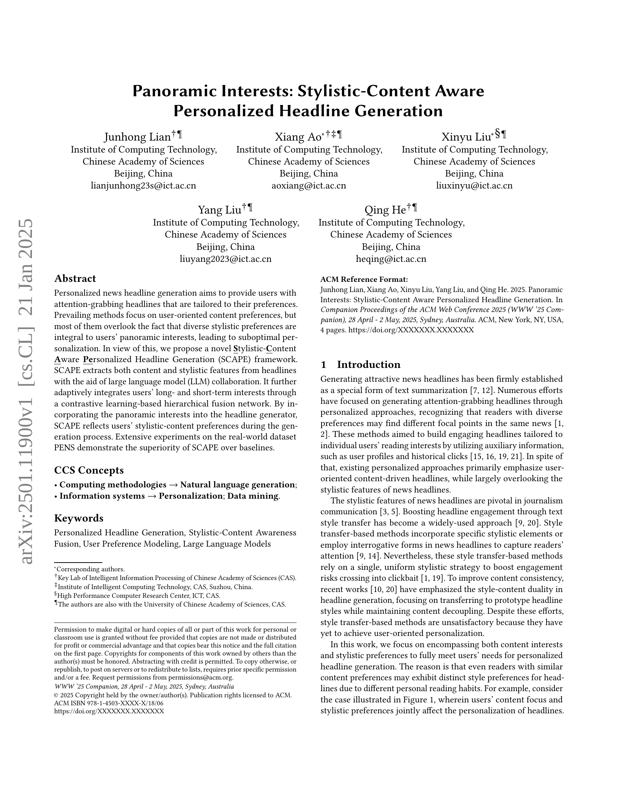
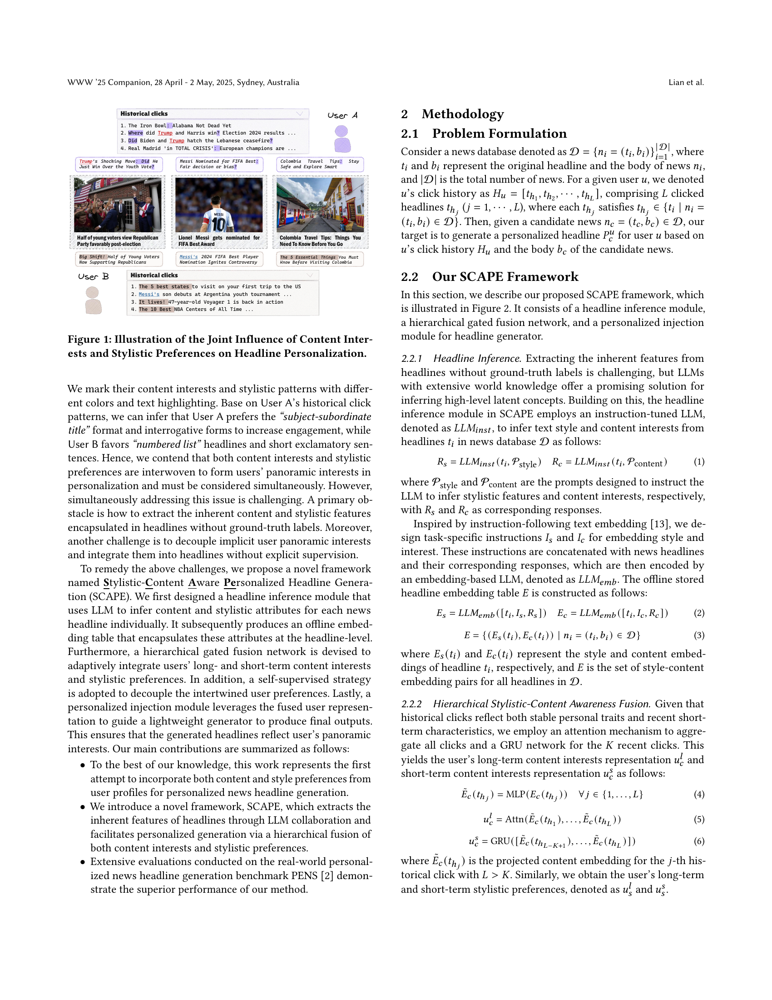
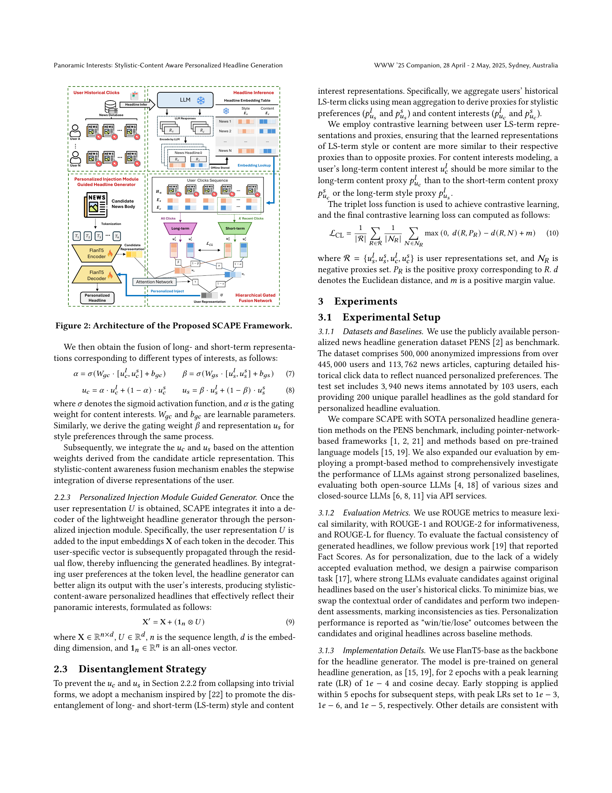
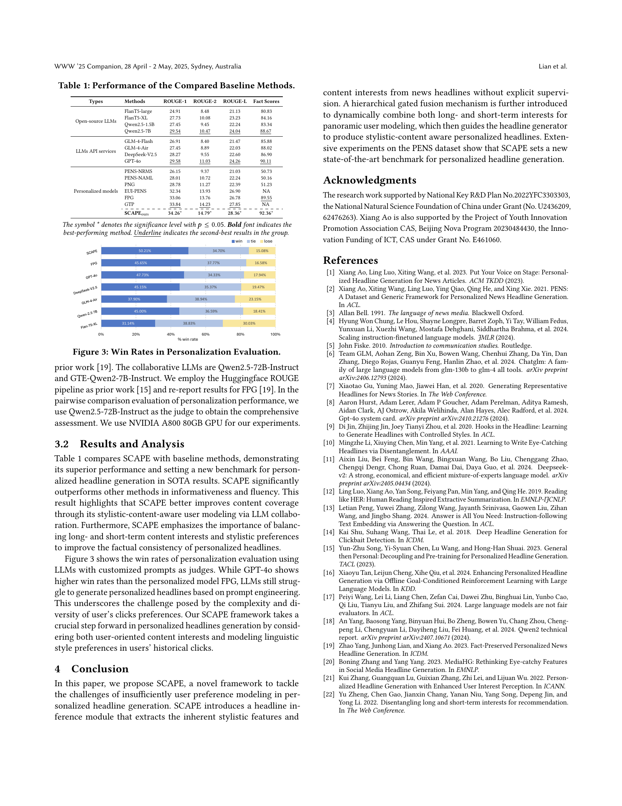

 


 2501.11900 
 Junhong Lian et el. 
 
 🤗 2025-01-22 
 



↗ arXiv


↗ Hugging Face


↗ Papers with Code


### TL;DR



기존의 개인화된 뉴스 헤드라인 생성 연구는 주로 사용자의 콘텐츠 선호도에 초점을 맞춰, 스타일 선호도를 간과하는 경향이 있었습니다. 이는 사용자의 전반적인 관심사를 충분히 반영하지 못하여 최적의 개인화를 제공하지 못하는 문제점을 야기했습니다.

본 연구는 이러한 문제를 해결하기 위해, 스타일과 콘텐츠를 모두 고려하는 새로운 프레임워크인 SCAPE를 제안합니다.  SCAPE는 대규모 언어 모델(LLM)을 활용하여 헤드라인의 스타일 및 콘텐츠 특징을 추출하고, 대조 학습 기반의 계층적 융합 네트워크를 통해 장단기 사용자 관심사를 통합합니다. 실제 데이터셋을 이용한 실험 결과, SCAPE는 기존 방법보다 우수한 성능을 보였으며, 사용자의 스타일과 콘텐츠 선호도를 모두 만족하는 개인화된 헤드라인 생성이 가능함을 입증했습니다.



#### Key Takeaways


 사용자의 스타일 및 콘텐츠 선호도를 모두 고려한 새로운 개인화된 뉴스 헤드라인 생성 프레임워크(SCAPE) 제시 



 대규모 언어 모델(LLM)을 활용한 헤드라인의 스타일 및 콘텐츠 특징 추출 및 계층적 융합 네트워크를 통한 사용자 관심사 효과적 통합 



 실제 뉴스 데이터셋을 사용한 실험을 통해 SCAPE의 우수성 검증 및 향후 개인화된 콘텐츠 생성 연구에 대한 새로운 방향 제시 


#### Why does it matter?
본 논문은 **개인화된 뉴스 헤드라인 생성** 분야에서 **스타일과 콘텐츠 선호도를 모두 고려**하는 새로운 프레임워크를 제시하여 기존 연구의 한계를 극복하고 있습니다.  이는 사용자의 관심사를 더욱 정확하게 반영하는 헤드라인 생성을 가능하게 하여, **뉴스 추천 시스템 및 개인화된 콘텐츠 제공 서비스의 질적 향상**에 크게 기여할 수 있습니다. 특히, **대규모 언어 모델(LLM)**을 활용하여 헤드라인의 스타일과 콘텐츠 특징을 추출하고, 대조 학습 기반의 계층적 융합 네트워크를 통해 장단기 사용자 관심사를 효과적으로 통합하는 방법은 향후 연구에 귀중한 지침을 제공할 것입니다.  더불어, 실제 뉴스 데이터셋을 사용한 실험 결과는 SCAPE 프레임워크의 우수성을 명확히 보여주고 있으며,  향후 개인화된 콘텐츠 생성 연구에 새로운 방향을 제시할 것으로 예상됩니다.

------
#### Visual Insights


| Types | Methods | ROUGE-1 | ROUGE-2 | ROUGE-L | Fact Scores |
|---|---|---|---|---|---| 
| Open-source LLMs | FlanT5-large | 24.91 | 8.48 | 21.13 | 80.83 |
|  | FlanT5-XL | 27.73 | 10.08 | 23.23 | 84.16 |
|  | Qwen2.5-1.5B | 27.45 | 9.45 | 22.24 | 83.34 |
|  | Qwen2.5-7B | 29.54 | 10.47 | 24.04 | 88.67 |
| LLMs API services | GLM-4-Flash | 26.91 | 8.40 | 21.47 | 85.88 |
|  | GLM-4-Air | 27.45 | 8.89 | 22.03 | 88.02 |
|  | DeepSeek-V2.5 | 28.27 | 9.55 | 22.60 | 86.90 |
|  | GPT-4o | 29.58 | 11.03 | 24.26 | 90.11 |
| Personalized models | PENS-NRMS | 26.15 | 9.37 | 21.03 | 50.73 |
|  | PENS-NAML | 28.01 | 10.72 | 22.24 | 50.16 |
|  | PNG | 28.78 | 11.27 | 22.39 | 51.23 |
|  | EUI-PENS | 32.34 | 13.93 | 26.90 | NA |
|  | FPG | 33.06 | 13.76 | 26.78 | 89.55 |
|  | GTP | 33.84 | 14.23 | 27.85 | NA |
|  | **SCAPE**ours | **34.26*** | **14.79*** | **28.36*** | **92.36*** |

> 🔼 표 1은 본 논문에서 제안된 SCAPE 모델의 성능을 기준으로 비교 분석한 다양한 기준 모델들의 성능을 보여줍니다.  ROUGE-1, ROUGE-2, ROUGE-L 점수는 생성된 헤드라인의 품질(일치도 및 유창성)을 평가하는 지표이며, Fact Score는 사실 정확도를 나타냅니다.  기준 모델들은 오픈소스 및 클로즈드소스 대규모 언어 모델(LLM), 기존의 개인화 뉴스 헤드라인 생성 방법 등 다양하게 구성되어 있습니다.  각 모델의 성능을 비교하여 SCAPE 모델의 우수성을 보여주는 표입니다.
> 

> 
read the caption

> Table 1. Performance of the Compared Baseline Methods.
> 

### Full paper



