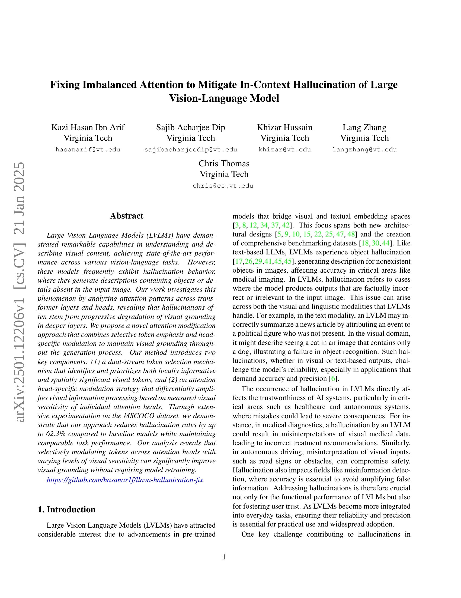
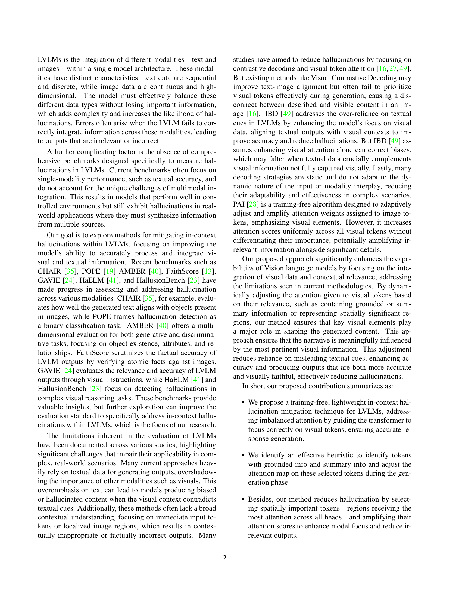
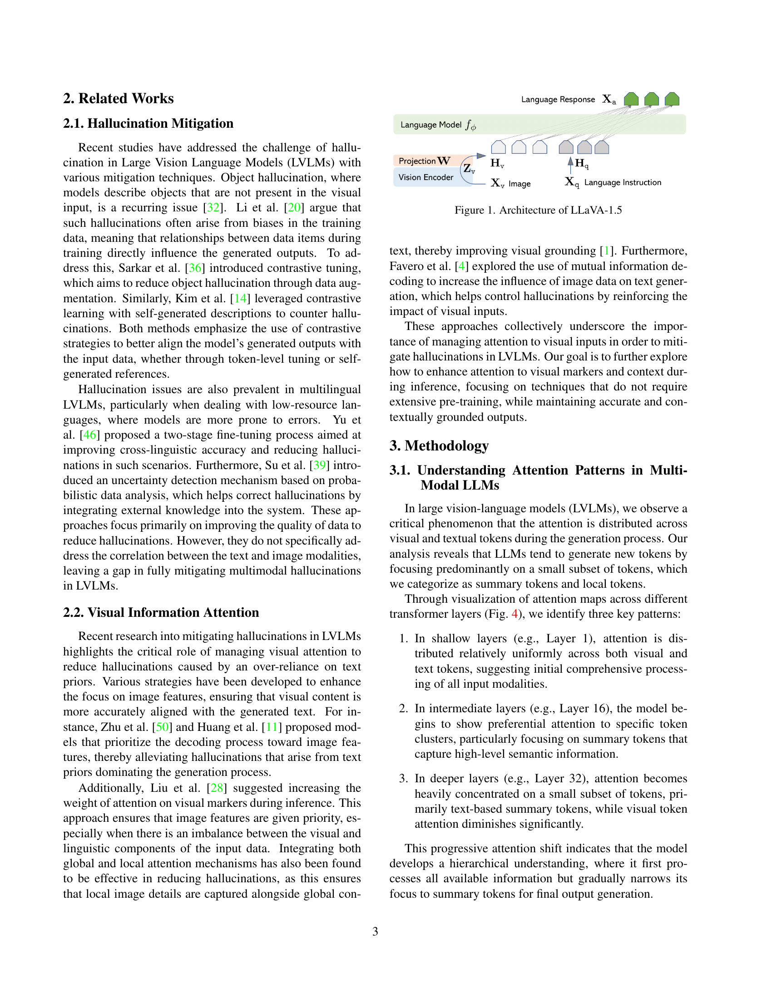
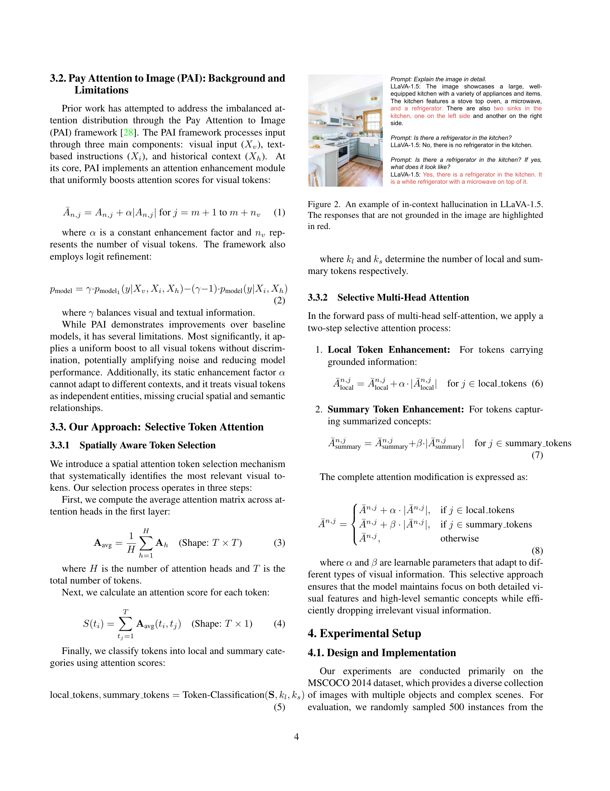
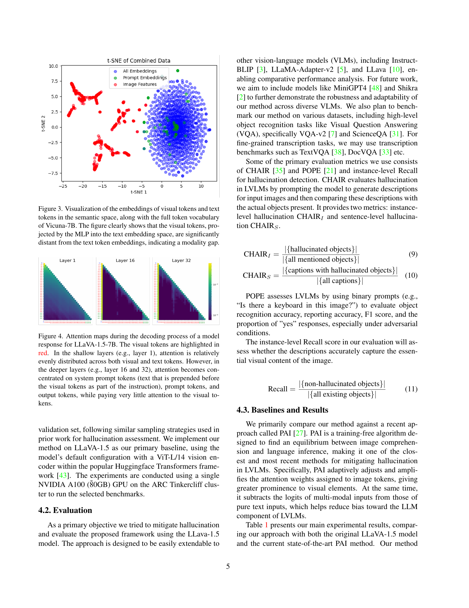
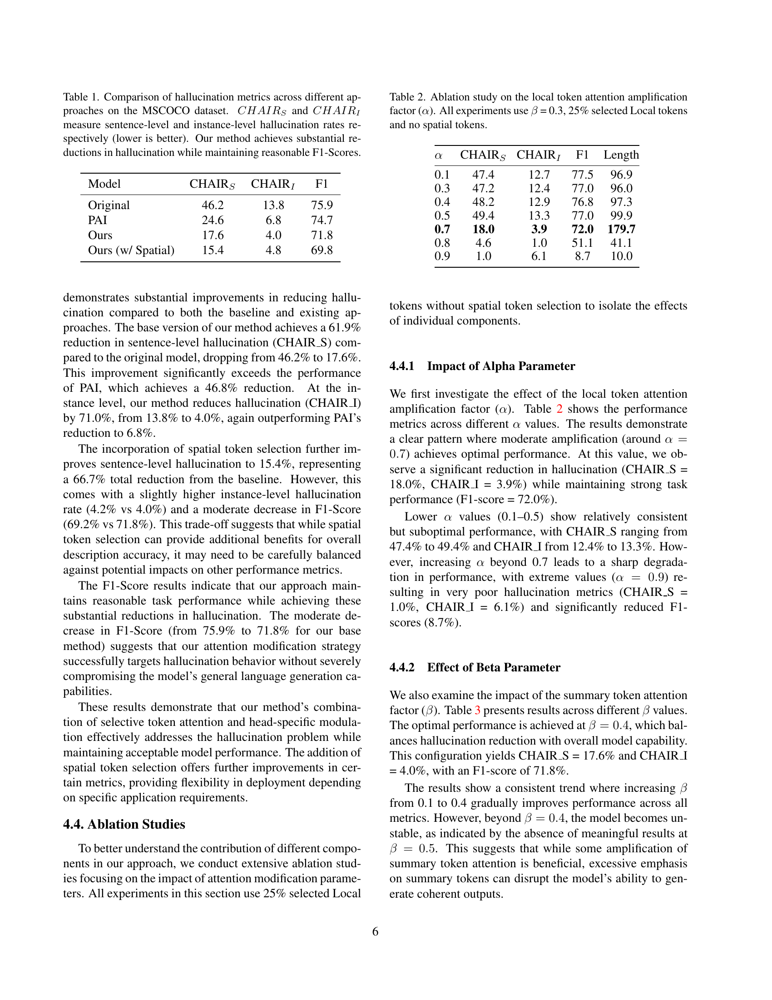
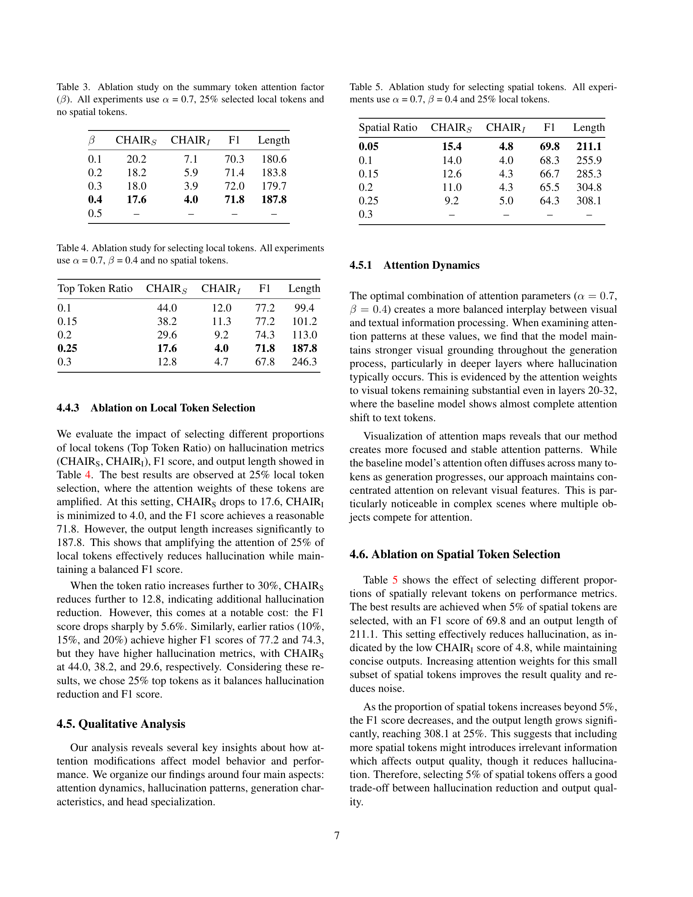
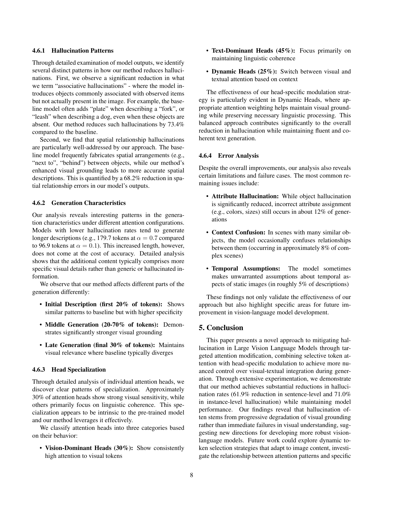
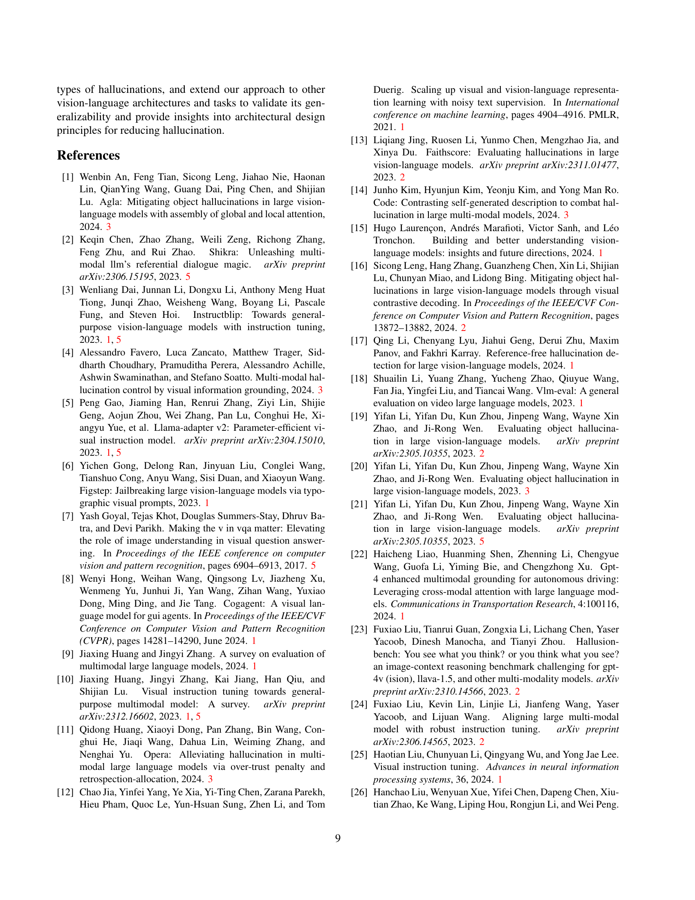
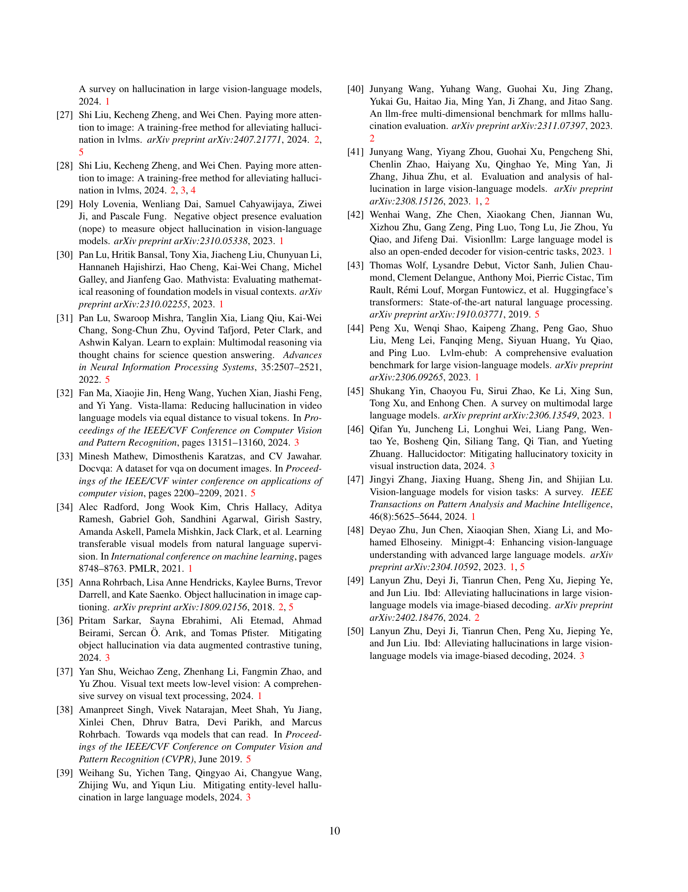

 


 2501.12206 
 Kazi Hasan Ibn Arif et el. 
 
 🤗 2025-01-22 
 



↗ arXiv


↗ Hugging Face


↗ Papers with Code


### TL;DR



대규모 비전-언어 모델(LLM)은 이미지를 이해하고 묘사하는 뛰어난 능력을 보여주지만, 실제로는 존재하지 않는 객체나 세부 정보를 생성하는 '환각' 현상을 자주 보입니다. 이는 의료 영상 분석이나 자율 주행과 같이 정확성이 중요한 분야에서 심각한 문제를 일으킬 수 있습니다. 기존 연구들은 주로 데이터 증강이나 대조 학습 등을 통해 환각 문제를 완화하려 했지만, 그 효과는 제한적이었습니다. 

본 논문에서는 LLM의 어텐션 메커니즘에 초점을 맞춰, 시각 정보 처리의 불균형을 해결하는 새로운 방법을 제시합니다. 이 방법은 중요한 시각적 토큰을 선택적으로 강조하고, 각 어텐션 헤드의 시각적 민감도에 따라 시각 정보 처리를 차등적으로 증폭시키는 두 가지 핵심 구성 요소를 사용합니다.  MSCOCO 데이터셋에서 실험한 결과, 제안된 방법은 기존 방법보다 환각률을 최대 62.3%까지 줄이고, 동시에 비슷한 수준의 작업 성능을 유지하는 것으로 나타났습니다.



#### Key Takeaways


 훈련 없이도 **비전-언어 모델의 환각 문제를 최대 62.3%까지 감소**시키는 새로운 어텐션 수정 기법 제시 



 **선택적 토큰 강조 및 헤드별 변조 기법**을 통해 시각적 기반을 유지하면서 환각을 줄임 



 MSCOCO 데이터셋 실험을 통해 **기존 모델과 유사한 성능**을 유지하면서 **환각률 감소 효과 검증** 


#### Why does it matter?
본 논문은 **대규모 비전-언어 모델(LLM)**에서 발생하는 환각 문제를 해결하기 위한 새로운 방법을 제시하여, **의료 영상 분석, 자율 주행 등 다양한 분야**에서 LLM의 신뢰성과 정확성을 향상시키는 데 중요한 의미를 가집니다. 이 연구는 **훈련 없이도 환각을 줄이는 경량화된 방법**을 제안함으로써,  LLM 개발 및 적용에 있어 실용적인 해결책을 제공하고,  **추후 연구를 위한 새로운 방향**을 제시합니다.  이는 LLM의 실제 응용을 가속화하고, 더욱 안전하고 신뢰할 수 있는 AI 시스템 구축에 기여할 것입니다.

------
#### Visual Insights

> 🔼 LLaVA-1.5 모델의 아키텍처를 보여주는 그림입니다.  그림에는 이미지 인코더, 언어 모델, 그리고 이 둘을 연결하는 투영(Projection) 레이어가 포함되어 있습니다. 이미지 인코더는 이미지를 입력받아 특징 벡터를 추출하고, 언어 모델은 이 벡터와 함께 언어 명령어를 사용하여 텍스트 응답을 생성합니다.  투영 레이어는 이미지와 텍스트 정보를 통합하는 역할을 합니다.  이 그림은 LLaVA-1.5 모델이 이미지와 텍스트를 효과적으로 결합하여 비전-언어 작업을 수행하는 방식을 시각적으로 보여줍니다.
> 

> 
read the caption

> Figure 1: Architecture of LLaVA-1.5
> 


| Model | CHAIRS | CHAIRI | F1 |
|---|---|---|---| 
| Original | 46.2 | 13.8 | 75.9 |
| PAI | 24.6 | 6.8 | 74.7 |
| Ours | 17.6 | 4.0 | 71.8 |
| Ours (w/ Spatial) | 15.4 | 4.8 | 69.8 |

> 🔼 표 1은 MSCOCO 데이터셋에서 서로 다른 접근 방식에 대한 환각 메트릭 비교를 보여줍니다.  CHAIR_S와 CHAIR_I는 각각 문장 수준과 인스턴스 수준의 환각 비율을 측정하며, 낮을수록 좋습니다. 본 연구의 방법은 F1 점수를 유지하면서 환각을 상당히 줄이는 것을 보여줍니다.
> 

> 
read the caption

> Table 1: Comparison of hallucination metrics across different approaches on the MSCOCO dataset. C⁢H⁢A⁢I⁢RS𝐶𝐻𝐴𝐼subscript𝑅𝑆CHAIR_{S}italic_C italic_H italic_A italic_I italic_R start_POSTSUBSCRIPT italic_S end_POSTSUBSCRIPT and C⁢H⁢A⁢I⁢RI𝐶𝐻𝐴𝐼subscript𝑅𝐼CHAIR_{I}italic_C italic_H italic_A italic_I italic_R start_POSTSUBSCRIPT italic_I end_POSTSUBSCRIPT measure sentence-level and instance-level hallucination rates respectively (lower is better). Our method achieves substantial reductions in hallucination while maintaining reasonable F1-Scores.
> 

### In-depth insights

#### Imbalanced Attention
본 논문에서 다루는 불균형적 어텐션(Imbalanced Attention)은 **대규모 비전-언어 모델(LVLMs)**에서 **이미지와 텍스트 정보의 통합 과정에서 발생하는 중요한 문제**를 지적합니다.  LVLMs는 이미지의 시각적 정보와 텍스트 설명 간의 상호작용을 통해 작업을 수행하는데, 이때 어텐션 메커니즘은 시각 정보와 언어 정보 간의 관계를 학습하는 중요한 역할을 합니다.  하지만, 논문은 **심층 신경망의 하위 레이어에서는 이미지 정보에 대한 어텐션이 고르게 분포**되지만, **상위 레이어로 갈수록 텍스트 정보에 대한 어텐션이 과도하게 집중**되는 현상을 관찰했습니다.  **이러한 불균형은 모델이 이미지에 없는 객체나 세부 정보를 생성하는 환각(hallucination) 현상의 주요 원인**으로 작용합니다. 따라서, 본 연구는 이러한 불균형적 어텐션을 해결하기 위해 **선택적 토큰 강조 및 헤드별 조절**이라는 새로운 어텐션 수정 기법을 제안하며, **시각적 토큰의 중요도를 차등적으로 증폭**시켜 시각적 기반을 유지하는 데 중점을 둡니다. 이를 통해 **환각률을 감소시키면서도 과제 수행 성능을 유지**할 수 있음을 실험적으로 보여줍니다.

#### Selective Token Emphasis
선택적 토큰 강조는 시각적 정보와 텍스트 정보 간의 불균형을 해결하기 위한 핵심 전략입니다. **이 방법은 시각적 내용에 대한 모델의 집중도를 높여 환각을 줄이는 데 효과적**입니다.  이는 단순히 모든 시각적 토큰에 가중치를 부여하는 것이 아니라, **실제 이미지 내의 중요한 시각적 정보를 담고 있는 토큰을 선택적으로 강조**함으로써 이루어집니다.  **이러한 선택적 강조는 모델이 시각적 정보에 집중하고 텍스트 편향에 덜 의존하게 하여 환각을 효과적으로 감소**시킬 수 있습니다.  **본 논문에서는 공간적 중요성과 의미적 중요성을 동시에 고려하여 중요한 시각적 토큰을 식별하는 기준**을 제시합니다.  이를 통해 단순히 모든 시각 토큰에 동일한 가중치를 부여하는 단순한 접근 방식의 한계를 극복하고, 더욱 정확하고 효율적인 환각 감소를 달성할 수 있습니다.  **결과적으로, 선택적 토큰 강조 기법은 환각 문제를 효과적으로 해결하며, 시각 언어 모델의 신뢰성과 정확성을 향상**시키는 데 크게 기여할 것으로 예상됩니다.

#### Head-Specific Modulation
본 논문에서 제안하는 'Head-Specific Modulation' 기법은 **어텐션 헤드의 시각적 민감도**에 따라 시각 정보 처리를 차등적으로 증폭하는 전략입니다.  이는 단순히 모든 시각 토큰에 일괄적으로 어텐션 점수를 높이는 기존 방식과 달리, **각 헤드의 특성**을 고려하여 시각 정보를 보다 효과적으로 활용합니다. 특히, 시각 정보에 대한 민감도가 높은 헤드의 경우 시각 토큰에 대한 어텐션을 더욱 강화하여, **시각적 지각 능력**을 향상시키는 것을 목표로 합니다.  **시각적 지각 능력의 향상**은 궁극적으로 맥락 내 환각을 줄이는 데 기여하며,  **모델의 신뢰도와 정확도**를 높일 것으로 기대됩니다.  **이 기법의 핵심은** 단순한 어텐션 조정을 넘어서, 모델의 다양한 헤드가 시각 정보와 텍스트 정보를 통합하는 방식을 개선하는데 있습니다.  **실험 결과는** 이러한 차등적 조정이 환각 감소에 상당한 효과가 있음을 보여주며,  **성능 저하 없이** 환각률을 크게 줄이는 데 성공했습니다.  결과적으로 Head-Specific Modulation은 **모델 재훈련 없이** 맥락 내 환각 문제를 해결하는 효과적이고 효율적인 방법론임을 시사합니다.

#### Hallucination Mitigation
이 논문은 큰 비전 언어 모델(LLM)에서의 환각(hallucination) 문제를 다룹니다. 환각은 모델이 입력 이미지에 없는 객체나 세부 정보를 생성하는 현상을 말하며, 특히 의료 영상이나 자율 주행과 같이 정확성이 중요한 분야에서 심각한 문제가 됩니다. **본 논문에서는 이러한 환각을 완화하기 위한 다양한 방법들이 제시되었으며, 특히 주의(attention) 메커니즘의 불균형을 해결하는 데 초점을 맞춥니다.** 기존 연구에서는 주로 텍스트 정보에 의존하여 환각이 발생하는 문제를 지적하고, 이를 해결하기 위해 시각적 정보에 대한 주의를 증가시키는 방법들이 제안되었습니다. 하지만 이러한 방법들은 모든 시각적 토큰에 동일한 가중치를 부여하여, 오히려 불필요한 정보까지 증폭시키는 한계를 가지고 있습니다. **본 논문에서는 이러한 문제점을 극복하기 위해, 선택적 토큰 강조 및 헤드 특이적 변조를 결합한 새로운 주의 수정 방법을 제안합니다.** 이 방법은 시각적으로 중요한 토큰과 공간적으로 중요한 토큰을 식별하고 우선순위를 부여하여, 생성 과정 전반에 걸쳐 시각적 기반을 유지하는 데 도움을 줍니다. 실험 결과, 제안된 방법은 기존 모델에 비해 환각률을 최대 62.3%까지 줄이는 동시에 비슷한 수준의 성능을 유지하는 것으로 나타났습니다. **본 연구는 주의 메커니즘의 불균형을 해결함으로써 LLM의 환각 문제를 효과적으로 완화할 수 있는 새로운 방향을 제시합니다.**

#### Future Directions
미래 연구 방향은 **시각적 기반 강화**와 **다양한 유형의 환각 문제 해결**에 초점을 맞춰야 합니다.  **다양한 시각 정보 처리 전략**을 통해 시각적 맥락을 더욱 정교하게 이해하고, **모델의 주의 기전을 개선**하여 시각 정보와 텍스트 정보 간의 균형을 맞추는 것이 중요합니다. 특히, **공간적 관계나 시간적 흐름에 대한 환각**을 줄이는 연구가 필요하며, **복잡한 시각적 추론 과제**에 대한 모델의 성능 향상도 중요한 과제입니다.  또한, **다양한 데이터셋 및 평가 지표**를 활용하여 모델의 성능을 객관적으로 평가하고, **실제 응용 환경에서의 성능 검증**을 통해 실용성을 높이는 연구가 필요합니다.  **모델의 투명성을 높이는 연구**는 신뢰도 향상에 기여할 수 있으며, 이를 위해 **주의 메커니즘의 해석 가능성을 향상**시키는 연구가 중요합니다. 마지막으로, **새로운 모델 아키텍처 및 학습 전략**을 개발하여 보다 효과적이고 효율적인 환각 감소 방안을 모색하는 연구가 필요합니다.

### More visual insights

More on figures

> 🔼 그림 2는 LLaVA-1.5 모델의 문맥 내 환각 현상을 보여주는 예시입니다.  사용자의 질문에 대한 모델의 응답 중 이미지에 근거하지 않은 부분(환각)은 빨간색으로 강조 표시되어 있습니다.  첫 번째 질문은 주방에 있는 물건들을 자세히 설명하는 것이었고, 두 번째와 세 번째 질문은 냉장고의 존재 여부와 모양에 대한 질문이었습니다.  모델은 첫 번째 질문에는 이미지를 정확하게 묘사하지만, 두 번째 질문에서는 냉장고가 없다고 잘못된 답변을 하고, 세 번째 질문에서는 냉장고가 있지만 실제 이미지와 다른 모습으로 묘사하는 오류를 보여줍니다. 이는 모델이 이미지 정보를 정확하게 이해하고 활용하지 못하고, 문맥에 맞지 않는 정보를 생성하는 환각 현상의 예시를 보여줍니다.
> 

> 
read the caption

> Figure 2: An example of in-context hallucination in LLaVA-1.5. The responses that are not grounded in the image are highlighted in red.
> 

> 🔼 그림 3은 Vicuna-7B의 전체 토큰 어휘와 함께 의미 공간에서 시각 토큰과 텍스트 토큰의 임베딩을 시각화한 것입니다. MLP에 의해 텍스트 임베딩 공간으로 투영된 시각 토큰이 텍스트 토큰 임베딩과 상당히 멀리 떨어져 있음을 명확하게 보여주어, 모달리티 간격(modality gap)이 있음을 나타냅니다. 즉, 시각 정보와 언어 정보 간의 표현 공간 차이가 크다는 것을 의미합니다. 이는 시각 언어 모델이 시각 정보와 언어 정보를 효과적으로 통합하는 데 어려움을 겪을 수 있음을 시사합니다.
> 

> 
read the caption

> Figure 3: Visualization of the embeddings of visual tokens and text tokens in the semantic space, along with the full token vocabulary of Vicuna-7B. The figure clearly shows that the visual tokens, projected by the MLP into the text embedding space, are significantly distant from the text token embeddings, indicating a modality gap.
> 

> 🔼 그림 4는 LLaVA-1.5-7B 모델의 응답 생성 과정에서의 어텐션 맵을 보여줍니다. 빨간색으로 강조된 부분이 시각 토큰입니다. 얕은 레이어(예: 레이어 1)에서는 시각 토큰과 텍스트 토큰 모두에 걸쳐 어텐션이 비교적 고르게 분포되어 있습니다. 그러나 깊은 레이어(예: 레이어 16과 32)에서는 시각 토큰 앞에 추가된 시스템 프롬프트 토큰, 프롬프트 토큰 및 출력 토큰에 어텐션이 집중되는 반면, 시각 토큰에는 거의 어텐션이 주어지지 않습니다.
> 

> 
read the caption

> Figure 4: Attention maps during the decoding process of a model response for LLaVA-1.5-7B. The visual tokens are highlighted in red. In the shallow layers (e.g., layer 1), attention is relatively evenly distributed across both visual and text tokens. However, in the deeper layers (e.g., layer 16 and 32), attention becomes concentrated on system prompt tokens (text that is prepended before the visual tokens as part of the instruction), prompt tokens, and output tokens, while paying very little attention to the visual tokens.
> 

More on tables


| α | CHAIRS | CHAIRI | F1 | Length |
|---|---|---|---|---|
| 0.1 | 47.4 | 12.7 | 77.5 | 96.9 |
| 0.3 | 47.2 | 12.4 | 77.0 | 96.0 |
| 0.4 | 48.2 | 12.9 | 76.8 | 97.3 |
| 0.5 | 49.4 | 13.3 | 77.0 | 99.9 |
| **0.7** | **18.0** | **3.9** | **72.0** | **179.7** |
| 0.8 | 4.6 | 1.0 | 51.1 | 41.1 |
| 0.9 | 1.0 | 6.1 | 8.7 | 10.0 |
> 🔼 표 2는 지역 토큰 주의 증폭 계수(α)에 대한 절제 연구 결과를 보여줍니다. 모든 실험은 β=0.3, 선택된 지역 토큰의 25%, 그리고 공간 토큰 없이 진행되었습니다.  α 값을 변화시키면서, 문장 수준 환각(CHAIRS), 인스턴스 수준 환각(CHAIRI), F1 점수 및 생성된 텍스트의 길이에 미치는 영향을 분석했습니다. 이를 통해 지역 토큰 주의 증폭의 최적 값과 과도한 증폭이 모델 성능에 미치는 부정적 영향을 확인할 수 있습니다.
> 

> 
read the caption

> Table 2: Ablation study on the local token attention amplification factor (α𝛼\alphaitalic_α). All experiments use β𝛽\betaitalic_β = 0.3, 25% selected Local tokens and no spatial tokens.
> 


| β | CHAIRS | CHAIRI | F1 | Length |
|---|---|---|---|---|
| 0.1 | 20.2 | 7.1 | 70.3 | 180.6 |
| 0.2 | 18.2 | 5.9 | 71.4 | 183.8 |
| 0.3 | 18.0 | 3.9 | 72.0 | 179.7 |
| **0.4** | **17.6** | **4.0** | **71.8** | **187.8** |
| 0.5 | – | – | – | – |
> 🔼 표 3은 요약 토큰 어텐션 계수(β)에 대한 추가 분석 결과를 보여줍니다.  모든 실험은 국소 토큰의 25%를 선택하고 공간 토큰은 사용하지 않으며, 알파(α) 값은 0.7로 고정했습니다.  이 표는 β 값을 다르게 설정했을 때, 문장 수준의 환각 비율(CHAIRS), 인스턴스 수준의 환각 비율(CHAIRI), F1 점수, 그리고 생성된 텍스트의 길이에 어떤 영향을 미치는지 보여줍니다.  β 값에 따른 성능 변화를 분석하여 최적의 β 값을 찾고자 하는 실험입니다.
> 

> 
read the caption

> Table 3: Ablation study on the summary token attention factor (β𝛽\betaitalic_β). All experiments use α𝛼\alphaitalic_α = 0.7, 25% selected local tokens and no spatial tokens.
> 


| Top Token Ratio | CHAIRS | CHAIRI | F1 | Length |
|---|---|---|---|---|
| 0.1 | 44.0 | 12.0 | 77.2 | 99.4 |
| 0.15 | 38.2 | 11.3 | 77.2 | 101.2 |
| 0.2 | 29.6 | 9.2 | 74.3 | 113.0 |
| **0.25** | **17.6** | **4.0** | **71.8** | **187.8** |
| 0.3 | 12.8 | 4.7 | 67.8 | 246.3 |
> 🔼 표 4는 지역 토큰 선택에 대한 ablation 연구 결과를 보여줍니다. 모든 실험에서 α는 0.7, β는 0.4로 설정되었고, 공간 토큰은 사용되지 않았습니다.  이 표는 상위 토큰 비율(Top Token Ratio)을 변화시키면서 hallucination 지표(CHAIRS, CHAIRI), F1 점수, 출력 길이가 어떻게 변하는지 보여줍니다.  다양한 상위 토큰 비율에서 모델의 성능을 비교하여 최적의 지역 토큰 선택 비율을 찾는 실험 결과를 제시합니다.
> 

> 
read the caption

> Table 4: Ablation study for selecting local tokens. All experiments use α𝛼\alphaitalic_α = 0.7, β𝛽\betaitalic_β = 0.4 and no spatial tokens.
> 


| Spatial Ratio | CHAIRS | CHAIRI | F1 | Length |
|---|---|---|---|---|
| **0.05** | **15.4** | **4.8** | **69.8** | **211.1** |
| 0.1 | 14.0 | 4.0 | 68.3 | 255.9 |
| 0.15 | 12.6 | 4.3 | 66.7 | 285.3 |
| 0.2 | 11.0 | 4.3 | 65.5 | 304.8 |
| 0.25 | 9.2 | 5.0 | 64.3 | 308.1 |
| **0.3** | **–** | **–** | **–** | **–** |
> 🔼 표 5는 공간 토큰 선택에 대한 ablation 연구 결과를 보여줍니다. 모든 실험은 국소 토큰의 25%와 함께 α=0.7, β=0.4를 사용합니다.  공간 비율을 0.05에서 0.25까지 변화시키면서 CHAIRS, CHAIRI, F1 점수, 길이 등의 지표가 어떻게 변하는지 보여주는 실험 결과입니다. 이를 통해 공간 토큰 선택 비율이 성능에 미치는 영향을 분석합니다.
> 

> 
read the caption

> Table 5: Ablation study for selecting spatial tokens. All experiments use α𝛼\alphaitalic_α = 0.7, β𝛽\betaitalic_β = 0.4 and 25% local tokens.
> 

### Full paper



