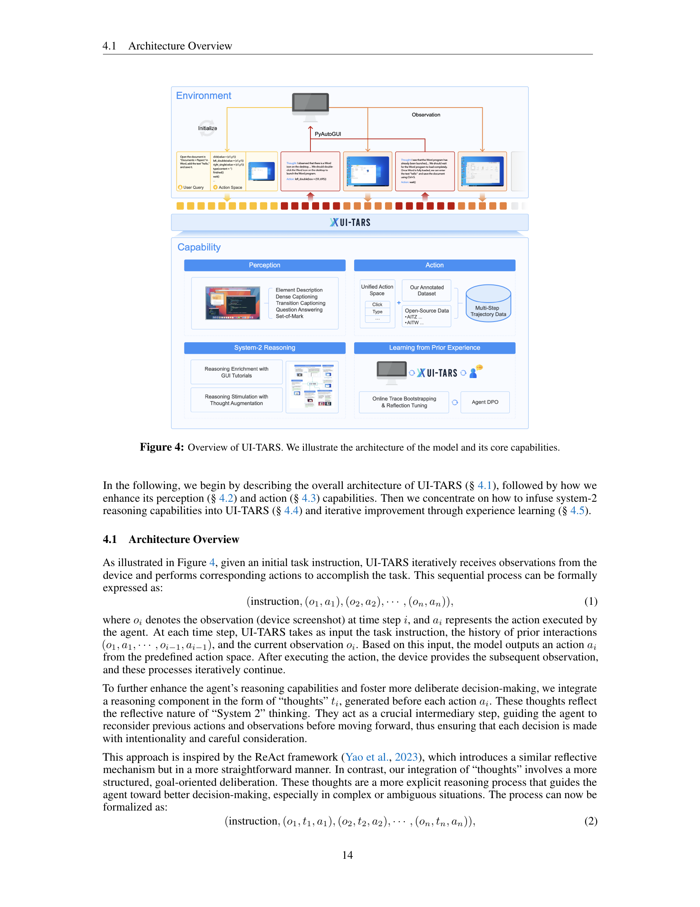

 


 2501.12326 
 Yujia Qin et el. 
 
 🤗 2025-01-22 
 



↗ arXiv


↗ Hugging Face


↗ Papers with Code


### TL;DR



본 논문은 기존의 GUI 에이전트 프레임워크가 **전문 모델과 복잡한 워크플로우에 의존**하는 반면, **스크린샷만으로 사람과 같은 상호 작용**을 수행하는 **종단 간 네이티브 GUI 에이전트 모델인 UI-TARS**를 소개합니다.  UI-TARS는 지각, 접지, GUI 작업 실행을 평가하는 10개 이상의 GUI 에이전트 벤치마크에서 **최첨단 성능**을 달성하여, 기존 프레임워크를 능가하는 성능을 보여줍니다. 특히, OSWorld 벤치마크에서 UI-TARS는 Claude보다 뛰어난 성적을 거두었습니다.

UI-TARS의 성공은 **향상된 지각 능력, 통합된 행동 모델링, 시스템-2 추론, 반성적 온라인 추적을 통한 반복 학습**이라는 네 가지 핵심 혁신에 기반합니다.  UI-TARS는 **방대한 GUI 스크린샷 데이터셋을 활용**하여 UI 요소를 정확하게 파악하고, 플랫폼 간의 행동을 표준화하여 정확한 접지와 상호 작용을 달성하며, 다단계 의사결정에 신중한 추론을 통합하고, 수백 대의 가상 머신에서 상호 작용 추적을 자동으로 수집하고 정제하여 데이터 부족 문제를 해결합니다. **UI-TARS는 오픈소스로 공개**되어, GUI 에이전트 분야의 발전에 기여할 것으로 기대됩니다.



#### Key Takeaways


 UI-TARS는 스크린샷만을 입력으로 사용하여 사람과 유사한 방식으로 GUI와 상호 작용하는 최초의 네이티브 에이전트 모델입니다. 



 UI-TARS는 향상된 지각, 통합된 행동 모델링, 시스템-2 추론, 반성적 온라인 추적을 통한 반복 학습 등 여러 가지 혁신적인 기능을 통합하여 기존의 최첨단 프레임워크를 능가하는 성능을 보여줍니다. 



 UI-TARS는 다양한 GUI 벤치마크에서 최첨단 성능을 달성하여, 다양한 플랫폼과 환경에서의 자율적인 GUI 상호 작용을 가능하게 하는 잠재력을 입증했습니다. 


#### Why does it matter?
본 논문은 **GUI 에이전트의 발전 방향을 제시**하고, **기존의 한계점을 극복**하는 새로운 모델인 UI-TARS를 제안하여 **자율적인 GUI 상호작용**을 가능하게 했습니다. 이는 **인간의 개입을 최소화**하고 **일반화 성능을 극대화**하는 데 크게 기여하며, **다양한 GUI 환경에서의 자동화된 작업 수행**에 대한 새로운 가능성을 열었습니다. 또한, 제시된 방법론과 UI-TARS 모델은 **향후 연구의 기반**이 될 수 있으며, **자율 에이전트 및 인공지능 분야**에 혁신적인 영향을 미칠 것으로 예상됩니다.

------
#### Visual Insights

> 🔼 그림 1은 UI-TARS가 사용자의 항공권 검색을 돕는 과정을 보여주는 예시입니다. 사용자는 '다음 달 5일 시애틀에서 뉴욕으로 가는 왕복 항공권을 가격순으로 정렬하여 찾아줘' 라는 질문을 입력합니다. UI-TARS는 화면의 스크린샷만을 입력으로 받아들여 마치 사람처럼 키보드와 마우스를 조작하여 질문에 대한 답을 찾아냅니다. 그림에서는 출발 도시, 목적지, 날짜 선택, 가격 필터링 등의 단계를 거쳐 최종적으로 원하는 항공권 정보를 찾는 UI-TARS의 동작 과정을 시각적으로 보여줍니다. 각 단계마다 UI-TARS가 수행하는 사고 과정(Thought)과 행동(Action)을 함께 제시하여 UI-TARS의 내부 동작 원리를 이해하기 쉽도록 설명하고 있습니다. 특히, '시행착오(Trial and error)'와 '반성(Reflection)' 과정을 거쳐 문제 해결에 도달하는 점을 강조합니다. 이는 UI-TARS가 단순히 명령을 수행하는 것이 아니라 스스로 학습하고 적응하는 지능형 에이전트임을 보여줍니다.
> 

> 
read the caption

> Figure 1: A demo case of UI-TARS that helps user to find flights.
> 


| Environment | Action | Definition |
|---|---|---|
| **Shared** | Click(x, y) | Clicks at coordinates (x, y). |
|  | Drag(x1, y1, x2, y2) | Drags from (x1, y1) to (x2, y2). |
|  | Scroll(x, y, direction) | Scrolls at (x, y) in the given direction. |
|  | Type(content) | Types the specified content. |
|  | Wait() | Pauses for a brief moment. |
|  | Finished() | Marks the task as complete. |
|  | CallUser() | Requests user intervention. |
| **Desktop** | Hotkey(key) | Presses the specified hotkey. |
|  | LeftDouble(x, y) | Double-clicks at (x, y). |
|  | RightSingle(x, y) | Right-clicks at (x, y). |
| **Mobile** | LongPress(x, y) | Long presses at (x, y). |
|  | PressBack() | Presses the “back” button. |
|  | PressHome() | Presses the “home” button. |
|  | PressEnter() | Presses the “enter” key. |

> 🔼 표 3은 논문에서 다루는 GUI 지각 벤치마크에 대한 결과를 보여줍니다.  VisualWebBench, WebSRC, ScreenQA-short 세 가지 벤치마크에 대한 UI-TARS 모델(UI-TARS-2B, UI-TARS-7B, UI-TARS-72B)과 기타 모델(Qwen2-VL-7B, Qwen-VL-Max, Gemini-1.5-Pro, UIX-Qwen2-7B, Claude-3.5-Sonnet, GPT-40)의 성능을 정확도를 비교하여 보여줍니다. 각 벤치마크는 GUI 이해 능력의 다른 측면을 평가하며, UI-TARS 모델은 모든 벤치마크에서 우수한 성능을 보임을 알 수 있습니다.
> 

> 
read the caption

> Table 3: Results on GUI Perception benchmarks.
> 

### In-depth insights

#### Native GUI Agent Rise
**네이티브 GUI 에이전트의 부상은 규칙 기반 시스템의 한계를 극복하고 인간의 개입을 최소화하는 지능형 자동화 시스템에 대한 요구 증가를 반영합니다.**  기존의 모듈형 에이전트 프레임워크는 전문가의 지식과 상당한 설계 노력에 의존하는 반면, **네이티브 접근 방식은 최신 딥러닝 기술을 활용하여 직접적으로 스크린샷을 이해하고 상호작용하며 더 나은 일반화 성능과 적응력을 제공합니다.** 이는 **더욱 정교한 지각 능력, 통합된 액션 모델링, 시스템 2 추론, 그리고 반복적인 온라인 학습을 통한 지속적인 개선**과 같은 혁신적인 발전을 통해 가능해졌습니다.  하지만, 네이티브 GUI 에이전트의 성공적인 구현에는 **데이터 부족 문제**가 여전히 큰 과제로 남아 있습니다.  대규모 고품질 데이터셋을 구축하고, 에이전트의 실수를 통해 학습하는 반복적인 세련화 과정, 그리고 인간의 개입을 최소화하는 적응형 모델링 기법들이 **향후 연구 및 발전 방향**을 제시합니다.  궁극적으로 네이티브 GUI 에이전트는 **다양한 애플리케이션에서 자동화와 접근성을 향상시키는 잠재력**을 가지고 있으며, 이는 지속적인 연구개발을 통해 더욱 현실화될 것입니다.

#### UI-TARS Architecture
UI-TARS의 아키텍처는 **스크린샷만을 입력으로 받아들여 사람과 같은 방식으로 GUI와 상호작용하는 에이전트 모델**임을 시사합니다. 기존의 전문 모델(예: GPT-40)에 의존하거나 복잡한 프롬프트나 워크플로우를 필요로 하는 다른 에이전트 프레임워크와 달리, UI-TARS는 **완전한 엔드투엔드 모델**입니다. 이는 **향상된 지각 능력, 통합된 액션 모델링, 시스템-2 추론, 그리고 반성적 온라인 추적을 통한 반복 학습**이라는 핵심 혁신을 통해 이루어집니다. 특히, **대규모 GUI 스크린샷 데이터셋을 활용한 강화된 지각 능력**은 UI 요소에 대한 맥락 인식과 정확한 캡션 생성을 가능하게 하고, **통합된 액션 모델링은 플랫폼 간의 정확한 접지 및 상호작용**을 보장합니다.  **시스템-2 추론은 다단계 의사결정에 있어 신중한 추론을 통합**하여 작업 분해, 반성적 사고, 이정표 인식 등 다양한 추론 패턴을 활용합니다.  마지막으로 **반성적 온라인 추적을 통한 반복 학습**은 수백 대의 가상 머신에서 새로운 상호작용 추적을 자동으로 수집, 필터링 및 개선하여 데이터 부족 문제를 해결합니다.  UI-TARS는 이러한 핵심 요소들을 결합하여 최소한의 인간 개입으로 예측 못한 상황에 적응하고 실수로부터 배우는 **적응력 있고 지속적으로 학습하는 모델**임을 보여줍니다.

#### Iterative Training
반복적 훈련은 **데이터 부족** 문제를 해결하기 위한 핵심 전략입니다.  **가상 머신을 수백 대 사용**하여 다양한 실제 작업을 수행하고 상호 작용 추적을 자동으로 수집, 필터링 및 정제함으로써 방대한 양의 훈련 데이터를 생성합니다. **오류 수정 및 사후 반성** 과정을 통해 에이전트는 실수로부터 배우고 예측하지 못한 상황에 적응하며 인간의 개입을 최소화합니다.  **반복적인 훈련과 반성 조정**을 통해 모델은 지속적으로 개선되고 성능이 향상됩니다. 이는 **데이터 기반 학습**의 핵심 원리를 보여주는 것으로, 에이전트가 대규모 데이터와 반복적인 피드백을 통해 학습하고 적응할 수 있음을 시사합니다.  **데이터 효율성**과 **모델의 일반화 능력 향상**에 기여하며,  **지속적인 자기 개선**을 가능하게 합니다.  따라서 반복적 훈련은 인공지능 에이전트의 발전에 중요한 역할을 합니다.

#### System-2 Reasoning
본 논문에서 제시된 'System-2 Reasoning'은 단순히 반응적인 행동을 넘어 **의도적이고 심사숙고된 추론 과정**을 GUI 에이전트에 통합하는 핵심 개념입니다.  이는 단순한 시스템1(직관적이고 빠른 사고) 추론만으로는 해결하기 어려운 복잡한 GUI 상호작용과 다단계 의사결정에 대응하기 위해 필수적입니다.  **작업 분해, 장기적 일관성 유지, 중간 목표 인식, 시행착오, 반추적 사고** 등 다양한 추론 패턴을 통합함으로써 에이전트는 복잡한 상황에서도 **의사결정의 정확성과 적응력을 높일** 수 있습니다.  특히, **반추적 온라인 추적 학습**을 통해 에이전트는 자신의 실수로부터 지속적으로 학습하고 미래 상황에 적응할 수 있게 됩니다. 이는 단순한 오류 수정을 넘어, 오류 발생 이후 상황을 재구성하고 최적의 행동 경로를 찾아 나가는 **능동적이고 자기 반성적인 학습 과정**을 의미합니다.  결과적으로, System-2 Reasoning은 인간 수준의 추론 능력을 모방하고, **예측 불가능한 상황에도 적응력 있게 대처하는** 고도로 지능적인 GUI 에이전트를 구축하는 데 중요한 역할을 합니다.  이는 단순히 효율성 증대뿐 아니라, **실제 환경에서의 안정성과 견고성**을 크게 향상시키는 핵심 요소입니다.

#### Future of GUI Agents
GUI 에이전트의 미래는 **지속적인 학습과 적응**에 달려 있습니다.  단순히 정적인 인터페이스와 상호 작용하는 것을 넘어, **동적인 환경 변화**에 유연하게 대처하고 **새로운 작업**을 스스로 학습하는 능력이 중요해질 것입니다.  이는 **강화 학습** 및 **자기 반성적 학습**과 같은 기법을 통해 가능해질 것으로 예상됩니다.  **에이전트의 지능**은 단순한 명령 수행을 넘어, 복잡한 작업을 **자율적으로 계획 및 실행**하는 수준으로 발전할 것입니다.  **다양한 플랫폼**에서의 상호 운용성 또한 중요하며, 이를 위해서는 **통합된 액션 모델**과 **표준화된 인터페이스**가 필요할 것입니다.  **인간-에이전트 협업** 또한 중요한 부분이며, 에이전트는 인간의 개입을 최소화하면서 효율적인 작업 수행을 지원하는 방향으로 발전할 것입니다.  궁극적으로, GUI 에이전트는 **인간의 생산성과 효율성**을 극대화하는 강력한 도구로 자리매김할 것입니다.  **데이터 기반의 지속적인 개선**을 통해 더욱 강력하고 유연한 시스템으로 진화할 것입니다.

### More visual insights

More on figures

> 🔼 그림 2는 GUI 에이전트의 발전 과정을 보여줍니다. 규칙 기반 에이전트에서 모듈형 에이전트 프레임워크, 네이티브 에이전트 모델, 그리고 향후 전망인 능동적이고 평생 학습하는 에이전트까지 GUI 에이전트의 진화 단계를 시간 순서대로 나타냅니다. 각 단계별로 인간의 개입 정도와 일반화 능력을 보여주는 대표적인 GUI 에이전트들이 시각적으로 제시되어 있습니다. 이 그림은 GUI 에이전트 기술의 발전 방향을 한눈에 이해하는 데 도움을 줍니다.
> 

> 
read the caption

> Figure 2: The evolution path for GUI agents.
> 

> 🔼 그림 3은 GUI 에이전트의 핵심 기능과 평가 방법을 개괄적으로 보여줍니다.  GUI 에이전트는 사용자 인터페이스와 상호 작용하여 작업을 수행하는 시스템으로, 지각(Perception), 행동(Action), 추론(Reasoning), 기억(Memory)의 네 가지 주요 능력이 필요합니다. 지각은 화면의 시각적 요소들을 이해하고 해석하는 능력을, 행동은 사용자 인터페이스와의 상호작용을 통해 작업을 수행하는 능력을 말합니다. 추론은 문제 해결을 위한 사고 과정을, 기억은 과거 경험과 지식을 저장하고 활용하는 능력을 의미합니다.  그림은 이러한 핵심 기능들을 시각적으로 보여주는 동시에, 각 기능의 평가 방법(지각 능력 평가, 기반 능력 평가, 오프라인 에이전트 능력 평가, 온라인 에이전트 능력 평가, 시스템 1 및 2 추론 비교) 또한 제시하고 있습니다.  즉, 그림은 GUI 에이전트의 기능을 이해하고 평가하는 데 필요한 요소들을 종합적으로 나타낸 것입니다.
> 

> 
read the caption

> Figure 3: An overview of core capabilities and evaluation for GUI agents.
> 

> 🔼 그림 4는 UI-TARS 모델의 아키텍처와 핵심 기능을 보여줍니다. 환경(Environment)에서 사용자 질의(User Query)를 받으면, UI-TARS는 관찰(Observation)을 통해 인터페이스 정보를 수집하고, 지각(Perception), 추론(Reasoning), 기억(Memory) 모듈을 활용하여 행동(Action)을 결정합니다. 이러한 과정은 순차적으로 반복되며, 각 단계마다 생성되는 생각(Thought)은 모델의 의사결정 과정을 투명하게 보여줍니다.  각 모듈은 UI 요소 식별, 좌표 확인, 작업 분해, 장기적 일관성 유지, 중간 목표 인식, 시행착오, 반성 등의 세부 기능을 포함합니다.  이러한 아키텍처를 통해 UI-TARS는 다양한 GUI 환경에서 복잡한 작업을 수행할 수 있습니다.
> 

> 
read the caption

> Figure 4: Overview of UI-TARS. We illustrate the architecture of the model and its core capabilities.
> 

> 🔼 그림 5는 논문의 Enhanced Perception for GUI Screenshots 섹션에 포함되어 있으며, GUI 요소의 다양한 시각적 특징을 보여주는 데이터 예시입니다. 이 그림은 객체 탐지, 객체 설명, 객체 기능, 위치 정보, 상태 변화 캡션, 질문 답변 등 다양한 시각적 이해 및 접지 작업에 필요한 데이터를 보여줍니다.  각각의 예시는 다양한 GUI 요소의 시각적 특징, 주변 요소와의 공간적 관계, 그리고 특정 요소의 기능을 설명하고 있습니다. 이는 UI-TARS 모델이 GUI 요소를 정확하게 인식하고 상호 작용하는 데 사용되는 데이터의 종류와 질을 보여줍니다.
> 

> 
read the caption

> Figure 5: Data example of perception and grounding data.
> 

> 🔼 표 1은 다양한 플랫폼에서 사용되는 통합된 작업 공간을 보여줍니다.  단순히 '클릭', '입력', '스크롤', '드래그' 와 같은 기본적인 작업뿐만 아니라 각 플랫폼(웹, 모바일, 데스크탑)의 특성을 고려한 플랫폼별 고유 작업도 포함하고 있습니다.  이러한 통합된 작업 공간은 다양한 플랫폼에서의 상호 작용을 표준화하여 에이전트의 일반화 능력을 향상시키는 데 중요한 역할을 합니다.  또한, 작업 완료('Finished()') 및 사용자 개입 필요('CallUser()')를 나타내는 특수 작업도 포함되어 있습니다.
> 

> 
read the caption

> Table 1: Unified action space for different platforms.
> 

> 🔼 표 2는 웹, 모바일 및 데스크톱과 같은 다양한 플랫폼에서 주석 처리된 데이터셋과 공개 데이터셋을 비교하여 기본 통계를 보여줍니다. 이 표는 접지 및 다단계 작업 추적 데이터의 기본 통계를 보여줍니다.  특히, 주석이 달린 데이터셋과 공개 데이터셋 모두에 대해 웹, 모바일 및 데스크톱 플랫폼에서 요소의 수(Ele.)와 작업 추적의 수(Trace)를 보고합니다.  이는 모델의 접지 및 다중 단계 작업 실행 능력을 평가하는 데 사용됩니다.  데이터셋의 크기와 플랫폼의 다양성은 모델의 일반화 성능에 영향을 미치는 중요한 요소입니다.
> 

> 
read the caption

> Table 2: Basic statistics for grounding and multi-step action trace data, comparing both our annotated dataset and open-source data across different platforms (web, mobile, and desktop). We report the number of elements (Ele.) and the number of action traces (Trace).
> 

> 🔼 그림 6은 논문의 증강된 사고 과정에서 다양한 추론 패턴들을 보여줍니다.  각각의 추론 유형은 이미지와 함께 제시되어 이해를 돕고 있으며, UI-TARS 모델이 복잡한 작업을 수행하는 과정에서 어떻게 여러 추론 전략(과제 분해, 장기적 일관성 유지, 이정표 인식, 시행착오, 반성)을 활용하는지 시각적으로 보여줍니다.  각각의 추론 유형은 특정 작업 시나리오와 함께 설명되어 UI-TARS의 의사결정 과정을 명확하게 보여줍니다.  이 그림은 UI-TARS 모델이 단순히 반응적인 행동을 넘어, 계획적이고 심사숙고한 의사결정을 하는 능력을 보여주는 중요한 시각자료입니다.
> 

> 
read the caption

> Figure 6: Various reasoning patterns in our augmented thought.
> 

> 🔼 그림 7은 UI-TARS 모델의 온라인 부트스트래핑 프로세스 개요를 보여줍니다.  이 과정은  실제 환경에서의 상호작용을 통해 모델을 지속적으로 개선하는 반복적인 과정입니다.  먼저, 사용자 질의나 모델이 생성한 지시사항을 바탕으로 다양한 가상 머신에서 작업이 수행됩니다. 이 과정에서 생성된 원시 추적 데이터는 몇 단계의 필터링 과정을 거칩니다. 규칙 기반 보상, VLM 점수 매기기, 그리고 사람의 검토를 통해 잡음이 제거되고 품질이 높은 데이터만 남습니다. 이렇게 필터링된 데이터는 UI-TARS 모델을 미세 조정하는 데 사용되며, 동시에 향후 반복 작업을 위한 지시사항 집합도 개선합니다.  특히, 잘못된 동작을 분석하고 수정하는 반성적 조정(Reflection Tuning) 단계가 포함되어 있어,  모델이 실수로부터 배우고 지속적으로 성능을 개선할 수 있도록 합니다.  이러한 반복적인 프로세스를 통해 UI-TARS는 최신 모델을 활용하여 새로운 추적 데이터를 지속적으로 생성하고, 그 데이터로 모델을 개선하는 방식으로 진화합니다.
> 

> 
read the caption

> Figure 7: Overview of the online bootstrapping process.
> 

> 🔼 그림 8은 제어 흐름(workflow)에 대한 사고 과정(thought)을 포함한 시스템 2 추론과 사고 과정을 배제한 시스템 1 추론의 성능을 보여줍니다.  도메인 내(Mind2Web, AndroidControl, GUI Odyssey) 및 도메인 외(AndroidWorld) 벤치마크에서 두 시스템의 성능을 비교합니다. 시스템 2 추론은 다단계 추론 과정을 통해 더욱 정교하고 반추적인 상호 작용을 가능하게 하지만, 단일 샘플 조건에서는 시스템 1 추론보다 성능이 떨어질 수 있음을 보여줍니다.  그러나 다양한 후보 출력을 제공하면 시스템 2 추론이 탁월한 성능을 보이며 복잡한 작업에 대한 적응성이 향상됨을 보여줍니다. 도메인 외 상황에서는 시스템 2 추론이 시스템 1 추론보다 훨씬 더 나은 성능을 보여주어 이러한 접근 방식의 일반화 가능성을 강조합니다.
> 

> 
read the caption

> Figure 8: Performance of system-1 (no-thought) and system-2 (with thought) in in-domain (Mind2Web, AndroidControl, GUI Odyssey) and out-of-domain (AndroidWorld) benchmarks.
> 

> 🔼 UI-TARS가 우분투 임프레스 환경에서 수행한 작업을 보여주는 그림입니다.  목표는 슬라이드 1의 제목 색상과 동일하게 슬라이드 2의 배경 색상을 만드는 것입니다. 그림은 UI-TARS가 이 작업을 수행하는 단계별 과정을 보여줍니다. 각 단계마다 UI-TARS가 취한 행동(예: 클릭, 입력)과 그 이유를 설명하는 생각 과정이 함께 제시되어 있습니다. 이를 통해 UI-TARS가 시각적 정보를 해석하고, 문제를 해결하기 위한 단계별 계획을 세우고, 목표 달성을 위해 적절한 조치를 취하는 과정을 자세하게 이해할 수 있습니다.  결과적으로 슬라이드 2의 배경 색상이 슬라이드 1의 제목 색상과 일치하는 것을 확인할 수 있습니다.
> 

> 
read the caption

> Figure 9: Test case on Ubuntu impress scene from UI-TARS. The task is: Make the background color of slide 2 same as the color of the title from slide 1.
> 

> 🔼 UI-TARS가 안드로이드 환경에서 '후지산 아래(富士山下)'라는 노래를 재생하는 작업을 수행하는 과정을 보여주는 그림입니다. 그림은 UI-TARS가 사용자의 요청을 이해하고, 안드로이드 기기의 음악 앱을 열고, 검색 기능을 사용하여 노래를 찾고, 재생하는 단계별 과정을 시각적으로 보여줍니다. 각 단계별로 UI-TARS가 생성한 생각(Thought)과 수행한 작업(Action)이 함께 표시되어 있어, UI-TARS의 추론 및 행동 과정을 자세히 이해하는 데 도움이 됩니다.  UI-TARS가 다양한 안드로이드 앱의 사용자 인터페이스와 상호 작용하는 능력과 복잡한 작업을 수행하는 능력을 보여주는 대표적인 예시입니다.
> 

> 
read the caption

> Figure 10: Test case on Android from UI-TARS. The task is: Play the song under Mount Fuji.
> 

> 🔼 그림 11은 UI-TARS가 Ubuntu 환경의 VS Code에서 autoDocstring 확장 프로그램을 설치하는 과정을 보여줍니다. 사용자는 VS Code에 autoDocstring 확장 프로그램을 설치해 달라는 요청을 했습니다. UI-TARS는 VS Code를 열고, 확장 프로그램 탭으로 이동하여 autoDocstring을 검색하고, 설치 버튼을 클릭하여 확장 프로그램을 설치합니다. 설치 과정에서 오류가 발생하면 UI-TARS는 다시 시도 버튼을 클릭하여 설치를 재시도하고 최종적으로 설치가 완료되면 작업 완료를 알립니다. 이 그림은 UI-TARS가 복잡한 여러 단계의 작업을 수행하고 오류를 처리하는 능력을 보여줍니다.
> 

> 
read the caption

> Figure 11: Test case on Ubuntu VSCode scene from UI-TARS. The task is: Please help me install the autoDocstring extension in VS Code.
> 

> 🔼 그림 12는 UI-TARS가 크롬 브라우저에서 기본적으로 북마크 바를 표시하라는 작업을 수행하는 과정을 보여주는 Windows 크롬 화면의 테스트 사례입니다. UI-TARS는 크롬을 열고, 설정 메뉴를 열고, '모양' 설정으로 이동하여 '북마크 표시줄 표시' 토글 스위치를 활성화하여 작업을 완료합니다. 각 단계마다 UI-TARS가 수행한 작업과 해당 작업에 대한 설명이 나와 있습니다. 이 그림은 UI-TARS의 다단계 작업 실행 및 인터페이스와의 상호 작용 능력을 보여줍니다.
> 

> 
read the caption

> Figure 12: Test case on Windows chrome scene from UI-TARS. The task is: I want to show bookmarks bar by default in chrome.
> 

> 🔼 그림 13은 논문의 핵심 구성 요소 중 하나인 '향상된 지각(Enhanced Perception)'에 대한 설명을 위한 예시로, GUI 스크린샷에 대한 상세한 캡션 생성 작업을 보여줍니다.  이미지는 TSB 은행 웹사이트의 홈페이지를 보여주는 스크린샷이며, 캡션은 이미지 내의 모든 가시적 요소(버튼, 텍스트, 이미지, 레이아웃 스타일 등)에 대한 자세하고 구조화된 설명을 제공합니다.  캡션은 웹페이지의 구조, 각 요소의 기능, 요소 간의 공간적 관계 등을 상세히 기술하여, 모델이 GUI의 시각적 정보를 얼마나 정확하게 이해하고 있는지를 보여줍니다.  요약하자면, 그림 13은 UI-TARS 모델이 GUI 스크린샷을 얼마나 정확하고 자세하게 이해하는지 보여주는 '밀집 캡션(Dense Caption)' 생성의 예시입니다.
> 

> 
read the caption

> Figure 13: Dense caption example.
> 

More on tables


| Data Type | Grounding | Grounding | MultiStep | MultiStep |
|---|---|---|---|---|
|  | Ele. | Ele./Image | Trace | avg steps |
| **Open Source** | **Web** | 14.8M | 6.7 | 6.4k | 7.1 |
|  | **Mobile** | 2.5M | 4.6 | 145k | 9.6 |
|  | **Desktop** | 1.1M | 6.2 | 0 | 0 |
| **Ours** |  | * | 7.5 | * | 14.9 |
> 🔼 표 4는 ScreenSpot-Pro 벤치마크에서 다양한 모델의 성능을 비교한 표입니다. ScreenSpot-Pro는 고해상도의 전문적인 데스크탑 환경에서 수집된 실제 작업을 기반으로 하는 벤치마크로, 모델의 GUI 이해 능력을 엄격하게 평가합니다. 표에는 다양한 모델의 성능을 보여주는 여러 지표가 포함되어 있으며, UI-TARS 모델이 다른 최첨단 모델보다 뛰어난 성능을 보임을 보여줍니다.
> 

> 
read the caption

> Table 4: Comparison of various models on ScreenSpot-Pro.
> 


| Model | VisualWebBench | WebSRC | ScreenQA-short |
|---|---|---|---|
| Qwen2-VL-7B [2024c] | 73.3 | 81.8 | 84.9 |
| Qwen-VL-Max [2023b] | 74.1 | 91.1 | 78.6 |
| Gemini-1.5-Pro [2024] | 75.4 | 88.9 | 82.2 |
| UIX-Qwen2-7B [2024d] | 75.9 | 82.9 | 78.8 |
| Claude-3.5-Sonnet [2024a] | 78.2 | 90.4 | 83.1 |
| GPT-4o [2024] | 78.5 | 87.7 | 82.3 |
| **UI-TARS-2B** | 72.9 | 89.2 | 86.4 |
| **UI-TARS-7B** | 79.7 | **93.6** | 87.7 |
| **UI-TARS-72B** | **82.8** | 89.3 | **88.6** |
> 🔼 표 5는 ScreenSpot 벤치마크에서 다양한 계획 생성기와 그라운딩 기법들을 비교 분석한 결과를 보여줍니다.  ScreenSpot은 다양한 플랫폼(모바일, 데스크탑, 웹)에서 GUI 요소들의 위치를 정확하게 파악하는 능력을 평가하는 벤치마크입니다. 이 표에서는 각 계획 생성기와 그라운딩 방법에 따라 모바일, 데스크탑, 웹 환경에서의 성능을  텍스트, 아이콘/위젯 기준으로 나누어 정확도를 보여주는 평균값을 제시합니다.  여러가지 접근법들의 상대적인 강점과 약점을 비교하여 GUI 에이전트 개발에 있어 어떤 방법이 더 효과적인지 파악하는 데 도움이 됩니다.
> 

> 
read the caption

> Table 5: Comparison of various planners and grounding methods on ScreenSpot.
> 


Agent Model|Development|Development|Development|Creative|Creative|Creative|CAD|CAD|CAD|Scientific|Scientific|Scientific|Office|Office|Office|OS|OS|OS|Avg
---|---|---|---|---|---|---|---|---|---|---|---|---|---|---|---|---|---|---
QwenVL-7B (Bai et al., 2023b)|0.0|0.0|0.0|0.0|0.0|0.0|0.0|0.0|0.7|0.0|0.4|0.0|0.0|0.0|0.1|0.1
GPT-4o (Hurst et al., 2024)|1.3|0.0|0.7|1.0|0.0|0.6|2.0|0.0|1.5|2.1|0.0|1.2|1.1|0.0|0.9|0.8
SeeClick (Cheng et al., 2024)|0.6|0.0|0.3|1.0|0.0|0.6|2.5|0.0|1.9|3.5|0.0|2.0|1.1|0.0|0.9|1.1
Qwen2-VL-7B (Wang et al., 2024c)|2.6|0.0|1.3|1.5|0.0|0.9|0.5|0.0|0.4|6.3|0.0|3.5|3.4|1.9|3.0|1.6
OS-Atlas-4B (Wu et al., 2024b)|7.1|0.0|3.7|3.0|1.4|2.3|2.0|0.0|1.5|9.0|5.5|7.5|5.1|3.8|4.8|3.7
ShowUI-2B (Lin et al., 2024b)|16.9|1.4|9.4|9.1|0.0|5.3|2.5|0.0|1.9|13.2|7.3|10.6|15.3|7.5|13.5|7.7
CogAgent-18B (Hong et al., 2024)|14.9|0.7|8.0|9.6|0.0|5.6|7.1|3.1|6.1|22.2|1.8|13.4|13.0|0.0|10.0|7.7
Aria-UI (Yang et al., 2024a)|16.2|0.0|8.4|23.7|2.1|14.7|7.6|1.6|6.1|27.1|6.4|18.1|20.3|1.9|16.1|11.3
UGround-7B (Gou et al., 2024a)|26.6|2.1|14.7|27.3|2.8|17.0|14.2|1.6|11.1|31.9|2.7|19.3|31.6|11.3|27.0|16.5
Claude Computer Use (Anthropic, 2024b)|22.0|3.9|12.6|25.9|3.4|16.8|14.5|3.7|11.9|33.9|15.8|25.8|30.1|16.3|26.9|17.1
OS-Atlas-7B (Wu et al., 2024b)|33.1|1.4|17.7|28.8|2.8|17.9|12.2|4.7|10.3|37.5|7.3|24.4|33.9|5.7|27.4|18.9
UGround-V1-7B (Gou et al., 2024a)|-| -|-|35.5|-|-|27.8|-|13.5|-|-|38.8|-|-|26.1|-|-|31.1
UI-TARS-2B|47.4|4.1|26.4|42.9|6.3|27.6|17.8|4.7|14.6|56.9|17.3|39.8|50.3|17.0|42.6|27.7
UI-TARS-7B|58.4|12.4|36.1|50.0|9.1|32.8|20.8|9.4|18.0|63.9|31.8|50.0|63.3|20.8|53.5|35.7
UI-TARS-72B|63.0|17.3|40.8|57.1|15.4|39.6|18.8|12.5|17.2|64.6|20.9|45.7|63.3|26.4|54.8|38.1
> 🔼 표 6은 ScreenSpot-V2 벤치마크에서 다양한 계획 및 접지 방법을 비교 분석한 결과를 보여줍니다. ScreenSpot-V2는 다양한 해상도의 전문적인 데스크탑 환경에서 수집된 실제 작업을 기반으로 합니다. 표에는 모바일, 데스크탑, 웹 환경에서의 성능을 비교하여 각 방법의 강점과 약점을 보여주는 평균 정확도와 성공률이 제시되어 있습니다. 이 표를 통해 다양한 계획 및 접지 방법의 성능을 비교하고, ScreenSpot-V2와 같은 실제 환경에서의 성능을 정확하게 평가하는 데 도움이 됩니다.
> 

> 
read the caption

> Table 6: Comparison of various planners and grounding methods on ScreenSpot-V2.
> 


---|---|---|---|---|---|---|---|---
**Method**||**Mobile**| |**Desktop**| |**Web**| |**Avg**|
| | |**Text**|**Icon/Widget**|**Text**|**Icon/Widget**|**Text**|**Icon/Widget**| |
**Agent Framework**| | | | | | | | |
GPT-4 (OpenAI, 2023b) | SeeClick (Cheng et al., 2024) | 76.6 | 55.5 | 68.0 | 28.6 | 40.9 | 23.3 | 48.8
OmniParser (Lu et al., 2024b) | 93.9 | 57.0 | 91.3 | 63.6 | 81.3 | 51.0 | 73.0
UGround-7B (Gou et al., 2024a) | 90.1 | 70.3 | 87.1 | 55.7 | 85.7 | 64.6 | 75.6
GPT-4o (Hurst et al., 2024) | SeeClick (Cheng et al., 2024) | 81.0 | 59.8 | 69.6 | 33.6 | 43.9 | 26.2 | 52.3
UGround-7B (Gou et al., 2024a) | 93.4 | 76.9 | 92.8 | 67.9 | 88.7 | 68.9 | 81.4
**Agent Model**| | | | | | | | |
GPT-4 (OpenAI, 2023b) | 22.6 | 24.5 | 20.2 | 11.8 | 9.2 | 8.8 | 16.2
GPT-4o (Hurst et al., 2024) | 20.2 | 24.9 | 21.1 | 23.6 | 12.2 | 7.8 | 18.3
CogAgent (Hong et al., 2024) | 67.0 | 24.0 | 74.2 | 20.0 | 70.4 | 28.6 | 47.4
CogAgent-9B-20241220 (Hong et al., 2024) | - | - | - | - | - | - | 85.4
SeeClick (Cheng et al., 2024) | 78.0 | 52.0 | 72.2 | 30.0 | 55.7 | 32.5 | 53.4
Qwen2-VL (Wang et al., 2024c) | 75.5 | 60.7 | 76.3 | 54.3 | 35.2 | 25.7 | 55.3
UGround-7B (Gou et al., 2024a) | 82.8 | 60.3 | 82.5 | 63.6 | 80.4 | 70.4 | 73.3
Aguvis-G-7B (Xu et al., 2024) | 88.3 | 78.2 | 88.1 | 70.7 | 85.7 | 74.8 | 81.8
OS-Atlas-7B (Wu et al., 2024b) | 93.0 | 72.9 | 91.8 | 62.9 | 90.9 | 74.3 | 82.5
Claude Computer Use (Anthropic, 2024b) | - | - | - | - | - | - | 83.0
Gemini 2.0 (Project Mariner) (GoogleDeepmind, 2024) | - | - | - | - | - | - | 84.0
Aguvis-7B (Xu et al., 2024) | **95.6** | 77.7 | 93.8 | 67.1 | 88.3 | 75.2 | 84.4
Aguvis-72B (Xu et al., 2024) | 94.5 | **85.2** | 95.4 | 77.9 | **91.3** | **85.9** | 89.2
UI-TARS-2B | 93.0 | 75.5 | 90.7 | 68.6 | 84.3 | 74.8 | 82.3
UI-TARS-7B | 94.5 | **85.2** | **95.9** | 85.7 | 90.0 | 83.5 | **89.5**
UI-TARS-72B | 94.9 | 82.5 | 89.7 | **88.6** | 88.7 | 85.0 | 88.4
> 🔼 표 7은 다양한 설정에서 Multimodal Mind2Web에 대한 여러 에이전트 모델의 성능을 비교한 것입니다.  각 모델의 요소 정확도(Ele.Acc), 연산 F1 점수(Op.F1), 단계 성공률(Step SR) 세 가지 지표를 보고하여 모델의 웹 기반 환경에서의 작업 수행 능력을 종합적으로 평가합니다.  단계 성공률은 모델이 작업의 각 단계를 성공적으로 완료했는지 여부를 나타내는 반면, 요소 정확도와 연산 F1 점수는 모델이 작업을 수행하는 데 필요한 요소들을 얼마나 정확하게 인식하고 조작하는지 측정합니다. 이 표는 다양한 모델의 상대적 강점과 약점을 비교 분석하는 데 도움이 됩니다.
> 

> 
read the caption

> Table 7: Performance comparison on Multimodal Mind2Web across different settings. We report element accuracy (Ele.Acc), operation F1 (Op.F1), and step success rate (Step SR).
> 


| Method |  | Mobile |  | Desktop |  | Web |  | Avg | 
|---|---|---|---|---|---|---|---|---|
| **Agent Framework** |  |  |  |  |  |  |  |  | 
| GPT-4o (Hurst et al., 2024) | SeeClick (Cheng et al., 2024) | 85.2 | 58.8 | 79.9 | 37.1 | 72.7 | 30.1 | 63.6 | 
| OS-Atlas-4B (Wu et al., 2024b) | 95.5 | 75.8 | 79.4 | 49.3 | 90.2 | 66.5 | 79.1 | 
| OS-Atlas-7B (Wu et al., 2024b) | 96.2 | 83.4 | 89.7 | 69.3 | 94.0 | 79.8 | 87.1 | 
| **Agent Model** |  |  |  |  |  |  |  |  | 
| SeeClick (Cheng et al., 2024) | 78.4 | 50.7 | 70.1 | 29.3 | 55.2 | 32.5 | 55.1 | 
| OS-Atlas-4B (Wu et al., 2024b) | 87.2 | 59.7 | 72.7 | 46.4 | 85.9 | 63.1 | 71.9 | 
| OS-Atlas-7B (Wu et al., 2024b) | 95.2 | 75.8 | 90.7 | 63.6 | 90.6 | 77.3 | 84.1 | 
| UI-TARS-2B | 95.2 | 79.1 | 90.7 | 68.6 | 87.2 | 78.3 | 84.7 | 
| UI-TARS-7B | **96.9** | **89.1** | **95.4** | 85.0 | 93.6 | 85.2 | **91.6** | 
| UI-TARS-72B | 94.8 | 86.3 | 91.2 | **87.9** | 91.5 | **87.7** | 90.3 | 
> 🔼 표 8은 모바일 작업에 대한 결과를 보여줍니다. AndroidControl의 경우 난이도가 낮은(Low) 설정과 높은(High) 설정에 대한 결과를 모두 제시합니다.  AndroidControl은 모바일 환경에서 다양한 수준의 복잡성을 가진 여러 작업을 평가하고, GUI Odyssey는 여러 앱을 거치는 복잡한 탐색 작업을 중점적으로 평가합니다. 각 작업 유형에 대한 정확도와 성공률을 비교하여 모델 성능을 분석합니다.
> 

> 
read the caption

> Table 8: Results on mobile tasks (AndroidControl and GUI Odyssey). For AndroidControl, we report two settings (Low and High).
> 


Method | Cross-Task |  |  | Cross-Website |  |  | Cross-Domain |  |  |  
---|---|---|---|---|---|---|---|---|---|---
| Ele.Acc | Op.F1 | Step SR | Ele.Acc | Op.F1 | Step SR | Ele.Acc | Op.F1 | Step SR |  |  
| **Agent Framework** |  |  |  |  |  |  |  |  |  |  
| GPT-4o [2024] | SeeClick [2024] | 32.1 | - | - | 33.1 | - | - | 33.5 | - | - 
| GPT-4o [2024] | UGround [2024a] | 47.7 | - | - | 46.0 | - | - | 46.6 | - | - 
| GPT-4o [2024] | Aria-UI [2024a] | 57.6 | - | - | 57.7 | - | - | 61.4 | - | - 
| GPT-4V [2023a] | OmniParser [2024b] | 42.4 | 87.6 | 39.4 | 41.0 | 84.8 | 36.5 | 45.5 | 85.7 | 42.0 
| **Agent Model** |  |  |  |  |  |  |  |  |  |  
| GPT-4o [2024] |  | 5.7 | 77.2 | 4.3 | 5.7 | 79.0 | 3.9 | 5.5 | 86.4 | 4.5 
| GPT-4(SOM) [2023] |  | 29.6 | - | 20.3 | 20.1 | - | 13.9 | 27.0 | - | 23.7 
| GPT-3.5(Text-only) [2022] |  | 19.4 | 59.2 | 16.8 | 14.9 | 56.5 | 14.1 | 25.2 | 57.9 | 24.1 
| GPT-4(Text-only) [2023] |  | 40.8 | 63.1 | 32.3 | 30.2 | 61.0 | 27.0 | 35.4 | 61.9 | 29.7 
| Claude [2024b] |  | 62.7 | 84.7 | 53.5 | 59.5 | 79.6 | 47.7 | 64.5 | 85.4 | 56.4 
| Aguvis-7B [2024] |  | 64.2 | 89.8 | 60.4 | 60.7 | 88.1 | 54.6 | 60.4 | 89.2 | 56.6 
| CogAgent [2024] |  | - | - | - | - | 62.3 | - | - | 54 | - | 59.4 
| Aguvis-72B [2024] |  | 69.5 | 90.8 | 64.0 | 62.6 | 88.6 | 56.5 | 63.5 | 88.5 | 58.2 
| UI-TARS-2B |  | 62.3 | 90.0 | 56.3 | 58.5 | 87.2 | 50.8 | 58.8 | 89.6 | 52.3 
| UI-TARS-7B |  | 73.1 | 92.2 | 67.1 | 68.2 | 90.9 | 61.7 | 66.6 | 90.9 | 60.5 
| UI-TARS-72B |  | **74.7** | **92.5** | **68.6** | **72.4** | **91.2** | **63.5** | **68.9** | **91.8** | **62.1**
> 🔼 표 9는 온라인 벤치마크 결과를 보여줍니다. OSWorld에 대한 스크린샷 전용 설정에서 평가를 수행했으며, 최대 단계 수를 15단계로 제한했습니다. 이 표에서는 다양한 에이전트 모델의 성능을 비교 분석합니다. 특히, 시스템 1(사고 없음)과 시스템 2(사고 포함) 추론의 영향을 분석하여 각 모델의 강점과 약점을 파악하고, 다양한 벤치마크 환경에서의 일반화 성능을 평가합니다.  각 모델은 OSWorld 및 AndroidWorld 벤치마크에서 성능을 평가받았으며, 단계 성공률과 같은 다양한 지표가 사용되었습니다.
> 

> 
read the caption

> Table 9: Results on online benchmarks. We evaluate performance under the screenshot-only setting on OSWorld, limiting the maximum number of steps to 15.
> 

### Full paper



