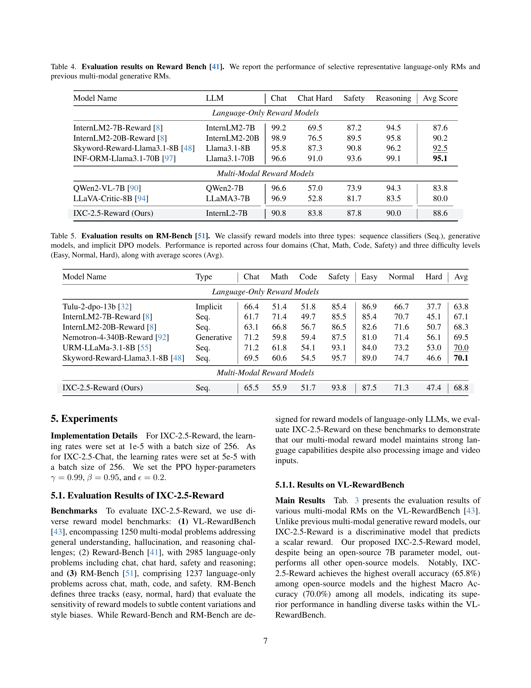

 


 2501.12368 
 Yuhang Zang et el. 
 
 🤗 2025-01-22 
 



↗ arXiv


↗ Hugging Face


↗ Papers with Code


### TL;DR



대규모 비전 언어 모델(LLM)은 시각적 이해 능력이 뛰어나지만, 때때로 부정확한 결과를 생성하는 문제가 있습니다. 기존의 보상 모델(Reward Model, RM)들은 주로 언어 기반으로 개발되어 다중 모드 LLM에 적용하기 어려운 한계가 있었습니다.  또한, 공개적으로 사용 가능한 다중 모드 RM이 부족하여, 상용 모델의 구현 세부 사항도 불투명한 실정입니다.

본 연구는 이러한 문제를 해결하기 위해 간단하면서도 효과적인 다중 모드 보상 모델인 InternLM-XComposer2.5-Reward (IXC-2.5-Reward)를 제시합니다.  IXC-2.5-Reward는 텍스트, 이미지, 비디오 데이터를 포함하는 고품질 다중 모드 선호도 데이터셋을 기반으로 훈련되었으며, 최신 다중 모드 보상 모델 벤치마크에서 우수한 성능을 달성했습니다.  더 나아가, RL 훈련, 테스트 시간 확장 및 데이터 정제 등 세 가지 주요 응용 사례를 통해 IXC-2.5-Reward의 유용성을 실증했습니다.



#### Key Takeaways


 다양한 모드(텍스트, 이미지, 비디오)와 도메인을 포괄하는 고품질 다중 모드 선호도 데이터셋을 구축했습니다. 



 인간의 선호도에 부합하는 새롭고 효과적인 다중 모드 보상 모델 IXC-2.5-Reward를 개발했습니다. 



 IXC-2.5-Reward는 RL 훈련, 테스트 시간 확장 및 데이터 정제 등 다양한 응용 분야에서 우수한 성능을 보였습니다. 


#### Why does it matter?
본 논문은 **다양한 모드(텍스트, 이미지, 비디오)를 포괄하는 고품질 다중 모드 선호도 데이터셋**을 구축하고, 이를 기반으로 **인간의 선호도에 부합하는 효과적인 다중 모드 보상 모델(IXC-2.5-Reward)**을 제시하여 **RL 훈련, 테스트 시간 확장, 데이터 정제** 등 다양한 응용 분야에 활용될 수 있다는 점에서 중요합니다.  이는 다중 모드 LLM의 성능 향상 및 개발에 크게 기여하며, 향후 연구의 새로운 방향을 제시할 수 있습니다.

------
#### Visual Insights

> 🔼 그림 1은 IXC-2.5-Reward 모델에 대한 설명을 세 부분으로 나누어 보여줍니다. (a)는 다양한 도메인(자연 장면, 텍스트 중심, 추론 등)과 모달리티(이미지, 텍스트, 비디오)를 포함하는 다중 모달 선호도 데이터셋을 구성하여 IXC-2.5-Reward를 훈련시키는 과정을 보여줍니다.  (b)는 IXC-2.5-Reward의 프레임워크를 보여주는 다이어그램입니다.  (c)는 IXC-2.5-Reward가 강화 학습을 통해 IXC-2.5-Chat의 정책 훈련을 안내하는 과정을 보여줍니다.  즉,  (a)는 데이터셋 생성, (b)는 모델 구조, (c)는 모델의 강화학습 적용 과정을 시각적으로 보여줍니다.
> 

> 
read the caption

> Figure 1: (a) To train the IXC-2.5-Reward, we construct a multi-modal preference dataset spanning diverse domains (e.g., natural scenes, text-rich, reasoning) and modalities (image, text, video). (b) The framework of IXC-2.5-Reward. (c) The IXC-2.5-Reward guides policy training for IXC-2.5-Chat via reinforcement learning.
> 


| Category | Dataset |
|---|---| 
| **Text** |  | 
| IF General | Tulu-3-IF-augmented-on-policy-8b [40], UltraFeedback [17] |
| Safety | hhh alignment [5], PKU-Safe [18], SHP [24], Anthropic-hhrlhf [6] |
| **Image** |  | 
| Chat | WildVision-Battle [62] |
| General | LLaVA-Critic [94], VL-Feedback [44], RLAIF-V [101], MIA-DPO [54] |

> 🔼 표 3은 VLRewardBench [43]에 대한 평가 결과를 보여줍니다.  이 표는 독점 모델과 오픈소스 모델의 성능을 비교 분석하여 각 모델의 전반적인 정확도와 다양한 하위 작업(일반적인 이해, 환각 감소, 추론)에서의 성능을 보여줍니다. 독점 모델과 오픈소스 모델 각각에 대해 최고 성능과 두 번째로 높은 성능을 달성한 결과는 굵은 글씨와 밑줄로 강조 표시되어 있습니다. 이를 통해 독점 모델과 오픈소스 모델 간의 성능 차이를 명확히 파악하고, IXC-2.5-Reward 모델의 경쟁력을 효과적으로 보여줍니다.
> 

> 
read the caption

> Table 3: Evaluation results on VLRewardBench [43]. The best and second-best results for proprietary models and open-source models are highlighted in bold and underlined, respectively.
> 

### In-depth insights

#### Multimodal Reward Models
본 논문은 **멀티모달 보상 모델**의 중요성을 강조하며, 특히 대규모 비전 언어 모델(LVLMs)의 성능 향상에 대한 기여를 심도 있게 다룹니다. 기존의 텍스트 기반 보상 모델의 한계를 극복하고자 **이미지, 비디오와 같은 다양한 모달리티를 통합**하는 멀티모달 보상 모델의 필요성을 제기하며, 이를 통해 **인간의 선호도와 LVLMs의 출력을 정렬**하는데 도움을 줄 수 있음을 보여줍니다.  **데이터 부족 문제**를 해결하기 위한 고품질 멀티모달 선호도 데이터셋 구축 과정과, 이를 기반으로 한 효과적인 모델 학습 전략 또한 논의합니다.  **강화학습(RL) 훈련, 테스트 시간 확장, 데이터 정제**와 같은 다양한 응용 분야에서 멀티모달 보상 모델의 활용 가능성을 보여줌으로써, 향후 LVLMs 연구의 중요한 방향을 제시합니다.  **특히, 제안된 모델의 성능은 기존 최첨단 모델들을 능가**하며, 다양한 벤치마크 테스트에서 우수한 결과를 보임으로써 실용성을 입증합니다.

#### IXC-2.5-Reward Design
IXC-2.5-Reward 모델 설계는 **다양한 모달리티(텍스트, 이미지, 비디오)를 포괄하는 고품질 다모달 선호도 데이터셋** 구축에 초점을 맞춥니다.  이를 통해 다양한 영역(지시사항 따르기, 일반적인 이해, 텍스트가 풍부한 문서, 수학적 추론, 비디오 이해 등)에서의 강건성과 다양성을 보장합니다.  모델 아키텍처는 **기존의 InternLM-XComposer 2.5(IXC-2.5)를 기반**으로 하며, 이미지와 비디오 데이터를 텍스트 모달리티와 정렬하는 사전 훈련된 가중치를 활용하여 효율성을 높입니다.  **추가적인 점수 헤드(score head)**를 통해 다양한 모달리티 입력에 대한 보상 점수를 예측하고,  **손실 함수는 선택된 응답과 거부된 응답 간의 보상 점수 차이를 최소화**하도록 설계되어 있습니다.  **길이 제약 조건을 적용**하여 모델이 길이에 편향되지 않도록 하고,  **강력한 일반화 능력**을 갖도록 합니다. 전체적으로 IXC-2.5-Reward는 간단하면서도 효과적인 다모달 보상 모델로서,  다양한 응용 분야(강화 학습 훈련, 테스트 시간 확장, 데이터 정제)에 활용될 수 있도록 설계되었습니다.

#### RLHF & Test-Time Scaling
본 논문은 RLHF(Reinforcement Learning from Human Feedback)와 Test-Time Scaling이라는 두 가지 중요한 측면에 대해 심도 있게 논의합니다. **RLHF는 인간의 피드백을 통해 AI 모델의 성능을 향상시키는 강화학습 기법**으로, 모델의 출력물이 인간의 선호도에 부합하도록 학습하는 데 중점을 둡니다.  반면 **Test-Time Scaling은 추론 단계에서 모델의 성능을 향상시키는 다양한 기법**을 포괄하며, 후보 응답 중 최적의 응답을 선택하거나 복잡한 추론 과정에 대한 단계별 비평을 제공하는 등 다양한 전략을 포함합니다. 논문에서는 이 두 가지 접근 방식을 결합하여 **다양한 모달리티(텍스트, 이미지, 비디오)를 지원하는 강력한 멀티모달 보상 모델을 제시**하고, 이를 통해 **LVLMs(Large Vision Language Models)의 성능을 크게 향상**시킨 결과를 보여줍니다. 특히, 제시된 모델은 기존의 멀티모달 보상 모델보다 훨씬 뛰어난 성능을 보이며, RL 학습과 Test-Time Scaling 모두에 효과적으로 적용될 수 있음을 강조합니다.  이는 **멀티모달 AI 모델의 발전에 있어서 RLHF와 Test-Time Scaling의 중요성을 보여주는 중요한 사례**로 볼 수 있습니다.

#### Data Cleaning Application
본 논문에서 제시된 다중 모달 보상 모델(IXC-2.5-Reward)의 데이터 정제 응용에 대한 심층적인 논의가 필요합니다. **데이터 정제의 중요성**은 잘못된 샘플, 즉 환각이나 이미지/비디오와 질문/답변의 불일치가 LLM 사전 학습 및 사후 학습 데이터에 부정적 영향을 미칠 수 있기 때문입니다.  **IXC-2.5-Reward는 낮은 점수를 통해 이러한 문제 샘플을 효과적으로 식별**합니다.  이는 기존의 CLIP과 같은 분류기 기반 방법의 한계를 극복할 수 있는 가능성을 제시합니다. 특히, **긴 맥락의 입력이나 고해상도 이미지/비디오에 대한 취약성을 개선**하는 데 기여할 수 있습니다.  **IXC-2.5-Reward의 데이터 정제 적용은 LLM의 성능 향상 및 신뢰성 확보**에 중요한 역할을 합니다.  하지만, 이러한 데이터 정제의 효과에 대한 정량적인 분석과 다양한 데이터셋에 대한 일반화 성능 평가가 추가적으로 필요하며, **향후 연구를 통해 보다 정교하고 효율적인 데이터 정제 전략**을 개발해야 할 것입니다.  **특히,  데이터 정제 과정에서 발생할 수 있는 편향이나 과적합 문제**에 대한 주의 깊은 고려가 필요합니다.

#### Future Research
본 논문의 "미래 연구" 부분에 대한 심도있는 고찰은 **다양한 모달리티를 아우르는 보상 모델의 견고성 및 일반화 능력 향상**에 초점을 맞춰야 함을 시사합니다.  **영상 데이터에 대한 보상 모델의 확장**은 중요한 과제이며,  **비디오 이해를 위한 프로세스 보상 모델(PRMs)** 개발은 향후 연구 방향을 제시합니다. 또한, **다양한 언어 및 문화권을 고려한 다국어 지원 및 문화적 편향 제거**를 위한 연구도 필요하며, 이를 위해서는 **다양한 언어와 문화적 맥락을 반영한 데이터셋 구축**이 필수적입니다.  **보상 모델의 효율성 및 확장성을 높이는 연구**와 **인간과의 상호작용 경험을 향상시키는 방향으로 보상 모델을 고도화**하는 연구도 중요합니다.  **RLHF 및 테스트 시간 확장(test-time scaling) 전략을 보다 효율적으로 통합**하는 방안에 대한 연구도 지속적으로 추진되어야 합니다.  마지막으로,  **다양한 벤치마크를 활용하여 보상 모델의 성능을 객관적으로 평가하고 비교**하는 연구가 필요하며, **실제 응용 환경에서의 성능 검증**을 통해 보상 모델의 실용성을 확보하는 것도 중요합니다.

### More visual insights

More on figures

> 🔼 표 1은 IXC-2.5-Reward 모델을 학습하는 데 사용된 기존 선호도 데이터셋의 개요를 보여줍니다.  표에는 데이터셋의 카테고리(Instruction Following, 안전, 채팅 등)와 각 데이터셋의 이름이 포함되어 있습니다.  Instruction Following은 지시사항 따르기를 의미합니다.  이 표는 IXC-2.5-Reward 모델이 다양한 유형의 선호도 데이터를 사용하여 학습되었다는 것을 보여주는 참고 자료입니다.  다양한 출처의 데이터를 사용함으로써, 모델의 강건성과 다양한 상황에 대한 일반화 능력을 높일 수 있었습니다.
> 

> 
read the caption

> Table 1: Overview of existing preference datasets used in IXC-2.5-Reward. IF denotes to Instruction Following.
> 

> 🔼 표 2는 IXC-2.5-Reward 모델 학습에 사용된 새롭게 수집된 데이터의 출처를 요약하여 보여줍니다.  각 카테고리(예: 지침 따르기, 일반, 텍스트가 풍부한 이미지, 추론, 일반화)별로 사용된 데이터셋 목록을 제시합니다.  각 데이터셋은 특정 영역(예: 이미지, 비디오, 텍스트) 또는 작업(예: 질문 답변, 지침 따르기)에 중점을 둡니다. 이 표는 IXC-2.5-Reward 모델이 다양한 모달리티와 도메인에 걸쳐 훈련되었음을 보여주는 중요한 정보를 제공합니다.
> 

> 
read the caption

> Table 2: Overview of the source of newly collected data used in IXC-2.5-Reward.
> 

> 🔼 그림 2는 IXC-2.5-Reward를 사용하여 데이터 정제를 수행하는 과정을 보여줍니다. IXC-2.5-Reward는 ALLaVA [10] 및 LLaVA-Video-178K [115] 와 같은 기존 이미지 및 비디오 instruction tuning 데이터셋에서 낮은 reward 점수를 가진 이상치 및 노이즈가 있는 예시들을 시각화합니다. '설명'은 reward 모델이 생성한 것이 아니라, 사람 전문가가 식별한 오류 원인에 대한 설명을 나타냅니다.  이 그림은 낮은 reward 점수를 받은 예시들을 보여줌으로써 IXC-2.5-Reward가 데이터셋에서 잘못된 데이터를 효과적으로 제거하는 데 도움이 됨을 시각적으로 보여줍니다.
> 

> 
read the caption

> Figure 2: Using IXC-2.5-Reward for Data Cleaning. We visualize the outlier and noisy examples detected by IXC-2.5-Reward with low reward scores from existing image and video instruction-tuning datasets, such as ALLaVA [10] and LLaVA-Video-178K [115]. The “Explain” refers to explanations of error causes as identified by human experts, rather than outputs generated by the reward model.
> 

More on tables


| Category | Dataset |
|---|---| 
| **Image** |  | 
| IF General | in-house (will release) |
|  | KVQA [76], A-OKVQA [73], PMC-VQA [114] |
| **Text-Rich** |  | 
|  | AI2D [37], IconQA [56], TQA [38] |
|  | ChartQA [63], DVQA [36], ScienceQA [57] |
| **Reasoning** |  | 
|  | GeoQA [11], CLEVR-Math [47] |
|  | Super-CLEVR [45], TabMWP [58] |
| **Video** |  | 
| General | TrafficQA [96], FunQA [93], MiraData [35] |
> 🔼 표 4는 Reward Bench [41]에 대한 평가 결과를 보여줍니다.  선별된 대표적인 언어 전용 보상 모델(RMs)과 이전의 다중 모드 생성형 RMs의 성능을 보고합니다.  언어 전용 모델과 다중 모드 생성 모델의 성능을 비교하여 다중 모드 보상 모델의 효과성을 평가하기 위한 것입니다.  각 모델의 채팅, 채팅 어려움, 안전, 추론 성능에 대한 점수를 보여주며, 평균 점수를 통해 종합적인 성능을 비교합니다.
> 

> 
read the caption

> Table 4: Evaluation results on Reward Bench [41]. We report the performance of selective representative language-only RMs and previous multi-modal generative RMs.
> 


| Models | #Param | General | Hallucination | Reasoning | Overall Acc | Macro Acc |
|---|---|---|---|---|---|---|
| Proprietary Models |  |  |  |  |  |  |
| Gemini-1.5-Flash (2024-09-24) [83] | - | 47.8 | 59.6 | 58.4 | 57.6 | 55.3 |
| Gemini-1.5-Pro (2024-09-24) [83] | - | 50.8 | 72.5 | 64.2 | 67.2 | 62.5 |
| Claude-3.5-Sonnet (2024-06-22) [4] | - | 43.4 | 55.0 | 62.3 | 55.3 | 53.6 |
| GPT-4o-mini (2024-07-18) [3] | - | 41.7 | 34.5 | 58.2 | 41.5 | 44.8 |
| GPT-4o (2024-08-06) [3] | - | 49.1 | 67.6 | 70.5 | 65.8 | 62.4 |
| Open-Source Models |  |  |  |  |  |  |
| LLaVA-OneVision-7B-ov [42] | 7B | 32.2 | 20.1 | 57.1 | 29.6 | 36.5 |
| Qwen2-VL-7B [90] | 7B | 31.6 | 19.1 | 51.1 | 28.3 | 33.9 |
| Molmo-7B [20] | 7B | 31.1 | 31.8 | 56.2 | 37.5 | 39.7 |
| InternVL2-8B [85] | 8B | 35.6 | 41.1 | 59.0 | 44.5 | 45.2 |
| LLaVA-Critic-8B [94] | 8B | 54.6 | 38.3 | 59.1 | 41.2 | 44.0 |
| Llama-3.2-11B [84] | 11B | 33.3 | 38.4 | 56.6 | 42.9 | 42.8 |
| Pixtral-12B [1] | 12B | 35.6 | 25.9 | 59.9 | 35.8 | 40.4 |
| Molmo-72B [20] | 72B | 33.9 | 42.3 | 54.9 | 44.1 | 43.7 |
| Qwen2-VL-72B [90] | 72B | 38.1 | 32.8 | 58.0 | 39.5 | 43.0 |
| NVLM-D-72B [19] | 72B | 38.9 | 31.6 | 62.0 | 40.1 | 44.1 |
| Llama-3.2-90B [84] | 90B | 42.6 | 57.3 | 61.7 | 56.2 | 53.9 |
| IXC-2.5-Reward (Ours) | 7B | 84.7 | 62.5 | 62.9 | 65.8 | 70.0 |
> 🔼 표 5는 RM-Bench [51]에 대한 평가 결과를 보여줍니다.  보상 모델은 시퀀스 분류기(Seq.), 생성 모델, 암시적 DPO 모델의 세 가지 유형으로 분류됩니다. 성능은 채팅, 수학, 코드, 안전의 네 가지 영역과 쉬움, 보통, 어려움의 세 가지 난이도 수준에 걸쳐 평가되며, 평균 점수(Avg)도 함께 제시됩니다.  각 모델의 성능은 각 영역 및 난이도별로 세분화되어 표시됩니다. 이를 통해 다양한 유형의 모델과 난이도에서의 상대적 성능을 비교 분석할 수 있습니다.
> 

> 
read the caption

> Table 5: Evaluation results on RM-Bench [51]. We classify reward models into three types: sequence classifiers (Seq.), generative models, and implicit DPO models. Performance is reported across four domains (Chat, Math, Code, Safety) and three difficulty levels (Easy, Normal, Hard), along with average scores (Avg).
> 


| Model Name | LLM | Chat | Chat Hard | Safety | Reasoning | Avg Score |
|---|---|---|---|---|---|---|
|   *Language-Only Reward Models* |  |  |  |  |  |  |
| InternLM2-7B-Reward [8] | InternLM2-7B | 99.2 | 69.5 | 87.2 | 94.5 | 87.6 |
| InternLM2-20B-Reward [8] | InternLM2-20B | 98.9 | 76.5 | 89.5 | 95.8 | 90.2 |
| Skyword-Reward-Llama3.1-8B [48] | Llama3.1-8B | 95.8 | 87.3 | 90.8 | 96.2 | 92.5 |
| INF-ORM-Llama3.1-70B [97] | Llama3.1-70B | 96.6 | 91.0 | 93.6 | 99.1 | 95.1 |
|   *Multi-Modal Reward Models* |  |  |  |  |  |  |
| QWen2-VL-7B [90] | QWen2-7B | 96.6 | 57.0 | 73.9 | 94.3 | 83.8 |
| LLaVA-Critic-8B [94] | LLaMA3-7B | 96.9 | 52.8 | 81.7 | 83.5 | 80.0 |
| IXC-2.5-Reward (Ours) | InternL2-7B | 90.8 | 83.8 | 87.8 | 90.0 | 88.6 |
> 🔼 표 6은 논문에서 제시된 IXC-2.5-Chat 모델의 성능을 100억 파라미터 이하의 기존 최고 성능(SOTA) 독점 모델 및 오픈소스 모델과 비교 분석한 결과를 보여줍니다.  OpenVLM 리더보드와 Open LMM 추론 리더보드(2025년 1월 1일 접근)의 데이터를 바탕으로 합니다.  표에는 지시사항 따르기, 지식, 추론, 텍스트 풍부 영역 등 다양한 범주에 대한 평가 결과가 포함되며, 최고 및 차순위 성능이 강조 표시되어 있습니다.
> 

> 
read the caption

> Table 6: Evaluation results of our IXC-2.5-Chat model against previous SOTA proprietary and open-source models ≤\leq≤10B (results are copied from OpenVLM Leaderboard and Open LMM Reasoning Leaderboard, accessed 01-Jan-2025). Best and second best results are highlighted.
> 


| Model Name | Type | Chat | Math | Code | Safety | Easy | Normal | Hard | Avg |
|---|---|---|---|---|---|---|---|---|---| 
| Language-Only Reward Models |  |  |  |  |  |  |  |  |  |
| Tulu-2-dpo-13b [32] | Implicit | 66.4 | 51.4 | 51.8 | 85.4 | 86.9 | 66.7 | 37.7 | 63.8 |
| InternLM2-7B-Reward [8] | Seq. | 61.7 | 71.4 | 49.7 | 85.5 | 85.4 | 70.7 | 45.1 | 67.1 |
| InternLM2-20B-Reward [8] | Seq. | 63.1 | 66.8 | 56.7 | 86.5 | 82.6 | 71.6 | 50.7 | 68.3 |
| Nemotron-4-340B-Reward [92] | Generative | 71.2 | 59.8 | 59.4 | 87.5 | 81.0 | 71.4 | 56.1 | 69.5 |
| URM-LLaMa-3.1-8B [55] | Seq. | 71.2 | 61.8 | 54.1 | 93.1 | 84.0 | 73.2 | 53.0 | 70.0 |
| Skyword-Reward-Llama3.1-8B [48] | Seq. | 69.5 | 60.6 | 54.5 | 95.7 | 89.0 | 74.7 | 46.6 | 70.1 |
| Multi-Modal Reward Models |  |  |  |  |  |  |  |  |  |
| IXC-2.5-Reward (Ours) | Seq. | 65.5 | 55.9 | 51.7 | 93.8 | 87.5 | 71.3 | 47.4 | 68.8 |
> 🔼 표 7은 IXC-2.5-Chat 모델 학습에 사용된 보상 모델의 응답 길이 제약 조건이 미치는 영향에 대한 추가 분석 결과를 보여줍니다.  응답 길이 제약 조건을 적용하지 않았을 때와 비교하여  WildVision, MIA, MM-MT, MM-Vet v2 등 다양한 벤치마크에서의 성능 변화를 보여주는 실험 결과를 제시하고 있습니다. 이를 통해 응답 길이 제약이 모델 성능에 미치는 영향을 정량적으로 분석하고 있습니다.
> 

> 
read the caption

> Table 7: Ablation Studies of the impact of response length constraints of reward models that guided training IXC-2.5-Chat.
> 


| Category | Benchmark | Evaluation | Proprietary API | Previous-SOTA | Previous-SOTA | IXC-2.5 | IXC-2.5-Chat |
|---|---|---|---|---|---|---|---| 
| Instruction | WildVision(0617) [62] | Open | 89.2 [31] | 67.3 [94] | 37.5 | 74.6 |
| Following | MIA(val) [68] | Open | 88.6 [31] | 80.7 [90] | 80.4 | 84.0 |
| & Chat | MM-MT(val) [1] | Open | 7.72 [31] | 5.45 [90] | 3.85 | 5.70 |
|  | MM-Vet v2(0613) [103] | Open | 71.8 [4] | 58.1 [14] | 45.8 | 54.8 |
| Knowledge | MMBench(v1.1) [52] | MCQ | 85.7 [74] | 82.7 [61] | 79.4 | 79.0 |
|  | MMMU(val) [106] | MCQ | 70.7 [31] | 56.2 [14] | 42.9 | 44.1 |
|  | MMStar [12] | MCQ | 72.7 [74] | 63.2 [14] | 59.9 | 59.6 |
| Reasoning | MathVista(mini) [59] | VQA | 78.4 [74] | 66.5 [60] | 63.7 | 63.4 |
|  | MathVerse(vision-only) [113] | VQA | 54.8 [26] | 26.6 [50] | 16.2 | 19.0 |
|  | MathVision(full) [89] | VQA | 43.6 [26] | 22.0 [50] | 17.8 | 18.8 |
| Text-Rich | TextVQA(val) [79] | VQA | 82.0 [64] | 78.5 [42] | 78.2 | 81.3 |
|  | ChartQA(test) [63] | VQA | 81.2 [64] | 82.4 [99] | 82.2 | 80.5 |
|  | OCRBench [49] | VQA | 89.4 [74] | 82.2 [14] | 69.0 | 70.0 |
> 🔼 표 8은 IXC-2.5-Reward를 사용한 테스트 시간 확장을 위한 Best-of-N (BoN) 샘플링 결과를 보여줍니다.  N 값(후보 응답 개수)을 변화시키면서 평균 토큰 수, WildVision, MIA, MM-MT, MM-Vet v2 벤치마크 점수 변화를 확인합니다.  BoN 샘플링을 통해 테스트 시간 성능이 향상되는 것을 보여주는 실험 결과를 제시합니다.  특히, 단순히 응답 길이를 늘리는 것이 아니라 실제로 더 질 높은 응답을 선택하는 데 도움이 되는지를 보여줍니다.
> 

> 
read the caption

> Table 8: Results of Best-of-N𝑁Nitalic_N (BoN) sampling for test-time scaling with IXC-2.5-Reward.
> 

### Full paper



