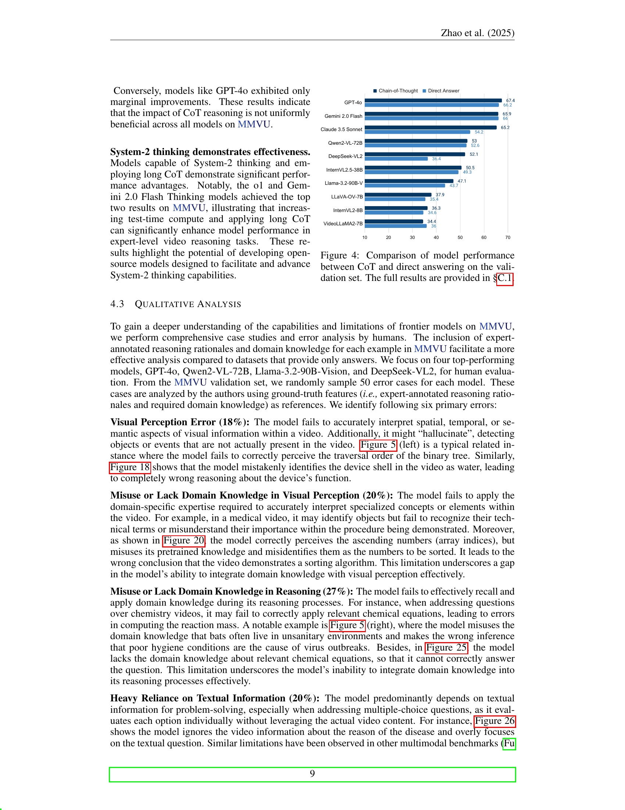

 


 2501.12380 
 Yilun Zhao et el. 
 
 🤗 2025-01-22 
 



↗ arXiv


↗ Hugging Face


↗ Papers with Code


### TL;DR



기존의 비디오 이해 벤치마크는 일반적인 시각적 인식에 초점을 맞춘 반면, **MMVU는 전문적인 지식과 추론 능력이 필요한 전문 분야 영상을 사용하여 전문가 수준의 다중 분야 비디오 이해 능력을 평가합니다.**  이는 과학, 의료, 인문학, 공학 등 4개 분야 27개 주제에 걸쳐 3000개의 전문가 검수 질문으로 구성됩니다. 

MMVU는 **인간 전문가의 주석을 기반으로 하며, 엄격한 데이터 품질 관리를 통해 높은 신뢰도를 확보**했습니다.  **32개의 최첨단 다중 모달 기반 모델을 MMVU에서 평가한 결과, 최신 시스템 2급 모델이 가장 높은 성능을 보였지만 여전히 인간 전문가의 수준에는 미치지 못했습니다.**  **오류 분석과 사례 연구를 통해 향후 모델 개선을 위한 구체적인 방향을 제시**함으로써, 전문 분야 비디오 이해 연구에 중요한 기여를 합니다.



#### Key Takeaways


 MMVU는 전문가 수준의 다중 분야 비디오 이해 능력을 평가하는 새로운 벤치마크 



 최첨단 다중 모달 모델 평가 결과, 전문가 수준에는 미치지 못함 



 오류 분석 ë° 사례 연구를 통해 모델의 한계점과 향후 연구 방향 제시 


#### Why does it matter?
**MMVU 벤치마크는 전문가 수준의 비디오 이해 능력을 평가하는 데 중점을 두고 있으며, 다양한 분야의 전문가들이 주석을 달았다는 점에서 기존의 벤치마크와 차별화됩니다.**  이 논문은 **다양한 최첨단 다중 모달 기반 모델을 평가하고, 전문가 수준의 성능과의 차이를 분석하여 향후 연구 방향을 제시한다는 점에서 중요한 의미**를 지닙니다. 특히 **영상 기반 전문 지식 추론의 어려움을 보여주는 사례 연구를 통해 모델의 한계점을 명확히 밝히고, 향후 연구 방향을 제시**함으로써, **비디오 이해 분야 연구자들에게 귀중한 통찰력을 제공합니다.**

------
#### Visual Insights

> 🔼 그림 1은 MMVU 벤치마크의 개요를 보여줍니다. MMVU는 과학, 의료, 인문사회과학, 공학 등 4개의 주요 분야에 걸쳐 27개의 과목을 다루는 3,000개의 전문가 주석이 달린 예시를 포함하고 있습니다. 각 예시는 전문가 수준의 추론과 지식 집약적인 비디오 이해 및 추론 능력을 평가하도록 설계되었습니다.  MMVU는 다양한 분야의 전문 지식을 요구하는 질문들로 구성되어 있으며, 기존 벤치마크와 달리 비디오의 시각적, 시간적, 의미론적 측면을 모두 고려하여 모델의 이해도를 종합적으로 평가할 수 있습니다.
> 

> 
read the caption

> Figure 1:  Overview of the \gradientRGBMMVU53,93,20310,10,80 benchmark. \gradientRGBMMVU53,93,20310,10,80 includes 3,000 expert-annotated examples, covering 27 subjects across four core disciplines. It is specifically designed to assess multimodal foundation models in expert-level, knowledge-intensive video understanding and reasoning tasks.
> 


|  | **Project Page:** | [mmvu-benchmark.github.io](https://mmvu-benchmark.github.io) |
|  | **MMVU53,93,20310,10,80 Data:** | [huggingface.co/datasets/yale-nlp/MMVU](https://huggingface.co/datasets/yale-nlp/MMVU) |
|  | **MMVU53,93,20310,10,80 Code:** | [github.com/yale-nlp/MMVU](https://github.com/yale-nlp/MMVU) |

> 🔼 표 1은 MMVU와 기존의 다중 분야 벤치마크를 비교하여 기초 모델 평가에 대해 설명합니다.  QA 유형 열에서 MC는 객관식 질문, Open은 주관식 질문, T/F는 참/거짓 질문을 나타냅니다. 표는 데이터 소스, 대학 수준, 자세한 솔루션, 추론, 지식 등 다양한 측면에서 각 벤치마크를 비교하여 MMVU의 특징과 강점을 보여줍니다.
> 

> 
read the caption

> Table 1: Comparison between \gradientRGBMMVU53,93,20310,10,80 and existing multi-discipline benchmarks for evaluating foundation models. In the “QA Type” column, “MC” denotes Multiple-Choice questions, “Open” denotes Open-ended questions, and “T/F” denotes True-False questions.
> 

### In-depth insights

#### Expert-Level Video QA
전문가 수준의 비디오 질의응답(QA)은 **영상 이해에 있어서 단순한 시각적 인식을 넘어, 전문 지식과 추론 능력을 요구하는 고난도 과제**임을 시사합니다. 이는 기존의 비디오 QA 벤치마크들이 주로 다루던 기본적인 시각적 인지 능력 평가를 넘어서, **해당 분야의 전문 지식을 필요로 하는 복잡한 추론 과정**을 평가해야 함을 의미합니다.  따라서, 전문가 수준 비디오 QA를 위한 벤치마크는 **다양한 전문 분야를 아우르는 풍부한 데이터셋**을 필요로 하며, 각 질문에 대한 답변 뿐만 아니라, **전문가 수준의 추론 과정과 관련 지식을 포함한 상세한 해설**을 제공하여 심층적인 분석을 가능하게 해야 합니다.  이러한 데이터셋을 기반으로, 모델의 성능을 정확히 평가하고, 전문가 수준의 영상 이해 능력 향상을 위한 구체적인 방향을 제시할 수 있습니다. 특히, **의료, 공학, 과학 등 전문 분야 영상**에 대한 이해 능력을 평가하는 것은 매우 중요하며, 이를 통해 **실제 응용 분야에서의 모델 활용 가능성**을 높일 수 있습니다.

#### MMVU Benchmark
MMVU 벤치마크는 **전문가 수준의 다분야 비디오 이해 능력**을 평가하기 위해 고안된 종합적인 벤치마크입니다. 기존 벤치마크와 달리 **과학, 의료, 인문사회, 공학 등 4개 주요 분야의 27개 세부 주제를 아우르는 3,000개의 전문가 주석 질문**을 포함합니다. 이는 단순한 시각적 인식을 넘어 **전문적인 지식과 추론 능력**을 요구하며, 각 예시에 대해 **전문가가 직접 주석을 달고 추론 과정과 관련된 도메인 지식**을 제공하여 심층 분석을 가능하게 합니다.  **데이터 품질 관리**를 통해 높은 정확성을 확보하였으며, 최신 다중 모달 기반 모델의 성능 평가 결과는 **인간 전문가의 수준에는 미치지 못하지만, 향후 전문 분야 비디오 이해 발전에 귀중한 지침**을 제공합니다.

#### Multimodal Model Analysis
본 논문의 "멀티모달 모델 분석" 부분은 다양한 멀티모달 모델의 성능을 비교 분석하고, 각 모델의 강점과 약점을 심층적으로 파악하는 데 중점을 둘 것입니다. **특히, 모델이 비디오 이해 및 추론 과제에서 어려움을 겪는 이유를 분석하고, 개선 방향을 제시하는 데 초점을 맞춰야 합니다.**  이를 위해, 모델의 오류 분석 결과를 자세히 제시하고, **각 오류 유형별 발생 원인과 그에 따른 해결책을 제시**하여야 합니다.  또한, **다양한 데이터셋에서의 모델 성능을 비교 분석**하여, 모델의 일반화 능력을 평가하고, **향후 연구 방향을 제시**하는 것이 중요합니다.  **단순한 성능 비교를 넘어, 모델의 내부 동작 메커니즘 분석을 통해 모델의 강점과 약점을 정확하게 파악**하고, 이를 바탕으로 개선된 모델을 개발하는 데 도움이 될 수 있는 통찰력을 제공해야 합니다.  마지막으로,  **다양한 멀티모달 모델들의 비교 분석 결과를 통해 영상 이해 분야의 발전 방향을 제시**하고, **향후 연구 과제를 제시**하여야 할 것입니다.

#### Limitations and Future Work
본 논문에서 제시된 연구의 제한점과 향후 연구 방향에 대한 심도있는 고찰은 **데이터셋의 규모와 다양성 부족**, **모델 평가의 한계**, 그리고 **일반화 가능성의 어려움** 등 세 가지 주요 측면에 초점을 맞추어야 합니다.  먼저, 제한된 규모와 다양성을 가진 데이터셋은 모델의 일반화 성능에 영향을 미칠 수 있으며, 특정 도메인이나 상황에 편향된 결과를 초래할 가능성이 있습니다. 따라서 **더욱 방대한 데이터셋을 구축하고 다양한 도메인과 상황을 포괄**하는 것이 중요합니다.  둘째, 모델 평가 과정에서 사용된 지표나 방법론의 한계는 연구 결과의 신뢰성에 영향을 줄 수 있습니다. **다양한 평가 지표를 활용하고 엄격한 평가 기준을 마련**하여 더욱 정확하고 객관적인 평가를 수행해야 합니다. 마지막으로, **특정 도메인이나 상황에 국한된 모델의 성능은 실제 응용 환경에서의 일반화 가능성을 보장하지 못할 수 있습니다.** 따라서 향후 연구에서는 다양한 도메인과 상황에서의 모델 성능을 평가하고, 실제 응용 환경에 적합한 모델을 개발하는 데 중점을 두어야 합니다.  **설명가능성 (Explainability)을 높이는 연구** 또한 중요한 방향입니다.  모델의 의사결정 과정을 투명하게 파악하여 신뢰성을 높이고, 오류 원인을 분석하여 모델 개선에 활용할 수 있도록 해야 합니다.

#### Dataset Construction
본 논문에서 다루는 데이터셋 구축 과정은 **전문가 수준의 다중 분야 비디오 이해 벤치마크**를 목표로 합니다.  **교과서 기반 어노테이션 방식**을 통해 전문 지식이 필요한 질문과 답변 쌍을 생성하고,  **엄격한 데이터 품질 관리**를 통해 높은 신뢰도의 데이터셋을 확보하고자 합니다.  구체적으로, **다양한 학문 분야를 아우르는 주제 선정**과 **전문가 어노테이터 모집 및 교육**을 통해  **영상 자료 수집 및 품질 관리**, **질문 및 정답 생성**, **추론 과정 및 관련 지식 어노테이션** 등의 과정을 거칩니다.  **비디오 콘텐츠에 대한 전문적 이해**와 **심층적인 추론 능력**을 평가하기 위한 설계가 핵심이며,  **정확성과 신뢰성 확보를 위한 엄격한 검증 과정**을 거쳐 최종 데이터셋을 완성합니다.  **다양한 평가 지표**를 통해 모델 성능을 측정하고,  **오류 분석을 위한 상세한 정보**를 제공하여 향후 연구 개발에 도움을 줄 수 있도록 설계되어 있습니다.  결론적으로, 본 연구의 데이터셋 구축 방법은 **전문성과 깊이 있는 추론 능력**을 요구하는 **고품질의 벤치마크** 생성에 초점을 맞추고 있음을 알 수 있습니다.

### More visual insights

More on figures

> 🔼 그림 2는 MMVU 벤치마크의 구성 과정을 보여주는 개념도입니다.  데이터셋 구축 과정의 세 가지 주요 단계를 보여줍니다.  1단계는 사용자 연구를 통한 과목 선정 및 주석기 작성자 모집 및 교육입니다.  2단계는 교과서 기반 QA 주석 작업으로, 전문가 주석자들이 교과서의 핵심 개념을 파악하고 관련 영상을 수집하여 질문과 답변 쌍을 생성하며 자세한 해설과 관련 도메인 지식을 추가하는 과정입니다.  3단계는 품질 관리 단계로 주석 작업의 오류나 편향을 식별하고 수정하는 과정입니다. 이 그림을 통해 MMVU 벤치마크가 전문가 수준의 다학제적 지식과 추론 능력을 요구하는 고품질 데이터셋임을 보여줍니다.
> 

> 
read the caption

> Figure 2: An overview of the \gradientRGBMMVU53,93,20310,10,80 benchmark construction pipeline.
> 

> 🔼 그림 3은 MMVU 벤치마크의 한 예시를 보여줍니다. 이 예시는 화학 분야의 문제이며, MMVU 데이터셋의 각 예시는 전문가가 관련 분야 지식과 단계별 추론 과정에 대한 주석을 포함하고 있음을 보여줍니다.  문제는 비디오에 제시된 반응에서 표준 온도 및 압력 조건 하에 2.24리터의 기체가 완전히 반응에 참여한다고 가정할 때, 생성되는 침전물의 무게를 근사적으로 구하는 것입니다.  문제와 함께, 정답, 관련된 화학 지식 (수산화칼슘, 이산화탄소, 이상기체 법칙 등)에 대한 참고자료, 그리고 문제 해결 과정을 단계별로 설명한 추론 과정이 자세히 제시되어 있습니다. 이는 MMVU가 단순한 시각적 인식을 넘어, 전문적인 지식과 추론 능력을 요구하는 복잡한 문제를 평가하는 데 초점을 맞추고 있음을 강조합니다.
> 

> 
read the caption

> Figure 3:  A dataset example from \gradientRGBMMVU53,93,20310,10,80 with the discipline of chemistry. Each example in \gradientRGBMMVU53,93,20310,10,80 includes expert annotation of relevant domain knowledge and step-by-step reasoning rational.
> 

> 🔼 그림 4는 검증 세트에서 Chain-of-Thought(CoT) 추론과 직접 답변 방식 간의 모델 성능 비교를 보여줍니다. CoT 추론 방식은 모델이 문제 해결 과정을 단계별로 설명하도록 유도하는 반면, 직접 답변 방식은 모델이 답을 바로 제시하도록 합니다.  각 모델의 정확도를 막대 그래프로 나타내어 두 방식 간의 성능 차이를 시각적으로 비교 분석합니다. 자세한 결과는 본문 C.1절을 참조하십시오.
> 

> 
read the caption

> Figure 4: Comparison of model performance between CoT and direct answering on the validation set. The full results are provided in §C.1.
> 

> 🔼 그림 5는 MMVU 벤치마크에서 최첨단 모델의 오류 사례를 보여줍니다. 왼쪽 그림은 모델이 비디오의 이진 트리 순회 순서를 잘못 식별하여 폭넓이 우선 탐색(BFS) 대신 깊이 우선 탐색(DFS)으로 잘못 분류한 시각적 인식 오류를 보여줍니다. 오른쪽 그림은 모델이 박쥐를 비위생적인 환경과 연관시키는 도메인 지식 오류로 인해 노로바이러스 발병으로 잘못 추론한 경우를 보여줍니다. 이러한 사례는 모델이 비디오에서 시각적 정보와 도메인 지식을 효과적으로 통합하는 데 어려움을 겪고 있음을 보여줍니다.
> 

> 
read the caption

> Figure 5:  Illustrations of visual perception error and misuse or lack domain knowledge in reasoning.
> 

> 🔼 이 그림은 논문의 '3.2 Textbook-Guided QA Example Annotation' 섹션에 있는 그림 6입니다.  주석에서 설명하듯이, 어노테이터는 유튜브 영상 URL을 입력하고 질문 유형을 선택해야 합니다. 시스템은 유튜브 데이터 API v3를 사용하여 해당 영상이 크리에이티브 커먼즈 라이선스 하에 있는지 자동으로 확인합니다. 라이선스가 없으면 그림과 같이 경고 메시지가 표시되고 제출이 차단됩니다. 유효한 예시가 제출되면 다음 단계(2단계)로 넘어갑니다.  이 그림은 그 1단계 과정을 보여줍니다.
> 

> 
read the caption

> Figure 6:  Annotation Interface - Step 1: Video Collection. In this step, annotators are required to input the YouTube video URL and select the desired question type. The backend system of the interface will automatically verify whether the provided YouTube video is under a Creative Commons license using the YouTube Data API v3. If the video does not meet this requirement, as shown in the figure, a warning message will be displayed, and the submission will be blocked. Once a valid example is submitted, the annotation interface will proceed to Step 2, which is illustrated in the following two figures.
> 

> 🔼 그림 7은 MMVU 벤치마크 구축 과정에서 사용된 어노테이션 인터페이스의 두 번째 단계를 보여줍니다. 이 단계는 다지선 선택형 질문에 대한 어노테이션을 위한 인터페이스이며, 사용자는 비디오 클립, 질문, 보기, 정답, 관련 도메인 지식, 추론 과정 등을 입력합니다.  영상의 시작 및 종료 시간을 지정하고, 보기를 무작위로 섞어서 모델이 비디오 내용을 바탕으로 추론하는 능력을 평가하도록 설계되었습니다.  인터페이스는 사용자에게 편의성과 정확성을 높이기 위해 직관적인 디자인과 다양한 기능을 제공하며, Wikipedia 페이지 링크를 통해 관련 지식을 추가하고 추론 과정을 자세히 설명할 수 있습니다. 
> 

> 
read the caption

> Figure 7:  Annotation Interface - Step 2: Multiple-choice Question Annotation.
> 

> 🔼 그림 8은 MMVU 벤치마크 구축을 위한 어노테이션 인터페이스의 두 번째 단계를 보여줍니다. 이 단계에서는 개방형 질문에 대한 어노테이션을 다룹니다. 어노테이션 담당자는 비디오 클립의 시작 및 종료 시간을 지정하고, 질문을 만들고, 답변을 제공하고, 관련 도메인 지식과 추론 과정에 대한 설명을 추가합니다. 인터페이스는 어노테이터가 답변을 입력하고, 관련 위키피디아 페이지를 추가하고, 추론 과정을 설명하는 필드를 제공합니다. 이는 모델 평가의 투명성을 높이고 모델 실패 모드를 이해하는 데 도움이 됩니다.
> 

> 
read the caption

> Figure 8:  Annotation Interface - Step 2: Open-ended Question Annotation.
> 

> 🔼 그림 9는 MMVU 데이터셋의 품질 관리 과정을 보여줍니다.  숙련된 검증자는 주석의 각 특징이 MMVU의 구성 기준 및 주석 지침과 일치하는지 철저히 검토합니다. 수정이 불가능한 경우, 원래 주석자에게 자세한 피드백을 제공하고, 주석을 수정하여 재제출하도록 합니다. 또한, 검증자는 품질이 낮거나 원하는 기준을 충족하지 못할 가능성이 높은 예시를 삭제할 수 있습니다.
> 

> 
read the caption

> Figure 9:  Validation Interface. Human validators are required to thoroughly review each annotation feature to ensure alignment with benchmark construction criteria and annotation guidelines. If revisions are not feasible, detailed feedback must be provided to the original annotator, who will then revise and resubmit the annotation for a second review. Additionally, validators may discard examples deemed to be of low quality and unlikely to meet the desired criteria through revision.
> 

> 🔼 그림 10은 MMVU-Pro 논문 (Yue et al., 2024b)에서 제시된 틀을 따르는,  선택형 질문에 대한 Chain-of-Thought(CoT) 추론 프롬프트를 보여줍니다.  이 프롬프트는 모델이 단순히 정답을 맞추는 것 이상으로, 문제 풀이 과정을 단계별로 설명하고 논리적 추론 과정을 명확히 제시해야 함을 강조합니다.  질문과 선택지가 주어지고,  시각적 정보(처리된 비디오)를 바탕으로 단계별 추론 과정을 거쳐 최종 답변을 도출하는 과정을 보여줍니다.  최종 답변은 'Therefore, the final answer is: $LETTER' 형식으로 제시되어야 하며,  $LETTER는 선택지 중 하나의 문자를 나타냅니다. 이는 모델의 추론 능력을 보다 정확하고 깊이 있게 평가하기 위한 것입니다.
> 

> 
read the caption

> Figure 10: CoT reasoning prompt, adopted from MMMU-Pro Yue et al. (2024b), for answering multiple-choice question.
> 

> 🔼 그림 11은 개방형 질문에 대한 답변을 위한 Chain-of-Thought (CoT) 추론 프롬프트를 보여줍니다.  이 프롬프트는 모델이 단계별로 추론 과정을 설명하고, 최종 답변을 제시하기 전에 각 단계를 명확하게 설명하도록 유도합니다.  비디오 처리 결과가 포함된 시각 정보도 모델에 제공됩니다.  이를 통해 모델은 단순히 답변만 생성하는 것이 아니라, 추론 과정 자체를 투명하게 보여주고, 그 과정에서 어떤 정보를 사용했는지 보여주도록 합니다.  이러한 접근 방식은 모델의 추론 능력을 더욱 정확하게 평가하는 데 도움이 됩니다.
> 

> 
read the caption

> Figure 11: CoT reasoning prompt for answering open-ended question.
> 

> 🔼 그림 12는 MMVU-Pro 논문(Yue et al., 2024b)에서 사용된 프롬프트를 바탕으로 다지선다형 질문에 대한 답변을 생성하기 위한 지시사항을 보여줍니다.  본 그림은 모델이 중간 과정 없이 제시된 선택지 중에서 정답을 바로 선택하도록 요구하는 직접적인 답변 방식(Direct Answer)을 나타냅니다.  즉, 모델은 추론 과정을 설명하지 않고, 주어진 비디오 정보와 질문을 바탕으로 답을 선택해야 합니다.
> 

> 
read the caption

> Figure 12: Direct Answer prompt, adopted from MMMU-Pro Yue et al. (2024b), for answering multiple-choice question.
> 

> 🔼 그림 13은 본 논문의 실험 설정 부분에 있는 그림입니다. 이 그림은 개방형 질문에 대한 답변을 위한 프롬프트(Direct Answer prompt)를 보여줍니다.  개방형 질문이란 객관식 선택지가 없는, 자유롭게 답변을 작성해야 하는 질문 유형입니다.  Direct Answer 프롬프트는 모델이 중간 과정 없이 최종 답변만 바로 출력하도록 지시하는 프롬프트입니다. 즉, 단계별 추론 과정 없이 바로 답을 제시하도록 하는 것입니다. 그림에는 질문과 시각 정보(처리된 비디오), 그리고 모델이 중간 과정 없이 최종 답변만 생성하라는 지시가 포함되어 있습니다.
> 

> 
read the caption

> Figure 13: Direct Answer prompt for answering open-ended question.
> 

> 🔼 그림 14는 다지선다형 질문의 정확도를 평가하기 위해 사용된 평가 프롬프트를 보여줍니다.  이 프롬프트는 모델의 최종 답변이 주어진 정답과 일치하는지 여부를 평가하도록 설계되었습니다. 평가자는 모델의 응답에서 최종 답변을 추출하고, 추출된 답변을 정답과 비교하여 정확도를 판별합니다.  최종 답변은 단일 문자로 표현되며, 정답 여부는 부울 값(True 또는 False)으로 표현됩니다. 이 프롬프트는 모델이 다지선다형 문제에 대해 얼마나 정확하게 답변하는지 평가하는 데 사용됩니다.
> 

> 
read the caption

> Figure 14: Evaluation prompt used for assessing the accuracy of multi-choice QA.
> 

> 🔼 그림 15는 개방형 질문에 대한 정답의 정확도를 평가하기 위해 사용된 평가 프롬프트를 보여줍니다.  이 프롬프트는 모델의 응답에서 최종 답변을 추출하고, 이를 기준 답변과 비교하여 정확도를 결정하는 방식을 설명합니다.  모델의 답변이 기준 답변과 단어 그대로 일치할 필요는 없지만, 동일한 기술이나 개념을 명확하고 명시적으로 제시해야 정답으로 인정됩니다.  추출된 답변과 정답 여부(참 또는 거짓)를 포함하는 구조화된 형식으로 출력하도록 지시합니다.  본질적으로, 이 그림은 개방형 질문에 대한 모델의 응답을 평가하는 데 사용되는 단계별 지침을 제공하는 평가 프롬프트의 세부 사항을 보여줍니다.
> 

> 
read the caption

> Figure 15: Evaluation prompt used for assessing the accuracy of open-ended QA.
> 

> 🔼 그림 16은 MMVU 검증 세트에서 Chain-of-Thought(CoT) 추론과 직접 응답 방식 간의 모델 성능을 비교한 막대 그래프입니다.  세로축은 정확도(Accuracy)를 나타내고, 가로축은 다양한 다중 모달 기반 모델들을 보여줍니다. 각 모델에 대해 CoT 추론 방식과 직접 응답 방식의 성능 차이를 시각적으로 비교하여 어떤 방식이 특정 모델에 더 효과적인지 보여줍니다.  막대의 길이가 길수록 해당 모델의 정확도가 높음을 의미합니다.  이를 통해 CoT 추론이 모델 성능 향상에 미치는 영향을 다양한 모델에 걸쳐 분석하고,  모델별로 가장 효과적인 응답 방식을 파악하는 데 도움이 됩니다.
> 

> 
read the caption

> Figure 16: Comparison of model performance between CoT reasoning and direct answering on the validation set.
> 

> 🔼 그림 17은 열역학 과정을 평가하는 과정에서 모델이 시각적 정보를 잘못 해석하여 오류를 범한 사례를 보여줍니다.  MMVU 벤치마크의 열역학 과정 질문에 대해 Llama-3.2-90B-Vision 모델은 단열 팽창이라고 잘못 예측했습니다. 이는 모델이 제공된 애니메이션에서 압력과 부피의 변화를 정확하게 인식하지 못하고, 결과적으로 잘못된 추론을 도출했기 때문입니다.  그림은 모델의 답변과 함께, 정답과 전문가가 작성한 추론 과정을 제시하여 모델의 오류 원인을 명확히 분석하고 있습니다. 모델이 시각적 정보를 정확히 해석하지 못하여 잘못된 답변을 내놓은 전형적인 사례입니다.
> 

> 
read the caption

> Figure 17: An error case of Thermodynamics.
> 

> 🔼 그림 18은 전자기학 분야의 오류 사례를 보여줍니다.  모델은 애니메이션에서 변화하는 물리량을 정확하게 식별하지 못했습니다.  애니메이션에서는 저항이 변화하는 것을 보여주지만, 모델은 물의 압력 변화로 잘못 해석했습니다. 이는 모델이 비디오의 시각적 정보를 정확하게 해석하지 못하고, 도메인 관련 지식을 적절하게 활용하지 못했기 때문입니다.  이는 시각적 인식 오류의 전형적인 예시로, 모델이 비디오 내의 물리적 현상을 잘못 이해하여 잘못된 결론에 도달하는 것을 보여줍니다.
> 

> 
read the caption

> Figure 18: An error case of Electromagnetism.
> 

> 🔼 그림 19는 MMVU 벤치마크에서 예술 분야의 오류 사례를 보여줍니다. 모델은 비디오에 표현된 영화 촬영 기법을 정확히 식별하지 못했습니다. 특히, 비디오에서 카메라가 피사체를 향해 확대되는 동작을 제대로 해석하지 못하고, 좌우로 이동하는 파노라마 기법으로 잘못 판단했습니다. 이는 모델이 시각적 정보를 정확하게 해석하고, 관련 영화 용어와 연관짓는 데 어려움을 겪고 있음을 시사합니다.
> 

> 
read the caption

> Figure 19: An error case of Art.
> 

> 🔼 그림 20은 컴퓨터 과학 분야의 오류 사례를 보여줍니다. 비디오에 표시된 알고리즘이 무엇인지 묻는 질문에 대해 모델이 잘못된 답변을 한 것을 보여줍니다. 모델은 비디오에서 숫자 시퀀스를 값으로 잘못 인식하여 선택 정렬 알고리즘이라고 잘못 결론지었습니다. 이는 모델이 시각적 지각에 도메인 지식을 통합하는 데 어려움을 겪는다는 것을 보여줍니다.
> 

> 
read the caption

> Figure 20: An error case of Computer Science.
> 

> 🔼 그림 21은 전기 공학 분야의 오류 사례를 보여줍니다.  이 그림은 모델이 회로도를 잘못 해석하여 필터의 종류를 잘못 예측한 경우를 보여줍니다.  모델은 저항기를 인덕터로 잘못 식별하여 대역 통과 필터라고 잘못 판단했습니다.  이는 모델이 회로 구성 요소에 대한 전문 지식이 부족하거나 시각적 정보를 정확하게 해석하지 못했기 때문입니다. 이는 모델이 전문적인 도메인 지식과 시각적 정보를 통합하는 데 어려움을 겪고 있음을 시사합니다.
> 

> 
read the caption

> Figure 21: An error case of Electrical Engineering.
> 

> 🔼 그림은 약학 분야의 오류 사례를 보여줍니다.  DeepSeek-VL2 모델은 비디오에서 자궁을 태아의 내부로 잘못 인식하여, 비디오에 나타난 과정을 태아 발달 과정으로 잘못 해석하는 오류를 범했습니다. 이는 모델이 시각적 인식 과정에서 관련 전문 지식을 오용하거나 부족하기 때문에 발생한 오류입니다.  비디오는 실제로 수정란 이식 과정을 보여줍니다.
> 

> 
read the caption

> Figure 22: An error case of Pharmacy.
> 

> 🔼 그림 23은 컴퓨터 과학 분야의 오류 사례를 보여줍니다.  Llama-3.2-90B-Vision 모델은 비디오에 표시된 알고리즘을 선택 정렬(Selection Sort)로 잘못 식별했습니다. 모델은 비디오의 시각적 정보를 제대로 해석하지 못하고, 미리 훈련된 지식에 과도하게 의존하여 잘못된 결론에 도달했습니다.  실제로 비디오는 삽입 정렬(Insertion Sort) 알고리즘을 보여주며, 모델은 배열의 인덱스를 값으로 잘못 인식하여 오류를 범했습니다. 이는 모델이 시각적 정보와 도메인 지식을 통합하는 데 어려움을 겪는다는 것을 보여줍니다.
> 

> 
read the caption

> Figure 23: An error case of Computer Science.
> 

More on tables


| Dataset | QA Type | Data Source | College Level? | Detailed Solution | Rational? | Knowledge? |
|---|---|---|---|---|---|---|
| MMLU [Hendrycks et al. (2021)](https://arxiv.org/html/2501.12380/bib.bib60) | MC | Exam, course, textbook | ✓ | ✗ | ✗ |
| MMLU-Pro [Wang et al. (2024d)](https://arxiv.org/html/2501.12380/bib.bib144) | MC | Datasets → LLM augment | ✓ | ✗ | ✗ |
| C-Eval [Huang et al. (2023)](https://arxiv.org/html/2501.12380/bib.bib64) | MC | Exam | ✓ | ✗ | ✗ |
| SciEval [Sun et al. (2024)](https://arxiv.org/html/2501.12380/bib.bib130) | MC, Open | Internet, datasets → LLM rewrite | ✓ | ✗ | ✗ |
| TheoremQA [Chen et al. (2023a)](https://arxiv.org/html/2501.12380/bib.bib21) | MC, T/F, Open | Internet, exam → Human rewrite | ✓ | ✗ | ✓ |
| SciKnowEval [Feng et al. (2024)](https://arxiv.org/html/2501.12380/bib.bib42) | MC, T/F, Open | Textbooks, database, other datasets → LLM rewrite | ✓ | ✗ | ✓ |
| VisScience [Jiang et al. (2024)](https://arxiv.org/html/2501.12380/bib.bib71) | MC, Open | Internet, exam, textbook | ✗ | ✗ | ✗ |
| EXAMS-V [Das et al. (2024)](https://arxiv.org/html/2501.12380/bib.bib32) | MC | Exam | ✗ | ✗ | ✗ |
| ScienceQA [Lu et al. (2022)](https://arxiv.org/html/2501.12380/bib.bib101) | MC | Internet, course | ✗ | ✓ | ✗ |
| SceMQA [Liang et al. (2024)](https://arxiv.org/html/2501.12380/bib.bib93) | MC, Open | Internet, exam | ✗ | ✓ | ✗ |
| CharXiv [Wang et al. (2024e)](https://arxiv.org/html/2501.12380/bib.bib146) | Open | arXiv paper → Human annotate | ✓ | ✗ | ✗ |
| MMSci [Li et al. (2024g)](https://arxiv.org/html/2501.12380/bib.bib92) | MC | Scientific paper → LLM generate | ✓ | ✗ | ✗ |
| OlympicArena [Huang et al. (2024a)](https://arxiv.org/html/2501.12380/bib.bib65) | MC, T/F, Open | Olympic competitions | ✓ | ✓ | ✗ |
| MMMU [Yue et al. (2024a)](https://arxiv.org/html/2501.12380/bib.bib158) | MC, Open | Internet, exam, textbook | ✓ | 17.6% | ✗ |
| CMMM [Zhang et al. (2024a)](https://arxiv.org/html/2501.12380/bib.bib160) | MC, T/F, Open | Internet, exam, textbook | ✓ | 2.1% | ✗ |
| MMMU-Pro [Yue et al. (2024b)](https://arxiv.org/html/2501.12380/bib.bib159) | MC | MMMU → Human & LLM augment | ✓ | 15.4% | ✗ |
| MMWorld [He et al. (2024)](https://arxiv.org/html/2501.12380/bib.bib58) | MC | Human experts (24%) / LLM-gen (76%) | 39.5% | ✗ | ✗ |
| MMVU53,93,20310,10,80 (ours) | MC, Open | Human experts annotate from scratch | ✓ | ✓ | ✓ |
> 🔼 표 2는 MMVU 벤치마크의 주요 통계를 보여줍니다. MMVU는 전문가 수준의 다중 학문 분야 비디오 이해 능력을 평가하기 위한 3,000개의 질문과 1,529개의 비디오로 구성된 포괄적인 벤치마크입니다. 이 표는 질문 수, 검증 및 테스트 집합의 크기, 고유한 비디오 수, 비디오 길이, 학문 및 과목 수, 여러 선택지 질문과 개방형 질문의 수, 질문 및 답변의 길이, 질문당 필요한 지식의 수, 해결책의 길이 및 고유 지식(위키피디아 페이지)의 총 수 등의 주요 통계를 제공합니다. 이 정보는 MMVU의 규모와 복잡성, 그리고 다양한 학문 분야와 전문 지식에 대한 포괄성을 이해하는 데 도움이 됩니다.
> 

> 
read the caption

> Table 2: Key statistics of the \gradientRGBMMVU53,93,20310,10,80 benchmark.
> 


| Statistics | Value |
|---|---| 
| Total Questions | 3,000 |
| Validation Set | 1,000 |
| Test Set | 2,000 |
| Unique Videos | 1,529 |
| Video Length (Seconds, `avg/max`) | 51.4 / 228 |
| Number of Disciplines | 4 |
| Number of Subjects | 27 |
| Multiple Choice Questions | 1,858 |
| Question Length (`avg/max`) | 16.8 / 70 |
| Single Choice Length (`avg/max`) | 7.6 / 42 |
| Number of Choices per Question | 5 |
| \hdashline Open-ended Questions | 1,142 |
| Question Length (`avg/max`) | 16.4 / 39 |
| Ground-truth Answer Length (`avg/max`) | 1.5 / 7 |
| Number of Required **Knowledge** per Question (`avg/max`) | 4.3 / 7 |
| **Solution Rationale** Length (`avg/max`) | 56.6 / 193 |
| Total Number of Unique Knowledge ( _i.e._, Wikipedia pages) | 4,770 |
> 🔼 표 3은 MMVU 검증 및 테스트 세트에서 여러 기반 모델의 정확도를 보여줍니다. 이 표는 Chain-of-Thought 프롬프트를 사용하여 평가된 32개의 다양한 다중 모드 기반 모델의 성능을 보여줍니다. 모델의 성능은 테스트 세트의 종합적인 결과를 바탕으로 순위가 매겨졌습니다. o1 모델의 경우 다중 모드 버전에 대한 API 접근 권한이 부여되지 않았으므로 검증 세트에서 100개의 예시와 테스트 세트에서 200개의 예시(각 핵심 분야별 50개)를 무작위로 추출하여 ChatGPT 플랫폼에서 CoT 프롬프트를 사용하여 수동으로 평가했습니다. 이 표는 각 분야(과학, 의료, 인문사회 과학, 공학)와 검증 및 테스트 세트에 대한 각 모델의 정확도를 자세히 보여줍니다.
> 

> 
read the caption

> Table 3:  Accuracy of evaluated foundation models on the \gradientRGBMMVU53,93,20310,10,80 validation and test sets using CoT prompts. Model performance is ranked based on overall results on the test set. ∗: For o1, as the API access for its multimodal version has not been granted, we randomly sampled 100 examples from the validation set and 200 examples (50 for each core discipline) from the test set. The model’s performance was manually evaluated on Jan 10, 2025, using CoT prompts on ChatGPT platform.
> 


Model|Release|Science|Healthcare|Human. & Social Sci.|Engineering|Avg. Validation|Avg. Test
---|---|---|---|---|---|---|---|---
Human Oracle||95.3|93.3|96.0|96.7|95.3|95.3
Human Open-book||86.7|84.7|92.7|83.3|86.8|86.8
Human Closed-book||54.7|42.7|44.7|56.7|49.7|49.7
o1*|2024-12|80.0|78.0|76.0|74.0|79.0|77.0
Gemini 2.0 Flash Thinking|2024-12|69.3|71.2|73.4|67.3|69.1|69.5
GPT-4o|2024-08|67.2|71.8|72.0|61.6|67.4|66.7
Gemini 2.0 Flash|2024-12|70.8|62.7|71.6|63.0|65.9|66.5
Gemini 1.5 Pro|2024-09|67.2|68.1|67.0|62.8|65.4|65.8
Claude 3.5 Sonnet|2024-10|60.5|64.0|70.9|64.5|65.2|64.1
Grok-2-Vision|2024-12|60.6|72.5|72.0|57.4|62.7|63.4
GPT-4o-mini|2024-07|60.3|60.9|70.6|59.3|61.6|61.5
Gemini 1.5 Flash|2024-09|56.8|57.3|66.3|58.2|58.8|58.8
GLM-4V-Plus|2025-01|52.2|57.3|64.9|55.4|56.2|56.2
Qwen2-VL-72B|2024-09|48.0|53.6|61.7|53.9|53.0|53.2
DeepSeek-VL2|2024-12|50.3|53.4|58.9|48.6|52.1|51.5
InternVL2.5-38B|2024-11|50.3|45.6|52.8|52.8|50.5|50.7
Aria|2024-11|46.8|43.3|61.0|49.9|49.3|49.3
Llama-3.2-90B-Vision|2024-09|46.5|43.5|53.9|48.1|47.1|47.6
DeepSeek-VL2-Small|2024-12|47.5|48.7|47.5|45.1|46.9|46.9
Qwen2-VL-7B-Instruct|2024-08|43.6|42.5|43.6|41.2|42.1|42.5
InternVL2.5-8B|2024-11|39.2|36.8|47.2|42.3|41.1|41.0
VideoLLaMA2.1-7B|2024-10|35.3|38.9|45.4|41.6|39.5|39.8
Llama-3.2-11B-Vision|2024-09|40.5|39.4|44.0|35.7|38.9|39.0
Phi-3.5-Vision|2024-08|38.3|29.5|45.4|41.1|38.1|38.7
LLaVA-OneVision-7B|2024-09|34.3|38.6|40.8|38.8|37.9|37.7
Qwen2-VL-2B|2024-08|32.6|40.9|40.4|35.7|36.5|36.5
InternVL2-8B|2024-06|36.7|32.9|36.9|37.2|36.3|36.2
Idefics3-8B|2024-08|37.0|35.5|44.0|31.2|35.3|35.6
VideoLLaMA2-7B|2024-06|32.3|27.7|44.3|35.7|34.4|34.4
DeepSeek-VL2-Tiny|2024-12|34.3|33.4|35.8|30.1|33.0|32.8
Pixtral-12B|2024-09|36.1|24.6|37.9|30.8|32.3|32.2
LLaVA-NeXT-Video-34B|2024-06|31.8|24.6|35.8|30.3|30.5|30.4
InternVideo2-8B|2024-08|29.6|31.1|37.2|26.5|29.9|29.9
H2OVL Mississippi-2B|2024-10|29.1|29.5|29.4|28.0|29.1|28.8
LLaVA-NeXT-Video-7B|2024-06|27.0|31.1|27.3|29.5|28.6|28.7
> 🔼 표 4는 MMVU 데이터셋 제작에 참여한 73명의 주석자에 대한 간략한 정보를 담고 있습니다.  개인 정보 보호를 위해 주석자들의 자세한 이력 및 신상 정보는 공개되지 않았습니다. 표에는 각 주석자의 ID, 경력, 전공, MMVU 작업에 할당된 분야, 저자 참여 여부, 검증자 참여 여부 등이 포함되어 있습니다. 이 표는 MMVU 데이터셋의 신뢰성과 전문성을 보여주는 중요한 정보를 제공합니다.
> 

> 
read the caption

> Table 4:  Biographies of 73 annotators involved in \gradientRGBMMVU53,93,20310,10,80 construction (Author biographies are hidden to protect identity confidentiality).
> 


| ID | Year | Major | Assigned Subject(s) | Author? | Validator? |
|---|---|---|---|---|---| 
| 1 | 1st year Master | Biomedical Engineering | Biomedical Engineering | ✗ | ✗ |
|  |  |  | Computer Science |  |  |
|  |  |  | Electrical Engineering |  |  |
| 2 | 1st year Master | Bioinformatics | Biomedical Engineering | ✗ | ✗ |
| 3 | 1st year Master | Biological Engineering | Biomedical Engineering | ✗ | ✗ |
| 4 | 2nd year Master | Biomedical Engineering | Biomedical Engineering | ✗ | ✗ |
|  |  |  | Electronics and Communication |  |  |
| 5 | 5th year PhD | Agricultural and Biosystems Engineering | Biomedical Engineering | ✗ | ✗ |
| 6 | 2nd year Master | Architecture | Civil Engineering | ✗ | ✗ |
| 7 | 3rd year PhD | Civil Engineering | Civil Engineering | ✗ | ✗ |
|  |  |  | Mechanical Engineering |  |  |
| 8 | – | – | – | ✓ | ✓ |
| 9 | 3rd year Undergraduate | Electrical Engineering | Computer Science | ✗ | ✗ |
|  |  |  | Electrical Engineering |  |  |
| 10 | 2nd year Master | Electrical Engineering | Computer Science | ✗ | ✗ |
|  |  |  | Electronics and Communication |  |  |
| 11 | 2nd year Master | Electrical Engineering | Computer Science | ✗ | ✗ |
|  |  |  | Mechanical Engineering |  |  |
| 12 | 3rd year Undergraduate | Software Engineering | Computer Science | ✗ | ✗ |
| 13 | 2nd year Master | Computer Science | Computer Science | ✗ | ✗ |
| 14 | – | – | – | ✓ | ✗ |
|  |  |  | Electrical Engineering |  |  |
| 15 | 1st year PhD | Electrical Engineering | Computer Science | ✗ | ✗ |
|  |  |  | Electronics and Communication |  |  |
| 16 | 1st year PhD | Electrical Engineering | Electrical Engineering | ✗ | ✗ |
| 17 | – | – | – | ✓ | ✓ |
| 18 | 1st year Master | Electrical Engineering | Electrical Engineering | ✗ | ✗ |
|  |  |  | Mechanical Engineering |  |  |
| 19 | 1st year PhD | Electrical Engineering | Electronics and Communication | ✗ | ✗ |
| 20 | 3rd year PhD | Food Science | Mechanics | ✗ | ✗ |
| 21 | 4th year PhD | Materials Science | Materials Science | ✗ | ✗ |
| 22 | 4th year Undergraduate | Aerospace Engineering | Materials Science | ✗ | ✗ |
|  |  |  | Mechanical Engineering |  |  |
| 23 | 4th year Undergraduate | Mechanical Engineering | Materials Science | ✗ | ✓ |
|  |  |  | Mechanical Engineering |  |  |
| 24 | 2nd year PhD | Mechanical Engineering | Mechanical Engineering | ✗ | ✗ |
| 25 | 1st year PhD | Mechanical Engineering | Mechanical Engineering | ✗ | ✗ |
| 26 | 1st year Master | Medicine | Basic Medicine | ✗ | ✗ |
|  |  |  | Clinical Medicine |  |  |
| 27 | 1st year Master | Radiology | Basic Medicine | ✗ | ✗ |
|  |  |  | Clinical Medicine |  |  |
| 28 | 1st year Master | Dentistry | Basic Medicine | ✗ | ✗ |
|  |  |  | Dentistry |  |  |
| 29 | 1st year PhD | Nursing | Basic Medicine | ✗ | ✗ |
|  |  |  | Pharmacy |  |  |
| 30 | 3rd year Undergraduate | Epidemiology | Basic Medicine | ✗ | ✗ |
|  |  |  | Preventive Medicine |  |  |
| 31 | 3rd year Undergraduate | Medicine | Clinical Medicine | ✗ | ✗ |
| 32 | – | – | – | ✓ | ✓ |
| 33 | 2nd year PhD | Medicine | Clinical Medicine | ✗ | ✗ |
|  |  |  | Pharmacy |  |  |
> 🔼 본 논문의 표 5는 MMVU 구축에 참여한 73명의 주석자에 대한 정보를 담고 있습니다.  개인 정보 보호를 위해 저자의 자세한 이력은 공개되지 않았지만,  표에는 각 주석자의 ID, 경력, 전공, 담당 분야, 저자 여부, 검증자 여부 등이 포함되어 있습니다.  모든 주석자는 2024 QS 세계 대학 순위 상위 500위 이내 대학 출신이며 영어 구사가 가능합니다.
> 

> 
read the caption

> Table 5:  Biographies of 73 annotators involved in \gradientRGBMMVU53,93,20310,10,80 construction (Author biographies are hidden to protect identity confidentiality).
> 


| ID | Year | Major | Assigned Subject(s) | Author? | Validator? |
|---|---|---|---|---|---| 
| 34 | 4th year PhD | Dentistry | Dentistry | ✗ | ✗ |
| 35 | 3rd year Undergraduate | Dentistry | Dentistry | ✗ | ✗ |
| 36 | 4th year PhD | Dentistry | Dentistry | ✗ | ✗ |
| 37 | 1st year PhD | Public Health | Pharmacy | ✗ | ✗ |
|  |  |  | Preventive Medicine |  |  |
| 38 | 4th year Undergraduate | Pharmacy | Pharmacy | ✗ | ✗ |
| 39 | 3rd year PhD | East Asian Studies | Art | ✗ | ✗ |
| 40 | 4th year PhD | Literature | Art | ✗ | ✗ |
|  |  |  | History |  |  |
|  |  |  | Literature |  |  |
| 41 | – | – | – | ✓ | ✗ |
|  |  |  | History |  |  |
| 42 | 1st year PhD | Economics | Economics | ✗ | ✗ |
| 43 | 4th year Undergraduate | Accounting | Economics | ✗ | ✗ |
|  |  |  | Law |  |  |
| 44 | 4th year PhD | Finance | Economics | ✗ | ✗ |
| 45 | 3rd year PhD | Public Administration | Law | ✗ | ✗ |
|  |  |  | Management |  |  |
| 46 | 1st year Master | Literature | Literature | ✗ | ✗ |
| 47 | 5th year PhD | Linguistics | Literature | ✗ | ✗ |
| 48 | 3rd year Undergraduate | Public Administration | Management | ✗ | ✗ |
| 49 | 5th year PhD | Astronomy | Astronomy | ✗ | ✗ |
| 50 | – | – | – | ✓ | ✓ |
| 51 | 2nd year Master | Astronomy | Astronomy | ✗ | ✗ |
| 52 | – | – | – | ✓ | ✗ |
|  |  |  | Geography |  |  |
| 53 | 3rd year PhD | Biology | Biology | ✗ | ✗ |
| 54 | 1st year PhD | Biology | Biology | ✗ | ✗ |
|  |  |  | Neurobiology |  |  |
| 55 | 3rd year PhD | Marine Biology | Biology | ✗ | ✗ |
|  |  |  | Chemistry |  |  |
| 56 | – | – | – | ✓ | ✗ |
| 57 | 1st year PhD | Chemistry | Chemistry | ✗ | ✗ |
| 58 | 3rd year Undergraduate | Chemistry | Chemistry | ✗ | ✗ |
| 59 | 1st year PhD | Physics | Electromagnetism | ✗ | ✗ |
| 60 | 4th year Undergraduate | Physics | Electromagnetism | ✗ | ✗ |
|  |  |  | Thermodynamics |  |  |
| 61 | 4th year PhD | Physics | Electromagnetism | ✗ | ✗ |
| 62 | 1st year PhD | Physics | Electromagnetism | ✗ | ✗ |
|  |  |  | Mechanics |  |  |
|  |  |  | Thermodynamics |  |  |
| 63 | 1st year Master | Physics | Thermodynamics | ✗ | ✗ |
|  |  |  | Electromagnetism |  |  |
| 64 | 3rd year Undergraduate | Agricultural and Environmental Sciences | Geography | ✗ | ✗ |
| 65 | 4th year PhD | Physics | Thermodynamics | ✗ | ✗ |
|  |  |  | Mechanics |  |  |
|  |  |  | Modern Physics |  |  |
| 66 | 1st year PhD | Physics | Mechanics | ✗ | ✗ |
| 67 | 3rd year PhD | Physics | Mechanics | ✗ | ✗ |
| 68 | 4th year PhD | Physics | Modern Physics | ✗ | ✗ |
| 69 | 3rd year Undergraduate | Neurobiology | Neurobiology | ✗ | ✗ |
| 70 | 1st year PhD | Neurobiology | Neurobiology | ✗ | ✗ |
| 71 | – | – | – | ✓ | ✓ |
| 72 | 3rd year Undergraduate | Biology | Neurobiology | ✗ | ✗ |
| 73 | 1st year Master | Biology | Neurobiology | ✗ | ✗ |
> 🔼 표 6은 과학 분야에 대한 MMVU 벤치마크 구축에 사용된 교과서 목록과 해당 예시 문제 번호를 보여줍니다.  각 과학 분야(천문학, 생물학, 화학, 지리학, 역학, 현대 물리학, 신경생물학, 열역학)에 대해 사용된 교과서가 상세히 나열되어 있으며,  해당 교과서에서 MMVU 예시 문제를 어떻게 구성했는지에 대한 정보를 제공합니다. 이는 MMVU 데이터셋의 범위와 전문성을 이해하는 데 중요한 정보입니다.
> 

> 
read the caption

> Table 6:  List of textbooks and corresponding example numbers for the Science discipline.
> 


| Subject | Textbook |
|---|---| 
| Astronomy | 1. _Foundations of Astrophysics_ Ryden & Peterson (2020) 2. _Stellar Structure And Evolution_ Pols (2011) |
| Biology | 1. _Biology, 2nd Edition_ Clark et al. (2018a) 2. _Introduction to Agricultural Engineering Technology: A Problem Solving Approach, 4th Edition_ Field & Long (2018) 3. _Introduction to Environmental Engineering, 5th Edition_ Davis & Cornwell (2012) 4. _The Economy of Nature, 7th Edition_ Ricklefs (2013) 5. _The Molecular Biology of the Cell, 6th Edition_ Alberts et al. (2014) |
| Chemistry | 1. _Atkins’ Physical Chemistry, 12th Edition_ Atkins et al. (2023) 2. _Chemistry, 2nd Edition_ Flowers et al. (2019) 3. _Chemistry: The Central Science, 15th Edition_ Brown et al. (2023) 4. _Organic Chemistry As A Second Language_ Klein (2024) 5. _Organic Chemistry, 2nd Edition_ Clayden et al. (2012) |
| Electromagnetism | 1. _Introduction to Electrodynamics, 4th Edition_ Griffiths (2023) 2. _University Physics Volume 2 (Electromagnetism)_ Ling et al. (2016b) |
| Geography | 1. _Fundamentals of Geophysics, 2nd Edition_ Lowrie & Fichtner (2020) 2. _Human Geography, 12th Edition_ Fouberg & Murphy (2020) 3. _Physical Geography: A Landscape Appreciation, 10th Edition_ Hess & McKnight (2021) |
| Mechanics | 1. _University Physics Volume 1_ Ling et al. (2016a) |
| Modern Physics | 1. _University Physics Volume 3_ Ling et al. (2016c) |
| Neurobiology | 1. _Neuroscience, 6th Edition_ Purves et al. (2018) 2. _Principles of Neural Science, 6th Edition_ Kandel et al. (2021) 3. _Principles of Neurobiology_ Luo (2020) |
| Thermodynamics | 1. _An Introduction to Thermal Physics_ Schroeder (2020) 2. _University Physics Volume 2 (Thermodynamics)_ Ling et al. (2016b) |
> 🔼 표 7은 공학 분야의 전문 지식을 평가하기 위해 MMVU 벤치마크에서 사용된 27개의 세부 과목에 대한 교과서 목록과 해당 예시 문제 번호를 보여줍니다. 각 과목에 대해 하나 이상의 교과서가 선택되었으며, 이는 해당 분야의 권위 있는 참고 자료로 인정됩니다. 이 표는 MMVU 데이터셋 구성에 사용된 교과서의 폭넓은 범위와 전문성을 보여주는 중요한 정보를 제공합니다.
> 

> 
read the caption

> Table 7:  List of textbooks and corresponding example numbers for the Engineering discipline.
> 


| Subject | Textbook |
|---|---| 
| Biomedical Engineering | 1. *Biomaterials Science: An Introduction to Materials in Medicine, 4th Edition* Wagner et al. (2020) 2. *Biomaterials and Biopolymers* Domb et al. (2023) 3. *Fundamentals and Advances in Medical Biotechnology* Anwar et al. (2022) 4. *Introduction to Biomedical Engineering, 4th Edition* Enderle & Bronzino (2017) |
| Civil Engineering | 1. *Engineering Geology and Construction* Bell (2004) 2. *Principles of Geotechnical Engineering, 9th Edition* Das (2017) 3. *Structure for Architects: A Case Study in Steel, Wood, and Reinforced Concrete Design* Bedi & Dabby (2019) |
| Computer Science | 1. *Algorithms, 4th Edition* Sedgewick & Wayne (2011) 2. *Computer Organization and Design: The Hardware/Software Interface, 6th Edition* Patterson & Hennessy (2022) 3. *Computer Systems: A Programmer’s Perspective, 3rd Edition* Bryant & O’Hallaron (2011) 4. *Deep Learning* Goodfellow et al. (2016) 5. *Digital Image Processing, 4th Edition* Rafael & Richard (2018) 6. *Introduction to Algorithms, 4th Edition* Cormen et al. (2022) 7. *Operating System Concepts, 10th Edition* Silberschatz et al. (2018) |
| Electrical Engineering | 1. *Electrical Engineering: Principles and Applications, 7th Edition* Hambley (2018) |
| Electronics and Communication | 1. *CMOS Analog Circuit Design, 3rd Edition* Allen & Holberg (2011) 2. *Introduction to Communication Systems* Madhow (2014) 3. *The Art of Electronics, 3rd Edition* Horowitz & Hill (2015) |
| Materials Science | 1. *Composite Materials: Science and Engineering, 3rd Edition* Chawla (2012) 2. *Convection in Porous Media, 5th Edition* Nield & Bejan (2017) 3. *Fiber-Reinforced Composites Materials, Manufacturing, and Design, 3rd Edition* Mallick (2007) 4. *Materials Science and Engineering: An Introduction, 10th Edition* Callister Jr & Rethwisch (2020) |
| Mechanical Engineering | 1. *Industrial Automation: An Engineering Approach* 2. *Industrial Robotics Control: Mathematical Models, Software Architecture, and Electronics Design* Frigeni (2022) 3. *Intelligent Manufacturing System and Intelligent Workshop* Wang 4. *Machine Tool Practices, 11th Edition* Kibbe et al. (2019) 5. *Marks’ Standard Handbook for Mechanical Engineers, 12th Edition* Avallone et al. (2018) 6. *Modern Control Engineering, 5th Edition* Ogata (2010) |
> 🔼 표 8은 의료 분야의 질문과 답변 예시에 사용된 교과서 목록과 해당 예시 번호를 보여줍니다.  본 논문에서는 의료 분야의 전문가 수준의 비디오 이해 능력을 평가하기 위해 다양한 의학 분야를 포괄하는 전문적인 교과서를 사용하였습니다. 표는 각 교과서의 제목과 함께 MMVU 데이터셋 내에서 해당 교과서를 참고하여 제작된 질문 및 답변 예시의 개수를 나타냅니다.  이를 통해, MMVU 데이터셋이 다양한 의학 분야의 전문 지식을 바탕으로 구성되었음을 보여주고 평가의 포괄성을 강조합니다.
> 

> 
read the caption

> Table 8:  List of textbooks and corresponding example numbers for the Healthcare discipline.
> 


| Subject | Textbook |
|---|---| 
| Basic Medicine | 1. _Kuby Immunology, 8th Edition_ Owen et al. (2018) 2. _Robbins and Cotran Pathologic Basis of Disease, 10th Edition_ Kumar et al. (2020) 3. _Tissue Barriers in Disease, Injury and Regeneration_ Gorbunov (2022) |
| Clinical Medicine | 1. _Cecil Essentials of Medicine, 10th Edition_ Wing & Schiffman (2021) 2. _Kumar and Clark’s Clinical Medicine, 10th Edition_ Feather et al. (2020) |
| Dentistry | 1. _Pharmacology and Therapeutics for Dentistry, 7th Edition_ Yagiela et al. (2010) |
| Pharmacy | 1. _The Pharmacological Basis of Therapeutics, 13th Edition_ Brunton et al. (2017) |
| Preventive Medicine | 1. _Public Health and Preventive Medicine, 15th Edition_ Maxcy et al. (2008) |
> 🔼 표 9는 인문사회 과학 분야의 질문과 답변에 사용된 교재 목록과 해당 예시 번호를 보여줍니다. 각 질문 유형에 대한 상세한 설명과 함께, 해당 분야 전문가들이 참고한 교재 목록을 제시하여, MMVU 벤치마크의 신뢰도와 전문성을 강조합니다. 표에는 각 학문 분야(예술, 경제학, 역사, 법학, 문학, 경영학)별로 사용된 교재 목록과 해당 예시 번호가 포함되어 있으며, MMVU 데이터셋의 다양한 학문 분야를 보여주는 중요한 정보를 제공합니다.
> 

> 
read the caption

> Table 9:  List of textbooks and corresponding example numbers for the Humanities and Social Science discipline.
> 


| Subject | Textbook |
|---|---| 
| Art | 1. _Art Through the Ages: A Global History Volume I, 16th Edition_ Kleiner (2020) 2. _Introduction to Film Studies, 5th Edition_ Nelmes (2012) 3. _The Filmmaker’s Handbook: A Comprehensive Guide for the Digital Age, 5th Edition_ Ascher & Pincus (2012) |
| Economics | 1. _Intermediate Microeconomics: A Modern Approach, 8th Edition_ Varian (2010) 2. _Land Resource Economics and Sustainable Development: Economic Policies and the Common Good_ Van Kooten (2011) 3. _Macroeconomics, 9th Edition_ Blanchard (2024) 4. _Principles of Economics, 3rd Edition_ Greenlaw et al. (2023) 5. _Principles of Microeconomics, 9th Edition_ Mankiw (2020) |
| History | 1. _Archaeology: Theories Methods and Practice, 7th Edition_ Renfrew & Bahn (2016) 2. _World History Volume 1: to 1500_ Kordas et al. (2022) |
| Law | 1. _Arbitration Awards: A Practical Approach_ Turner (2008) 2. _Contract Law_ Turner (2013) 3. _The CISG: A new textbook for students and practitioners_ Huber & Mullis (2009) |
| Literature | 1. _An Introduction to Language, 11th Edition_ Fromkin et al. (2017) 2. _The Cambridge Introduction to the Novel_ MacKay (2010) |
| Management | 1. _Principles of Management_ Bright et al. (2019) |
> 🔼 표 10은 MMVU 벤치마크 평가에 사용된 다양한 다중 모달 기반 모델들의 상세 정보를 보여줍니다.  'Source' 열은 독점 모델의 경우 URL 주소를, 오픈소스 모델의 경우 Hugging Face 모델 이름을 포함합니다.  일부 모델은 여러 이미지 입력만 지원하는데, 이 경우  '# Input Frames' 열은 모델의 context window를 초과하지 않는 최대값(2, 4, 8, 16, 32 중 하나)을 기준으로 선택된 기본 이미지 프레임 수를 나타냅니다.  'HF'는 'Hugging Face'를 의미합니다.
> 

> 
read the caption

> Table 10:  Details of the multimodal foundation models evaluated in \gradientRGBMMVU53,93,20310,10,80. The “Source” column includes URLs for proprietary models and Hugging Face model names for open-source models. The “# Input Frames” column, for those models only support multi-image input, represents the default number of input frames, chosen from 2, 4, 8, 16, 32, based on the maximum value that does not exceed the model’s context window. “HF” means “Hugging Face”.
> 

### Full paper



