 


 2501.12389 
 Deyu Zhou et el. 
 
 🤗 2025-01-22 
 



↗ arXiv


↗ Hugging Face


↗ Papers with Code


### TL;DR



기존 자동 회귀 비디오 생성 방법들은 **생성 순서**, **노출 편향**, **계산 비용** 등의 문제점을 가지고 있었습니다. 특히, 마스크된 프레임을 조건으로 다음 프레임을 생성하는 기존 방식은 훈련과 추론 간의 불일치로 인해 성능 저하를 초래했습니다.  

본 논문에서는 이러한 문제점들을 해결하기 위해 **마스크 자동 회귀 모델링과 인과 모델링을 결합한 새로운 프레임워크 MAGI**를 제시합니다.  **핵심 혁신인 완성된 교사 강제(CTF)**는 마스크된 프레임이 아닌 완전한 관측 프레임을 조건으로 사용하여 훈련과 추론 간의 일관성을 유지하고, **역동적인 구간 훈련 및 잡음 주입 전략**을 통해 노출 편향 문제를 완화합니다.  실험 결과, MAGI는 기존 방식보다 우수한 성능을 보였으며, 100프레임 이상의 긴 비디오 시퀀스도 생성할 수 있음을 확인했습니다.



#### Key Takeaways


 마스크 자동 회귀 모델링과 인과 모델링을 결합한 하이브리드 비디오 생성 프레임워크 MAGI 제안 



 완성된 교사 강제(CTF) 기법을 통해 노출 편향 문제 해결 및 토큰 수준에서 프레임 수준으로의 원활한 전환 



 100프레임 이상의 장시간 일관성 있는 비디오 시퀀스 생성 및 16프레임만으로 학습 가능성을 보임 


#### Why does it matter?
본 논문은 **자동 회귀 비디오 생성 분야의 새로운 기준**을 제시하며, 장기간의 일관된 비디오 시퀀스 생성을 가능하게 하는 **혁신적인 방법론**을 제안합니다.  **노출 편향 문제를 해결하고 계산 효율성을 높이는 완성된 교사 강제 기법(CTF)**은 향후 연구에 중요한 영감을 줄 수 있으며, **비디오 생성 모델링의 발전에 크게 기여**할 것입니다.  더 나아가, 제안된 방법론은 다른 시각적 생성 모델링 작업에도 적용될 수 있는 잠재력을 가지고 있습니다.

------
#### Visual Insights

> 🔼 그림 1은 자기 회귀적 비디오 생성에서 마스크 교사 강화와 제안된 완전 교사 강화 메커니즘의 개념적 비교를 보여줍니다. 블록은 개별 프레임을 나타냅니다. 두 메커니즘은 학습 중 다음 프레임 생성을 조건화하는 데 사용되는 과거 관측 프레임의 사용 방식이 다릅니다. (a)는 부분적으로 관측 가능한 마스크된 프레임을 관측 프레임으로 사용하는 반면, (b)는 모든 프레임이 완전히 관측 가능한 과거 프레임을 조건으로 생성됩니다.
> 

> 
read the caption

> Figure 1: Conceptual comparison of masked teacher forcing and our proposed complete teacher forcing mechanisms in auto-regressive video generation. The blocks here illustrate individual frames. These two mechanisms differ in how history observation frames are used to condition next frame generation during training. (a): The observation frames are masked frames [12, 2] that are partially observable. (b): Every frame is generated conditioned on fully observable history frames.
> 


| Prediction Granularity | Method | Temporal Attention | KV Cache | Var. Context | Observation |
|---|---|---|---|---|---| 
| **Patch** | VideoGPT [45], Phenaki [39], Omni [41] | Causal | ✓ | ✓ | Complete |
| **Frame** | MAGVIT† [46], GameNGen [36] | Bidirectional | ✗ | ✗ | Complete |
|  | Diffusion Forcing [6] | Causal | ✓ | ✓ | Noisy |
|  | Genie [2] | Causal | ✓ | ✓ | Masked |
|  | **MAGI (with CTF)** | Causal | ✓ | ✓ | Complete |

> 🔼 표 1은 다양한 비디오 생성 방법에서 사용되는 자기회귀적 패러다임을 비교한 표입니다. MAGI를 기준으로 시간적 어텐션 메커니즘(각 프레임이 다른 프레임에 어떻게 주의를 기울이는지), KV Cache [20] 지원 및 가변적인 컨텍스트 길이, 관측 완전성(조건화에 사용되는 컨텍스트 프레임의 완전성), 그리고 예측의 세분성(패치 또는 프레임)을 기준으로 여러 방법들을 비교 분석합니다.  † 표시는 MAGVIT이 여러 프레임의 마스크된 토큰을 동시에 예측하고, Genie [2]와 MAGI는 단일 프레임의 여러 토큰을 동시에 예측함을 나타냅니다.
> 

> 
read the caption

> Table 1: Comparison of autoregressive paradigms across different methods. We compare MAGI with various methods based on temporal attention mechanisms (how each frame attends to others), support for KV Cache [20] and variable context lengths, observation completeness (the completeness of the context frames used for conditioning), and the prediction granularity (patch or frame). †: MAGVIT predicts masked tokens of multiple frames simultaneously. Genie [2] and MAGI predict multiple tokens of single frame simultaneously.
> 

### In-depth insights

#### Masked Teacher Forcing
본 논문에서 제시된 "마스크드 티처 포싱(Masked Teacher Forcing, MTF)"은 기존의 오토리그레시브 비디오 생성 모델의 한계를 극복하기 위한 핵심 전략입니다. **MTF는 마스크된 프레임을 이전에 마스크된 프레임들로만 조건화하여,  훈련 과정에서 불완전한 정보에 의존**하도록 설계되었습니다.  이는 **훈련-추론 간의 불일치를 야기**, 추론 시 완전한 정보를 사용하는 것과 차이를 발생시키는 단점이 있습니다. 이러한 불일치는 비디오 생성 품질, 특히 동작의 일관성 저하로 이어집니다.  **MTF의 주요 문제점은 훈련 중 부분적으로만 관찰 가능한 마스크된 프레임을 사용하지만, 추론 시에는 완전한 정보를 사용**한다는 점입니다. 이는 훈련과 추론 과정의 차이를 발생시켜 모델의 성능을 저해합니다.  **본 논문에서는 MTF의 이러한 한계를 극복하기 위해 완전한 티처 포싱(Complete Teacher Forcing, CTF)**을 제안하여, 이 문제를 해결하고자 합니다. 

#### Complete Teacher Forcing
본 논문에서 제시된 'Complete Teacher Forcing (CTF)'는 기존의 Masked Teacher Forcing (MTF) 방식의 한계를 극복하기 위한 혁신적인 접근법입니다. MTF는 마스크된 프레임을 다른 마스크된 프레임으로 조건화하여 학습과 추론 간의 불일치를 야기하지만, **CTF는 학습 중에 완전한 관찰 프레임을 사용하여 다음 프레임을 조건화함으로써 이러한 불일치를 해결**합니다. 이를 통해 **학습과 추론 간의 일관성을 유지**, 더욱 사실적이고 일관성 있는 비디오 생성을 가능하게 합니다.  **CTF의 핵심은 마스크된 프레임을 과거의 완전한 관찰 프레임으로 조건화**하는 데 있습니다. 이는 마스크된 토큰 대신 완전한 비디오 토큰을 마스크된 입력 시퀀스에 추가하고 주의깊게 설계된 어텐션 마스크를 사용하여 구현됩니다. 이러한 방식으로, CTF는 **동작을 더욱 잘 포착하고 MTF보다 FVD 점수를 23% 향상**시킵니다.  **CTF는 학습과 추론 간의 일관성을 보장**할 뿐만 아니라, 노출 편향 문제를 완화하고 모델의 강건성을 높이는 데에도 기여합니다.  결론적으로 CTF는 **더욱 효율적이고 확장성 있는 자기 회귀 비디오 생성**을 위한 중요한 진전을 이룬 방법론입니다.

#### Exposure Bias Mitigation
본 논문에서 다루는 "노출 편향 완화" 전략은 **자기 회귀적 비디오 생성 모델의 훈련 및 추론 간 불일치 문제**를 해결하는 데 중점을 둡니다.  **불완전한 정보를 사용한 훈련**으로 인해 발생하는 노출 편향을 완화하기 위해, **동적 간격 훈련**과 **잡음 주입**이라는 두 가지 보완적인 전략을 제시합니다. 동적 간격 훈련은 다양한 시간 간격으로 프레임을 무작위로 샘플링하여 모델의 일반화 능력을 향상시키는 반면, 잡음 주입은 훈련 중 관측 프레임에 잡음을 추가하여 모델의 강건성을 높입니다. 이러한 전략을 통해 모델은 추론 시 자체 예측에 의존하는 상황에서도 현실적인 비디오 시퀀스를 생성하는 데 성공할 수 있으며, **장기간의 일관성 있는 비디오 생성**을 가능하게 합니다.

#### Autoregressive Video Gen
자기회귀적 비디오 생성(Autoregressive Video Generation)은 이전 프레임을 기반으로 다음 프레임을 예측하여 비디오 시퀀스를 생성하는 방식입니다.  **기존의 순차적인 래스터 스캔 방식 대신, 마스크된 영역을 예측하거나 다양한 순서로 프레임을 생성하는 등의 개선된 접근 방식**이 제시되었습니다.  이러한 자기회귀적 모델은 **장기간의 일관성 있는 비디오 생성**, 특히 긴 시퀀스에서의 성능 향상에 중점을 두고 있습니다.  **노이즈 주입이나 동적 간격 학습과 같은 기술**을 활용하여 노출 편향을 완화하고 모델의 견고성을 높이고 있습니다. **완전한 교사 강화(Complete Teacher Forcing)**는 학습과 추론 간의 불일치를 해소하여 성능 향상을 이끌어냅니다.  **KV 캐시의 활용**은 추론 속도를 개선하여 실용성을 높이는 데 기여합니다.  하지만, **장기간의 시퀀스 생성은 여전히 어려운 과제**이며,  다양한 동작을 포착하는데 어려움이 있습니다.  **비디오 생성 순서(Generation Order)의 중요성**은 더욱 연구되어야 할 부분입니다.

#### Future Research
본 논문의 "미래 연구" 부분에서 가장 중요한 것은 **텍스트-비디오 생성**과 **대화형 게임 생성** 두 가지 방향으로 연구를 확장하는 것입니다.  **텍스트-비디오 생성**은 자연어 처리와 컴퓨터 비전 기술의 융합을 통해 보다 직관적이고 사용자 친화적인 비디오 생성 방법을 제시할 수 있습니다.  **대화형 게임 생성**은 실시간 상호작용과 동적 환경을 고려한 비디오 생성 모델을 요구하며,  이는 게임 엔진과의 통합 및 실시간 성능 향상 등의 기술적 과제를 안고 있습니다.  두 분야 모두 **모델의 확장성 및 실시간 성능**에 대한 추가적인 연구가 필요하며,  특히 대화형 게임 생성은 **동적 환경 변화에 대한 적응력**을 높이는 것이 중요한 과제입니다.  결론적으로, 미래 연구는 기술적 난제 해결과 더불어 사용자 경험을 혁신적으로 개선하는 데 집중할 것으로 예상됩니다.

### More visual insights

More on figures

> 🔼 그림 2는 MAGI 비디오 생성 프레임워크의 개요를 보여줍니다. MAGI는 관측된 프레임과 해당하는 마스크된 프레임을 입력으로 받아 완전한 교사 강제(Complete Teacher Forcing, 3절 참조)를 사용하여 자동 회귀적 비디오 생성을 가능하게 합니다.  쉽게 말해, MAGI는 일부 정보가 가려진(마스크된) 프레임들을 완전한 정보를 가진 프레임들을 참조하여 채우는 방식으로 비디오를 생성합니다. 이는 3절에서 자세히 설명하는 '완전한 교사 강제' 기법을 통해 이루어집니다.
> 

> 
read the caption

> Figure 2: Overview of MAGI video generation framework. MAGI receives observation frames and corresponding masked frames as inputs, enabling autoregressive video generation with Complete Teacher Forcing (Sec. 3).
> 

> 🔼 그림 3은 본 논문에서 제안하는 완전 강제 지도 학습(CTF) 방법의 훈련 중 시간적 어텐션 마스크를 보여줍니다. 관찰된 프레임 내에서는 인과 관계를 따르는 어텐션을 사용하고, 마스크된 프레임 내에서는 비등방성 어텐션을 사용합니다. 이를 통해 각 마스크된 프레임은 자신과 마스크되지 않은 이전 관찰 프레임 모두를 참조하게 됩니다. 추론 단계에서는 표준 인과 관계 마스크가 사용되어 각 프레임은 이전에 생성된 프레임만 참조합니다.
> 

> 
read the caption

> Figure 3: Temporal attention mask in our CTF during training. The attention within observation frames causal, while the attention within masked frames are atrous. In this fashion, each masked frame attends to itself and unmasked history observation frames. During inference, a standard causal mask is employed, where each frame attends only to previously generated frames.
> 

> 🔼 그림 4는 제안된 훈련 기법의 효과를 보여줍니다.  동적 간격 훈련과 동적 노이즈 주입이 CTF(Complete Teacher Forcing)와 MTF(Masked Teacher Forcing)에 미치는 영향을 평가하기 위해, 1) 해당 전략을 적용 및 적용하지 않은 CTF를 시각적으로 비교하고, 2) 두 전략을 모두 적용한 CTF와 MTF를 비교합니다. 모든 방법은 UCF-101 데이터셋에서 첫 프레임 조건부 비디오 예측 작업을 수행합니다. 결과는 제안된 훈련 전략의 효과와 CTF의 우수한 동작 및 시간적 일관성을 보여줍니다.
> 

> 
read the caption

> Figure 4: Case Study of Proposed Training Techniques: This figure evaluates the impact of dynamic interval training and dynamic noise injection on CTF and MTF by: 1) visualizing CTF with and without these strategies; and 2) comparing CTF and MTF when both use them. All methods perform first-frame conditional video prediction on UCF-101 [31]. The results demonstrate the efficacy of the proposed training strategies and the superior motion and temporal coherence of CTF.
> 

> 🔼 이 그림은 MAGI 모델이 KV 캐시를 사용했을 때와 사용하지 않았을 때의 속도를 비교하여 보여줍니다. 여러 프레임에 대한 비디오 생성 속도를 측정하여 생성 시간을 프레임 수와 비교하여 나타냅니다. KV 캐시를 사용하면 생성 속도가 훨씬 빨라짐을 보여줍니다.
> 

> 
read the caption

> (a) Speed comparison.
> 

> 🔼 그림 (b)는 Masked Teacher Forcing(MTF)와 Complete Teacher Forcing(CTF) 방법의 성능을 비교한 결과를 보여줍니다.  두 방법 모두 동적 구간 학습과 동적 노이즈 주입이라는 훈련 전략을 사용했습니다. MTF는 개별 프레임의 FID(Fréchet Inception Distance) 점수가 CTF보다 약간 더 높지만, 전체 프레임에 대한 FVD(Fréchet Video Distance) 점수는 CTF가 훨씬 더 낮습니다. 이는 CTF가 시간적 일관성을 더 잘 유지하면서 고품질의 비디오를 생성함을 시사합니다.
> 

> 
read the caption

> (b) MTF  v.s. CTF.
> 

> 🔼 그림 5(c)는 첫 프레임 조건부 생성에 대한 추가 분석 결과를 보여줍니다.  다양한 실험 설정에서의 FVD(Fréchet Video Distance)와 FID(Fréchet Inception Distance) 점수를 비교하여 Complete Teacher Forcing(CTF) 방법의 효과를 보여줍니다.  구체적으로는, CTF만 사용한 경우, 동적 간격 학습(dynamic interval training)만 추가한 경우, 동적 노이즈 주입(dynamic noise injection)만 추가한 경우, 그리고 두 기법을 모두 적용한 경우의 성능을 비교 분석합니다. 이를 통해 각 기법의 효과와 CTF의 우수성을 정량적으로 보여주고자 합니다.
> 

> 
read the caption

> (c) Ablation on first-frame conditional generation.
> 

> 🔼 그림 5는 세 개의 하위 그림으로 구성되어 있으며, 각각 비디오 생성 속도, Masked Teacher Forcing(MTF)과 Complete Teacher Forcing(CTF)의 성능 비교, 그리고 첫 프레임 조건부 비디오 예측에 대한 ablation study 결과를 보여줍니다. (a)는 KV Cache를 사용했을 때와 사용하지 않았을 때의 프레임 수에 따른 비디오 생성 속도를 비교합니다. MAGI는 KV Cache를 사용하여 속도 향상을 달성합니다. (b)는 MTF와 CTF의 성능을 비교하며, 두 방법 모두 동적 구간 학습과 동적 노이즈 주입이라는 제안된 학습 전략을 사용합니다. UCF101 데이터셋에서 개별 프레임에 대한 FID 점수와 모든 프레임에 대한 FVD 점수를 보고하는데, CTF가 MTF보다 FVD 점수는 훨씬 높지만 FID 점수는 약간 낮은 것을 확인할 수 있습니다. 이는 CTF가 개별 프레임의 품질은 다소 낮을 수 있지만, 시간적 일관성이 있는 동작을 더 잘 포착한다는 것을 의미합니다. (c)는 UCF101 데이터셋에서 첫 프레임 조건부 비디오 예측에 대한 ablation study 결과를 보여줍니다. 별표(*)는 동일한 색상을 가진 각 방법의 FVD 점수를 나타냅니다.
> 

> 
read the caption

> Figure 5: a) Speed of generation process with varying numbers of frames. MAGI achieves a significant speedup by utilizing KV Cache. b) Masked Teacher Forcing (MTF)  v.s. Complete Teacher Forcing (CTF). Both methods utilize the proposed training strategies — dynamic interval training and dynamic noise injection. We report FID scores for individual frames and FVD scores for all frames on UCF101 [31]. CTF achieves significantly better FVD scores but slightly worse FID scores compared to MTF. This result demonstrates that CTF better captures motion with temporal coherence, even when the quality of individual frames is lower. c) The results of ablation study on first-frame conditional video predcition of UCF-101 [31]. The “star” indicates the FVD scores of each method with the same color.
> 

> 🔼 이 그림은 MAGI 모델이 16프레임만으로 학습되었음에도 불구하고, 단일 입력 프레임으로부터 100프레임 이상의 비디오를 예측할 수 있음을 보여줍니다.  단순히 프레임을 생성하는 것을 넘어, 생성된 비디오가 자연스러운 움직임을 유지하고 있음을 강조합니다.  이는 MAGI 모델의 장기간 예측 성능과 확장성을 시각적으로 보여주는 중요한 증거입니다.
> 

> 
read the caption

> Figure 6: Long-term Video Prediction. MAGI predicts over 100 frames from a single input frame, maintaining reasonable motion even when trained on only 16 frames.
> 

More on tables


| Type | Method | VAE | FVD64, 50K↓ | 
|---|---|---|---| 
| NAR | Video Diffusion [15] | - | 16.2 | 
| NAR | RIN [16] | - | 10.8 | 
| NAR | MAGVIT [46] | MAGVIT [46] | 9.9 | 
| NAR | MAGVIT-v2 [47] | MAGVIT-v2 [47] | 4.3 | 
| AR | ViVQVAE [40] | VQVAE [37] | 64.3 | 
| AR | Phenaki [39] | VQVAE [37] | 36.4 | 
| AR | Omni [41] | Omni [41] | 32.9 | 
| AR | MAGI | Omni [41] | **11.5** | 
> 🔼 표 2는 Kinetics-600 데이터셋의 테스트셋을 사용하여 평가한 비디오 예측 결과를 보여줍니다.  FVD64, 50K는 64x64 해상도의 50,000개 샘플에 대해 계산된 Fréchet Video Distance (FVD) 값을 나타냅니다.  NAR은 비자기회귀적 방법, AR은 자기회귀적 방법을 의미합니다. 이 표는 다양한 방법들의 비디오 예측 성능을 비교 분석하여 MAGI 모델의 우수성을 보여주는 역할을 합니다.  다양한 방법들의 FVD 값을 비교하여 MAGI 모델의 성능을 정량적으로 평가하고 있습니다.
> 

> 
read the caption

> Table 2: Video Prediction on Kinetics-600 [3]. The results are evaluated on the testset on Kinetics-600. We report the FVD64, 50KsubscriptFVD64, 50K\text{FVD}_{\text{64, 50K}}FVD start_POSTSUBSCRIPT 64, 50K end_POSTSUBSCRIPT, obtained from 50K samples in the resolution of 64×64646464\times 6464 × 64. NAR: Non-autoregressive methods. AR: Autoregressive methods.
> 


| Type | Method | VAE | FVD256, 2048↓ |  |
|---|---|---|---|---|
| NAR | MoCoGAN [34] | - | 2886.9 |  |
| NAR | MoCoGAN-HD [33] | - | 1729.6 |  |
| NAR | DIGAN [48] | - | 1630.2 |  |
| NAR | StyleGAN-V [30] | - | 1431.0 |  |
| NAR | PVDM [49] | PVDM [49] | 1141.9 |  |
| NAR | MoStGAN-V [29] | - | 1380.3 |  |
| NAR | Latte [21] | SD1.4 [27] | 477.9 |  |
| NAR | DiM [22] | SD1.4 [27] | 358.8 |  |
| NAR | Matten [32] | SD1.4 [27] | 210.6 |  |
| AR | VideoGPT [45] | 3D VQVAE [37] | 2880.6 |  |
| AR | MAGI | SD1.4 [27] | 420.6 |  |
| AR | MAGI | Cosmos [23] | **297.8** |  |
> 🔼 표 3은 UCF-101 데이터셋을 사용한 무조건적 비디오 생성 결과를 보여줍니다.  FVD256, 2048은 256x256 해상도의 2048개 비디오 샘플에 대한 Fréchet Video Distance (FVD) 점수를 나타냅니다. 즉, 이 표는 다양한 모델들이 얼마나 사실적으로 비디오를 생성하는지 평가한 지표를 보여주는 것입니다. 낮은 FVD 값일수록 생성된 비디오가 실제 비디오와 더 유사함을 의미합니다.
> 

> 
read the caption

> Table 3: Unconditional video generation on UCF-101 [31]. We report the FVD256, 2048subscriptFVD256, 2048\text{FVD}_{\text{256, 2048}}FVD start_POSTSUBSCRIPT 256, 2048 end_POSTSUBSCRIPT which is the FVD obtained from 2048 samples in the resolution of 256×256256256256\times 256256 × 256.
> 

### Full paper


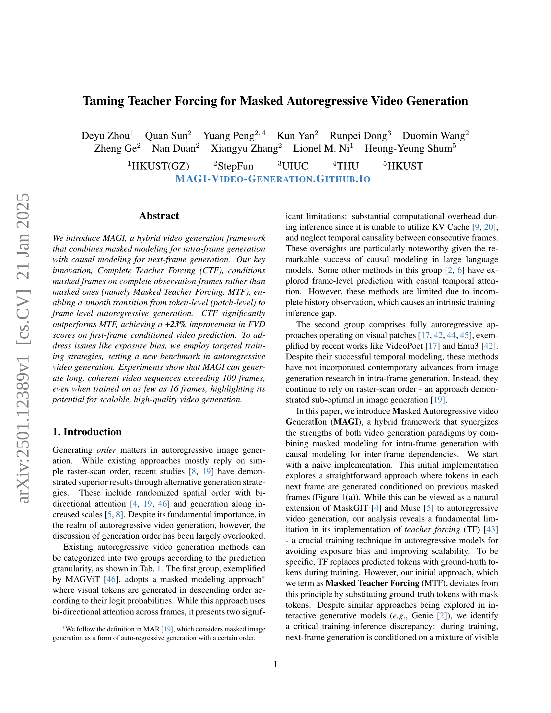
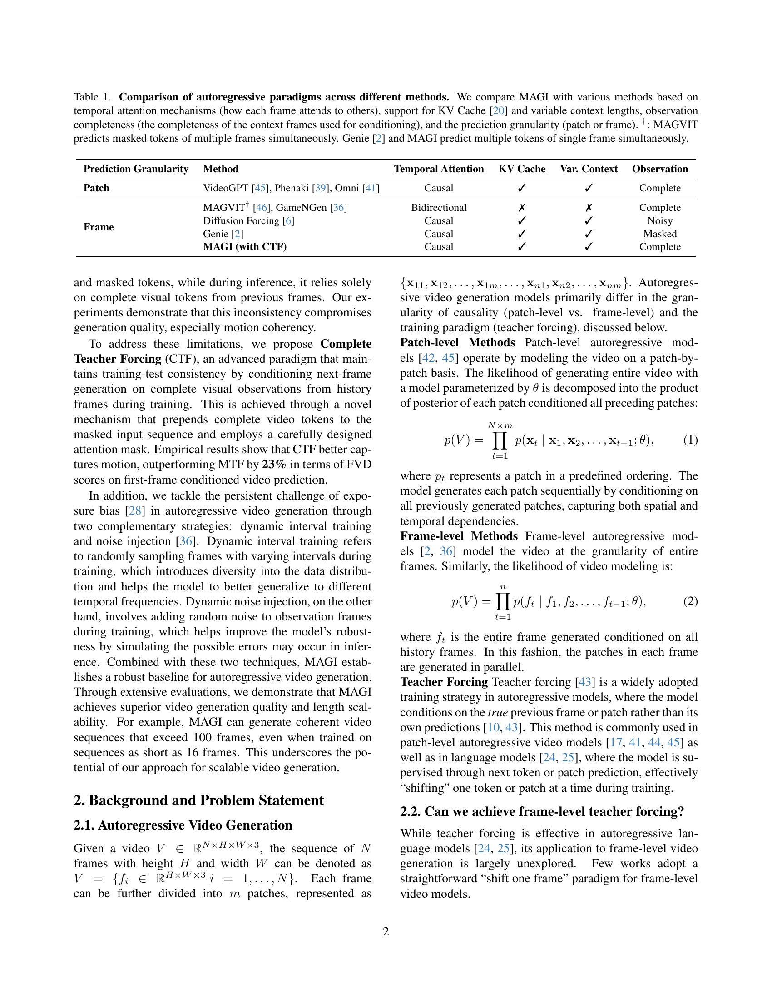
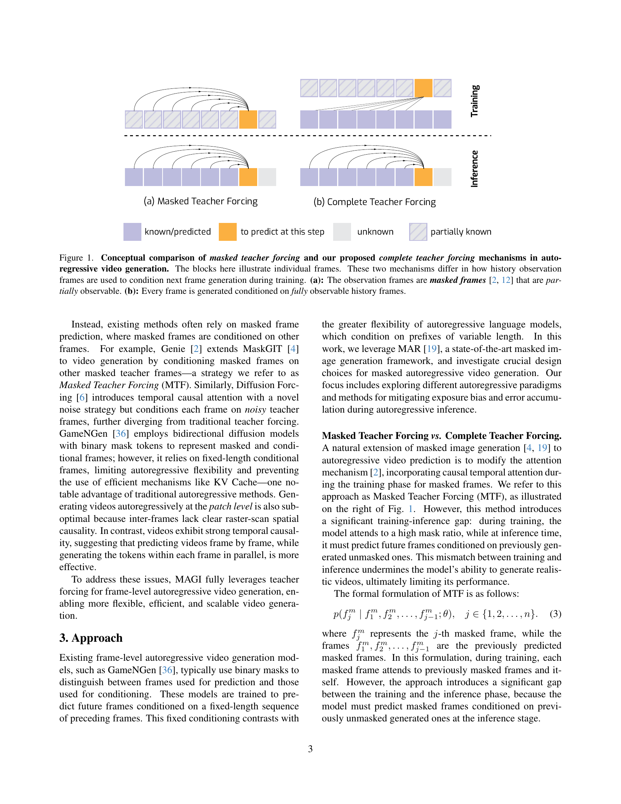
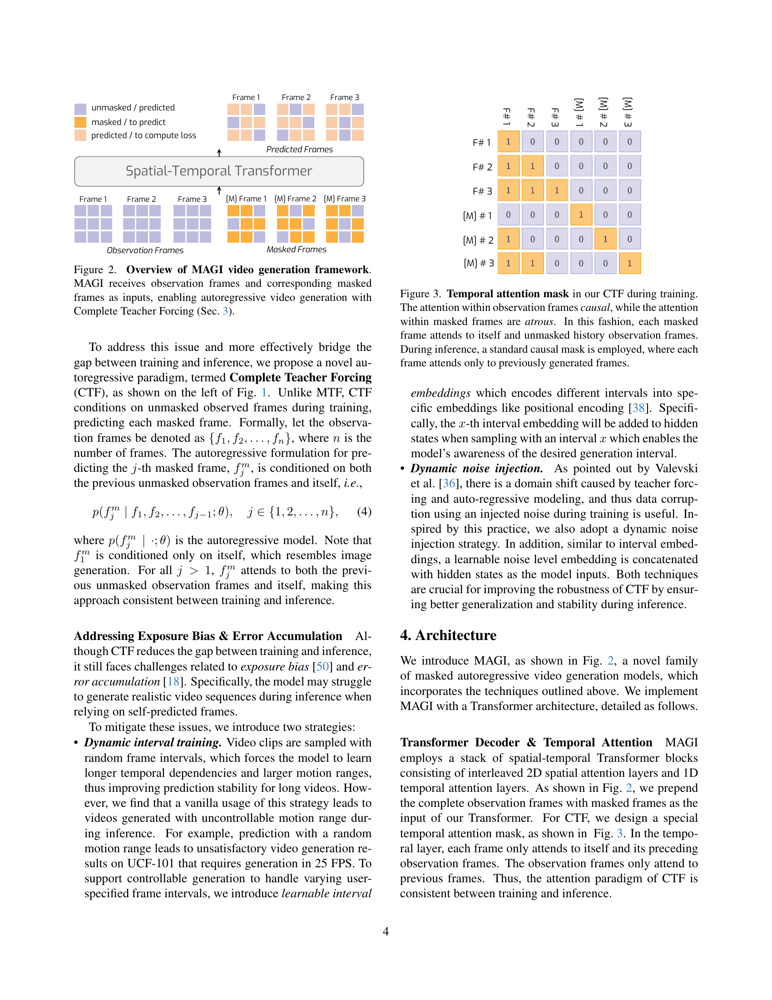
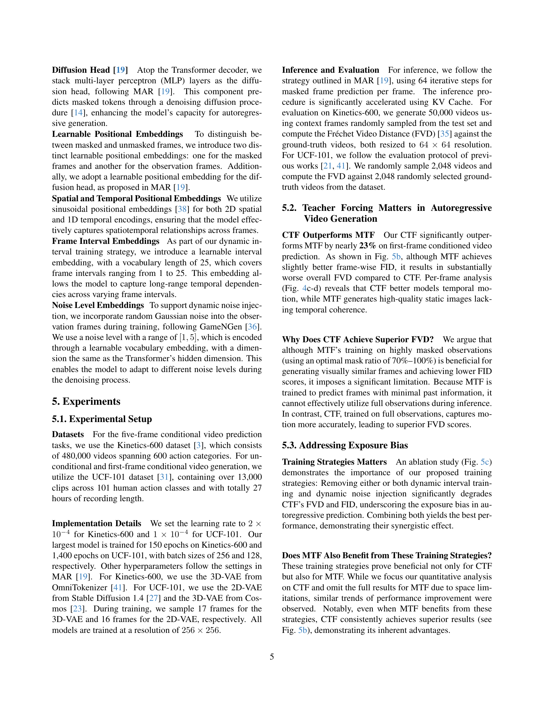
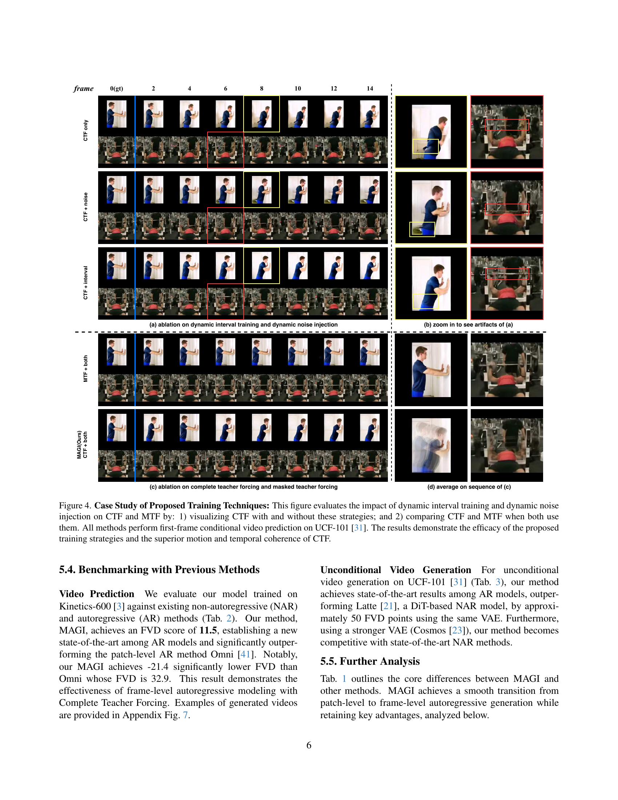
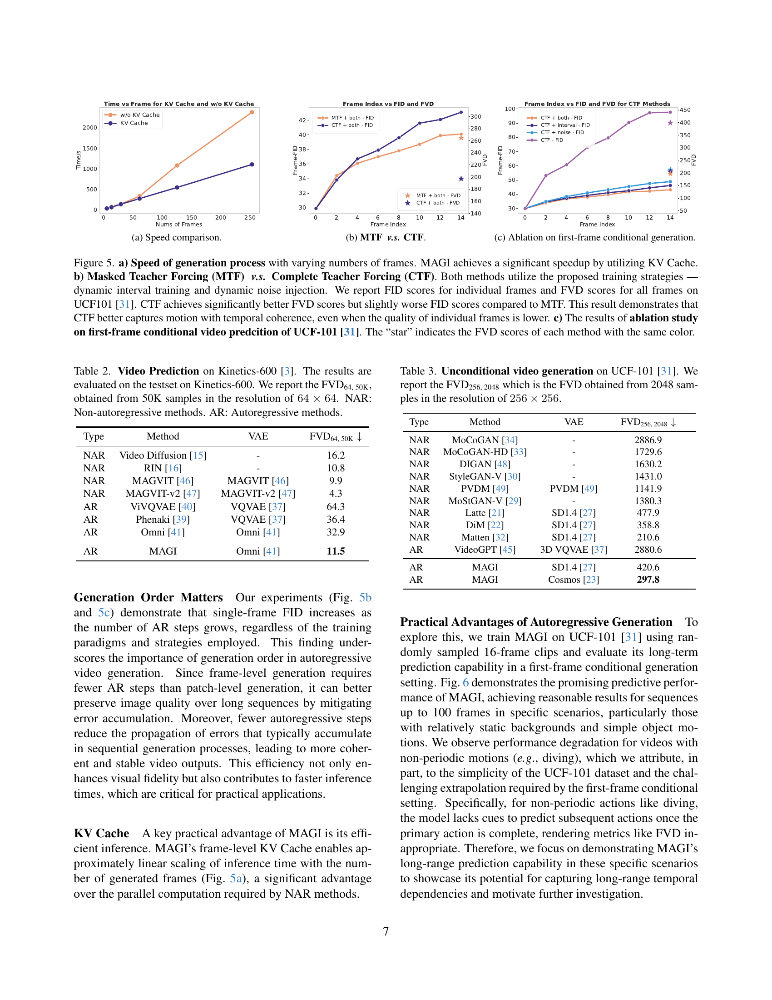
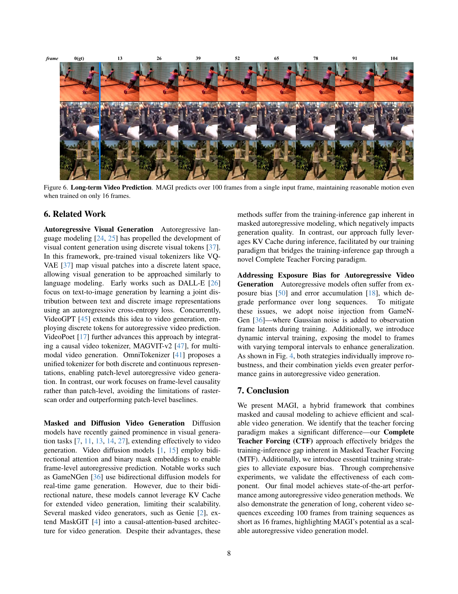
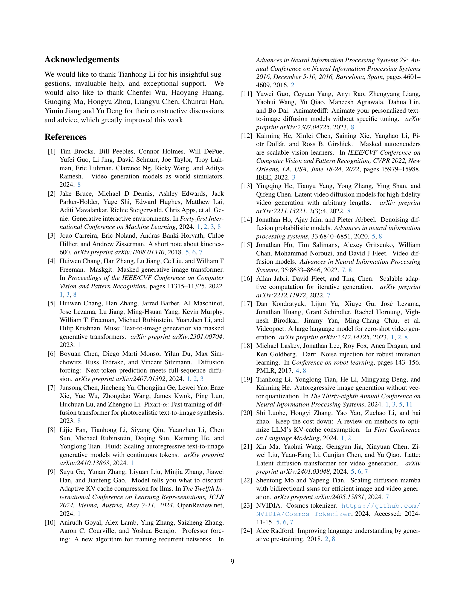
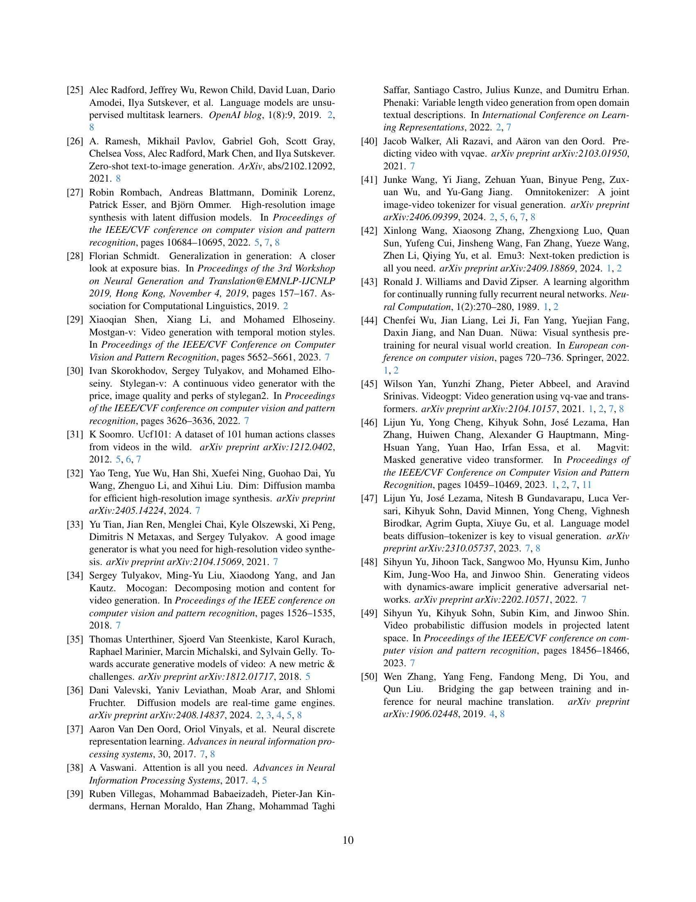
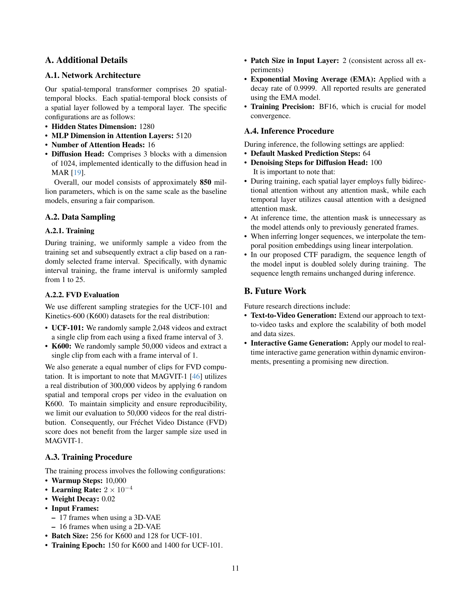
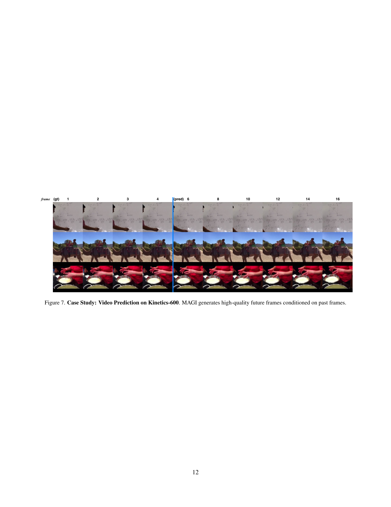
