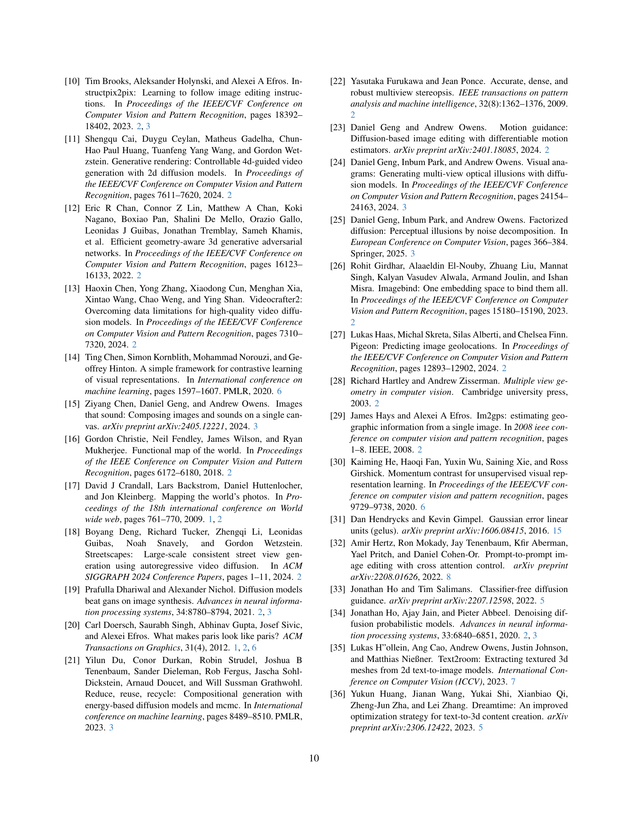
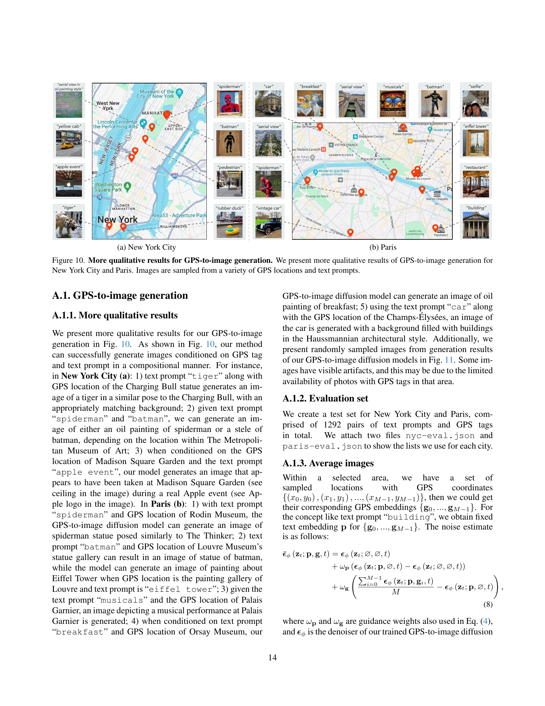

 


 2501.12390 
 Chao Feng et el. 
 
 🤗 2025-01-22 
 



↗ arXiv


↗ Hugging Face


↗ Papers with Code


### TL;DR



본 논문은 **GPS 위치 정보를 이미지 생성의 제어 신호로 활용**하는 새로운 방법을 제시합니다. 기존의 이미지 생성 모델들은 위치 정보를 고려하지 않아 도시의 다양한 환경을 정확하게 반영하는 데 어려움이 있었습니다. 이러한 문제를 해결하기 위해, 본 논문에서는 **GPS 정보와 텍스트 설명을 결합하여 이미지를 생성하는 확산 모델을 훈련**시켰습니다. 이 모델은 도시의 여러 장소의 고유한 특징을 포착하고, 텍스트 프롬프트에 따라 다양한 스타일의 이미지를 생성할 수 있습니다. 또한, 본 논문에서는 **GPS 정보를 활용하여 2D 이미지 모델에서 3D 모델을 추출하는 기술**을 제시합니다. 이를 통해, 별도의 카메라 위치 정보 없이도 3D 모델을 효율적으로 생성할 수 있게 되었습니다.

본 논문의 주요 기여는 **GPS 기반 이미지 생성 및 3D 모델 재구성의 정확도와 효율성을 높이는 새로운 방법론을 제시**한 것입니다.  실험 결과, 본 논문에서 제시된 모델은 기존 모델들보다 위치 정보를 더욱 정확하게 반영하고 3D 구조를 더욱 효과적으로 추정하는 것으로 나타났습니다. 본 연구는 도시 환경 분석, 자율 주행, 증강 현실 등 다양한 분야에 활용될 수 있는 잠재력을 지니고 있습니다.



#### Key Takeaways


 GPS 데이터를 이용해 도시의 미묘한 시각적 차이를 포착하는 이미지 생성 모델 개발 



 GPS 정보를 활용한 2D 이미지 모델에서 3D 모델을 추출하는 새로운 방법 제시 



 GPS 기반 조건화가 3D 구조 추정 성능 향상에 기여함을 보임 


#### Why does it matter?
**GPS 기반 이미지 생성 및 3D 모델 재구성 분야의 연구에 중요한 발전을 가져왔다**는 점에서 본 논문은 관련 연구자들에게 매우 중요합니다. **위치 정보를 활용하여 이미지 생성 및 3D 모델링의 정확도와 효율성을 높이는 새로운 방법론**을 제시함으로써, 향후 연구의 방향을 제시하고 다양한 응용 분야에 활용될 수 있습니다. 특히, **기존 방법의 한계를 극복하고 새로운 가능성을 열었다**는 점에서 학문적 가치와 실용적 가치 모두 큽니다.

------
#### Visual Insights

> 🔼 본 그림은 GPS 조건부 이미지 생성 모델을 사용하여 다양한 작업을 수행할 수 있는 능력을 보여줍니다. 맨해튼의 고밀도 지리 태깅 사진으로 훈련된 모델은 특정 지역의 전반적인 모습을 반영하고 박물관이나 공원과 같은 주요 랜드마크를 포착하는 이미지를 생성할 수 있습니다. 그림에는 다양한 GPS 위치와 텍스트 프롬프트에서 샘플링된 이미지가 나와 있습니다. 예를 들어, '베이글'이라는 텍스트 프롬프트가 있는 이미지는 현대 미술관을 조건으로 하면 현대식 조각상이 되고, 메트로폴리탄 미술관을 조건으로 하면 인상파 스타일의 그림이 됩니다. 또한, 점수 증류 샘플링을 사용하여 특정 랜드마크의 2D GPS-이미지 모델에서 자유의 여신상의 3D NeRF를 '끌어올리는' 방법도 보여줍니다. 더 자세한 예시는 프로젝트 웹페이지와 A.1.1절을 참조하십시오.
> 

> 
read the caption

> Figure 1: What can we do with a GPS-conditioned image generation model? We train GPS-to-image models and use them for tasks that require a fine-grained understanding of how images vary within a city. For example, a model trained on densely sampled geotagged photos from Manhattan can generate images that match a neighborhood’s general appearance and capture key landmarks like museums and parks. We show images sampled from a variety of GPS locations and text prompts. For example, an image with the text prompt “bagel” results in a modern-style sculpture when conditioned on the Museum of Modern Art and an impressionist-style painting when conditioned on the Metropolitan Museum of Art. We also “lift” a 3D NeRF of the Statue of Liberty from a landmark-specific 2D GPS-to-image model using score distillation sampling. Please see the project webpage and Sec. A.1.1 for more examples.
> 


| Method | CLIP Score (↑) | GPS Score (↑) | Avg (↑) |
|---|---|---|---|
| GPS NN | 18.77 | 13.66 | 16.22 |
| SD (Text&address) | 26.65 | 4.25 | 15.45 |
| SD (Text) | 29.13 | 1.21 | 15.17 |
| 1-4 Ours | 27.88 | 8.15 | 18.02 |
| Ours (w/o text) | – | 13.71 | – |

> 🔼 표 1은 GPS 기반 이미지 생성 모델의 성능을 평가한 결과를 보여줍니다. CLIP Score와 GPS Score 두 가지 지표를 사용하여 제안된 방법과 여러 기준 모델(가장 가까운 이웃, 안정적인 확산 모델)을 비교 분석했습니다. CLIP Score는 생성된 이미지와 텍스트 프롬프트 간의 정합도를, GPS Score는 생성된 이미지와 GPS 좌표 간의 정합도를 측정합니다. 표에서 가장 좋은 결과는 굵게 표시하고, 두 번째로 좋은 결과는 파란색으로 표시했습니다. 이를 통해 제안된 방법이 기준 모델보다 우수한 성능을 보임을 확인할 수 있습니다.
> 

> 
read the caption

> Table 1: Evaluation of GPS-to-image diffusion. We compare our method with several baselines in terms of CLIP Score and GPS Score. NN represents the nearest neighbor and SD is for stable diffusion. The best results are in bold, and the second bests are colored in blue.
> 

### In-depth insights

#### GPS-Image Synthesis
GPS-영상 합성은 **위치 정보를 활용하여 특정 위치의 영상을 생성하는 기술**입니다. 이는 단순히 이미지를 생성하는 것을 넘어, **특정 장소의 분위기, 건축 양식, 주변 환경 등을 반영한 사실적인 영상 생성**을 가능하게 합니다.  **GPS 데이터와 텍스트 정보를 결합**하여 다양한 스타일과 분위기의 영상을 생성할 수 있으며, 이를 통해 **가상 관광, 도시 계획, 게임 개발 등 다양한 분야**에 활용될 수 있습니다.  하지만 **GPS 데이터의 정확도, 데이터 편향, 개인정보보호 문제** 등 해결해야 할 과제도 존재합니다. **3D 모델 생성과의 연동**을 통해 더욱 실감나는 가상 환경을 구축할 수 있으며, 향후 발전 가능성이 매우 높은 기술입니다.

#### 3D from 2D GPS
본 논문의 "3D from 2D GPS" 부분은 **GPS 데이터를 활용하여 2차원 이미지에서 3차원 모델을 재구성하는 기술**에 대한 심도있는 논의를 제시합니다.  이는 단순한 이미지 처리를 넘어, **GPS 정보를 공간적 제약조건으로 활용하여 정확도 높은 3D 모델 생성**을 가능하게 합니다.  특히, 기존의 복잡한 3D 재구성 과정(예: SfM) 대신 **확산 모델 기반의 새로운 접근 방식**을 제시하여, 카메라 위치 추정이나 특징 매칭의 어려움을 해결합니다.  **GPS 정보와 이미지의 다중 모달 정보를 결합**하여, 이미지의 공간적 위치 정보를 정확히 파악하고 3D 구조를 효과적으로 추론하는 점이 핵심입니다.  **GPS 기반 조건화를 통해 3D 재구성의 정확도가 향상**되는 것을 실험적으로 증명하며, 기존 방법들과 비교하여 **3D 모델의 시각적 품질과 구조적 정확성이 개선**됨을 보여줍니다.  이는 자율주행, 증강현실 등 다양한 분야에서 **공간 정보를 필요로 하는 3D 모델링 기술의 발전**에 크게 기여할 것으로 예상됩니다.

#### Diffusion Model Tuning
확산 모델 미세 조정은 **기존의 사전 훈련된 확산 모델을 특정 작업이나 데이터셋에 맞게 조정하는 과정**입니다. 이는 제한된 양의 데이터만으로도 모델 성능을 향상시키는 효과적이고 효율적인 방법입니다.  **미세 조정의 목표는 모델이 원하는 출력을 생성하도록 가중치를 조정하는 것**이며, 이를 통해 특정 스타일, 개체 또는 특징을 가진 이미지 생성, 혹은 특정 텍스트에 대한 이미지 생성의 정확도를 높일 수 있습니다. **전이 학습과 유사하게, 사전 훈련된 모델의 특징 추출 능력을 활용하여 새로운 작업에 적응**할 수 있기 때문에, 훨씬 적은 데이터와 계산 비용으로 효과적인 결과를 얻을 수 있습니다. 하지만 **과적합 문제**는 미세 조정 과정에서 주의해야 할 중요한 문제이며, 적절한 정규화 기법이나 데이터 증강 기법을 사용하여 이를 방지해야 합니다.  **최적의 미세 조정 전략은 사용하는 데이터의 양과 질, 그리고 목표 작업의 복잡도에 따라 달라집니다.** 따라서, 다양한 하이퍼파라미터(학습률, epoch 수 등)와 미세 조정 기법을 실험하고 비교하여 최적의 설정을 찾는 것이 중요합니다.  **결론적으로, 확산 모델 미세 조정은 제한된 자원으로 고품질 이미지 생성 및 다양한 응용 분야에 확산 모델을 적용하는 데 매우 유용한 기술**입니다.

#### Geo-Visual Composition
본 논문에서 제시된 '지리-시각적 구성(Geo-Visual Composition)' 개념은 **GPS 데이터와 이미지 생성 모델을 결합하여 도시 환경을 사실적으로 묘사하는 새로운 방법론**을 의미합니다.  단순히 GPS 좌표 정보만을 사용하는 것이 아니라, **텍스트 프롬프트와 결합하여 특정 장소의 시각적 특징과 분위기를 세밀하게 제어**할 수 있다는 점이 핵심입니다.  **GPS 정보는 이미지의 공간적 맥락을 제공**하고, 텍스트 프롬프트는 **이미지의 내용과 스타일을 지정**하는 역할을 합니다.  이를 통해 기존 이미지 생성 모델의 한계를 넘어, 실제 도시 환경을 반영한 다양하고 정교한 이미지를 생성할 수 있습니다.  이는 **도시 계획, 관광, 게임 개발 등 다양한 분야에 응용 가능성**을 시사합니다.  특히 **3D 모델 재구성에도 활용**되어, 기존의 복잡한 3D 모델링 과정을 간소화할 수 있는 가능성을 보여줍니다.  **GPS 기반 조건화를 통해 3D 모델의 공간적 정합성을 높이고, 보다 정확한 3D 구조를 추정**할 수 있습니다.

#### Location-Based Control
위치 기반 제어는 **지리적 정보(GPS)**를 활용하여 이미지 생성 모델을 제어하는 기술을 의미합니다.  **GPS 좌표**를 입력으로 받아들여 특정 지역의 고유한 시각적 특징을 반영한 이미지를 생성할 수 있습니다. 이는 단순한 이미지 생성을 넘어 **공간적 정보와 시각적 정보의 통합**을 시도하는 혁신적인 접근 방식입니다.  **도시 환경의 미묘한 차이**를 이미지에 반영함으로써, 기존의 텍스트나 레이블 기반 제어 방식의 한계를 극복할 수 있습니다. 예를 들어, 특정 장소의 건축 양식, 자연 환경, 주변 인프라 등을 정확하게 반영한 이미지를 생성하는 것이 가능해집니다.  **3D 모델링**과의 연계를 통해, 2D 이미지 생성을 넘어 **현실 세계를 가상으로 재현**하는 데 활용될 수 있다는 점도 주목할 만합니다.  하지만 **GPS 데이터의 정확도**와 **데이터 편향** 문제는 여전히 해결해야 할 과제입니다.  **데이터 수집의 어려움**과 **모델의 일반화 성능** 향상을 위한 추가적인 연구가 필요합니다.  **개인 정보 보호** 문제 또한 고려되어야 하는 중요한 요소입니다.

### More visual insights

More on figures

> 🔼 그림 2는 GPS 기반 이미지 생성 모델의 학습 및 활용 방법을 보여줍니다. (a)는 GPS 태그와 텍스트 프롬프트를 조건으로 하는 GPS-이미지 생성 모델의 학습 과정을 나타냅니다. 학습된 모델은 두 가지 조건 신호를 조합하여 이미지를 생성합니다. (b)는 특정 랜드마크에 대한 GPS-이미지 생성 모델에서 점수 증류 샘플링을 사용하여 3D 모델을 추출하는 방법을 보여줍니다. 랜드마크 중심을 기준으로 방위각을 사용하여 GPS 위치를 매개변수화합니다. '+' 기호는 GPS 임베딩과 텍스트 임베딩을 연결함을 나타냅니다.
> 

> 
read the caption

> Figure 2: Method. (a) After downloading geotagged photos, we train a GPS-to-image generation model conditioned on GPS tags and text prompts. The trained generative model can produce images using both conditioning signals in a compositional manner. (b) We can also extract 3D models from a landmark-specific GPS-to-image model using score distillation sampling. This diffusion model parameterizes the GPS location by the azimuth with respect to a given landmark’s center. + means we concatenate GPS embeddings and text embeddings.
> 

> 🔼 그림 3은 2D GPS 기반 이미지 생성 모델로부터 3D 모델을 추출하는 세 가지 방법을 비교한 그림입니다. (a)는 전통적인 SfM(Structure from Motion) 기반 접근 방식으로, 카메라 위치 추정 및 밀집 기하학적 정보 추정을 위해 SfM을 실행해야 합니다. 삼각측량에 기반하므로 부정확한 자세로 인해 치명적인 오류가 발생할 수 있습니다. (b)는 DreamFusion [64]로, 시점에 따라 다른 프롬프트를 사용하여 장면 내 여러 위치의 이미지를 샘플링합니다. 하지만 텍스트만으로는 카메라 위치를 정확하게 제어하는 데 한계가 있습니다. (c)는 본 논문에서 제안하는 방법으로, DreamFusion에 GPS 조건화를 추가하여 자세의 불확실성을 줄입니다. GPS 정보를 활용하여 3D 모델 재구성에 필요한 시점 정보를 더욱 정확하게 얻을 수 있습니다. 
> 

> 
read the caption

> Figure 3: 3D Setup Comparison. We extract 3D models from 2D GPS-to-image models. (a) Traditional approaches require running SfM to estimate camera pose, followed by dense geometry estimation. Since they are based on triangulation, they are susceptible to catastrophic errors due to incorrect pose; (b) DreamFusion [64] samples images from different poses within a scene using view-dependent prompting. However, text has a limited ability to precisely control the position of the camera. (c) Our method extends DreamFusion with GPS conditioning, reducing pose uncertainty.
> 

> 🔼 그림 4는 파리의 다양한 위치와 프롬프트에서 GPS 기반 이미지 확산 모델로부터 샘플링된 이미지들을 보여줍니다.  각 이미지는 특정 위치의 고유한 시각적 특징과 프롬프트에 따른 내용을 반영하여 생성되었습니다.  이를 통해, 모델이 GPS 정보와 텍스트 프롬프트를 조합하여 다양한 스타일과 내용의 이미지를 생성할 수 있음을 보여줍니다.
> 

> 
read the caption

> Figure 4: Qualitative results for Paris. We show images that have been sampled from our GPS-to-image diffusion model for various locations and prompts within Paris.
> 

> 🔼 그림 5는 GPS 기반 이미지 생성 모델의 성능을 다양한 기준과 비교하여 보여줍니다.  특정 텍스트 프롬프트와 GPS 좌표를 사용하여 생성된 이미지들을 보여주는 여러 열로 구성되어 있습니다. 각 열은 텍스트 프롬프트, GPS 좌표, GPS 좌표로부터 추출한 주소를 포함한 텍스트-주소 기반 이미지 생성 모델 결과, GPS 좌표 기반으로 학습 데이터셋에서 가장 가까운 이미지(Nearest Neighbor), 그리고 본 논문에서 제안하는 GPS 좌표와 텍스트 프롬프트를 모두 조건으로 사용하는 GPS-이미지 생성 모델 결과, 마지막으로 지리적 위치를 참조하기 위한 Google Street View 이미지를 보여줍니다.  본 논문의 GPS-이미지 생성 모델은 더 나은 구성 및 시각적 품질을 달성합니다.
> 

> 
read the caption

> Figure 5: Qualitative comparison for GPS-to-image diffusion. We compare the qualitative results of our method against baselines using specific pairs of text prompts and GPS tags. Each column shows a text prompt and a GPS tag at the top. Text-address-to-image diffusion model is conditioned on a combination of the text prompt and the address name derived from the GPS tag. We also perform nearest neighbor in the training set based on GPS tags. Our GPS-to-image diffusion model uses a text prompt and raw GPS tag as conditioning. Google Street View images are sampled for reference of geolocation. Our method achieves better compositionality and visual quality.
> 

> 🔼 그림 6은 GPS 기반 이미지 생성 모델을 사용하여 파리와 뉴욕시의 다섯 개 지역에서 '건물'이라는 개념을 나타내는 대표 이미지를 생성한 결과를 보여줍니다. 각 지역의 건축 양식을 관찰하기 위해, 해당 지역 내 여러 GPS 위치에서 생성된 이미지들을 평균하여 하나의 대표 이미지를 만들었습니다. 이를 통해 각 지역의 고유한 건축 양식을 시각적으로 비교 분석할 수 있습니다. 프로젝트 웹페이지에서는 더 많은 지역과 개념에 대한 예시 이미지를 확인할 수 있습니다.
> 

> 
read the caption

> Figure 6: Average images. We select five areas for Paris and New York City respectively. Using our GPS-to-image models, we obtain representative images of the concept of “building” within these geographic regions to observe architectural styles. More examples can be found on project webpage for different locations and concepts.
> 

> 🔼 그림 7은 3D 기념물 재구성에 대한 정량적 비교를 보여줍니다. DreamFusion [64]과 본 연구의 방법을 사용하여 피사의 사탑과 개선문이라는 두 개의 기념물에 대한 정성적 결과를 보여줍니다. 재구성된 3D 기념물은 더 나은 시각적 품질과 더 정확한 3D 구조를 가지고 있습니다. RGB 렌더링의 배경을 흰색으로 만들기 위해 렌더링된 깊이를 사용했습니다. 더 많은 예시는 부록 A.2.2와 프로젝트 웹페이지를 참조하십시오.
> 

> 
read the caption

> Figure 7: Qualitative comparison for 3D monument reconstruction. We show qualitative results of DreamFusion [64] and our method on two monuments: 1) Leaning Tower of Pisa; 2) Arc de Triomphe. Our reconstructed 3D monuments have better visual quality and more accurate 3D structure. We use rendered depth to make the background of RGB rendering white. Please see Appendix A.2.2 and project webpage for more examples.
> 

> 🔼 그림 8은 본 논문에서 제안하는 방법의 GPS 기반 이미지 생성 및 3D 랜드마크 재구성에 사용된 여러 모듈의 효과를 분석하기 위해 수행된 ablation study 결과를 보여줍니다.  두 개의 그래프는 각각 GPS 기반 이미지 생성과 3D 랜드마크 재구성에 대한 ablation 결과를 나타냅니다.  GPS 정보 표현 방식, prior preservation 손실 함수 사용 여부, GPS 조건화 사용 여부 등 다양한 요소들을 제거하거나 변경하여 성능 변화를 측정하였습니다. 이를 통해 각 모듈의 기여도를 정량적으로 평가하고, 제안된 방법의 성능에 대한 통찰력을 제공합니다.
> 

> 
read the caption

> Figure 8: Ablation. We conducted ablation studies to analyze the effectiveness of different modules in our method for GPS-to-image generation and 3D landmark reconstruction.
> 

> 🔼 그림 9는 주어진 텍스트 프롬프트와 GPS 좌표에 대한 어텐션 맵을 시각화하여 모델이 이미지 생성 시 어떤 정보에 집중하는지 보여줍니다.  각 이미지는 텍스트와 GPS 정보에 대한 어텐션 맵을 함께 보여주어, 모델이 위치 정보와 텍스트 내용을 어떻게 결합하여 이미지를 생성하는지 이해하는 데 도움을 줍니다. 예를 들어, '노란 택시'라는 텍스트와 함께 특정 GPS 좌표가 주어지면 모델은 노란 택시와 주변 환경에 어텐션을 집중하며, '관광객'이라는 텍스트와 특정 GPS 좌표가 함께 주어지면 관광객과 그 주변 건물 및 환경에 어텐션을 집중하는 것을 확인할 수 있습니다. 이를 통해 모델이 GPS 위치 정보를 정확하게 반영하여 이미지를 생성하는 과정을 보다 자세히 파악할 수 있습니다.
> 

> 
read the caption

> Figure 9: Attention visualization. We visualize attention maps for text and GPS tokens.
> 

More on tables


| Method | Angle acc (%) |
|---|---| 
| Random chance | 2.78 |
| Stable Diffusion [67] | 3.06 |
| Ours | **22.36** |
> 🔼 표 2는 GPS 데이터를 사용하여 각도 조건이 부여된 이미지 생성 모델의 정확도를 평가한 결과를 보여줍니다.  각도 추정 모델을 이용해 정확한 방위각을 가진 이미지를 생성하는 모델의 정확도를 측정하였습니다.  랜덤, 기존의 Stable Diffusion 모델, 그리고 제안된 모델 세 가지 방법의 정확도를 비교하여 제안된 모델의 우수성을 보여줍니다.
> 

> 
read the caption

> Table 2: Evaluation of angle-to-image diffusion.  We evaluate the accuracy of our model in generating images with the correct azimuth, as determined by an image-to-azimuth model.
> 


| Method | CS (↑) | PQ (↑) | TS (↑) |
|---|---|---|---|
| NeRF [84] | 20.57 | 1.32 | 1.36 |
| Dreamfusion [64] | 29.49 | 2.21 | 2.09 |
| Ours | **31.87** | **3.31** | **3.45** |
> 🔼 표 3은 제시된 세 가지 3D 측정 기준(CLIP 점수, 지각 품질 점수, 관광객 점수)에 대한 정량적 비교 결과를 보여줍니다.  CLIP 점수는 생성된 3D 랜드마크와 해당 텍스트 프롬프트 간의 정렬 정도를 측정합니다. 지각 품질 점수는 생성된 3D 자산의 품질을 평가하는 주관적인 척도이며, 관광객 점수는 실제 관광 사진과 비교하여 생성된 3D 랜드마크의 품질을 평가하는 주관적인 척도입니다. 이 표는 본 논문에서 제안된 방법이 다른 기준 방법들보다 높은 품질의 3D 랜드마크를 생성함을 보여줍니다.
> 

> 
read the caption

> Table 3: Quantitative comparison for 3D. We report results: CLIP Score (CS) [65], Perceptual Quality (PC), and Tourist Score (TS). It shows that our method achieves the highest quality.
> 

### Full paper



