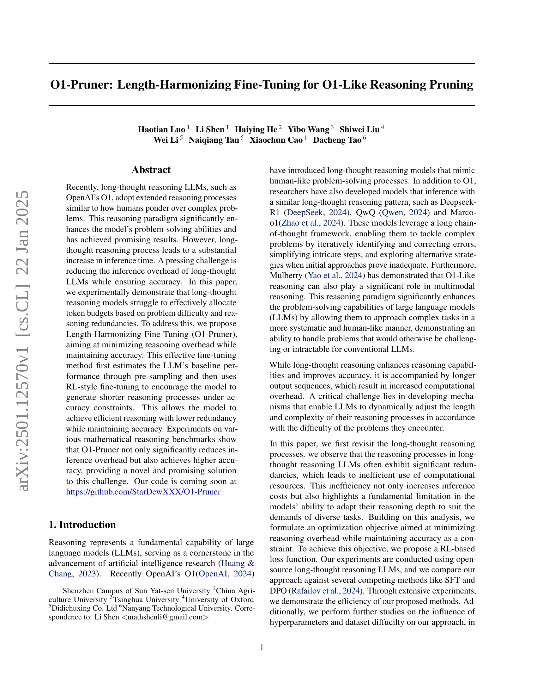
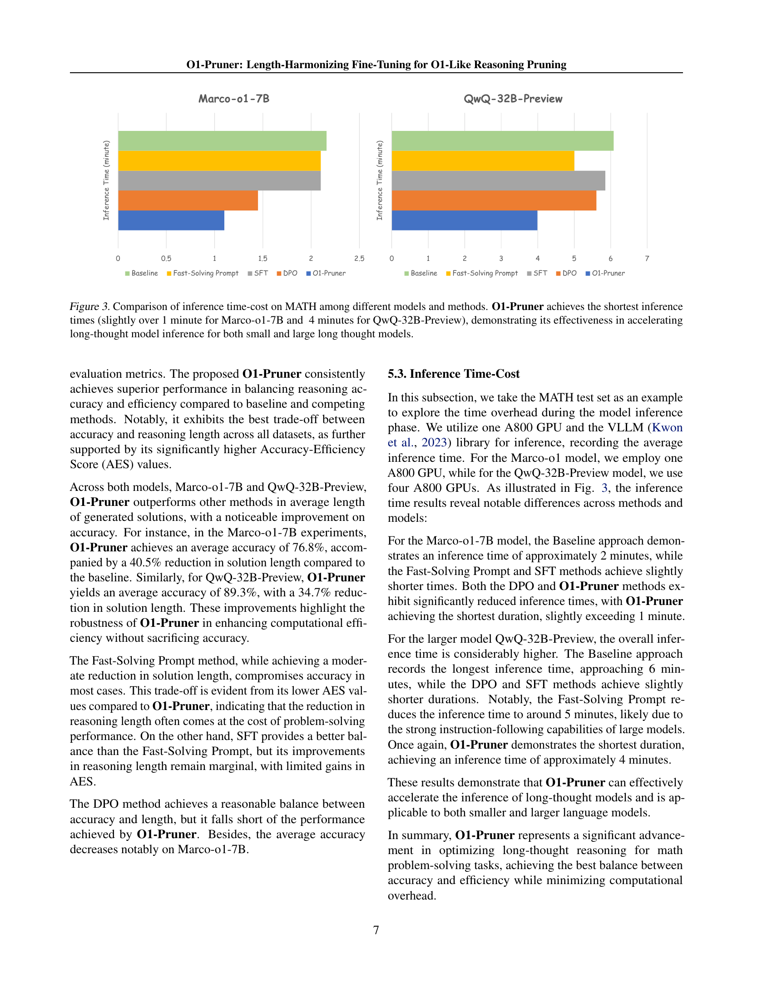

 


 2501.12570 
 Haotian Luo et el. 
 
 🤗 2025-01-23 
 



↗ arXiv


↗ Hugging Face


↗ Papers with Code


### TL;DR



장문 추론(long-thought reasoning)은 인간과 유사한 추론 과정을 통해 복잡한 문제 해결 능력을 향상시키는 최신 언어 모델의 중요한 특징입니다. 하지만, 이러한 장점에도 불구하고, 장문 추론 모델은 추론 과정에서 불필요한 중복이 발생하여 추론 시간이 과도하게 증가하고, 문제 난이도에 따라 적절히 토큰을 배분하지 못하는 등의 비효율성을 보입니다.  이로 인해, 추론 속도 저하와 연산 자원 낭비라는 문제가 발생합니다.

본 논문에서는 이러한 문제를 해결하기 위해 **길이 조정 미세 조정(Length-Harmonizing Fine-Tuning, O1-Pruner)** 기법을 제안합니다. O1-Pruner는 우선 모델의 기본 성능을 사전 샘플링을 통해 예측하고, 강화 학습 기반 미세 조정을 통해 정확도를 유지하면서 추론 과정을 단축시키는 방식으로 동작합니다.  실험 결과, O1-Pruner는 다양한 수학적 추론 벤치마크에서 추론 오버헤드를 크게 줄이면서 정확도를 높이는 효과를 보였습니다. 이는 장문 추론 모델의 효율성을 크게 향상시킬 수 있는 **새로운 해결책**을 제시한 것으로 평가됩니다.



#### Key Takeaways


 장문 추론 모델의 비효율적인 추론 과정을 분석하고, '길이 불일치' 현상을 규명 



 길이 조정 미세 조정(O1-Pruner) 기법을 제안하여 추론 오버헤드 감소 및 정확도 향상 달성 



 다양한 수학적 추론 벤치마크에서 O1-Pruner의 우수성을 실험적으로 입증 


#### Why does it matter?
이 논문은 **장문 추론 언어 모델의 추론 효율성을 높이는 새로운 방법론**을 제시하여, **추론 시간 단축과 정확도 향상**이라는 두 마리 토끼를 잡을 수 있는 잠재력을 보여줍니다.  현재 많은 연구자들이 장문 추론 모델의 성능 향상에 주력하고 있는 가운데, 본 연구는 **실질적인 문제 해결에 기여**할 수 있고, **향후 연구 방향**에 대한 시사점을 제공한다는 점에서 중요한 의미를 가집니다. 특히, **제한된 자원**을 가진 연구자들에게도 적용 가능한 효율적인 방법론을 제시함으로써, 보다 폭넓은 연구 활동을 가능하게 할 것으로 예상됩니다.

------
#### Visual Insights

> 🔼 그림 1은 각 문제에 대한 정확도-길이 관계를 인스턴스 수준에서 보여줍니다.  정확도와 길이 간의 관계는 문제마다 크게 달라지며, 최고 정확도는 짧은, 중간 또는 긴 간격에서 나타납니다. 특히 짧은 간격에서도 높은 정확도가 유지되는 경우가 많다는 것을 보여줍니다. 즉, 긴 추론 과정을 거치는 모델이 항상 더 나은 정확도를 제공하는 것은 아니며, 오히려 짧은 추론 과정에서도 높은 정확도를 달성할 수 있음을 시사합니다.
> 

> 
read the caption

> Figure 1: Accuracy-Length Relationship at Instance level. The relationship between length and accuracy varies significantly across problems, with peak accuracy occurring at short, medium, or long intervals. Notably, high accuracy often persists in shorter intervals.
> 


| Model | Interval 1 | Interval 2 | Interval 3 | Interval 4 |
|---|---|---|---|---|
| Marco | 81.1 | 80.2 | 78.8 | 75.3 |
| QwQ | 44.9 | 49.9 | 45.9 | 45.3 |

> 🔼 표 1은 모델이 생성한 답변의 길이에 따른 정확도의 분포를 보여줍니다.  답변 길이를 네 구간으로 나누어 각 구간에서의 평균 정확도를 계산했습니다.  Marco-01과 QwQ-32B 두 모델 모두에서 답변 길이가 짧을수록 평균 정확도가 더 높은 경향을 보임을 알 수 있습니다.  즉,  더 긴 추론 과정이 항상 더 좋은 결과를 보장하지 않으며, 오히려 불필요한 계산 비용을 초래할 수 있음을 시사합니다.
> 

> 
read the caption

> Table 1: Accuracy-Length Relationship at Distribution Level. A larger interval number indicates a longer solution length. For both models, the average accuracy is higher when the solution length is short.
> 

### In-depth insights

#### Length Disharmony
본 논문에서 제기하는 '길이 불균형(Length Disharmony)' 개념은 **장문 추론(Long-thought Reasoning)**을 사용하는 대규모 언어 모델(LLM)의 비효율성을 명확히 보여줍니다.  **문제의 복잡성에 관계없이 일관되게 긴 추론 과정을 생성하는 경향**은 불필요한 연산 비용을 초래합니다.  **짧은 응답으로도 충분한 정확도를 달성할 수 있는 경우가 많음에도 불구하고, 모델은 과도하게 긴 응답을 생성**하는데, 이는 토큰 할당의 비효율성을 의미합니다.  이러한 비효율성은 단순히 비용 문제를 넘어, 모델이 다양한 작업의 요구에 맞춰 추론 깊이를 조절하는 능력의 한계를 드러냅니다.  **문제 난이도에 따른 추론 길이 조절 실패**는  '길이 불균형'의 핵심이며,  이를 해결하기 위한 효율적인 미세 조정 기법의 필요성을 강조합니다.  **O1-Pruner와 같은 최적화 기법은 이러한 문제를 해결하기 위한 시도**로, 정확도를 유지하면서 추론 오버헤드를 최소화하는 데 초점을 맞추고 있습니다.

#### RL-Style Fine-Tuning
본 논문에서 제시된 RL 스타일 파인튜닝은 기존의 지도학습 방식을 넘어 강화학습의 개념을 도입하여 **모델의 추론 과정을 최적화**하는 데 초점을 맞춥니다.  **길이 불일치 문제**를 해결하기 위해,  **보상 함수**를 통해 모델이 정확성을 유지하면서 보다 간결한 추론 과정을 생성하도록 유도합니다. 이는 단순히 짧은 답변을 생성하는 것이 아니라 문제의 복잡도에 따라 적절한 길이의 추론 과정을 선택하는 **지능적인 방법**입니다.  **사전 샘플링을 통해 기준 성능을 측정**하고, 강화학습 기반의 파인튜닝을 통해  **정확도 제약 조건 하에서 추론 과정의 길이를 줄이는 것을 목표**로 합니다.  이는  **계산 비용 절감과 효율성 증대**로 이어질 뿐 아니라,  **모델의 투명성과 해석성을 높이는 데 기여**할 수 있습니다.  **오프-폴리시 학습 방식**을 채택하여 학습 효율을 높이고, **PPO(Proximal Policy Optimization)** 기법을 적용하여 안정적인 학습을 보장합니다. 이러한 RL 스타일 파인튜닝은  **단순한 길이 최소화를 넘어 문제 해결에 필요한 최소한의 추론 단계만을 거치도록 모델을 유도**하여, **진정한 의미의 효율적인 추론을 가능**하게 만듭니다.

#### O1-Pruner Method
본 논문에서 제안하는 O1-Pruner 방법은 **긴 추론 과정을 가진 언어 모델(LLM)의 추론 효율성을 높이는 데 초점**을 맞춥니다.  기존의 장문 추론 모델들은 복잡한 문제 해결 과정에서 불필요한 토큰을 사용하는 경향이 있는데, 이는 추론 시간을 증가시키는 주요 원인입니다. O1-Pruner는 **강화 학습(RL) 기반 미세 조정 기법**을 통해 모델이 정확성을 유지하면서 더 짧은 추론 과정을 생성하도록 유도합니다. 이는 **문제의 난이도에 따라 추론 길이를 동적으로 조절**하는 능력을 향상시켜 효율적인 추론을 가능하게 합니다.  핵심은 **사전 샘플링을 통한 기준 성능 측정**과 **정확도 제약 조건 하에서 짧은 추론 과정을 생성하도록 유도하는 RL 기반 미세 조정**입니다.  실험 결과는 O1-Pruner가 추론 시간을 단축하면서 정확도를 향상시키는 효과를 보여주어, **장문 추론 모델의 효율성 문제를 해결하는 유망한 방법**임을 시사합니다.

#### Efficiency vs. Accuracy
본 논문은 장문 추론을 하는 LLM의 효율성과 정확성 간의 상충 관계를 탐구합니다. **장문 추론은 인간과 유사한 문제 해결 과정을 통해 정확도를 높일 수 있지만, 추론 시간이 늘어나는 비효율성을 야기합니다.** 따라서 효율성(추론 시간 단축)과 정확성을 동시에 만족시키는 방법이 중요한 연구 과제입니다. 논문에서 제시된 Length-Harmonizing Fine-Tuning (O1-Pruner) 기법은 **추론 과정의 중복성을 줄여서 추론 시간을 단축하면서 정확성을 유지하는** 접근 방식을 보여줍니다. 이는 추론 길이와 정확도 간의 최적의 균형점을 찾는 것을 목표로 합니다.  **모델이 문제 난이도에 따라 추론 길이를 적절히 조절하도록 학습시키는 것**이 핵심이며, 실험 결과를 통해 이 기법의 효과를 검증합니다.  하지만, **최적의 균형점은 문제 유형, 모델 크기, 사용 데이터 등 여러 요소에 따라 달라질 수 있으며**,  모든 상황에서 일률적으로 적용될 수 있는 일반적인 해결책은 아니라는 점을 염두에 두어야 합니다.  향후 연구는 이러한 요소들을 고려한 더욱 정교한 방법론을 개발하는 데 초점을 맞춰야 할 것입니다.

#### Future Research
본 논문에서 제시된 Length-Harmonizing Fine-Tuning (O1-Pruner) 기법은 장문 추론 LLM의 효율성을 높이는 데 상당한 성과를 보였지만, **추후 연구를 통해 더욱 개선 및 확장할 여지**가 많습니다.  **다양한 문제 유형 및 데이터셋에 대한 일반화 성능 향상**은 중요한 과제입니다.  현재는 수학적 추론 문제에 집중되어 있으므로, 다른 영역 (예: 자연어 이해, 코드 생성)으로의 확장 연구가 필요합니다.  또한, **O1-Pruner의 성능에 영향을 미치는 하이퍼파라미터에 대한 심층적인 분석**을 통해 최적화된 설정을 제시할 필요가 있습니다.  **다른 LLM 아키텍처 및 추론 전략과의 호환성 연구**도 중요합니다.  마지막으로, **O1-Pruner의 이론적 토대를 강화**하여, 추론 과정의 효율성 향상 메커니즘을 더 명확히 규명하는 연구가 필요합니다. 이를 통해 O1-Pruner가 갖는 장점과 한계를 명확히 파악하고, 보다 널리 활용될 수 있도록 기여할 수 있을 것입니다.

### More visual insights

More on figures

> 🔼 그림 2는 제안된 01-Pruner 방법의 학습 및 추론 과정을 보여줍니다. 학습 단계에서는 각 문제에 대해 기준 모델(reference model)에서 여러 번 샘플링하여 다양한 답변을 생성합니다. 그런 다음 최적화할 모델에서 샘플링하여 기준 모델의 샘플들과 비교하여 보상(reward)을 계산합니다. 강화 학습 방식(RL-style fine-tuning)을 통해 모델이 보상을 최대화하도록 학습합니다. 추론 단계에서는 01-Pruner를 통해 학습된 모델이 추론 속도가 훨씬 빨라지고 정확도가 향상되는 것을 보여줍니다.
> 

> 
read the caption

> Figure 2: Length-Harmonizing Fine-Tuning. During the training phase, for each problem, we sample multiple times from the reference model. Subsequently, we sample from the model to be optimized and compute the reward based on the reference samples, followed by a RL-style fine-tuning. During the inference phase, the model optimized through O1-Pruner demonstrates a significant improvement in inference speed, along with a noticeable enhancement in accuracy.
> 

> 🔼 그림 3은 다양한 모델과 방법을 사용하여 MATH 데이터셋에서 추론 시간 비용을 비교한 것입니다. O1-Pruner는 Marco-01-7B 모델의 경우 1분 약간 초과, QwQ-32B-Preview 모델의 경우 4분으로 가장 짧은 추론 시간을 달성하여, 소형 및 대형 장기 추론 모델 모두에서 장기 추론 모델 추론 속도 향상에 대한 효과를 보여줍니다.  막대 그래프는 각 모델과 방법에 대한 추론 시간을 비교하여 보여줍니다.  각 막대의 길이는 추론 시간에 비례하며, O1-Pruner가 다른 방법들보다 훨씬 짧은 추론 시간을 가짐을 명확하게 보여줍니다.
> 

> 
read the caption

> Figure 3: Comparison of inference time-cost on MATH among different models and methods. O1-Pruner achieves the shortest inference times (slightly over 1 minute for Marco-o1-7B and  4 minutes for QwQ-32B-Preview), demonstrating its effectiveness in accelerating long-thought model inference for both small and large long thought models.
> 

> 🔼 그림 4는 다양한 난이도의 문제들로 학습된 모델들의 MATH 테스트셋 성능을 보여줍니다. 더 어려운 문제들로 학습된 모델일수록 더 긴 답변을 생성하는 경향이 있지만, 어려운 문제들을 푸는 능력이 향상되어 정확도 또한 높아집니다. 반대로, 쉬운 문제들로 학습된 모델들은 답변 길이가 짧아지지만, 정확도 향상은 없다는 것을 보여줍니다. 이는 모델의 학습 데이터 난이도에 따라 답변 길이와 정확도 간의 상관관계가 다르게 나타남을 시사합니다.
> 

> 
read the caption

> Figure 4:  Performance on MATH Test-set When Trained on Problems of Different Difficulty Levels. Models trained on more challenging datasets tend to generate longer solutions, while learning to solve harder problems enhances model accuracy. In contrast, for less challenging datasets, shorter solutions are produced without a corresponding accuracy improvement.
> 

More on tables


| Model | MATH Acc | MATH Length | MATH AES | GSM8K Acc | GSM8K Length | GSM8K AES | GaoKao Acc | GaoKao Length | GaoKao AES | AVERAGE Acc | AVERAGE Length | AVERAGE AES |
|---|---|---|---|---|---|---|---|---|---|---|---|---|
| **Marco-o1-7B** |  |  |  |  |  |  |  |  |  |  |  |  |
| _full fine-tune_ |  |  |  |  |  |  |  |  |  |  |  |  |
| Baseline | 73.8 | 1156 | 0 | 89.2 | 530 | 0 | 57.1 | 1112 | 0 | 73.4 | 932 | 0 |
| Fast-solving Prompt | 71.0 | 1113 | 0.15 | 81.7 | 447 | 0.41 | 57.1 | 1062 | 0.04 | 69.9 | 874 | 0.20 |
| SFT | 73.6 | 1076 | 0.08 | 89.9 | 497 | 0.09 | 56.3 | 1066 | 0.08 | 73.3 | 880 | 0.08 |
| DPO | 71.8 | 761 | 0.42 | 88.6 | 410 | 0.25 | 56.6 | 780 | 0.32 | 72.3 | 650 | 0.33 |
| **O1-Pruner** | 77.5 | 657 | 0.58 | 91.4 | 343 | 0.43 | 61.6 | 664 | 0.64 | 76.8 | 554 | 0.55 |
| **QwQ-32B-Preview** |  |  |  |  |  |  |  |  |  |  |  |  |
| _freeze fine-tune last 48 layers_ |  |  |  |  |  |  |  |  |  |  |  |  |
| Baseline | 90.6 | 2191 | 0 | 95.1 | 777 | 0 | 79.0 | 2183 | 0 | 88.2 | 1717 | 0 |
| Fast-solving Prompt | 90.2 | 1763 | 0.21 | 95.8 | 561 | 0.30 | 78.4 | 1911 | 0.15 | 88.1 | 1411 | 0.22 |
| SFT | 90.4 | 2031 | 0.08 | 95.7 | 717 | 0.10 | 79.5 | 2112 | 0.05 | 88.5 | 1620 | 0.08 |
| DPO | 91.7 | 1999 | 0.12 | 95.3 | 704 | 0.10 | 79.7 | 2021 | 0.10 | 88.9 | 1575 | 0.11 |
| **O1-Pruner** | 91.0 | 1385 | 0.38 | 96.5 | 534 | 0.36 | 80.3 | 1446 | 0.39 | 89.3 | 1121 | 0.38 |
> 🔼 표 2는 세 가지 수학적 추론 데이터 세트에서 서로 다른 방법으로 최적화된 두 개의 선택된 모델의 성능을 보여줍니다. O1-Pruner로 학습된 모델이 다른 방법들에 비해 정확성과 길이 사이에서 최상의 균형을 이룬다는 것을 알 수 있습니다.  표에는 각 모델과 최적화 방법에 대한 세 가지 데이터 세트(MATH, GSM8K, GaoKao)의 정확도, 평균 길이, 그리고 정확도-효율성 점수(AES)가 포함되어 있습니다.  AES는 정확도 향상과 계산 비용 절감 사이의 균형을 평가하기 위한 지표입니다.
> 

> 
read the caption

> Table 2: Main Experiment Results. We present the performance of two selected models optimized through different methods across three mathematical reasoning datasets. It can be observed that the models trained with O1-Pruner achieve the best trade off between accuracy and length in comparison with other approaches.
> 


| **λ** | **Accavg** | **Lengthavg** | **AESavg** |
|---|---|---|---|
| **Marco-o1-7B** |  |  |  |
| 0 | 74.8 | 527 | 0.49 |
| 1 | 76.0 | 532 | 0.54 |
| 2 | 76.8 | 554 | 0.55 |
| 5 | 76.3 | 656 | 0.45 |
> 🔼 본 표는 하이퍼파라미터 λ(람다)값에 따른 모델 성능 변화를 보여줍니다. λ값이 증가할수록 모델의 정확도와 솔루션 길이가 모두 증가하지만, λ=2일 때 정확도와 효율성 간의 최적의 균형을 이룹니다.  이 표는 다양한 λ값에 대한 평균 정확도, 평균 솔루션 길이, 그리고 정확도-효율성 점수(AES)를 보여주어, λ값 조정이 모델 성능에 미치는 영향을 분석하는 데 도움이 됩니다.
> 

> 
read the caption

> Table 3: Ablation experiments on λ𝜆\lambdaitalic_λ. Overall, the model’s accuracy and solution length increase with the penalty coefficient λ𝜆\lambdaitalic_λ. λ𝜆\lambdaitalic_λ = 2 achieves an optimal balance between accuracy and efficiency.
> 

### Full paper



