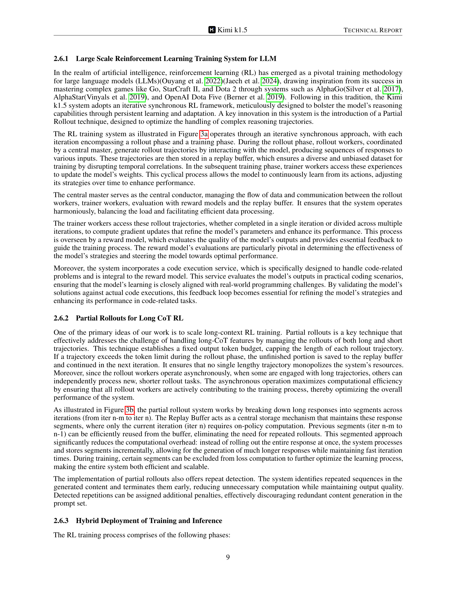

 


 2501.12599 
 Kimi Team et el. 
 
 🤗 2025-01-23 
 



↗ arXiv


↗ Hugging Face


↗ Papers with Code


### TL;DR



기존의 거대 언어 모델(LLM) 학습 방식은 데이터 크기에 제한이 있어 지속적인 성능 향상에 어려움이 있었습니다. 본 논문에서는 **강화 학습(RL)**을 이용하여 이러한 한계를 극복하고 LLM의 학습 데이터를 확장하는 새로운 방법을 제시합니다.  이는 **LLM이 보상을 통해 탐색하는 능력을 학습**시킴으로써 가능해집니다.

본 논문에서 제시하는 Kimi K1.5 모델은 **장문의 맥락 정보를 활용하여 추론 과정을 확장**하고, **정책 최적화 알고리즘을 개선**하여 **단순하고 효과적인 RL 프레임워크**를 구축했습니다.  또한, **텍스트와 이미지 데이터를 모두 활용**하는 멀티모달 학습 방식을 통해 다양한 벤치마크에서 최첨단 성능을 달성하였으며, **장문 추론 기법을 활용하여 단문 추론 모델의 성능을 향상**시키는 방법도 제시했습니다. 이는 기존 단문 추론 모델들에 비해 괄목할 만한 성능 향상을 가져왔습니다.



#### Key Takeaways


 강화학습 기반의 거대 언어모델 확장을 통한 성능 향상 



 장문 추론 과정을 활용한 단문 추론 성능 개선 



 다양한 모달리티(텍스트, 이미지) 데이터 통합을 통한 멀티모달 성능 향상 


#### Why does it matter?
본 논문은 **강화 학습을 사용하여 거대 언어 모델을 확장하는 새로운 방법**을 제시하여, 기존의 데이터 크기 제한을 뛰어넘는 인공지능 발전에 중요한 의미를 가집니다. **장문의 추론 과정을 활용하여 단문 추론 모델의 성능을 향상시키는 기술**과 **다양한 모달리티(텍스트, 이미지) 데이터를 효과적으로 활용하는 방법**을 제시함으로써, 향후 연구에 새로운 방향을 제시하고, 관련 분야 연구자들에게 큰 영향을 미칠 것으로 예상됩니다.

------
#### Visual Insights

> 🔼 그림 1은 Kimi K1.5 모델의 장기적 사고 연쇄(long-CoT) 결과를 보여줍니다.  다양한 벤치마크(AIME 2024, MATH 500, Codeforces, LiveCodeBench, MathVista, MMMU)에서 Kimi K1.5 모델의 성능을 OpenAI의 01 및 01-mini 모델과 비교하여 보여줍니다. 각 벤치마크에 대한 Kimi K1.5 모델의 성능 점수와 OpenAI 모델과의 성능 차이를 시각적으로 나타내어, Kimi K1.5 모델의 우수성을 강조합니다.  특히 수학, 코딩, 시각적 추론 등 다양한 모달리티에서 최첨단 성능을 달성했음을 보여줍니다.
> 

> 
read the caption

> Figure 1: Kimi k1.5 long-CoT results.
> 

### In-depth insights

#### RL Scaling with LLMs
본 논문은 **LLM(대규모 언어 모델)을 활용한 강화 학습(RL)의 확장성**에 대한 심층적인 논의를 제시합니다. 기존의 다음 토큰 예측 방식의 LLM 사전 학습은 계산 능력 확장에 효과적이지만, 사용 가능한 훈련 데이터의 양에 제한을 받습니다. 반면, RL은 보상을 통한 탐색 학습을 통해 LLM의 훈련 데이터 확장을 가능하게 하여 인공지능 발전에 새로운 가능성을 제시합니다.  하지만 기존 연구에서는 경쟁력 있는 결과를 도출하지 못했습니다. 본 연구는 RL 기반의 최신 다중 모달 LLM인 Kimi K1.5의 훈련 과정을 자세히 분석하여, **장문 컨텍스트 확장, 개선된 정책 최적화, 단순하고 효과적인 RL 프레임워크 구축** 등의 주요 요소들을 제시합니다. 특히, 장문 컨텍스트는 RL과 LLM의 확장성에 있어 핵심적인 요소이며, Kimi K1.5는 이를 통해 다양한 벤치마크에서 최첨단 성능을 달성합니다.  **단순성을 강조**하는 Kimi K1.5의 접근 방식은 Monte Carlo 트리 탐색, 가치 함수, 프로세스 보상 모델과 같은 복잡한 기술에 의존하지 않고도 효과적인 RL 프레임워크를 구축할 수 있음을 보여줍니다.  결론적으로, 본 연구는 LLM을 활용한 RL 확장에 대한 새로운 관점을 제시하며, 향후 연구 방향을 제시하는 중요한 의미를 지닙니다.

#### Long-Context RL
본 논문에서 제시된 "Long-Context RL"은 **긴 문맥(long context)**을 사용하는 강화 학습(RL) 방법론으로, 기존 RL의 한계를 극복하고 **LLM의 능력을 향상**시키기 위한 핵심 전략입니다. 기존의 짧은 문맥만 고려하는 RL과 달리,  **128k 토큰의 긴 문맥 창**을 사용하여 모델의 추론 능력을 획기적으로 향상시켰습니다.  **부분적 전개(partial rollout)** 기법을 통해 훈련 효율성을 높였고, **향상된 정책 최적화**를 통해 더욱 안정적이고 효과적인 학습을 가능하게 합니다.  이러한 접근법은  Monte Carlo tree search나 value function, process reward model과 같은 복잡한 기술 없이도 **뛰어난 성능**을 달성하며, 다양한 벤치마크에서 최첨단 성능을 보여줍니다.  **단순하면서도 효과적인 RL 프레임워크**를 제시함으로써, LLM의 지속적인 발전을 위한 새로운 가능성을 열었다는 점이 중요한 의의입니다.  결론적으로, Long-Context RL은 **LLM 기반 RL의 확장성과 효율성을 높인 혁신적인 방법론**이며, 향후 AI 발전에 크게 기여할 것으로 기대됩니다.

#### Policy Optimization
본 논문에서 정책 최적화는 강화 학습(RL) 기반의 대규모 언어 모델(LLM) 훈련에서 핵심적인 역할을 합니다. **장기적인 사고 과정(Long-CoT)**을 사용하여 LLM이 복잡한 추론 문제를 해결할 수 있도록 하는 데 초점을 맞추고 있습니다.  **온라인 미러 강하(Online Mirror Descent)** 알고리즘의 변형을 사용하여 정책을 최적화하는데, 이는 **상대 엔트로피 규제**를 통해 안정성을 확보하고 오프 폴리시 데이터를 활용하여 훈련 효율성을 높입니다.  **샘플링 전략**과 **길이 패널티** 또한 최적화 과정에서 중요한 요소이며, 모델의 과도한 추론(overthinking)을 방지하고 샘플 효율성을 개선하는 데 기여합니다.  **간결한 프레임워크**를 통해 복잡한 기법 없이도 효과적인 RL 학습 프레임워크를 구축하여 경쟁력 있는 결과를 도출하는 데 성공하였습니다.  결과적으로, 제시된 정책 최적화 기법은 **다양한 벤치마크에서 최첨단 성능**을 달성하는 데 기여했습니다.

#### Long2Short Methods
본 논문에서 제시된 Long2Short 방법론은 **장문의 Chain-of-Thought (CoT)**를 활용하여 **단문 CoT 모델의 성능을 향상**시키는 데 초점을 맞춥니다.  이는 장문 CoT 모델이 우수한 추론 능력을 보이지만, 처리 속도와 토큰 소모량 측면에서 비효율적이라는 점을 고려한 것입니다.  **모델 병합, 최단 거절 샘플링, DPO (Direct Preference Optimization), Long2Short RL** 등 다양한 기법들을 통해 장문 CoT 모델의 지식을 단문 모델로 효과적으로 전이하는 방법을 제시합니다. 특히 **Long2Short RL**은 단문 모델의 토큰 효율성을 크게 향상시키는 데 효과적이며, 기존 방법들보다 우수한 성능을 보입니다. 이는 **계산 비용 절감**과 **실시간 응답 속도 향상**에 중요한 의미를 지닙니다.  **다양한 방법론들의 비교 분석**을 통해 어떤 기법이 특정 상황에 더 적합한지에 대한 통찰력을 제공하며, **모델의 토큰 효율성을 극대화**하는 전략을 제시하는 것이 핵심입니다.

#### Future of RL scaling
강화학습(RL)의 확장성에 대한 미래는 **대규모 언어 모델(LLM)과의 통합**을 통해 새로운 가능성을 제시합니다.  본 논문에서 제시된 Kimi K1.5 모델은 RL과 LLM을 결합하여 기존의 한계를 뛰어넘는 성과를 보여줍니다.  **긴 문맥 처리 능력 향상**은 RL 에이전트가 더욱 복잡한 문제를 해결할 수 있게 하며, **정책 최적화의 개선**은 학습 효율을 높입니다. 다만,  **보상 설계의 어려움**과 **계산 비용의 증가**는 여전히 과제로 남아있습니다.  미래 연구는 **더욱 효율적인 RL 알고리즘 개발**과 **다양한 모달리티 데이터 활용**을 통해 이러한 문제들을 해결하는 데 집중해야 할 것입니다. 또한, **인간 수준의 추론 능력**을 가진 RL 에이전트를 개발하기 위한 연구도 중요한 방향입니다.  결론적으로, LLM과의 통합을 통해 강화학습의 확장성은 더욱 발전할 것이며, **AI의 발전에 크게 기여**할 것으로 예상됩니다.

### More visual insights

More on figures

> 🔼 그림 2는 Kimi K1.5 모델의 짧은 사고 과정(short-CoT) 결과를 보여줍니다. 다양한 벤치마크(AIME 2024, MATH-500, LiveCodeBench v4, MathVista, MMMU, MMLU, IF-Eval, CLUEWSC, C-Eval)에서 Kimi K1.5 모델의 성능을 OpenAI의 GPT-4, Claude 3.5, Sonnet과 같은 다른 최첨단 모델들과 비교하여 보여줍니다.  각 벤치마크는 서로 다른 유형의 추론 능력을 평가하며, 그림은 Kimi K1.5 모델이 다양한 과제에서 경쟁력 있는 성능을 보임을 시각적으로 보여줍니다.
> 

> 
read the caption

> Figure 2: Kimi k1.5 short-CoT results.
> 

> 🔼 이 그림은 Kimi k1.5 모델의 강화 학습 시스템에 대한 개요를 보여줍니다.  주요 구성 요소는 롤아웃 작업자, 트레이너 작업자, 보상 모델, 리플레이 버퍼, 그리고 마스터로 구성됩니다. 롤아웃 작업자는 모델과 상호 작용하여 여러 입력에 대한 응답 시퀀스를 생성하고, 이 시퀀스는 리플레이 버퍼에 저장됩니다. 트레이너 작업자는 이 경험을 사용하여 모델의 가중치를 업데이트합니다. 보상 모델은 모델 출력의 품질을 평가하고 학습 과정을 안내하는 데 필수적인 피드백을 제공합니다. 마스터는 시스템이 조화롭게 작동하고 데이터 처리가 효율적으로 이루어지도록 전체 프로세스를 관리합니다.  코드 관련 문제를 처리하도록 특별히 설계된 코드 실행 서비스도 통합되어 있습니다. 이 그림은 전체 시스템 아키텍처와 데이터 흐름을 시각적으로 설명합니다.
> 

> 
read the caption

> (a) System overview
> 

> 🔼 그림 (b)는 Kimi K1.5 모델의 강화 학습 훈련 시스템에서 부분적 전개(Partial Rollout)의 작동 방식을 보여줍니다. 긴 맥락의 응답을 여러 반복에 걸쳐 세그먼트로 분할하여 처리하고 저장하는 방식입니다. 이를 통해 긴 응답을 한 번에 생성하는 대신, 시스템은 세그먼트를 순차적으로 생성하고 저장하며, 계산 비용을 절감하고 훈련 효율을 높입니다. 부분 전개는 기존 세그먼트를 재사용하고 불필요한 계산을 방지하여 효율성을 극대화하는 동시에 긴 응답 생성을 가능하게 합니다. 또한 반복되는 시퀀스를 조기에 감지하여 계산을 중지하고 중복 내용 생성을 방지하며 출력물 품질을 유지합니다.
> 

> 
read the caption

> (b) Partial Rollout
> 

### Full paper



