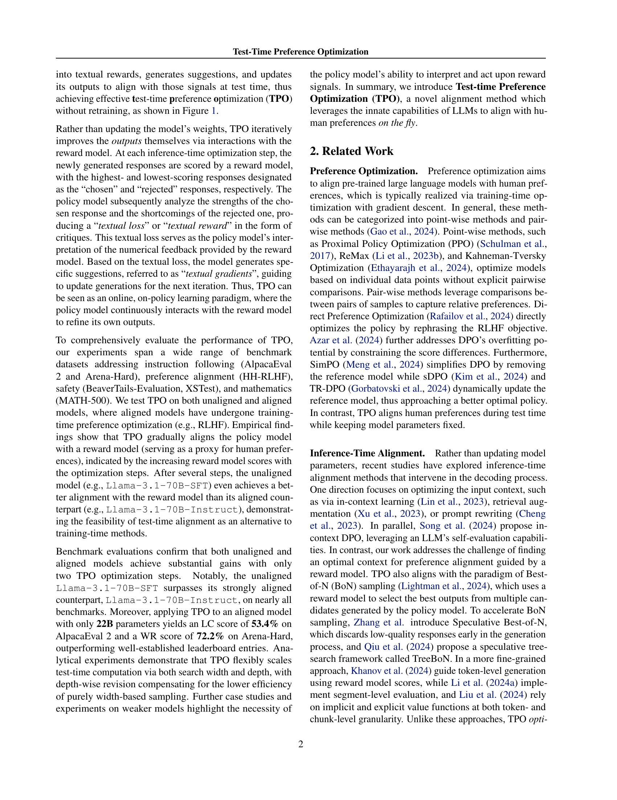

 


 2501.12895 
 Yafu Li et el. 
 
 🤗 2025-01-23 
 



↗ arXiv


↗ Hugging Face


↗ Papers with Code


### TL;DR



대규모 언어 모델(LLM)은 뛰어난 성능을 보이지만, **사용자 선호도에 빠르게 적응하는 데 어려움**이 있습니다. 기존의 방법들은 모델을 재훈련해야 하기 때문에 시간과 비용이 많이 소요됩니다. 이러한 문제를 해결하기 위해 본 논문에서는 **테스트 시간 선호도 최적화(TPO)**라는 새로운 프레임워크를 제안합니다.

TPO는 모델 매개변수를 변경하지 않고 **반복적인 텍스트 기반 피드백**을 통해 모델의 출력을 사용자 선호도에 맞춰 조정합니다. 실험 결과, TPO는 다양한 벤치마크에서 기존 방법보다 우수한 성능을 보였으며, 특히 **소규모 모델에서도 효과적**임을 확인했습니다. TPO는 실시간으로 모델을 조정해야 하는 애플리케이션에 적용 가능하며, 적응형 AI 시스템 개발에 큰 영향을 미칠 것으로 기대됩니다.



#### Key Takeaways


 테스트 시간에 모델 매개변수를 업데이트하지 않고도 사용자 선호도에 맞춰 모델 출력을 효율적으로 조정하는 TPO 프레임워크를 제시했습니다. 



 TPO는 기존의 재훈련 기반 방법보다 훨씬 효율적이며, 다양한 벤치마크에서 우수한 성능을 보였습니다. 



 TPO는 모델의 고유한 텍스트 해석 및 처리 능력을 활용하여, 수치적 보상 신호를 텍스트 기반 피드백으로 변환하여 모델의 적응력을 향상시켰습니다. 


#### Why does it matter?
본 논문은 **테스트 시간 선호도 최적화(TPO)**라는 새로운 방법을 제시하여 **사전 훈련된 언어 모델의 성능을 저하시키지 않고도 실시간으로 사용자 선호도에 맞춰 모델을 조정**할 수 있음을 보여줍니다. 이는 기존의 재훈련 기반 방법의 한계를 극복하고, 모델의 적응력과 효율성을 크게 향상시킬 수 있는 혁신적인 접근 방식입니다.  연구 결과는 다양한 벤치마크에서 TPO의 효과를 입증하며, 향후 **실시간 모델 조정 및 적응형 AI 시스템 개발**에 중요한 영향을 미칠 것으로 예상됩니다.

------
#### Visual Insights

> 🔼 본 그림은 학습 시간 선호도 최적화(RLHF 및 DPO)와 테스트 시간 선호도 최적화(TPO)를 비교하여 보여줍니다. RLHF 및 DPO는 모델 매개변수를 업데이트하여 인간의 선호도에 맞추는 반면, TPO는 모델 매개변수를 고정한 상태에서 테스트 시간 동안 인간의 선호도에 맞춰 모델을 조정합니다. 즉, TPO는 사전 훈련된 모델을 재훈련하지 않고도 실시간으로 인간의 선호도에 맞춰 결과를 조정할 수 있는 방법을 제시합니다.
> 

> 
read the caption

> Figure 1:  Training-time preference optimization (e.g., RLHF and DPO) compared with test-time preference optimization (TPO), where the model aligns with human preferences during test-time with the model parameters fixed.
> 


| Model | AlpacaEval 2 LC(%) | AlpacaEval 2 WR(%) | Arena-Hard | HH-RLHF | BeaverTails | XSTest | MATH-500 |
|---|---|---|---|---|---|---|---| 
| Llama-3.1-70B-DPO | 32.3 | 23.1 | 50.4 | -2.8 | -6.7 | 89.8 | 63.4 |
| Llama-3.1-70B-Instruct | 36.9 | 34.9 | 59.0 | -0.5 | -6.4 | 88.7 | 66.4 |
| Llama-3.1-70B-SFT | 27.8 | 16.8 | 44.1 | -4.1 | -7.2 | 87.8 | 61.8 |
| w/ TPO (D2-N5) † | 33.2 | 39.5 | 70.5 | 0.1 | -4.1 | 89.8 | 70.0 |
| w/ TPO (D2-N5) ⋆ | 33.0 | 40.5 | 69.7 | -0.6 | -4.8 | 90.4 | 71.2 |
| w/ TPO (D5-N20) ⋆ | 37.8 | 55.7 | 77.5 | 0.4 | -4.1 | 89.6 | 71.8 |

> 🔼 표 1은 TPO를 적용한 정렬되지 않은 모델(Llama-3.1-70B-SFT)의 벤치마크 성능을 학습 시간 기준 정렬된 기준 모델(Llama-3.1-70B-DPO 및 Llama-3.1-70B-Instruct)과 비교하여 보여줍니다.  가장 높은 성능과 두 번째로 높은 성능은 굵은 밑줄로 표시되어 있습니다. 기본적으로 반복 횟수 D는 2로, 샘플 수 N은 5로 설정됩니다. TPO의 잠재력을 보여주기 위해 반복 횟수를 5로, 샘플 수를 20으로 늘린 초고성능 설정 결과도 제시합니다.  별표(⋆)는 보상 모델 FsfairX-LLaMA3-RM-v0.1을 사용하여 TPO로 최적화된 모델을 나타내고, †는 Llama-3.1-Tulu-3-8B-RM을 나타냅니다.
> 

> 
read the caption

> Table 1: Benchmark performance of the unaligned model (Llama-3.1-70B-SFT) with TPO, compared against training-time aligned baselines (Llama-3.1-70B-DPO and Llama-3.1-70B-Instruct). The bold and underlined numbers indicate the best and second-best performances, respectively. By default, the maximum number of iterations D𝐷Ditalic_D is set to 2, and the number of samples N𝑁Nitalic_N is set to 5. To showcase the potential of TPO, we present an ultra setting, in which the number of iterations is increased to 5 and the number of samples to 20. ⋆⋆\star⋆ denotes the models optimized with TPO using the reward model FsfairX-LLaMA3-RM-v0.1, while ††\dagger† denotes Llama-3.1-Tulu-3-8B-RM.
> 

### In-depth insights

#### Test-Time Alignment
본 논문에서 제시된 'Test-Time Alignment' 개념은 **추론 단계에서 모델의 출력을 인간의 선호도에 맞추는 방법**을 의미합니다. 기존의 사전 학습된 모델을 재훈련하지 않고, 추론 시점에 모델의 파라미터를 수정하지 않으면서 모델 출력을 사용자 선호도에 맞게 조정하는 기술입니다.  이는 기존의 재훈련 기반 방법의 한계를 극복하고, **실시간으로 변화하는 사용자 선호도에 빠르게 적응**할 수 있도록 합니다.  **텍스트 기반 피드백**을 활용하여 반복적인 최적화 과정을 거치는 것이 핵심이며,  단순한 수치적 보상 신호가 아닌, **텍스트 형태의 비판적 평가를 통해 모델의 출력을 점진적으로 개선**하는 방식입니다.  이러한 접근 방식은 모델이 텍스트 해석 및 응답 능력을 활용함으로써, 보다 **해석 가능하고 효율적인 최적화**를 가능하게 합니다.  하지만, **모델의 본래 성능과 해석 능력에 대한 의존도가 높다**는 점과, **계산 비용**에 대한 고려가 필요하다는 점이  'Test-Time Alignment'의 중요한 고려사항입니다.  **실제 적용에 있어서는 모델의 성능 및 계산 자원의 제약 조건**을 고려하여 적절한 균형을 맞추는 것이 중요합니다.

#### Iterative TPO
반복적 TPO에 대한 심층적인 고찰은 **반복적인 개선**을 통한 정확도 향상과 **실시간 조정**의 가능성에 초점을 맞춰야 합니다.  단순히 반복 횟수 증가만으로 성능 향상을 기대하는 것이 아니라, 각 반복 단계에서의 **피드백 메커니즘** 개선이 중요합니다.  이는 단순히 수치적 보상 신호가 아닌, **텍스트 기반의 질적 피드백**을 어떻게 효과적으로 활용할 수 있는지에 대한 연구가 필요하다는 것을 시사합니다.  더 나아가, **다양한 모델 및 데이터셋**에 대한 적용성을 검증하고,  **계산 비용** 측면에서의 효율성을 분석하는 것이 중요합니다.  **일반화 성능**을 높이기 위한 추가적인 연구가 필요하며,  특히 **실제 환경 적용**을 위한 현실적인 제약 조건들을 고려해야 합니다.  마지막으로,  **윤리적 문제** 또한 중요한 고려 사항입니다.  예측 불가능한 결과를 야기할 수 있는 가능성을 최소화하고,  **인간의 개입**을 통해 안전성을 확보하는 방안을 모색해야 합니다.  이 모든 요소들을 종합적으로 고려하여 반복적 TPO의 효용성과 한계를 명확하게 규명해야 합니다.

#### TPO Benchmarks
본 논문에서 TPO 벤치마크는 제시된 Test-Time Preference Optimization (TPO) 기법의 성능을 다양한 측면에서 평가하기 위한 핵심 요소입니다.  **다양한 벤치마크 데이터셋을 활용하여 TPO의 효과를 검증하는 것이 중요한데,** 이는 TPO가 실제 응용 환경에서 얼마나 잘 동작하는지 보여주는 지표가 되기 때문입니다.  **다양한 모델 (unaligned, aligned)에 대한 TPO 성능 비교는 TPO의 일반성 및 적용 가능성을 시사합니다.**  TPO가 사전 학습된 모델의 성능을 향상시키는 정도와, 이미 성능이 좋은 모델에 적용했을 때의 추가적인 향상 여부를 비교 분석하는 것이 중요한 연구 방향입니다.  **특히, 기존의 training-time optimization 기법과의 비교는 TPO의 효율성 및 실용성을 판단하는 데 중요한 근거가 됩니다.**  벤치마크 결과는 TPO의 강점과 한계를 명확하게 보여주고, 향후 연구 방향을 제시하는 데 중요한 역할을 합니다. 따라서, **TPO 벤치마크의 설계 및 결과 해석은 TPO의 실제 가치를 평가하는 데 있어 매우 중요한 부분**이며, 신중하고 면밀한 검토가 필요합니다.

#### TPO Efficiency
TPO의 효율성에 대한 심층적인 고찰은 **계산 비용 감소**와 **추론 시간 단축**이라는 두 가지 핵심 측면을 중심으로 이루어져야 합니다. 기존의 사전 학습된 모델의 파라미터를 업데이트하는 대신 TPO는 **추론 시점에서 모델의 출력을 미세 조정**함으로써 훨씬 적은 계산 비용으로 유사한 성능을 달성할 수 있습니다.  이는 특히 대규모 언어 모델과 같이 계산적으로 비용이 많이 드는 모델에 적용될 때 큰 장점으로 작용합니다.  **추론 시간의 단축** 또한 TPO의 핵심적인 이점입니다. TPO는 반복적인 텍스트 피드백을 통해 실시간으로 모델을 조정하므로, 기존의 재훈련 방식에 비해 훨씬 빠르게 사용자의 선호도에 맞춰 모델을 조정할 수 있습니다. 하지만, TPO의 효율성은 **반복 횟수(iteration)** 와 **샘플 수(sample)**에 영향을 받습니다. **반복 횟수**가 증가할수록 정확도는 향상되지만, 계산 비용도 증가합니다. 따라서, 최적의 효율성을 위해서는 **반복 횟수와 샘플 수의 균형**을 맞추는 것이 중요합니다.  TPO의 효율성 향상을 위한 추가적인 연구는 다양한 모델 크기와 데이터셋에 대한 실험을 통해 **일반화 성능**을 평가하고, 계산 복잡도를 더욱 줄이는 알고리즘을 개발하는 데 초점을 맞춰야 합니다.

#### Future of TPO
TPO(Test-Time Preference Optimization)의 미래는 **LLM의 고유한 능력을 활용하여 실시간으로 사용자 선호도에 맞추는 방향**으로 나아갈 것입니다.  향후 연구는 **더욱 정교한 보상 모델과의 상호작용을 통해 TPO의 효율성과 정확성을 개선**하는 데 집중될 것입니다.  **텍스트 기반 피드백의 해석 및 활용 능력을 향상**시키는 것은 중요한 과제이며, 이를 위해 LLM의 자연어 이해 및 추론 능력을 더욱 발전시켜야 합니다.  또한, **다양한 유형의 모델과 데이터셋에 대한 TPO의 확장성을 높이는 연구**가 필요하며, 특히 소규모 모델이나 특정 도메인에 특화된 모델에 대한 적용 가능성을 검토해야 합니다.  **계산 비용을 최소화하면서 성능을 극대화**하는 방향으로 TPO 알고리즘의 효율성을 높이는 것도 중요한 연구 분야가 될 것입니다.  궁극적으로는, TPO가 **LLM의 안전성과 유용성을 향상시키는 핵심 기술**로 자리매김하여, 인간 중심적인 AI 시스템 구축에 기여할 것으로 예상됩니다.

### More visual insights

More on figures

> 🔼 그림 2는 본 논문에서 제안하는 Test-time Preference Optimization (TPO)의 프레임워크를 AlpacaEval 2의 실제 예시를 통해 보여줍니다. 왼쪽에는 모델이 응답을 생성하고 보상 모델을 사용하여 점수를 매기는 과정이, 가운데에는 선택된 응답(v3)과 기각된 응답(v1)에 대한 보상 모델의 피드백을 모델이 해석하는 과정이, 오른쪽에는 모델이 비판을 제시하고 개선 제안을 생성하여 다음 반복을 위한 새로운 응답을 생성하는 과정이 각각 나타나 있습니다. 기존의 기울기 기반 방법과 유사하게 TPO는 텍스트 형태의 손실 계산, 기울기 계산 및 변수 최적화를 수행하여 보상 모델의 수치적 피드백에 따라 모델 출력을 조정합니다.
> 

> 
read the caption

> Figure 2: Framework of test-time preference optimization (TPO), shown here on a real example from AlpacaEval 2. Concretely, the model samples responses and scores them with a reward model (Left), interprets reward model feedback of chosen response v3subscript𝑣3v_{3}italic_v start_POSTSUBSCRIPT 3 end_POSTSUBSCRIPT and rejected response v1subscript𝑣1v_{1}italic_v start_POSTSUBSCRIPT 1 end_POSTSUBSCRIPT (Middle), and provides critiques, generates improvement suggestions (Right), and then updates new responses for the next iteration. In analogy to traditional gradient-based methods, TPO performs gradient descent (loss calculation, gradient computation and variable optimization) in textual form to tailor model outputs based on numerical feedback from the reward model.
> 

> 🔼 그림 3은 정렬되지 않은 SFT 모델과 정렬된 Instruct 모델에 대한 테스트 시간 훈련 곡선을 보여줍니다. 색상이 있는 선은 TPO 반복 횟수(즉, 훈련 단계)에 따른 테스트 시간 훈련 성능(보상 모델 점수)을 나타내고, 점선은 테스트 시간 훈련 없이 모델의 점수를 나타냅니다. 이 그래프는 TPO가 훈련되지 않은 모델과 훈련된 모델 모두에서 보상 모델 점수를 향상시키는 데 효과적임을 보여줍니다. 특히, 몇 번의 TPO 단계만 거쳐도 초기에는 정렬되지 않은 모델이 정렬된 모델보다 더 나은 성능을 보입니다.
> 

> 
read the caption

> Figure 3: Test-time training curve for the (unaligned) SFT model and (aligned) instruct models. The colored lines represent the test-time training performance (reward model score) w.r.t. training steps (i.e., number of TPO iterations), while the dashed horizontal lines indicate scores for models without test-time training.
> 

> 🔼 그림 4는 TPO 적용 여부에 따른 모델의 추론 안정성을 보여줍니다. TPO를 적용한 모델은 TPO를 적용하지 않은 모델에 비해 추론 결과의 표준 편차가 더 낮아, 추론 안정성이 향상되었음을 보여줍니다. 이는 TPO가 모델의 출력 분포를 인간의 선호도에 더 잘 맞추도록 재분배하여, 더 높은 품질의 응답을 생성하고 예측할 수 없는 결과물을 줄이기 때문입니다. 특히, TPO를 적용한 정렬되지 않은 모델은 정렬된 모델보다 더 나은 안정성을 보여줍니다.
> 

> 
read the caption

> Figure 4: Inference stability of models with and without TPO.
> 

> 🔼 본 그림은 HH-RLHF 데이터셋에서 다양한 샘플링 너비(즉, 각 반복에서 샘플링된 응답 수)를 사용하여 평가된 테스트 시간 훈련 곡선을 보여줍니다.  샘플링 너비가 증가함에 따라 보상 모델 점수가 향상되는 것을 보여주는 그래프가 여러 개 표시됩니다. 이는 테스트 시간에 선호도 정렬이 향상되는 것을 보여주는 시각적 증거입니다. 각 곡선은 다른 샘플링 너비를 나타내며, 샘플링 너비가 증가함에 따라 보상 모델 점수가 향상되는 것을 알 수 있습니다.  이 그림은 TPO 알고리즘의 효율성과 확장성을 보여주는 데 중요한 역할을 합니다.
> 

> 
read the caption

> Figure 5: Test-time training curves on the HH-RLHF dataset, evaluated under varying sampling widths (i.e., the number of responses sampled per iteration).
> 

> 🔼 그림 6은 TPO와 베스트 오브 N (BoN) 샘플링의 성능을 비교한 결과를 보여줍니다.  TPO는 테스트 시간 최적화 방법으로, 모델 매개변수를 수정하지 않고 추론 단계에서 모델 출력을 인간의 선호도에 맞춰 조정하는 기법입니다. 반면 BoN 샘플링은 여러 후보 응답을 생성하고, 보상 모델(reward model)을 사용하여 가장 좋은 응답을 선택하는 기법입니다. 이 그림에서는 AlpacaEval 2, Arena-Hard, HH-RLHF 세 가지 벤치마크 데이터셋에서 TPO와 BoN의 승률을 비교하여 TPO의 우수성을 보여줍니다. 특히 TPO는 BoN보다 적은 샘플 수로도 더 높은 승률을 달성하여 효율성을 강조합니다.  세로축은 GPT-4가 평가한 승률을 나타내고, 가로축은 벤치마크 데이터셋을 나타냅니다.
> 

> 
read the caption

> Figure 6: Win-rates of TPO against Best-of-N sampling (BoN).
> 

> 🔼 그림 7은 논문에서 제시된 HH-RLHF 데이터셋을 기반으로 Llama-3.1-8B-Instruct 모델에 대한 테스트 시간 훈련 곡선을 보여줍니다.  테스트 시간 훈련 과정에서 모델의 성능 향상을 보여주는 곡선을 통해 TPO(Test-time Preference Optimization)의 효과를 시각적으로 확인할 수 있습니다.  빨간색 선은 Llama-3.1-8B-Instruct 모델의 성능 변화를 나타냅니다.  이 그래프는 TPO를 적용했을 때 모델의 성능 변화를 보여주는 여러 그래프 중 하나이며, 모델이 테스트 시간에 선호도에 맞춰 얼마나 잘 조정되는지를 보여줍니다.
> 

> 
read the caption

> Figure 7: Test-time training curve of Llama-3.1-8B-Instruct (red line) on the HH-RLHF dataset.
> 

> 🔼 그림 8은 Llama-3.1-70B-SFT 모델에 대한 테스트 시간 훈련 곡선을 보여줍니다. 이 곡선은 다양한 벤치마크 데이터셋(AlpacaEval 2, Arena-Hard, HH-RLHF, BeaverTails, XSTest, MATH-500)에 걸쳐 TPO 반복 횟수에 따른 보상 모델 점수의 변화를 나타냅니다.  각 데이터셋에 대해, TPO를 적용하지 않은 경우의 기준 점수(점선)와 비교하여, TPO 반복 횟수가 증가함에 따라 보상 모델 점수가 어떻게 변화하는지 확인할 수 있습니다. 이를 통해 TPO가 모델의 성능을 점진적으로 향상시키는 것을 확인할 수 있습니다.
> 

> 
read the caption

> Figure 8: Test-time training curves of the Llama-3.1-70B-SFT using FsfairX-LLaMA3-RM-v0.1.
> 

More on tables


| Model | AlpacaEval 2 LC(%) | AlpacaEval 2 WR(%) | Arena-Hard | HH-RLHF | BeaverTails | XSTest | MATH-500 |
|---|---|---|---|---|---|---|---| 
| Llama-3.1-70B-Instruct | 36.9 | 34.9 | 59.0 | -0.5 | -6.4 | 88.7 | 66.4 |
| w/ TPO (D2-N5) | 39.1 | 48.5 | 69.5 | 1.3 | -3.6 | 89.6 | 71.6 |
| Mistral-Small-Instruct-2409 | 45.7 | 38.5 | 53.8 | -0.4 | -5.2 | 87.1 | 57.6 |
| w/ TPO (D2-N5) | 53.4 | 60.5 | 72.2 | 1.1 | -3.4 | 90.7 | 62.2 |
> 🔼 표 2는 TPO를 사용하여 미세 조정된 Llama-3.1-70B-Instruct 및 Mistral-Small-Instruct-2409 모델의 벤치마크 성능을 보여줍니다. 가장 높은 성능을 달성한 결과는 굵은 숫자로 표시됩니다. TPO 반복 횟수(D)는 2로, 샘플 수(N)는 5로 설정되었습니다. TPO에 사용된 보상 모델은 FsfairX-LLaMA3-RM-v0.1입니다.
> 

> 
read the caption

> Table 2: Benchmark performance of the aligned models (Llama-3.1-70B-Instruct and Mistral-Small-Instruct-2409) with TPO. The bold numbers indicate the best performance. The maximum number of iterations D𝐷Ditalic_D is set to 2, and the number of samples N𝑁Nitalic_N is set to 5. The reward model used for TPO is FsfairX-LLaMA3-RM-v0.1.
> 


| AlpacaEval 2 | Arena-Hard | HH-RLHF | BeaverTails | XSTest | MATH-500 |
|---|---|---|---|---|---| 
| 805 | 500 | 500 | 700 | 450 | 500 |
> 🔼 본 논문의 표 3은 다양한 기준 데이터셋의 통계적 정보를 요약하여 보여줍니다.  데이터셋 이름과 각 데이터셋에 포함된 데이터 수를 보여주어, 이후 실험에서 사용된 데이터의 규모와 분포에 대한 이해를 돕습니다.  AlpacaEval 2, Arena-Hard, HH-RLHF, BeaverTails, XSTest, MATH-500 데이터셋에 대한 정보가 포함되어 있으며, 각 데이터셋의 크기를 수치적으로 제시하여 후속 연구 분석에 필요한 정보를 제공합니다.
> 

> 
read the caption

> Table 3: Data statistics of benchmark datasets.
> 

### Full paper



