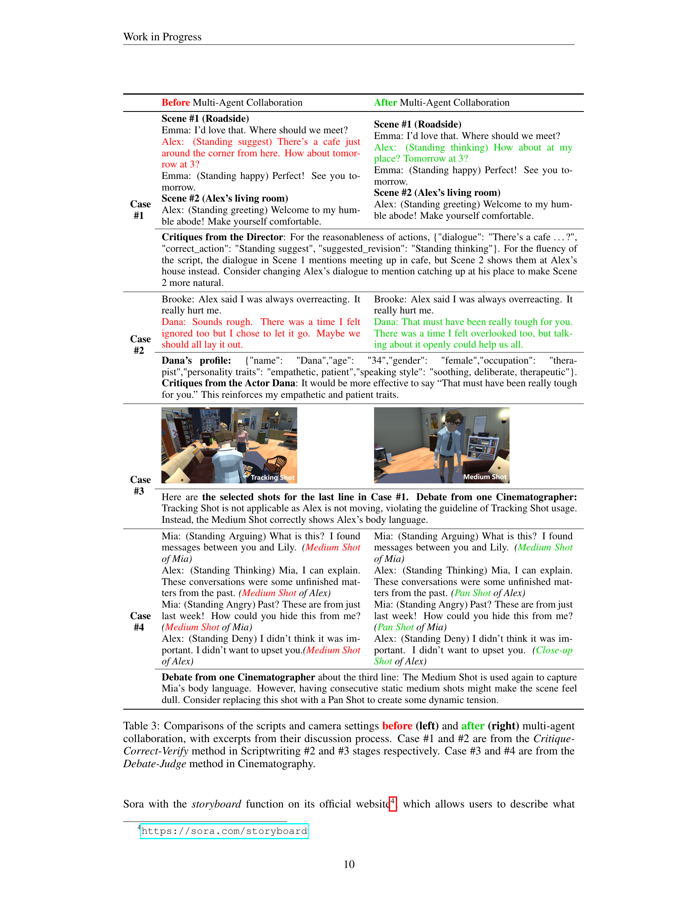

 


 2501.12909 
 Zhenran Xu et el. 
 
 🤗 2025-01-23 
 



↗ arXiv


↗ Hugging Face


↗ Papers with Code


### TL;DR



현대 영화 제작은 복잡하고 시간이 많이 소요되는 과정입니다.  이를 자동화하려는 시도는 있었지만, **언어 및 시각적 요소를 모두 포함하는 종합적인 접근 방식**이 부족했습니다. 기존의 자동화 시스템은 스크립트 작성이나 촬영 과정 중 일부만 자동화하거나, 생성 결과의 질이 떨어지는 문제점을 가지고 있었습니다. 

본 논문에서는 **FILMAGENT**라는 새로운 시스템을 제시합니다.  FILMAGENT는 감독, 각본가, 배우, 촬영감독 등 다양한 역할을 담당하는 **LLM 기반 에이전트**들이 서로 협력하여 영화 제작의 전 과정을 자동화하는 시스템입니다.  **3D 가상 환경**을 사용하여 실제 영화 제작 과정과 유사한 워크플로우를 구현하고, 다양한 협업 전략을 통해 스크립트 및 촬영 결과의 질을 향상시켰습니다.  실험 결과를 통해 FILMAGENT가 기존 시스템보다 우수한 성능을 보임을 확인하였습니다.



#### Key Takeaways


 LLM 기반 다중 에이전트 프레임워크를 활용한 엔드투엔드 영화 제작 자동화 시스템 구축 



 다양한 영화 제작 단계(아이디어 기획, 시나리오 작성, 촬영)에서의 다중 에이전트 협업 전략 제시 ë° 효과 검증 



 단일 에이전트 시스템 대비 우수한 성능 ë° 3D 가상 환경의 장점을 활용한 실험 결과 제시 


#### Why does it matter?
본 논문은 **대규모 언어 모델(LLM)** 기반의 다중 에이전트 프레임워크를 사용하여 가상 3D 환경에서 엔드투엔드 영화 제작 자동화를 달성한 최초의 연구입니다. 이는 영화 제작의 효율성을 높이고, **새로운 연구 방향**을 제시하며, **LLM 기반 다중 에이전트 시스템**의 잠재력을 보여줍니다.  연구 결과는 영화 제작 자동화 분야에 중요한 영향을 미칠 뿐만 아니라, 다양한 분야에서의 **다중 에이전트 협업 시스템** 설계 및 구현에 대한 통찰력을 제공합니다.

------
#### Visual Insights

> 🔼 본 그림은 논문에서 제시하는 FilmAgent의 개념을 보여줍니다. FilmAgent는 대규모 언어 모델(LLM) 기반의 다중 에이전트 협업 프레임워크로, 아이디어 개발, 시나리오 작성, 촬영 등 영화 제작 과정 전반을 자동화합니다. 3D 가상 공간에서 각 에이전트는 감독, 각본가, 배우, 촬영감독 등 영화 제작진의 역할을 수행하며, 실제 영화 제작 과정과 유사하게 순차적으로 작업하여 최종 영화 제작을 완료합니다.
> 

> 
read the caption

> Figure 1:  We introduce FilmAgent, a multi-agent collaborative framework for end-to-end film automation powered by large language models (LLMs). A team of LLM-based agents takes on film crew roles, and simulates the human workflow in 3D virtual spaces by sequentially engaging in idea development, scriptwriting, and cinematography, finally completing the filmmaking process.
> 


| No. | Shot Type | Description | View |
|---|---|---|---|
| ① | Close-up Shot | Close-up (CU) Shot should be close to the subject, typically including the collar, encapsulating the identity. | https://arxiv.org/html/2501.12909/close.png |
| ② | Medium Shot | Medium Shot (MS) should include the posture (such as body language) and physical movement (like walking). | https://arxiv.org/html/2501.12909/mid.png |
| ③ | Long Shot | Long shot (LS) contains the human body, showing where the subject is located. | https://arxiv.org/html/2501.12909/long.png |

> 🔼 표 1은 그림 2의 위치 B를 중심으로 한 세 가지 종류의 정적 샷(클로즈업, 미디엄샷, 롱샷)의 예시를 보여줍니다. 각 샷의 설명과 시각적 예시가 함께 제공됩니다. 이 표는 3D 가상 환경에서 영화 제작을 위한 다양한 카메라 앵글 설정을 이해하는 데 도움을 줍니다.
> 

> 
read the caption

> Table 1: Examples of 3 types of static shots in Figure 2, targeted at Position B.
> 

### In-depth insights

#### Multi-Agent Filmmaking
다중 에이전트 영화 제작은 **대규모 언어 모델(LLM)** 기반의 여러 인공지능 에이전트가 각각 감독, 각본가, 촬영감독, 배우 등 영화 제작의 다양한 역할을 수행하는 새로운 접근 방식입니다. 이는 전통적인 영화 제작 과정을 모방하여 아이디어 개발, 시나리오 작성, 촬영 단계를 순차적으로 진행하며, 각 에이전트는 LLM의 지시를 받아 상호 작용하고 피드백을 주고받으면서 영화를 완성해나갑니다.  **협업 전략**으로는 상호 비평 및 수정, 토론 및 판정 알고리즘 등이 사용되어 오류를 줄이고 최종 결과물의 질을 높입니다.  이러한 시스템은 가상 3D 환경에서 구현되어,  **실제 영화 제작 환경을 시뮬레이션**하고, 효율성을 높이며, 새로운 창작 가능성을 제시합니다. **LLM의 능력**을 극대화하고, **인간의 창작 과정을 자동화**하는 다중 에이전트 접근 방식은 영화 제작의 미래에 중요한 영향을 미칠 것으로 예상됩니다.  하지만, 아직은 3D 공간 및 캐릭터, 카메라 설정 등의 제약이 있으며,  **지속적인 기술 발전과 개선**이 필요합니다.

#### LLM-based Agents
본 논문에서 제시된 LLM 기반 에이전트는 **다양한 영화 제작 역할(감독, 각본가, 배우, 촬영감독)**을 수행하는 인공지능 시스템의 핵심 구성 요소입니다. 각 에이전트는 대규모 언어 모델(LLM)을 기반으로 하여, 각자의 역할에 맞는 전문적인 지식과 의사결정 능력을 갖추고 있습니다. 이는 **인간의 영화 제작 워크플로우를 시뮬레이션**하고, **자동화된 의사결정 과정을 통해 효율성을 증대**시키는 데 중요한 역할을 합니다.  특히, 에이전트 간의 협업을 통해 발생할 수 있는 오류를 줄이고, 보다 **일관성 있고 창의적인 결과물**을 도출하는 데 기여합니다.  **상호작용 및 피드백 메커니즘**은 에이전트들이 서로 협력하고 개선점을 찾아가는 과정을 보여주는 중요한 부분이며, 이를 통해 영화 제작 과정 전반에 걸쳐 높은 수준의 자동화를 달성할 수 있습니다.  **LLM 기반 에이전트의 협업 방식**은 단순히 개별 에이전트의 기능 합산을 넘어, 시너지 효과를 창출하는 **진정한 협력 시스템**임을 강조합니다.

#### 3D Virtual Spaces
본 논문에서 제시된 3D 가상 공간은 **실제 영화 제작 환경을 사실적으로 모방**하기 위해 **세심하게 제작**되었습니다.  15개의 다양한 장소와 65개의 지정된 배우 위치, 9가지 유형의 정적 및 동적 촬영 기법을 포함하는 272개의 샷, 그리고 21가지의 배우 액션이 포함되어 있습니다. 이러한 세부적인 구성은 단순한 배경이 아닌 **영화 제작 과정에 필수적인 요소**들을 포함하여 **몰입도 높은 가상 환경**을 구축하고자 하는 의도를 보여줍니다.  **배우의 위치와 움직임, 카메라의 앵글과 움직임, 그리고 배우의 액션**까지도 고려하여, 실제 영화 촬영과 유사한 수준의 제어 및 연출이 가능하도록 설계되었습니다.  **LLM 기반 에이전트의 협업을 위한 기반**을 제공하는 동시에, 생성된 영상의 품질을 높이는 데 중요한 역할을 수행합니다.  이는 궁극적으로 LLM 기반 시스템을 이용한 **실제 영화 제작 자동화의 실현 가능성**을 높이는 데 크게 기여할 것으로 예상됩니다.

#### Collaborative Methods
본 논문에서 제시된 다양한 협업 방식들은 **대규모 언어 모델(LLM) 기반 에이전트들의 상호작용을 통해 영화 제작 과정의 효율성과 질적 향상**을 도모하는 데 초점을 맞추고 있습니다.  **비판-수정-검증(Critique-Correct-Verify)** 및 **토론-판정(Debate-Judge)** 알고리즘은 각각 각본 작성 및 촬영 단계에서 에이전트 간 협업을 원활하게 합니다. 특히, **상호 피드백과 반복적인 수정 과정**을 통해 환각 현상(hallucination)을 줄이고 보다 정교한 결과물을 산출하는 데 효과적입니다.  이러한 협업 방식은 단순히 작업 분담을 넘어, **각 에이전트의 전문성을 결합하여 시너지 효과**를 창출하며, 영화 제작의 복잡한 의사결정 과정을 효과적으로 지원합니다.  **다양한 역할을 가진 에이전트들의 상호작용은 인간 영화 제작팀의 워크플로우를 모방**, 실제 영화 제작 과정의 장점을 효과적으로 반영하고 있다는 점에서 주목할 만합니다.  **다양한 협업 전략을 통해 LLM의 한계를 극복**하고, 더욱 효과적이고 창의적인 영화 제작 환경을 구축하는 데 기여할 수 있을 것입니다.

#### Future of Filmmaking
영화 제작의 미래는 **인공지능(AI)**와 **가상현실(VR)** 기술의 발전과 밀접한 관련이 있습니다.  본 논문에서 제시된 FILMAGENT와 같은 AI 기반의 영화 제작 프레임워크는 **자동화된 스크립트 작성, 촬영, 편집** 등을 가능하게 하여, 영화 제작 과정의 효율성을 크게 향상시킬 수 있습니다. 하지만, **AI의 창의성 한계**와 **예측 불가능한 요소**는 여전히 과제로 남아 있으며, **인간 감독의 역할**은 여전히 중요합니다.  AI는 반복적인 작업을 자동화하고 제작 속도를 높이는 데 기여하지만, **감동과 메시지 전달**이라는 영화 본질적 가치를 실현하는 것은 여전히 인간의 몫입니다.  **상호작용적이고 몰입적인 VR 기술**은 관객들에게 새로운 영화 경험을 제공할 수 있지만, 기술적 제약과 콘텐츠 제작의 어려움은 해결해야 할 문제입니다.  결론적으로 영화 제작의 미래는 **AI와 VR 기술의 협력**을 통해 더욱 발전할 것이며, **기술과 예술의 조화**가 핵심이 될 것입니다.  **인간의 감성과 AI의 효율성**이 결합된 새로운 영화 제작 방식은 더욱 혁신적이고 다양한 영화 콘텐츠를 창출할 것입니다.  하지만 **윤리적 문제**와 **기술적 한계**를 고려하며, 인간 중심적인 접근 방식이 중요합니다.

### More visual insights

More on figures

> 🔼 그림 2는 Unity를 사용하여 FilmAgent에서 구축된 3D 공간(거실) 중 하나를 수직으로 본 모습입니다.  환경은 배우의 지정된 위치와 촬영을 위한 다양한 카메라 설정을 미리 구성하고 있습니다.  여기에는 여러 거리에서 정지된 샷과 캐릭터를 따라가거나 중심으로 회전하는 동적 샷이 포함됩니다. 이 공간의 전체 카메라 설정은 그림 8에 나와 있습니다.
> 

> 
read the caption

> Figure 2: A vertical view of one of the 3D spaces (the living room) in FilmAgent built with Unity. The environment is pre-configured with designated positions for actors and various camera setups for cinematography. These include static shots from multiple distances and dynamic shots that either follow or orbit around characters. Full camera setup of this space is provided in Figure 8.
> 

> 🔼 그림 3은 FilmAgent의 워크플로우를 보여줍니다. 이야기의 아이디어와 3D 가상 공간이 주어지면 감독은 캐릭터 프로필과 장면 개요를 만듭니다. 배우, 각본가, 감독은 대화와 동작에 대해 협업합니다. 촬영 감독은 각 줄에 대한 카메라 설정을 주석으로 달고, 마지막으로 3D 공간에서 영화를 촬영합니다. LLM 기반 에이전트는 다양한 영화 제작진 역할을 맡아 Critique-Correct-Verify 및 Debate-Judge 전략을 통해 협업합니다.
> 

> 
read the caption

> Figure 3:  Workflow of FilmAgent. Given a story idea and 3D virtual spaces, the director creates character profiles and a scene outline. Actors, the screenwriter, and the director then collaborate on dialogue and movements. Cinematographers annotate camera setups for each line. Finally, the film is shot within the 3D spaces. LLM-based agents take on various film crew roles, collaborating through Critique-Correct-Verify and Debate-Judge strategies.
> 

> 🔼 그림 4는 각 대사에 해당하는 동작을 주석으로 달아야 한다는 점을 보여줍니다. 즉, 시나리오 작가는 단순히 대화만 쓰는 것이 아니라, 각 대사에 맞는 배우의 동작, 즉 어떤 자세를 취해야 하는지, 어떤 동작을 해야 하는지를 구체적으로 지정해야 함을 의미합니다. 이를 통해 시각적 스토리텔링에 대한 이해를 높이고, 보다 풍부하고 몰입도 높은 영상 제작을 위한 기반을 마련합니다.
> 

> 
read the caption

> Figure 4: The responsibilities of a screenwriter extend beyond writing dialogues; they also involve annotating the corresponding action for each line.
> 

> 🔼 그림 5는 다중 에이전트 협업 이후 업데이트된 스크립트와 카메라 선택에 대한 승률, 무승부율, 패배율을 보여줍니다. 원본 버전과 비교하여 다중 에이전트 협업을 통해 스크립트와 카메라 설정이 얼마나 개선되었는지 정량적으로 나타냅니다.  세부적으로는 스크립트 작성 단계(Scriptwriting #2, Scriptwriting #3)와 촬영 단계(Cinematography)에서의 개선 효과를 보여주는 승률을 제시합니다.
> 

> 
read the caption

> Figure 5:  Compared with the original version, the win, tie, and lose rates of the updated script and camera choices after multi-agent collaboration.
> 

> 🔼 본 그림은 FilmAgent와 Sora가 생성한 '다툼과 결별 장면' 비디오를 비교한 것입니다. Sora는 다양한 장면, 스타일, 샷에 대한 뛰어난 적응력을 보여주는 반면, FilmAgent는 이야기 전개 능력을 갖춘 일관성 있고 물리 법칙을 준수하는 비디오를 생성할 수 있습니다. 즉, Sora는 다양한 시각적 표현에 유연하지만, FilmAgent는 이야기의 흐름과 물리적 현실성을 더 잘 유지합니다.
> 

> 
read the caption

> Figure 6: Comparison of videos showing “a quarrel and breakup scene” produced by FilmAgent and Sora. Sora demonstrates excellent adaptability to various scenes, styles, and shots, while FilmAgent can produce coherent, physics-compliant videos with storytelling capabilities.
> 

> 🔼 그림은 아파트 주방의 3D 렌더링을 보여줍니다. 가구와 가전제품이 배치되어 있으며, 실제 아파트 주방과 유사한 환경을 제공합니다.  이 이미지는 가상 영화 제작을 위한 FILMAGENT 프레임워크에서 사용되는 가상 3D 공간의 일부분을 보여줍니다.  다양한 가구와 장비를 통해 다양한 영화 장면을 촬영할 수 있는 다양한 환경을 제공합니다.
> 

> 
read the caption

> (a) Apartment kitchen
> 

> 🔼 해당 그림은 논문의 3.1절 환경 설정 부분에 포함된 여러 3D 가상 공간 중 하나인 아파트 거실의 모습을 보여줍니다.  아파트 거실 공간은 영화 제작을 위한 가상 세트장으로 사용되며, 배우의 위치, 카메라 위치, 촬영 각도 등이 미리 설정되어 있습니다.  다양한 가구와 소품들이 배치되어 있으며, 현실적인 아파트 거실 분위기를 재현하고 있습니다. 이 그림은 FILMAGENT 시스템이 제공하는 다양하고 현실적인 3D 환경을 보여주는 예시 중 하나입니다.
> 

> 
read the caption

> (b) Apartment living room
> 

> 🔼 그림은 논문의 3.1절 환경 설정에서 설명하는 가상 3D 영화 제작 공간 중 하나인 음료수가 있는 방(Beverage room)을 보여줍니다. 이 공간은 다양한 영화 장면을 촬영할 수 있도록 다양한 소품과 배경으로 구성되어 있습니다.  다른 그림들과 마찬가지로, 배우의 위치와 카메라 위치가 미리 설정되어 있어 영화 제작 과정의 자동화를 위한 시스템의 핵심 요소임을 보여줍니다.
> 

> 
read the caption

> (c) Beverage room
> 

> 🔼 그림 (d)는 논문에서 제시된 가상 3D 공간 중 하나인 당구장을 보여줍니다. 당구대, 의자, 테이블 등 당구장의 전형적인 가구들이 배치되어 있으며, 영화 제작을 위해 배우의 위치와 카메라 앵글을 미리 설정할 수 있도록 디자인되었습니다.  실제 영화 촬영 환경과 유사한 가상 환경을 구축하여 영화 제작 과정을 자동화하는 FILMAGENT 시스템의 구성 요소를 보여주는 예시입니다.
> 

> 
read the caption

> (d) Billiard room
> 

> 🔼 그림은 논문의 3.1절 환경 설정에서 언급된 가상 3D 공간 중 하나인 다이닝 룸(식당)의 모습을 보여줍니다.  다양한 가구와 배경으로 구성된 현실적인 식당의 모습을 보여주며, 영화 제작을 위한 가상 환경으로 사용됨을 시각적으로 보여줍니다.  실제 영화 촬영처럼 배우의 위치와 카메라 각도를 미리 설정하여 사용할 수 있는 공간임을 보여줍니다.
> 

> 
read the caption

> (e) Dining room
> 

> 🔼 그림 (f)는 논문에서 제시된 가상 3D 환경의 게임방을 보여줍니다. 다양한 가구와 게임 관련 용품들이 배치되어 있으며, 실제 게임방과 유사한 분위기를 연출합니다. 이 공간은 영화 제작 과정에서 다양한 장면을 연출하는 데 사용될 수 있습니다.  배경으로 사용될 15개의 가상 공간 중 하나입니다.
> 

> 
read the caption

> (f) Gaming room
> 

> 🔼 이 그림은 논문의 3.1절 환경 설정에서 설명하는 가상의 3D 공간 중 하나인 큰 주방의 모습을 보여줍니다.  다양한 가구와 물건들이 사실적으로 배치되어 있으며 영화 촬영을 위한 배우의 위치와 카메라의 위치가 미리 설정되어 있는 것을 확인할 수 있습니다.  전체적인 분위기는 현실적인 주방을 연상시키며, 영화 제작에 필요한 다양한 요소들을 포함하고 있습니다.
> 

> 
read the caption

> (g) Large kitchen
> 

> 🔼 이 그림은 논문의 3.1절 환경 설정에서 설명하는 가상 3D 영화 제작 환경의 일부인 회의실의 모습을 보여줍니다.  다양한 가구와 장비가 갖춰진 실제 회의실처럼 보이도록 디자인되었으며, 영화 제작을 위한 다양한 시나리오를 구현하는 데 사용됩니다.  특히 배우의 위치 및 카메라 위치 설정에 유용하게 사용될 수 있습니다.
> 

> 
read the caption

> (h) Meeting room
> 

> 🔼 그림은 논문의 3.1절 환경 설정에서 설명하는 가상 3D 공간 중 하나인 사무실의 모습을 보여줍니다. 다양한 영화 촬영을 위한 다양한 소품 및 배경이 갖춰져 있으며, 배우의 위치와 카메라 위치를 미리 설정하여 영화 제작 과정을 자동화하기 위한 시스템의 환경을 보여줍니다.  실제 사무실과 유사한 환경을 구현하여 현실감 있는 영화 제작이 가능하도록 설계되었음을 알 수 있습니다.
> 

> 
read the caption

> (i) Office
> 

> 🔼 (j) 접수실 사진은 논문의 3D 가상 환경 설정 섹션에 포함된 여러 장소 중 하나이며, 영화 제작을 위한 다양한 배경을 제공합니다. 이 이미지는 실제 영화 촬영 세트장과 유사하게 디자인된 가상 환경의 디테일을 보여줍니다. 실제 영화 촬영 환경과 유사한 디테일을 가진 가상 세트장을 보여줍니다.
> 

> 
read the caption

> (j) Reception room
> 

> 🔼 그림은 논문의 3.1절 환경 설정에서 설명하는 가상 영화 제작을 위한 3D 가상 공간 중 하나인 '휴식 공간'을 보여줍니다. 편안한 분위기의 가구들과 넓은 공간이 특징이며, 영화 촬영을 위한 다양한 카메라 위치와 배우의 위치가 미리 설정되어 있습니다.
> 

> 
read the caption

> (k) Relaxing room
> 

> 🔼 그림은 논문의 3.1절 환경 설정에서 설명하는 가상 3D 공간 중 하나인 도로변(Roadside)을 보여줍니다. 사진은 도로변을 배경으로 한 장면으로, 영화 촬영을 위해 미리 설정된 배우의 위치와 카메라 위치를 보여줍니다.  배우는 지정된 위치에서 연기를 하고, 카메라는 특정 각도와 거리에서 촬영을 합니다. 이러한 사전 설정은 영화 제작의 효율성을 높이고, 촬영 과정을 자동화하는 데 도움이 됩니다.
> 

> 
read the caption

> (l) Roadside
> 

> 🔼 그림은 논문의 3.1절 환경 설정 부분에 속하며, 소파가 있는 가상 3D 공간의 한 장면을 보여줍니다.  다양한 카메라 위치와 촬영 각도를 시각적으로 보여주는 것으로 보입니다. 그림 속의 (m)은 서브 캡션으로 해당 공간이 '소파 코너'임을 나타냅니다.  좀 더 자세히 설명하자면, 영화 제작을 위한 가상 환경을 구축하는 과정에서 사용되는 다양한 장소 중 하나이며, 이 그림을 통해  실제 촬영 환경을 미리 시뮬레이션하고 시각화하여 제작 과정의 효율성을 높이는 데 활용될 수 있습니다.
> 

> 
read the caption

> (m) Sofa corner
> 

> 🔼 그림은 논문의 3.1절 환경 설정에서 설명하는 가상 3D 영화 제작 환경에 포함된 15개 장소 중 하나인 창고의 모습을 보여줍니다. 사진은 창고 내부의 전체적인 분위기와 배치를 보여주는 이미지입니다. 실제 영화 촬영에 사용될 수 있는 다양한 소품과 배경이 배치되어 있을 것으로 예상됩니다. 이 이미지는 논문에서 제시하는 가상 환경이 실제 영화 제작 환경과 유사한 수준의 시각적 디테일과 현실감을 제공함을 시각적으로 보여주는 역할을 합니다.
> 

> 
read the caption

> (n) Storehouse
> 

> 🔼 그림은 논문의 3.1절 환경 설정에서 설명하는 가상 3D 영화 제작 공간 중 하나인 작업실의 모습을 보여줍니다.  다양한 영화 촬영을 위해 미리 설정된 배우 위치와 카메라 위치가 포함되어 있습니다.  이러한 3D 공간은 다양한 장면을 위한 다양한 배경을 제공하고, 영화 제작 과정의 자동화에 필수적인 요소입니다.
> 

> 
read the caption

> (o) Work room
> 

More on tables


| Method | LLM | Action | Plot | Profile | Camera | Avg. |
|---|---|---|---|---|---|---|
| CoT | GPT-4o | 0.68 | 1.60 | 3.84 | 1.67 | 2.63 |
| CoT | o1 | 0.80 | 2.73 | 3.60 | 2.86 | 3.30 |
| FilmAgent (Solo) | GPT-4o | 0.80 | 1.87 | 4.20 | 2.07 | 3.04 |
| FilmAgent (Group) | GPT-4o | 0.88 | 3.53 | 4.44 | 3.53 | 3.98 |
> 🔼 표 2는 인간의 주석을 사용하여 배우의 행동, 전체 줄거리 일관성, 배우 프로필과의 스크립트 일치성, 카메라 설정의 적절성을 평가 척도를 사용하여 기준 모델들을 비교한 표입니다. 행동에 대한 평가 척도는 정확도(0-1)이고, 다른 항목들은 5점 리커트 척도를 사용했습니다.
> 

> 
read the caption

> Table 2: Comparison of baselines using human annotations for actor actions, overall plot coherence, script alignment with actor profiles, and appropriateness of camera settings. The evaluation metric for Action is accuracy (0-1), while the others use a 5-point Likert scale.
> 


| Before Multi-Agent Collaboration | After Multi-Agent Collaboration | 
|---|---| 
| **Case #1** |  **Scene #1 (Roadside)** Emma: I’d love that. Where should we meet? Alex: (Standing suggest) There’s a cafe just around the corner from here. How about tomorrow at 3? Emma: (Standing happy) Perfect! See you tomorrow. **Scene #2 (Alex’s living room)** Alex: (Standing greeting) Welcome to my humble abode! Make yourself comfortable! |  **Scene #1 (Roadside)** Emma: I’d love that. Where should we meet? Alex: (Standing thinking) How about at my place? Tomorrow at 3? Emma: (Standing happy) Perfect! See you tomorrow. **Scene #2 (Alex’s living room)** Alex: (Standing greeting) Welcome to my humble abode! Make yourself comfortable! | 
|  | **Critiques from the Director**: For the reasonableness of actions, {"dialogue": "There’s a cafe …?", "correct_action": "Standing suggest", "suggested_revision": "Standing thinking"}. For the fluency of the script, the dialogue in Scene 1 mentions meeting up in cafe, but Scene 2 shows them at Alex’s house instead. Consider changing Alex’s dialogue to mention catching up at his place to make Scene 2 more natural. |  | 
| **Case #2** | Brooke: Alex said I was always overreacting. It really hurt me. Dana: Sounds rough. There was a time I felt ignored too but I chose to let it go. Maybe we should all lay it out. | Brooke: Alex said I was always overreacting. It really hurt me. Dana: That must have been really tough for you. There was a time I felt overlooked too, but talking about it openly could help us all. | 
|  | **Dana’s profile**: {"name": "Dana","age": "34","gender": "female","occupation": "therapist","personality traits": "empathetic, patient","speaking style": "soothing, deliberate, therapeutic"}.  **Critiques from the Actor Dana**: It would be more effective to say “That must have been really tough for you.†This reinforces my empathetic and patient traits. |  | 
| **Case #3** |  |  | 
|  | Here are the selected shots for the last line in Case #1. Debate from one Cinematographer: Tracking Shot is not applicable as Alex is not moving, violating the guideline of Tracking Shot usage. Instead, the Medium Shot correctly shows Alex’s body language. |  | 
| **Case #4** | Mia: (Standing Arguing) What is this? I found messages between you and Lily.  (Medium Shot of Mia) Alex: (Standing Thinking) Mia, I can explain. These conversations were some unfinished matters from the past.  (Medium Shot of Alex) Mia: (Standing Angry) Past? These are from just last week! How could you hide this from me?  (Medium Shot of Mia) Alex: (Standing Deny) I didn’t think it was important. I didn’t want to upset you. (Medium Shot of Alex) | Mia: (Standing Arguing) What is this? I found messages between you and Lily.  (Medium Shot of Mia) Alex: (Standing Thinking) Mia, I can explain. These conversations were some unfinished matters from the past.  (Pan Shot of Alex) Mia: (Standing Angry) Past? These are from just last week! How could you hide this from me?  (Pan Shot of Mia) Alex: (Standing Deny) I didn’t think it was important. I didn’t want to upset you.  (Close-up Shot of Alex) | 
|  | **Debate from one Cinematographer** about the third line: The Medium Shot is used again to capture Mia’s body language. However, having consecutive static medium shots might make the scene feel dull. Consider replacing this shot with a Pan Shot to create some dynamic tension. |  | 
> 🔼 표 3은 다중 에이전트 협업 전후의 스크립트 및 카메라 설정 비교와 토론 과정 발췌를 보여줍니다.  1번과 2번 사례는 각각 스크립트 작성 2단계와 3단계의 비판-수정-검증 방법에서, 3번과 4번 사례는 촬영 단계의 토론-판정 방법에서 나온 것입니다.  다중 에이전트 협업을 통해 스크립트와 카메라 설정의 개선을 보여주는 구체적인 예시들을 제시합니다.
> 

> 
read the caption

> Table 3:  Comparisons of the scripts and camera settings before (left) and after (right) multi-agent collaboration, with excerpts from their discussion process. Case #1 and #2 are from the Critique-Correct-Verify method in Scriptwriting #2 and #3 stages respectively. Case #3 and #4 are from the Debate-Judge method in Cinematography.
> 


|---|---|---|
|   |   |   |
|   |   |   |
|   |   |   |
|   |   |   |
|   |   |   |
> 🔼 표 4는 그림 8에 제시된 6가지 다이나믹 샷(동적인 카메라 움직임을 사용하는 촬영 기법)의 예시를 보여줍니다. 각 샷의 유형, 설명, 그리고 시각적 예시(뷰)가 포함되어 있어 다이나믹 샷의 특징과 사용 방법을 이해하는 데 도움을 줍니다.  표에 제시된 6가지 샷은 팬 샷, 줌 샷, 트래킹 샷, 곡선 서라운드 샷, 360도 아크 샷, 트럭 샷이며, 각 샷의 특징과 사용 조건이 자세히 설명되어 있습니다.
> 

> 
read the caption

> Table 4: Examples of 6 types of dynamic shots in Figure 8.
> 


| No. | Shot Type | Description | View |
|---|---|---|---| 
| ④ | Pan Shot | A pan shot smoothly rotates horizontally from one side to the other while remaining stationary. The view follows the subject’s movement from A to D. | [https://arxiv.org/html/2501.12909/Pan_Shot-1.png](https://arxiv.org/html/2501.12909/Pan_Shot-1.png) | [https://arxiv.org/html/2501.12909/Pan_Shot-2.png](https://arxiv.org/html/2501.12909/Pan_Shot-2.png) | [https://arxiv.org/html/2501.12909/Pan_Shot-3.png](https://arxiv.org/html/2501.12909/Pan_Shot-3.png) |
| ⑤ | Zoom Shot | Zooming brings the subject closer, effectively magnifying a specific focus point in the frame. The view shows the zoom shot from position B. | [https://arxiv.org/html/2501.12909/Zoom_Shot-1.png](https://arxiv.org/html/2501.12909/Zoom_Shot-1.png) | [https://arxiv.org/html/2501.12909/Zoom_Shot-2.png](https://arxiv.org/html/2501.12909/Zoom_Shot-2.png) | [https://arxiv.org/html/2501.12909/Zoom_Shot-3.png](https://arxiv.org/html/2501.12909/Zoom_Shot-3.png) |
| ⑥ | Tracking Shot | A tracking shot involves a moving camera that follows one or more characters. The view of the example follows the character’s back from position A to D. | [https://arxiv.org/html/2501.12909/Follow_Shot-1.png](https://arxiv.org/html/2501.12909/Follow_Shot-1.png) | [https://arxiv.org/html/2501.12909/Follow_Shot-2.png](https://arxiv.org/html/2501.12909/Follow_Shot-2.png) | [https://arxiv.org/html/2501.12909/Follow_Shot-3.png](https://arxiv.org/html/2501.12909/Follow_Shot-3.png) |
| ⑦ | Curve Surround Shot | Curve Surround Shot is an Arc Shot orbiting the camera around a character from feet to head. The character often makes an entrance as the camera circles it. | [https://arxiv.org/html/2501.12909/Curve_Surround_Shot-1.png](https://arxiv.org/html/2501.12909/Curve_Surround_Shot-1.png) | [https://arxiv.org/html/2501.12909/Curve_Surround_Shot-2.png](https://arxiv.org/html/2501.12909/Curve_Surround_Shot-2.png) | [https://arxiv.org/html/2501.12909/Curve_Surround_Shot-3.png](https://arxiv.org/html/2501.12909/Curve_Surround_Shot-3.png) |
| ⑧ | 360-Degree Arc Shot | A 360-degree Arc Shot revolves the camera around a character at a fixed height, typically with the character stationary as the camera circles it. | [https://arxiv.org/html/2501.12909/360_Degrees_Shot-1.png](https://arxiv.org/html/2501.12909/360_Degrees_Shot-1.png) | [https://arxiv.org/html/2501.12909/360_Degrees_Shot-2.png](https://arxiv.org/html/2501.12909/360_Degrees_Shot-2.png) | [https://arxiv.org/html/2501.12909/360_Degrees_Shot-3.png](https://arxiv.org/html/2501.12909/360_Degrees_Shot-3.png) |
| ⑨ | Truck Shot | Trucking involves the camera moving side to side along a fixed point, effective for conveying scene dynamics. The view in the example provides a comprehensive view of the entire location. | [https://arxiv.org/html/2501.12909/Track_Shot-1.png](https://arxiv.org/html/2501.12909/Track_Shot-1.png) | [https://arxiv.org/html/2501.12909/Track_Shot-2.png](https://arxiv.org/html/2501.12909/Track_Shot-2.png) | [https://arxiv.org/html/2501.12909/Track_Shot-3.png](https://arxiv.org/html/2501.12909/Track_Shot-3.png) |
> 🔼 표 5는 영화의 전반적인 줄거리 일관성, 배우 프로필과의 스크립트 일치성, 그리고 카메라 설정의 적절성에 대한 5점 리커트 척도의 세부 정보를 보여줍니다. 각 항목에 대한 평가 기준과 점수 범위를 자세히 설명하여, 독자가 영화의 질적 측면을 평가하는 데 도움을 줍니다.
> 

> 
read the caption

> Table 5: Details of the 5-point Likert scale for overall plot coherence, script alignment with actor profiles, and appropriateness of camera settings.
> 


|---|---|---|
|  |  |  |
> 🔼 본 표는 논문의 FILMAGENT 워크플로우를 보여주는 표입니다. FILMAGENT는 아이디어 개발, 각본 작성, 촬영의 세 단계로 나뉘며, 각 단계마다 해당하는 프롬프트와 그 용도를 보여줍니다.  각 단계는 감독, 각본가, 배우, 촬영감독과 같은 다양한 에이전트 역할을 포함하며, 상호작용과 반복적인 수정을 통해 영화 제작 과정을 시뮬레이션합니다.  표는 각 단계의 상세한 프롬프트 내용을 포함하고 있지는 않지만 각 단계의 목적과 개요를 이해하는 데 도움을 줍니다.
> 

> 
read the caption

> Table 6: The stages, corresponding prompts, and their usage of FilmAgent.
> 

### Full paper



