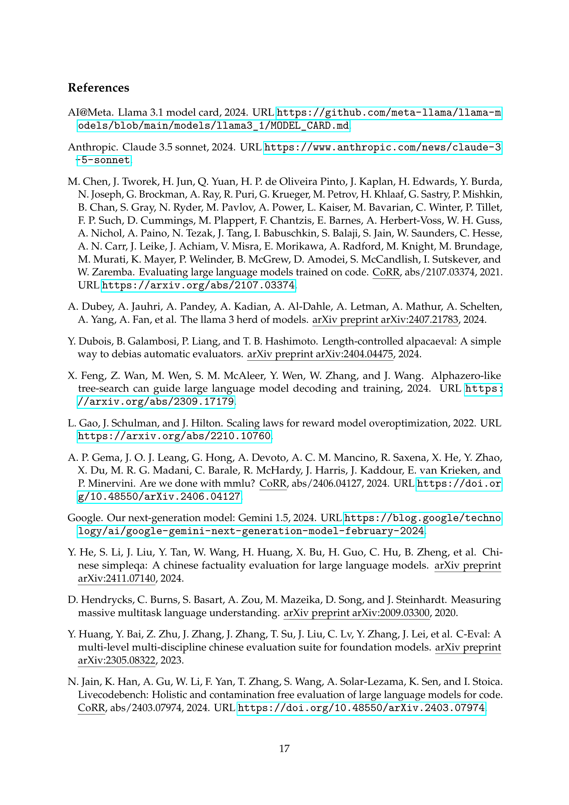

 


 2501.12948 
 DeepSeek-AI et el. 
 
 🤗 2025-01-23 
 



↗ arXiv


↗ Hugging Face


↗ Papers with Code


### TL;DR



본 논문은 대규모 언어 모델(LLM)의 추론 능력 향상에 초점을 맞춘 연구입니다. 기존의 연구는 주로 **방대한 지도 데이터**에 의존하여 모델 성능을 개선하는 데 집중해왔지만, 이는 데이터 수집 및 가공에 많은 비용과 시간을 필요로 한다는 단점이 있었습니다. 또한, 기존 연구에서 개발된 모델들은 가독성이 떨어지고 언어 혼합 현상이 발생하는 등의 문제점을 가지고 있었습니다. 

본 연구에서는 이러한 문제를 해결하기 위해 **강화 학습 기반의 새로운 접근 방식**을 제시합니다. **DeepSeek-R1-Zero** 모델은 지도 학습 없이 순수하게 강화 학습만으로 훈련되었으며, 놀랍게도 기존 모델들과 비교해 우수한 추론 성능을 보였습니다. 하지만, 가독성 및 언어 혼합 문제가 여전히 존재하여, 연구진은 **DeepSeek-R1** 모델을 개발했습니다. DeepSeek-R1은 다단계 훈련 및 콜드-스타트 데이터를 활용하여 가독성을 개선하고 추론 성능을 더욱 향상시켰습니다.  더 나아가, 연구진은 DeepSeek-R1의 추론 능력을 소규모 모델로 전이하는 **증류 기법**을 개발하여, 실제 산업적 활용 가능성을 높였습니다.  본 연구의 결과는 다양한 추론 과제에서 우수한 성능을 보였으며, 연구진은 이를 오픈소스로 공개하여 연구 공동체에 기여하고 있습니다.



#### Key Takeaways


 강화학습을 통해 대규모 언어 모델의 추론 능력을 획기적으로 향상시켰다. 



 지도 학습 없이도 우수한 추론 성능을 달성하는 DeepSeek-R1-Zero 모델을 개발했다. 



 추론 능력을 소규모 모델로 효과적으로 전이하는 증류 기법을 제시했다. 


#### Why does it matter?
본 논문은 **강화 학습을 통해 대규모 언어 모델의 추론 능력을 향상시키는 새로운 방법**을 제시하여, 기존의 지도 학습 방식에 의존하지 않고도 우수한 성능을 달성할 수 있음을 보여줍니다. 이는 **자연어 처리 분야의 혁신적인 발전**으로 이어질 수 있으며, 다양한 추론 과제에 대한 새로운 연구 방향을 제시합니다. 특히, **소규모 모델에도 추론 능력을 효과적으로 전이하는 증류 기법**을 제시하여,  산업적 활용 가능성을 높였습니다.  본 연구는 **향후 연구 방향을 제시하는 동시에, 연구 공동체에 오픈소스 모델을 제공**함으로써 학계 및 산업계에 큰 영향을 미칠 것으로 예상됩니다.

------
#### Visual Insights

> 🔼 그림 1은 DeepSeek-R1 모델의 성능을 다양한 벤치마크에서 비교 분석한 결과를 보여줍니다.  AIME 2024, Codeforces, GPQA Diamond, MATH-500, MMLU, SWE-bench Verified 등 여러 가지 reasoning 관련 벤치마크에서 DeepSeek-R1과 다른 모델들(OpenAI-01-1217, OpenAI-01-mini, DeepSeek-R1-32B, DeepSeek-V3)의 성능을 정확도 또는 백분위 수로 나타내어 비교합니다.  이를 통해 DeepSeek-R1 모델의 reasoning 능력이 다른 모델들에 비해 얼마나 우수한지를 시각적으로 확인할 수 있습니다.
> 

> 
read the caption

> Figure 1:  Benchmark performance of DeepSeek-R1.
> 


| A conversation between User and Assistant. The user asks a question, and the Assistant solves it. |
| The assistant first thinks about the reasoning process in the mind and then provides the user |
| with the answer. The reasoning process and answer are enclosed within <think> </think> and |
| <answer> </answer> tags, respectively, i.e., <think> reasoning process here </think> |
| <answer> answer here </answer>. User: prompt. Assistant:|

> 🔼 이 표는 DeepSeek-R1-Zero 모델 훈련에 사용된 템플릿을 보여줍니다.  사용자 질문(prompt)이 주어지면, 모델은 <think> 태그와 </think> 태그 사이에 추론 과정을, <answer> 태그와 </answer> 태그 사이에 답변을 생성하도록 설계되었습니다. 훈련 과정 중에 사용자 질문은 특정 추론 질문으로 대체됩니다.
> 

> 
read the caption

> Table 1: Template for DeepSeek-R1-Zero. prompt will be replaced with the specific reasoning question during training.
> 

### In-depth insights

#### RL Reasoning Boost
본 논문의 "RL Reasoning Boost" 부분은 강화 학습(RL)을 사용하여 언어 모델의 추론 능력을 향상시키는 방법에 대한 심도있는 논의를 제시합니다. **핵심은 감독 학습 없이도 RL만으로 언어 모델이 자체적으로 추론 능력을 개발할 수 있다는 것을 보여주는 것**입니다. 이를 위해, 기본 언어 모델에 RL을 직접 적용하여 추론 행동을 유도하는 DeepSeek-R1-Zero 모델을 제시하고 있습니다.  **DeepSeek-R1-Zero는 자체적으로 검증하고 반성하며, 긴 추론 과정을 생성하는 등 놀라운 능력을 보여주지만, 가독성 및 언어 혼합 문제**를 겪습니다.  이러한 문제를 해결하고 성능을 개선하기 위해, **다단계 학습 및 콜드-스타트 데이터를 활용한 DeepSeek-R1 모델**을 소개합니다.  DeepSeek-R1은 추론 벤치마크에서 OpenAI-01-1217과 비슷한 수준의 성능을 달성하였고, 이를 통해 **대규모 강화 학습을 통한 언어모델 추론 능력 향상의 가능성**을 확인했습니다.  또한,  **DeepSeek-R1의 추론 패턴을 소규모 모델에 증류**하여 성능 향상을 이끌어낸 점도 중요한 발견입니다.

#### Cold Start RL
본 논문에서 제시된 '콜드 스타트 강화 학습(Cold Start RL)'은 기존의 강화 학습 방식과는 다르게, **사전에 대량의 지도 학습 데이터 없이** 거대 언어 모델(LLM)의 추론 능력을 향상시키는 데 초점을 맞춥니다.  이는 **기존 방식의 한계점을 극복하기 위한 시도**로, 방대한 지도 학습 데이터 준비의 어려움과 비용 문제를 해결하고자 합니다.  **소량의 콜드 스타트 데이터를 활용**하여 LLM의 초기 학습을 안정화시키고, 이후 강화 학습을 통해 모델의 추론 능력을 발전시켜 나가는 전략을 취합니다. 이는 **모델의 자기 진화적 능력에 대한 기대**와 함께,  **데이터 효율성을 높이고자 하는 의도**를 반영합니다.  **다단계 학습 과정**을 통해,  초기 단계의 불안정성을 해소하고, 인간의 선호도에 부합하는 결과를 도출하기 위해 노력하는 점이 특징입니다.  결론적으로, 콜드 스타트 강화 학습은 데이터 효율성 및 모델의 자기 발전 가능성에 주목한 새로운 접근 방식이며, 거대 언어 모델의 추론 능력 향상에 대한 새로운 패러다임을 제시할 가능성을 내포하고 있습니다.  하지만,  **소량의 데이터만을 사용**하기 때문에 성능 측면에서의 한계와  **데이터 품질에 대한 의존성**은 향후 연구에서 개선되어야 할 부분입니다.

#### Distillation Success
본 논문에서 제시된 증류(Distillation) 기법의 성공은 **대규모 언어 모델(LLM)의 추론 능력을 더 작고 효율적인 모델로 전이하는 데 성공적**이었음을 보여줍니다.  **큰 모델에서 학습한 추론 패턴을 작은 모델로 효과적으로 전달**하여,  작은 모델의 성능을 기존의 강력한 모델들과 비교했을 때 상당히 향상시켰습니다. 이는 계산 비용을 절감하면서도 우수한 성능을 유지할 수 있다는 것을 의미하며, **연구 및 산업적 활용에 큰 의미**를 지닙니다.  특히,  본 연구에서 공개된 증류된 모델들은 오픈소스로 제공되어, 연구 커뮤니티에 상당한 도움을 줄 것으로 기대됩니다.  **다만, 증류된 모델이 원본 모델의 모든 능력을 완벽하게 재현하는 것은 아니**므로, 특정 작업에서는 성능 차이가 발생할 수 있다는 점을 고려해야 합니다.  향후 연구는 증류 과정의 효율성을 높이는 것과, **증류된 모델의 성능 한계를 극복**하는 방법에 초점을 맞춰야 할 것입니다.

#### Aha Moments in RL
강화 학습(RL)에서의 'Aha Moment'는 모델이 갑작스럽고 예상치 못한 성능 향상을 보이는 순간을 의미합니다. 이는 단순히 매개변수의 점진적인 최적화를 넘어, **모델 자체가 문제 해결 방식에 대한 근본적인 이해를 획득하는 것**을 시사합니다.  본 논문에서는 RL 과정 중 모델이 스스로 복잡한 추론 과정을 거치면서, 이전에는 없던 새로운 추론 전략이나 문제 해결 방식을 발견하는 현상을 'Aha Moment'로 설명합니다. 이러한 순간들은 **모델의 자기 진화적 능력**을 보여주는 증거이며, 단순히 훈련 데이터에 의존하는 것이 아니라 모델 내부적으로 새로운 지식이나 이해를 생성해냄을 의미합니다.  **모델의 사고 과정의 길이가 늘어남에 따라 더욱 정교한 추론 행위**를 보이는 점은 주목할 만하며, 이는 더 긴 사고 과정을 통해 모델이 자체적으로 더 효율적인 문제 해결 전략을 찾아내는 것을 의미합니다.  **반복적인 시행착오와 보상을 통한 자기 학습**으로 이러한 혁신적인 추론 전략이 등장한다는 점은 강화학습의 놀라운 잠재력을 보여주는 중요한 발견입니다.  하지만, 이러한 'Aha Moment'의 발생 과정과 메커니즘은 아직 완전히 규명되지 않았으며, 향후 연구를 통해 더욱 심도있는 이해가 필요합니다. 이를 통해 더욱 효율적이고 예측 가능한 강화학습 알고리즘 개발에 기여할 수 있을 것입니다.

#### Future of Reasoning
본 논문은 강화학습을 통해 LLMs의 추론 능력을 향상시키는 DeepSeek-R1 모델을 제시하며, **감독 학습 없이도 놀라운 추론 성능**을 보여줍니다.  하지만,  가독성 저하 및 언어 혼합과 같은 문제점도 드러납니다.  미래의 추론 연구는 이러한 한계를 극복하고 **더욱 발전된 추론 능력을 가진 모델을 개발**하는 데 집중해야 합니다.  **다양한 언어와 복잡한 문제 해결** 능력 향상, **설명 가능성 및 신뢰성 확보**, 그리고 **소규모 모델로의 효율적인 지식 증류** 연구가 중요한 과제입니다.  또한,  **인간의 선호도를 더욱 잘 반영하는 보상 시스템** 개발과 **안전성 및 윤리적 문제**에 대한 고려가 필수적입니다.  최근 연구 동향을 고려해볼 때,  **대규모 언어 모델의 자기 진화 능력**을 활용하고 **인간-AI 협업**을 통해 추론 과정의 투명성을 높이는 방향으로 연구가 진행될 것으로 예상됩니다.  궁극적으로는, **범용 인공지능(AGI) 수준의 추론 능력**을 갖춘 모델 개발이 미래 추론 연구의 최종 목표가 될 것입니다.

### More visual insights

More on figures

> 🔼 그림 2는 DeepSeek-R1-Zero 모델의 훈련 과정 동안 AIME(American Invitational Mathematics Examination) 정확도 변화를 보여줍니다. 각 질문에 대해 16개의 응답을 샘플링하고 전체 평균 정확도를 계산하여 안정적인 평가를 보장합니다. 이는 강화 학습 과정에서 모델의 성능 향상을 시각적으로 보여주는 그래프로, 훈련 단계가 진행될수록 정확도가 향상되는 것을 확인할 수 있습니다.  x축은 훈련 단계(steps)를, y축은 정확도(Accuracy)를 나타냅니다.  두 개의 선은 각각 pass@1과 cons@64(다수결 투표) 정확도를 나타냅니다.  이 그래프를 통해 DeepSeek-R1-Zero 모델의 학습 과정과 성능 개선을 명확하게 이해할 수 있습니다.
> 

> 
read the caption

> Figure 2: AIME accuracy of DeepSeek-R1-Zero during training. For each question, we sample 16 responses and calculate the overall average accuracy to ensure a stable evaluation.
> 

> 🔼 그림 3은 강화 학습(RL) 과정 동안 학습 데이터셋에서 DeepSeek-R1-Zero 모델의 평균 응답 길이를 보여줍니다.  세로축은 평균 응답 길이(토큰 수), 가로축은 RL 훈련 단계(step)를 나타냅니다.  DeepSeek-R1-Zero 모델은 훈련이 진행됨에 따라 더 긴 추론 과정을 거치면서 더 복잡한 추론 문제를 해결하는 능력을 자연스럽게 학습합니다.  즉, 더 많은 토큰을 사용하여 더 자세하게 생각함으로써 더 정확한 답을 도출하는 것을 알 수 있습니다.  이러한 응답 길이의 증가는 외부적인 조정이 아닌 모델 내부의 자연스러운 발전의 결과입니다.  그림은 RL 훈련의 효과를 시각적으로 보여주는 동시에 모델이 더 복잡한 추론 문제를 해결하기 위해 더 긴 추론 과정을 자연스럽게 학습한다는 점을 보여줍니다.
> 

> 
read the caption

> Figure 3: The average response length of DeepSeek-R1-Zero on the training set during the RL process. DeepSeek-R1-Zero naturally learns to solve reasoning tasks with more thinking time.
> 

More on tables


| Model | AIME 2024 Diamond | AIME 2024 Bench | MATH-500 pass@1 | GPQA pass@1 | LiveCode pass@1 | CodeForces rating |
|---|---|---|---|---|---|---|
| **OpenAI-o1-mini** | 63.6 | 80.0 | 90.0 | 60.0 | 53.8 | 1820 |
| **OpenAI-o1-0912** | 74.4 | 83.3 | 94.8 | 77.3 | 63.4 | 1843 |
| **DeepSeek-R1-Zero** | 71.0 | 86.7 | 95.9 | 73.3 | 50.0 | 1444 |
> 🔼 표 2는 DeepSeek-R1-Zero와 OpenAI의 o1 모델이 추론 관련 벤치마크에서 어떤 성능을 보이는지 비교한 표입니다.  AIIME 2024, MATH-500, GPQA Diamond, LiveCodeBench, CodeForces 등 다양한 벤치마크에서 두 모델의 정확도(Pass@1, cons@64)를 비교하여 DeepSeek-R1-Zero의 성능을 보여줍니다.  단순히 정확도 뿐 아니라 다양한 추론 능력을 평가하는 지표를 사용하여,  DeepSeek-R1-Zero가 OpenAI의 o1 모델과 비교했을 때 어느 정도 수준인지, 그리고 어떤 강점과 약점을 가지는지 보여줍니다.
> 

> 
read the caption

> Table 2: Comparison of DeepSeek-R1-Zero and OpenAI o1 models on reasoning-related benchmarks.
> 


<table class="ltx_tabular ltx_centering ltx_align_middle" id="S2.T3.10">
<tbody class="ltx_tbody">
<tr class="ltx_tr" id="S2.T3.2.2">
<td class="ltx_td ltx_align_left ltx_border_tt" id="S2.T3.2.2.2">Question: If <math alttext="a&gt;1" class="ltx_Math" display="inline" id="S2.T3.1.1.1.m1.1"><semantics id="S2.T3.1.1.1.m1.1a"><mrow id="S2.T3.1.1.1.m1.1.1" xref="S2.T3.1.1.1.m1.1.1.cmml"><mi id="S2.T3.1.1.1.m1.1.1.2" xref="S2.T3.1.1.1.m1.1.1.2.cmml">a</mi><mo id="S2.T3.1.1.1.m1.1.1.1" xref="S2.T3.1.1.1.m1.1.1.1.cmml">&gt;</mo><mn id="S2.T3.1.1.1.m1.1.1.3" xref="S2.T3.1.1.1.m1.1.1.3.cmml">1</mn></mrow><annotation-xml encoding="MathML-Content" id="S2.T3.1.1.1.m1.1b"><apply id="S2.T3.1.1.1.m1.1.1.cmml" xref="S2.T3.1.1.1.m1.1.1"><gt id="S2.T3.1.1.1.m1.1.1.1.cmml" xref="S2.T3.1.1.1.m1.1.1.1"></gt><ci id="S2.T3.1.1.1.m1.1.1.2.cmml" xref="S2.T3.1.1.1.m1.1.1.2">𝑎</ci><cn id="S2.T3.1.1.1.m1.1.1.3.cmml" type="integer" xref="S2.T3.1.1.1.m1.1.1.3">1</cn></apply></annotation-xml><annotation encoding="application/x-tex" id="S2.T3.1.1.1.m1.1c">a&gt;1</annotation><annotation encoding="application/x-llamapun" id="S2.T3.1.1.1.m1.1d">italic_a &gt; 1</annotation></semantics></math>, then the sum of the real solutions of <math alttext="\sqrt{a-\sqrt{a+x}}=x" class="ltx_Math" display="inline" id="S2.T3.2.2.2.m2.1"><semantics id="S2.T3.2.2.2.m2.1a"><mrow id="S2.T3.2.2.2.m2.1.1" xref="S2.T3.2.2.2.m2.1.1.cmml"><msqrt id="S2.T3.2.2.2.m2.1.1.2" xref="S2.T3.2.2.2.m2.1.1.2.cmml"><mrow id="S2.T3.2.2.2.m2.1.1.2.2" xref="S2.T3.2.2.2.m2.1.1.2.2.cmml"><mi id="S2.T3.2.2.2.m2.1.1.2.2.2" xref="S2.T3.2.2.2.m2.1.1.2.2.2.cmml">a</mi><mo id="S2.T3.2.2.2.m2.1.1.2.2.1" xref="S2.T3.2.2.2.m2.1.1.2.2.1.cmml">−</mo><msqrt id="S2.T3.2.2.2.m2.1.1.2.2.3" xref="S2.T3.2.2.2.m2.1.1.2.2.3.cmml"><mrow id="S2.T3.2.2.2.m2.1.1.2.2.3.2" xref="S2.T3.2.2.2.m2.1.1.2.2.3.2.cmml"><mi id="S2.T3.2.2.2.m2.1.1.2.2.3.2.2" xref="S2.T3.2.2.2.m2.1.1.2.2.3.2.2.cmml">a</mi><mo id="S2.T3.2.2.2.m2.1.1.2.2.3.2.1" xref="S2.T3.2.2.2.m2.1.1.2.2.3.2.1.cmml">+</mo><mi id="S2.T3.2.2.2.m2.1.1.2.2.3.2.3" xref="S2.T3.2.2.2.m2.1.1.2.2.3.2.3.cmml">x</mi></mrow></msqrt></mrow></msqrt><mo id="S2.T3.2.2.2.m2.1.1.1" xref="S2.T3.2.2.2.m2.1.1.1.cmml">=</mo><mi id="S2.T3.2.2.2.m2.1.1.3" xref="S2.T3.2.2.2.m2.1.1.3.cmml">x</mi></mrow><annotation-xml encoding="MathML-Content" id="S2.T3.2.2.2.m2.1b"><apply id="S2.T3.2.2.2.m2.1.1.cmml" xref="S2.T3.2.2.2.m2.1.1"><eq id="S2.T3.2.2.2.m2.1.1.1.cmml" xref="S2.T3.2.2.2.m2.1.1.1"></eq><apply id="S2.T3.2.2.2.m2.1.1.2.cmml" xref="S2.T3.2.2.2.m2.1.1.2"><root id="S2.T3.2.2.2.m2.1.1.2a.cmml" xref="S2.T3.2.2.2.m2.1.1.2"></root><apply id="S2.T3.2.2.2.m2.1.1.2.2.cmml" xref="S2.T3.2.2.2.m2.1.1.2.2"><minus id="S2.T3.2.2.2.m2.1.1.2.2.1.cmml" xref="S2.T3.2.2.2.m2.1.1.2.2.1"></minus><ci id="S2.T3.2.2.2.m2.1.1.2.2.2.cmml" xref="S2.T3.2.2.2.m2.1.1.2.2.2">𝑎</ci><apply id="S2.T3.2.2.2.m2.1.1.2.2.3.cmml" xref="S2.T3.2.2.2.m2.1.1.2.2.3"><root id="S2.T3.2.2.2.m2.1.1.2.2.3a.cmml" xref="S2.T3.2.2.2.m2.1.1.2.2.3"></root><apply id="S2.T3.2.2.2.m2.1.1.2.2.3.2.cmml" xref="S2.T3.2.2.2.m2.1.1.2.2.3.2"><plus id="S2.T3.2.2.2.m2.1.1.2.2.3.2.1.cmml" xref="S2.T3.2.2.2.m2.1.1.2.2.3.2.1"></plus><ci id="S2.T3.2.2.2.m2.1.1.2.2.3.2.2.cmml" xref="S2.T3.2.2.2.m2.1.1.2.2.3.2.2">𝑎</ci><ci id="S2.T3.2.2.2.m2.1.1.2.2.3.2.3.cmml" xref="S2.T3.2.2.2.m2.1.1.2.2.3.2.3">𝑥</ci></apply></apply></apply></apply><ci id="S2.T3.2.2.2.m2.1.1.3.cmml" xref="S2.T3.2.2.2.m2.1.1.3">𝑥</ci></apply></annotation-xml><annotation encoding="application/x-tex" id="S2.T3.2.2.2.m2.1c">\sqrt{a-\sqrt{a+x}}=x</annotation><annotation encoding="application/x-llamapun" id="S2.T3.2.2.2.m2.1d">square-root start_ARG italic_a - square-root start_ARG italic_a + italic_x end_ARG end_ARG = italic_x</annotation></semantics></math> is equal to</td>
</tr>
<tr class="ltx_tr" id="S2.T3.10.11.1">
<td class="ltx_td ltx_align_left ltx_border_t" id="S2.T3.10.11.1.1">Response: &lt;think&gt;</td>
</tr>
<tr class="ltx_tr" id="S2.T3.4.4">
<td class="ltx_td ltx_align_left" id="S2.T3.4.4.2">To solve the equation <math alttext="\sqrt{a-\sqrt{a+x}}=x" class="ltx_Math" display="inline" id="S2.T3.3.3.1.m1.1"><semantics id="S2.T3.3.3.1.m1.1a"><mrow id="S2.T3.3.3.1.m1.1.1" xref="S2.T3.3.3.1.m1.1.1.cmml"><msqrt id="S2.T3.3.3.1.m1.1.1.2" xref="S2.T3.3.3.1.m1.1.1.2.cmml"><mrow id="S2.T3.3.3.1.m1.1.1.2.2" xref="S2.T3.3.3.1.m1.1.1.2.2.cmml"><mi id="S2.T3.3.3.1.m1.1.1.2.2.2" xref="S2.T3.3.3.1.m1.1.1.2.2.2.cmml">a</mi><mo id="S2.T3.3.3.1.m1.1.1.2.2.1" xref="S2.T3.3.3.1.m1.1.1.2.2.1.cmml">−</mo><msqrt id="S2.T3.3.3.1.m1.1.1.2.2.3" xref="S2.T3.3.3.1.m1.1.1.2.2.3.cmml"><mrow id="S2.T3.3.3.1.m1.1.1.2.2.3.2" xref="S2.T3.3.3.1.m1.1.1.2.2.3.2.cmml"><mi id="S2.T3.3.3.1.m1.1.1.2.2.3.2.2" xref="S2.T3.3.3.1.m1.1.1.2.2.3.2.2.cmml">a</mi><mo id="S2.T3.3.3.1.m1.1.1.2.2.3.2.1" xref="S2.T3.3.3.1.m1.1.1.2.2.3.2.1.cmml">+</mo><mi id="S2.T3.3.3.1.m1.1.1.2.2.3.2.3" xref="S2.T3.3.3.1.m1.1.1.2.2.3.2.3.cmml">x</mi></mrow></msqrt></mrow></msqrt><mo id="S2.T3.3.3.1.m1.1.1.1" xref="S2.T3.3.3.1.m1.1.1.1.cmml">=</mo><mi id="S2.T3.3.3.1.m1.1.1.3" xref="S2.T3.3.3.1.m1.1.1.3.cmml">x</mi></mrow><annotation-xml encoding="MathML-Content" id="S2.T3.3.3.1.m1.1b"><apply id="S2.T3.3.3.1.m1.1.1.cmml" xref="S2.T3.3.3.1.m1.1.1"><eq id="S2.T3.3.3.1.m1.1.1.1.cmml" xref="S2.T3.3.3.1.m1.1.1.1"></eq><apply id="S2.T3.3.3.1.m1.1.1.2.cmml" xref="S2.T3.3.3.1.m1.1.1.2"><root id="S2.T3.3.3.1.m1.1.1.2a.cmml" xref="S2.T3.3.3.1.m1.1.1.2"></root><apply id="S2.T3.3.3.1.m1.1.1.2.2.cmml" xref="S2.T3.3.3.1.m1.1.1.2.2"><minus id="S2.T3.3.3.1.m1.1.1.2.2.1.cmml" xref="S2.T3.3.3.1.m1.1.1.2.2.1"></minus><ci id="S2.T3.3.3.1.m1.1.1.2.2.2.cmml" xref="S2.T3.3.3.1.m1.1.1.2.2.2">𝑎</ci><apply id="S2.T3.3.3.1.m1.1.1.2.2.3.cmml" xref="S2.T3.3.3.1.m1.1.1.2.2.3"><root id="S2.T3.3.3.1.m1.1.1.2.2.3a.cmml" xref="S2.T3.3.3.1.m1.1.1.2.2.3"></root><apply id="S2.T3.3.3.1.m1.1.1.2.2.3.2.cmml" xref="S2.T3.3.3.1.m1.1.1.2.2.3.2"><plus id="S2.T3.3.3.1.m1.1.1.2.2.3.2.1.cmml" xref="S2.T3.3.3.1.m1.1.1.2.2.3.2.1"></plus><ci id="S2.T3.3.3.1.m1.1.1.2.2.3.2.2.cmml" xref="S2.T3.3.3.1.m1.1.1.2.2.3.2.2">𝑎</ci><ci id="S2.T3.3.3.1.m1.1.1.2.2.3.2.3.cmml" xref="S2.T3.3.3.1.m1.1.1.2.2.3.2.3">𝑥</ci></apply></apply></apply></apply><ci id="S2.T3.3.3.1.m1.1.1.3.cmml" xref="S2.T3.3.3.1.m1.1.1.3">𝑥</ci></apply></annotation-xml><annotation encoding="application/x-tex" id="S2.T3.3.3.1.m1.1c">\sqrt{a-\sqrt{a+x}}=x</annotation><annotation encoding="application/x-llamapun" id="S2.T3.3.3.1.m1.1d">square-root start_ARG italic_a - square-root start_ARG italic_a + italic_x end_ARG end_ARG = italic_x</annotation></semantics></math>, let’s start by squaring both <math alttext="\cdots" class="ltx_Math" display="inline" id="S2.T3.4.4.2.m2.1"><semantics id="S2.T3.4.4.2.m2.1a"><mi id="S2.T3.4.4.2.m2.1.1" mathvariant="normal" xref="S2.T3.4.4.2.m2.1.1.cmml">⋯</mi><annotation-xml encoding="MathML-Content" id="S2.T3.4.4.2.m2.1b"><ci id="S2.T3.4.4.2.m2.1.1.cmml" xref="S2.T3.4.4.2.m2.1.1">⋯</ci></annotation-xml><annotation encoding="application/x-tex" id="S2.T3.4.4.2.m2.1c">\cdots</annotation><annotation encoding="application/x-llamapun" id="S2.T3.4.4.2.m2.1d">⋯</annotation></semantics></math>
</td>
</tr>
<tr class="ltx_tr" id="S2.T3.5.5">
<td class="ltx_td ltx_align_left" id="S2.T3.5.5.1"><math alttext="\left(\sqrt{a-\sqrt{a+x}}\right)^{2}=x^{2}\implies a-\sqrt{a+x}=x^{2}." class="ltx_Math" display="inline" id="S2.T3.5.5.1.m1.2"><semantics id="S2.T3.5.5.1.m1.2a"><mrow id="S2.T3.5.5.1.m1.2.2.1" xref="S2.T3.5.5.1.m1.2.2.1.1.cmml"><mrow id="S2.T3.5.5.1.m1.2.2.1.1" xref="S2.T3.5.5.1.m1.2.2.1.1.cmml"><msup id="S2.T3.5.5.1.m1.2.2.1.1.2" xref="S2.T3.5.5.1.m1.2.2.1.1.2.cmml"><mrow id="S2.T3.5.5.1.m1.2.2.1.1.2.2.2" xref="S2.T3.5.5.1.m1.1.1.cmml"><mo id="S2.T3.5.5.1.m1.2.2.1.1.2.2.2.1" xref="S2.T3.5.5.1.m1.1.1.cmml">(</mo><msqrt id="S2.T3.5.5.1.m1.1.1" xref="S2.T3.5.5.1.m1.1.1.cmml"><mrow id="S2.T3.5.5.1.m1.1.1.2" xref="S2.T3.5.5.1.m1.1.1.2.cmml"><mi id="S2.T3.5.5.1.m1.1.1.2.2" xref="S2.T3.5.5.1.m1.1.1.2.2.cmml">a</mi><mo id="S2.T3.5.5.1.m1.1.1.2.1" xref="S2.T3.5.5.1.m1.1.1.2.1.cmml">−</mo><msqrt id="S2.T3.5.5.1.m1.1.1.2.3" xref="S2.T3.5.5.1.m1.1.1.2.3.cmml"><mrow id="S2.T3.5.5.1.m1.1.1.2.3.2" xref="S2.T3.5.5.1.m1.1.1.2.3.2.cmml"><mi id="S2.T3.5.5.1.m1.1.1.2.3.2.2" xref="S2.T3.5.5.1.m1.1.1.2.3.2.2.cmml">a</mi><mo id="S2.T3.5.5.1.m1.1.1.2.3.2.1" xref="S2.T3.5.5.1.m1.1.1.2.3.2.1.cmml">+</mo><mi id="S2.T3.5.5.1.m1.1.1.2.3.2.3" xref="S2.T3.5.5.1.m1.1.1.2.3.2.3.cmml">x</mi></mrow></msqrt></mrow></msqrt><mo id="S2.T3.5.5.1.m1.2.2.1.1.2.2.2.2" xref="S2.T3.5.5.1.m1.1.1.cmml">)</mo></mrow><mn id="S2.T3.5.5.1.m1.2.2.1.1.2.3" xref="S2.T3.5.5.1.m1.2.2.1.1.2.3.cmml">2</mn></msup><mo id="S2.T3.5.5.1.m1.2.2.1.1.3" xref="S2.T3.5.5.1.m1.2.2.1.1.3.cmml">=</mo><msup id="S2.T3.5.5.1.m1.2.2.1.1.4" xref="S2.T3.5.5.1.m1.2.2.1.1.4.cmml"><mi id="S2.T3.5.5.1.m1.2.2.1.1.4.2" xref="S2.T3.5.5.1.m1.2.2.1.1.4.2.cmml">x</mi><mn id="S2.T3.5.5.1.m1.2.2.1.1.4.3" xref="S2.T3.5.5.1.m1.2.2.1.1.4.3.cmml">2</mn></msup><mo id="S2.T3.5.5.1.m1.2.2.1.1.5" stretchy="false" xref="S2.T3.5.5.1.m1.2.2.1.1.5.cmml">⟹</mo><mrow id="S2.T3.5.5.1.m1.2.2.1.1.6" xref="S2.T3.5.5.1.m1.2.2.1.1.6.cmml"><mi id="S2.T3.5.5.1.m1.2.2.1.1.6.2" xref="S2.T3.5.5.1.m1.2.2.1.1.6.2.cmml">a</mi><mo id="S2.T3.5.5.1.m1.2.2.1.1.6.1" xref="S2.T3.5.5.1.m1.2.2.1.1.6.1.cmml">−</mo><msqrt id="S2.T3.5.5.1.m1.2.2.1.1.6.3" xref="S2.T3.5.5.1.m1.2.2.1.1.6.3.cmml"><mrow id="S2.T3.5.5.1.m1.2.2.1.1.6.3.2" xref="S2.T3.5.5.1.m1.2.2.1.1.6.3.2.cmml"><mi id="S2.T3.5.5.1.m1.2.2.1.1.6.3.2.2" xref="S2.T3.5.5.1.m1.2.2.1.1.6.3.2.2.cmml">a</mi><mo id="S2.T3.5.5.1.m1.2.2.1.1.6.3.2.1" xref="S2.T3.5.5.1.m1.2.2.1.1.6.3.2.1.cmml">+</mo><mi id="S2.T3.5.5.1.m1.2.2.1.1.6.3.2.3" xref="S2.T3.5.5.1.m1.2.2.1.1.6.3.2.3.cmml">x</mi></mrow></msqrt></mrow><mo id="S2.T3.5.5.1.m1.2.2.1.1.7" xref="S2.T3.5.5.1.m1.2.2.1.1.7.cmml">=</mo><msup id="S2.T3.5.5.1.m1.2.2.1.1.8" xref="S2.T3.5.5.1.m1.2.2.1.1.8.cmml"><mi id="S2.T3.5.5.1.m1.2.2.1.1.8.2" xref="S2.T3.5.5.1.m1.2.2.1.1.8.2.cmml">x</mi><mn id="S2.T3.5.5.1.m1.2.2.1.1.8.3" xref="S2.T3.5.5.1.m1.2.2.1.1.8.3.cmml">2</mn></msup></mrow><mo id="S2.T3.5.5.1.m1.2.2.1.2" lspace="0em" xref="S2.T3.5.5.1.m1.2.2.1.1.cmml">.</mo></mrow><annotation-xml encoding="MathML-Content" id="S2.T3.5.5.1.m1.2b"><apply id="S2.T3.5.5.1.m1.2.2.1.1.cmml" xref="S2.T3.5.5.1.m1.2.2.1"><and id="S2.T3.5.5.1.m1.2.2.1.1a.cmml" xref="S2.T3.5.5.1.m1.2.2.1"></and><apply id="S2.T3.5.5.1.m1.2.2.1.1b.cmml" xref="S2.T3.5.5.1.m1.2.2.1"><eq id="S2.T3.5.5.1.m1.2.2.1.1.3.cmml" xref="S2.T3.5.5.1.m1.2.2.1.1.3"></eq><apply id="S2.T3.5.5.1.m1.2.2.1.1.2.cmml" xref="S2.T3.5.5.1.m1.2.2.1.1.2"><csymbol cd="ambiguous" id="S2.T3.5.5.1.m1.2.2.1.1.2.1.cmml" xref="S2.T3.5.5.1.m1.2.2.1.1.2">superscript</csymbol><apply id="S2.T3.5.5.1.m1.1.1.cmml" xref="S2.T3.5.5.1.m1.2.2.1.1.2.2.2"><root id="S2.T3.5.5.1.m1.1.1a.cmml" xref="S2.T3.5.5.1.m1.2.2.1.1.2.2.2"></root><apply id="S2.T3.5.5.1.m1.1.1.2.cmml" xref="S2.T3.5.5.1.m1.1.1.2"><minus id="S2.T3.5.5.1.m1.1.1.2.1.cmml" xref="S2.T3.5.5.1.m1.1.1.2.1"></minus><ci id="S2.T3.5.5.1.m1.1.1.2.2.cmml" xref="S2.T3.5.5.1.m1.1.1.2.2">𝑎</ci><apply id="S2.T3.5.5.1.m1.1.1.2.3.cmml" xref="S2.T3.5.5.1.m1.1.1.2.3"><root id="S2.T3.5.5.1.m1.1.1.2.3a.cmml" xref="S2.T3.5.5.1.m1.1.1.2.3"></root><apply id="S2.T3.5.5.1.m1.1.1.2.3.2.cmml" xref="S2.T3.5.5.1.m1.1.1.2.3.2"><plus id="S2.T3.5.5.1.m1.1.1.2.3.2.1.cmml" xref="S2.T3.5.5.1.m1.1.1.2.3.2.1"></plus><ci id="S2.T3.5.5.1.m1.1.1.2.3.2.2.cmml" xref="S2.T3.5.5.1.m1.1.1.2.3.2.2">𝑎</ci><ci id="S2.T3.5.5.1.m1.1.1.2.3.2.3.cmml" xref="S2.T3.5.5.1.m1.1.1.2.3.2.3">𝑥</ci></apply></apply></apply></apply><cn id="S2.T3.5.5.1.m1.2.2.1.1.2.3.cmml" type="integer" xref="S2.T3.5.5.1.m1.2.2.1.1.2.3">2</cn></apply><apply id="S2.T3.5.5.1.m1.2.2.1.1.4.cmml" xref="S2.T3.5.5.1.m1.2.2.1.1.4"><csymbol cd="ambiguous" id="S2.T3.5.5.1.m1.2.2.1.1.4.1.cmml" xref="S2.T3.5.5.1.m1.2.2.1.1.4">superscript</csymbol><ci id="S2.T3.5.5.1.m1.2.2.1.1.4.2.cmml" xref="S2.T3.5.5.1.m1.2.2.1.1.4.2">𝑥</ci><cn id="S2.T3.5.5.1.m1.2.2.1.1.4.3.cmml" type="integer" xref="S2.T3.5.5.1.m1.2.2.1.1.4.3">2</cn></apply></apply><apply id="S2.T3.5.5.1.m1.2.2.1.1c.cmml" xref="S2.T3.5.5.1.m1.2.2.1"><implies id="S2.T3.5.5.1.m1.2.2.1.1.5.cmml" xref="S2.T3.5.5.1.m1.2.2.1.1.5"></implies><share href="https://arxiv.org/html/2501.12948v1#S2.T3.5.5.1.m1.2.2.1.1.4.cmml" id="S2.T3.5.5.1.m1.2.2.1.1d.cmml" xref="S2.T3.5.5.1.m1.2.2.1"></share><apply id="S2.T3.5.5.1.m1.2.2.1.1.6.cmml" xref="S2.T3.5.5.1.m1.2.2.1.1.6"><minus id="S2.T3.5.5.1.m1.2.2.1.1.6.1.cmml" xref="S2.T3.5.5.1.m1.2.2.1.1.6.1"></minus><ci id="S2.T3.5.5.1.m1.2.2.1.1.6.2.cmml" xref="S2.T3.5.5.1.m1.2.2.1.1.6.2">𝑎</ci><apply id="S2.T3.5.5.1.m1.2.2.1.1.6.3.cmml" xref="S2.T3.5.5.1.m1.2.2.1.1.6.3"><root id="S2.T3.5.5.1.m1.2.2.1.1.6.3a.cmml" xref="S2.T3.5.5.1.m1.2.2.1.1.6.3"></root><apply id="S2.T3.5.5.1.m1.2.2.1.1.6.3.2.cmml" xref="S2.T3.5.5.1.m1.2.2.1.1.6.3.2"><plus id="S2.T3.5.5.1.m1.2.2.1.1.6.3.2.1.cmml" xref="S2.T3.5.5.1.m1.2.2.1.1.6.3.2.1"></plus><ci id="S2.T3.5.5.1.m1.2.2.1.1.6.3.2.2.cmml" xref="S2.T3.5.5.1.m1.2.2.1.1.6.3.2.2">𝑎</ci><ci id="S2.T3.5.5.1.m1.2.2.1.1.6.3.2.3.cmml" xref="S2.T3.5.5.1.m1.2.2.1.1.6.3.2.3">𝑥</ci></apply></apply></apply></apply><apply id="S2.T3.5.5.1.m1.2.2.1.1e.cmml" xref="S2.T3.5.5.1.m1.2.2.1"><eq id="S2.T3.5.5.1.m1.2.2.1.1.7.cmml" xref="S2.T3.5.5.1.m1.2.2.1.1.7"></eq><share href="https://arxiv.org/html/2501.12948v1#S2.T3.5.5.1.m1.2.2.1.1.6.cmml" id="S2.T3.5.5.1.m1.2.2.1.1f.cmml" xref="S2.T3.5.5.1.m1.2.2.1"></share><apply id="S2.T3.5.5.1.m1.2.2.1.1.8.cmml" xref="S2.T3.5.5.1.m1.2.2.1.1.8"><csymbol cd="ambiguous" id="S2.T3.5.5.1.m1.2.2.1.1.8.1.cmml" xref="S2.T3.5.5.1.m1.2.2.1.1.8">superscript</csymbol><ci id="S2.T3.5.5.1.m1.2.2.1.1.8.2.cmml" xref="S2.T3.5.5.1.m1.2.2.1.1.8.2">𝑥</ci><cn id="S2.T3.5.5.1.m1.2.2.1.1.8.3.cmml" type="integer" xref="S2.T3.5.5.1.m1.2.2.1.1.8.3">2</cn></apply></apply></apply></annotation-xml><annotation encoding="application/x-tex" id="S2.T3.5.5.1.m1.2c">\left(\sqrt{a-\sqrt{a+x}}\right)^{2}=x^{2}\implies a-\sqrt{a+x}=x^{2}.</annotation><annotation encoding="application/x-llamapun" id="S2.T3.5.5.1.m1.2d">( square-root start_ARG italic_a - square-root start_ARG italic_a + italic_x end_ARG end_ARG ) start_POSTSUPERSCRIPT 2 end_POSTSUPERSCRIPT = italic_x start_POSTSUPERSCRIPT 2 end_POSTSUPERSCRIPT ⟹ italic_a - square-root start_ARG italic_a + italic_x end_ARG = italic_x start_POSTSUPERSCRIPT 2 end_POSTSUPERSCRIPT .</annotation></semantics></math></td>
</tr>
<tr class="ltx_tr" id="S2.T3.10.12.2">
<td class="ltx_td ltx_align_left" id="S2.T3.10.12.2.1">Rearrange to isolate the inner square root term:</td>
</tr>
<tr class="ltx_tr" id="S2.T3.6.6">
<td class="ltx_td ltx_align_left" id="S2.T3.6.6.1"><math alttext="(a-x^{2})^{2}=a+x\implies a^{2}-2ax^{2}+(x^{2})^{2}=a+x\implies x^{4}-2ax^{2}-%
x+(a^{2}-a)=0" class="ltx_Math" display="inline" id="S2.T3.6.6.1.m1.3"><semantics id="S2.T3.6.6.1.m1.3a"><mrow id="S2.T3.6.6.1.m1.3.3" xref="S2.T3.6.6.1.m1.3.3.cmml"><msup id="S2.T3.6.6.1.m1.1.1.1" xref="S2.T3.6.6.1.m1.1.1.1.cmml"><mrow id="S2.T3.6.6.1.m1.1.1.1.1.1" xref="S2.T3.6.6.1.m1.1.1.1.1.1.1.cmml"><mo id="S2.T3.6.6.1.m1.1.1.1.1.1.2" stretchy="false" xref="S2.T3.6.6.1.m1.1.1.1.1.1.1.cmml">(</mo><mrow id="S2.T3.6.6.1.m1.1.1.1.1.1.1" xref="S2.T3.6.6.1.m1.1.1.1.1.1.1.cmml"><mi id="S2.T3.6.6.1.m1.1.1.1.1.1.1.2" xref="S2.T3.6.6.1.m1.1.1.1.1.1.1.2.cmml">a</mi><mo id="S2.T3.6.6.1.m1.1.1.1.1.1.1.1" xref="S2.T3.6.6.1.m1.1.1.1.1.1.1.1.cmml">−</mo><msup id="S2.T3.6.6.1.m1.1.1.1.1.1.1.3" xref="S2.T3.6.6.1.m1.1.1.1.1.1.1.3.cmml"><mi id="S2.T3.6.6.1.m1.1.1.1.1.1.1.3.2" xref="S2.T3.6.6.1.m1.1.1.1.1.1.1.3.2.cmml">x</mi><mn id="S2.T3.6.6.1.m1.1.1.1.1.1.1.3.3" xref="S2.T3.6.6.1.m1.1.1.1.1.1.1.3.3.cmml">2</mn></msup></mrow><mo id="S2.T3.6.6.1.m1.1.1.1.1.1.3" stretchy="false" xref="S2.T3.6.6.1.m1.1.1.1.1.1.1.cmml">)</mo></mrow><mn id="S2.T3.6.6.1.m1.1.1.1.3" xref="S2.T3.6.6.1.m1.1.1.1.3.cmml">2</mn></msup><mo id="S2.T3.6.6.1.m1.3.3.5" xref="S2.T3.6.6.1.m1.3.3.5.cmml">=</mo><mrow id="S2.T3.6.6.1.m1.3.3.6" xref="S2.T3.6.6.1.m1.3.3.6.cmml"><mi id="S2.T3.6.6.1.m1.3.3.6.2" xref="S2.T3.6.6.1.m1.3.3.6.2.cmml">a</mi><mo id="S2.T3.6.6.1.m1.3.3.6.1" xref="S2.T3.6.6.1.m1.3.3.6.1.cmml">+</mo><mi id="S2.T3.6.6.1.m1.3.3.6.3" xref="S2.T3.6.6.1.m1.3.3.6.3.cmml">x</mi></mrow><mo id="S2.T3.6.6.1.m1.3.3.7" stretchy="false" xref="S2.T3.6.6.1.m1.3.3.7.cmml">⟹</mo><mrow id="S2.T3.6.6.1.m1.2.2.2" xref="S2.T3.6.6.1.m1.2.2.2.cmml"><mrow id="S2.T3.6.6.1.m1.2.2.2.3" xref="S2.T3.6.6.1.m1.2.2.2.3.cmml"><msup id="S2.T3.6.6.1.m1.2.2.2.3.2" xref="S2.T3.6.6.1.m1.2.2.2.3.2.cmml"><mi id="S2.T3.6.6.1.m1.2.2.2.3.2.2" xref="S2.T3.6.6.1.m1.2.2.2.3.2.2.cmml">a</mi><mn id="S2.T3.6.6.1.m1.2.2.2.3.2.3" xref="S2.T3.6.6.1.m1.2.2.2.3.2.3.cmml">2</mn></msup><mo id="S2.T3.6.6.1.m1.2.2.2.3.1" xref="S2.T3.6.6.1.m1.2.2.2.3.1.cmml">−</mo><mrow id="S2.T3.6.6.1.m1.2.2.2.3.3" xref="S2.T3.6.6.1.m1.2.2.2.3.3.cmml"><mn id="S2.T3.6.6.1.m1.2.2.2.3.3.2" xref="S2.T3.6.6.1.m1.2.2.2.3.3.2.cmml">2</mn><mo id="S2.T3.6.6.1.m1.2.2.2.3.3.1" xref="S2.T3.6.6.1.m1.2.2.2.3.3.1.cmml">⁢</mo><mi id="S2.T3.6.6.1.m1.2.2.2.3.3.3" xref="S2.T3.6.6.1.m1.2.2.2.3.3.3.cmml">a</mi><mo id="S2.T3.6.6.1.m1.2.2.2.3.3.1a" xref="S2.T3.6.6.1.m1.2.2.2.3.3.1.cmml">⁢</mo><msup id="S2.T3.6.6.1.m1.2.2.2.3.3.4" xref="S2.T3.6.6.1.m1.2.2.2.3.3.4.cmml"><mi id="S2.T3.6.6.1.m1.2.2.2.3.3.4.2" xref="S2.T3.6.6.1.m1.2.2.2.3.3.4.2.cmml">x</mi><mn id="S2.T3.6.6.1.m1.2.2.2.3.3.4.3" xref="S2.T3.6.6.1.m1.2.2.2.3.3.4.3.cmml">2</mn></msup></mrow></mrow><mo id="S2.T3.6.6.1.m1.2.2.2.2" xref="S2.T3.6.6.1.m1.2.2.2.2.cmml">+</mo><msup id="S2.T3.6.6.1.m1.2.2.2.1" xref="S2.T3.6.6.1.m1.2.2.2.1.cmml"><mrow id="S2.T3.6.6.1.m1.2.2.2.1.1.1" xref="S2.T3.6.6.1.m1.2.2.2.1.1.1.1.cmml"><mo id="S2.T3.6.6.1.m1.2.2.2.1.1.1.2" stretchy="false" xref="S2.T3.6.6.1.m1.2.2.2.1.1.1.1.cmml">(</mo><msup id="S2.T3.6.6.1.m1.2.2.2.1.1.1.1" xref="S2.T3.6.6.1.m1.2.2.2.1.1.1.1.cmml"><mi id="S2.T3.6.6.1.m1.2.2.2.1.1.1.1.2" xref="S2.T3.6.6.1.m1.2.2.2.1.1.1.1.2.cmml">x</mi><mn id="S2.T3.6.6.1.m1.2.2.2.1.1.1.1.3" xref="S2.T3.6.6.1.m1.2.2.2.1.1.1.1.3.cmml">2</mn></msup><mo id="S2.T3.6.6.1.m1.2.2.2.1.1.1.3" stretchy="false" xref="S2.T3.6.6.1.m1.2.2.2.1.1.1.1.cmml">)</mo></mrow><mn id="S2.T3.6.6.1.m1.2.2.2.1.3" xref="S2.T3.6.6.1.m1.2.2.2.1.3.cmml">2</mn></msup></mrow><mo id="S2.T3.6.6.1.m1.3.3.8" xref="S2.T3.6.6.1.m1.3.3.8.cmml">=</mo><mrow id="S2.T3.6.6.1.m1.3.3.9" xref="S2.T3.6.6.1.m1.3.3.9.cmml"><mi id="S2.T3.6.6.1.m1.3.3.9.2" xref="S2.T3.6.6.1.m1.3.3.9.2.cmml">a</mi><mo id="S2.T3.6.6.1.m1.3.3.9.1" xref="S2.T3.6.6.1.m1.3.3.9.1.cmml">+</mo><mi id="S2.T3.6.6.1.m1.3.3.9.3" xref="S2.T3.6.6.1.m1.3.3.9.3.cmml">x</mi></mrow><mo id="S2.T3.6.6.1.m1.3.3.10" stretchy="false" xref="S2.T3.6.6.1.m1.3.3.10.cmml">⟹</mo><mrow id="S2.T3.6.6.1.m1.3.3.3" xref="S2.T3.6.6.1.m1.3.3.3.cmml"><mrow id="S2.T3.6.6.1.m1.3.3.3.3" xref="S2.T3.6.6.1.m1.3.3.3.3.cmml"><msup id="S2.T3.6.6.1.m1.3.3.3.3.2" xref="S2.T3.6.6.1.m1.3.3.3.3.2.cmml"><mi id="S2.T3.6.6.1.m1.3.3.3.3.2.2" xref="S2.T3.6.6.1.m1.3.3.3.3.2.2.cmml">x</mi><mn id="S2.T3.6.6.1.m1.3.3.3.3.2.3" xref="S2.T3.6.6.1.m1.3.3.3.3.2.3.cmml">4</mn></msup><mo id="S2.T3.6.6.1.m1.3.3.3.3.1" xref="S2.T3.6.6.1.m1.3.3.3.3.1.cmml">−</mo><mrow id="S2.T3.6.6.1.m1.3.3.3.3.3" xref="S2.T3.6.6.1.m1.3.3.3.3.3.cmml"><mn id="S2.T3.6.6.1.m1.3.3.3.3.3.2" xref="S2.T3.6.6.1.m1.3.3.3.3.3.2.cmml">2</mn><mo id="S2.T3.6.6.1.m1.3.3.3.3.3.1" xref="S2.T3.6.6.1.m1.3.3.3.3.3.1.cmml">⁢</mo><mi id="S2.T3.6.6.1.m1.3.3.3.3.3.3" xref="S2.T3.6.6.1.m1.3.3.3.3.3.3.cmml">a</mi><mo id="S2.T3.6.6.1.m1.3.3.3.3.3.1a" xref="S2.T3.6.6.1.m1.3.3.3.3.3.1.cmml">⁢</mo><msup id="S2.T3.6.6.1.m1.3.3.3.3.3.4" xref="S2.T3.6.6.1.m1.3.3.3.3.3.4.cmml"><mi id="S2.T3.6.6.1.m1.3.3.3.3.3.4.2" xref="S2.T3.6.6.1.m1.3.3.3.3.3.4.2.cmml">x</mi><mn id="S2.T3.6.6.1.m1.3.3.3.3.3.4.3" xref="S2.T3.6.6.1.m1.3.3.3.3.3.4.3.cmml">2</mn></msup></mrow><mo id="S2.T3.6.6.1.m1.3.3.3.3.1a" xref="S2.T3.6.6.1.m1.3.3.3.3.1.cmml">−</mo><mi id="S2.T3.6.6.1.m1.3.3.3.3.4" xref="S2.T3.6.6.1.m1.3.3.3.3.4.cmml">x</mi></mrow><mo id="S2.T3.6.6.1.m1.3.3.3.2" xref="S2.T3.6.6.1.m1.3.3.3.2.cmml">+</mo><mrow id="S2.T3.6.6.1.m1.3.3.3.1.1" xref="S2.T3.6.6.1.m1.3.3.3.1.1.1.cmml"><mo id="S2.T3.6.6.1.m1.3.3.3.1.1.2" stretchy="false" xref="S2.T3.6.6.1.m1.3.3.3.1.1.1.cmml">(</mo><mrow id="S2.T3.6.6.1.m1.3.3.3.1.1.1" xref="S2.T3.6.6.1.m1.3.3.3.1.1.1.cmml"><msup id="S2.T3.6.6.1.m1.3.3.3.1.1.1.2" xref="S2.T3.6.6.1.m1.3.3.3.1.1.1.2.cmml"><mi id="S2.T3.6.6.1.m1.3.3.3.1.1.1.2.2" xref="S2.T3.6.6.1.m1.3.3.3.1.1.1.2.2.cmml">a</mi><mn id="S2.T3.6.6.1.m1.3.3.3.1.1.1.2.3" xref="S2.T3.6.6.1.m1.3.3.3.1.1.1.2.3.cmml">2</mn></msup><mo id="S2.T3.6.6.1.m1.3.3.3.1.1.1.1" xref="S2.T3.6.6.1.m1.3.3.3.1.1.1.1.cmml">−</mo><mi id="S2.T3.6.6.1.m1.3.3.3.1.1.1.3" xref="S2.T3.6.6.1.m1.3.3.3.1.1.1.3.cmml">a</mi></mrow><mo id="S2.T3.6.6.1.m1.3.3.3.1.1.3" stretchy="false" xref="S2.T3.6.6.1.m1.3.3.3.1.1.1.cmml">)</mo></mrow></mrow><mo id="S2.T3.6.6.1.m1.3.3.11" xref="S2.T3.6.6.1.m1.3.3.11.cmml">=</mo><mn id="S2.T3.6.6.1.m1.3.3.12" xref="S2.T3.6.6.1.m1.3.3.12.cmml">0</mn></mrow><annotation-xml encoding="MathML-Content" id="S2.T3.6.6.1.m1.3b"><apply id="S2.T3.6.6.1.m1.3.3.cmml" xref="S2.T3.6.6.1.m1.3.3"><and id="S2.T3.6.6.1.m1.3.3a.cmml" xref="S2.T3.6.6.1.m1.3.3"></and><apply id="S2.T3.6.6.1.m1.3.3b.cmml" xref="S2.T3.6.6.1.m1.3.3"><eq id="S2.T3.6.6.1.m1.3.3.5.cmml" xref="S2.T3.6.6.1.m1.3.3.5"></eq><apply id="S2.T3.6.6.1.m1.1.1.1.cmml" xref="S2.T3.6.6.1.m1.1.1.1"><csymbol cd="ambiguous" id="S2.T3.6.6.1.m1.1.1.1.2.cmml" xref="S2.T3.6.6.1.m1.1.1.1">superscript</csymbol><apply id="S2.T3.6.6.1.m1.1.1.1.1.1.1.cmml" xref="S2.T3.6.6.1.m1.1.1.1.1.1"><minus id="S2.T3.6.6.1.m1.1.1.1.1.1.1.1.cmml" xref="S2.T3.6.6.1.m1.1.1.1.1.1.1.1"></minus><ci id="S2.T3.6.6.1.m1.1.1.1.1.1.1.2.cmml" xref="S2.T3.6.6.1.m1.1.1.1.1.1.1.2">𝑎</ci><apply id="S2.T3.6.6.1.m1.1.1.1.1.1.1.3.cmml" xref="S2.T3.6.6.1.m1.1.1.1.1.1.1.3"><csymbol cd="ambiguous" id="S2.T3.6.6.1.m1.1.1.1.1.1.1.3.1.cmml" xref="S2.T3.6.6.1.m1.1.1.1.1.1.1.3">superscript</csymbol><ci id="S2.T3.6.6.1.m1.1.1.1.1.1.1.3.2.cmml" xref="S2.T3.6.6.1.m1.1.1.1.1.1.1.3.2">𝑥</ci><cn id="S2.T3.6.6.1.m1.1.1.1.1.1.1.3.3.cmml" type="integer" xref="S2.T3.6.6.1.m1.1.1.1.1.1.1.3.3">2</cn></apply></apply><cn id="S2.T3.6.6.1.m1.1.1.1.3.cmml" type="integer" xref="S2.T3.6.6.1.m1.1.1.1.3">2</cn></apply><apply id="S2.T3.6.6.1.m1.3.3.6.cmml" xref="S2.T3.6.6.1.m1.3.3.6"><plus id="S2.T3.6.6.1.m1.3.3.6.1.cmml" xref="S2.T3.6.6.1.m1.3.3.6.1"></plus><ci id="S2.T3.6.6.1.m1.3.3.6.2.cmml" xref="S2.T3.6.6.1.m1.3.3.6.2">𝑎</ci><ci id="S2.T3.6.6.1.m1.3.3.6.3.cmml" xref="S2.T3.6.6.1.m1.3.3.6.3">𝑥</ci></apply></apply><apply id="S2.T3.6.6.1.m1.3.3c.cmml" xref="S2.T3.6.6.1.m1.3.3"><implies id="S2.T3.6.6.1.m1.3.3.7.cmml" xref="S2.T3.6.6.1.m1.3.3.7"></implies><share href="https://arxiv.org/html/2501.12948v1#S2.T3.6.6.1.m1.3.3.6.cmml" id="S2.T3.6.6.1.m1.3.3d.cmml" xref="S2.T3.6.6.1.m1.3.3"></share><apply id="S2.T3.6.6.1.m1.2.2.2.cmml" xref="S2.T3.6.6.1.m1.2.2.2"><plus id="S2.T3.6.6.1.m1.2.2.2.2.cmml" xref="S2.T3.6.6.1.m1.2.2.2.2"></plus><apply id="S2.T3.6.6.1.m1.2.2.2.3.cmml" xref="S2.T3.6.6.1.m1.2.2.2.3"><minus id="S2.T3.6.6.1.m1.2.2.2.3.1.cmml" xref="S2.T3.6.6.1.m1.2.2.2.3.1"></minus><apply id="S2.T3.6.6.1.m1.2.2.2.3.2.cmml" xref="S2.T3.6.6.1.m1.2.2.2.3.2"><csymbol cd="ambiguous" id="S2.T3.6.6.1.m1.2.2.2.3.2.1.cmml" xref="S2.T3.6.6.1.m1.2.2.2.3.2">superscript</csymbol><ci id="S2.T3.6.6.1.m1.2.2.2.3.2.2.cmml" xref="S2.T3.6.6.1.m1.2.2.2.3.2.2">𝑎</ci><cn id="S2.T3.6.6.1.m1.2.2.2.3.2.3.cmml" type="integer" xref="S2.T3.6.6.1.m1.2.2.2.3.2.3">2</cn></apply><apply id="S2.T3.6.6.1.m1.2.2.2.3.3.cmml" xref="S2.T3.6.6.1.m1.2.2.2.3.3"><times id="S2.T3.6.6.1.m1.2.2.2.3.3.1.cmml" xref="S2.T3.6.6.1.m1.2.2.2.3.3.1"></times><cn id="S2.T3.6.6.1.m1.2.2.2.3.3.2.cmml" type="integer" xref="S2.T3.6.6.1.m1.2.2.2.3.3.2">2</cn><ci id="S2.T3.6.6.1.m1.2.2.2.3.3.3.cmml" xref="S2.T3.6.6.1.m1.2.2.2.3.3.3">𝑎</ci><apply id="S2.T3.6.6.1.m1.2.2.2.3.3.4.cmml" xref="S2.T3.6.6.1.m1.2.2.2.3.3.4"><csymbol cd="ambiguous" id="S2.T3.6.6.1.m1.2.2.2.3.3.4.1.cmml" xref="S2.T3.6.6.1.m1.2.2.2.3.3.4">superscript</csymbol><ci id="S2.T3.6.6.1.m1.2.2.2.3.3.4.2.cmml" xref="S2.T3.6.6.1.m1.2.2.2.3.3.4.2">𝑥</ci><cn id="S2.T3.6.6.1.m1.2.2.2.3.3.4.3.cmml" type="integer" xref="S2.T3.6.6.1.m1.2.2.2.3.3.4.3">2</cn></apply></apply></apply><apply id="S2.T3.6.6.1.m1.2.2.2.1.cmml" xref="S2.T3.6.6.1.m1.2.2.2.1"><csymbol cd="ambiguous" id="S2.T3.6.6.1.m1.2.2.2.1.2.cmml" xref="S2.T3.6.6.1.m1.2.2.2.1">superscript</csymbol><apply id="S2.T3.6.6.1.m1.2.2.2.1.1.1.1.cmml" xref="S2.T3.6.6.1.m1.2.2.2.1.1.1"><csymbol cd="ambiguous" id="S2.T3.6.6.1.m1.2.2.2.1.1.1.1.1.cmml" xref="S2.T3.6.6.1.m1.2.2.2.1.1.1">superscript</csymbol><ci id="S2.T3.6.6.1.m1.2.2.2.1.1.1.1.2.cmml" xref="S2.T3.6.6.1.m1.2.2.2.1.1.1.1.2">𝑥</ci><cn id="S2.T3.6.6.1.m1.2.2.2.1.1.1.1.3.cmml" type="integer" xref="S2.T3.6.6.1.m1.2.2.2.1.1.1.1.3">2</cn></apply><cn id="S2.T3.6.6.1.m1.2.2.2.1.3.cmml" type="integer" xref="S2.T3.6.6.1.m1.2.2.2.1.3">2</cn></apply></apply></apply><apply id="S2.T3.6.6.1.m1.3.3e.cmml" xref="S2.T3.6.6.1.m1.3.3"><eq id="S2.T3.6.6.1.m1.3.3.8.cmml" xref="S2.T3.6.6.1.m1.3.3.8"></eq><share href="https://arxiv.org/html/2501.12948v1#S2.T3.6.6.1.m1.2.2.2.cmml" id="S2.T3.6.6.1.m1.3.3f.cmml" xref="S2.T3.6.6.1.m1.3.3"></share><apply id="S2.T3.6.6.1.m1.3.3.9.cmml" xref="S2.T3.6.6.1.m1.3.3.9"><plus id="S2.T3.6.6.1.m1.3.3.9.1.cmml" xref="S2.T3.6.6.1.m1.3.3.9.1"></plus><ci id="S2.T3.6.6.1.m1.3.3.9.2.cmml" xref="S2.T3.6.6.1.m1.3.3.9.2">𝑎</ci><ci id="S2.T3.6.6.1.m1.3.3.9.3.cmml" xref="S2.T3.6.6.1.m1.3.3.9.3">𝑥</ci></apply></apply><apply id="S2.T3.6.6.1.m1.3.3g.cmml" xref="S2.T3.6.6.1.m1.3.3"><implies id="S2.T3.6.6.1.m1.3.3.10.cmml" xref="S2.T3.6.6.1.m1.3.3.10"></implies><share href="https://arxiv.org/html/2501.12948v1#S2.T3.6.6.1.m1.3.3.9.cmml" id="S2.T3.6.6.1.m1.3.3h.cmml" xref="S2.T3.6.6.1.m1.3.3"></share><apply id="S2.T3.6.6.1.m1.3.3.3.cmml" xref="S2.T3.6.6.1.m1.3.3.3"><plus id="S2.T3.6.6.1.m1.3.3.3.2.cmml" xref="S2.T3.6.6.1.m1.3.3.3.2"></plus><apply id="S2.T3.6.6.1.m1.3.3.3.3.cmml" xref="S2.T3.6.6.1.m1.3.3.3.3"><minus id="S2.T3.6.6.1.m1.3.3.3.3.1.cmml" xref="S2.T3.6.6.1.m1.3.3.3.3.1"></minus><apply id="S2.T3.6.6.1.m1.3.3.3.3.2.cmml" xref="S2.T3.6.6.1.m1.3.3.3.3.2"><csymbol cd="ambiguous" id="S2.T3.6.6.1.m1.3.3.3.3.2.1.cmml" xref="S2.T3.6.6.1.m1.3.3.3.3.2">superscript</csymbol><ci id="S2.T3.6.6.1.m1.3.3.3.3.2.2.cmml" xref="S2.T3.6.6.1.m1.3.3.3.3.2.2">𝑥</ci><cn id="S2.T3.6.6.1.m1.3.3.3.3.2.3.cmml" type="integer" xref="S2.T3.6.6.1.m1.3.3.3.3.2.3">4</cn></apply><apply id="S2.T3.6.6.1.m1.3.3.3.3.3.cmml" xref="S2.T3.6.6.1.m1.3.3.3.3.3"><times id="S2.T3.6.6.1.m1.3.3.3.3.3.1.cmml" xref="S2.T3.6.6.1.m1.3.3.3.3.3.1"></times><cn id="S2.T3.6.6.1.m1.3.3.3.3.3.2.cmml" type="integer" xref="S2.T3.6.6.1.m1.3.3.3.3.3.2">2</cn><ci id="S2.T3.6.6.1.m1.3.3.3.3.3.3.cmml" xref="S2.T3.6.6.1.m1.3.3.3.3.3.3">𝑎</ci><apply id="S2.T3.6.6.1.m1.3.3.3.3.3.4.cmml" xref="S2.T3.6.6.1.m1.3.3.3.3.3.4"><csymbol cd="ambiguous" id="S2.T3.6.6.1.m1.3.3.3.3.3.4.1.cmml" xref="S2.T3.6.6.1.m1.3.3.3.3.3.4">superscript</csymbol><ci id="S2.T3.6.6.1.m1.3.3.3.3.3.4.2.cmml" xref="S2.T3.6.6.1.m1.3.3.3.3.3.4.2">𝑥</ci><cn id="S2.T3.6.6.1.m1.3.3.3.3.3.4.3.cmml" type="integer" xref="S2.T3.6.6.1.m1.3.3.3.3.3.4.3">2</cn></apply></apply><ci id="S2.T3.6.6.1.m1.3.3.3.3.4.cmml" xref="S2.T3.6.6.1.m1.3.3.3.3.4">𝑥</ci></apply><apply id="S2.T3.6.6.1.m1.3.3.3.1.1.1.cmml" xref="S2.T3.6.6.1.m1.3.3.3.1.1"><minus id="S2.T3.6.6.1.m1.3.3.3.1.1.1.1.cmml" xref="S2.T3.6.6.1.m1.3.3.3.1.1.1.1"></minus><apply id="S2.T3.6.6.1.m1.3.3.3.1.1.1.2.cmml" xref="S2.T3.6.6.1.m1.3.3.3.1.1.1.2"><csymbol cd="ambiguous" id="S2.T3.6.6.1.m1.3.3.3.1.1.1.2.1.cmml" xref="S2.T3.6.6.1.m1.3.3.3.1.1.1.2">superscript</csymbol><ci id="S2.T3.6.6.1.m1.3.3.3.1.1.1.2.2.cmml" xref="S2.T3.6.6.1.m1.3.3.3.1.1.1.2.2">𝑎</ci><cn id="S2.T3.6.6.1.m1.3.3.3.1.1.1.2.3.cmml" type="integer" xref="S2.T3.6.6.1.m1.3.3.3.1.1.1.2.3">2</cn></apply><ci id="S2.T3.6.6.1.m1.3.3.3.1.1.1.3.cmml" xref="S2.T3.6.6.1.m1.3.3.3.1.1.1.3">𝑎</ci></apply></apply></apply><apply id="S2.T3.6.6.1.m1.3.3i.cmml" xref="S2.T3.6.6.1.m1.3.3"><eq id="S2.T3.6.6.1.m1.3.3.11.cmml" xref="S2.T3.6.6.1.m1.3.3.11"></eq><share href="https://arxiv.org/html/2501.12948v1#S2.T3.6.6.1.m1.3.3.3.cmml" id="S2.T3.6.6.1.m1.3.3j.cmml" xref="S2.T3.6.6.1.m1.3.3"></share><cn id="S2.T3.6.6.1.m1.3.3.12.cmml" type="integer" xref="S2.T3.6.6.1.m1.3.3.12">0</cn></apply></apply></annotation-xml><annotation encoding="application/x-tex" id="S2.T3.6.6.1.m1.3c">(a-x^{2})^{2}=a+x\implies a^{2}-2ax^{2}+(x^{2})^{2}=a+x\implies x^{4}-2ax^{2}-%
x+(a^{2}-a)=0</annotation><annotation encoding="application/x-llamapun" id="S2.T3.6.6.1.m1.3d">( italic_a - italic_x start_POSTSUPERSCRIPT 2 end_POSTSUPERSCRIPT ) start_POSTSUPERSCRIPT 2 end_POSTSUPERSCRIPT = italic_a + italic_x ⟹ italic_a start_POSTSUPERSCRIPT 2 end_POSTSUPERSCRIPT - 2 italic_a italic_x start_POSTSUPERSCRIPT 2 end_POSTSUPERSCRIPT + ( italic_x start_POSTSUPERSCRIPT 2 end_POSTSUPERSCRIPT ) start_POSTSUPERSCRIPT 2 end_POSTSUPERSCRIPT = italic_a + italic_x ⟹ italic_x start_POSTSUPERSCRIPT 4 end_POSTSUPERSCRIPT - 2 italic_a italic_x start_POSTSUPERSCRIPT 2 end_POSTSUPERSCRIPT - italic_x + ( italic_a start_POSTSUPERSCRIPT 2 end_POSTSUPERSCRIPT - italic_a ) = 0</annotation></semantics></math></td>
</tr>
<tr class="ltx_tr" id="S2.T3.10.13.3">
<td class="ltx_td ltx_align_left" id="S2.T3.10.13.3.1">…</td>
</tr>
<tr class="ltx_tr" id="S2.T3.10.14.4">
<td class="ltx_td ltx_align_left" id="S2.T3.10.14.4.1">
Wait, wait. Wait. That’s an aha moment I can flag here.</td>
</tr>
<tr class="ltx_tr" id="S2.T3.7.7">
<td class="ltx_td ltx_align_left" id="S2.T3.7.7.1">Let’s reevaluate this step-by-step to identify if the correct sum can be <math alttext="\cdots" class="ltx_Math" display="inline" id="S2.T3.7.7.1.m1.1"><semantics id="S2.T3.7.7.1.m1.1a"><mi id="S2.T3.7.7.1.m1.1.1" mathvariant="normal" xref="S2.T3.7.7.1.m1.1.1.cmml">⋯</mi><annotation-xml encoding="MathML-Content" id="S2.T3.7.7.1.m1.1b"><ci id="S2.T3.7.7.1.m1.1.1.cmml" xref="S2.T3.7.7.1.m1.1.1">⋯</ci></annotation-xml><annotation encoding="application/x-tex" id="S2.T3.7.7.1.m1.1c">\cdots</annotation><annotation encoding="application/x-llamapun" id="S2.T3.7.7.1.m1.1d">⋯</annotation></semantics></math>
</td>
</tr>
<tr class="ltx_tr" id="S2.T3.10.15.5">
<td class="ltx_td ltx_align_left" id="S2.T3.10.15.5.1">We started with the equation:</td>
</tr>
<tr class="ltx_tr" id="S2.T3.8.8">
<td class="ltx_td ltx_align_left" id="S2.T3.8.8.1"><math alttext="\sqrt{a-\sqrt{a+x}}=x" class="ltx_Math" display="inline" id="S2.T3.8.8.1.m1.1"><semantics id="S2.T3.8.8.1.m1.1a"><mrow id="S2.T3.8.8.1.m1.1.1" xref="S2.T3.8.8.1.m1.1.1.cmml"><msqrt id="S2.T3.8.8.1.m1.1.1.2" xref="S2.T3.8.8.1.m1.1.1.2.cmml"><mrow id="S2.T3.8.8.1.m1.1.1.2.2" xref="S2.T3.8.8.1.m1.1.1.2.2.cmml"><mi id="S2.T3.8.8.1.m1.1.1.2.2.2" xref="S2.T3.8.8.1.m1.1.1.2.2.2.cmml">a</mi><mo id="S2.T3.8.8.1.m1.1.1.2.2.1" xref="S2.T3.8.8.1.m1.1.1.2.2.1.cmml">−</mo><msqrt id="S2.T3.8.8.1.m1.1.1.2.2.3" xref="S2.T3.8.8.1.m1.1.1.2.2.3.cmml"><mrow id="S2.T3.8.8.1.m1.1.1.2.2.3.2" xref="S2.T3.8.8.1.m1.1.1.2.2.3.2.cmml"><mi id="S2.T3.8.8.1.m1.1.1.2.2.3.2.2" xref="S2.T3.8.8.1.m1.1.1.2.2.3.2.2.cmml">a</mi><mo id="S2.T3.8.8.1.m1.1.1.2.2.3.2.1" xref="S2.T3.8.8.1.m1.1.1.2.2.3.2.1.cmml">+</mo><mi id="S2.T3.8.8.1.m1.1.1.2.2.3.2.3" xref="S2.T3.8.8.1.m1.1.1.2.2.3.2.3.cmml">x</mi></mrow></msqrt></mrow></msqrt><mo id="S2.T3.8.8.1.m1.1.1.1" xref="S2.T3.8.8.1.m1.1.1.1.cmml">=</mo><mi id="S2.T3.8.8.1.m1.1.1.3" xref="S2.T3.8.8.1.m1.1.1.3.cmml">x</mi></mrow><annotation-xml encoding="MathML-Content" id="S2.T3.8.8.1.m1.1b"><apply id="S2.T3.8.8.1.m1.1.1.cmml" xref="S2.T3.8.8.1.m1.1.1"><eq id="S2.T3.8.8.1.m1.1.1.1.cmml" xref="S2.T3.8.8.1.m1.1.1.1"></eq><apply id="S2.T3.8.8.1.m1.1.1.2.cmml" xref="S2.T3.8.8.1.m1.1.1.2"><root id="S2.T3.8.8.1.m1.1.1.2a.cmml" xref="S2.T3.8.8.1.m1.1.1.2"></root><apply id="S2.T3.8.8.1.m1.1.1.2.2.cmml" xref="S2.T3.8.8.1.m1.1.1.2.2"><minus id="S2.T3.8.8.1.m1.1.1.2.2.1.cmml" xref="S2.T3.8.8.1.m1.1.1.2.2.1"></minus><ci id="S2.T3.8.8.1.m1.1.1.2.2.2.cmml" xref="S2.T3.8.8.1.m1.1.1.2.2.2">𝑎</ci><apply id="S2.T3.8.8.1.m1.1.1.2.2.3.cmml" xref="S2.T3.8.8.1.m1.1.1.2.2.3"><root id="S2.T3.8.8.1.m1.1.1.2.2.3a.cmml" xref="S2.T3.8.8.1.m1.1.1.2.2.3"></root><apply id="S2.T3.8.8.1.m1.1.1.2.2.3.2.cmml" xref="S2.T3.8.8.1.m1.1.1.2.2.3.2"><plus id="S2.T3.8.8.1.m1.1.1.2.2.3.2.1.cmml" xref="S2.T3.8.8.1.m1.1.1.2.2.3.2.1"></plus><ci id="S2.T3.8.8.1.m1.1.1.2.2.3.2.2.cmml" xref="S2.T3.8.8.1.m1.1.1.2.2.3.2.2">𝑎</ci><ci id="S2.T3.8.8.1.m1.1.1.2.2.3.2.3.cmml" xref="S2.T3.8.8.1.m1.1.1.2.2.3.2.3">𝑥</ci></apply></apply></apply></apply><ci id="S2.T3.8.8.1.m1.1.1.3.cmml" xref="S2.T3.8.8.1.m1.1.1.3">𝑥</ci></apply></annotation-xml><annotation encoding="application/x-tex" id="S2.T3.8.8.1.m1.1c">\sqrt{a-\sqrt{a+x}}=x</annotation><annotation encoding="application/x-llamapun" id="S2.T3.8.8.1.m1.1d">square-root start_ARG italic_a - square-root start_ARG italic_a + italic_x end_ARG end_ARG = italic_x</annotation></semantics></math></td>
</tr>
<tr class="ltx_tr" id="S2.T3.10.16.6">
<td class="ltx_td ltx_align_left" id="S2.T3.10.16.6.1">First, let’s square both sides:</td>
</tr>
<tr class="ltx_tr" id="S2.T3.9.9">
<td class="ltx_td ltx_align_left" id="S2.T3.9.9.1"><math alttext="a-\sqrt{a+x}=x^{2}\implies\sqrt{a+x}=a-x^{2}" class="ltx_Math" display="inline" id="S2.T3.9.9.1.m1.1"><semantics id="S2.T3.9.9.1.m1.1a"><mrow id="S2.T3.9.9.1.m1.1.1" xref="S2.T3.9.9.1.m1.1.1.cmml"><mrow id="S2.T3.9.9.1.m1.1.1.2" xref="S2.T3.9.9.1.m1.1.1.2.cmml"><mi id="S2.T3.9.9.1.m1.1.1.2.2" xref="S2.T3.9.9.1.m1.1.1.2.2.cmml">a</mi><mo id="S2.T3.9.9.1.m1.1.1.2.1" xref="S2.T3.9.9.1.m1.1.1.2.1.cmml">−</mo><msqrt id="S2.T3.9.9.1.m1.1.1.2.3" xref="S2.T3.9.9.1.m1.1.1.2.3.cmml"><mrow id="S2.T3.9.9.1.m1.1.1.2.3.2" xref="S2.T3.9.9.1.m1.1.1.2.3.2.cmml"><mi id="S2.T3.9.9.1.m1.1.1.2.3.2.2" xref="S2.T3.9.9.1.m1.1.1.2.3.2.2.cmml">a</mi><mo id="S2.T3.9.9.1.m1.1.1.2.3.2.1" xref="S2.T3.9.9.1.m1.1.1.2.3.2.1.cmml">+</mo><mi id="S2.T3.9.9.1.m1.1.1.2.3.2.3" xref="S2.T3.9.9.1.m1.1.1.2.3.2.3.cmml">x</mi></mrow></msqrt></mrow><mo id="S2.T3.9.9.1.m1.1.1.3" xref="S2.T3.9.9.1.m1.1.1.3.cmml">=</mo><msup id="S2.T3.9.9.1.m1.1.1.4" xref="S2.T3.9.9.1.m1.1.1.4.cmml"><mi id="S2.T3.9.9.1.m1.1.1.4.2" xref="S2.T3.9.9.1.m1.1.1.4.2.cmml">x</mi><mn id="S2.T3.9.9.1.m1.1.1.4.3" xref="S2.T3.9.9.1.m1.1.1.4.3.cmml">2</mn></msup><mo id="S2.T3.9.9.1.m1.1.1.5" stretchy="false" xref="S2.T3.9.9.1.m1.1.1.5.cmml">⟹</mo><msqrt id="S2.T3.9.9.1.m1.1.1.6" xref="S2.T3.9.9.1.m1.1.1.6.cmml"><mrow id="S2.T3.9.9.1.m1.1.1.6.2" xref="S2.T3.9.9.1.m1.1.1.6.2.cmml"><mi id="S2.T3.9.9.1.m1.1.1.6.2.2" xref="S2.T3.9.9.1.m1.1.1.6.2.2.cmml">a</mi><mo id="S2.T3.9.9.1.m1.1.1.6.2.1" xref="S2.T3.9.9.1.m1.1.1.6.2.1.cmml">+</mo><mi id="S2.T3.9.9.1.m1.1.1.6.2.3" xref="S2.T3.9.9.1.m1.1.1.6.2.3.cmml">x</mi></mrow></msqrt><mo id="S2.T3.9.9.1.m1.1.1.7" xref="S2.T3.9.9.1.m1.1.1.7.cmml">=</mo><mrow id="S2.T3.9.9.1.m1.1.1.8" xref="S2.T3.9.9.1.m1.1.1.8.cmml"><mi id="S2.T3.9.9.1.m1.1.1.8.2" xref="S2.T3.9.9.1.m1.1.1.8.2.cmml">a</mi><mo id="S2.T3.9.9.1.m1.1.1.8.1" xref="S2.T3.9.9.1.m1.1.1.8.1.cmml">−</mo><msup id="S2.T3.9.9.1.m1.1.1.8.3" xref="S2.T3.9.9.1.m1.1.1.8.3.cmml"><mi id="S2.T3.9.9.1.m1.1.1.8.3.2" xref="S2.T3.9.9.1.m1.1.1.8.3.2.cmml">x</mi><mn id="S2.T3.9.9.1.m1.1.1.8.3.3" xref="S2.T3.9.9.1.m1.1.1.8.3.3.cmml">2</mn></msup></mrow></mrow><annotation-xml encoding="MathML-Content" id="S2.T3.9.9.1.m1.1b"><apply id="S2.T3.9.9.1.m1.1.1.cmml" xref="S2.T3.9.9.1.m1.1.1"><and id="S2.T3.9.9.1.m1.1.1a.cmml" xref="S2.T3.9.9.1.m1.1.1"></and><apply id="S2.T3.9.9.1.m1.1.1b.cmml" xref="S2.T3.9.9.1.m1.1.1"><eq id="S2.T3.9.9.1.m1.1.1.3.cmml" xref="S2.T3.9.9.1.m1.1.1.3"></eq><apply id="S2.T3.9.9.1.m1.1.1.2.cmml" xref="S2.T3.9.9.1.m1.1.1.2"><minus id="S2.T3.9.9.1.m1.1.1.2.1.cmml" xref="S2.T3.9.9.1.m1.1.1.2.1"></minus><ci id="S2.T3.9.9.1.m1.1.1.2.2.cmml" xref="S2.T3.9.9.1.m1.1.1.2.2">𝑎</ci><apply id="S2.T3.9.9.1.m1.1.1.2.3.cmml" xref="S2.T3.9.9.1.m1.1.1.2.3"><root id="S2.T3.9.9.1.m1.1.1.2.3a.cmml" xref="S2.T3.9.9.1.m1.1.1.2.3"></root><apply id="S2.T3.9.9.1.m1.1.1.2.3.2.cmml" xref="S2.T3.9.9.1.m1.1.1.2.3.2"><plus id="S2.T3.9.9.1.m1.1.1.2.3.2.1.cmml" xref="S2.T3.9.9.1.m1.1.1.2.3.2.1"></plus><ci id="S2.T3.9.9.1.m1.1.1.2.3.2.2.cmml" xref="S2.T3.9.9.1.m1.1.1.2.3.2.2">𝑎</ci><ci id="S2.T3.9.9.1.m1.1.1.2.3.2.3.cmml" xref="S2.T3.9.9.1.m1.1.1.2.3.2.3">𝑥</ci></apply></apply></apply><apply id="S2.T3.9.9.1.m1.1.1.4.cmml" xref="S2.T3.9.9.1.m1.1.1.4"><csymbol cd="ambiguous" id="S2.T3.9.9.1.m1.1.1.4.1.cmml" xref="S2.T3.9.9.1.m1.1.1.4">superscript</csymbol><ci id="S2.T3.9.9.1.m1.1.1.4.2.cmml" xref="S2.T3.9.9.1.m1.1.1.4.2">𝑥</ci><cn id="S2.T3.9.9.1.m1.1.1.4.3.cmml" type="integer" xref="S2.T3.9.9.1.m1.1.1.4.3">2</cn></apply></apply><apply id="S2.T3.9.9.1.m1.1.1c.cmml" xref="S2.T3.9.9.1.m1.1.1"><implies id="S2.T3.9.9.1.m1.1.1.5.cmml" xref="S2.T3.9.9.1.m1.1.1.5"></implies><share href="https://arxiv.org/html/2501.12948v1#S2.T3.9.9.1.m1.1.1.4.cmml" id="S2.T3.9.9.1.m1.1.1d.cmml" xref="S2.T3.9.9.1.m1.1.1"></share><apply id="S2.T3.9.9.1.m1.1.1.6.cmml" xref="S2.T3.9.9.1.m1.1.1.6"><root id="S2.T3.9.9.1.m1.1.1.6a.cmml" xref="S2.T3.9.9.1.m1.1.1.6"></root><apply id="S2.T3.9.9.1.m1.1.1.6.2.cmml" xref="S2.T3.9.9.1.m1.1.1.6.2"><plus id="S2.T3.9.9.1.m1.1.1.6.2.1.cmml" xref="S2.T3.9.9.1.m1.1.1.6.2.1"></plus><ci id="S2.T3.9.9.1.m1.1.1.6.2.2.cmml" xref="S2.T3.9.9.1.m1.1.1.6.2.2">𝑎</ci><ci id="S2.T3.9.9.1.m1.1.1.6.2.3.cmml" xref="S2.T3.9.9.1.m1.1.1.6.2.3">𝑥</ci></apply></apply></apply><apply id="S2.T3.9.9.1.m1.1.1e.cmml" xref="S2.T3.9.9.1.m1.1.1"><eq id="S2.T3.9.9.1.m1.1.1.7.cmml" xref="S2.T3.9.9.1.m1.1.1.7"></eq><share href="https://arxiv.org/html/2501.12948v1#S2.T3.9.9.1.m1.1.1.6.cmml" id="S2.T3.9.9.1.m1.1.1f.cmml" xref="S2.T3.9.9.1.m1.1.1"></share><apply id="S2.T3.9.9.1.m1.1.1.8.cmml" xref="S2.T3.9.9.1.m1.1.1.8"><minus id="S2.T3.9.9.1.m1.1.1.8.1.cmml" xref="S2.T3.9.9.1.m1.1.1.8.1"></minus><ci id="S2.T3.9.9.1.m1.1.1.8.2.cmml" xref="S2.T3.9.9.1.m1.1.1.8.2">𝑎</ci><apply id="S2.T3.9.9.1.m1.1.1.8.3.cmml" xref="S2.T3.9.9.1.m1.1.1.8.3"><csymbol cd="ambiguous" id="S2.T3.9.9.1.m1.1.1.8.3.1.cmml" xref="S2.T3.9.9.1.m1.1.1.8.3">superscript</csymbol><ci id="S2.T3.9.9.1.m1.1.1.8.3.2.cmml" xref="S2.T3.9.9.1.m1.1.1.8.3.2">𝑥</ci><cn id="S2.T3.9.9.1.m1.1.1.8.3.3.cmml" type="integer" xref="S2.T3.9.9.1.m1.1.1.8.3.3">2</cn></apply></apply></apply></apply></annotation-xml><annotation encoding="application/x-tex" id="S2.T3.9.9.1.m1.1c">a-\sqrt{a+x}=x^{2}\implies\sqrt{a+x}=a-x^{2}</annotation><annotation encoding="application/x-llamapun" id="S2.T3.9.9.1.m1.1d">italic_a - square-root start_ARG italic_a + italic_x end_ARG = italic_x start_POSTSUPERSCRIPT 2 end_POSTSUPERSCRIPT ⟹ square-root start_ARG italic_a + italic_x end_ARG = italic_a - italic_x start_POSTSUPERSCRIPT 2 end_POSTSUPERSCRIPT</annotation></semantics></math></td>
</tr>
<tr class="ltx_tr" id="S2.T3.10.10">
<td class="ltx_td ltx_align_left" id="S2.T3.10.10.1">Next, I could square both sides again, treating the equation:
<math alttext="\cdots" class="ltx_Math" display="inline" id="S2.T3.10.10.1.m1.1"><semantics id="S2.T3.10.10.1.m1.1a"><mi id="S2.T3.10.10.1.m1.1.1" mathvariant="normal" xref="S2.T3.10.10.1.m1.1.1.cmml">⋯</mi><annotation-xml encoding="MathML-Content" id="S2.T3.10.10.1.m1.1b"><ci id="S2.T3.10.10.1.m1.1.1.cmml" xref="S2.T3.10.10.1.m1.1.1">⋯</ci></annotation-xml><annotation encoding="application/x-tex" id="S2.T3.10.10.1.m1.1c">\cdots</annotation><annotation encoding="application/x-llamapun" id="S2.T3.10.10.1.m1.1d">⋯</annotation></semantics></math>
</td>
</tr>
<tr class="ltx_tr" id="S2.T3.10.17.7">
<td class="ltx_td ltx_align_left ltx_border_b" id="S2.T3.10.17.7.1">…</td>
</tr>
</tbody>
</table>
> 🔼 표 3은 DeepSeek-R1-Zero의 중간 단계 모델에서 관찰된 'aha moment'를 보여줍니다. 모델은 인간적인 어조를 사용하여 문제 해결 과정을 재고하는 것을 학습합니다. 이는 모델이 강화 학습을 통해 자율적으로 발전하는 능력을 보여주는 흥미로운 사례입니다.  이는 강화 학습의 힘과 아름다움을 보여주는 순간이기도 합니다. 모델이 스스로 더 나은 문제 해결 전략을 찾아내는 과정을 보여주는 예시입니다.
> 

> 
read the caption

> Table 3: An interesting “aha moment” of an intermediate version of DeepSeek-R1-Zero. The model learns to rethink using an anthropomorphic tone. This is also an aha moment for us, allowing us to witness the power and beauty of reinforcement learning.
> 


| Benchmark (Metric) | Claude-3.5- | GPT-4o | DeepSeek | OpenAI | OpenAI | DeepSeek |
|---|---|---|---|---|---|---|
| Sonnet-1022 | 0513 | V3 | o1-mini | o1-1217 | R1 |  |
| Architecture | - | - | MoE | - | - | MoE |
| # Activated Params | - | - | 37B | - | - | 37B |
| # Total Params | - | - | 671B | - | - | 671B |
| English MMLU (Pass@1) | 88.3 | 87.2 | 88.5 | 85.2 | **91.8** | 90.8 |
| English MMLU-Redux (EM) | 88.9 | 88.0 | 89.1 | 86.7 | - | **92.9** |
| English MMLU-Pro (EM) | 78.0 | 72.6 | 75.9 | 80.3 | - | **84.0** |
| English DROP (3-shot F1) | 88.3 | 83.7 | 91.6 | 83.9 | 90.2 | **92.2** |
| English IF-Eval (Prompt Strict) | **86.5** | 84.3 | 86.1 | 84.8 | - | 83.3 |
| English GPQA Diamond (Pass@1) | 65.0 | 49.9 | 59.1 | 60.0 | **75.7** | 71.5 |
| English SimpleQA (Correct) | 28.4 | 38.2 | 24.9 | 7.0 | **47.0** | 30.1 |
| English FRAMES (Acc.) | 72.5 | 80.5 | 73.3 | 76.9 | - | **82.5** |
| English AlpacaEval2.0 (LC-winrate) | 52.0 | 51.1 | 70.0 | 57.8 | - | **87.6** |
| English ArenaHard (GPT-4-1106) | 85.2 | 80.4 | 85.5 | 92.0 | - | **92.3** |
| Code LiveCodeBench (Pass@1-COT) | 38.9 | 32.9 | 36.2 | 53.8 | 63.4 | **65.9** |
| Code Codeforces (Percentile) | 20.3 | 23.6 | 58.7 | 93.4 | **96.6** | 96.3 |
| Code Codeforces (Rating) | 717 | 759 | 1134 | 1820 | **2061** | 2029 |
| Code SWE Verified (Resolved) | **50.8** | 38.8 | 42.0 | 41.6 | 48.9 | 49.2 |
| Code Aider-Polyglot (Acc.) | 45.3 | 16.0 | 49.6 | 32.9 | **61.7** | 53.3 |
| Math AIME 2024 (Pass@1) | 16.0 | 9.3 | 39.2 | 63.6 | 79.2 | **79.8** |
| Math MATH-500 (Pass@1) | 78.3 | 74.6 | 90.2 | 90.0 | 96.4 | **97.3** |
| Math CNMO 2024 (Pass@1) | 13.1 | 10.8 | 43.2 | 67.6 | - | **78.8** |
| Chinese CLUEWSC (EM) | 85.4 | 87.9 | 90.9 | 89.9 | - | **92.8** |
| Chinese C-Eval (EM) | 76.7 | 76.0 | 86.5 | 68.9 | - | **91.8** |
| Chinese C-SimpleQA (Correct) | 55.4 | 58.7 | **68.0** | 40.3 | - | 63.7 |
> 🔼 표 4는 DeepSeek-R1 모델과 다른 대표적인 모델들 간의 성능 비교 결과를 보여줍니다. 다양한 벤치마크(MMLU, MMLU-Redux, MMLU-Pro, DROP, GPQA Diamond, IF-Eval, SimpleQA, FRAMES, AlpacaEval 2.0, ArenaHard, LiveCodeBench, Codeforces, SWE Verified, Aider, AIME 2024, MATH-500, CNMO 2024, CLUEWSC, C-Eval, C-SimpleQA 등)에서 DeepSeek-R1의 성능을 다른 모델들(Claude-3.5-Sonnet-1022, GPT-4-0513, DeepSeek-V3, OpenAI o1-mini, OpenAI o1-1217)과 비교하여 정량적으로 제시합니다.  이를 통해 DeepSeek-R1의 강점과 약점을 다각적으로 분석하고, 다른 모델들과의 상대적 우위를 명확히 파악할 수 있습니다.
> 

> 
read the caption

> Table 4:  Comparison between DeepSeek-R1 and other representative models.
> 


| Model | AIME 2024 (Diamond) | AIME 2024 (Bench) | MATH-500 | GPQA | LiveCode | CodeForces |
|---|---|---|---|---|---|---|
| **GPT-4o-0513** | 9.3 | 13.4 | 74.6 | 49.9 | 32.9 | 759 |
| **Claude-3.5-Sonnet-1022** | 16.0 | 26.7 | 78.3 | 65.0 | 38.9 | 717 |
| **OpenAI-o1-mini** | 63.6 | 80.0 | 90.0 | 60.0 | 53.8 | **1820** |
| **QwQ-32B-Preview** | 50.0 | 60.0 | 90.6 | 54.5 | 41.9 | 1316 |
| **DeepSeek-R1-Distill-Qwen-1.5B** | 28.9 | 52.7 | 83.9 | 33.8 | 16.9 | 954 |
| **DeepSeek-R1-Distill-Qwen-7B** | 55.5 | 83.3 | 92.8 | 49.1 | 37.6 | 1189 |
| **DeepSeek-R1-Distill-Qwen-14B** | 69.7 | 80.0 | 93.9 | 59.1 | 53.1 | 1481 |
| **DeepSeek-R1-Distill-Qwen-32B** | **72.6** | 83.3 | 94.3 | 62.1 | 57.2 | 1691 |
| **DeepSeek-R1-Distill-Llama-8B** | 50.4 | 80.0 | 89.1 | 49.0 | 39.6 | 1205 |
| **DeepSeek-R1-Distill-Llama-70B** | 70.0 | **86.7** | **94.5** | **65.2** | **57.5** | 1633 |
> 🔼 표 5는 DeepSeek-R1 모델을 여러 다른 비슷한 모델들과 비교하여 추론 관련 벤치마크에서의 성능을 보여줍니다. DeepSeek-R1 모델을 여러 크기의 다른 모델들로 증류(distillation)하여 얻은 결과와 기존의 다른 모델들의 성능을 다양한 추론 과제들에 대해 비교 분석한 표입니다.  여기에는 AIME 2024, MATH-500, GPQA Diamond, LiveCodeBench, CodeForces 등 다양한 벤치마크 결과가 포함되어 있습니다. 이 표를 통해 DeepSeek-R1의 증류 기법을 적용한 모델들이 다른 모델들에 비해 얼마나 경쟁력 있는 성능을 보이는지 확인할 수 있습니다.
> 

> 
read the caption

> Table 5: Comparison of DeepSeek-R1 distilled models and other comparable models on reasoning-related benchmarks.
> 


| Model | AIME 2024 pass@1 | AIME 2024 cons@64 | MATH-500 pass@1 | GPQA Diamond pass@1 | LiveCodeBench pass@1 |
|---|---|---|---|---|---| 
| **QwQ-32B-Preview** | 50.0 | 60.0 | 90.6 | 54.5 | 41.9 |
| **DeepSeek-R1-Zero-Qwen-32B** | 47.0 | 60.0 | 91.6 | 55.0 | 40.2 |
| **DeepSeek-R1-Distill-Qwen-32B** | **72.6** | **83.3** | **94.3** | **62.1** | **57.2** |
> 🔼 표 6은 추론 관련 벤치마크에서 증류된 모델과 강화 학습(RL) 모델의 성능을 비교한 표입니다.  간단히 말해, 대규모 언어 모델(LLM)의 추론 능력 향상을 위해 증류 기법과 강화 학습 기법을 사용했을 때의 결과를 여러 벤치마크 지표(예: AIME 2024, MATH-500, GPQA Diamond, LiveCodeBench)를 통해 비교 분석한 것입니다.  특히, DeepSeek-R1 모델을 증류하여 얻은 여러 크기의 모델들과, DeepSeek-R1-Zero-Qwen-32B(RL만 사용한 모델)의 성능을 비교하여, 증류 기법의 효율성을 보여줍니다.
> 

> 
read the caption

> Table 6: Comparison of distilled and RL Models on Reasoning-Related Benchmarks.
> 

### Full paper



