 


 2501.13007 
 Yantao Liu et el. 
 
 🤗 2025-01-23 
 



↗ arXiv


↗ Hugging Face


↗ Papers with Code


### TL;DR



기존 대규모 언어 모델(LLM)의 테스트 시간 확장 전략인 Best-of-N 샘플링은 보상 모델의 **임의적이고 불일치하는 점수 부여** 문제로 성능이 제한적이었습니다.  이를 해결하기 위해 기존의 절대 점수 부여 방식 대신, 두 개의 후보 답안을 동시에 비교 평가하는 **Pairwise Reward Model (Pairwise RM)**이 제시되었습니다.  이는 **일관성 있는 평가**를 가능하게 하여 더욱 효과적인 답안 선택을 가능하게 합니다. 

Pairwise RM은 **넉아웃 토너먼트** 방식과 결합되어 사용됩니다.  후보 답안들은 짝을 지어 비교되고, 잘못된 답안은 제거됩니다.  이 과정은 최종적으로 가장 정확한 답안 하나만 남을 때까지 반복됩니다.  본 연구는  **PAIRWISE-443K** 라는 대규모 데이터셋을 구축하고, Pairwise RM을 훈련하여 MATH-500 및 Olympiad Bench에서 기존 방법 대비 **상당한 성능 향상**을 보였습니다. 특히 어려운 문제에 대한 성능 향상이 두드러졌습니다.



#### Key Takeaways


 짝 비교 기반의 새로운 보상 모델(Pairwise RM) 제안 



 토너먼트 기법을 활용한 Best-of-N 샘플링 전략 개선 



 443K개의 짝 비교 데이터셋(PAIRWISE-443K) 공개 


#### Why does it matter?
이 논문은 **테스트 시간 확장**이라는 중요한 연구 분야에 기여하며, 대규모 언어 모델의 성능 향상에 대한 새로운 접근 방식을 제시합니다. 특히, **임의적이고 불일치하는 점수 부여 문제**를 해결하는 혁신적인 방법을 제안하여, 관련 연구자들에게 중요한 시사점을 제공합니다. 또한, 공개된 대규모 데이터셋은 후속 연구에 유용한 자료가 될 것입니다.

------
#### Visual Insights

> 🔼 그림 1은 Pairwise RM을 사용한 노크아웃 토너먼트의 예시를 보여줍니다.  Pairwise RM은 하나의 질문과 두 개의 답변을 입력받아 각 답변의 정확성을 판별하기 위한 쌍방향 비교 결과를 출력합니다.  예시에서는 Pairwise RM이 첫 번째 답변을 정답으로, 두 번째 답변을 오답으로 정확하게 식별하여 두 번째 답변을 제거합니다. 이러한 쌍방향 비교는 토너먼트에서 하나의 답변만 남을 때까지 반복되며,  최종적으로 남은 답변이 최적의 후보 솔루션으로 선택됩니다.
> 

> 
read the caption

> Figure 1:  An example of the knockout tournament with the Pairwise RM. Pairwise RM takes one question and two responses as the input prompt, and outputs the pairwise comparison results to determine the correctness of the responses. The Pairwise RM correctly identifies the first response as correct and the second response as incorrect, leading to the elimination of the second response. Such pairwise comparisons iteratively proceed in the knockout tournament until only one response remains. The final response is selected as the best candidate solution.
> 


| Input | Prompt |
|---|---|

> 🔼 본 표는 논문에서 사용된 데이터셋의 통계를 보여줍니다. 필터링 전과 후의 데이터셋 크기 및 AMC 관련 데이터셋의 감소 현황을 보여줍니다. AMC 관련 데이터셋이 크게 감소한 이유는 대부분의 AMC 과제가 객관식이기 때문입니다.  표에는 데이터셋 이름, 필터링 전 크기, 필터링 후 크기를 보여주는 세 열이 있습니다. 이를 통해 데이터 전처리 과정에서 어떤 데이터셋이 어떻게 영향을 받았는지 확인할 수 있습니다.
> 

> 
read the caption

> Table 1: Statistics of the datasets before and after filtering. AMC-related datasets shrink significantly because most AMC tasks are multiple-choice.
> 

### In-depth insights

#### Pairwise RM: BON
Pairwise RM은 기존 Best-of-N (BON) 샘플링 방식의 한계를 극복하기 위해 제안된 새로운 방법입니다. **기존 BON 방식은 절대적인 점수를 부여하는 기존의 보상 모델에 의존하는데, 이는 임의적이고 불일치하는 점수를 초래하여 효율성이 떨어지는 문제점**을 가지고 있습니다. 반면 Pairwise RM은 두 개의 후보 솔루션을 동시에 평가하여 상대적인 우수성을 판단함으로써 이러한 문제를 해결합니다. **절대적인 점수를 부여하지 않고, 짝지어진 비교를 통해 솔루션의 정확성을 평가**하기 때문에, 임의적인 점수 부여를 피하고 병렬 비교를 통한 교차 검증을 가능하게 합니다.  **넉아웃 토너먼트와 결합하여 효율적인 BON 샘플링을 수행**합니다.  Pairwise RM은 대규모 데이터셋 PAIRWISE-443K를 이용하여 학습되며, 실험 결과 기존의 보상 모델보다 성능이 향상됨을 보여줍니다. 특히 어려운 문제에 대해서는 상당한 성능 향상을 달성하여, **BON 샘플링의 효율성 및 정확성을 크게 개선**하는 것을 확인할 수 있습니다.

#### Knockout Tourney
본 논문에서 제안하는 **Pairwise RM**은 기존의 절대적인 점수 부여 방식 대신 두 후보 솔루션의 정답 여부를 동시에 평가하는 방식을 채택합니다.  이러한 방식은 임의적인 점수 부여 문제를 해결하고 병렬 비교를 통한 솔루션의 교차 검증을 가능하게 합니다.  **Knockout Tournament**는 이러한 Pairwise RM의 결과를 바탕으로 여러 후보 솔루션을 효율적으로 비교하는 전략입니다.  각 라운드에서 Pairwise RM을 사용하여 두 솔루션을 비교하고, 잘못된 솔루션은 제거합니다.  이 과정은 최종적으로 단 하나의 솔루션만 남을 때까지 반복됩니다.  **이러한 토너먼트 방식은 단순하면서도 효과적으로 최적의 솔루션을 선택하는 데 기여하며**, 특히 어려운 문제에 대한 솔루션 선택 정확도를 향상시킵니다.  **대규모 데이터셋 PAIRWISE-443K**를 활용한 Pairwise RM의 학습은 이러한 전략의 효과를 더욱 극대화합니다.  Knockout Tournament는 Pairwise RM의 강점을 극대화하는 전략적 요소로서, 효율성과 정확성을 동시에 고려한 Best-of-N 샘플링 전략의 핵심 구성 요소임을 보여줍니다.

#### PAIRWISE-443K Dataset
본 논문에서 제시된 PAIRWISE-443K 데이터셋은 **대규모 수동 주석이 달린 짝지어진 비교 데이터**로 구성되어 있으며, **443,000개의 짝지어진 문제 풀이 예시**를 포함합니다. 이 데이터셋은 기존의 단일 점수 방식 대신 **두 개의 답변을 동시에 평가하는 쌍방향 보상 모델(Pairwise RM)** 학습에 사용됩니다.  NumiaMath 데이터셋과 gemini-1.5-flash 모델을 활용하여 생성되었으며,  **정답/오답 여부를 동시에 평가**하는 독특한 구조를 가지고 있습니다.  따라서 **임의적인 점수 부여 문제를 해결**하고, **평행 비교를 통한 답변 간의 상호 검증**을 가능하게 합니다.  **대규모 데이터셋**이기에 Pairwise RM의 성능 향상에 크게 기여할 것으로 예상되며,  **수동 주석 작업**을 통해 높은 정확도를 확보한 점도 주목할 만합니다.  **다양한 수학 문제 유형**을 포함하여 일반화 성능을 높였을 가능성이 높습니다. 하지만, **데이터셋 생성 과정의 비용 및 노력**이 상당했을 것으로 추측되며, 향후 **데이터셋 규모 확장 및 다양한 문제 유형 추가**에 대한 연구가 필요할 것으로 보입니다.

#### Limitations & Future
본 논문에서 제시된 쌍방향 보상 모델(Pairwise RM)과 녹아웃 토너먼트 기반의 Best-of-N 샘플링 방법은 수학 문제 해결에 있어 기존 방법들보다 상당한 성능 향상을 보여주지만, **추론 시간이 오래 걸리는 한계**가 있습니다. 이는 쌍방향 비교를 위한 반복적인 계산 과정 때문입니다.  하지만 병렬 컴퓨팅이나 최적화 기법을 활용하면 이러한 문제를 완화할 수 있을 것입니다. 또한,  **향후 연구 방향으로는 강화 학습(Reinforcement Learning)과의 결합**을 통해 모델 성능 향상을 도모할 수 있습니다. 즉, 녹아웃 토너먼트에서의 승률을 보상 신호로 활용하여 모델 학습을 개선하는 것입니다.  더불어, **다양한 토너먼트 전략** (예: 라운드 로빈, 스위스 시스템, 더블 엘리미네이션)을 적용하여 최적의 후보 솔루션을 선택하는 효율성을 높일 수 있습니다.  마지막으로, **모델 용량 증가 및 데이터 확장**을 통해 더욱 정교하고 견고한 Pairwise RM을 구축하여 성능을 더욱 개선할 수 있을 것으로 예상됩니다.

#### Critic Model Contrast
본 논문에서 제시된 Pairwise RM은 기존의 Critic Model과 비교하여 **두 후보 솔루션을 동시에 평가**한다는 점에서 차별화됩니다.  Critic Model이 각 솔루션을 개별적으로 검증하는 반면, Pairwise RM은 짝을 이룬 솔루션들을 병렬적으로 비교 분석하여 일관성 있는 평가를 제공합니다. 이는 **임의적인 점수 부여 문제를 해결**하고, **솔루션 간의 상호 검증을 가능하게** 하여 더욱 신뢰할 수 있는 결과를 산출하는 데 기여합니다. 특히, 어려운 문제에 대한 성능 향상 측면에서 Pairwise RM의 우수성이 두드러지게 나타나, **복잡한 추론 문제 해결에 대한 효율성**을 높였다는 점을 시사합니다.  **대규모 데이터셋 구축**을 통한 Pairwise RM의 훈련 또한 주목할 만한 부분으로,  향후 연구를 위한 기반을 마련했다는 평가를 받을 수 있습니다.

### More visual insights

More on tables


| Pairwise | Comparison |
|---|---|
> 🔼 표 2는 세 가지 다른 LLMs (Llama-3.1-8B-Inst, Qwen-2.5-7B-Inst, Llama-3.1-70B-Inst)을 사용하여 MATH-500 및 Olympiad Bench 데이터셋에서 다양한 보상 모델의 Best-of-N 샘플링 성능을 보여줍니다. 결과는 정확도(accuracy)로 보고되며, 각 LLM의 Pass@1 정확도는 MATH-500에서 각각 42.0, 73.6, 59.2이고, Olympiad Bench에서는 각각 12.3, 35.7, 25.9입니다. @16, @32, @64는 각각 Best-of-16, Best-of-32, Best-of-64 샘플링에 대한 정확도를 나타냅니다. 최고 결과는 굵게 표시되고, 두 번째로 좋은 결과는 밑줄이 그어져 있습니다.
> 

> 
read the caption

> Table 2: Different reward models’ best-of-N sampling performance on MATH-500 and Olympiad Bench with three different LLMs: Llama-3.1-8B-Inst, Qwen-2.5-7B-Inst, and Llama-3.1-70B-Inst. The results are reported in terms of accuracy. The pass@1 accuracy of these three LLMs are 42.0, 73.6, and 59.2 on MATH-500, and 12.3, 35.7, and 25.9 on Olympiad Bench, respectively. @16, @32, and @64 denote the accuracy with Best-of-16, Best-of-32, and Best-of-64 sampling, respectively. The best results are in bold, and the second-best results are underlined.
> 


| Dataset | Original Count | Filtered Count |
|---|---|---|
| AMC/AIME | 4,070 | 289 |
| AoPS Forum | 30,192 | 9,017 |
| Chinese K-12 | 276,554 | 63,779 |
| GSM8K | 7,342 | 6,539 |
| Math | 7,477 | 5,988 |
| Olympiads | 150,563 | 52,766 |
| ORCA Math | 153,314 | 149,550 |
| Synthetic AMC | 62,108 | 94 |
| Synthetic Math | 167,874 | 136,921 |
| **Total** | **859,494** | **425,943** |
> 🔼 이 표는 Pairwise RM과 LLM-as-a-Judge 모델의 정확성 검증 성능을 MATH-500 및 Olympiad 데이터셋에서 비교한 결과를 보여줍니다. Qwen-2.5-7B-Instruct 모델을 사용하여 후보 답변을 생성했으며, 정확도를 측정하여 비교하였습니다.
> 

> 
read the caption

> Table 3:  Comparison of the Pairwise RM and LLM-as-a-Judge on the MATH-500 and Olympiad datasets on correctness verification task. Candidates are generated by Qwen-2.5-7B-Instruct. Accuracy is reported.
> 


| Type | Reward Model | Llama-3.1-8B-Inst@16 | Llama-3.1-8B-Inst@32 | Llama-3.1-8B-Inst@64 | Qwen-2.5-7B-Inst@16 | Qwen-2.5-7B-Inst@32 | Qwen-2.5-7B-Inst@64 | Llama-3.1-70B-Inst@16 | Llama-3.1-70B-Inst@32 | Llama-3.1-70B-Inst@64 | Avg. |
|---|---|---|---|---|---|---|---|---|---|---|---| 
| *MATH-500* |  |  |  |  |  |  |  |  |  |  |  |
| **ORM** | ArmoRM-Llama3-8B | 51.6 | 49.2 | 49.8 | 77.6 | 77.4 | 76.4 | 64.8 | 64.8 | 65.8 | 64.2 |
|  | SkyworkRM-Llama3.1-8B | 51.4 | 51.0 | 51.0 | 77.6 | 76.4 | 78.0 | 66.4 | 66.6 | 67.4 | 65.1 |
|  | EurusRM-7B | 55.2 | 53.4 | 53.4 | 76.6 | 77.0 | 77.4 | 68.0 | 66.6 | 67.6 | 66.1 |
| **PRM** | Math-Shepherd-7B | 49.5 | 50.1 | 49.2 | 74.7 | 75.3 | 75.9 | 63.5 | 62.8 | 63.6 | 62.7 |
|  | RLHFlow-8B-Mistral-Data | 51.0 | 51.0 | 50.2 | 75.4 | 76.2 | 76.6 | 64.0 | 63.0 | 64.8 | 63.6 |
|  | RLHFlow-8B-DS-Data | 55.2 | 57.0 | 56.2 | 75.8 | 76.0 | 76.2 | 66.2 | 66.4 | 65.4 | 66.0 |
|  | RLHFlow-8B-LLaMA-Data | 55.5 | 56.8 | 56.0 | 76.0 | 76.3 | 76.5 | 66.7 | 67.0 | 66.0 | 66.3 |
|  | Majority Voting | 57.0 | 58.8 | 58.8 | 77.4 | 77.6 | 78.0 | 70.2 | 72.8 | 73.6 | 69.4 |
|  | Pairwise RM & Knockout | 61.0 | 64.6 | 65.6 | 80.2 | 79.8 | 80.4 | 72.2 | 75.6 | 77.4 | 73.0 |
| *Olympiad Bench* |  |  |  |  |  |  |  |  |  |  |  |
| **ORM** | ArmoRM-Llama3-8B | 16.1 | 15.9 | 16.7 | 39.3 | 40.1 | 40.4 | 29.2 | 29.8 | 30.1 | 28.7 |
|  | SkyworkRM-Llama3.1-8B | 19.9 | 20.0 | 18.7 | 39.9 | 40.0 | 41.0 | 29.8 | 30.4 | 29.8 | 29.4 |
|  | EurusRM-7B | 20.4 | 19.6 | 20.1 | 37.9 | 39.4 | 39.1 | 30.1 | 30.7 | 32.4 | 30.0 |
| **PRM** | Math-Shepherd-7B | 15.2 | 13.7 | 13.1 | 34.8 | 34.5 | 35.1 | 25.3 | 26.0 | 24.1 | 24.6 |
|  | RLHFlow-8B-Mistral-Data | 16.4 | 14.5 | 14.5 | 36.1 | 35.9 | 36.3 | 26.7 | 27.1 | 25.2 | 25.9 |
|  | RLHFlow-8B-DS-Data | 18.5 | 19.6 | 19.3 | 35.4 | 34.8 | 34.2 | 28.9 | 29.5 | 30.1 | 27.8 |
|  | RLHFlow-8B-LLaMA-Data | 18.7 | 20.0 | 19.7 | 35.8 | 35.2 | 34.7 | 29.1 | 29.4 | 30.3 | 28.1 |
|  | Majority Voting | 20.3 | 22.4 | 23.3 | 40.0 | 40.7 | 39.9 | 35.6 | 35.9 | 36.7 | 32.8 |
|  | Pairwise RM & Knockout | 22.7 | 24.9 | 25.5 | 41.9 | 40.2 | 41.2 | 33.9 | 36.7 | 37.8 | 33.9 |
> 🔼 표 4는 Pairwise RM을 위한 프롬프트 템플릿을 보여줍니다.  {question}, {response_a}, {response_b}는 각각 수학 문제, 응답 A, 응답 B를 나타내는 자리 표시자입니다. 이 템플릿은 두 응답의 정확성을 평가하고 각 응답의 정확성을 단계별로 검증하는 방법을 설명합니다. 단계별 검증 후 각 응답에 대한 최종 정확성 판단을 제공합니다.
> 

> 
read the caption

> Table 4:  Prompt Template for Pairwise RM, the {question}, {response_a}, and {response_b} are placeholders for the math question, response A, and response B, respectively.
> 


| Model | MATH | Olympiad | Avg. |
|---|---|---|---| 
| LLM-as-a-Judge | 67.7 | 56.9 | 62.3 |
| Pairwise RM | 70.4 | 64.2 | 67.3 |
> 🔼 이 표는 낮은 품질, 증명 기반 또는 선택형 문제들을 제거하기 위해 데이터셋에 적용된 필터링 기준들을 보여줍니다.  각 필터링 유형(잘못된 품질의 문제, 답변에서 등식, 다중 질문, 예/아니오 질문, 텍스트 답변, 증명 문제, 선택형 질문)에 대한 구체적인 기준들이 명시되어 있습니다.  이러한 기준들을 적용함으로써, 데이터셋의 품질을 높이고 분석의 정확성을 향상시키는 데 기여합니다.
> 

> 
read the caption

> Table 5: Filtering criteria applied to the dataset to remove low-quality, proof-based, or multiple-choice problems.
> 

### Full paper


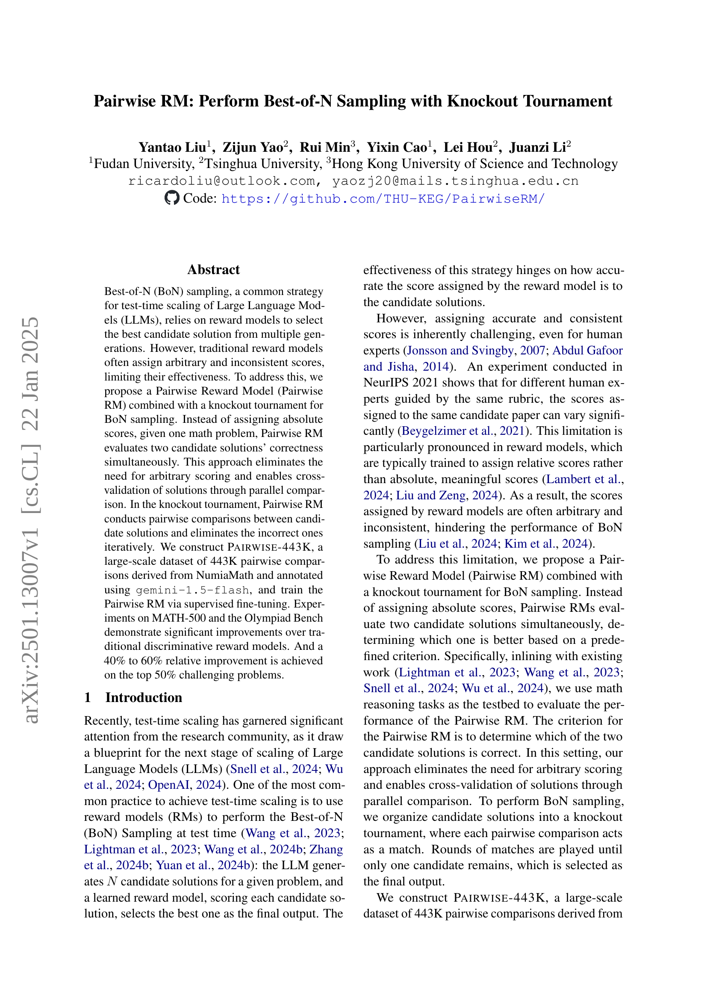
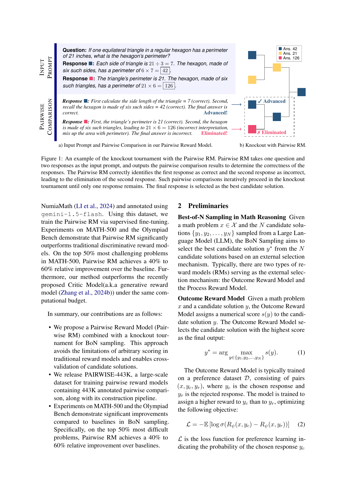
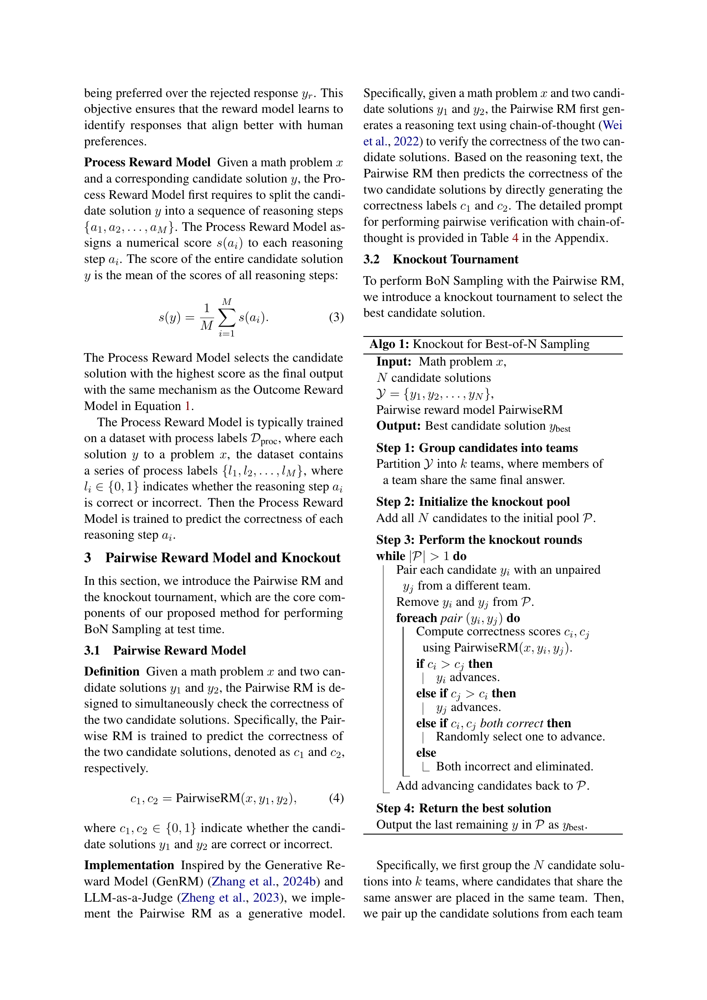
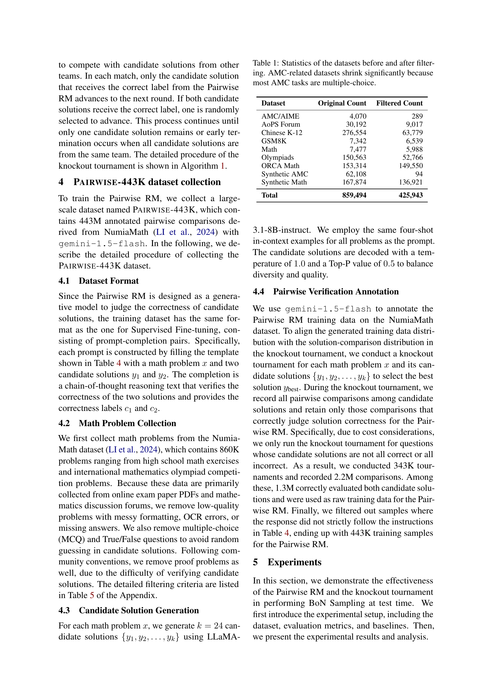
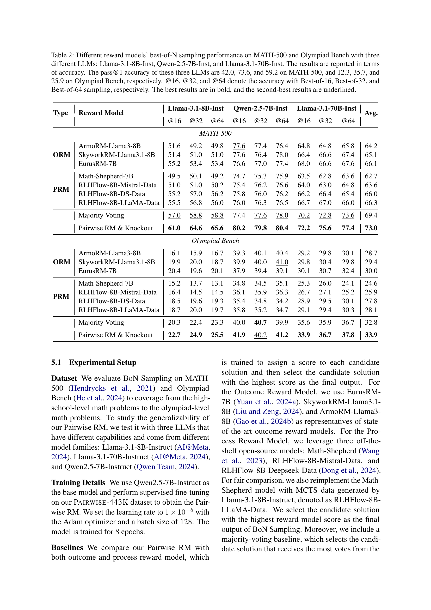
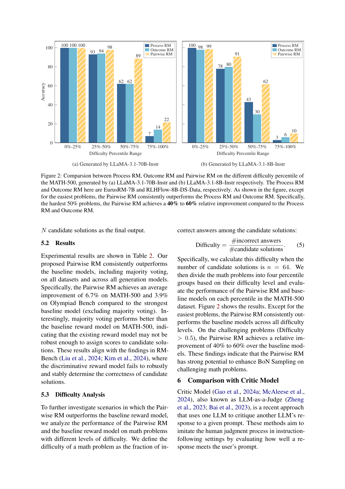
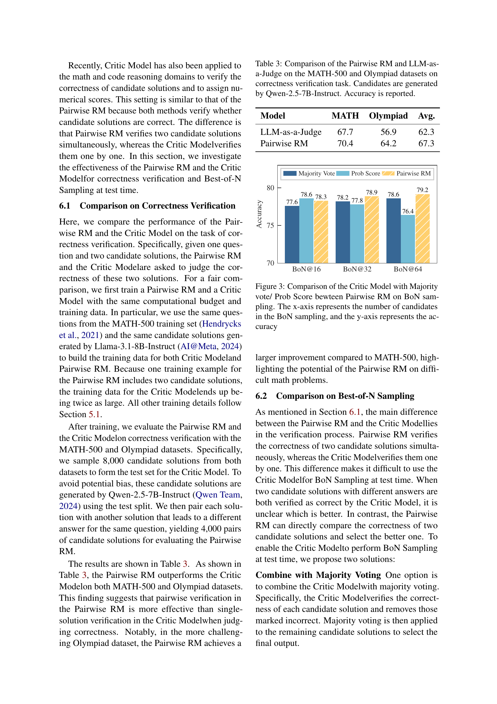
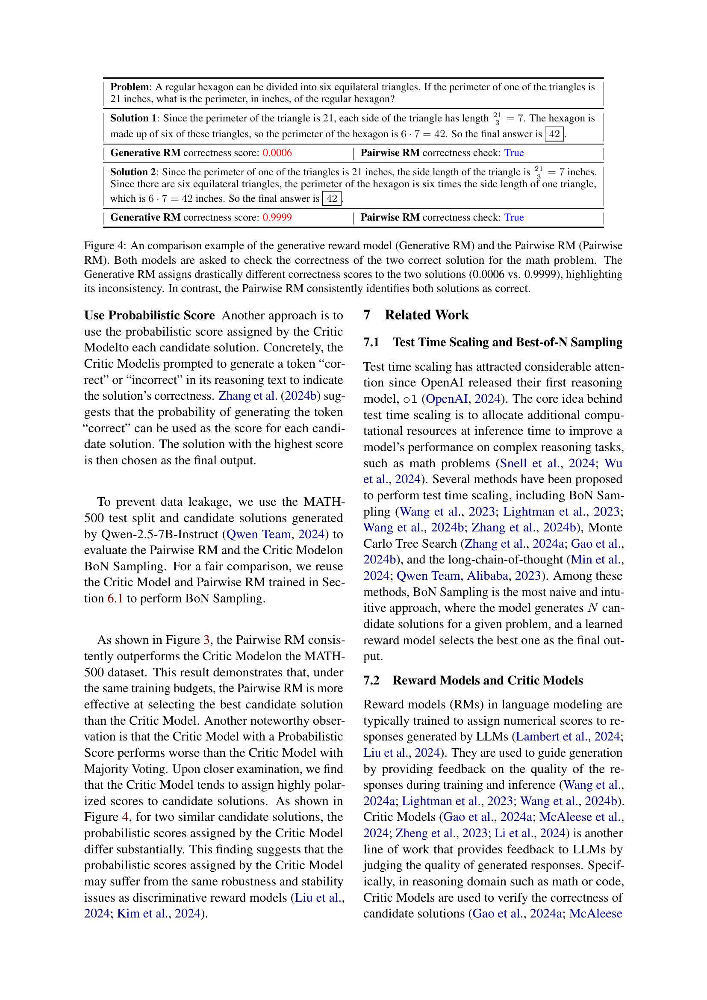
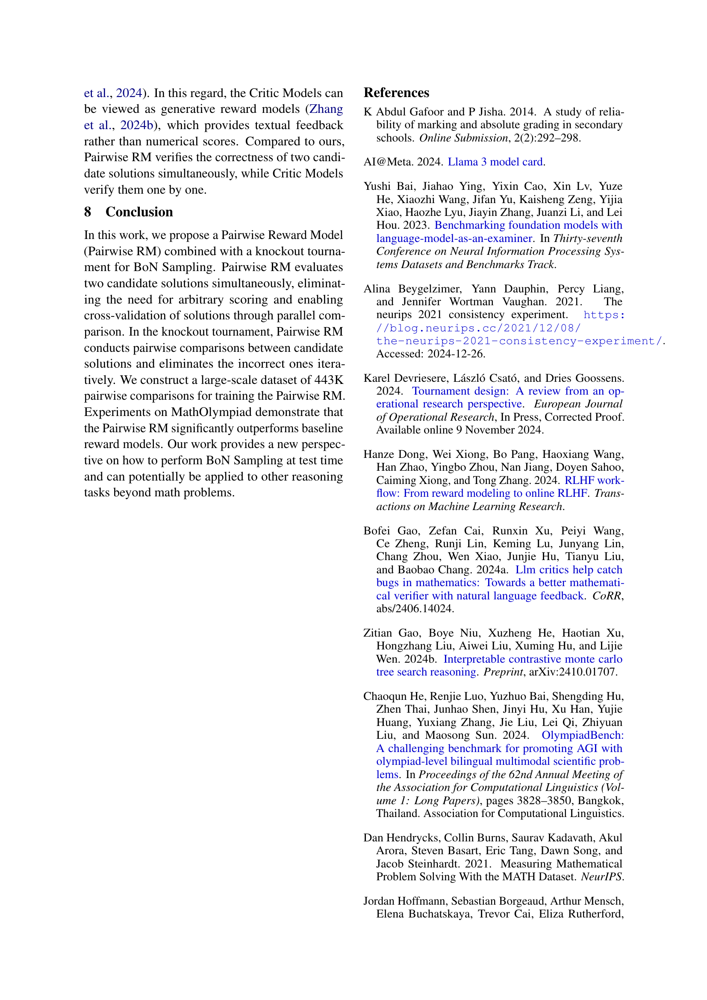
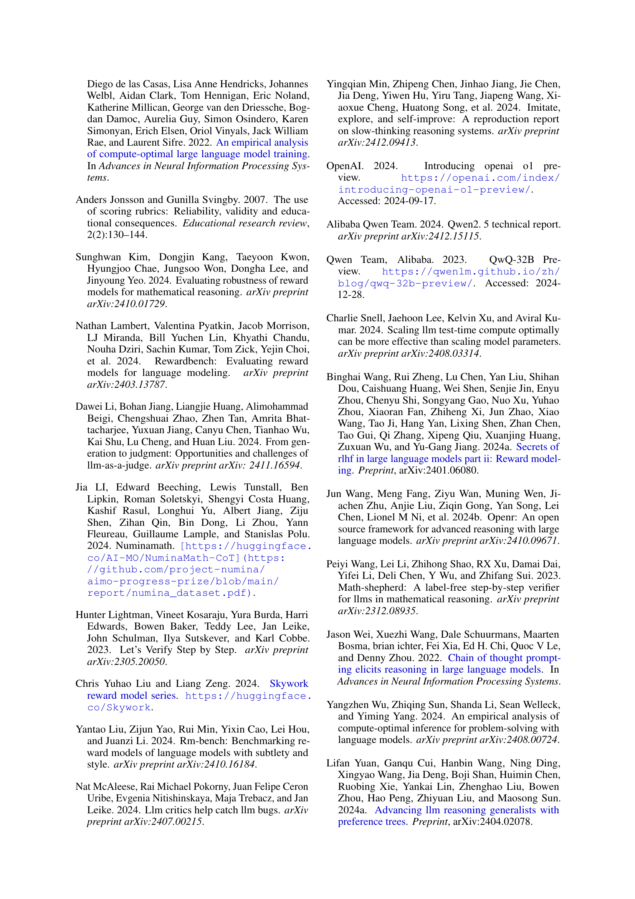
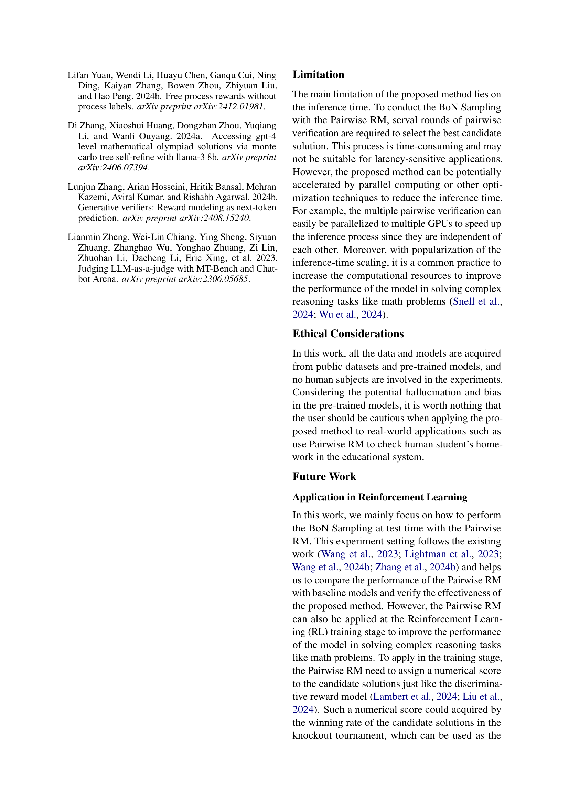
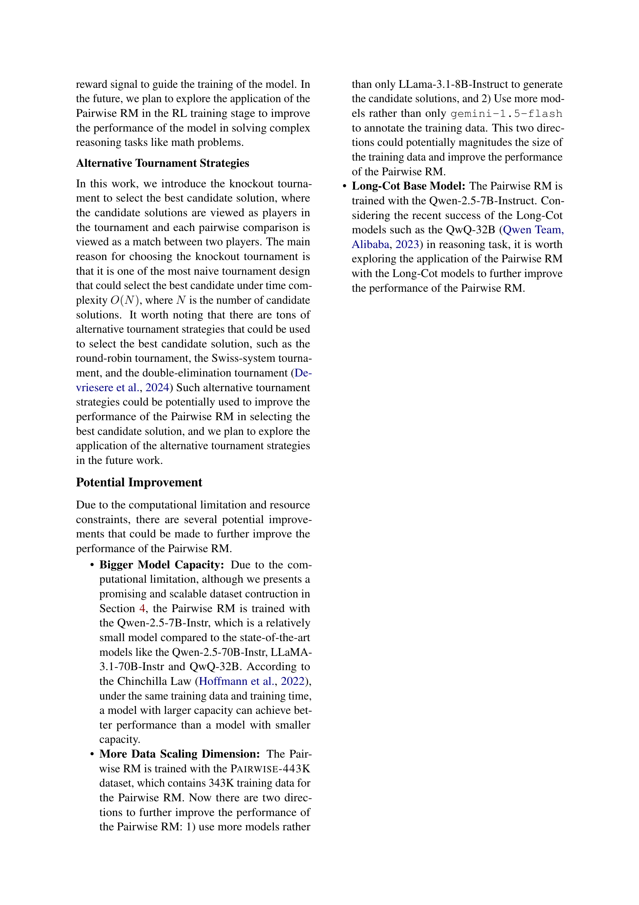
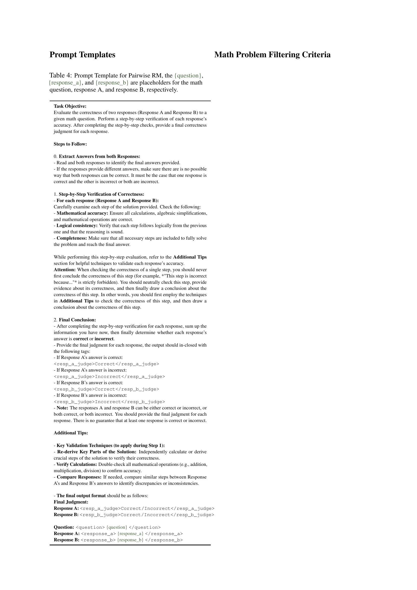
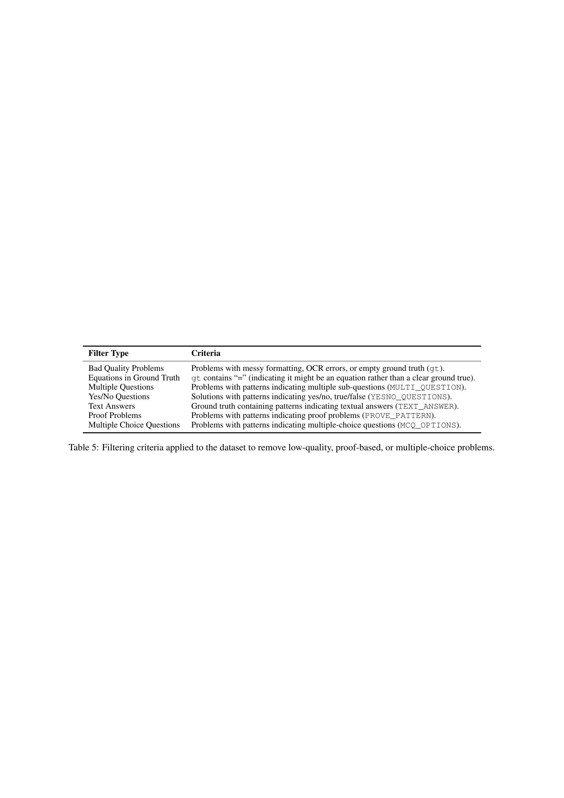
