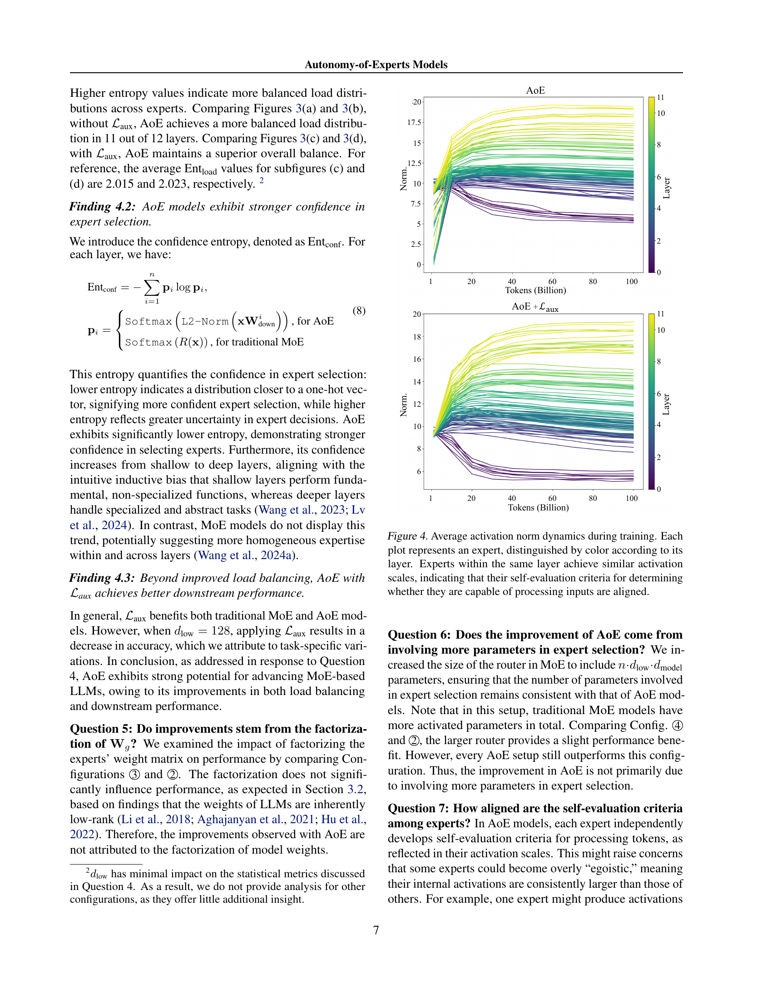

 


 2501.13074 
 Ang Lv et el. 
 
 🤗 2025-01-23 
 



↗ arXiv


↗ Hugging Face


↗ Papers with Code


### TL;DR



기존 MoE(Mixture-of-Experts) 모델은 라우터를 사용하여 토큰을 특정 전문가 모듈에 할당하는데, 이는 라우터의 의사결정과 전문가 모듈의 실행 간의 분리가 비효율적인 전문가 선택 및 비효과적인 학습으로 이어지는 문제점을 가지고 있습니다.  본 논문에서는 이러한 문제를 해결하기 위해, 전문가 모듈이 스스로 입력 토큰을 처리할지 여부를 결정하는 새로운 MoE 패러다임인 AoE(Autonomy-of-Experts)를 제안합니다.

AoE는 전문가 모듈의 내부 활성화 규모를 기반으로 전문가를 순위화하고, 상위 순위의 전문가만 토큰을 처리하도록 설계되었습니다.  라우터를 제거함으로써 전문가 선택 과정을 효율화하고, 저차원 가중치 분해를 통해 전처리 과정에서 발생하는 오버헤드를 줄였습니다.  실험 결과, AoE는 기존 MoE 모델과 비교하여 효율성과 성능 모두에서 우수한 결과를 보였으며, 7억~40억 파라미터의 언어 모델을 사전 학습하여 그 효과를 검증하였습니다.



#### Key Takeaways


 AoE는 라우터 없이 전문가 모듈이 스스로 입력 토큰 처리 여부를 결정하는 새로운 MoE 모델임. 



 전문가 모듈의 내부 활성화 규모를 기반으로 자기 평가를 통해 전문가 선택을 개선함. 



 기존 MoE 모델보다 효율성과 성능이 우수하며, 대규모 언어 모델 개발에 중요한 발견임. 


#### Why does it matter?
본 논문은 **MoE(Mixture-of-Experts) 모델의 주요한 한계점인 라우터(router)의 의사결정과 전문가 모듈(expert module)의 실행 간의 분리 문제**를 해결하기 위해 **AoE(Autonomy-of-Experts)라는 새로운 패러다임**을 제시합니다. 이는 기존의 MoE 모델보다 효율적이고 성능이 뛰어난 언어 모델을 개발하는 데 중요한 발견입니다. 또한, **전문가 모듈의 자기 평가 및 비교를 통해 전문가 선택을 개선**하고, **모델 학습의 효율성을 높이는 새로운 방법론**을 제시하여 MoE 연구 분야에 큰 영향을 미칠 것으로 예상됩니다. 특히, **AoE는 대규모 언어 모델의 효율성과 성능을 동시에 개선**할 수 있는 잠재력을 가지고 있어, 향후 대규모 언어 모델 연구에 중요한 방향을 제시할 수 있습니다.

------
#### Visual Insights


| Node for Norm Calculation | MMLU (5-shot) | ARC-C (5-shot) |
|---|---|---|
| Mixtral 8×7B | Phi-3.5-MoE-ins. | Phi-3.5-MoE-ins. |
| **x**Wg | 64.23 (42.70) | 50.43 (4.40) |
| **x**Wp | 62.06 (42.73) | 53.41 (4.40) |
| SiLU(**x**Wg) | 61.71 (43.88) | 58.79 (4.51) |
| SiLU(**x**Wg)⊙**x**Wp | 66.64 (75.53) | 58.79 (6.27) |
| Experts’ Final Outputs | 66.66 (76.15) | 58.62 (7.42) |
| Performance w. Router | 70.35 (24.30) | 62.12 (2.50) |
|  | 29.43 (33.05) | 28.84 (3.47) |
|  | 34.60 (33.05) | 40.36 (3.47) |
|  | 38.03 (34.32) | 47.53 (3.60) |
|  | 27.89 (52.60) | 35.32 (5.42) |
|  | 29.69 (69.20) | 36.35 (7.07) |
|  | 78.20 (14.53) | 67.41 (1.60) |

> 🔼 이 표는 사전 훈련된 MoE(Mixture-of-Experts) 언어 모델에서 라우터를 제거하고, 계산 그래프 내 특정 노드의 내부 활성화 규범을 기반으로 추론 중 전문가를 선택하는 실험 결과를 보여줍니다.  두 가지 어려운 과제에 대한 정확도와 8개의 A800-80G GPU를 사용했을 때의 시간 비용(분)을 보고합니다. 괄호 안에 시간 비용이 표시되어 있습니다.  파라미터 업데이트 없이도 특정 노드에서는 정확도를 상당 부분 유지할 수 있지만, 이러한 기본적인 접근 방식은 효율성을 크게 개선해야 합니다.
> 

> 
read the caption

> Table 1:  We remove routers from pre-trained MoE-LLMs and select experts during inference based on the internal activation norms of specific nodes in the computational graph. The accuracy on two challenging tasks is reported, along with the time cost (in minutes) for 8×A800-80G GPUs, which is given in parentheses. Without parameter updates, we can largely preserve accuracy under certain nodes, but this rudimentary approach requires significant improvements in efficiency.
> 

### In-depth insights

#### AoE Model Intro
본 논문에서 제안하는 AoE(Autonomy-of-Experts) 모델은 기존 MoE(Mixture-of-Experts) 모델의 한계를 극복하기 위해 **전문가 모듈(expert module) 스스로 입력 토큰을 처리할지 여부를 결정**하도록 설계되었습니다. 기존 MoE는 라우터(router)가 토큰을 특정 전문가에게 할당하는 구조였지만, 이는 전문가의 실제 처리 능력을 고려하지 못하고 비효율적인 학습을 초래하는 문제점이 있었습니다. 반면 AoE는 **각 전문가의 내부 활성화 값(internal activation)을 활용**하여,  자체적으로 처리 능력을 평가하고 상위 순위 전문가만 토큰 처리에 참여하도록 합니다. 이를 통해 **전문가 선택의 효율성을 높이고 불필요한 계산을 줄여 효율적인 학습**을 가능하게 합니다.  **저차원 가중치 분해(low-rank weight factorization)** 기법을 통해 오버헤드를 줄이는 동시에 학습 효과를 높이는 것이 특징입니다.  **전문가의 자율성**을 통해 라우터를 제거하고, 전문가의 실제 능력에 기반한 동적인 전문가 선택을 가능하게 함으로써 기존 MoE 모델보다 우수한 성능을 보이는 것이 AoE 모델의 핵심적인 강점입니다.

#### AoE Mechanism
본 논문에서 제안하는 AoE(Autonomy-of-Experts) 메커니즘은 기존 MoE(Mixture-of-Experts) 모델의 한계를 극복하기 위해 **전문가 모듈(expert module)의 자율성**에 초점을 맞춥니다. 기존 MoE는 라우터(router)가 입력 토큰을 특정 전문가에게 할당하는 방식이었지만, AoE는 각 전문가가 자신이 처리할 수 있는 능력을 스스로 평가하여 입력 토큰을 처리할지 여부를 결정합니다. 이는 전문가의 내부 활성화(internal activation) 규모를 기반으로 하며, 활성화 규모가 클수록 해당 전문가의 처리 능력이 높다고 판단합니다. 따라서 라우터가 필요 없어지고, 연산 효율성이 향상됩니다. **전문가의 자체 평가 및 선택 과정**은 학습 과정에서 전문가의 특화(specialization)를 유도하며, 전반적인 모델 성능 향상에 기여합니다.  **저차원 벡터(low-dimensional vector)를 통한 활성화 캐싱**은 연산 오버헤드를 줄이는 효율적인 전략입니다. AoE는 전문가 선택의 정확성과 효율성을 개선하여 기존 MoE 모델보다 우수한 성능을 보이며, 특히 대규모 언어 모델에서 효과적입니다.

#### AoE Experiments
본 논문의 "AoE 실험" 부분은 **AoE 모델의 성능과 효율성을 다양한 측면에서 평가**하기 위한 실험 설계 및 결과 분석을 제시합니다.  소규모 언어 모델부터 대규모 언어 모델까지 다양한 규모의 모델을 사용하여 **AoE의 일반화 가능성과 확장성을 검증**하고, 기존 MoE 모델과의 비교 분석을 통해 **AoE의 우수성을 입증**합니다. 특히, **다양한 하이퍼파라미터 조합**과 **전략 비교**를 통해 최적의 AoE 모델 구성을 찾고, **계산 효율성 및 메모리 사용량**에 대한 분석을 추가하여 실질적인 적용 가능성을 높입니다. 또한, **전문가 선택 전략의 효율성**과 **부하 균형**에 대한 심도있는 분석을 통해 AoE 모델의 작동 원리를 명확히 하고, 향후 연구 방향을 제시합니다. **실험 결과는 AoE가 기존 MoE 모델보다 우수한 성능과 효율성을 제공**함을 보여주는 동시에, **AoE의 확장성과 적용 가능성을 확인**하는 데 중요한 역할을 합니다.

#### AoE Efficiency
본 논문에서 제시된 자율 전문가 모델(AoE)의 효율성은 기존의 혼합 전문가 모델(MoE)에 비해 **전문가 선택 및 학습의 개선**으로 인해 향상됩니다.  AoE는 라우터를 제거하고, 각 전문가가 자신의 활성화 규모를 기반으로 스스로 입력을 처리할지 여부를 결정하게 함으로써 **전문가 선택의 효율성**을 높입니다. 저차원 벡터로의 입력 압축을 통한 활성화 캐싱 오버헤드 감소는 **계산 효율성**을 향상시키는 중요한 요소입니다.  **40억 개 매개변수**의 언어 모델 사전 학습 결과, AoE는 MoE 모델보다 우수한 성능을 보였으며, 이는 **전문가 특수화 및 효과적인 학습**에 기인합니다.  **메모리 사용량**은 증가하지만, 처리량은 MoE의 97%에 달해 **전반적인 효율성 개선**을 보여줍니다.  다만,  `dlow` 하이퍼파라미터 값에 따른 메모리 사용량과 처리량 간의 상충 관계가 존재하여 **최적화된 하이퍼파라미터 탐색**이 중요함을 시사합니다.

#### Future of AoE
AoE(Autonomy-of-Experts) 모델의 미래는 **모델의 효율성과 성능을 크게 향상시킬 수 있는 잠재력**을 가지고 있습니다.  **전문가 모듈의 자율적인 선택**은 기존 MoE 모델의 한계점인 라우터 의존성을 극복하고, 보다 효과적인 전문가 활용 및 학습을 가능하게 합니다.  하지만, AoE의 성공적인 발전을 위해서는 **저차원 활성화 벡터 표현의 효율성을 더욱 높이고, 다양한 크기와 구조의 언어 모델에 대한 적용성을 확보**해야 합니다. 또한, **AoE의 전문가 선택 과정의 안정성과 신뢰성을 높이기 위한 추가적인 연구**가 필요하며,  **다른 전문가 선택 전략과의 결합 및 다양한 하류 작업에 대한 성능 비교 분석**을 통해 AoE의 우수성을 입증하는 것이 중요합니다.  궁극적으로, AoE는 더욱 효율적이고 강력한 대규모 언어 모델의 개발에 기여할 것으로 기대됩니다. 특히, **자원 제약이 심한 환경에서도 효과적인 모델을 구축**할 수 있다는 점에서 그 중요성이 더욱 부각됩니다.

### More visual insights

More on tables


| Configuration | ARC-E | PIQA | SIQA | WINO | HELLA | MNLI | QNLI | SST2 | AVG. |
|---|---|---|---|---|---|---|---|---|---|---| 
| 1 Traditional MoE | 39.90 | 58.43 | 35.67 | 52.09 | 27.98 | 33.09 | 49.28 | 49.66 | 43.28 |
| 2 +  ℒaux | 40.74 | 58.49 | 36.13 | 51.30 | 28.11 | 32.67 | 50.23 | 51.83 | 43.68 |
| 3 +  ℒaux + Factorized 𝐖g | 40.45 | 58.65 | 36.75 | 52.09 | 28.03 | 32.55 | 50.08 | 51.03 | 43.70 |
| 4 +  ℒaux + Large Router | 41.41 | 57.62 | 36.64 | 52.33 | 28.34 | 33.18 | 49.53 | 50.69 | 43.71 |
| 5 AoE (dlow=64) | 39.77 | 58.71 | 35.31 | 52.33 | 28.29 | 32.78 | 50.27 | 52.98 | 43.81 |
| 6 +  ℒaux | 42.17 | 57.67 | 36.75 | 50.75 | 28.15 | 34.06 | 50.49 | 53.10 | 44.12 |
| 7 AoE (dlow=128) | 40.70 | 59.41 | 36.64 | 52.09 | 28.06 | 34.38 | 50.69 | 53.21 | 44.39 |
| 8 +  ℒaux | 41.33 | 58.65 | 36.80 | 50.75 | 28.40 | 33.71 | 49.55 | 53.10 | 44.04 |
| 9 AoE (dlow=256) | 41.08 | 58.81 | 36.44 | 51.70 | 28.23 | 32.24 | 50.54 | 53.90 | 44.12 |
| 10 +  ℒaux | 41.16 | 58.32 | 36.80 | 53.04 | 28.37 | 32.78 | 50.61 | 54.59 | 44.46 |
| 11 AoE (dlow=512) | 40.57 | 57.89 | 36.75 | 50.59 | 28.38 | 32.71 | 49.72 | 53.56 | 43.77 |
| 12 +  ℒaux | 41.16 | 57.83 | 36.75 | 52.09 | 28.30 | 34.92 | 50.67 | 50.92 | 44.08 |
> 🔼 표 2는 732M 파라미터 언어 모델(활성 파라미터 247M)을 사용한 실험 결과를 보여줍니다. 각 모델은 1000억 토큰으로 학습되었으며, 색상으로 강조된 결과는 가장 일반적인 MoE 설정인 구성 2보다 우수한 성능을 보여줍니다. 굵은 텍스트는 해당 구성이 평균 성능 측면에서 기존 MoE 변형보다 우수함을 나타냅니다.  표에는 다양한 모델 구성(전통적인 MoE, Load Balancing Loss 추가,  Weight Factorization 추가, Router 크기 변경, 그리고 AoE 모델의 다양한 dlow 값)에 대한 다양한 하류 작업(ARC-E, PIQA, SIQA, WINO, HELLA, MNLI, QNLI, SST2)의 성능이 포함되어 있습니다.  각 구성에 대한 평균 성능을 비교하여 AoE의 효율성과 성능을 평가할 수 있습니다.
> 

> 
read the caption

> Table 2:  Ablations were performed on 732M-parameter language models (with 247M active parameters). Each model was trained on 100 billion tokens. The results, highlighted in color, emphasize superior performance compared to configuration  2, the most common MoE setup. Bold text indicates that the configuration outperforms the best traditional MoE variant in terms of average performance.
> 


| Strategy | Model | ARC-E | PIQA | SIQA | WINO | HELLA | MNLI | QNLI | SST2 | AVG. |
|---|---|---|---|---|---|---|---|---|---|---|
| Top-P | Traditional MoE | 41.08 | 57.96 | 37.46 | 50.36 | 28.25 | 32.79 | 50.39 | 52.64 | 43.87 |
| [Huang et al., 2024] | AoE | 41.04 | 58.65 | 36.39 | 51.07 | 28.35 | 32.96 | 51.46 | 54.36 | **44.29** |
| Expert-Choice | Traditional MoE | 40.91 | 59.09 | 37.26 | 50.75 | 28.09 | 32.11 | 50.12 | 52.75 | 43.89 |
| [Zhou et al., 2022] | AoE | 41.58 | 58.22 | 37.21 | 53.04 | 28.44 | 33.83 | 50.54 | 50.46 | **44.17** |
> 🔼 표 3은 서로 다른 전문가 선택 전략을 사용하여 훈련된 기존 MoE 모델과 AoE 모델을 비교한 결과를 보여줍니다. Top-P 전략의 경우 활성화된 매개변수의 수는 입력에 따라 다르지만 두 모델 간에 거의 동일하며, 전문가 선택 전략의 경우 732M 매개변수 중 247개만 활성화됩니다.  이 표는 다양한 전문가 선택 방법(Top-P, 전문가 선택)에 따른 MoE와 AoE 모델의 성능을 비교 분석하여, 각 전략의 효율성과 적합성을 보여줍니다.  다양한 하류 작업(ARC-E, PIQA, SIQA, WINO, HELLA, MNLI, QNLI, SST2)에 대한 성능 지표를 제시하여, 어떤 전문가 선택 전략이 특정 작업에 더 적합한지, 그리고 AoE 모델이 기존 MoE 모델에 비해 어떤 강점을 보이는지 자세히 비교 분석합니다.
> 

> 
read the caption

> Table 3:  Comparison of traditional MoE and AoE models trained using alternative expert-selection strategies. For the Top‑P𝑃Pitalic_P strategy, the number of activated parameters is input-dependent but nearly the same between the two models, whereas the expert-choice strategy activates 247 out of 732M parameters.
> 


| Model | ARC-E | PIQA | SIQA | WINO | HELLA | MNLI | QNLI | SST2 | AVG. |
|---|---|---|---|---|---|---|---|---|---| 
| Traditional MoE | 53.70 | 65.40 | 39.10 | 51.54 | 35.80 | 32.19 | 49.77 | 57.00 | 48.06 |
| AoE | 55.98 | 65.61 | 39.87 | 52.57 | 36.77 | 35.39 | 50.05 | 61.93 | **49.80** |
> 🔼 표 4는 40억 개의 파라미터를 가진 대규모 언어 모델(활성 파라미터 11억 8천만 개)에서, 자율 전문가 모델(AoE)이 기존의 혼합 전문가 모델(MoE)보다 우수한 성능을 보임을 보여줍니다.  다양한 하류 작업(ARC-E, PIQA, SIQA, WINO, HELLA, MNLI, QNLI, SST2)에 대한 정확도를 비교하여 AoE의 성능 향상을 명확히 제시합니다.  활성 파라미터 수가 제한적인 상황에서도, AoE가 MoE보다 뛰어난 성능을 달성함을 보여주는 중요한 결과표입니다.
> 

> 
read the caption

> Table 4: For 4B-parameter LLMs (with 1.18B active parameters), AoE exhibits better downstream performance than MoE models.
> 


| Configuration | TP. (K/s) / Mem. (GB) |
|---|---| 
| Traditional MoE | 51.42 / 50.61 |
| AoE ($d_{low}=64$) | 49.79 / 59.39 |
| AoE ($d_{low}=128$) | 49.42 / 57.86 |
| AoE ($d_{low}=256$) | 47.98 / 57.32 |
| AoE ($d_{low}=512$) | 46.07 / 55.90 |
> 🔼 표 5는 다양한 설정에서의 처리량과 메모리 사용량을 비교한 표입니다. 보조 손실 함수는 효율성에 영향을 미치지 않습니다. 이 표는 다양한 dlow 값을 가진 AoE 모델과 기존 MoE 모델의 처리량(초당 토큰 수)과 메모리 사용량(GB)을 비교하여 AoE 모델의 효율성을 평가합니다.
> 

> 
read the caption

> Table 5: Throughput and memory usage comparison among several configurations. Auxiliary losses do not impact efficiency.
> 


| Node for Norm Calculation | MMLU (5-shot) | ARC-C (5-shot) |
|---|---|---|
| Mixtral 8×7B | Phi-3.5-MoE-ins. | Phi-3.5-MoE-ins. |
| **x**Wg | 51.14 | 41.98 |
| **x**Wp | 39.79 | 40.19 |
| SiLU(**x**Wg) | 47.29 | 45.73 |
| SiLU(**x**Wg)⊙**x**Wp | 54.37 | 50.09 |
| Experts’ Final Outputs | 57.84 | 52.73 |
| Performance w. Router | 70.35 | 62.12 |
> 🔼 이 표는 사전 훈련된 MoE(Mixture-of-Experts) 언어 모델에서 내부 활성화의 L1 노름을 사용하여 전문가를 선택하는 예비 연구 결과를 보여줍니다.  표에는 다양한 노드에서 계산된 L1 노름을 기반으로 한 MMLU(Massive Multitask Language Understanding)와 ARC-C(AI2 Reasoning Challenge) 작업에 대한 정확도가 Mixtral 8x7B와 Phi-3.5-MoE-ins 모델에 대해 제시되어 있습니다. 라우터를 사용한 성능과 비교하여, L1 노름 기반 전문가 선택의 효율성 및 정확도를 평가하는 데 도움이 됩니다.
> 

> 
read the caption

> Table 6: Preliminary study results on pre-trained MoE-LLMs, selecting experts by L1superscript𝐿1L^{1}italic_L start_POSTSUPERSCRIPT 1 end_POSTSUPERSCRIPT norm of internal activation.
> 


| Node for Norm Calculation | MMLU (5-shot) |  | ARC-C (5-shot) |  | 
|---|---|---|---|---|---| 
| Mixtral 8×7B | Phi-3.5-MoE-ins. | 48.16 | 29.28 | 43.77  | 35.92 | 
|  |  | 50.43 | 34.78 | 49.49 | 40.02 | 
| 𝐱𝐖g |  | 54.30 | 36.38 | 47.95 | 50.85 | 
| 𝐱𝐖p |  | 50.72 | 26.43 | 46.08 | 33.02  | 
| SiLU(𝐱𝐖g) |  | 51.03 | 23.64 | 53.16 | 30.12 | 
| SiLU(𝐱𝐖g)⊙𝐱𝐖p |  | 70.35 | 78.20 | 62.12 | 67.41 | 
| Experts’ Final Outputs |  |  |  |  |  | 
| Performance w. Router |  |  |  |  |  | 
> 🔼 본 논문의 표 7은 사전 훈련된 MoE(Mixture-of-Experts) 언어 모델에서 내부 활성화의 L∞ 노름을 기반으로 전문가를 선택하는 예비 연구 결과를 보여줍니다. 표는  MMLU(Massive Multitask Language Understanding)와 ARC-C(AI2 Reasoning Challenge) 두 가지 과제에 대한 정확도를 다양한 노드에서 계산된 L∞ 노름을 사용하여 비교 분석합니다.  각 노드별 결과와 라우터를 사용한 성능을 비교하여 L∞ 노름 기반 전문가 선택 전략의 효율성을 평가합니다.
> 

> 
read the caption

> Table 7: Preliminary study results on pre-trained MoE-LLMs, selecting experts by L∞superscript𝐿L^{\infty}italic_L start_POSTSUPERSCRIPT ∞ end_POSTSUPERSCRIPT norm of internal activation.
> 

### Full paper



