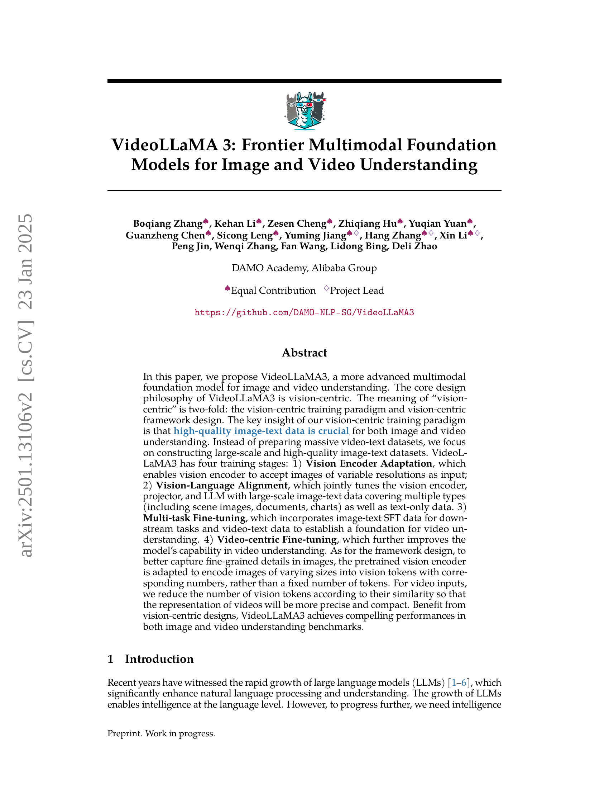
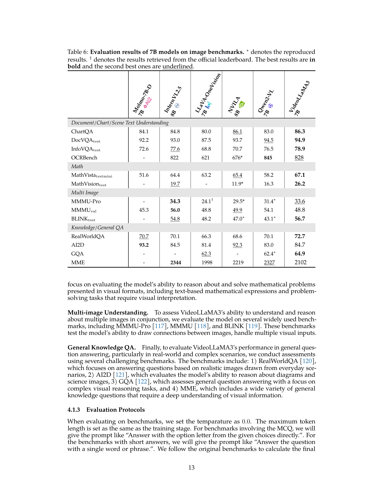

 


 2501.13106 
 Boqiang Zhang et el. 
 
 🤗 2025-01-23 
 



↗ arXiv


↗ Hugging Face


↗ Papers with Code


### TL;DR



최근 대규모 언어 모델(LLM)의 발전으로 멀티모달 학습이 주목받고 있지만, **고품질의 비디오-텍스트 데이터 확보의 어려움**과 **비디오 데이터의 복잡성**으로 인해 영상 이해 분야의 발전은 더뎠습니다.  기존의 멀티모달 LLM은 비디오 데이터의 시간적 복잡성을 처리하는 데 어려움을 겪었고, 비디오-텍스트 데이터의 낮은 품질로 인해 성능 향상에 제약이 있었습니다. 특히, 기존 모델들은 고정된 크기의 이미지나 비디오만 처리할 수 있어 다양한 해상도의 데이터를 효과적으로 활용하지 못했습니다. 

본 논문에서는 이러한 문제를 해결하기 위해 **비전 중심적 접근 방식**을 채택한 VideoLLaMA3 모델을 제안합니다. 이 모델은 **대규모 고품질 이미지-텍스트 데이터셋**을 구축하고, **변화하는 해상도의 이미지 및 비디오**를 효과적으로 처리하는 기술을 개발하여 기존의 한계를 극복했습니다. 또한, VideoLLaMA3는 다양한 하위 작업(예: 이미지 텍스트 질문 답변, 비디오 캡션 생성)에 대한 **멀티 태스크 미세 조정**을 통해 이미지와 비디오 이해 능력을 향상시켰습니다.  실험 결과, VideoLLaMA3는 다양한 벤치마크에서 **최첨단 성능**을 달성했습니다.



#### Key Takeaways


 비전 중심적 훈련 패러다임 ë° 프레임워크 설계를 통해 이미지와 비디오 이해 성능 향상 



 다양한 해상도의 이미지 ë° 비디오를 효율적으로 처리하는 Any-resolution Vision Tokenization (AVT) ë° Differential Frame Pruner (DiffFP) 기술 제안 



 이미지 ë° 비디오 이해 벤치마크에서 최첨단 성능 달성 


#### Why does it matter?
본 논문은 **영상 이해 분야의 획기적인 발전**을 제시하며, 고품질 이미지-텍스트 데이터를 활용한 비전 중심적 접근 방식을 통해 이미지와 비디오 이해 성능을 크게 향상시켰습니다. 이는 **다양한 멀티모달 작업의 벤치마크에서 최첨단 성능**을 달성하여, 관련 연구 분야에 큰 영향을 미칠 것으로 예상됩니다. 특히, **비디오 이해에 대한 새로운 접근 방식**을 제시하고, 고해상도 이미지 및 비디오 처리를 위한 효율적인 프레임워크를 제안함으로써, 향후 **실시간 비디오 처리 및 분석 기술** 발전에 기여할 것으로 기대됩니다.

------
#### Visual Insights

> 🔼 그림 1은 VideoLLaMA3의 성능을 이전의 고급 이미지/비디오 다중 모드 언어 모델(MLLM)과 다양한 대표적인 벤치마크에서 비교한 결과를 보여줍니다. VideoLLaMA3는 다양한 벤치마크에서 경쟁력 있는 결과를 달성했습니다. 특히 VideoLLaMA3는 VideoMME, PerceptionTest, MLVU와 같은 비디오 이해 능력 뿐만 아니라 DocVQA와 같은 문서 이해 능력과 MathVista와 같은 다중 모드 수학적 추론 능력도 뛰어났습니다. LLaVA-OneVision은 이미지 벤치마크 평가에만 사용되었고, LLaVA-Video는 비디오 벤치마크 평가에만 사용되었다는 점에 유의해야 합니다.
> 

> 
read the caption

> Figure 1: Performance Comparison of VideoLLaMA3 with the previous advanced image/video MLLM on various representative benchmarks. As shown in the figure, VideoLLaMA3 has achieved very competitive results on various benchmarks. Specifically, VideoLLaMA3 not only demonstrates strong video understanding capabilities (VideoMME, PerceptionTest, MLVU) but also maintains excellent document comprehension abilities (DocVQA) and multimodal mathematical reasoning skills (MathVista). Note that LLaVA-OneVision is only used for evaluating image benchmarks, while LLaVA-Video is only used for evaluating video benchmarks.
> 


| Task | Dataset | Amount |
|---|---|---|
| Scene Image | VL3-Syn7M-short, LLaVA-Pretrain-558k [liu2023improvedllava](https://arxiv.org/html/2501.13106/liu2023improvedllava.png), Objects365-Recap [Objects365](https://arxiv.org/html/2501.13106/Objects365.png), SA-1B-Recap [kirillov2023segment](https://arxiv.org/html/2501.13106/kirillov2023segment.png) | 11.84M |
| Scene Text Image | BLIP3-OCR-Recap [Xue2024xGenMMA](https://arxiv.org/html/2501.13106/Xue2024xGenMMA.png) | 0.93M |
| Document | pdfa-eng-wds [pdfa](https://arxiv.org/html/2501.13106/pdfa.png), idl-wds [idlwds](https://arxiv.org/html/2501.13106/idlwds.png) | 2.80M |

> 🔼 표 1은 Vision Encoder Adaptation 단계에서 사용된 데이터의 종류와 양을 보여줍니다.  Scene Image, Scene Text Image, Document 세 가지 유형의 이미지 데이터가 사용되었으며, 각 유형별로 사용된 데이터셋과 데이터 수량이 자세히 명시되어 있습니다. 이 표는 VideoLLaMA3 모델 학습의 첫 번째 단계인 Vision Encoder Adaptation 단계에서 어떤 종류의 데이터를 얼마나 사용했는지 보여줌으로써 모델 학습 과정에 대한 이해를 돕습니다.
> 

> 
read the caption

> Table 1: Data mixture in vision encoder adaptation stage.
> 

### In-depth insights

#### Vision-centric Training
본 논문에서 제시된 비전 중심 학습은 **고품질 이미지-텍스트 데이터가 이미지 및 비디오 이해에 매우 중요**하다는 통찰력에 기반합니다.  대규모 비디오-텍스트 데이터셋을 준비하는 대신 **대규모 고품질 이미지-텍스트 데이터셋 구축**에 집중합니다. 이는 비디오를 이미지 시퀀스로 간주하여 **이미지 이해 능력 향상을 통해 비디오 이해 능력 향상**이 가능하다는 가정에 근거합니다.  이러한 전략은 비디오 데이터보다 수집 및 주석 처리가 용이한 이미지 데이터의 장점을 활용합니다.  **비전 인코더 적응, 비전-언어 정렬, 다중 작업 미세 조정, 비디오 중심 미세 조정** 등 네 단계의 훈련 과정을 통해 모델의 이미지 및 비디오 이해 능력을 향상시킵니다.  각 단계는 특정 목표를 달성하도록 설계되어 있으며, **이미지 이해 능력을 먼저 강화한 후 비디오 이해 능력 향상**에 집중하는 순차적인 학습 방식을 채택합니다. 이러한 비전 중심적 접근 방식은 실험 결과를 통해 효과가 입증되었으며, 이미지 및 비디오 이해 벤치마크에서 최첨단 성능을 달성합니다.

#### Multimodal Adaptation
다모 아카데미에서 발표한 연구는 **비전 중심적 접근 방식**을 강조하며, 영상 이해를 위한 기반 모델로서 VideoLLaMA3를 제시합니다.  이는 단순히 이미지와 비디오 데이터를 결합하는 것이 아니라, **고품질 이미지-텍스트 데이터**를 활용하여 비디오 이해 능력을 향상시키는 전략을 의미합니다.  **이미지 이해 능력 향상을 통해 비디오 이해 능력을 간접적으로 향상**시키는 방식입니다.  즉, 대용량의 비디오-텍스트 데이터를 구축하는 대신, 고품질 이미지-텍스트 데이터를 이용해 비전 인코더를 강화하고, 이를 통해 다양한 해상도의 이미지와 비디오 입력에 대한 적응력을 높입니다.  이는 **다양한 크기의 이미지를 효율적으로 처리**하는 비전 중심적 프레임워크 설계로 이어지며, **비디오 토큰의 압축**을 통해 비디오 처리 효율성을 높입니다.  결론적으로 VideoLLaMA3의 핵심은 **고품질 이미지-텍스트 데이터 기반의 비전 중심적 학습 패러다임과 프레임워크 설계**를 통해 다양한 시각적 데이터에 효과적으로 적응하는 다중 모드 적응 능력을 구축하는 데 있습니다.

#### High-Quality Data
본 논문에서 강조하는 고품질 데이터는 단순히 양이 많은 데이터가 아닌, **정확하고 일관된 주석**이 포함된 데이터를 의미합니다.  이는 모델의 성능을 좌우하는 핵심 요소이며, 특히 다운스트림 작업의 성능 향상에 큰 영향을 미칩니다.  **비전 중심적 접근**을 통해 이미지-텍스트 데이터셋 구축에 집중함으로써 비교적 쉽게 확보하고 품질 관리가 용이한 고품질 데이터를 확보하고자 합니다.  **영상 데이터의 경우, 품질이 낮고 주석 작업이 어려운 점을 고려하여 이미지 이해 능력 향상을 통해 영상 이해 능력을 개선하는 전략**을 사용합니다.  따라서, 고품질 데이터 확보를 위한 노력은 단순히 데이터 양의 증가가 아닌, **데이터의 질적 향상과 효율적인 데이터 활용 전략**에 집중되어야 함을 시사합니다. 이는 궁극적으로 모델의 성능 향상과 다양한 실제 응용 분야에서의 효과적인 활용으로 이어질 것입니다.

#### Future Research
본 논문의 "미래 연구" 부분은 **비디오 데이터의 질과 다양성 개선**, **실시간 추론 최적화**, **다중 모달 확장**, **고급 사후 학습 기법** 등 네 가지 주요 방향으로 미래 연구의 필요성을 제시합니다.  **고품질 비디오-텍스트 데이터셋 구축**을 통해 모델의 시간적 이해와 일반화 능력을 향상시켜야 하며, **실시간 처리를 위한 모델 경량화 및 최적화**가 필수적임을 강조합니다. 또한, **오디오나 음성 데이터와 같은 다른 모달리티 통합**을 통해 보다 포괄적인 다중 모달 이해 능력을 확보하고, **강화 학습 기법 등 고급 사후 학습 기법** 도입으로 모델 성능을 더욱 개선해야 한다는 점을 시사합니다. 이는 단순히 기술적 개선을 넘어서 **실제 응용 환경에서의 요구사항을 반영한 실용적인 연구 방향**을 제시하고, 향후 다중 모달 AI 발전에 대한 중요한 통찰을 제공하는 부분입니다.

#### Model Limitations
이 논문에서 제시된 모델의 한계는 크게 **데이터 품질 및 다양성**, **실시간 처리 성능**, 그리고 **새로운 모달리티 일반화** 세 가지로 나눌 수 있습니다.  **데이터 품질** 측면에서는 고품질 영상-텍스트 데이터셋 확보의 어려움이 지적됩니다. 특히 영상 데이터는 이미지 데이터보다 주석 작업이 어렵고 비용이 많이 들기 때문에 양질의 데이터 확보가 어렵습니다. 또한, **데이터 다양성** 측면에서도 다양한 영상 유형과 장르를 충분히 포함하지 못하여 모델의 일반화 성능에 제한이 있을 수 있습니다. **실시간 처리 성능** 측면에서 고해상도 영상 및 긴 영상 처리 시 계산 비용이 많이 들기 때문에 실시간 처리에 어려움이 있습니다. 따라서 자율 주행이나 실시간 영상 분석 등 실시간 처리가 요구되는 분야에는 적용하기 어려울 수 있습니다. 마지막으로 **새로운 모달리티 일반화** 능력에 있어서, 현재 모델은 이미지와 비디오 모달리티에 집중되어 있고 오디오나 음성 데이터와 같은 다른 모달리티에 대한 일반화 능력은 제한적입니다. 향후 연구에서는 이러한 한계를 극복하기 위한 노력이 필요합니다. 특히 다양하고 고품질의 영상-텍스트 데이터셋 구축, 실시간 처리를 위한 효율적인 알고리즘 개발, 그리고 다양한 모달리티를 통합하는 모델 아키텍처 설계가 중요한 연구 방향이 될 것입니다.

### More visual insights

More on figures

> 🔼 그림 2는 VideoLLaMA3의 훈련 과정을 보여줍니다. VideoLLaMA3의 훈련은 크게 네 단계로 나뉘는데, 각 단계는 특정 목표를 가지고 있습니다. 1단계인 Vision Encoder Adaptation에서는 다양한 해상도의 이미지를 처리할 수 있도록 비전 인코더를 조정합니다. 2단계인 Vision-Language Alignment는 대규모 이미지-텍스트 데이터를 사용하여 비전 인코더와 언어 모델을 동시에 조정하여 시각적 및 언어적 이해 능력을 향상시킵니다. 3단계인 Multi-task Fine-tuning은 다운스트림 작업에 대한 모델의 성능을 향상시키기 위해 추가적인 이미지-텍스트 및 비디오 데이터로 미세 조정하는 단계입니다. 마지막 4단계인 Video-centric Fine-tuning은 비디오 이해 능력을 더욱 향상시키기 위해 비디오 중심의 미세 조정을 수행합니다. 각 단계에서 사용되는 데이터의 종류와 양도 그림에 자세히 표시되어 있습니다.
> 

> 
read the caption

> Figure 2: Training paradigm of VideoLLaMA3. The training of VideoLLaMA3 has four stages: (1) Vision Encoder Adaptation, (2) Vision-Language Alignment, (3) Multi-task Fine-tuning, and (4) Video-centric Fine-tuning.
> 

> 🔼 그림 3은 VideoLLaMA3의 전체 파이프라인을 보여줍니다. 두 가지 핵심 기술이 있습니다. 첫째, 임의 해상도 비전 토큰화(AVT)는 모든 해상도의 이미지나 비디오를 1차원 토큰 시퀀스 집합으로 변환하여 다양한 양의 입력 이미지와 서로 다른 해상도의 비디오를 지원함으로써 보다 유연한 비전 입력을 지원합니다. 둘째, 차별적 프레임 가지치기(DiffFP)는 비디오 압축기 역할을 하며 인접한 프레임 간의 차이가 최소인 비디오 콘텐츠를 제거합니다. 이 방법은 특히 긴 비디오의 경우 비디오 처리 효율성을 높입니다.
> 

> 
read the caption

> Figure 3: The overall pipeline of our VideoLLaMA3. There are two key technical points: ❶ Any-resolution Vision Tokenization (AVT): AVT converts images or videos of any resolution into a set of 1-D token sequences, enabling compatibility with varying amounts of input images and videos of different resolutions, thereby supporting more flexible vision input; ❷ Differential Frame Pruner (DiffFP): Serving as a video compressor, DiffFP eliminates video content with minimal differences between adjacent frames. This approach enhances video processing efficiency, particularly for long-form videos.
> 

> 🔼 그림 4는 VideoLLaMA3 모델의 DiffFP(Differential Frame Pruner) 동작 과정을 보여줍니다. DiffFP는 비디오 토큰을 효율적으로 처리하기 위해 설계되었습니다.  구체적으로, DiffFP는 이전 프레임과의 픽셀 공간에서의 패치 유사도를 기반으로 비디오 토큰을 제거합니다.  즉, 이전 프레임과 매우 유사한 패치(영역)는 중복 정보로 간주되어 제거되고, 이를 통해 비디오의 효율적인 표현을 가능하게 합니다. 그림에서는 프레임 간 차이 계산, 패치 제거 과정이 순차적으로 나타나 있습니다. 이러한 과정을 거쳐 비디오 토큰의 수를 줄임으로써, 특히 긴 비디오의 처리 효율을 높일 수 있습니다.
> 

> 
read the caption

> Figure 4: The calculation flow of our DiffFP. We prune video tokens based on patch similarities in pixel space, removing patches with smaller distances to the previous frame.
> 

> 🔼 그림 5는 서로 다른 데이터 유형에 대한 데이터 형식을 보여줍니다. 이미지 시퀀스의 경우 각 이미지의 토큰을 구분하기 위해 '\n'을 사용하고, 비디오 시퀀스의 경우 각 프레임의 타임스탬프를 나타내기 위해 'Time: xxs'를, 서로 다른 프레임을 구분하기 위해 ','를, 서로 다른 비디오의 토큰을 구분하기 위해 '\n'을 사용합니다. 스트리밍 비디오 시퀀스의 경우 비디오와 텍스트가 섞여서 구성됩니다.  이 그림은 다양한 형태의 시각적 데이터 (이미지, 비디오, 스트리밍 비디오)를 처리하는 모델의 능력을 보여주는 데 중점을 두고 있습니다.  이미지 시퀀스는 여러 이미지의 토큰들을 '\n'으로 구분하여 나타내고, 비디오 시퀀스는 각 프레임의 타임스탬프를 'Time: xxs'로 표시하며 프레임들 간에는 ','로 구분하고, 다른 비디오의 토큰들은 다시 '\n'으로 구분합니다. 마지막으로 스트리밍 비디오 시퀀스는 비디오와 텍스트 토큰이 번갈아 나타납니다.
> 

> 
read the caption

> Figure 5: Data formats for different data types. ❶ For image sequence, we use '\n' to separate image tokens from different image; ❷ For video sequence, we use 'Time: xxs' to indicate timestamps of each frame, ',' to separate different frames, and '\n' to separate tokens from different videos; ❸ For streaming video sequence, videos and texts are organized in an interleaved format.
> 

> 🔼 그림 6은 VideoLLaMA3 모델이 차트 이미지를 이해하는 능력을 보여주는 사례 연구입니다.  두 가지 차트 이미지에 대한 질문과 VideoLLaMA3의 응답이 제시되어 있습니다. 첫 번째 사례는 주식 차트에 대한 분석과 투자 제안을 보여주고, 두 번째 사례는 여러 MLLM 모델의 성능 비교를 보여줍니다. 이를 통해 VideoLLaMA3가 차트 이미지 내의 데이터와 패턴을 정확하게 파악하고 분석하여, 유의미한 통찰력을 제공하는 능력을 시각적으로 보여줍니다.
> 

> 
read the caption

> Figure 6: Case study of chart images understanding.
> 

> 🔼 그림 7은 VideoLLaMA3 모델이 OCR 및 문서 이미지를 처리하는 능력을 보여주는 사례 연구입니다.  첫 번째 예시는 디자인 포스터에 있는 텍스트를 분석하고, 포스터의 개선점을 제안하는 VideoLLaMA3의 능력을 보여줍니다. 두 번째 예시에서는 VideoLLaMA3가 문서 이미지에서 텍스트를 성공적으로 인식하는 능력을 보여줍니다. 이는 VideoLLaMA3가 이미지 내의 밀집된 정보를 이해하는 능력이 뛰어남을 보여주는 것입니다. 이 그림은 VideoLLaMA3의 다양한 이미지 이해 능력을 보여주는 대표적인 예시들을 제시합니다.
> 

> 
read the caption

> Figure 7: Case study of OCR and document images.
> 

> 🔼 이 그림은 다중 이미지 이해에 대한 사례 연구를 보여줍니다. 세 개의 다른 예시가 있는데, 각 예시는 서로 다른 유형의 다중 이미지 이해 작업을 보여줍니다. 첫 번째 예시는 두 종류의 새를 구별하는 능력을 보여주고, 두 번째 예시는 긴 문서에서 답을 찾는 능력을 보여주며, 세 번째 예시는 만화에서 줄거리를 이해하는 능력을 보여줍니다. 이 그림은 VideoLLaMA3 모델이 다양한 유형의 이미지 이해 작업에서 강력한 성능을 보여줌을 시사합니다.
> 

> 
read the caption

> Figure 8: Case study of multi-image understanding.
> 

> 🔼 이 그림은 VideoLLaMA3 모델이 일반적인 지식을 바탕으로 이미지를 이해하는 능력을 보여주는 사례 연구 세 가지를 보여줍니다. 첫 번째 예시는 농구 경기 중 자유투 상황을 설명하고, 두 번째 예시는 모나리자의 역사적 영향과 의미를 논하며, 세 번째 예시는 우주선 안에 강아지 우주비행사가 탑승하여 우주와 지구를 여행하는 영상을 자세하게 묘사하고 있습니다.  이 그림은 VideoLLAMA3 모델의 뛰어난 시각적 이해 능력과 광범위한 지식 기반을 보여줍니다.
> 

> 
read the caption

> Figure 9: Case study of images with general knowledge.
> 

> 🔼 그림 10은 비디오 이해에 대한 사례 연구들을 보여줍니다. 각각의 사례는 비디오에 나타난 객체의 종류와 위치, 키보드에서 사라지는 마지막 키, 비디오의 특이한 점, 비디오의 세부 내용, 그리고 경기의 승자를 질문하고 VideoLLaMA 3 모델이 이에 대한 답변을 제시하는 형태로 구성되어 있습니다. 이를 통해 VideoLLaMA 3 모델이 다양한 유형의 비디오 데이터를 이해하고 처리하는 능력을 보여줍니다.
> 

> 
read the caption

> Figure 10: Case study of video understanding.
> 

> 🔼 그림 11은 VideoLLaMA3 모델의 장기 비디오 이해, 시간적 기반, 그리고 비디오-이미지 결합 이해 능력을 보여주는 사례 연구입니다.  왼쪽 위 그림은 장시간에 걸쳐 다양한 러시아 풍경을 보여주는 비디오의 여러 장면을 캡쳐한 스틸 이미지들을 보여줍니다.  왼쪽 아래 그림은 콜라를 컵에 따르는 동작을 담은 비디오의 프레임들을 연속적으로 보여주고, 특정 시간대(시작 및 종료 시간)를 특정하는 시간적 기반 작업을 수행합니다.  오른쪽 그림은 고양이와 병아리가 서로 껴안고 있는 비디오와 밤거리를 걷는 여성의 사진을 보여주는 데, 비디오와 이미지의 관계를 설명하는 비디오-이미지 결합 이해 능력을 보여줍니다.  전체적으로, 그림은 VideoLLaMA3가 다양한 비디오 이해 작업을 수행할 수 있는 능력을 시각적으로 보여줍니다.
> 

> 
read the caption

> Figure 11: Case study of long video understanding, temporal grounding, and video-image joint understanding.
> 

More on tables


| Task | Dataset | Amount |
|---|---|---|
| **Scene Image** | VL3-Syn7M-detailed, Objects365-Recap [Objects365, ], SA-1B-Recap [kirillov2023segment, ], COCO2017-Recap [lin2014microsoft, ], ShareGPT4o [Chen2024HowFA, ], TextCaps [sidorov2020textcaps, ], ShareGPT4V [chen2023sharegpt4v, ], DenseFusion [li2024densefusion, ], LLaVA-ReCap (LCS-558K) [li2024llavaonevision, ] | 12.56M |
| **Scene Text Image** | Laion-OCR [schuhmann2022laion, ], COCO-Text [veit2016coco, ], TextOCR [singh2021textocr, ], BLIP3-OCR-Recap [Xue2024xGenMMA, ], LSVT [Sun2019ICDAR2C, ], ReCTS [liu2019icdar, ] | 4.69M |
| **Document** | SynthDoG-EN [kim2022ocr, ], SynthDoG-ZH [kim2022ocr, ], UReader-TR [Ye2023UReaderUO, ], FUNSD [funsd, ], DUDE [van2023icdar, ], Vary-600k [wei2023vary, ], pdfa-eng-wds [pdfa, ], idl-wds [idlwds, ] | 2.68M |
| **Chart** | Chart-to-Text [2022Chart, ] | 0.04M |
| **Fine-grained** | Osprey-724K [yuan2024osprey, ], MDVP-Data [lin2024draw, ], ADE20K-Recap [zhou2019semantic, ], Object365 [Objects365, ], Flickr-30K [young2014image, ], GranD [rasheed2024glamm, ] | 1.00M |
| **Text-only** | Evol-Instruct-143K [chen2024allava, ], Infinity-Instruct-code [InfinityInstruct2024, ], Infinity-Instruct-commonsense [InfinityInstruct2024 ], Infinity-Instruct-math [InfinityInstruct2024, ] | 6.25M |
> 🔼 이 표는 논문의 Vision-Language Alignment 단계에서 사용된 데이터 믹스쳐를 보여줍니다.  각 데이터셋의 종류 (Scene Image, Scene Text Image, Document, Chart, Fine-grained, Text-only) 와 해당 데이터셋의 크기 (Amount) 를 보여줍니다.  다양한 유형의 이미지 및 텍스트 데이터를 사용하여 모델의 다중 모드 이해 능력을 향상시키는 데 사용된 데이터셋 구성을 자세히 설명합니다.
> 

> 
read the caption

> Table 2: Data mixture in vision-language alignment stage.
> 


| Task | Dataset | Amount |
|---|---|---|
| **Image & Text Data** |  |  |
| General | LLaVA-SFT-665K [li2024llava], LLaVA-OV-SI [li2024llavaonevision], Cambrian-cleaned [tong2024cambrian], Pixmo (docs, cap, points, cap-qa, ask-model-anything) [molmo2024] | 9.87M |
| Document | DocVQA [mathew2021docvqadatasetvqadocument], Docmatix [laurençon2024building] | 1.31M |
| Chart/Figure | ChartQA [masry2022chartqa], MMC_Instruction [liu2023mmc], DVQA [kafle2018dvqa], LRV_Instruction [liu2023aligning], ChartGemma [masry2024chartgemmavisualinstructiontuningchart], InfoVQA [mathew2022infographicvqa], PlotQA [methani2020plotqa] | 1.00M |
| OCR | MultiUI [liu2024harnessingwebpageuistextrich], in-house data | 0.83M |
| Grounding | RefCoco [kazemzadeh2014referitgame], VCR [zellers2019vcr], in-house data | 0.50M |
| Multi-Image | Demon-Full [li2024fine], Contrastive_Caption [jiang2024mantisinterleavedmultiimageinstruction] | 0.41M |
| Text-only | Magpie [xu2024magpie], Magpie-Pro [xu2024magpie], Synthia [Synthia-70B-v1.2], Infinity-Instruct-subjective [InfinityInstruct2024], NuminaMath [li2024numinamath] | 2.21M |
| **Video Data** |  |  |
| General | LLaVA-Video-178K [zhang2024video], ShareGPT4o-Video [chen2024sharegpt4video], FineVideo [Farré2024FineVideo], CinePile [rawal2024cinepile], ShareGemini-k400 [sharegemini], ShareGemini-WebVID [sharegemini], VCG-Human [Maaz2024VideoGPT+], VCG-Plus [Maaz2024VideoGPT+], VideoLLaMA2 in-house data, Temporal Grounding in-house data | 2.92M |
> 🔼 표 3은 VideoLLaMA3 모델의 다중 작업 미세 조정 단계에서 사용된 데이터 믹스처를 보여줍니다.  이 표는 다양한 하위 작업(일반 이미지 및 텍스트 데이터, 문서, 차트/그림, OCR, 그라운딩, 다중 이미지, 텍스트 전용)에 대한 데이터셋과 각 데이터셋의 양을 자세히 설명합니다.  각 하위 작업은 시각적 이해의 특정 측면을 목표로 하여 모델이 다양한 유형의 시각적 정보를 처리할 수 있도록 합니다.  여기에는 시각적 데이터뿐 아니라 모델의 언어적 이해 능력을 강화하기 위한 상당량의 텍스트 전용 데이터도 포함되어 있습니다.
> 

> 
read the caption

> Table 3: Data mixture in massive multi-task fine-tuning stage.
> 


| Task | Dataset | Amount |
|---|---|---|
| General Video | LLaVA-Video-178K [zhang2024video], ShareGPT4o-Video [chen2024sharegpt4video], FineVideo [Farré2024FineVideo], CinePile [rawal2024cinepile], ShareGemini-k400 [sharegemini], ShareGemini-WebVID [sharegemini], VCG-Human [Maaz2024VideoGPT+], VCG-Plus [Maaz2024VideoGPT+], VideoRefer [yuan2024videorefer], VideoLLaMA2 in-house data, In-house synthetic data | 3.03M |
| Streaming Video | ActivityNet [krishna2017dense], YouCook2 [zhou2018towards], Ego4D-narration [grauman2022ego4d], Ego4D-livechat [chen2024videollm] | 36.2K |
| Temporal Grounding | ActivityNet [krishna2017dense], YouCook2 [zhou2018towards], ViTT [huang2020multimodal], QuerYD [oncescu2021queryd], HiREST [zala2023hierarchical], Charades-STA [gao2017tall], Moment-10M [qian2024momentor], COIN [tang2019coin] | 0.21M |
| Image-only | LLaVA-SFT-665K [li2024llava], LLaVA-OV-SI [li2024llavaonevision] | 0.88M |
| Text-only | Magpie [xu2024magpie], Tulu 3 [lambert2024tulu3] | 1.56M |
> 🔼 표 4는 VideoLLaMA3의 비디오 중심 미세 조정 단계에서 사용된 데이터 믹스를 보여줍니다.  이 표는 다양한 유형의 비디오 데이터 (일반 비디오, 스트리밍 비디오, 시간적 근거 데이터, 이미지 전용 데이터, 텍스트 전용 데이터)와 각 데이터셋의 양을 보여줍니다.  각 데이터 유형은 특정 비디오 이해 측면을 강화하도록 설계되었습니다. 예를 들어, 일반 비디오 데이터는 다양한 비디오 시나리오에 대한 모델의 이해도를 높이고, 스트리밍 비디오 데이터는 실시간 비디오 처리 능력을 향상시키는 데 기여하며, 시간적 근거 데이터는 비디오 프레임 간의 관계 파악 능력을 향상시킵니다.  결론적으로, 이 표는 VideoLLaMA3의 비디오 이해 능력을 향상시키기 위해 다양하고 풍부한 데이터를 사용했음을 보여줍니다.
> 

> 
read the caption

> Table 4: Data mixture in video-centric fine-tuning stage.
> 


| Benchmark | Model (2B) | SmoltVLM | InternVL 2.5 | Qwen2-VL | VideoLLaMA-3 |
|---|---|---|---|---|---| 
| **Benchmark** | **Model** |  |  |  |  |
|---|---|---|---|---|---| 
|  | **SmolVLM**     | 65.3* | 79.2 | 73.5 | 79.8 |
|  | **2B** |  |  |  |  |
|---|---|---|---|---|---| 
|  | **InternVL 2.5**    | 81.6 | 88.7 | 90.1 | 91.9 |
|  | **2B** |  |  |  |  |
|---|---|---|---|---|---| 
|  | **Qwen2-VL**    | - | 60.9 | 65.5 | 69.4 |
|  | **2B** |  |  |  |  |
|---|---|---|---|---|---| 
|  | **VideoLLaMA-3** | 622* | 804 | 767* | 779 |
|---|---|---|---|---|---| 
| *Document/Chart/Scene Text Understanding* |  |  |  |  |  |
|---|---|---|---|---|---| 
| ChartQA | 65.3* | 79.2 | 73.5 | 79.8 |
| DocVQAtest | 81.6 | 88.7 | 90.1 | 91.9 |
| InfoVQAtest | - | 60.9 | 65.5 | 69.4 |
| OCRBench | 622* | 804 | 767* | 779 |
| *Math* |  |  |  |  |  |
|---|---|---|---|---|---| 
| MathVistatestmini | 44.6 | 51.3 | 43.0 | 59.2 |
| MathVisiontest | 6.5* | 14.7 | 12.4 | 15.5 |
| *Multi Image* |  |  |  |  |  |
|---|---|---|---|---|---| 
| MMMU-Pro | 17.1* | 23.7 | 26.0 | 28.6 |
| MMMUval | 38.8 | 43.6 | 41.1 | 45.3 |
| BLINKtest | 42.3* | 44.0 | 43.1* | 44.2 |
| *Knowledge/General QA* |  |  |  |  |  |
|---|---|---|---|---|---| 
| RealWorldQA | 48.8* | 60.1 | 62.9 | 67.3 |
| AI2D | 62.1* | 74.9 | 69.9 | 78.2 |
| GQA | 49.2* | 59.5* | 59.8* | 62.7 |
| MME | 1600* | 2005* | 1872 | 1901 |
> 🔼 표 5는 논문에서 제시된 20억 매개변수 모델의 이미지 벤치마크 평가 결과를 보여줍니다.  표에는 다양한 이미지 이해 작업(문서/차트/장면 텍스트 이해, 수학적 추론, 다중 이미지 이해, 일반적인 지식 QA)에 대한 여러 기준 모델의 성능이 정확도(%)로 제시되어 있습니다.  * 표시는 재현된 결과임을 나타내며, 최고 성능은 굵게, 두 번째로 높은 성능은 밑줄로 표시되어 있습니다. 이 표는 VideoLLaMA3 모델의 이미지 이해 능력을 다른 최첨단 모델들과 비교하여 보여주는 역할을 합니다.
> 

> 
read the caption

> Table 5: Evaluation results of 2B models on image benchmarks. ∗ denotes the reproduced results. The best results are in bold and the second best ones are underlined.
> 


| Model | Size | Document/Chart/Scene Text Understanding | Math | Multi Image | Knowledge/General QA |
|---|---|---|---|---|---| 
| Molmo-7B-D 7B  | 84.1 | 92.2 | 51.6 | - | 70.7 | - |
| InternVL2.5 8B  | 84.8 | 93.0 | 64.4 | 34.3 | 70.1 | 2344 |
| LLaVA-OneVision 7B  | 80.0 | 87.5 | 63.2 | -24.1† | 66.3 | 1998 |
| NVILA 8B  | 86.1 | 93.7 | 65.4 | -29.5* | 68.6 | 2219 |
| Qwen2-VL 7B  | 83.0 | 94.5 | 58.2 | -31.4* | 70.1 | 2327 |
| VideoLLaMA3 7B | 86.3 | 94.9 | 67.1 | 33.6 | 72.7 | 2102 |
> 🔼 표 6은 논문에서 언급된 7B 모델의 이미지 벤치마크 평가 결과를 보여줍니다.  표에는 다양한 이미지 이해 작업(문서/차트/장면 텍스트 이해, 수학적 추론, 다중 이미지 이해, 일반적인 지식 질문 답변)에 대한 여러 모델의 성능이 정량적으로 제시되어 있습니다.  각 작업에 대한 최고 성능은 굵게 표시되었고, 두 번째로 높은 성능은 밑줄이 그어져 있습니다.  일부 결과는 연구자들이 재현한 결과(*)이고, 일부는 공식 리더보드(†)에서 가져온 결과입니다. 이 표는 다양한 이미지 이해 능력을 가진 7B 파라미터 모델 간의 성능 비교를 통해 VideoLLaMA3 모델의 강점을 보다 명확하게 보여주고자 합니다.
> 

> 
read the caption

> Table 6: Evaluation results of 7B models on image benchmarks. ∗ denotes the reproduced results. † denotes the results retrieved from the official leaderboard. The best results are in bold and the second best ones are underlined.
> 


| Benchmark | Model | Apollo | InternVL2.5 | Qwen2-VL | VideoLLaMA3 |
|---|---|---|---|---|---|---|
| | **2B** | **2B** | **2B** | 2B |
|---|---|---|---|---|---|---|
|  |  **Apollo** |  **InternVL2.5** |  **Qwen2-VL** | **VideoLLaMA3** |
|---|---|---|---|---|---|---|
| *General Video Understanding* |  |  |  |  |
|---|---|---|---|---|---|---|
| VideoMME _w/o sub_ | 53.0 | 51.9 | 55.6 | **59.6** |
| VideoMME _w/ sub_ | 54.6 | 54.1 | **60.4** | **63.4** |
|---|---|---|---|---|---|---|
| MMVUval | - | 33.6∗ | 36.5† | **39.9** |
| MVBench | - | **68.8** | 63.2 | **65.5** |
| EgoSchematest | - | 58.1∗ | 54.9 | **58.5** |
| PerceptionTesttest | 61.0 | **66.3**∗ | 53.9 | **68.0** |
| ActivityNet-QA | - | **54.1**∗ | 53.3∗ | **58.2** |
|---|---|---|---|---|---|---|
| *Long Video Understanding* |  |  |  |  |
|---|---|---|---|---|---|---|
| MLVUdev | **63.3** | 58.9∗ | 62.7∗ | **65.4** |
| LongVideoBenchval | - | **52.0** | 48.7∗ | **57.1** |
| LVBench | - | 37.3∗ | **38.0**∗ | **40.4** |
|---|---|---|---|---|---|---|
| *Temporal Reasoning* |  |  |  |  |
|---|---|---|---|---|---|---|
| TempCompass | 60.8 | 57.7∗ | **62.2**∗ | **63.4** |
| NextQA | - | 75.6∗ | **77.2**∗ | **81.1** |
| Charades-STA | - | - | - | **55.5** |
> 🔼 표 7은 논문에서 제시된 VideoLLaMA3 모델의 비디오 이해 성능을 평가하기 위해 수행된 실험 결과를 보여줍니다. 이 표는 다양한 비디오 벤치마크에 대한 VideoLLaMA3(2B 모델)의 성능을 기존 최첨단 모델들과 비교 분석한 것입니다.  * 표시는 재현된 결과이며 † 표시는 공식 리더보드에서 가져온 결과임을 나타냅니다.  표에서 가장 높은 점수는 굵게 표시되고, 두 번째로 높은 점수는 밑줄이 그어져 있습니다.  표에는 일반적인 비디오 이해, 장기 비디오 이해, 그리고 시간적 추론 세 가지 주요 차원에 걸친 성능이 제시되어 있습니다. 각 차원은 여러 개의 하위 벤치마크로 나누어져 있으며, VideoLLaMA3가 각 벤치마크에서 달성한 성능 수치가 제시되어 있습니다.
> 

> 
read the caption

> Table 7: Evaluation results of 2B models on video benchmarks. * denotes the reproduced results. † denotes the results retrieved from the official leaderboard. The best results are in bold and the second best ones are underlined.
> 


| Model | 7B | 8B | 7B | 8B | 7B | 2.1-7B | 3-7B |
|---|---|---|---|---|---|---|---| 
| Qwen2-VL [https://arxiv.org/html/2501.13106/figures/icons/qwen.png](https://arxiv.org/html/2501.13106/figures/icons/qwen.png) |  |  |  |  |  |  |  |
| InternVL2.5 [https://arxiv.org/html/2501.13106/extracted/6151431/figures/icons/opengvlab.jpeg](https://arxiv.org/html/2501.13106/extracted/6151431/figures/icons/opengvlab.jpeg) |  |  |  |  |  |  |  |
| LLaVA-Video [https://arxiv.org/html/2501.13106/extracted/6151431/figures/icons/bytedance.jpg](https://arxiv.org/html/2501.13106/extracted/6151431/figures/icons/bytedance.jpg) |  |  |  |  |  |  |  |
| NVILA [https://arxiv.org/html/2501.13106/extracted/6151431/figures/icons/nvidia.jpg](https://arxiv.org/html/2501.13106/extracted/6151431/figures/icons/nvidia.jpg) |  |  |  |  |  |  |  |
| Apollo [https://arxiv.org/html/2501.13106/extracted/6151431/figures/icons/meta.png](https://arxiv.org/html/2501.13106/extracted/6151431/figures/icons/meta.png) |  |  |  |  |  |  |  |
| VideoLLaMA |  |  |  |  |  |  |  |
|---|---|---|---|---|---|---|---| 
| *General Video Understanding* |  |  |  |  |  |  |  |
| VideoMME _w/o sub_ | 63.3 | 64.2 | 63.3 | 64.2 | 61.3 | 54.9 | **66.2** |
| VideoMME _w/ sub_ | 69.0 | 66.9 | 69.7 | **70.0** | 63.3 | 56.4 | **70.3** |
| MMVUval | -42.1† | -41.1† | -42.4∗ | 43.7∗ | - | -39.5† | **44.1** |
| MVBench | 67.0 | **72.0** | 58.6 | 68.1 | - | 57.3 | **69.7** |
| EgoSchematest | **66.7** | 66.2∗ | 57.3 | 54.3∗ | - | 53.1 | 63.3 |
| PerceptionTesttest | 62.3 | 68.9∗ | **67.9**∗ | 65.4∗ | - | 54.9 | **72.8** |
| ActivityNet-QA | 57.4∗ | 58.9∗ | 56.5 | **60.9** | - | 53.0 | **61.3** |
|---|---|---|---|---|---|---|---| 
| *Long Video Understanding* |  |  |  |  |  |  |  |
| MLVUdev | 69.8∗ | 69.0∗ | 70.8∗ | 70.6∗ | **70.9** | 57.4 | **73.0** |
| LongVideoBenchval | 55.6† | **60.0** | 58.2 | 57.7 | 58.5 | - | **59.8** |
| LVBench | 44.2∗ | 41.5∗ | 40.3∗ | 42.6∗ | - | 36.3 | **43.7** |
|---|---|---|---|---|---|---|---| 
| *Temporal Reasoning* |  |  |  |  |  |  |  |
| TempCompass | 67.9† | **68.3**∗ | 65.4 | **69.7**∗ | 64.9 | 56.8 | 68.1 |
| NextQA | 81.2∗ | **85.0**∗ | 83.2 | 82.2 | - | 75.6 | **84.5** |
| Charades-STA | - | - | - | - | - | - | **60.7** |
> 🔼 표 8은 논문에서 다루는 7B 모델의 비디오 벤치마크 평가 결과를 보여줍니다.  표에는 여러 비디오 이해 벤치마크(일반적인 비디오 이해, 장기 비디오 이해, 시간적 추론)에서 다양한 7B 모델들의 성능을 비교 분석한 결과가 수치로 제시되어 있습니다.  * 표시는 재현된 결과를, † 표시는 공식 리더보드에서 가져온 결과를 나타냅니다.  가장 좋은 결과는 굵은 글씨체로, 두 번째로 좋은 결과는 밑줄로 표시되어 있습니다.  각 벤치마크는 모델의 비디오 이해 능력의 특정 측면(예: 장기 비디오 처리, 시간적 관계 파악, 일반적인 비디오 질문 응답)을 평가하도록 고안되었습니다. 이 표는 VideoLLaMA3 모델이 다양한 비디오 이해 작업에서 경쟁력 있는 성능을 보여줌을 보여주는 주요 근거 중 하나입니다.
> 

> 
read the caption

> Table 8: Evaluation results of 7B models on video benchmarks. * denotes the reproduced results. † denotes the results retrieved from the official leaderboard. The best results are in bold and the second best ones are underlined.
> 


| Model | GQA | AI2D | ChartQA | DocVQAval | MME |
|---|---|---|---|---|---| 
| clip-vit-large-patch14-336 [radford2021learning] | 61.50 | 56.28 | 18.32 | 24.86 | 1668.41 |
| dfn5B-clip-vit-h-14-378 [fang2023data] | 62.70 | 56.87 | 16.40 | 23.09 | 1665.35 |
| siglip-so400m-patch14-384 [Zhai2023SigmoidLF] | 62.92 | 57.12 | 22.44 | 31.32 | 1667.92 |
> 🔼 본 표는 비전 인코더에 대한 ablation study 결과를 보여줍니다. 세 가지 사전 훈련된 비전 인코더 (CLIP, DFN, SigLIP)를 사용하여 모델 성능을 비교 분석하고, 각 인코더의 장단점 및 적합한 사용 시나리오를 제시합니다. 특히, SigLIP 인코더가 텍스트를 포함하는 세부적인 시각적 이해 작업에서 우수한 성능을 보임을 확인하고, 본 논문에서 SigLIP 인코더를 기본 비전 인코더로 채택한 이유를 설명합니다.
> 

> 
read the caption

> Table 9: Ablation Study on Vision Encoders.
> 

### Full paper



