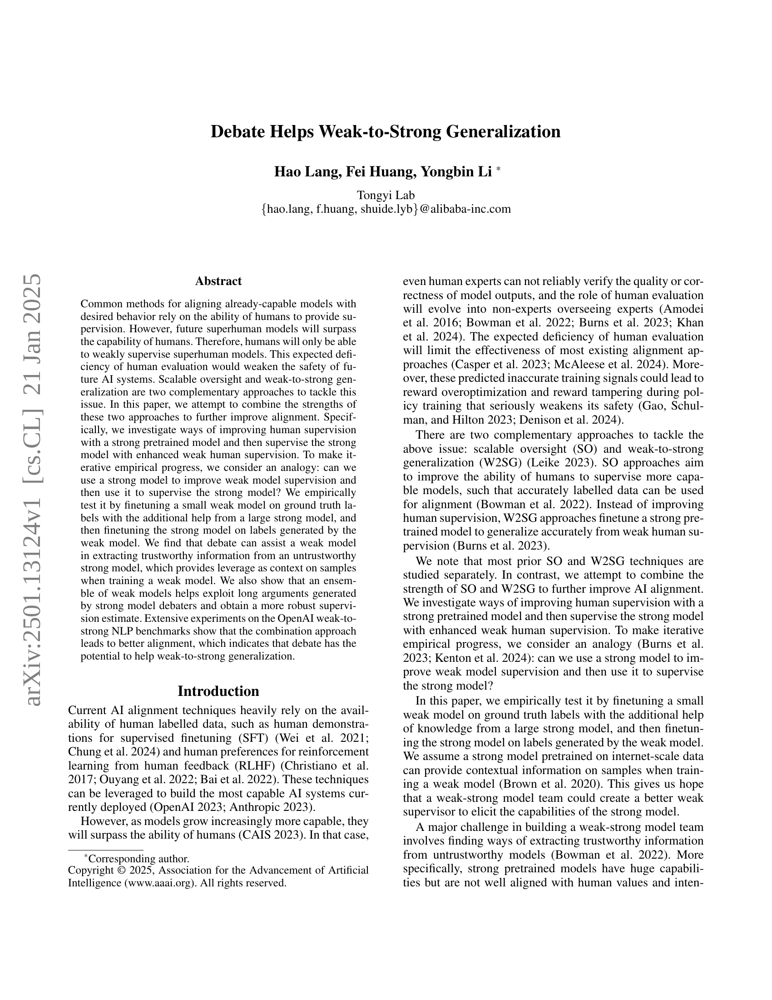
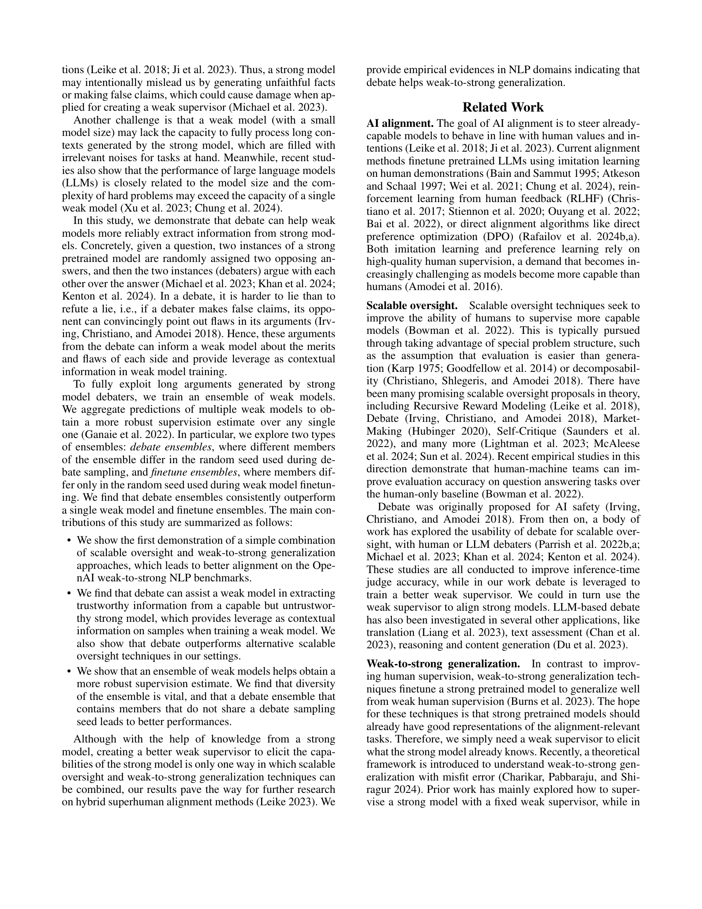
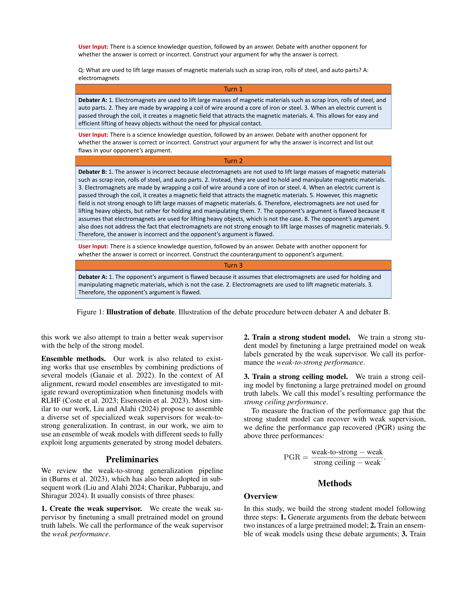
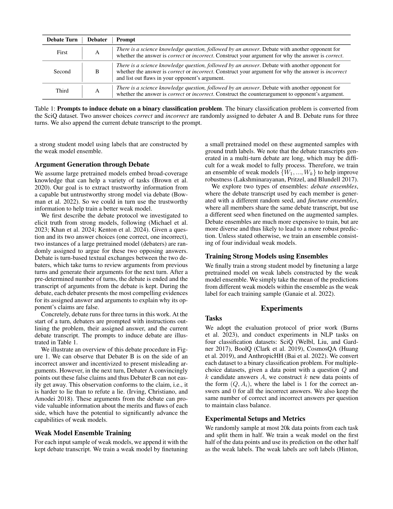
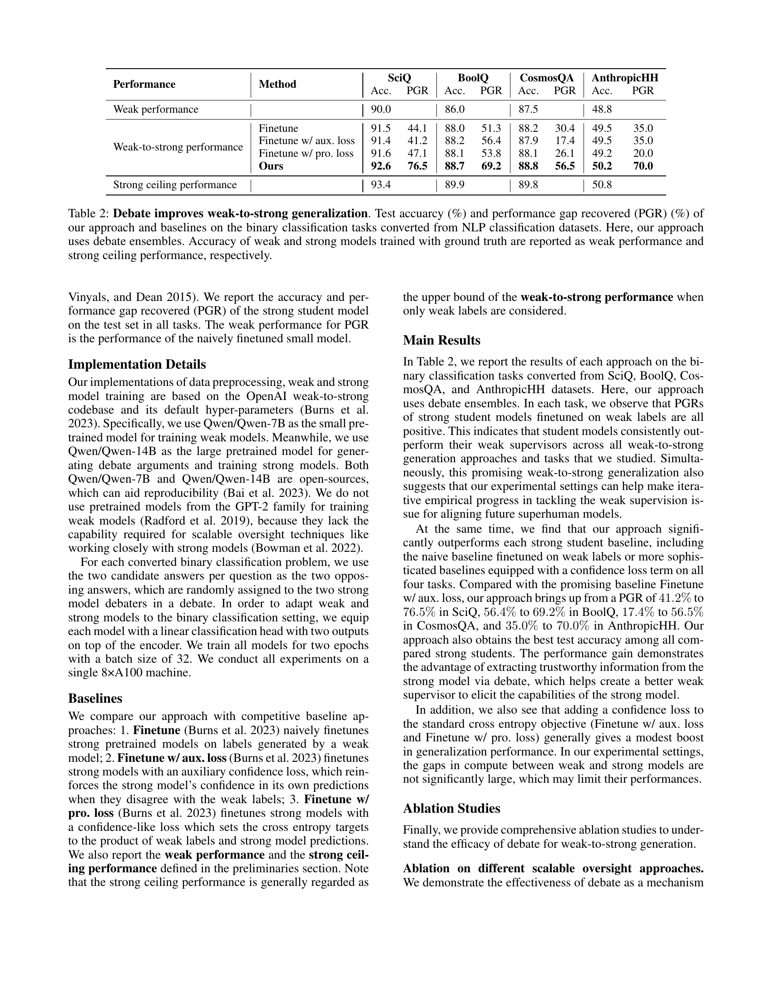
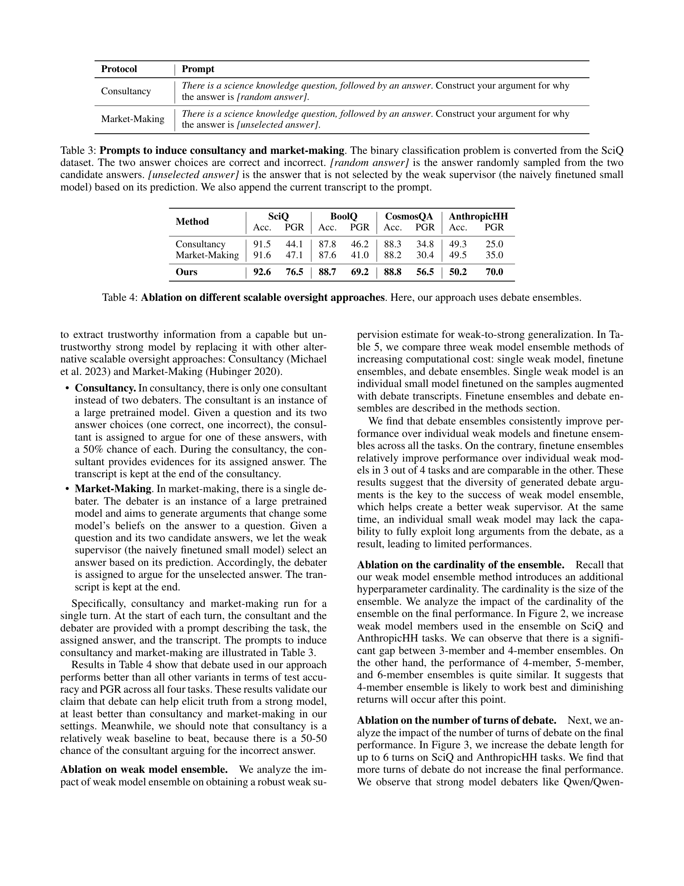
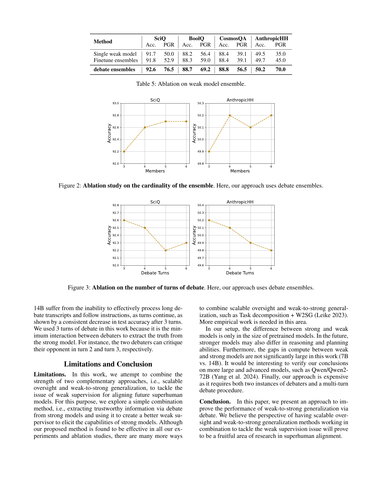
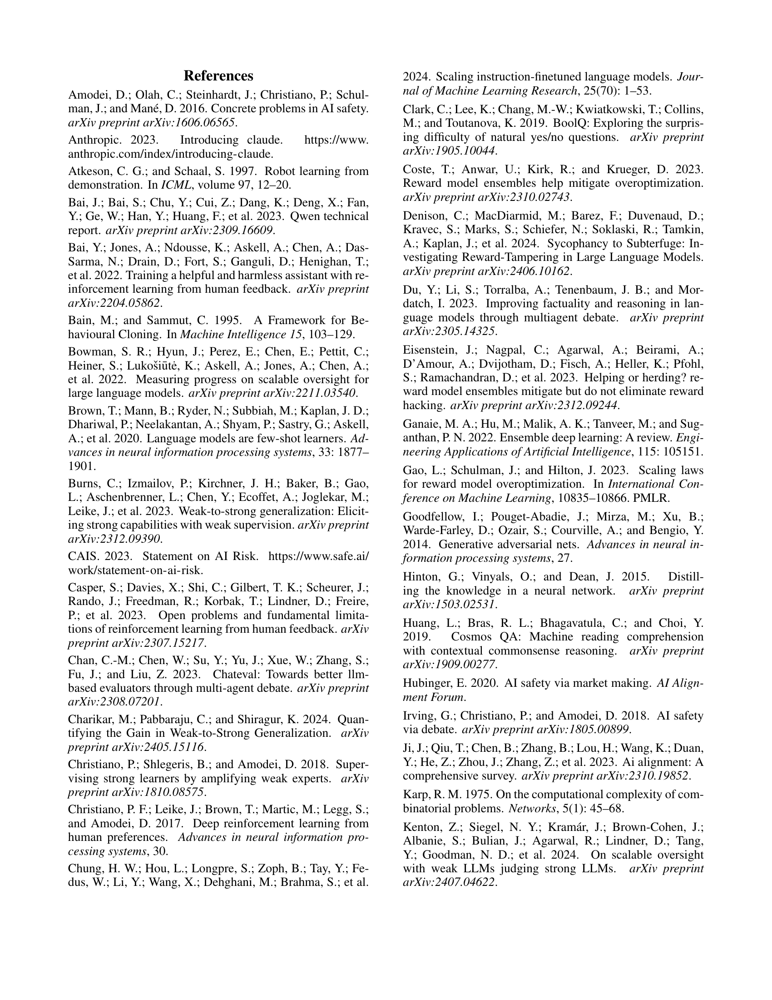
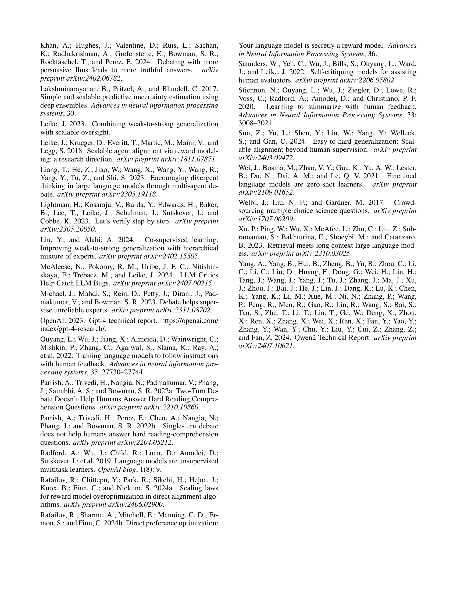

 


 2501.13124 
 Hao Lang et el. 
 
 🤗 2025-01-24 
 



↗ arXiv


↗ Hugging Face


↗ Papers with Code


### TL;DR



현재의 AI 정렬 기술은 **인간의 라벨링 데이터에 크게 의존**하고 있으며, 미래의 초인적 AI 모델은 인간의 능력을 뛰어넘을 것이므로 **인간 감독의 한계**가 예상됩니다. 이는 향후 AI 시스템의 안전성에 심각한 위협이 될 수 있습니다.  본 논문에서는 **확장 가능한 감독(SO)**과 **약한-강한 일반화(W2SG)**라는 두 가지 상호 보완적인 접근 방식을 결합하여 이 문제를 해결하고자 합니다. 

본 연구는 **강력한 사전 훈련된 모델을 활용하여 약한 모델의 감독을 향상시키고, 이를 통해 강력한 모델을 지도**하는 반복적인 접근 방식을 제시합니다.  **강력한 모델 간의 논쟁을 통해 약한 모델이 신뢰할 수 있는 정보를 얻고, 이를 바탕으로 더욱 강력한 감독 신호를 생성**하는 방법을 실험적으로 검증하였습니다. 실험 결과, 제안된 방법은 기존의 약한-강한 일반화 방법보다 우수한 성능을 보였으며,  **데이터 효율성을 높이고 초인적 AI 시스템 개발에 대한 안전성 우려를 해소**하는 데 기여할 수 있음을 보여줍니다.



#### Key Takeaways


 약한-강한 일반화(W2SG)를 위한 새로운 방법으로, 강력한 사전 훈련된 모델과 약한 모델 간의 논쟁을 통해 인간 감독을 개선 



 약한 모델 앙상블을 활용하여 강력한 모델로부터 신뢰할 수 있는 정보를 추출하고, 보다 강력한 감독 신호를 생성 



 OpenAI 약한-강한 NLP 벤치마크에서 기존 방법보다 우수한 성능을 보임 


#### Why does it matter?
본 논문은 **초인적 AI 시스템의 안전성을 향상시키는 데 중요한 의미**를 지닙니다.  인간 수준을 뛰어넘는 모델을 효과적으로 감독하는 방법에 대한 연구는 AI 안전 분야의 주요 과제이며, 본 연구는 **약한 인간 감독을 강력한 모델 학습에 활용하는 새로운 접근법**을 제시합니다.  **데이터 효율성을 높이고 초인적 AI 시스템 개발에 대한 안전성 우려를 해소**하는 데 기여할 수 있으며, **향후 연구를 위한 새로운 방향**을 제시합니다.  특히, **대규모 언어 모델의 정렬 문제**를 해결하는 데 도움이 되는 실험적 결과는 AI 연구자들에게 큰 영향을 미칠 것입니다.

------
#### Visual Insights

> 🔼 그림 1은 논문에서 제시된 '토론(Debate)' 과정을 보여줍니다.  두 명의 논쟁 참여자, A와 B는 주어진 질문에 대한 답변이 옳은지 그른지를 놓고 토론을 벌입니다.  A는 답변이 옳다고 주장하고, B는 답변이 틀렸다고 반박하며 A의 주장에 허점을 지적합니다.  A는 다시 B의 반박에 대한 반론을 제기하는 3턴의 토론 과정이 그림에 나타나 있습니다. 이 과정을 통해 약한 모델이 강력한 모델로부터 신뢰할 수 있는 정보를 추출하는 방법을 보여줍니다. 각 턴마다 질문, 답변, 그리고 논쟁 참여자들의 주장이 제시됩니다.
> 

> 
read the caption

> Figure 1: Illustration of debate. Illustration of the debate procedure between debater A and debater B.
> 


| Debate Turn | Debater | Prompt |
|---|---|---|
| First | A | *There is a science knowledge question, followed by an answer*. Debate with another opponent for whether the answer is *correct* or *incorrect*. Construct your argument for why the answer is *correct*. |
| Second | B | *There is a science knowledge question, followed by an answer*. Debate with another opponent for whether the answer is *correct* or *incorrect*. Construct your argument for why the answer is *incorrect* and list out flaws in your opponent’s argument. |
| Third | A | *There is a science knowledge question, followed by an answer*. Debate with another opponent for whether the answer is *correct* or *incorrect*. Construct the counterargument to opponent’s argument. |

> 🔼 표 1은 논문에서 사용된 논쟁(debate) 방식에 대한 설명입니다. 이 표는 이진 분류 문제에 대한 논쟁을 유도하기 위한 프롬프트(prompt) 세 가지를 보여줍니다. 이진 분류 문제는 SciQ 데이터셋에서 변환되었습니다. 올바른 답과 잘못된 답 두 가지가 Debater A와 B에게 무작위로 할당됩니다. 논쟁은 세 번의 라운드로 진행되며, 각 라운드의 논쟁 내용(transcript)은 다음 라운드의 프롬프트에 추가됩니다.
> 

> 
read the caption

> Table 1: Prompts to induce debate on a binary classification problem. The binary classification problem is converted from the SciQ dataset. Two answer choices correct and incorrect are randomly assigned to debater A and B. Debate runs for three turns. We also append the current debate transcript to the prompt.
> 

### In-depth insights

#### Debate-Based Alignment
논문에서 제시된 ‘Debate-Based Alignment’ 개념은 **상호 대립적인 주장을 통해 강력한 모델의 신뢰성을 높이고 인간의 약한 지도를 개선**하는 접근 방식입니다.  **강력한 사전 학습 모델을 활용하여 인간의 감독을 보완하고, 약한 모델의 학습 과정에서 발생 가능한 편향을 줄이기 위한 전략**으로 해석됩니다.  **토론 과정에서 생성된 논거는 약한 모델에게 신뢰할 수 있는 정보를 제공**하며, 다수의 약한 모델을 결합하는 앙상블 기법을 통해 예측의 강건성을 높일 수 있다는 점이 강조됩니다.  이러한 방식은 기존의 인간 중심적인 정렬 방식의 한계를 극복하고 **초인적인 AI 모델을 안전하게 정렬**하기 위한 중요한 시도로 평가될 수 있습니다.  그러나, **강력한 모델이 의도적으로 오류 정보를 제공할 가능성**과 **토론의 복잡성으로 인한 약한 모델의 처리 능력 한계**와 같은 문제점 또한 고려해야 하며,  **다양한 앙상블 기법과 토론 턴 수에 대한 실험적 연구를 통해 최적의 정렬 전략**을 도출하려는 시도가 흥미롭습니다.

#### Weak Supervision Boost
약한 감독 강화 전략은 **인간의 감독 능력을 뛰어넘는 초지능 모델의 등장**에 대비하여 제안된 접근 방식입니다.  기존의 강화학습 기반 AI 정렬 기법들은 풍부한 인간의 레이블 데이터에 의존하지만, 미래의 초지능 모델은 인간의 평가 능력을 넘어설 가능성이 높기 때문에 **인간의 감독이 약해질 수밖에 없다**는 한계점을 지적합니다. 따라서 이러한 약한 감독 상황에서도 모델의 성능을 향상시킬 수 있는 방법론이 중요해지며, **강력한 사전 학습 모델과의 결합**을 통해 약한 감독의 한계를 극복하는 것이 핵심입니다.  **강력한 모델의 지식을 활용하여 약한 모델의 감독 신뢰도를 높이고, 이를 다시 강력한 모델의 학습에 활용하는 반복적인 과정**을 통해 효과적인 정렬을 달성하고자 합니다.  **논문에서는 이러한 접근 방식의 실험적 검증과 그 과정에서 발생할 수 있는 과제들을 다루고 있으며,  특히 '토론(Debate)' 기반의 방식이 약한 감독의 신뢰성을 높이는 데 효과적임을 제시**합니다.  즉, 강력한 모델 간의 토론을 통해 얻어진 정보를 바탕으로 약한 모델의 학습을 개선하여 전체적인 성능 향상을 도모하는 방식입니다.

#### Ensemble Model Power
본 논문에서 제시된 앙상블 모델은 **약한 모델의 예측 결과를 종합**하여 강력한 모델의 감독을 향상시키는 데 중요한 역할을 합니다.  단일 약한 모델보다 다수의 약한 모델을 활용하여 **더욱 강건하고 정확한 예측**을 가능하게 합니다. 이는 **강력한 모델의 신뢰할 수 없는 정보를 걸러내고, 인간의 약한 감독을 보완**하는 데 효과적입니다. 특히, 논의(debate) 과정을 통해 생성된 다양한 주장들을 다루는 능력은 앙상블 모델의 성능에 큰 영향을 미칩니다. 따라서, **토론 기반 앙상블은 정보의 신뢰성을 높이고, 강건한 감독 추정을 가능**하게 만듭니다.  **다양한 약한 모델의 결합**은 모델의 일반화 성능을 향상시키고, 예측의 신뢰도를 높여 최종 성능 개선에 기여합니다.

#### Scalable Oversight Fusion
**확장 가능한 감독 융합**이란, 인간의 감독 능력을 뛰어넘는 초지능 모델의 등장에 대비하여, 인간의 제한된 감독 능력을 보완하고 강화하는 시스템을 의미합니다. 이는 **약한 감독 신호(weak supervision)**만으로도 강력한 모델의 성능과 안전성을 확보하는 것을 목표로 합니다. 기존의 강화학습 기반 방법론은 인간의 피드백에 크게 의존하기 때문에 초지능 시대에는 적용하기 어려울 수 있습니다. 따라서, **대규모 언어모델(LLM)** 등의 강력한 모델을 활용하여 인간의 감독을 보완하고, 이를 통해 약한 감독 신호를 강화하는 접근법이 필요합니다. 예를 들어, 다수의 약한 모델을 앙상블(ensemble) 기법을 통해 활용하거나, 강력한 모델과 약한 모델 간의 토론(debate) 메커니즘을 도입하여 신뢰성 있는 피드백을 도출할 수 있습니다. 이러한 **융합적 접근법**은 초지능 모델의 안전한 개발 및 배포에 필수적이며, **데이터 효율성 및 모델 성능 개선**이라는 두 마리 토끼를 모두 잡을 수 있는 잠재력을 가지고 있습니다.  핵심은 **인간의 판단과 AI의 능력을 효과적으로 결합**하는 설계에 있습니다.  **모델의 신뢰성, 설명 가능성, 그리고 인간 가치와의 정렬**을 동시에 고려하는 것이 중요합니다.

#### Superhuman Alignment
초지능 시대의 도래와 더불어 **인간의 능력을 뛰어넘는 AI 시스템의 안전성 확보**는 최대의 과제입니다.  이를 위한 초지능 정렬(Superhuman Alignment) 연구는 인간의 감독 능력의 한계를 극복하고 **AI 시스템의 목표와 인간의 가치를 일치**시키는 방법론을 모색합니다.  기존의 인간 중심적 감독 방식은 초지능 AI에는 적용하기 어렵기에, **약한 감독(weak supervision)을 활용하여 강력한 모델을 학습시키는 방법** (weak-to-strong generalization) 및 **인간의 감독 능력을 확장하는 기술** (scalable oversight)이 중요한 연구 분야로 떠오르고 있습니다. 특히, 논문에서 제시된 '토론(debate)' 기반 접근 방식은 상호 비판과 검증을 통해 **강력한 모델의 신뢰할 수 있는 정보 추출**을 가능하게 합니다.  이를 통해, 약한 모델의 학습 효율을 높이고, 더욱 안전하고 윤리적인 초지능 AI 개발에 기여할 수 있을 것으로 기대됩니다.  하지만, **강력한 모델의 조작 가능성**과 **약한 모델의 한계**는 여전히 극복해야 할 과제이며, 지속적인 연구와 기술 발전이 필요합니다.

### More visual insights

More on figures

> 🔼 이 그림은 앙상블 크기에 따른 성능 변화를 보여주는 실험 결과입니다. 논문에서는 약한 모델의 앙상블을 사용하는 접근 방식을 제시하고 있는데, 이 그림은 그 앙상블의 크기(즉, 사용된 약한 모델의 수)를 다르게 하여 실험을 진행했을 때의 성능 변화를 나타냅니다. SciQ 와 AnthropicHH 두 데이터셋에 대해 각각 앙상블 크기를 3, 4, 5, 6으로 변화시키면서 실험을 수행했고, 그 결과를 정확도 그래프로 보여줍니다.  앙상블 크기가 증가함에 따라 정확도가 어떻게 변하는지, 그리고 어느 정도의 크기가 성능 향상에 가장 효과적인지 확인할 수 있습니다.
> 

> 
read the caption

> Figure 2: Ablation study on the cardinality of the ensemble. Here, our approach uses debate ensembles.
> 

> 🔼 이 그림은 논문의 실험 결과 중 하나로, 토론의 라운드 수가 성능에 미치는 영향을 보여줍니다.  토론 라운드를 3회, 4회, 5회, 6회 진행했을 때의 정확도 변화를 SciQ와 AnthropicHH 두 데이터셋에 대해 비교 분석한 결과입니다.  본 논문에서는 약한 모델 집합(debate ensemble)을 사용하여 강한 모델의 지식을 효과적으로 활용하는 방법을 제시하고 있으며, 이 그림은 그 방법의 효율성을 보다 자세히 분석하기 위한 추가 실험 결과를 보여줍니다.  그림에서 확인할 수 있듯이, 토론 라운드 수가 증가한다고 해서 항상 정확도가 향상되는 것은 아님을 알 수 있습니다.
> 

> 
read the caption

> Figure 3: Ablation on the number of turns of debate. Here, our approach uses debate ensembles.
> 

More on tables


| Performance | Method | SciQ Acc. | SciQ PGR | BoolQ Acc. | BoolQ PGR | CosmosQA Acc. | CosmosQA PGR | AnthropicHH Acc. | AnthropicHH PGR |
|---|---|---|---|---|---|---|---|---|---| 
| Weak performance |  | 90.0 |  | 86.0 |  | 87.5 |  | 48.8 |  |
| Weak-to-strong performance | Finetune | 91.5 | 44.1 | 88.0 | 51.3 | 88.2 | 30.4 | 49.5 | 35.0 |
|  | Finetune w/ aux. loss | 91.4 | 41.2 | 88.2 | 56.4 | 87.9 | 17.4 | 49.5 | 35.0 |
|  | Finetune w/ pro. loss | 91.6 | 47.1 | 88.1 | 53.8 | 88.1 | 26.1 | 49.2 | 20.0 |
|  | **Ours** | **92.6** | **76.5** | **88.7** | **69.2** | **88.8** | **56.5** | **50.2** | **70.0** |
| Strong ceiling performance |  | 93.4 |  | 89.9 |  | 89.8 |  | 50.8 |  |
> 🔼 표 2는 NLP 분류 데이터셋에서 변환된 2원 분류 작업에 대한 저자의 접근 방식과 기준선의 테스트 정확도(%) 및 성능 격차 회복(PGR)(%)을 보여줍니다. 저자의 접근 방식은 토론 앙상블을 사용합니다. 기준 성능은 실제 레이블로 훈련된 약한 모델과 강한 모델의 정확도로 보고됩니다.
> 

> 
read the caption

> Table 2: Debate improves weak-to-strong generalization. Test accuarcy (%) and performance gap recovered (PGR) (%) of our approach and baselines on the binary classification tasks converted from NLP classification datasets. Here, our approach uses debate ensembles. Accuracy of weak and strong models trained with ground truth are reported as weak performance and strong ceiling performance, respectively.
> 


| Protocol | Prompt |
|---|---| 
| Consultancy | *There is a science knowledge question, followed by an answer*. Construct your argument for why the answer is *[random answer]*. |
| Market-Making | *There is a science knowledge question, followed by an answer*. Construct your argument for why the answer is *[unselected answer]*. |
> 🔼 표 3은 Consultancy와 Market-Making이라는 두 가지 다른 접근 방식을 사용하여 약한 감독자(naive하게 fine-tuning된 작은 모델)가 답을 예측하는 과정을 보여줍니다. SciQ 데이터셋의 이진 분류 문제에서 두 가지 답변(정답과 오답) 중 하나를 무작위로 선택하여 해당 답변에 대한 주장을 생성하도록 프롬프트를 구성합니다. Consultancy에서는 전문가 모델이 무작위로 선택된 답변에 대한 주장을 생성하고, Market-Making에서는 약한 감독자가 선택하지 않은 답변에 대한 주장을 생성합니다. 각 경우에 현재까지의 대화 내용(transcript)을 프롬프트에 추가합니다.
> 

> 
read the caption

> Table 3: Prompts to induce consultancy and market-making. The binary classification problem is converted from the SciQ dataset. The two answer choices are correct and incorrect. [random answer] is the answer randomly sampled from the two candidate answers. [unselected answer] is the answer that is not selected by the weak supervisor (the naively finetuned small model) based on its prediction. We also append the current transcript to the prompt.
> 


| Method | SciQ Acc. | SciQ PGR | BoolQ Acc. | BoolQ PGR | CosmosQA Acc. | CosmosQA PGR | AnthropicHH Acc. | AnthropicHH PGR |
|---|---|---|---|---|---|---|---|---|
| Consultancy | 91.5 | 44.1 | 87.8 | 46.2 | 88.3 | 34.8 | 49.3 | 25.0 |
| Market-Making | 91.6 | 47.1 | 87.6 | 41.0 | 88.2 | 30.4 | 49.5 | 35.0 |
| **Ours** | **92.6** | **76.5** | **88.7** | **69.2** | **88.8** | **56.5** | **50.2** | **70.0** |
> 🔼 표 4는 서로 다른 확장 가능한 감독 접근 방식에 대한 추가 분석 결과를 보여줍니다. 이 표에서는 제안된 방법(토론 앙상블 사용)과 비교하여 자문(Consultancy) 및 시장 조성(Market-Making)이라는 두 가지 대체 접근 방식의 성능을 비교 분석합니다.  각 접근 방식의 정확도와 성능 차이 회복률(PGR)을 SciQ, BoolQ, CosmosQA, AnthropicHH 네 가지 데이터셋에서 측정하여 비교 분석함으로써 제안된 토론 기반 접근 방식의 효과를 보다 명확하게 제시합니다.
> 

> 
read the caption

> Table 4: Ablation on different scalable oversight approaches. Here, our approach uses debate ensembles.
> 


| Method | SciQ Acc. | SciQ PGR | BoolQ Acc. | BoolQ PGR | CosmosQA Acc. | CosmosQA PGR | AnthropicHH Acc. | AnthropicHH PGR |
|---|---|---|---|---|---|---|---|---|
| Single weak model | 91.7 | 50.0 | 88.2 | 56.4 | 88.4 | 39.1 | 49.5 | 35.0 |
| Finetune ensembles | 91.8 | 52.9 | 88.3 | 59.0 | 88.4 | 39.1 | 49.7 | 45.0 |
| **debate ensembles** | **92.6** | **76.5** | **88.7** | **69.2** | **88.8** | **56.5** | **50.2** | **70.0** |
> 🔼 이 표는 약한 모델 앙상블에 대한 추가 분석 결과를 보여줍니다. 세 가지 다른 약한 모델 앙상블 방법(단일 약한 모델, 미세 조정 앙상블, 논쟁 앙상블)의 성능을 비교하여 논쟁 앙상블이 가장 우수한 성능을 보임을 확인합니다. 이는 논쟁을 통해 생성된 다양한 주장들이 강력한 모델로부터 신뢰할 수 있는 정보를 추출하는 데 도움이 되고, 이를 통해 더욱 강력한 성능을 가진 약한 감독자를 만드는 데 기여함을 시사합니다.
> 

> 
read the caption

> Table 5: Ablation on weak model ensemble.
> 

### Full paper



