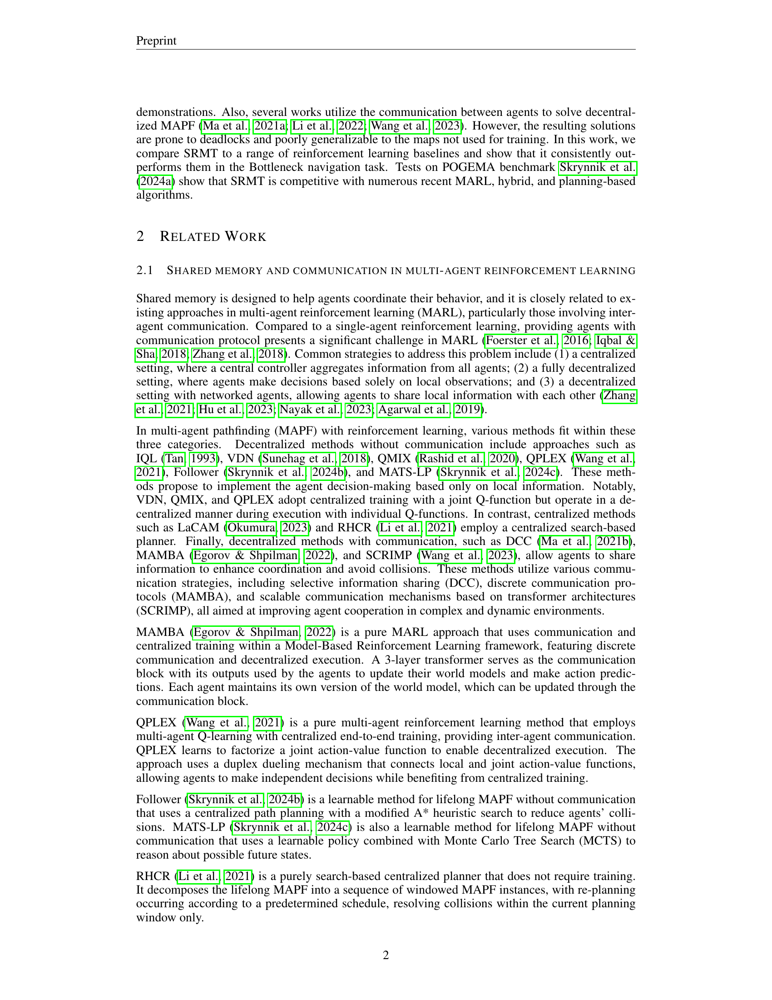

 


 2501.13200 
 Alsu Sagirova et el. 
 
 🤗 2025-01-24 
 



↗ arXiv


↗ Hugging Face


↗ Papers with Code


### TL;DR



다중 에이전트 강화 학습(MARL)은 다양한 환경에서 협력 및 경쟁 문제를 해결하는 데 상당한 발전을 이루었지만, 에이전트 간의 효과적인 협력을 위한 명시적인 예측이 여전히 어려움으로 남아 있습니다. 본 논문에서는 개별 작업 메모리를 풀링하고 전역적으로 브로드캐스팅하여 에이전트 간의 암시적인 정보 교환을 가능하게 하는 공유 순환 메모리 변환기(SRMT)를 제시합니다.

SRMT는 부분적으로 관측 가능한 다중 에이전트 경로 찾기 문제에 대해 평가되었으며, 특히 희소 보상 하에서 기존 강화 학습 기준선보다 우수한 성능을 보였습니다. 또한, SRMT는 다양한 환경에서 최근 MARL, 하이브리드 및 계획 기반 알고리즘과 경쟁력 있는 성능을 보였습니다. 이러한 결과는 변환기 기반 아키텍처에 공유 순환 메모리를 통합하면 분산된 다중 에이전트 시스템의 조정을 향상시킬 수 있음을 시사합니다.



#### Key Takeaways


 SRMT는 에이전트 간의 암시적 정보 교환을 가능하게 하여 협력을 개선합니다. 



 SRMT는 제한된 관측 환경에서도 효과적으로 작동하며, 긴 경로에도 일반화됩니다. 



 SRMT는 다양한 벤치마크에서 기존의 다중 에이전트 강화 학습 알고리즘과 비교하여 경쟁력 있는 성능을 보입니다. 


#### Why does it matter?
본 논문은 **분산된 다중 에이전트 시스템**에서 협력을 향상시키는 새로운 방법을 제시하여 **다양한 분야의 연구자들에게 중요한 의미**를 지닙니다. 특히, **복잡한 문제 해결을 위한 다중 에이전트 시스템의 설계 및 구현**에 대한 새로운 통찰력을 제공하며, **기존의 한계를 극복**하고 더욱 효율적인 협력 시스템을 구축하는 데 기여할 수 있습니다. 또한, 제시된 방법은 다양한 응용 분야에 적용될 수 있는 잠재력을 가지고 있으며, **향후 연구**에 대한 새로운 방향을 제시합니다.

------
#### Visual Insights

> 🔼 그림 1은 제안된 공유 순환 메모리 변환기(SRMT)의 아키텍처를 보여줍니다. SRMT는 각 에이전트의 순환 메모리(m_{i,t})를 모아서 크로스 어텐션을 통해 모든 에이전트가 공유할 수 있도록 합니다. 이는 시간 t에서 개별 에이전트의 메모리를 결합하고, 이를 통해 에이전트 간에 암묵적인 정보 교환이 가능하도록 합니다.  각 에이전트는 자체 메모리를 유지하고 갱신하며, 공유 메모리에 쓰고 읽는 작업을 수행합니다.  이 과정에서 각 에이전트는 자체 메모리와 공유 메모리 간의 상호작용을 통해 전역적 맥락을 고려한 의사결정을 내립니다.
> 

> 
read the caption

> Figure 1: Shared Recurrent Memory Transformer architecture. SRMT pools recurrent memories m⁢e⁢mi,t𝑚𝑒subscript𝑚𝑖𝑡mem_{i,t}italic_m italic_e italic_m start_POSTSUBSCRIPT italic_i , italic_t end_POSTSUBSCRIPT of individual agents at a moment t𝑡titalic_t and provides global access to them via cross-attention.
> 


| Parameter | MAPF (all models) | SRMT LMAPF |
|---|---|---|
| Optimizer | Adam | Adam |
| Learning rate | 0.00013 | 0.00022 |
| LR Scheduler | Adaptive KL | Constant |
| γ (discount factor) | 0.9716 | 0.9756 |
| Recurrence rollout | 8 | - |
| Clip ratio | 0.2 | 0.2 |
| Batch size | 16384 | 16384 |
| Optimization epochs | 1 | 1 |
| Entropy coefficient | 0.0156 | 0.023 |
| Value loss coefficient | 0.5 | 0.5 |
| GAEλ | 0.95 | 0.95 |
| MLP hidden size | 16 | 512 |
| ResNet residual blocks | 1 | 8 |
| ResNet filters | 8 | 64 |
| Attention hidden size | 16 | 512 |
| Attention heads | 4 | 8 |
| GRU hidden size | 16 | - |
| Activation function | ReLU | ReLU |
| Network Initialization | orthogonal | orthogonal |
| Rollout workers | 4 | 8 |
| Envs per worker | 4 | 4 |
| Training steps | 2e+07 | 1e+09 |
| Episode length | 512 | 512 |
| Observation patch | 5x5 | 11x11 |
| Number of agents | 2 | 64 |

> 🔼 표 1은 논문에서 사용된 다양한 모델들의 설정과 하이퍼파라미터들을 보여줍니다.  MAPF(Multi-Agent Pathfinding) 작업과 SRMT(Shared Recurrent Memory Transformer) 및 LMAPF(Lifelong Multi-Agent Pathfinding) 작업에 대해 최적화기, 학습률, 감쇠율, 배치 크기, 탐색 공간 크기 등의 세부적인 설정 값들을 비교하여 제시합니다.  이는 각 모델의 학습 과정과 성능에 영향을 미치는 중요한 요소들을 명확하게 보여줍니다.  특히 SRMT 모델의 하이퍼파라미터들을 자세히 제시하여, 본 연구의 재현성을 높이는 데 기여합니다.
> 

> 
read the caption

> Table 1: Models configuration and training hyperparameters.
> 

### In-depth insights

#### Shared Memory MARL
공유 메모리 기반 다중 에이전트 강화 학습(MARL)은 **에이전트 간의 효율적인 협력을 가능하게 하는 매력적인 접근법**입니다. 개별 에이전트는 **공유 메모리 공간을 통해 간접적으로 정보를 교환**하여 상호 작용을 조정하고 충돌을 피할 수 있습니다. 이는 기존의 명시적인 통신 프로토콜에 의존하는 방법에 비해 **더욱 효율적이고 확장성 있는 협력**을 가능하게 합니다.  **공유 메모리의 구조와 접근 방식**은 다양하며, 이는 에이전트의 메모리 업데이트 방식, 정보 교환 메커니즘, 그리고 전반적인 시스템 아키텍처에 영향을 미칩니다.  **메모리의 크기와 구조**는 에이전트의 성능에 영향을 주는 중요한 요소이며, 메모리 관리 전략 또한 성능에 영향을 미칩니다. **다양한 유형의 과제**에 대한 공유 메모리 MARL의 적용성과 효율성을 평가하는 것은 중요합니다.  특히 복잡하고 역동적인 환경에서의 성능과 확장성을 분석하는 것이 필요합니다. **장기적인 경로 찾기** 와 같은 복잡한 문제에 대한 적용성을 평가하고, 다른 MARL 방법들과 비교 분석하는 것이 중요합니다.

#### SRMT Architecture
SRMT(Shared Recurrent Memory Transformer) 아키텍처는 **분산된 환경에서 에이전트 간의 암묵적인 정보 교환을 가능하게 하는 핵심 메커니즘**입니다.  각 에이전트는 순환적으로 업데이트되는 개별 메모리를 가지고 있으며, 이 메모리는 공유된 공간에 기록되고 읽혀집니다. 이를 통해 에이전트는 과거 정보를 기억하고, 개별 및 집단적인 의사 결정을 효과적으로 수행할 수 있습니다.  **중앙 집중식 학습 방식 대신 완전 분산 방식을 채택**하여 실세계 응용 분야에 적합한 유연성을 제공합니다.  **자가 주의 메커니즘과 교차 주의 메커니즘의 결합**을 통해 에이전트는 개별 메모리와 공유 메모리 간의 상호 작용을 수행합니다.  **공유 메모리는 모든 에이전트가 접근 가능**하여 전역적인 맥락을 반영한 의사 결정을 가능하게 합니다.  결과적으로, SRMT 아키텍처는 **에이전트 간의 효율적인 조정 및 협력을 가능하게 하는 혁신적인 메커니즘**이며, 복잡한 다중 에이전트 문제 해결에 큰 기여를 할 것으로 기대됩니다.

#### Bottleneck Experiments
본 논문에서 제시된 병목 현상 실험은 **다수 에이전트 시스템의 협력적 의사결정 능력**을 평가하기 위한 중요한 검증 단계입니다. 좁은 통로를 통과해야 하는 에이전트들의 상호 작용을 통해 **분산된 환경에서의 협력 및 충돌 회피 전략**을 분석하고, 제안된 SRMT 모델의 성능을 다양한 기준(성공률, 비용 등)으로 측정합니다. **희소 보상 설정**에서의 성능 평가는 모델의 강건성을 확인하고, 다양한 보상 함수(방향, 음수 이동, 희소)를 통한 실험은 **모델의 일반화 능력**을 평가합니다. 병목 현상 실험 결과는 SRMT 모델이 특히 희소 보상 환경에서 기존 방법들을 능가하는 성능을 보임을 보여주며, 이는 **공유 메모리 기반의 암묵적 정보 교환 메커니즘**의 효과를 시사합니다.  **더 긴 통로에 대한 일반화 실험**은 모델의 확장성과 실제 환경 적용 가능성을 시사하는 중요한 결과입니다.  **다양한 보상 함수와 훈련 전략**의 조합은 SRMT의 견고성 및 유연성을 강조하며,  **실제 다수 에이전트 시스템의 설계 및 구현**에 대한 시사점을 제공합니다.

#### Lifelong MAPF
본 논문의 "Lifelong MAPF" 부분은 기존의 다중 에이전트 경로 찾기(MAPF) 문제를 **시간의 흐름에 따라 지속적으로 새로운 목표 지점을 받고 경로를 계획하는** 상황으로 확장한 것입니다. 이는 실제 로봇 시스템이나 자율 주행과 같은 동적인 환경에서의 다중 에이전트 협업을 더욱 현실적으로 반영합니다.  **에이전트들이 각자의 목표를 달성하기 위해 끊임없이 경로를 재계획하고 협력해야 하는** 점이 특징이며, 단순히 초기 목표 지점만 고려하는 기존 MAPF와는 다릅니다.  본 연구는 이러한 Lifelong MAPF 문제에 대한 해결책으로 **공유 순환 기억 변환기(SRMT)**를 제시하며, 실험 결과를 통해 기존 알고리즘보다 우수한 성능을 보임을 확인했습니다. **특히, SRMT는 제한된 관측 정보 환경에서도 에이전트 간의 효율적인 협업을 가능하게 하며, 긴 경로나 복잡한 환경에서도 일반화 성능이 뛰어남을 보여주었습니다.**  이는 SRMT의 공유 메모리 구조가 에이전트 간의 정보 교환을 효과적으로 지원하고,  **장기적인 계획 수립 및 동적인 상황 변화에 대한 적응력**을 향상시켰기 때문으로 해석될 수 있습니다. 이러한 성과는 실제 다중 에이전트 시스템의 설계 및 제어에 중요한 시사점을 제공합니다.

#### SRMT Limitations
SRMT의 한계는 주로 **완벽한 위치 확인 및 매핑 기능, 정확한 행동 실행, 동기화된 움직임, 고정된 장애물을 가정**하는 데 있습니다. 이러한 가정은 실제 환경에서는 항상 충족되지 않으므로, **실제 로봇 시스템에 적용할 때는 추가적인 고려**가 필요합니다. 또한, **이론적 보장 없이 실험적 결과에만 의존**한다는 점도 한계입니다.  **다른 학습 기반 방법론과 마찬가지로**,  SRMT는 특정 환경에서 학습된 정책이 다른 환경으로 일반화되는 데 어려움을 겪을 수 있습니다.  **보상 함수의 설계** 또한 성능에 큰 영향을 미치므로, **적절한 보상 함수를 선택하는 것이 중요**합니다. 마지막으로, 메모리 용량과 연산 비용이 증가할 수 있다는 점 또한 실제 적용에 있어 고려해야 할 제약입니다. 따라서, **실제 환경에서의 적용성을 높이기 위해서는 더욱 견고하고 일반화된 알고리즘 개발과 보다 현실적인 제약 조건들을 고려한 추가 연구**가 필요합니다.

### More visual insights

More on figures

> 🔼  그림 (a)는 병목 현상(Bottleneck)을 보여주는 간단한 2에이전트 협력 과제의 예시입니다. 두 에이전트는 좁은 통로를 지나 반대편 방으로 이동해야 합니다. 각 에이전트는 시작 위치와 목표 위치가 있으며, 좁은 통로를 효율적으로 통과하기 위해 서로 협력해야 합니다. 이 그림은 본 논문에서 제안된 SRMT 모델의 성능을 평가하기 위해 사용된 환경 중 하나입니다.
> 

> 
read the caption

> (a) Bottleneck
> 

> 🔼 그림 (b)는 논문의 4.1절 실험에서 사용된 POGEMA 벤치마크 환경 중 하나인 미로 환경을 보여줍니다. 여러 에이전트가 장애물이 있는 미로에서 각자의 목표 지점까지 이동해야 합니다. 에이전트들은 부분적으로 관찰 가능한 환경에서 작동하며, 다른 에이전트의 위치와 행동을 제한적으로만 인지할 수 있습니다. 이 그림은 에이전트들이 미로를 탐색하는 데 있어서 협력과 조정의 중요성을 보여주는 예시입니다.
> 

> 
read the caption

> (b) Maze
> 

> 🔼 그림 (c)는 POGEMA 벤치마크의 무작위 맵을 보여줍니다. 이 맵은 장애물과 에이전트의 시작 및 목표 위치가 무작위로 배치되어 다양한 난이도의 탐색 문제를 제공합니다. 에이전트는 파란색 원으로 표시되고, 목표는 비어있는 파란색 원으로 표시됩니다. 이 그림은 여러 에이전트가 복잡한 환경에서 어떻게 협력하고 조정하여 목표에 도달하는지를 시각적으로 보여줍니다.  에이전트는 제한된 관찰 범위 내에서만 다른 에이전트와 환경을 인지할 수 있으며, 이는 문제의 복잡성을 더욱 증가시킵니다.
> 

> 
read the caption

> (c) Random
> 

> 🔼 이 그림은 논문의 4.1절, 'Bottleneck에서의 고전적인 MAPF' 섹션에 속하며, 다양한 환경에서의 에이전트 경로 찾기 문제를 보여주는 그림들 중 하나입니다. (d) Puzzle은 퍼즐처럼 복잡하게 배치된 장애물들 사이에서 여러 에이전트들이 각자의 목표 지점에 도달해야 하는 시나리오를 나타냅니다.  이 그림은 POGEMA 벤치마크의 일부로, 다양한 크기와 복잡도의 맵에서 에이전트들의 경로 계획 능력을 평가하는 데 사용됩니다.  각 에이전트는 고유한 색상의 원으로 표시되며, 목표 지점은 같은 색상의 빈 원으로 표시되어 있습니다.
> 

> 
read the caption

> (d) Puzzle
> 

> 🔼 그림 (e)는 POGEMA 벤치마크의 일부로서, 창고 환경을 보여줍니다. 이 그림은 다양한 크기와 복잡성을 가진 여러 맵 중 하나이며, 다수의 에이전트가 목표 지점에 도달하기 위해 협력하고 경로를 계획하는 방법을 시각적으로 보여줍니다. 다양한 장애물과 복잡한 통로가 존재하여, 에이전트 간의 협력과 효율적인 경로 계획의 중요성을 강조합니다. 에이전트는 각각 다른 색깔의 원으로 표시되며, 목표 지점은 같은 색깔의 빈 원으로 표시됩니다.
> 

> 
read the caption

> (e) Warehouse
> 

> 🔼 (f) MovingAI는 논문의 그림 2에 제시된 다양한 환경 중 하나이며, 에이전트들이 목표 지점에 도달하기 위해 협력해야 하는 복잡한 환경을 보여줍니다. 이 그림은 다양한 크기와 복잡성을 가진 여러 지도 유형(Bottleneck, Maze, Random, Puzzle, Warehouse)을 보여주는 다른 그림들과 함께 제시되어 있습니다.  MovingAI 환경은 특히 다른 환경과 비교했을 때 에이전트의 시야가 제한적이고 경로 계획이 더 어려운 특징을 가지고 있습니다. 따라서, 이 그림은 논문에서 제시하는 SRMT 알고리즘이 복잡한 다중 에이전트 환경에서도 효과적으로 작동함을 보여주는 데 사용됩니다.
> 

> 
read the caption

> (f) MovingAI
> 

> 🔼 그림 2는 다양한 환경에서의 에이전트들의 협력적인 경로 찾기 문제를 보여줍니다. (a)는 병목 현상 과제로, 두 명의 에이전트가 반대쪽 방에 있는 목표 지점에 도달하기 위해 좁은 통로를 지나야 하는 협력 과제입니다. 에이전트는 진한 색 원으로, 목표 지점은 같은 색 테두리의 빈 원으로 표시됩니다. (b)부터 (f)까지는 POGEMA 벤치마크의 지도들이며, POGEMA는 다양한 지도와 문제 크기에 걸쳐 계획 방법의 일반화 성능을 평가할 수 있게 합니다.
> 

> 
read the caption

> Figure 2: Examples of environments. (a) Bottleneck task. This is a toy task on coordination. Two agents start in rooms opposite their goals and should coordinate passing the corridor. Agents are shown as solid-colored circles, their goals are empty circles with the same border color. (b)-(f) Maps from POGEMA benchmark (images for POGEMA maps are from (Skrynnik et al., 2024a)). POGEMA allows testing the planning methods’ generalization across different maps and problem sizes.
> 

> 🔼 그림 3은 다양한 보상 함수를 사용하여 병목 현상 작업을 효과적으로 해결하는 SRMT 모델의 성능을 보여줍니다.  방향성 보상(목표물에 도달하고 이동할 때 양수 보상)으로 훈련된 SRMT는 통신 기반(MAMBA, QPLEX) 및 메모리 기반(ATM, RATE, RRNN) 기준 모델보다 뛰어난 성능을 보입니다. RMT, Attention, RNN 단순화 모델 또한 작업을 해결합니다. 이동에 대한 음수 보상 및 방향성 보상 없는 경우(음수 이동 보상), 공유 메모리가 없는 SRMT 및 RMT는 SRMT의 메모리 없는 단순화 모델(Attention, Empty, RNN)과 통신 및 메모리 기준 모델(MAMBA, QPLEX, ATM, RATE, RRNN)보다 우수한 성능을 보입니다.  희소 보상(목표물에 도달할 때만 보상)의 경우, SRMT는 다른 방법들이 점수를 잃는 반면 점수를 유지합니다. 오차 막대는 95% 신뢰 구간을 나타냅니다. CSR 및 ISR의 경우 높은 값이 좋고, SoC의 경우 낮은 값이 좋습니다.
> 

> 
read the caption

> Figure 3: SRMT effectively solves the Bottleneck Task with different reward functions. Trained with Directional (positive when moved towards a goal and achieved it) reward, SRMT clearly outperforms the communication (MAMBA, QPLEX) and memory (ATM, RATE, RRNN) baselines. The RMT, Attention, and RNN ablations also solve the task. For the case with the negative reward for movement and no directional reward (Moving Negative) SRMT and RMT without shared memory demonstrate the clear advantage over the memory-less ablations of SRMT (Attention, Empty, RNN) and the communicative and memory baselines (MAMBA, QPLEX, ATM, RATE, RRNN). With the Sparse (on-goal only) reward, SRMT maintains the score while other methods drop. Error bars indicate 95% confidence intervals. For CSR and ISR higher values are better, for SoC – the lower the better.
> 

> 🔼 그림 4는 다양한 길이의 복도(최대 1000 셀)에서 SRMT 에이전트의 일반화 능력을 보여줍니다. 3에서 30셀 길이의 복도에 대해 훈련된 모든 방법들을 1000셀까지의 더 긴 복도에서 평가했습니다. 0이 아닌 성능을 보이는 모든 모델은 100셀 길이의 복도까지는 좋은 확장성을 보였습니다.  희소 보상의 경우 SRMT는 400셀까지는 최고의 성능을 보였으나, 그 이후에는 RMT보다 집단 성능이 떨어졌습니다.  반면 이동 음수 보상의 경우 SRMT는 세 가지 지표 모두에서 최고의 성능을 보였습니다. 음영 영역은 95% 신뢰 구간을 나타냅니다.
> 

> 
read the caption

> Figure 4: SRMT agents generalize on corridor lengths up to 1000. After training on corridor sizes from 3 to 30 cells all methods were evaluated on longer passages up to 1000. All non-zero performing models show good scaling up to the corridor length of 100. For the Sparse reward, SRMT leads up to 400 and then drops below RMT for collective performance. For the Moving Negative reward, SRMT shows the top-1 performance on all three metrics. The shaded area indicates 95% confidence intervals.
> 

> 🔼 그림 5는 다양한 환경에서 SRMT가 다른 MARL 방법보다 우수하다는 것을 보여줍니다. 미로 환경에서 훈련된 SRMT는 훈련 중에 보지 못한 지도에서 평가될 때 강력한 일반화 성능을 보여줍니다. SRMT는 창고 환경을 제외한 모든 지도에서 MARL 기준 MAMBA와 QPLEX를 능가합니다. 64개 또는 128개 에이전트를 혼합하여 훈련하는 것(SRMT 64-128)은 방법의 일반화 능력에 영향을 미치지 않습니다. 창고 환경에서 Follower 휴리스틱 경로 검색을 기반으로 하는 보상 함수를 사용하는 SRMT(SRMT-FlwrPlan)의 평균 처리량은 MAMBA, MATS-LP, QPLEX 및 RHCR 방법을 능가합니다. 오차 막대는 95% 신뢰 구간을 나타냅니다.
> 

> 
read the caption

> Figure 5: SRMT outperforms other MARL methods in different environments. SRMT trained on Mazes shows robust generalization when evaluated on maps not seen during training. SRMT outperforms MARL baselines MAMBA and QPLEX on all maps except the Warehouse environment. Mixed training with 64 or 128 agents (SRMT 64-128) does not affect the generalization abilities of the method. In the Warehouse environment, the average throughput of SRMT with a reward function based on the Follower heuristic path search (SRMT-FlwrPlan) surpasses that of MAMBA, MATS-LP, QPLEX, and RHCR methods. Error bars indicate 95% confidence intervals.
> 

> 🔼 그림 6은 다양한 멀티 에이전트 경로 찾기(MAPF) 성능 측정 기준에서 SRMT와 다른 방법들을 비교한 막대 그래프입니다. SRMT와 그 변형(SRMT 64-128, SRMT-FlwrPlan)의 성능을 MAMBA, QPLEX, Follower, MATS-LP, RHCR과 비교하여 성능, 경로 찾기, 혼잡, 협력, 분포 외 적용 및 확장성 여섯 가지 지표에 대한 결과를 보여줍니다. SRMT와 그 변형은 특히 확장성과 경로 찾기 측면에서 경쟁력 있는 성능을 보여주며, Follower 계획과 통합되면 SRMT는 혼잡 관리에서 최고의 성능을 발휘합니다. 중앙 집중식 계획 방법인 RHCR은 협력, 분포 외 적용, 성능, 경로 찾기 측면에서 거의 100%에 가까운 성과를 보여주는 등 여러 지표에서 우수한 성능을 보이며, MAMBA는 혼잡 관리와 확장성 측면에서 강점을 보입니다.
> 

> 
read the caption

> Figure 6: Comparison of SRMT and other methods across key performance metrics in multi-agent pathfinding. The bar chart compares the performance of SRMT and its variants (SRMT 64-128, SRMT-FlwrPlan) against other methods – MAMBA, QPLEX, Follower, MATS-LP, and RHCR – across six metrics: Performance, Pathfinding, Congestion, Cooperation, Out-of-Distribution, and Scalability. SRMT and its variants demonstrate competitive performance, particularly in Scalability and Pathfinding. When integrated with Follower planning, SRMT performs best in Congestion management. The centralized planning method RHCR leads in several metrics, notably Cooperation, Out-of-distribution, Performance, and Pathfinding, reaching nearly 100%. MAMBA shows strong performance in Congestion management and Scalability.
> 

> 🔼 그림 7은 다양한 길이의 복도를 통과하는 과제에서 빈 코어 정책을 제외한 모든 모델이 복도 길이가 길어짐에 따라 성능이 향상됨을 보여줍니다. SRMT는 성공률과 작업 해결에 필요한 시간 측면에서 지속적으로 기준 모델보다 우수한 성능을 보입니다. 음영 영역은 95% 신뢰 구간을 나타냅니다.
> 

> 
read the caption

> Figure 7: Trained with Dense reward, all models except empty core policy scale with enlarging corridor length. SRMT consistently outperforms baselines both in success rates and in the time needed to solve the task. The shaded area indicates 95% confidence intervals.
> 

> 🔼 그림 8은 다양한 길이의 복도를 가진 병목 현상 작업에 대해 다양한 강화 학습 기법들의 성능을 보여줍니다. 방향성 보상 함수를 사용하여 훈련된 모든 모델은 테스트된 모든 복도 길이에 대해 성과를 유지합니다. 음영 처리된 영역은 95% 신뢰 구간을 나타냅니다.
> 

> 
read the caption

> Figure 8: Directional reward training leads to all the methods preserving the scores for all tested corridor lengths. The shaded area indicates 95% confidence intervals.
> 

> 🔼 그림 9는 방향성 음수 보상으로 훈련한 결과를 보여줍니다. 일반적인 어텐션 메커니즘은 복도 길이가 400보다 길어지면 성능이 저하되는 반면, SRMT는 가장 높은 점수를 유지합니다. 이는 제안된 SRMT 아키텍처의 효율성을 증명합니다. 음영 영역은 95% 신뢰 구간을 나타냅니다.
> 

> 
read the caption

> Figure 9: Results of training with Directional Negative reward. Vanilla attention fails to scale at corridor lengths of more than 400, compared to the SRMT which preserves the highest scores. That proves the sufficiency of the proposed SRMT architecture. The shaded area indicates 95% confidence intervals.
> 

> 🔼 그림 10은 POGEMA 벤치마크의 MovingAI 맵에서 SRMT의 확장성 평가 결과를 보여줍니다.  x축은 에이전트의 수를 나타내고, y축은 평균 처리량을 나타냅니다.  각 선은 다른 에이전트 수에 대한 SRMT의 성능을 보여주며, 음영 영역은 95% 신뢰 구간을 나타냅니다.  이 그래프는 에이전트 수가 증가함에 따라 SRMT의 성능이 어떻게 변하는지 보여주어, SRMT 알고리즘의 확장성을 평가하는 데 중요한 역할을 합니다.
> 

> 
read the caption

> Figure 10: The evaluation of scalability of SRMT on MovingAI maps from POGEMA benchmark. The shaded area indicates 95% confidence intervals.
> 

### Full paper



