 


 2501.13452 
 Jiangchuan Wei et el. 
 
 🤗 2025-01-24 
 



↗ arXiv


↗ Hugging Face


↗ Papers with Code


### TL;DR



기존의 영상 생성 모델들은 얼굴 식별 정보를 보존하는 데 어려움을 겪고 있으며, 단순 복사 또는 낮은 유사도 문제가 발생합니다. 이는 주로 저수준의 얼굴 이미지 정보에 의존하기 때문입니다.  EchoVideo는 이러한 문제를 해결하기 위해 고안된 모델로,  영상 생성 분야에서 괄목할만한 성과를 보여줍니다. 

EchoVideo는 고수준의 의미 정보를 활용하여 얼굴 식별 정보를 정확히 추출하고,  두 단계의 훈련 전략을 통해 모델의 신뢰도를 높였습니다.  IITF(Identity Image-Text Fusion) 모듈을 통해 텍스트와 이미지 정보 간의 일관성을 확보하고, 다양한 관점에서 일관된 캐릭터 생성을 가능하게 합니다.  이를 통해 고품질, 제어 가능성, 신뢰성이 높은 영상 생성에 성공하였습니다.



#### Key Takeaways


 EchoVideo는 고품질의 인간 영상을 생성하면서 얼굴 식별 정보를 효과적으로 유지합니다. 



 Identity Image-Text Fusion Module (IITF)을 통해 텍스트와 얼굴 이미지 정보 간의 모순을 해결하고 일관성 있는 캐릭터를 생성합니다. 



 두 단계 훈련 전략을 통해 얕은 수준의 얼굴 정보에 대한 의존도를 줄이고 고품질의 결과를 얻습니다. 


#### Why does it matter?
본 논문은 **얼굴 식별 정보를 유지하면서 고품질의 비디오 생성을 가능하게 하는 새로운 방법론**을 제시하여, 영상 생성 분야의 중요한 발전에 기여합니다. 특히, 기존 방법들의 한계점인 얼굴 특징의 단순 복사 및 낮은 유사도 문제를 해결하는 데 초점을 맞추어, 해당 분야의 연구를 한 단계 발전시킬 수 있는 잠재력을 지니고 있습니다. 또한, **다양한 응용 분야**에 적용될 수 있는 확장성과 **다른 사전 훈련된 생성 모델과의 호환성**을 고려한 설계로, 향후 연구에 대한 새로운 가능성을 열어줍니다.  이는 **다양한 영상 생성 작업**에 적용 가능한 새로운 모듈 및 전략을 제시하며, 연구자들이 보다 효율적이고 정확한 모델을 개발할 수 있도록 지원하는 의미를 가집니다.

------
#### Visual Insights

> 🔼 EchoVideo의 샘플 결과를 보여주는 그림입니다. (a)는 얼굴 특징 보존, (b)는 전신 특징 보존을 보여줍니다. EchoVideo는 사람의 특징을 추출할 뿐만 아니라, 이러한 특징과 프롬프트 간의 의미적 충돌을 해결하여 일관되고 조화로운 비디오를 생성할 수 있습니다.  (a)에서는 얼굴의 세부적인 특징이 잘 보존되어 있고, (b)에서는 전신의 자세와 동작까지 프롬프트의 내용을 충실히 반영하고 있음을 확인할 수 있습니다. 이는 EchoVideo가 단순히 이미지를 복사 붙여넣기하는 것이 아니라, 프롬프트의 내용을 이해하고 사람의 모습을 자연스럽게 생성한다는 것을 보여줍니다.
> 

> 
read the caption

> Figure 1: Sampling results of EchoVideo. (a) Facial feature preservation. (b) Full-body feature preservation. EchoVideo is capable of not only extracting human features but also resolving semantic conflicts between these features and the prompt, thereby generating coherent and consistent videos.
> 


| Models | CLIPScore ↑ | DynamicDegree ↑ | AestheticQuality ↑ | FID ↓ | FaceSim ↑ |
|---|---|---|---|---|---| 
| ID-Animator [8] | 28.921 | 0.280 | 0.595 | 159.109 | 0.349 |
| consisID [10] | **30.610** | **0.871** | 0.594 | 200.400 | **0.414** |
| EchoVideo | 30.567 | 0.771 | **0.601** | **154.678** | 0.138 |

> 🔼 표 1은 EchoVideo 모델의 정량적 성능 평가 결과를 보여줍니다.  'copy-paste' 현상으로 인해 감소하는 얼굴 유사도 문제를 해결하기 위한 다양한 지표(CLIPScore, Dynamic Degree, Aesthetic Quality, FID, FaceSim)를 사용하여 EchoVideo 모델의 성능을 기존 방법들(ID-Animator, ConsisID)과 비교 분석했습니다.  각 지표에서 가장 좋은 성능을 보인 수치는 굵게 표시되어 있습니다.  이 표는 EchoVideo가 얼굴 특징을 얼마나 잘 보존하고, 얼굴 표정의 자연스러움과 동적인 움직임을 얼마나 잘 생성하는지, 그리고 텍스트 프롬프트와 얼마나 잘 일치하는지를 보여줍니다.
> 

> 
read the caption

> Table 1: Quantitative results. The best is in bold. Addressing the 'copy-paste' issue that leads to reduced facial similarity.
> 

### In-depth insights

#### Multimodal Fusion
본 논문에서 제시된 핵심 개념인 ‘다중모드 융합(Multimodal Fusion)’은 **텍스트와 이미지 정보를 통합하여 일관되고 사실적인 비디오를 생성하는 데 중요한 역할**을 합니다.  단순히 이미지 정보만을 사용하는 기존 방식과 달리, 텍스트 정보를 추가함으로써 생성되는 비디오의 **세부적인 특징과 일관성을 향상**시킬 수 있습니다.  특히, 얼굴 특징을 정확하게 보존하면서 동시에 비디오의 의미적 일관성을 유지하는 데 있어서 다중모드 융합은 **모델의 강건성과 성능을 크게 높여줍니다.**  **얼굴 이미지와 텍스트 정보 간의 모순을 해결**하고, **조명이나 각도 변화 등의 방해 요소를 효과적으로 제거**하는 등의 장점을 제공합니다. 이를 통해 더욱 **정교하고 세련된 인물 영상 생성**이 가능해지며, **사용자의 의도를 더욱 정확하게 반영**하는 결과물을 얻을 수 있습니다.  **IITF(Identity Image-Text Fusion) 모듈**은 이러한 다중모드 융합을 위한 핵심 구성 요소로서, 고차원 의미 정보를 추출하고 다양한 모드 간의 모순을 해결하는 역할을 수행합니다.

#### IITF Module
본 논문에서 제시된 IITF(Identity Image-Text Fusion) 모듈은 **다양한 모드의 정보를 효과적으로 통합**하여 이미지와 텍스트 정보 간의 모순을 해결하고 일관된 비디오 생성을 가능하게 하는 핵심 구성 요소입니다.  **고차원적인 의미 정보**를 추출하여 이미지의 잡음이나 오류를 제거하고, **인물의 정체성을 명확하게 유지**하면서 일관된 특징을 유지하는 역할을 합니다.  IITF는 단순히 저수준의 시각적 정보에 의존하지 않고, 텍스트의 의미와 이미지의 고차원적 특징을 결합하여 인물의 외모, 표정, 스타일 등을 보다 정확하게 반영하며, **모순되는 정보를 효과적으로 해결**합니다.  이는 기존의 단순한 ‘복사-붙여넣기’ 방식의 한계를 극복하고, 보다 **자연스럽고 일관성 있는** 인물 비디오 생성을 가능하게 하는 중요한 기술적 진보입니다.  특히,  **플러그 앤 플레이 방식**으로 설계되어 다른 사전 훈련된 생성 모델에도 쉽게 적용될 수 있다는 점이 큰 장점입니다.  다양한 실험 결과를 통해 IITF 모듈이 인물 비디오 생성의 품질과 정확성을 향상시키는 데 기여하는 것을 확인할 수 있으며, 앞으로의 연구에서도 중요한 역할을 할 것으로 예상됩니다.

#### Diffusion Model
본 논문에서 '확산 모델' 부분은 영상 생성을 위한 **핵심 기술**로 자세히 다루고 있습니다. 특히, **순방향 과정은 가우시안 노이즈를 점진적으로 추가하여 영상 데이터를 왜곡**시키는 마르코프 연쇄 과정으로 설명되며, **역방향 과정은 노이즈를 제거하여 원본 영상을 복원**하는 과정입니다. 이러한 과정에서 노이즈-신호 비율(NSR)과 같은 파라미터들을 조절하여 영상 생성의 품질을 제어할 수 있으며, DDPM이나 DDIM과 같은 다양한 샘플링 기법들을 통해 효율적인 영상 생성이 가능합니다. **VAE(Variational Autoencoder)를 활용하여 저차원의 영상 표현을 얻고, 이를 조건으로 활용하여 텍스트나 다른 모달리티 정보와의 연계를 통해 보다 정교한 영상 생성**을 가능하게 합니다.  **결론적으로 확산 모델은 노이즈를 기반으로 영상을 생성하고 조절하는 강력한 프레임워크**이며, 이 논문에서 제시하는 EchoVideo 모델의 핵심 구성 요소 중 하나로서, 고품질이고 제어 가능한 영상 생성에 중요한 역할을 수행합니다.

#### Training Strategy
본 논문에서 제시된 훈련 전략은 **두 단계로 구성**되어 있습니다. 첫 번째 단계에서는 IITF 모듈을 사전 훈련하여 고품질 얼굴 특징을 추출하는 데 중점을 둡니다. 두 번째 단계에서는 전체 EchoVideo 모델을 훈련하여 텍스트와 이미지 정보를 통합하고 일관된 비디오를 생성하는 데 집중합니다. 특히 **두 번째 단계에서 VAE로 인코딩된 얼굴 영역 정보(zface)를 임의로 제거**하는 기법을 사용하여 모델이 얕은 수준의 얼굴 정보에 과도하게 의존하는 것을 방지하고, 고차원적인 의미 정보를 더 잘 활용하도록 유도합니다. 이는 **얼굴 특징의 일관성을 유지하면서 비디오의 자연스러움을 향상**시키는 데 효과적입니다. 또한, 다양한 조명 및 각도의 얼굴 이미지를 훈련 데이터에 포함시켜 모델의 일반화 능력을 높이고, 특정 조건에 치우치지 않도록 합니다. 이러한 **다층적이고 전략적인 훈련 방식**은 EchoVideo 모델이 고품질의, 제어 가능하고, 정확도 높은 비디오를 생성하는 데 중요한 역할을 합니다.

#### Future Work
본 논문에서 제시된 EchoVideo 모델은 고품질의 신원 보존 비디오 생성에 있어 괄목할 만한 성과를 보였지만, **향후 연구를 통해 개선 및 확장될 여지**가 많습니다.  먼저, **다양한 환경과 조건에서의 로버스트성 향상**을 위한 추가 연구가 필요합니다. 예를 들어, 조명 변화나 움직임의 복잡성이 높은 상황에서도 안정적인 성능을 유지하도록 모델을 강화해야 합니다. 또한, **현재 모델의 계산 비용을 줄이는 방안**을 모색해야 실용적인 응용 분야에서 활용도를 높일 수 있습니다.  **더욱 다양한 데이터셋을 활용**하여 모델의 일반화 능력을 높이는 것도 중요한 과제입니다.  **다른 모달리티의 정보(예: 음성, 행동)**를 추가적으로 통합하여 더욱 풍부하고 사실적인 비디오를 생성하는 연구도 진행할 수 있습니다.  마지막으로, **윤리적인 문제점**에 대한 고찰과 해결 방안 마련도 중요합니다.  **딥페이크 기술**의 악용 가능성을 최소화하기 위한 기술적 및 사회적 방안을 모색해야 합니다.  이러한 후속 연구를 통해 EchoVideo는 더욱 완성도 높고 안전한 비디오 생성 모델로 발전할 수 있을 것입니다.

### More visual insights

More on figures

> 🔼 그림 2는 Identity-Preserving(IP) 캐릭터 생성 과정에서 발생하는 문제점 두 가지를 보여줍니다. (a)는 의미적 충돌(Semantic conflict)을 보여줍니다. 입력 이미지는 어린이의 얼굴이지만, 프롬프트는 성인 남성을 지정합니다. 모델이 입력 이미지와 프롬프트 정보 간의 상호작용이 부족하여 생성된 영상의 캐릭터 특징이 일관되지 않습니다. (b)는 복사-붙여넣기(Copy-paste) 현상을 보여줍니다. 모델이 훈련 과정에서 얼굴 이미지의 시각적 정보에 과도하게 의존하여, VAE(Variational Autoencoder)로 인코딩된 얼굴을 생성된 얼굴의 출력으로 직접 사용합니다. 이로 인해 얼굴 표정이 자연스럽지 않고 인위적이며, 전체적인 영상 품질이 저하될 수 있습니다.
> 

> 
read the caption

> Figure 2: Issues in IP character generation. (a) Semantic conflict. The input image depicts a child’s face, while the prompt specifies an adult male. Insufficient information interaction leads to inconsistent character traits in the model’s output. (b) Copy-paste. During training, the model overly relies on visual information from facial images, directly using the Variational Autoencoder(VAE)-encoded [1] face as the output for the generated face.
> 

> 🔼 EchoVideo의 전체 아키텍처를 보여주는 그림입니다.  세심하게 설계된 IITF(Identity Image-Text Fusion) 모듈을 사용하고 입력 이미지에 대한 과도한 의존도를 줄임으로써, 입력 얼굴 이미지와 텍스트 프롬프트 간의 의미 정보를 효과적으로 통합합니다. 이러한 통합을 통해 다양한 시점에서 시각적 및 의미적 충실도를 유지하는 일관된 캐릭터를 생성할 수 있습니다.  IITF 모듈은 고차원 의미 특징을 추출하고, 다양한 모드 간의 의미 충돌을 해결하여 일관성 있는 비디오 생성을 가능하게 합니다.  입력 이미지의 저차원 시각적 정보에 대한 의존도를 줄임으로써, 생성된 비디오의 얼굴이 뻣뻣하거나 인위적으로 보이는 문제를 해결합니다.  즉,  더욱 자연스럽고 일관된 얼굴 표정과 전신의 일관성을 유지하는 고품질 비디오를 생성하는 데 중점을 둡니다.
> 

> 
read the caption

> Figure 3: Overall architecture of EchoVideo. By employing a meticulously designed IITF module and mitigating the over-reliance on input images, our model effectively unifies the semantic information between the input facial image and the textual prompt. This integration enables the generation of consistent characters with multi-view facial coherence, ensuring that the synthesized outputs maintain both visual and semantic fidelity across diverse perspectives.
> 

> 🔼 그림 4는 얼굴 정보 주입 방식을 보여줍니다. (a) 이중 분기 방식은 얼굴 및 텍스트 정보를 Cross Attention 메커니즘을 통해 독립적으로 주입하여 생성 과정에 대해 별도의 가이드를 제공합니다. (b) IITF는 일관된 가이드를 보장하기 위해 얼굴 및 텍스트 정보를 융합합니다.  이 그림은 텍스트와 이미지의 의미를 조화롭게 결합하여 보다 일관되고 정확한 결과를 생성하는 IITF 모듈의 중요성을 강조합니다.
> 

> 
read the caption

> Figure 4: Illustration of facial information injection methods. (a) Dual branch. Facial and textual information are independently injected through Cross Attention mechanisms, providing separate guidance for the generation process. (b) IITF. Facial and textual information are fused to ensure consistent guidance throughout the generation process.
> 

> 🔼 그림 5는 EchoVideo, ConsisID [10], ID-Animator [8] 세 가지 모델의 정성적 결과를 비교하여 보여줍니다. 각 모델은 동일한 입력 이미지와 프롬프트를 사용했지만, 결과물에서 의미론적 충돌 및 복사-붙여넣기 현상을 극복하는 능력과 얼굴 식별 정보(IP)를 유지하는 능력을 보여줍니다. EchoVideo는 의미론적 충돌과 복사-붙여넣기 현상을 효과적으로 해결하면서도 얼굴 식별 정보를 잘 유지하는 것을 확인할 수 있습니다.
> 

> 
read the caption

> Figure 5: Qualitative results. (a) Ours. (b) ConsisID [10]. (c) ID-Animator [8]. Our model can effectively overcome semantic conflicts and copy-paste phenomena while maintaining the face IP.
> 

> 🔼 그림 6은 IITF 모듈의 효과를 보여줍니다. (a)는 IITF 없이, (b)는 IITF를 사용한 결과입니다. IITF는 얼굴의 의미 정보를 효과적으로 추출하고 텍스트 정보와의 충돌을 해결하여 일관된 캐릭터를 생성하는 동시에 얼굴의 IP(Identity Preservation)를 유지합니다.  IITF 없이 생성된 이미지는 얼굴 특징이 모호하고 텍스트 설명과 일치하지 않는 부분이 존재하지만, IITF를 사용하면 얼굴 특징이 명확해지고 텍스트 설명과 일관성있게 생성됨을 보여줍니다. 이는 IITF가 다중 모드(얼굴 이미지, 텍스트) 정보를 효과적으로 통합하고 상호 충돌을 해결하여 보다 일관되고 정확한 결과를 생성함을 의미합니다.
> 

> 
read the caption

> Figure 6: Effect of the IITF module. (a) Without IITF. (b) With IITF. IITF can effectively extract facial semantic information and resolve conflicts with text information, generating consistent characters while maintaining the face IP.
> 

> 🔼 이 그림은 VAE(Variational Autoencoder)로 인코딩된 얼굴 시각적 특징의 효과를 보여줍니다. (a)는 얼굴 시각적 특징 없이 생성된 비디오이고, (b)는 얼굴 시각적 특징을 사용하여 생성된 비디오입니다. 얼굴 시각적 정보를 사용함으로써 생성된 비디오의 얼굴 세부 사항이 효과적으로 보완되는 것을 보여줍니다. 즉, VAE를 통해 추출된 저차원 시각 정보가 비디오 생성 과정에서 얼굴 디테일을 개선하는 데 중요한 역할을 한다는 것을 시각적으로 보여주는 것입니다.  (a)에서는 얼굴 특징이 부족하고 흐릿하게 보이는 반면, (b)에서는 더욱 선명하고 자세한 얼굴 특징이 나타납니다.
> 

> 
read the caption

> Figure 7: Effect of using facial visual features encoded by VAE. (a) Without face visual features. (b) With face visual features. By using the facial visual information , the facial details in the generated video can be effectively supplemented.
> 

More on tables


| Models | CLIPScore ↑ | DynamicDegree ↑ | AestheticQuality ↑ | FID ↓ | FaceSim ↑ |
|---|---|---|---|---|---| 
| w/o IITF | **31.418** | 0.722 | 0.579 | 254.469 | 0.025 |
| w/o Two-Stage | 29.480 | 0.606 | 0.587 | 155.557 | 0.135 |
| EchoVideo | 30.567 | **0.771** | **0.601** | **154.678** | **0.138** |
> 🔼 표 2는 논문의 실험 결과를 보여줍니다. IITF 모듈과 두 단계 학습 전략의 영향을 분석하기 위해 ablation study를 수행했습니다.  'w/o IITF'는 IITF 모듈을 제외한 경우, 'w/o Two-Stage'는 두 번째 학습 단계를 제외한 경우의 결과를 나타냅니다.  각 열은 CLIPScore, Dynamic Degree, Aesthetic Quality, FID, FaceSim 등 다양한 지표로 모델 성능을 평가한 결과를 보여줍니다.  이를 통해 IITF 모듈과 두 단계 학습 전략이 모델 성능에 미치는 영향을 정량적으로 분석할 수 있습니다.
> 

> 
read the caption

> Table 2: Ablation study on IITF and training strategy. 'w/o IITF' denotes the exclusion of IITF module. 'w/o Two-Stage' indicates the omission of the second training stage.
> 


|               | All Gender | Man        | Woman      |
|---------------|-------------|------------|------------|
| Overall Quality | -11.15%     | -9.42%     | -13.04%    |
> 🔼 표 3은 EchoVideo와 최첨단 방법[10] 간의 사용자 연구 결과를 보여줍니다. 각 열은 순점수(긍정적 응답률 - 부정적 응답률)을 나타내며, 사용자들이 EchoVideo와 비교 모델 중 어떤 모델이 더 우수한지를 평가한 결과를 보여줍니다.  긍정적 응답률이 높을수록 해당 모델의 성능이 더 우수함을 의미합니다.
> 

> 
read the caption

> Table 3: User study between EchoVideo and state-of-the-art method[10]. Each column displays the net good rate (good%-bad%).
> 

### Full paper


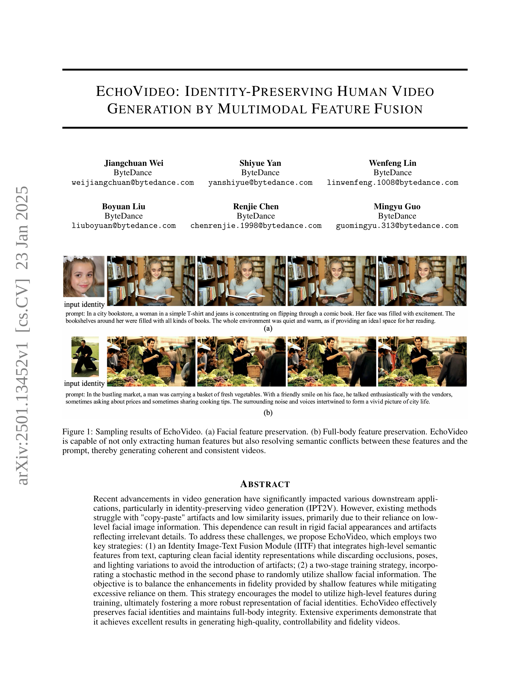
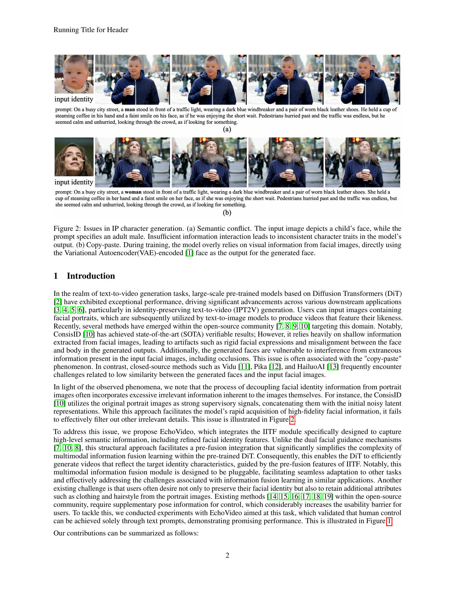
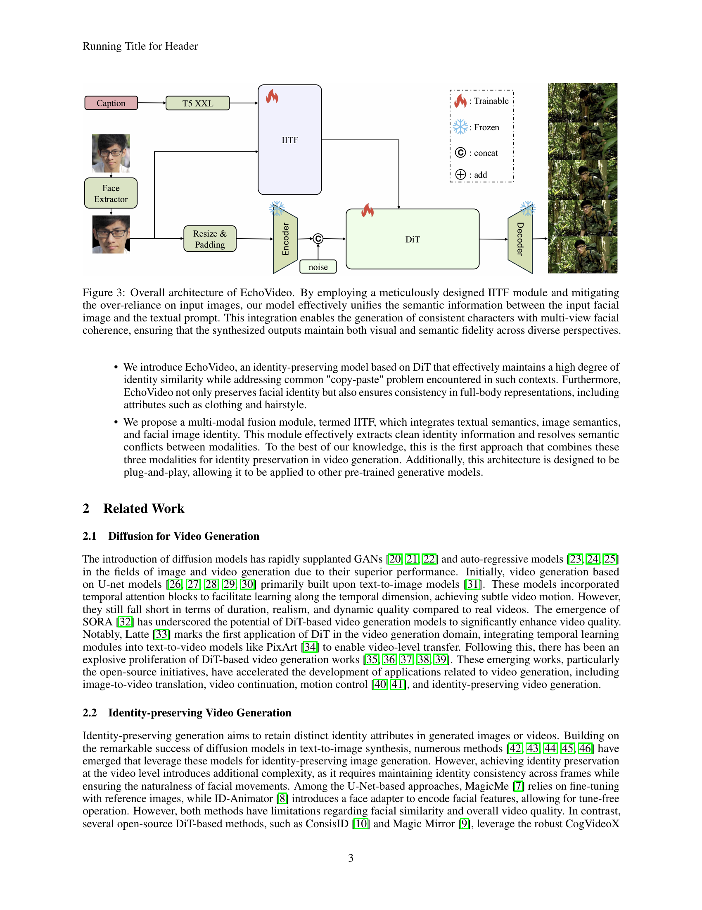
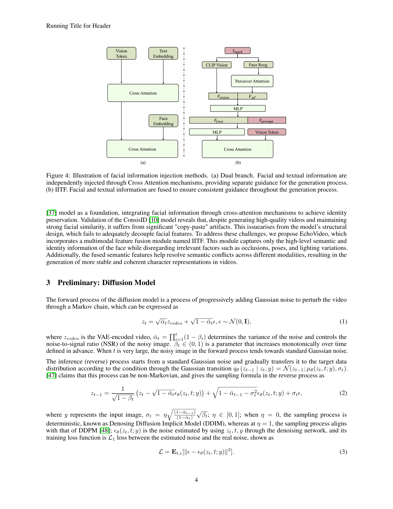
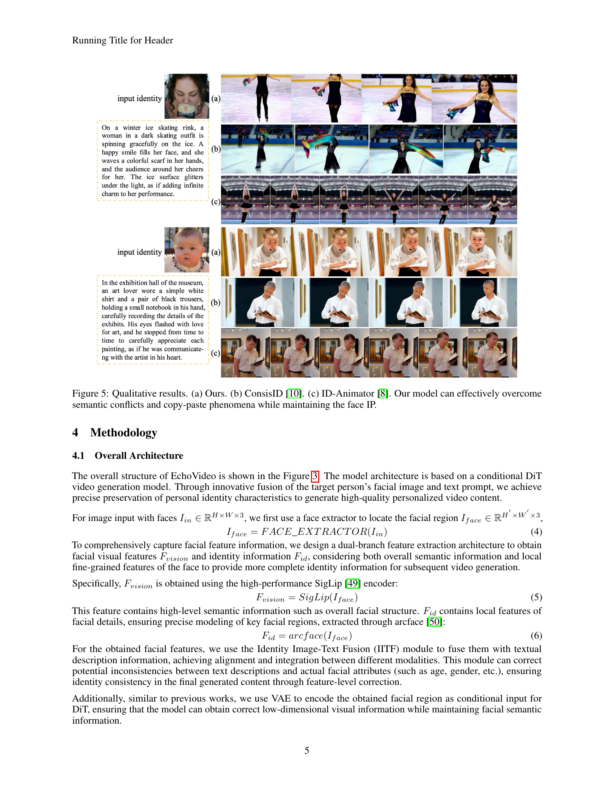
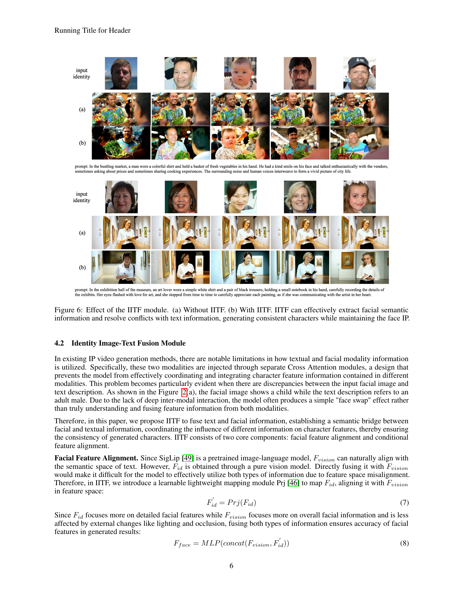
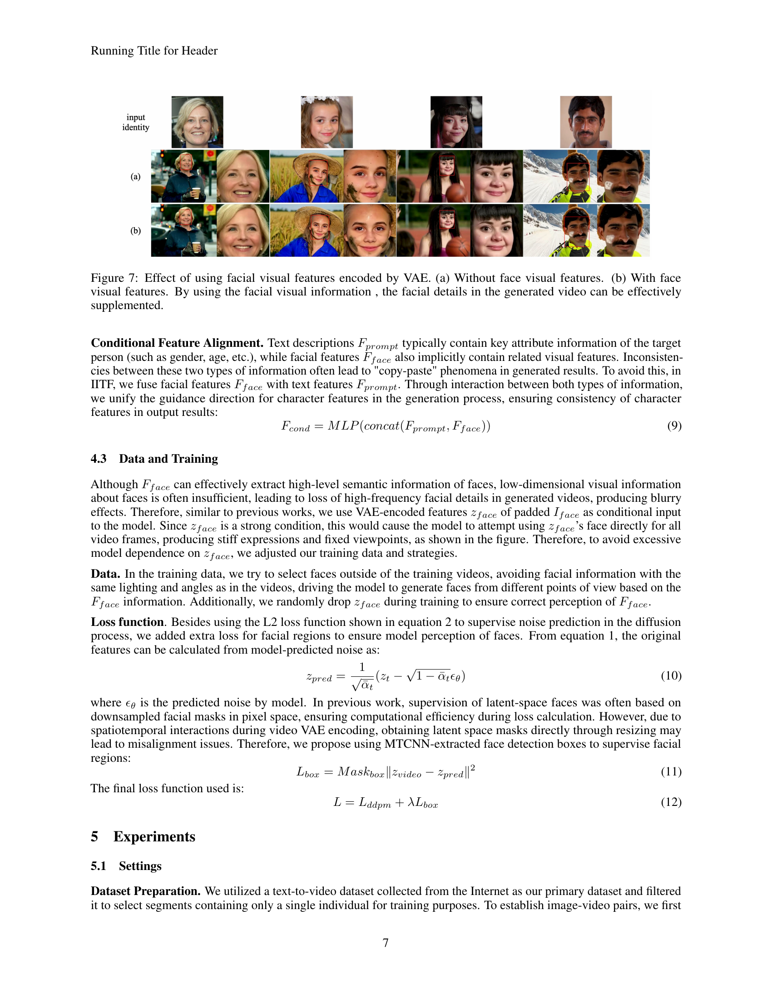
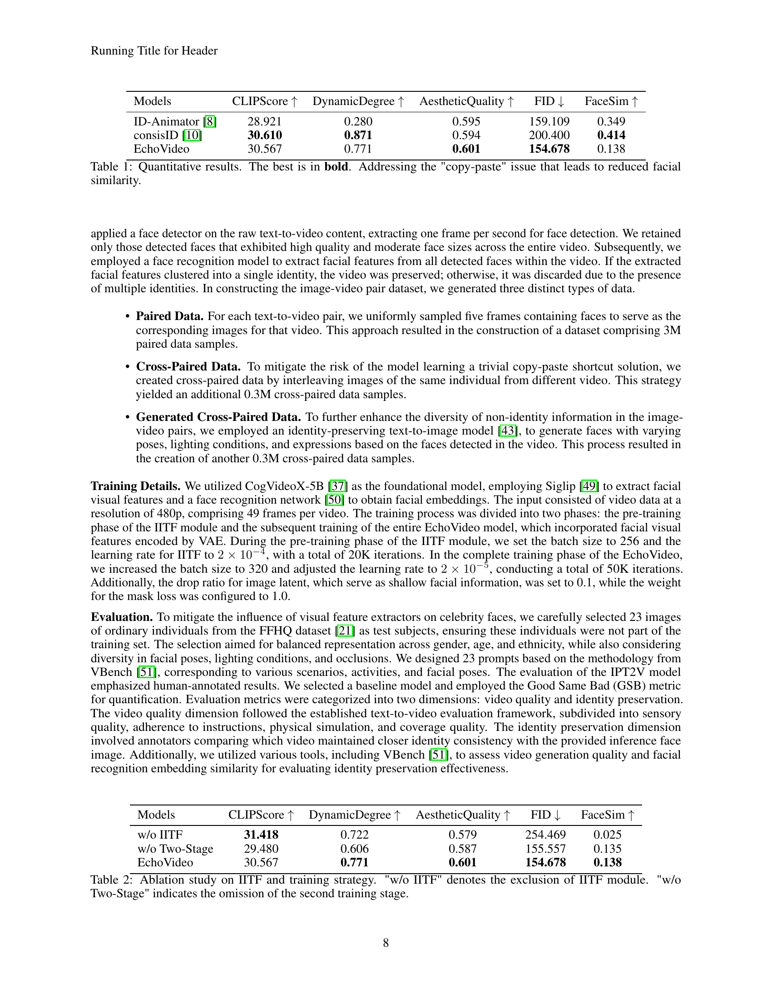
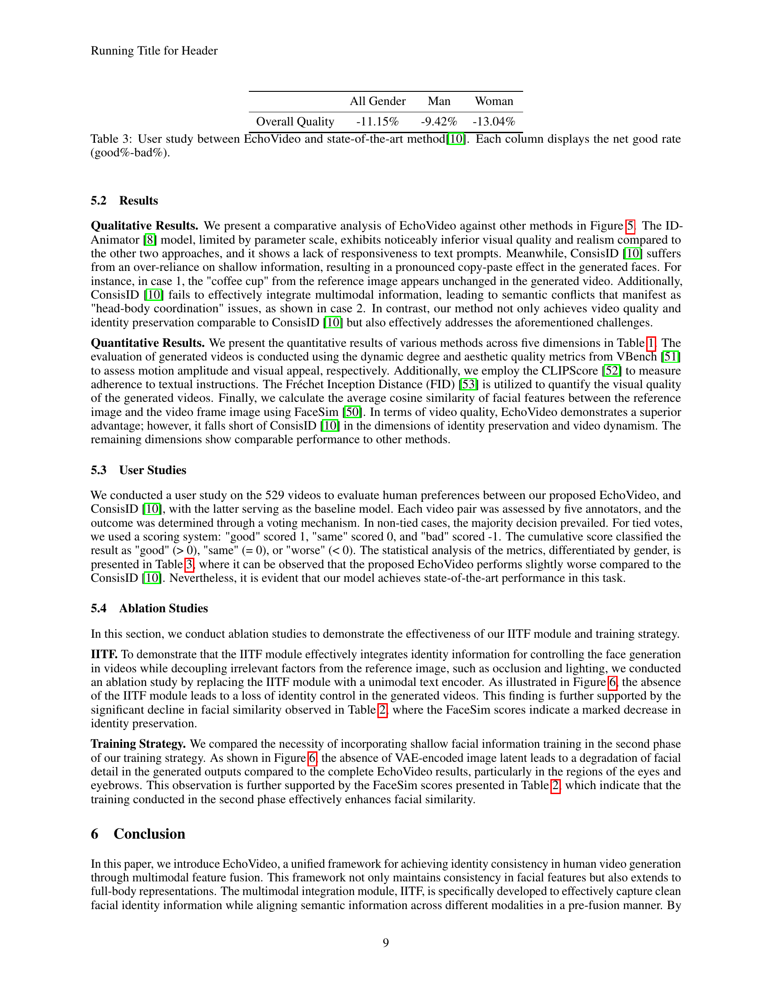
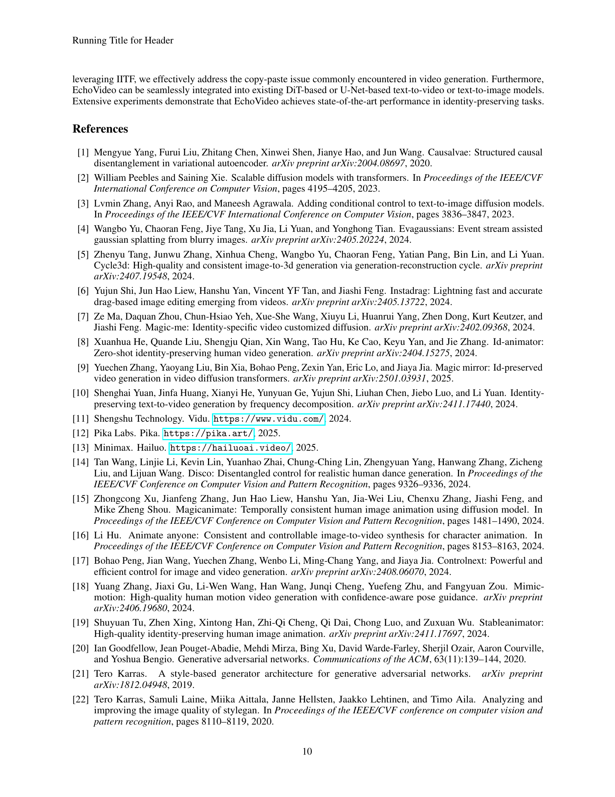
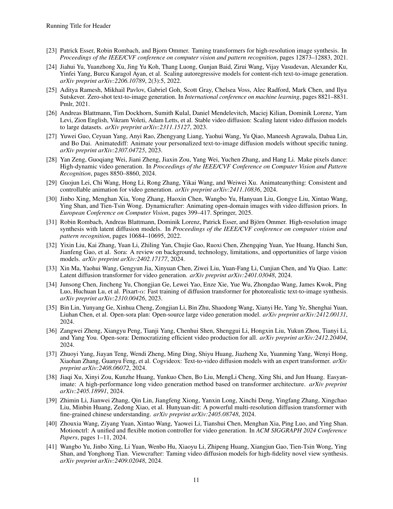
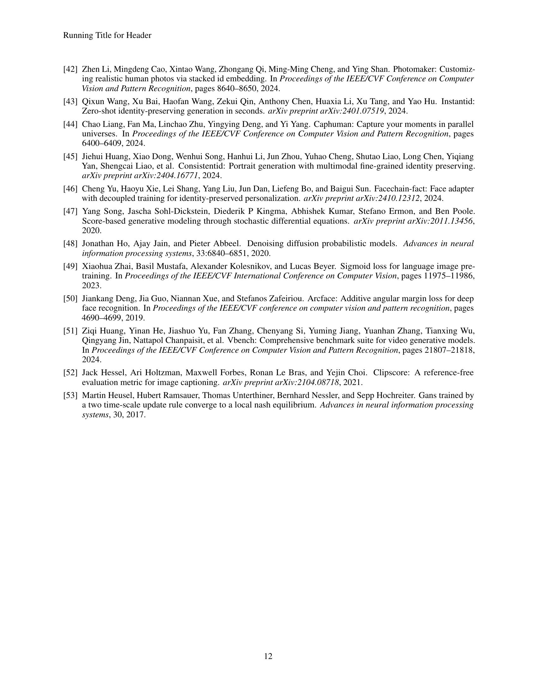
