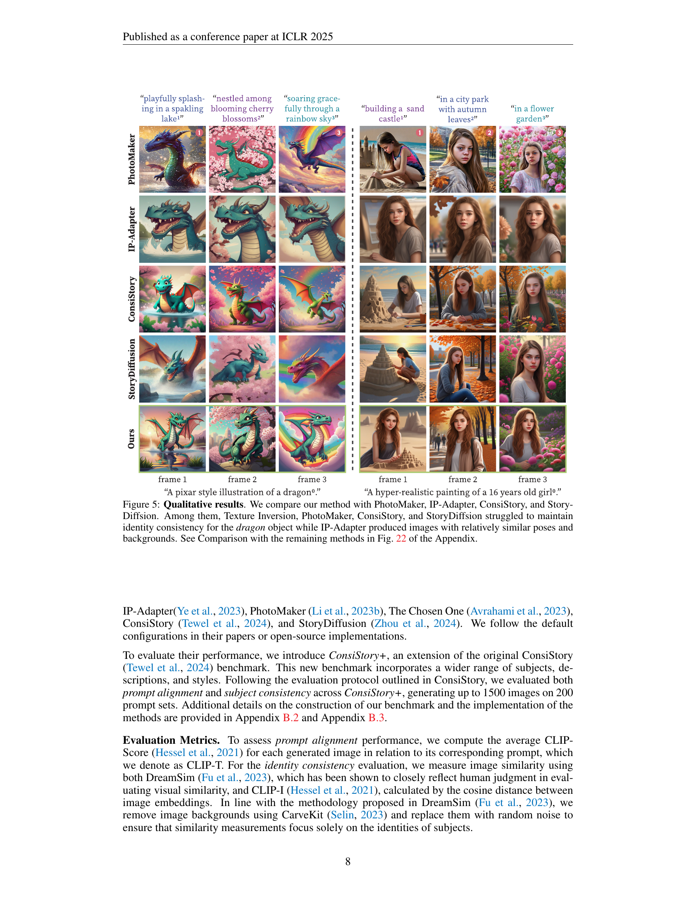

 


 2501.13554 
 Tao Liu et el. 
 
 🤗 2025-01-24 
 



↗ arXiv


↗ Hugging Face


↗ Papers with Code


### TL;DR



텍스트-이미지 생성 모델은 입력 프롬프트로부터 고품질 이미지를 생성할 수 있지만, 스토리텔링처럼 일관된 개체를 유지하는 데 어려움을 겪습니다. 기존의 접근 방식은 대규모 데이터셋에서의 광범위한 훈련이나 원래 모델 아키텍처의 추가적인 수정이 필요했습니다. 이는 다양한 도메인과 확산 모델 구성에 대한 적용성을 제한합니다.

본 논문에서는 'One-Prompt-One-Story'(1Prompt1Story) 라는 새로운 훈련 없는 방법을 제안합니다. 이 방법은 모든 프롬프트를 단일 입력으로 연결하여 개체의 일관성을 유지하고, Singular-Value Reweighting과 Identity-Preserving Cross-Attention이라는 두 가지 새로운 기법을 사용하여 생성 과정을 개선합니다. 실험 결과, 1Prompt1Story는 정량적 지표와 정성적 평가 모두에서 기존의 일관된 텍스트-이미지 생성 방법보다 우수한 성능을 보였습니다.



#### Key Takeaways


 단일 프롬프트를 사용하여 일관된 텍스트-이미지 생성이 가능함 



 언어 모델의 맥락 일관성을 활용, 기존의 방법들과 달리 추가적인 훈련 없이도 가능함 



 정량적 및 정성적 평가를 통해 기존 방법들보다 우수한 성능을 입증 


#### Why does it matter?
**본 논문은 단일 프롬프트를 사용하여 일관된 텍스트-이미지 생성을 달성하는 새로운 방법을 제시함으로써, 스토리텔링 및 애니메이션과 같은 다양한 응용 분야에 중요한 영향을 미칩니다.**  기존의 방법들은 대규모 데이터셋 학습이나 모델 아키텍처 수정이 필요했지만, 이 연구는 언어 모델의 고유한 맥락 일관성을 활용하여 훈련 없이도 일관성 있는 이미지 생성을 가능하게 합니다. **이는 연구자들에게 다양한 분야와 모델 구성에 적용 가능한 새로운 가능성을 열어주는 중요한 발견입니다.** 또한, 본 연구는 정량적 지표와 정성적 평가를 통해 그 효과를 입증함으로써, **향후 일관된 텍스트-이미지 생성에 관한 연구의 새로운 방향을 제시합니다.**

------
#### Visual Insights

> 🔼 그림 1은 일관된 텍스트-이미지 생성(T2I)에서 기존 방법들이 직면하는 문제점과 제안하는 방법의 우수성을 보여줍니다. 상단에는 SDXL과 Juggernaut-X-v10과 같은 기존 T2I 모델들이 생성한 이미지에서 주목할 만한 정도의 신원 불일치가 발생하는 것을 보여줍니다. IP-Adapter와 ConsiStory 같은 최신 방법들이 신원 일관성을 개선했지만 생성된 이미지와 입력 프롬프트 간의 정렬이 떨어지는 문제가 있음을 보여줍니다. 하단에는 본 논문에서 제안하는 1Prompt1Story 방법이 텍스트와 이미지 간의 정렬을 유지하면서 우수한 일관성을 보여주는 추가 결과를 제시합니다.  즉, 기존 모델들은 여러 장면에 걸쳐 일관된 이미지를 생성하는 데 어려움을 겪고, 최근 연구들은 일관성을 개선했지만 텍스트와 이미지의 일치성이 떨어지는 반면, 본 논문의 방법은 두 가지 모두를 만족한다는 것을 보여줍니다.
> 

> 
read the caption

> Figure 1:  Existing methods (up) encounter challenges in consistent T2I generation. T2I models such as SDXL (Podell et al., 2023) and Juggernaut-X-v10 (RunDiffusion, 2024) often exhibit noticeable identity inconsistency across generated images. Although recent methods including IP-Adapter and ConsiStory have improved identity consistency, they lost the alignment between the generated images and corresponding input prompts. Additional results of our 1Prompt1Story (down) demonstrate superior consistency without compromising the alignment between text and images.
> 


| Method | Base Model | Train-Free | CLIP-T↑ | CLIP-I↑ | DreamSim↓ | Steps | Memory (GB)↓ | Inference Time (s)↓ |
|---|---|---|---|---|---|---|---|---|
| Vanilla SD1.5 | - | - | 0.8353 | 0.7474 | 0.5873 | 50 | 4.73 | 2.4657 |
| Vanilla SDXL | - | - | 0.9074 | 0.8165 | 0.5292 | 50 | 16.04 | 13.0890 |
| BLIP-Diffusion | SD1.5 | ✗ | 0.7607 | 0.8863 | 0.2830 | 26 | 7.75 | 1.9284 |
| Textual Inversion | SDXL | ✗ | 0.8378 | 0.8229 | 0.4268 | 40 | 32.94 | 282.507 |
| The Chosen One | SDXL | ✗ | 0.7614 | 0.7831 | 0.4929 | 35 | 10.93 | 11.2073 |
| PhotoMaker | SDXL | ✗ | 0.8651 | 0.8465 | 0.3996 | 50 | 23.79 | 18.0259 |
| IP-Adapter | SDXL | ✗ | **0.9429** | **0.1462** | 30 | 19.39 | 13.4594 |
| ConsiStory | SDXL | ✓ | 0.8769 | 0.8737 | 0.3188 | 50 | 34.55 | 34.5894 |
| StoryDiffusion | SDXL | ✓ | 0.8877 | 0.8755 | 0.3212 | 50 | 45.61 | 25.6928 |
| *Naive Prompt Reweighting* (NPR) | SDXL | ✓ | 0.8411 | 0.8916 | 0.2548 | 50 | 16.04 | 17.2413 |
| *1Prompt1Story* (Ours) | SDXL | ✓ | **0.9117** | **0.1993** | 50 | 18.70 | 23.2088 |

> 🔼 표 1은 다양한 일관된 텍스트-이미지 생성 방법들의 정량적 비교 결과를 보여줍니다.  각 방법의 성능은 CLIP-T (텍스트-이미지 정렬 점수), CLIP-I (이미지 일관성 점수), DreamSim (이미지 유사도 점수) 세 가지 지표로 평가되었습니다.  표에는 각 방법에 대한 세 지표의 점수와 함께 학습 여부, 사용된 기본 모델, 추론에 필요한 시간 및 메모리 사용량 등의 정보도 포함되어 있습니다.  Vanilla SD1.5 및 Vanilla SDXL은 참조용으로만 제시되었으며 비교 대상에서 제외되었습니다.  가장 높은 점수는 굵은 글씨체로 강조 표시되었고, 두 번째로 높은 점수는 밑줄이 그어져 있습니다.
> 

> 
read the caption

> Table 1: Quantitative comparison. The best and second best results are highlighted in bold and underlined, respectively. Vanilla SD1.5 and Vanilla SDXL are shown as references and excluded from this comparison.
> 

### In-depth insights

#### Context Consistency
본 논문에서 제시된 'Context Consistency'는 언어 모델의 고유한 특징으로, **단일 프롬프트 내에서도 문맥을 통해 정체성을 이해하는 능력**을 의미합니다. 이는 기존의 일관된 텍스트-이미지 생성 방법들이 대규모 데이터셋 학습이나 모델 구조 수정에 의존하는 것과 대조적입니다.  **단일 프롬프트 내에 모든 프롬프트를 연결**함으로써, 1Prompt1Story는 이러한 언어 모델의 능력을 활용하여 일관성 있는 이미지 생성을 달성합니다.  즉, **문맥 일관성을 통해 여러 장면에 걸쳐 등장인물의 정체성을 유지**하는 것입니다.  이러한 방식은 다양한 도메인과 확산 모델 구성에 적용 가능하며, 추가적인 학습 없이도 우수한 성능을 보여주는 **훈련-무료 방법**임을 시사합니다.  이는 기존 방법들의 한계를 극복하고 효율적인 일관된 이미지 생성을 가능하게 하는 핵심적인 아이디어로 볼 수 있습니다.

#### SVR & IPCA
본 논문에서 제안하는 일련의 방법론은 **단일 프롬프트 내에서 일관성 있는 텍스트-이미지 생성을 달성하기 위해 특이값 재가중치 부여(SVR)와 ID 보존 교차 어텐션(IPCA)을 사용**합니다. SVR은 개별 프롬프트의 영향력을 조절하여 특정 프롬프트를 강조하고 다른 프롬프트의 영향을 감소시켜 프롬프트 간의 혼동을 줄이는 역할을 합니다. 이를 통해 각 프레임의 의미가 단일 프롬프트 내에서 개별적으로 잘 표현될 수 있도록 개선합니다.  **IPCA는 교차 어텐션 레이어에서 주체의 일관성을 강화**합니다. 이는 특이값 재가중치 부여 단계에서 프롬프트의 의미 표현을 개선한 후, 교차 어텐션 메커니즘을 통해 각 프레임의 이미지 생성 과정에서 주체의 일관성을 더욱 향상시키는 역할을 합니다.  **SVR과 IPCA는 상호 보완적인 관계**를 가지며, 단순히 프롬프트를 연결하는 것보다 더욱 정교하고 효과적인 텍스트-이미지 정렬 및 일관성 있는 이미지 생성을 가능하게 합니다.  **본 논문의 핵심은 단일 프롬프트의 문맥적 일관성을 활용**하여 추가적인 미세 조정이나 복잡한 모듈 설계 없이도 일관성 있는 이미지 생성을 달성할 수 있다는 점에 있습니다. 이러한 접근 방식은 다양한 도메인과 확산 모델 구성에 걸쳐 적용 가능성을 높입니다.

#### 1Prompt1Story
논문에서 제시된 "1Prompt1Story"는 **단일 프롬프트를 사용하여 일관된 텍스트-이미지 생성을 달성하는 혁신적인 방법**입니다. 기존의 방법들은 여러 프롬프트를 사용하거나, 모델을 추가로 훈련시켜야 하는 등의 제약이 있었지만, 1Prompt1Story는 **단일 프롬프트에 모든 프롬프트를 연결**하여 일관성을 유지하는 동시에 **각 프레임에 대한 설명을 개별적으로 반영**하는 데 성공했습니다. 특히, **Singular-Value Reweighting**과 **Identity-Preserving Cross-Attention**이라는 두 가지 새로운 기법을 통해 프롬프트의 중요도를 조절하고, 이미지와 텍스트의 정합성을 높였습니다. **훈련이 필요없는 비지도 학습 방식**이기 때문에 다양한 분야와 모델에 적용할 수 있다는 장점도 가지고 있습니다.  이는 **언어 모델의 맥락 일관성(context consistency)**을 활용하여 단일 프롬프트로도 여러 장면에 걸쳐 등장인물의 일관성을 유지할 수 있다는 점을 보여주는 획기적인 결과입니다.  **정량적 및 정성적 평가를 통해 기존 방법들보다 우수한 성능**을 입증하였으며, 향후 애니메이션, 스토리텔링, 비디오 생성 등 다양한 분야에 적용될 가능성이 높습니다.  **훈련 과정 없이 높은 성능**을 보이는 점은 특히 주목할 만하며,  향후 연구에서 더욱 발전된 형태로 활용될 것으로 예상됩니다.

#### Ablation Study
본 논문의 **절제 연구(Ablation Study)**는 제안된 방법의 각 구성 요소의 중요성을 평가하는 데 중점을 둡니다.  **단일 프롬프트-단일 스토리(One-Prompt-One-Story)** 기법의 핵심인 특이값 재가중치 부여(Singular-Value Reweighting)와 ID 보존 크로스 어텐션(Identity-Preserving Cross-Attention)의 영향을 개별적으로, 그리고 결합적으로 분석합니다.  **특이값 재가중치 부여**는 프롬프트 내 개별 프레임 설명의 중요도를 조절하여 각 프레임 이미지의 정렬도를 높이는 데 기여하는 반면, **ID 보존 크로스 어텐션**은 일관된 주제를 유지하는 데 도움을 줍니다.  절제 연구를 통해 각 구성 요소가 최종 결과에 미치는 영향을 정량적 및 정성적으로 모두 측정하여, **전체 시스템의 성능에 대한 각 요소의 기여도를 명확하게 보여줍니다.**  이는 **방법의 강건성과 신뢰성을 입증**하는 중요한 과정이며, 단순히 최종 결과만 제시하는 것이 아니라 **각 구성 요소의 기능과 상호작용을 심층적으로 이해**하는 데 도움을 주는 부분입니다.

#### Future Work
본 논문의 One-Prompt-One-Story 기법은 훈련 없이도 일관된 텍스트-이미지 생성을 달성하지만, 몇 가지 제한점이 있습니다. **향후 연구 방향**으로는 첫째, 프롬프트 길이 제한을 극복하기 위한 연구가 필요합니다. 현재는 단일 프롬프트의 길이 제한으로 인해 장편 스토리 생성에 어려움이 있습니다.  둘째, **다양한 이미지 생성 모델**에 대한 적용성을 확장해야 합니다. 본 논문에서는 SDXL 모델을 사용했지만, 다른 모델들에 대한 호환성 및 성능 개선 연구가 필요합니다. 셋째, **다중 주제 스토리 생성**에 대한 연구가 필요합니다. 현재는 단일 주제에 대한 일관된 이미지 생성에 초점을 맞추고 있으나, 다양한 주제와 등장인물이 있는 복잡한 스토리 생성을 위한 기술 개발이 중요합니다. 마지막으로, **사용자 참여형 스토리텔링** 기능을 추가하는 연구를 진행해야 합니다. 사용자가 스토리 진행에 직접 참여하고, 이미지 생성 결과를 실시간으로 피드백하여 스토리를 더욱 풍성하게 만들 수 있는 시스템 개발을 고려해야 합니다. 이러한 개선을 통해 One-Prompt-One-Story 기법의 실용성을 높이고 다양한 분야에 적용 가능성을 확대할 수 있을 것입니다.

### More visual insights

More on figures

> 🔼 그림 2는 텍스트 임베딩의 t-SNE 시각화를 보여줍니다. 왼쪽 패널은 단일 프롬프트 생성에서의 프롬프트 임베딩 간의 거리가 다중 프롬프트 생성에 비해 훨씬 가깝다는 것을 보여줍니다. 이는 단일 프롬프트 내에서 문맥적 일관성이 유지되어 각 프롬프트가 개별적으로 표현되는 것이 아니라 상호 작용한다는 것을 시사합니다. 오른쪽 패널은 차원 축소 후 ConsiStory+ 벤치마크의 모든 프롬프트 세트에 대해 해당 점 집합 간의 평균 거리를 평가한 통계적 결과를 보여줍니다. 단일 프롬프트 생성에서의 텍스트 임베딩 간의 평균 거리가 다중 프롬프트 생성보다 훨씬 작다는 것을 보여줍니다. 이는 단일 프롬프트 접근 방식이 다중 프롬프트 접근 방식보다 더 나은 일관성을 제공함을 시사합니다.
> 

> 
read the caption

> Figure 2: t-SNE visualization of text embeddings (Left): 𝒄𝒫isuperscript𝒄subscript𝒫𝑖\bm{c}^{\mathcal{P}_{i}}bold_italic_c start_POSTSUPERSCRIPT caligraphic_P start_POSTSUBSCRIPT italic_i end_POSTSUBSCRIPT end_POSTSUPERSCRIPT from single-prompt generation are closer together compared to those from multi-prompt generation. Statistical results (Right): We evaluated the average distances between the corresponding point sets of all prompt sets on the ConsiStory+ benchmark after dimensionality reduction. The average distance between text embeddings from single-prompt generation is smaller than that from multi-prompt generation.
> 

> 🔼 그림 3은 일관된 텍스트-이미지 생성을 위한 세 가지 방법(SDXL, NPR, 1Prompt1Story)의 결과를 비교 분석한 그림입니다. (왼쪽) SDXL은 여러 개의 프롬프트를 사용하여 이미지를 생성하는 반면, NPR과 1Prompt1Story는 단일 프롬프트를 사용합니다. (중간) DINO-v2를 사용하여 이미지 특징을 추출하고 t-SNE를 이용하여 2차원 공간에 시각화했습니다. 이를 통해, 1Prompt1Story가 SDXL보다 일관성 있는 결과를 생성함을 보여줍니다. (오른쪽) 확장된 ConsiStory+ 벤치마크 데이터셋에서 생성된 이미지들의 평균 특징 거리를 통계적으로 분석하여, 1Prompt1Story가 더 나은 일관성을 가짐을 확인했습니다.
> 

> 
read the caption

> Figure 3: (Left): SDXL generates frame images using multi-prompt generation, while Naive Prompt Reweighting (NPR) and our method utilize the single-prompt setup. (Mid): Image features are extracted by DINO-v2 (Oquab et al., 2023) and visualized by the t-SNE reduction. Naive Prompt Reweighting and 1Prompt1Story show more consistent identity generations than the SDXL model. (Right): Statistics of the average feature distances among generated images from the prompts in our extended ConsiStory+ benchmark, which further confirms that 1Prompt1Story produces better identity consistency.
> 

> 🔼 그림 4는 본 논문에서 제안하는 One-Prompt-One-Story 방법의 전체 과정을 보여줍니다. (a)는 먼저 identity prompt와 frame prompt들을 하나의 prompt로 결합한 후, Singular-Value Reweighting (SVR)과 Identity-Preserving Cross-Attention (IPCA)을 적용하여 일관된 이미지를 생성하는 과정을 나타냅니다. (b)는 SVR 단계에서 먼저 표현하고자 하는 부분(express set, 빨간색 화살표)의 의미 정보를 강화하고, 그 다음 표현하지 않을 부분(suppress set, 파란색 화살표)의 의미 정보를 반복적으로 약화시키는 과정을 보여줍니다. (c)는 IPCA 단계에서  K̃과 𝐾̄, 그리고 𝑉̃과 𝑉̄를 연결하여 일관성을 향상시키는 방법을 보여줍니다.  전체적으로, 이 그림은 One-Prompt-One-Story 방법의 핵심적인 두 가지 기술인 SVR과 IPCA의 작동 방식을 시각적으로 설명하고 있습니다.
> 

> 
read the caption

> Figure 4: (a): The overall pipeline of 1Prompt1Story. We combine the identity prompt and frame prompts into a single prompt, then we apply both Singular-Value Reweighting (SVR) and Identity-Preserving Cross-Attention (IPCA) to generate identity-consistent images. (b): During SVR, we first enhance the semantic information of the express set 𝒳e⁢x⁢psuperscript𝒳𝑒𝑥𝑝\mathcal{X}^{exp}caligraphic_X start_POSTSUPERSCRIPT italic_e italic_x italic_p end_POSTSUPERSCRIPT (red arrow), then iteratively weaken the semantics for the suppress set 𝒳s⁢u⁢psuperscript𝒳𝑠𝑢𝑝\mathcal{X}^{sup}caligraphic_X start_POSTSUPERSCRIPT italic_s italic_u italic_p end_POSTSUPERSCRIPT (blue arrow). (c): In IPCA, we concatenate 𝒦~~𝒦\tilde{\mathcal{K}}over~ start_ARG caligraphic_K end_ARG with 𝒦¯¯𝒦\bar{\mathcal{K}}over¯ start_ARG caligraphic_K end_ARG and 𝒱~~𝒱\tilde{\mathcal{V}}over~ start_ARG caligraphic_V end_ARG with 𝒱¯¯𝒱\bar{\mathcal{V}}over¯ start_ARG caligraphic_V end_ARG to improve identity consistency.
> 

> 🔼 그림 5는 본 논문에서 제안하는 방법인 1Prompt1Story를 PhotoMaker, IP-Adapter, ConsiStory, StoryDiffusion 등 기존 방법들과 비교하여 일관된 이미지 생성 능력을 보여주는 그림입니다. 기존 방법들은 용(dragon) 이미지 생성에서 일관성을 유지하는 데 어려움을 겪었으나, 제안하는 방법은 용의 신원을 일관되게 유지하면서 다양한 장면을 효과적으로 표현합니다. 반면 IP-Adapter는 비슷한 자세와 배경을 가진 이미지를 생성하는 경향이 있습니다. 부록 그림 22에는 다른 방법들과의 추가 비교 결과가 제시되어 있습니다.
> 

> 
read the caption

> Figure 5: Qualitative results. We compare our method with PhotoMaker, IP-Adapter, ConsiStory, and StoryDiffsion. Among them, Texture Inversion, PhotoMaker, ConsiStory, and StoryDiffsion struggled to maintain identity consistency for the dragon object while IP-Adapter produced images with relatively similar poses and backgrounds. See Comparison with the remaining methods in Fig. 22 of the Appendix.
> 

> 🔼 본 논문의 그림 캡션은 사용자 선호도에 따라 가장 일관된 텍스트-이미지 생성 방법을 투표한 37명의 사용자 연구 결과를 보여주는 표를 설명합니다.  표는 각 방법에 대한 선호도 비율을 백분율로 나타내어, 사용자들이 어떤 방법을 가장 일관성 있는 이미지 생성 방법으로 평가했는지 보여줍니다. 본 연구는 다양한 방법의 일관성 있는 이미지 생성 능력에 대한 비교 분석 결과를 제시하며, 제시된 방법들의 장단점을 보다 명확하게 이해하는 데 도움을 줍니다.
> 

> 
read the caption

> Table 2: User study with 37 people to vote for the best consistent T2I generation method according to human preference.
> 

> 🔼 표 3은 논문의 3.2절 'One-Prompt-One-Story'에서 제안된 방법인 1Prompt1Story의 각 구성 요소의 영향을 평가한 실험 결과를 보여줍니다.  구체적으로 Singular-Value Reweighting (SVR)의 두 가지 변형(SVR+, SVR-)과 Identity-Preserving Cross-Attention (IPCA)의 적용 유무에 따른 성능 변화를 정량적으로 분석합니다.  각 구성 요소들이 최종 결과에 미치는 영향을 파악하여 1Prompt1Story의 성능 향상에 기여한 부분을 명확히 보여줍니다. CLIP-T, CLIP-I, DreamSim 세 가지 지표를 사용하여 정량적인 비교 분석을 수행합니다.
> 

> 
read the caption

> Table 3: Ablation study. We evaluated the influence of each component in 1Prompt1Story, including the Singular-Value Reweighting (SVR+ and SVR-), and Identity-Preserving Cross-Attention (IPCA).
> 

> 🔼 그림 6은 프롬프트 정렬과 정체성 일관성 간의 관계를 보여줍니다.  x축은 프롬프트 정렬 성능을, y축은 정체성 일관성 성능을 나타냅니다.  각 점은 서로 다른 방법으로 생성된 이미지의 성능을 나타내며, 1Prompt1Story 방법은 오른쪽 상단에 위치하여 프롬프트 정렬과 정체성 일관성 모두에서 가장 우수한 성능을 보임을 시각적으로 보여줍니다.  즉,  1Prompt1Story는 입력 프롬프트에 대한 이미지 생성의 정확성이 높고, 동시에 생성된 이미지들 내에서 주제의 일관성도 잘 유지함을 의미합니다.
> 

> 
read the caption

> Figure 6: Prompt alignment vs. identity consistency. Our method 1Prompt1Story is positioned in the upper right corner.
> 

> 🔼 본 그림은 논문의 3.2절 One-Prompt-One-Story에서 제안된 방법의 각 구성 요소(Singular-Value Reweighting, Identity-Preserving Cross-Attention)들이 얼마나 효과적으로 이미지 생성에 기여하는지를 보여주는 추가적인 실험 결과입니다.  각 구성요소를 제외한 경우(ablated cases) 이미지 생성 결과가 전체 시스템(full method)에 비해 프롬프트 정합성(prompt alignment) 및 항등성 일관성(identity consistency) 측면에서 효과적으로 이미지를 생성하지 못함을 보여줍니다.  즉, 각 구성요소가 이미지 생성의 일관성과 정확성에 중요한 역할을 한다는 것을 시각적으로 증명하는 것입니다.
> 

> 
read the caption

> Figure 7: Qualitative ablation study. All ablated cases with incomplete components of 1Prompt1Story struggle to achieve both prompt alignment and identity consistency as effectively as our full method.
> 

> 🔼  그림 8은 1Prompt1Story 기법의 활용성을 보여주는 두 가지 예시를 제시합니다. (왼쪽) ControlNet과의 통합을 통해 일관된 캐릭터 생성에 공간적 제어 기능을 추가할 수 있음을 보여줍니다. 즉, 사용자가 원하는 특정 공간적 제약 조건(예: 특정 자세나 위치)을 부여하여 이미지를 생성할 수 있습니다. (오른쪽) PhotoMaker와 같은 다른 기법과 결합하여 실제 이미지 개인화를 통해 개선된 ID 일관성을 달성할 수 있음을 보여줍니다. 즉, 기존 이미지를 기반으로 새로운 이미지를 생성할 때, 원본 이미지의 특징을 유지하면서도 일관된 ID를 유지할 수 있습니다.  이는 1Prompt1Story 기법이 다양한 다른 기법들과의 호환성 및 확장성을 갖추고 있음을 시사합니다.
> 

> 
read the caption

> Figure 8: (Left): Our method 1Prompt1Story can integrate with ControlNet to enable spatial control for consistent character generation. (Right): Additionally, our method can also combine with other methods, such as PhotoMaker, to achieve real-image personalization with improved identity consistency.
> 

> 🔼  그림 9는 논문의 방법론 섹션에 있는 그림으로, 기존 일관된 텍스트-이미지 생성 벤치마크인 ConsiStory의 프롬프트 세트를 확장하는 방법을 보여줍니다. (왼쪽) 원래 프롬프트 세트의 길이를 5~10개의 임의의 숫자로 확장하는 과정을 보여줍니다. (오른쪽) '동화'라는 새로운 상위 클래스 내에서 새로운 프롬프트 세트를 생성하는 과정을 보여줍니다.  이는 단일 프롬프트 내에 여러 프롬프트를 연결하여 일관된 텍스트-이미지 생성을 달성하는 One-Prompt-One-Story 방법의 핵심적인 부분을 보여주는 예시입니다.  즉, 하나의 긴 문장으로 모든 프롬프트를 통합하여 일관성을 유지하는 방법을 시각적으로 설명합니다.
> 

> 
read the caption

> Figure 9: (Left): We expand the length of the original prompt sets to a random number between 5 and 10. (Right): We generate a new prompt set within one of the new superclass “fairy tales”.
> 

> 🔼 그림 10은 프롬프트 순서에 대한 1Prompt1Story 방법의 강건성을 보여줍니다. 동일한 프롬프트 세트를 사용하지만 다른 순서로 입력했을 때도, 1Prompt1Story는 일관되게 통일된 정체성을 가진 이미지들을 생성합니다. 이는 다양한 프롬프트 순서에도 모델이 일관된 결과를 생성할 수 있음을 의미합니다.  이는 모델의 안정성과 신뢰성을 보여주는 중요한 지표입니다.
> 

> 
read the caption

> Figure 10: Robustness to frame prompts order. With the same set of frame prompts but in different orders, our method 1Prompt1Story consistently generates images with a unified identity.
> 

> 🔼 그림 11은 단일 프롬프트 내 여러 프롬프트의 영향을 최소화하여 일관된 이미지 생성을 달성하기 위한 Singular-Value Reweighting (SVR) 기법의 효과를 보여줍니다. (왼쪽) SVR+를 먼저 적용한 후 SVR-를 적용하는 방법과 그 반대의 경우를 비교합니다. 같은 시드를 사용했을 때 두 방법 모두 유사한 결과를 생성함을 보여줍니다. (오른쪽) 모든 프롬프트의 임베딩을 병합하여 SVR-을 적용하는 'Joint Suppress' 방법과 각 프롬프트에 대해 SVR-을 반복적으로 적용하는 'Iterative Suppress' 방법을 비교합니다. 'Joint Suppress' 방법은 첫 번째 행의 첫 번째 및 세 번째 열에서 볼 수 있듯이 유사한 배경을 가진 이미지를 생성하는 반면, 'Iterative Suppress' 방법은 다른 프롬프트의 영향을 더 효과적으로 최소화합니다.
> 

> 
read the caption

> Figure 11: (Left): “SVR+ First” indicates that SVR+ is applied before SVR- in the Singular-Value Reweighting process, while “SVR- First” means the opposite order. We found that both sequences yield similar results (same seed). (Right): Compared to “Joint Suppress”, “Iterative Suppress” is more effective at minimizing the influence of other frame prompts when generating images for the current frame. “Joint Suppress” produces images with similar backgrounds (the first row, first and third columns).
> 

> 🔼 그림 12는 아이덴티티 강화를 위한 특이값 재가중치 부여(SVR) 기법의 효과를 보여줍니다. 첫 번째 줄은 프레임 프롬프트에만 강화를 적용한 기존 SVR의 결과를 보여주고, 두 번째 줄은 아이덴티티 프롬프트까지 추가적으로 강화하여 개선한 결과를 보여줍니다. 결과적으로 두 번째 방법이 아이덴티티 일관성을 향상시키지만, 객체의 자세와 배경이 더 유사해지는 경향이 있음을 보여줍니다. 즉, 아이덴티티 일관성을 높이면 객체의 자세와 배경의 다양성이 줄어들 수 있다는 것을 시각적으로 보여주는 그림입니다.
> 

> 
read the caption

> Figure 12: SVR with identity enhancement. The first row represents the original SVR with enhancements applied only to the frame prompt. The second row builds upon the original by further enhancing the identity prompt in the SVR+ module. The results indicate that while the second method improves identity consistency, it also leads to more similar object poses and backgrounds.
> 

> 🔼 그림 13은 cEOT에 대한 추가적인 ablation 연구 결과를 보여줍니다. 왼쪽 세 장의 이미지는 본문에서 설명된 SVR 절차와 달리, cEOT를 고정시킨 채 SVR 프로세스를 진행한 결과입니다. 반면 오른쪽 세 장의 이미지는 본문에 기술된 SVR 절차에 따른 결과입니다. 결과적으로 cEOT를 동적으로 업데이트하지 않으면 서로 다른 프레임 프롬프트에 대해 생성된 이미지에서 배경이 혼합되는 현상이 나타나며, 이는 cEOT를 동적으로 업데이트하는 것이 중요함을 보여줍니다.
> 

> 
read the caption

> Figure 13: Ablation study for cEOTsuperscript𝑐EOT\bm{c}^{\text{EOT}}bold_italic_c start_POSTSUPERSCRIPT EOT end_POSTSUPERSCRIPT. The left three images demonstrate the SVR process with a fixed 𝒄EOTsuperscript𝒄EOT\bm{c}^{\text{EOT}}bold_italic_c start_POSTSUPERSCRIPT EOT end_POSTSUPERSCRIPT, while the right illustrates the SVR procedure described in the main text. The results indicate that keeping 𝒄EOTsuperscript𝒄EOT\bm{c}^{\text{EOT}}bold_italic_c start_POSTSUPERSCRIPT EOT end_POSTSUPERSCRIPT unchanged leads to background blending across images generated for different frame prompts, highlighting the importance of updating 𝒄EOTsuperscript𝒄EOT\bm{c}^{\text{EOT}}bold_italic_c start_POSTSUPERSCRIPT EOT end_POSTSUPERSCRIPT dynamically.
> 

> 🔼 그림 14는 단일 프롬프트 내 여러 프롬프트의 영향을 억제하는 데 있어 Naive Prompt Reweighting(NPR) 기법의 효과를 보여줍니다. NPR+, NPR-, NPR 세 가지 방법 모두 다른 프롬프트의 영향을 제대로 억제하지 못하여 예를 들어 세 번째 프롬프트에만 등장하는 “강아지”가 첫 번째 및 두 번째 프롬프트 이미지에도 나타나는 것을 확인할 수 있습니다. 반면에 본 논문에서 제안하는 방법(마지막 행)은 원치 않는 의미 정보를 효과적으로 제거하여 각 프롬프트에 해당하는 이미지 생성에 성공합니다.
> 

> 
read the caption

> Figure 14: Naive Prompt Reweighting ablation study. NPR+, NPR-, and NPR are ineffective at suppressing the influence of other frame prompts. For example, the “puppy”, which appears only in the frame prompt of the third frame, also shows up in the first and second frames using the aforementioned methods. In contrast, our method (the last row) effectively suppresses unwanted semantic information from other frame prompts.
> 

> 🔼 본 그림은 1Prompt1Story 기법을 사용하여 생성된 이미지들의 다양성을 보여줍니다. 동일한 프롬프트를 사용하더라도, 무작위로 선택된 시드(seed)값에 따라 배경이 다르게 생성되는 것을 보여주는 예시입니다.  이는 1Prompt1Story 기법이 일관된 주제(identity)를 유지하면서도 다양한 시각적 표현을 가능하게 함을 시사합니다.  즉, 같은 인물이 등장하는 이야기라도 시드를 바꿈으로써 매번 다른 배경과 상황에서 이미지가 생성될 수 있음을 보여줍니다.  이러한 다양성은 이야기의 시각적 풍부함을 더하고,  단순히 동일한 인물을 반복적으로 보여주는 것이 아닌,  변화무쌍한 이야기 전개를 시각적으로 보여줄 수 있음을 의미합니다.
> 

> 
read the caption

> Figure 15: Seed variation. By using different seeds, our method 1Prompt1Story can generate images with diverse backgrounds while maintaining a consistent identity.
> 

> 🔼 본 그림은 하나의 프롬프트에 여러 명의 등장인물을 정의함으로써, 각 등장인물의 개성을 유지하면서 다양한 장면들을 담은 이미지 시퀀스를 생성하는 One-Prompt-One-Story 기법을 보여줍니다.  각 이미지는 프롬프트에 명시된 시나리오와 일관성을 유지하며, 등장인물의 외모와 개성은 일관되게 유지됩니다. 이는 단일 프롬프트 내에서 여러 등장인물의 일관성을 유지하는 모델의 능력을 시각적으로 보여주는 예시입니다.
> 

> 
read the caption

> Figure 16: Multi-subject story generation. By defining multiple subjects in the identity prompt, our method generates images featuring multiple characters, each maintaining good identity consistency.
> 

> 🔼 그림 17은 제안된 방법을 PhotoMaker와 결합하여 얻은 추가적인 결과를 보여줍니다. DreamSim 점수가 낮을수록 생성된 이미지 간의 ID 일관성이 더 높다는 것을 의미합니다. 결과는 제안된 방법이 PhotoMaker의 성능을 향상시킬 수 있는 잠재력을 가지고 있음을 보여줍니다. 즉, 기존의 PhotoMaker 모델이 생성하는 이미지들보다, 제안된 방법과 결합하여 생성된 이미지들이 동일한 객체를 더 일관되게 표현한다는 것을 보여줍니다.
> 

> 
read the caption

> Figure 17: Additional result with PhotoMaker. We compared additional results of our method combined with PhotoMaker, where a lower DreamSim score indicates better ID consistency between the generated images. The results demonstrate that our method has the potential to enhance the performance of PhotoMaker.
> 

> 🔼 그림 18은 텍스트 임베딩에 대한 추가적인 t-SNE 시각화와 통계적 결과를 보여줍니다. (왼쪽)은 다중 프롬프트 생성과 단일 프롬프트 생성 모두에 대한 텍스트 임베딩의 t-SNE 시각화를 보여줍니다. (오른쪽)은 ConsiStory+ 벤치마크의 모든 프롬프트 집합에 대한 평균 거리를 계산하여 단일 프롬프트 설정에서 프롬프트가 더 유사한 의미 정보와 신원 일관성을 공유한다는 것을 보여줍니다. 이는 단일 프롬프트 접근 방식이 이미지 생성에서 더 나은 일관성을 유지하는 데 도움이 됨을 시사합니다.
> 

> 
read the caption

> Figure 18: Additonal t-SNE visualization of text embeddings (Left) and statistical results (Right).
> 

> 🔼 그림 19는 1Prompt1Story 기법을 사용하여 일관된 신원을 유지하면서 아무리 긴 이야기라도 생성할 수 있음을 보여줍니다. '슬라이딩 윈도우' 기법을 통해 긴 프롬프트를 처리하여 각 프레임에 대한 이미지를 생성합니다.  이 그림은 여러 프롬프트를 하나의 긴 문장으로 연결하여 입력으로 사용하고, 일관된 등장인물과 배경을 유지하면서 다양한 시나리오를 담은 연속적인 이미지 시퀀스를 생성하는 과정을 보여줍니다. 각 이미지는 이야기의 다른 부분을 보여주며, 등장인물의 일관성을 유지하면서 전체적으로 일관된 스토리를 보여주는 것이 특징입니다.
> 

> 
read the caption

> Figure 19: Long story generation. By using the “sliding window” technique, our method 1Prompt1Story can generate stories of any length with consistent identity throughout.
> 

> 🔼 본 논문의 그림 20은 다양한 텍스트-이미지 확산 모델에서 제안된 방법의 성능을 평가한 결과를 보여줍니다. 그림은 훈련 없이도 일관된 이미지를 생성할 수 있음을 보여주는 다양한 모델에서 생성된 이미지들을 보여줍니다. 각 모델은 동일한 주제에 대한 여러 프롬프트를 사용하여 일관된 주제를 유지하면서 다양한 시나리오를 표현하는 이미지들을 생성합니다. 이는 제안된 방법이 다양한 모델에 적용될 수 있음을 시사합니다.
> 

> 
read the caption

> Figure 20: Evaluation with different models. We test our method on various T2I diffusion models, and without requiring fine-tuning, our approach could directly generate images with a consistent identity.
> 

### Full paper



