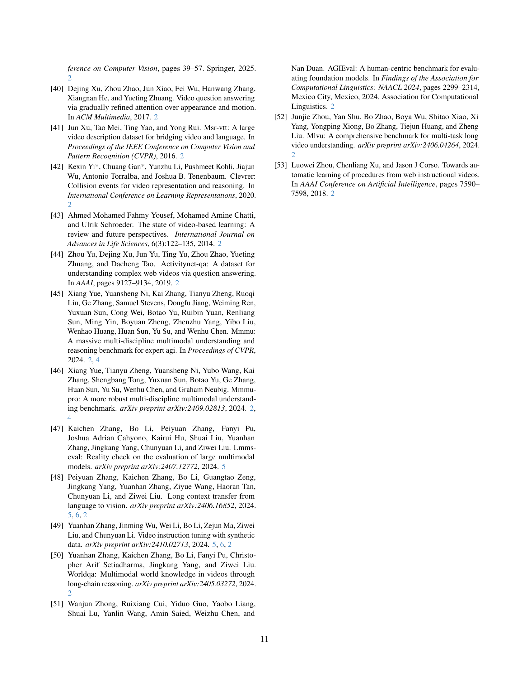

 


 2501.13826 
 Kairui Hu et el. 
 
 🤗 2025-01-24 
 



↗ arXiv


↗ Hugging Face


↗ Papers with Code


### TL;DR



현재 대규모 다중 모달 모델(LMM)은 인간처럼 비디오에서 효과적으로 지식을 습득하는 데 어려움을 겪고 있습니다. 기존 비디오 벤치마크는 이러한 능력을 체계적으로 평가하지 못했고,  학문 분야를 넘나드는 다양한 전문 비디오와 질문-답변 쌍을 통해 지식 획득 능력을 평가하는 것이 어렵습니다.  특히, 단순히 정보를 인지하는 것보다, 지식을 이해하고 새로운 문제에 적용하는 능력 평가가 부족했습니다.

본 논문에서는 이러한 문제를 해결하기 위해, 다양한 학문 분야의 전문가 수준 비디오 데이터셋과 세 가지 인지 단계(인지, 이해, 적응)에 맞춘 질문-답변 쌍으로 구성된 Video-MMMU 벤치마크를 제시합니다.  Video-MMMU는 LMM의 지식 습득 능력을 정량적으로 평가하고, 인간과 모델 간의 성능 차이를 분석하여 LMM의 비디오 학습 능력 향상에 필요한 연구 방향을 제시합니다.



#### Key Takeaways


 Video-MMMU는 다양한 학문 분야의 전문 비디오를 활용하여 LMM의 지식 획득 능력을 체계적으로 평가하는 벤치마크입니다. 



 인간과 모델 간의 지식 습득 능력에는 상당한 차이가 있으며, 특히 지식 적응 단계에서 그 차이가 더욱 큽니다. 



 오디오 정보는 LMM의 이해도를 높이는 데 도움이 되지만, 지식 적용에는 부정적인 영향을 미칠 수 있습니다. 


#### Why does it matter?
본 논문은 **대규모 다중 모달 모델(LMM)**이 비디오에서 지식을 습득하는 능력을 평가하기 위한 새로운 벤치마크인 Video-MMMU를 제시하여, **현재 LMM의 지식 획득 능력에 대한 중요한 한계점을 드러냅니다.** 이는 향후 LMM의 비디오 기반 학습 향상을 위한 연구 방향을 제시하며, **비디오 기반 학습 및 지식 획득 분야 연구에 중요한 기여**를 할 것으로 예상됩니다.

------
#### Visual Insights

> 🔼 본 그림은 Video-MMMU 벤치마크의 개념을 보여줍니다. Video-MMMU는 비디오를 통해 지식 습득 능력을 평가하는 벤치마크로, 인간의 지식 습득 과정과 유사하게 세 가지 인지 단계를 거칩니다. 첫째, **인지(Perception)** 단계에서는 모델이 지식과 관련된 핵심 정보를 식별할 수 있는지 평가합니다. 둘째, **이해(Comprehension)** 단계에서는 모델이 비디오에서 제시된 개념을 해석하고 이해할 수 있는지 평가합니다. 마지막으로, **적응(Adaptation)** 단계에서는 모델이 비디오에서 학습한 지식을 새로운 시나리오에 적용할 수 있는지 평가합니다. 각 단계는 질문-응답 쌍을 통해 평가되며, 이를 통해 모델의 지식 습득 능력을 종합적으로 평가할 수 있습니다.
> 

> 
read the caption

> Figure 1: An illustration of Video-MMMU: Evaluating the knowledge acquisition capability from videos through three cognitive stages: 1) Perception:  if models can identify key information related to knowledge; 2) Comprehension:  if models can interpret the underlying concepts; 3) Adaptation: if models can adapt the knowledge from videos to novel scenarios.
> 


| Benchmarks | Video Domain | Question Length | Video Duration | Knowledge driven |
|---|---|---|---|---|
| Video-MME [9] | Open | 35.7 | 1017.9 | ✗ |
| MMBench-Video [7] | Open | 10.9 | 165.4 | ✗ |
| Video-Bench [25] | Open | 21.3 | 56.0 | ✗ |
| TempCompass [20] | Open | 49.2 | 11.4 | ✗ |
| MVBench [17] | Open | 27.3 | 16.0 | ✗ |
| AutoEval-Video [5] | Open | 11.9 | 14.6 | ✗ |
| Video-MMMU | Professional | 75.7 | 506.2 | ✓ |

> 🔼 표 1은 Video-MMMU와 다른 널리 사용되는 비디오 벤치마크 간의 비교를 보여줍니다.  비교 항목은 질문 길이, 비디오 지속 시간, 그리고 지식 기반 여부 등이 포함됩니다. Video-MMMU는 전문적인 교육 비디오를 사용하며, 지식 기반 질문에 중점을 두어 기존 벤치마크와 차별화됩니다.  이는 모델이 교육 비디오로부터 지식을 얼마나 효과적으로 습득하고 적용하는지 평가하는 데 초점을 맞춥니다.
> 

> 
read the caption

> Table 1: Comparison of Video-MMMU and other widely adopted video benchmarks.
> 

### In-depth insights

#### VideoQA Benchmarks
본 논문에서 VideoQA 벤치마크에 대한 고찰은 **기존 연구의 한계점을 명확히 드러내고, 새로운 방향을 제시하는 데 초점**을 맞춥니다. 기존 VideoQA 벤치마크들은 주로 시각적 이해에 집중하여 동작 인식, 시간적 추론, 영상 캡션 생성 등의 과제를 다루었지만, **영상을 교육적 매체로써의 역할에 대한 고려는 부족**했습니다. 따라서, 이러한 기존 연구들은 **지식 기반 질의응답 능력 평가라는 측면에서 한계**를 보입니다.  본 연구는 이러한 한계점을 극복하고자 **영상 기반 지식 습득 능력을 체계적으로 평가**하는 새로운 벤치마크를 제시하며, 이는 **단순한 시각적 이해를 넘어 지식 기반 추론 및 문제 해결 능력까지 평가**하는 데 중요한 의미를 가집니다.  **다양한 학문 분야를 아우르는 전문가 수준의 영상 데이터셋**을 구축하고, **인지 과정 단계별(인지, 이해, 적응)** 질문-답변 쌍을 통해 종합적인 지식 습득 능력을 평가하는 것이 핵심입니다.

#### Knowledge Acquisition
본 논문은 비디오를 통한 지식 습득 과정에 대한 심층적인 분석을 제공합니다. **인간은 지식을 습득하는 데 있어서 지각, 이해, 적용의 세 가지 인지 단계를 거치는 반면, 대규모 다중 모달 모델(LMM)은 이러한 단계에서 상당한 성과 차이를 보입니다.** 특히, **LMM은 지식 적용 단계에서 어려움을 겪는 경향이 있으며, 이는 인간과 모델 간의 지식 습득 능력 차이를 보여주는 중요한 지표**입니다.  **비디오 기반 학습의 효과적인 평가를 위해 제시된 지식 획득 지표(Δknowledge)는 모델의 성능 향상을 정량적으로 측정**하여, 비디오 학습을 통한 실질적인 지식 습득 능력을 평가하는 데 유용합니다. **오디오 정보 활용에 대한 분석은 모델의 성능 향상에 긍정적이지만, 지식 적용에는 제한적인 영향**을 미침을 보여줍니다.  **결론적으로, LMM이 비디오 학습으로부터 효과적으로 지식을 습득하고 활용할 수 있도록 하는 방법에 대한 추가 연구가 필요**함을 시사합니다.

#### MMMU Dataset
본 논문에서 제시된 가상의 MMMU 데이터셋은 **다양한 학문 분야를 아우르는 전문가 수준의 비디오와 질문-답변 쌍으로 구성**되어, 대규모 다중 모달 모델(LMM)의 지식 습득 능력을 평가하는 데 초점을 맞춥니다. **300개의 전문가 수준 비디오**는 6개의 주요 학문 분야를 포괄하며, 각 비디오는 **인지 과정의 세 단계(인지, 이해, 적응)**를 평가하는 3개의 질문-답변 쌍을 포함합니다.  **Aknowledge라는 새로운 지식 획득 지표**를 통해 모델의 성능 향상을 정량적으로 측정하여, 인간과 모델 간의 지식 습득 능력 차이를 명확히 보여줍니다.  **다양한 유형의 질문과 답변**은 텍스트, 이미지, 그리고 음성 인식을 포함하며, 이는 LMM의 다중 모달 이해 능력을 평가하는 데 중요한 역할을 합니다.  **실제 전문가의 검토 과정**을 통해 데이터셋의 질적 수준을 확보하였고, 이를 통해 모델의 지식 습득 능력을 보다 정확하게 측정할 수 있게 되었습니다. 따라서, MMMU 데이터셋은 LMM의 지식 습득 능력을 포괄적으로 평가하는 강력한 도구로 사용될 수 있을 것으로 기대됩니다.

#### LMM Evaluation
본 논문은 대규모 다중 모달 모델(LMM)의 비디오 기반 지식 습득 능력을 평가하는 데 중점을 둡니다. **비디오-MMMU 벤치마크를 사용하여 지각, 이해, 적응의 세 가지 인지 단계에 걸쳐 LMM의 성능을 평가합니다.** 이는 단순히 비디오의 시각적 내용을 이해하는 것을 넘어, **비디오에서 학습한 지식을 새로운 상황에 적용하는 능력까지 평가**한다는 점에서 기존 벤치마크와 차별화됩니다.  평가 결과, 모델은 지각 단계에서는 상대적으로 높은 정확도를 보이지만, 이해와 적응 단계로 갈수록 성능이 저하되는 것을 확인했습니다. **이는 인간과 모델 간의 지식 습득 능력에 상당한 차이**를 보여주는 것으로, LMM의 비디오 학습 능력 향상을 위한 추가 연구의 필요성을 강조합니다. 특히, **오디오 정보 활용** 및 **지식 유지** 전략에 대한 심층적인 연구가 필요합니다.

#### Future Work
미래 연구 방향으로는 **비디오 기반 학습에서의 모델 성능 향상**에 초점을 맞춰야 합니다. 특히 **다양한 인지 단계(지각, 이해, 적용)**에 걸쳐 모델의 능력을 향상시키는 방법과 **실제 세계 문제 해결**에 대한 적용성을 높이는 연구가 필요합니다.  **영상 내 오디오 정보 활용 전략**에 대한 심도있는 연구도 중요하며, **모델의 지식 습득 과정**에 대한 이해를 높이기 위한 분석 및 평가 방법론 개발이 중요합니다.  또한, **다양한 영상 유형 및 학문 분야**에 대한 일반화 성능 향상을 위한 연구와 **오류 분석 및 개선**을 통한 모델의 강건성 확보 방안 연구도 필요합니다.  **인간 수준의 지식 습득 능력**에 도달하기 위한 꾸준한 노력이 요구됩니다.

### More visual insights

More on figures

> 🔼 그림 2는 Video-MMMU 데이터셋의 예시를 보여줍니다. 6개의 학문 분야(예술, 비즈니스, 의학, 과학, 인문학, 공학)와 3가지 인지 단계(지각, 이해, 적응)에 걸쳐 다양한 유형의 비디오를 포함하고 있습니다. 상단 행은 개념 소개 비디오로, 설명적인 내용을 통해 사실적 지식, 기본 개념 및 이론을 가르치는 데 중점을 둡니다. 하단 행은 문제 해결 비디오로, 예시 문제에 대한 단계별 해결책을 보여줍니다. 각 비디오에는 지각, 이해, 적응의 세 가지 인지 단계에 맞춰 설계된 질문-답변 쌍이 포함되어 있습니다.
> 

> 
read the caption

> Figure 2: Sampled Video-MMMU examples across 6 academic disciplines and 3 tracks. The examples are organized in two rows based on distinct video types: (1) Concept-Introduction videos (top row) focus on teaching factual knowledge, fundamental concepts, and theories through explanatory content, while (2) Problem-Solving videos (bottom row) demonstrate step-by-step solutions to an example question.
> 

> 🔼 그림 3은 Video-MMMU 데이터셋의 질문 유형(QA)과 학문 분야(discipline) 분류 체계를 보여줍니다.  (a)는 6가지 학문 분야(예술, 비즈니스, 의학, 과학, 인문학, 공학)에 걸쳐 비디오가 어떻게 분포되어 있는지를 보여주는 원형 차트입니다.  (b)는 세 가지 인지 단계(지각, 이해, 적용)에 따른 질문 유형의 분포를 보여주는 원형 차트입니다. 각 인지 단계는 여러 하위 질문 유형(예: OCR, ASR, CC, PSC, CSA, PSA)으로 세분화됩니다. (c)는 각 질문 유형에 대해 오디오 정보가 도움이 되는지 여부를 보여주는 막대 그래프입니다. 이는 모델이 오디오 정보를 얼마나 효과적으로 활용하는지 평가하는 데 도움이 됩니다.  전반적으로 이 그림은 Video-MMMU 데이터셋의 다양성과 복잡성, 그리고 모델의 다양한 인지 능력을 평가하기 위한 포괄적인 접근 방식을 보여줍니다.
> 

> 
read the caption

> Figure 3: Taxonomy of QA types and video disciplines.
> 

> 🔼 본 그림은 오디오 전사본을 추가하기 전과 후의 세 가지 인지 과제(지각, 이해, 적응)에 걸친 모델 성능 비교를 보여줍니다. 오디오 전사본을 추가했을 때 세 가지 과제 모두에서 성능이 향상되었으며, 특히 이해 과제에서 그 향상이 두드러집니다. 이는 오디오가 비디오 콘텐츠 이해에 기여함을 보여줍니다. 지각 과제에서도 성능 향상이 나타나지만, 적응 과제에서는 성능이 다소 감소하는 모습을 보입니다. 이는 오디오 전사본이 즉각적인 이해를 높이는 데는 도움이 되지만, 새로운 시나리오에 지식을 적용하는 능력에는 제약이 있을 수 있음을 시사합니다.
> 

> 
read the caption

> Figure 4: Performance comparison across tracks before and after adding audio transcripts.
> 

> 🔼 그림은 비디오 시청 전과 후의 적응력 테스트(Adaptation track)에서의 성과 향상을 보여줍니다.  Δknowledge는 비디오 시청 후 시험 점수 향상을 정량화한 지표입니다.  이 그림은 여러 모델들의 Δknowledge 값을 비교하여, 비디오 학습을 통한 지식 습득 능력의 차이를 보여줍니다.  높은 Δknowledge 값은 비디오 학습을 통해 더 큰 지식 향상을 이루었다는 것을 의미합니다.
> 

> 
read the caption

> (a) Comparison of ΔknowledgesubscriptΔknowledge\Delta_{\text{knowledge}}roman_Δ start_POSTSUBSCRIPT knowledge end_POSTSUBSCRIPT (performance improvement in the Adaptation track after watching the video compared to before).
> 

> 🔼 그림 (b)는 적응 과제(Adaptation track) 질문들에 대한 두 가지 지표, 즉 ‘틀렸다가 맞춘 비율’(Wrong-to-Right Rate)과 ‘맞았다가 틀린 비율’(Right-to-Wrong Rate)을 비교한 그래프입니다.  ‘틀렸다가 맞춘 비율’은 비디오 시청 전에는 질문에 답을 틀렸지만 시청 후에는 정답을 맞춘 비율을 나타내고, ‘맞았다가 틀린 비율’은 비디오 시청 전에는 정답을 맞췄지만 시청 후에는 틀린 비율을 의미합니다. 이 그래프는 모델들이 비디오 시청 후에 얼마나 정확하게 질문에 답할 수 있는지, 그리고 시청 전의 지식 수준이 시청 후에 어떻게 변하는지를 보여줍니다.  특히, 모델이 비디오 시청을 통해 얼마나 효과적으로 새로운 지식을 습득하고 적용하는지, 그리고 기존 지식을 유지하는지에 대한 통찰력을 제공합니다.
> 

> 
read the caption

> (b) Comparison of Wrong-to-Right Rate (the percentage of Adaptation track questions that were initially answered incorrectly without the video but correctly after watching the video) and Right-to-Wrong Rate (vice versa).
> 

> 🔼 그림 5는 논문에서 제시된 Δknowledge (지식 증가량) 측정값에 대한 실험 결과의 주요 내용을 보여줍니다.  왼쪽 그래프는 모델과 사람의 지식 습득 차이를 보여주는 Δknowledge 값을 비교합니다. 오른쪽 그래프는 비디오 시청 전후로 모델의 응답이 잘못된 것에서 맞는 것으로, 또는 맞는 것에서 잘못된 것으로 변화한 비율을 나타내는 Wrong-to-Right Rate과 Right-to-Wrong Rate을 보여줍니다. 이를 통해 모델이 비디오로부터 얼마나 효과적으로 지식을 습득하고 적용하는지, 그리고 그 과정에서 어떤 어려움이 있는지를 보여줍니다.
> 

> 
read the caption

> Figure 5: Key findings in the experiment of ΔknowledgesubscriptΔknowledge\Delta_{\text{knowledge}}roman_Δ start_POSTSUBSCRIPT knowledge end_POSTSUBSCRIPT.
> 

> 🔼 그림 6은 모델이 비디오에서 올바른 지식을 상기할 수는 있지만 새로운 시나리오에 그 방법을 적용하는 데 실패하는 방법 적응 오류의 사례를 보여줍니다.  이 그림은 모델이 비디오에서 배운 깊이 우선 탐색(DFS) 알고리즘을 복잡한 그래프에 적용하는 데 어려움을 겪는 과정을 보여줍니다. 비디오에서는 간단한 트리 구조에서 DFS 알고리즘을 설명하지만, 질문에서는 순환을 포함하는 더 복잡한 그래프가 주어집니다. 모델은 비디오의 지식을 정확하게 상기하지만 새로운 상황에 적용하는 데 실패합니다.  부록에서는 더 많은 오류 사례를 분석합니다.
> 

> 
read the caption

> Figure 6: A Case of Method Adaptation Error. The model can recall the correct knowledge from the video but fails to adapt the method to a new scenario. More error cases are analyzed in the Appendix.
> 

> 🔼 그림 7은 Claude-3.5-Sonnet 모델의 적응 단계(Adaptation track)에서 100개의 오류를 사람이 주석을 단 결과를 보여줍니다. 오류의 분포를  방법 선택 오류(Method Selection Error), 방법 적용 오류(Method Adaptation Error), 질문 오독 오류(Question Misreading Error), 기타 오류(Other Errors) 네 가지 범주로 나누어 보여주는 원형 차트입니다.  방법 적용 오류가 전체 오류의 64%를 차지하여 가장 큰 비중을 차지하는 것을 알 수 있습니다. 이는 모델이 비디오에서 학습한 지식을 새로운 상황에 적용하는 데 어려움을 겪고 있음을 시사합니다. 그 외 방법 선택 오류(8%), 질문 오독 오류(15%), 그리고 응답 거부(Refuse to Answer), 주석 오류(Annotation Error), 답변 추출 오류(Answer Extraction Error) 등 기타 오류(9%)가 발생한 것으로 나타났습니다.
> 

> 
read the caption

> Figure 7: Distribution of the 100 human-annotated errors in Claude-3.5-Sonnet.
> 

> 🔼 그림 8은 논문의 적응 단계(Adaptation Track)에서 사용되는 프롬프트(지시문)를 보여줍니다.  AI 어시스턴트는 비디오를 보고 학습한 후, 제시된 질문에 답해야 합니다.  특히, 이 프롬프트는 질문에 대한 이미지가 비디오의 마지막 부분에 있다는 것을 명시하고 있습니다. 이는 모델이 비디오의 시각적 정보를 활용하여 질문에 답할 수 있도록 유도하는 역할을 합니다. 따라서, 단순히 텍스트만으로 질문에 답하는 것이 아니라, 비디오의 시각적 내용과 결합하여 답변을 도출해야 함을 강조합니다.
> 

> 
read the caption

> Figure 8: Prompt for Adaptation track.
> 

> 🔼 그림 9는 비디오의 오디오 정보가 질문에 답하는 데 필요한지 여부를 판단하는 데 사용되는 프롬프트를 보여줍니다.  시스템 메시지는 평가자에게 비디오와 함께 질문과 답변의 쌍을 제공하고, 질문에 답하기 위해 비디오의 오디오 정보가 필요한지 여부를 판단하도록 지시합니다. 만약 시각 정보만으로 답변할 수 있다면, 평가자는 'use_audio' 필드를 false로 설정하고, 오디오 정보가 필요하다면 true로 설정하여 그 이유를 자세히 설명해야 합니다.  이러한 프롬프트는 모델이 비디오의 시각적 정보와 청각적 정보를 얼마나 잘 활용하는지 평가하는 데 사용됩니다.
> 

> 
read the caption

> Figure 9: Prompt for determining the helpfulness of audio.
> 

> 🔼 그림 10은 논문에서 사용된 Video-MMMU 데이터셋의 기획 과정을 보여주는 흐름도입니다.  데이터셋은 6가지 학문 분야(예술, 비즈니스, 의학, 과학, 인문학, 공학)의 전문가 수준 영상 300개를 수집하는 것으로 시작합니다.  각 영상은 GPT-40을 이용하여 주제를 선정하고 유튜브 데이터 API를 통해 후보 영상을 모읍니다.  이후, 어노테이터와 전문가의 3단계 검토를 거쳐 영상의 질과 적합성을 평가합니다. 최종적으로 선정된 영상에 대해서는 세 가지 인지 단계(지각, 이해, 적응)에 맞춰 질문과 답변 쌍을 어노테이션하여 질문 응답 데이터를 생성합니다.  이 과정에서 OCR, ASR, 개념 이해, 문제 해결 전략 이해, 사례 연구 분석, 문제 해결 전략 적용 등 다양한 어노테이션 방식이 사용됩니다. 최종적으로 생성된 Video-MMMU 데이터셋은 다양한 다중 모달 모델의 지식 습득 능력 평가에 사용됩니다.
> 

> 
read the caption

> Figure 10: An illustration of the dataset curation pipeline.
> 

> 🔼 그림 11은 적응 단계에서 Claude-3.5-Sonnet 모델이 방법 선택 오류를 보이는 사례를 보여줍니다. 이 그림은 회로도와 질문, 그리고 모델의 비디오 시청 전후 응답을 보여줍니다.  모델은 비디오 시청 전에는 회로의 전체 저항 변화와 전류 분포의 영향을 고려하지 못했습니다.  반면에 사람은 비디오에서 제시된 정량적인 접근 방식(옴의 법칙을 사용하여 각 전구의 전류를 계산)을 적용하여 올바른 답을 도출했습니다. 모델은 정성적 분석에만 의존하여 정확한 전류 변화를 결정하는 데 실패했습니다. 이는 모델이 비디오에서 학습한 문제 해결 전략을 새로운 시나리오에 적용하는 데 어려움을 겪는다는 점을 보여줍니다.
> 

> 
read the caption

> Figure 11: A sample error case in the Adaptation track: Method Selection Error by Claude-3.5-Sonnet.
> 

> 🔼 그림 12는 Claude-3.5-Sonnet 모델이 적응 단계(Adaptation Track) 질문에서 질문 오독(Question Misreading Error)을 보인 대표적인 오류 사례를 보여줍니다.  이 그림은 비디오 강의의 내용을 바탕으로 트러스 구조물(Howe bridge truss)의 특정 부재(bar CG)에 작용하는 최대 하중을 계산하는 문제입니다. 모델은 비디오에서 제시된 문제 해결 전략을 이해했지만, 질문에서 트러스의 특정 부재(bar CG)가 수직 부재라고 잘못 해석하여 잘못된 계산을 수행했습니다. 반면에 사람은 bar CG가 대각선 부재임을 올바르게 인식하여 정확한 해답을 제시했습니다. 이는 모델이 시각적 정보를 정확하게 해석하고 문제에 적용하는 데 어려움을 겪음을 보여주는 사례입니다.  즉, 비디오의 정적인 이미지에서 올바르게 인지했던 시각적 세부 사항이 비디오 맥락에서 잘못 해석될 수 있음을 보여줍니다.  긴 비디오 맥락을 처리하는 복잡성이 정보의 정확한 인식에 추가적인 어려움을 야기할 수 있음을 시사합니다.
> 

> 
read the caption

> Figure 12: A sample error case in the Adaptation track: Question Misreading Error by Claude-3.5-Sonnet.
> 

> 🔼 그림 13은 GPT-4o 모델이 적응 과제(Adaptation track)에서 방법 적응 오류(Method Adaptation Error)를 보이는 예시를 보여줍니다.  GPT-4o는 속도-시간 그래프 아래 면적을 이용하여 이동 거리를 계산하는 방법을 비디오에서 학습했지만, 새로운 시나리오(양수와 음수 면적이 모두 포함된 그래프)에 이를 제대로 적용하지 못했습니다.  비디오에서는 양수 면적만 다룬 예시만 보여주었기 때문에 모델은 음수 면적을 고려하지 못하고 잘못된 답을 도출했습니다. 반면 사람은 양수와 음수 면적을 모두 고려하여 정확한 답을 계산했습니다. 이는 모델이 비디오에서 학습한 지식을 새로운 상황에 적용하는 데 어려움을 겪는다는 것을 보여줍니다.  특히, 비디오에서 제시된 예시와 다른 상황에 적응하는 데 어려움을 보이는 방법 적응 오류를 강조합니다.
> 

> 
read the caption

> Figure 13: A sample error case in the Adaptation track: Method Adaptation Error by GPT-4o.
> 

> 🔼 그림 14는 적응 과제에서 GPT-4o 모델이 질문을 잘못 이해한 대표적인 오류 사례를 보여줍니다.  사진전기 효과 그래프를 해석하는 비디오 강의를 본 후, 모델은 그래프의 y절편을 이용해 일함수를 구하는 방법을 익혔어야 합니다. 하지만, 모델은 그래프의 y절편을 잘못 읽어서(실제 -1.5eV인 것을 -2.0eV로 잘못 인식) 정답을 틀렸습니다. 반면, 사람은 y절편을 정확하게 파악하여 올바른 답을 얻었습니다. 이는 모델이 비디오에서 제시된 방법을 이해하였음에도 불구하고 그래프 해석이라는 시각적 과제에서 오류를 범했음을 보여줍니다.  이는 시각 정보 처리 능력의 한계를 시사합니다.
> 

> 
read the caption

> Figure 14: A sample error case in the Adaptation track: Question Misreading Error by GPT-4o.
> 

> 🔼 이 그림은 논문의 Perception 단계 평가에서 모델이 오류를 보인 사례를 보여줍니다. 그림은 세 개의 근육 이미지와 각 근육의 위치(왼쪽 아래, 왼쪽 위, 오른쪽 아래)를 묻는 질문을 보여줍니다. 모델은 근육의 위치를 질문 순서대로(왼쪽 아래, 왼쪽 위, 오른쪽 아래)가 아닌 왼쪽 위, 왼쪽 아래, 오른쪽 아래 순서로 인식하는 오류를 보였습니다. 이는 모델이 시각적 내용의 공간적 배열을 정확하게 처리하는 데 어려움을 겪는다는 것을 보여줍니다.
> 

> 
read the caption

> Figure 15: A sample error case in the Perception track.
> 

> 🔼 그림 16은 논문의 'Perception Track' 섹션에 있는 예시 오류를 보여줍니다.  이 그림은 뉴런의 활동전위에 대한 비디오 강의 내용을 바탕으로 한 질문에 대한 모델의 잘못된 응답을 보여주는 것입니다.  비디오에는 청색, 황색, 녹색 이온 채널이 등장하고, 각 채널의 종류를 질문하고 있습니다. 모델은 비디오 애니메이션에 영향을 받아 채널의 색깔과 종류를 잘못 연결하였습니다.  이를 통해 모델이 시각적 정보를 정확하게 인식하고 해석하는 데 어려움을 겪을 수 있음을 보여줍니다. 특히, 비디오 애니메이션의 시각적 요소에 의존하여 잘못된 결론을 내리는 경향을 보여주는 대표적인 오류 사례입니다.
> 

> 
read the caption

> Figure 16: A sample error case in the Perception track.
> 

> 🔼 그림 17은 논문의 Comprehension 트랙에서 모델이 오류를 보인 대표적인 사례를 보여줍니다.  이 그림은 질문과 답변, 그리고 비디오 강의 내용을 함께 보여주어 모델의 오류 원인을 분석하는 데 도움을 줍니다.  비디오 강의에서는 너비 우선 탐색(BFS) 알고리즘을 이용하여 신장 트리를 만드는 과정을 설명합니다.  질문은 루트 노드를 변경했을 때, 특정 레벨에 위치하는 노드를 찾는 문제입니다. 모델은 BFS 알고리즘의 개념을 제대로 이해하지 못하고, 루트 노드 변경 후에도 이전과 같은 방식으로 탐색하여 답을 잘못 도출했습니다. 이는 모델이 비디오에서 제시된 문제 해결 전략을 제대로 이해하지 못하고, 단순히 입력 값만 바뀐 유사 문제에 적용하지 못하는 점을 보여줍니다.  그림은 모델의 오답과 정답, 그리고 그 이유를 자세히 설명하여 모델의 이해도 부족을 명확히 제시합니다.
> 

> 
read the caption

> Figure 17: A sample error case in the Comprehension track.
> 

> 🔼 그림 18은 논문의 '5.2 Findings' 섹션에 있는 'Comprehension Track'에서 모델이 오류를 보인 사례를 보여줍니다.  비디오 강의에서는 경사면에서 발사된 발사체의 비행 시간을 계산하는 예제를 보여주는데, 문제는 발사 각도만 바꾼 채로 같은 문제 풀이 과정을 따라가도록 요구합니다.  모델은 비디오에서 보여준 것과 같은 방식으로 문제를 풀지 못하고, 잘못된 공식과 방법을 사용하여 답을 구합니다. 이는 모델이 비디오 강의에서 제시된 문제 해결 전략을 제대로 이해하지 못했음을 보여줍니다.  인간 학습자는 새로운 숫자를 사용하여 동일한 추론 과정을 따를 수 있지만, 모델은 이러한 기본적인 학습 측면에서 어려움을 겪습니다.  그림은 비디오의 각 프레임과 모델과 인간의 응답을 비교하여 이러한 오류를 자세하게 보여줍니다.
> 

> 
read the caption

> Figure 18: A sample error case in the Comprehension track.
> 

> 🔼 그림 19는 적응력 테스트에서 Claude-3.5-Sonnet 모델이 잘못된 답변에서 올바른 답변으로 수정되는 과정을 보여주는 예시입니다.  이 모델은 처음에는 Ford-Fulkerson 알고리즘을 사용하여 최대 유량 문제를 풀 때 경로의 용량을 두 번 세거나, 흐름 제약 조건을 무시하는 등의 실수를 범했습니다. 그러나 비디오 강의를 본 후에는 알고리즘의 원리를 제대로 이해하고 용량 제약 조건을 존중하면서 흐름 보존 규칙을 적용하여 올바른 답변을 도출했습니다. 이는 비디오 학습을 통해 모델이 지식을 성공적으로 습득하고 적용한 것을 보여주는 대표적인 사례입니다.
> 

> 
read the caption

> Figure 19: A Wrong-to-Right example of Claude-3.5-Sonnet in the Adaptation track.
> 

> 🔼 그림 20은 적응 과제에서 Claude-3.5-Sonnet 모델이 초기에는 잘못된 답을 제시했지만, 비디오 학습 후 정답을 제시한 사례를 보여줍니다.  이 그림은 얇은 막 간섭에 대한 비디오 강의를 기반으로 합니다.  초기에는 모델이 경계면에서의 위상 변화를 잘못 이해하여 잘못된 답을 도출했으나, 비디오 학습을 통해 경계면에서의 위상 변화에 대한 이해를 바로잡고,  정확한 간섭 조건을 적용하여 올바른 답을 계산할 수 있게 되었습니다. 이는 모델이 비디오 학습을 통해 지식을 성공적으로 습득하고 적용했음을 보여주는 예시입니다.
> 

> 
read the caption

> Figure 20: A Wrong-to-Right example of Claude-3.5-Sonnet in the Adaptation track.
> 

More on tables


| Model | Overall | Perception | Comprehension | Adaptation | Art. | Biz. | Sci. | Med. | Hum. | Eng. |
|---|---|---|---|---|---|---|---|---|---|---|
| Random Choice | 14.00 | 12.00 | 14.00 | 16.00 | 11.11 | 12.88 | 12.12 | 22.48 | 10.48 | 13.57 |
| Human Expert | 74.44 | 84.33 | 78.67 | 60.33 | 80.95 | 78.79 | 74.24 | 70.54 | 84.76 | 69.91 |
| **Proprietary LMMs** |  |  |  |  |  |  |  |  |  |  |
| Gemini 1.5 Flash [32] | 49.78 | 57.33 | 49.00 | 43.00 | 63.49 | 53.03 | 43.18 | 49.61 | 59.05 | 45.72 |
| Gemini 1.5 Pro [32] | 53.89 | 59.00 | 53.33 | 49.33 | 57.14 | 59.09 | 49.10 | 57.42 | 58.10 | 50.31 |
| GPT-4o [27] | 61.22 | 66.00 | 62.00 | 55.67 | 69.52 | 66.88 | 51.55 | 64.76 | 69.52 | 57.13 |
| Claude-3.5-Sonnet [1] | 65.78 | 72.00 | 69.67 | 55.67 | 66.67 | 75.00 | 56.06 | 58.14 | 75.24 | 66.08 |
| **Open-source LMMs** |  |  |  |  |  |  |  |  |  |  |
| VILA1.5-8B [19] | 20.89 | 20.33 | 17.33 | 25.00 | 34.92 | 14.39 | 19.70 | 19.38 | 21.91 | 21.53 |
| LongVA-7B [48] | 23.98 | 24.00 | 24.33 | 23.67 | 41.27 | 20.46 | 21.97 | 24.03 | 23.81 | 23.01 |
| Llama-3.2-11B [23] | 30.00 | 35.67 | 32.33 | 22.00 | 39.68 | 28.79 | 21.21 | 35.66 | 33.33 | 28.91 |
| LLaVA-OneVision-7B [15] | 33.89 | 40.00 | 31.00 | 30.67 | 49.21 | 29.55 | 34.85 | 31.78 | 46.67 | 29.20 |
| VILA1.5-40B [19] | 34.00 | 38.67 | 30.67 | 32.67 | 57.14 | 27.27 | 23.49 | 37.99 | 41.91 | 32.45 |
| LLaVA-Video-7B [49] | 36.11 | 41.67 | 33.33 | 33.33 | 65.08 | 34.09 | 32.58 | 42.64 | 45.71 | 27.43 |
| InternVL2-8B [6] | 37.44 | 47.33 | 33.33 | 31.67 | 55.56 | 34.09 | 30.30 | 34.11 | 41.91 | 38.05 |
| MAmmoTH-VL-8B [12] | 41.78 | 51.67 | 40.00 | 33.67 | 47.62 | 37.88 | 36.36 | 36.43 | 49.52 | 43.95 |
| LLaVA-OneVision-72B [15] | 48.33 | 59.67 | 42.33 | 43.00 | 61.91 | 46.21 | 40.15 | 54.26 | 60.00 | 43.95 |
| LLaVA-Video-72B [49] | 49.67 | 59.67 | 46.00 | 43.33 | 69.84 | 44.70 | 41.67 | 58.92 | 57.14 | 45.13 |
| Aria [16] | 50.78 | 65.67 | 46.67 | 40.00 | 71.43 | 47.73 | 44.70 | 58.92 | 62.86 | 43.66 |
> 🔼 표 2는 Video-MMMU 벤치마크에서 다양한 모델의 성능을 세 가지 인지 단계(지각, 이해, 적응)와 여섯 가지 학문 분야(예술, 비즈니스, 과학, 의학, 인문학, 공학)별로 보여줍니다. 각 단계는 지식 습득의 점진적인 수준을 나타내며, 모델의 성능은 각 단계와 분야에 따라 다르게 나타납니다.  이 표는 모델이 비디오에서 지식을 습득하고 활용하는 능력을 평가하는 Video-MMMU의 주요 결과를 보여주는 핵심 표입니다.  모델의 전반적인 성능, 각 인지 단계별 성능, 그리고 학문 분야별 성능을 비교하여 모델의 강점과 약점을 파악하는 데 유용합니다.
> 

> 
read the caption

> Table 2: Video-MMMU Evaluation Results across three cognitive tracks (Perception, Comprehension, Adaptation) and six disciplines (Art, Business, Science, Medicine, Humanities, Engineering).
> 


| Discipline | Subjects |
|---|---| 
| Art | Art History, Art Theory, Design, Music |
| Business | Accounting, Economics, Finance, Manage, Marketing |
| Science | Biology, Chemistry, Geography, Math, Physics |
| Medicine | Basic Medical Science, Clinical Medicine, Diagnostics and Laboratory Medicine, Pharmacy, Public Health |
| Humanities | History, Literature, Psychology, Sociology |
| Engineering | Agriculture, Architecture and Engineering, Computer Science, Electronics, Energy and Power, Materials, Mechanical Engineering |
> 🔼 표 3은 논문에서 다룬 6가지 학문 분야별 세부 과목 목록을 보여줍니다.  각 분야는 예술, 비즈니스, 의학, 과학, 인문학, 공학으로 구성되며, 각 분야별로 해당 분야의 전문적인 지식을 다루는 여러 개의 세부 과목들이 포함되어 있습니다. 이 표는 Video-MMMU 데이터셋에 포함된 비디오의 다양성과 범위를 보여주는 데 도움이 됩니다.  Video-MMMU는 다양한 학문 분야의 전문적인 지식을 다루는 비디오를 사용하여 다양한 인공지능 모델의 지식 습득 능력을 평가하기 위한 벤치마크입니다.
> 

> 
read the caption

> Table 3: Subjects categorized under six disciplines.
> 


| Model | Δknowledge (%) | Wrong-to-Right |  | Right-to-Wrong |  | 
|---|---|---|---|---|---| 
|  |  | No. of Questions | Rate (%) | No. of Questions | Rate (%) | 
| Human Expert | 33.1 | 72 | 40.4 | 13 | 10.7 | 
| GPT-4o [27] | 15.6 | 44 | 28.0 | 19 | 13.3 | 
| Claude-3.5-Sonnet [1] | 11.4 | 42 | 28.8 | 30 | 19.5 | 
| VILA-1.5-40B [19] | 9.4 | 57 | 25.2 | 34 | 45.9 | 
| Gemini-1.5-Pro [32] | 8.7 | 49 | 29.5 | 33 | 24.6 | 
| LLaVA-Video-72B [49] | 7.1 | 40 | 22.0 | 29 | 24.6 | 
| LLaVA-OneVision-72B [15] | 6.6 | 37 | 20.6 | 28 | 23.3 | 
| VILA-1.5-8B [19] | 5.9 | 48 | 20.2 | 35 | 56.5 | 
| Aria [16] | 3.2 | 47 | 25.4 | 42 | 36.5 | 
| MAmmoTH-VL-8B [12] | 1.5 | 48 | 23.9 | 45 | 45.5 | 
| Gemini-1.5-Flash [32] | -3.3 | 39 | 23.5 | 42 | 31.3 | 
| LLaVA-Video-7B [49] | -5.3 | 35 | 18.5 | 47 | 42.3 | 
| LLaVA-OneVision-7B [15] | -5.6 | 36 | 18.2 | 43 | 42.2 | 
| LongVA [48] | -7.0 | 29 | 13.6 | 47 | 54.0 | 
| InternVL2-8B [6] | -8.5 | 46 | 24.3 | 61 | 55.0 |
> 🔼 표 4는 비디오 시청 전후의 모델 성능 변화를 정량적으로 보여주는 추가적인 지식 습득 실험 결과를 보여줍니다.  'Δknowledge'는 비디오 시청 후 지식 향상 정도를 백분율(%)로 나타낸 지표입니다.  표에는 각 모델의 Δknowledge 값과 함께, 비디오 시청 전에는 오답이었으나 시청 후 정답으로 바뀐 질문 수와 비율(Wrong-to-Right Rate), 그리고 그 반대의 경우(Right-to-Wrong Rate)를 보여줍니다. 이를 통해 모델이 비디오 학습을 통해 얼마나 효과적으로 지식을 습득하고 적용하는지, 그리고 그 과정에서 어떤 유형의 오류가 발생하는지 자세히 분석할 수 있습니다.
> 

> 
read the caption

> Table 4: Additional Knowledge Acquisition Experiment Results with Delta (%) values.
> 

### Full paper



