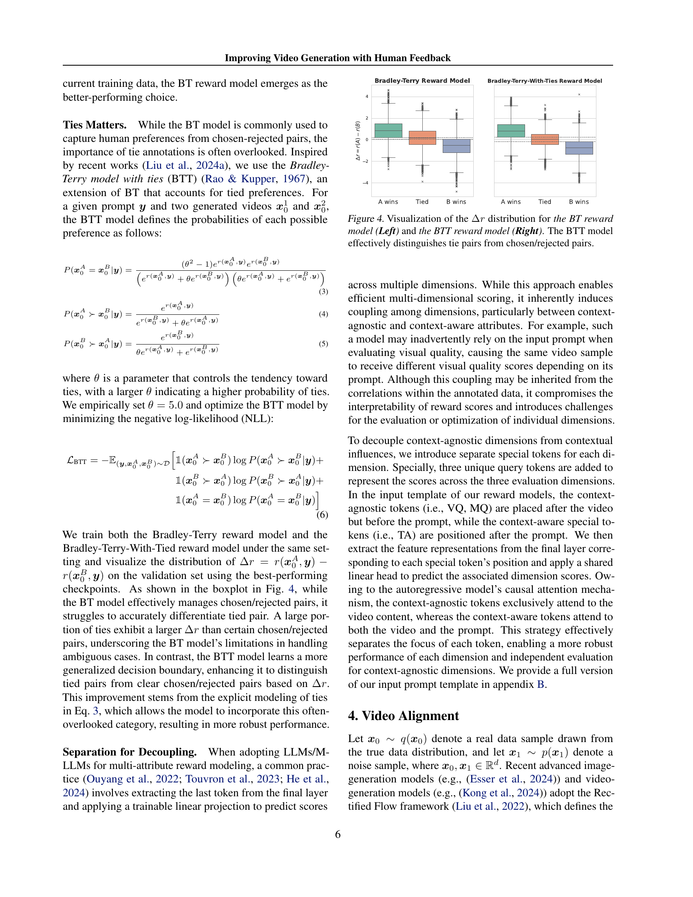

 


 2501.13918 
 Jie Liu et el. 
 
 🤗 2025-01-24 
 



↗ arXiv


↗ Hugging Face


↗ Papers with Code


### TL;DR



최근 비디오 생성 기술은 발전했지만, **움직임 불안정, 프롬프트 불일치, 화질 저하** 등의 문제점이 있습니다. 기존 연구는 주로 저품질 데이터에 기반하여 이러한 문제를 해결하려 했으나, 최신 모델의 발전 속도를 따라가지 못했습니다. 

본 연구는 **18만 2천 개의 인간 선호도 데이터**를 기반으로, **다차원적 비디오 보상 모델**을 제시하고, 이를 통해 **비디오 품질 및 프롬프트 일치도**를 개선했습니다. 또한, **최신 흐름 기반 모델**에 적합한 세 가지 정렬 알고리즘을 개발하여, **훈련 시간 및 추론 시간** 모두에서 성능을 향상시켰습니다. 이를 통해 사용자 맞춤형 비디오 생성 경험을 제공할 수 있게 되었습니다.



#### Key Takeaways


 대규모 다차원적 비디오 선호도 데이터셋 구축 



 다차원적 비디오 보상 모델 ë° 평가 벤치마크 제시 



 최신 흐름 기반 모델을 위한 효율적인 정렬 알고리즘(Flow-DPO, Flow-RWR, Flow-NRG) 개발 


#### Why does it matter?
본 논문은 **인간의 피드백을 활용하여 비디오 생성 모델을 향상시키는 방법**을 제시하여, **비디오 생성 분야의 핵심적인 문제점 해결**에 크게 기여합니다.  **대규모 선호도 데이터셋 구축**, **다차원적 보상 모델 개발**, **새로운 정렬 알고리즘 제시** 등의 연구 결과는 향후 비디오 생성 기술 발전에 중요한 영향을 미칠 것이며, **다양한 연구 분야에서의 활용 가능성**을 시사합니다.  특히, **최신 비디오 생성 모델의 특징을 고려한 정렬 알고리즘 개발**은 이 분야 연구의 새로운 방향을 제시할 것으로 기대됩니다.

------
#### Visual Insights

> 🔼 본 그림은 논문의 비디오 정렬 패러다임을 보여줍니다. (a)에서는 182,000개의 (프롬프트, 비디오 A, 비디오 B) 세 쌍으로 구성된 데이터셋을 구축하여 시각적 품질(VQ), 동작 품질(MQ), 텍스트 정렬(TA)에 대한 사람의 선호도를 주석으로 달았습니다. (b)에서는 브래들리-테리-모델-위드-타이즈(Bradley-Terry-Model-with-Ties) 공식을 사용하여 VLM 기반 보상 모델을 학습시켰습니다. (c)에서는 흐름 기반 비디오 생성 모델에 DPO, RWR, 보상 안내와 같은 정렬 알고리즘을 적용하여 그 효과를 비교 분석했습니다.
> 

> 
read the caption

> Figure 1: Overview of Our Video Alignment Paradigm. (a) Human Preference Annotation (Sec. 3.1). We construct a dataset of 182k (prompt, video A, video B) triplets, collecting preference annotations on Visual Quality (VQ), Motion Quality (MQ), and Text Alignment (TA) from human evaluators. (b) Reward Mode Training (Sec. 3.2). We train a VLM-based reward model using the Bradley-Terry-Model-with-Ties formulation. (c) Video Alignment (Sec. 4). We adapt alignment techniques — DPO, RWR, and reward guidance — to flow-based video generation models and provide a comprehensive comparison of their effectiveness.
> 


| T2V Model | Date | #Videos | #Anno Triplets | Resolution | Duration |
|---|---|---|---|---|---|---|
| **Pre-Sora-Era Models** |  |  |  |  |  |  |
| Gen2 [2023] | 23.06 | 6k | 13k | 768 × 1408 | 4s |
| SVD [2023] | 23.11 | 6k | 13k | 576 × 1024 | 4s |
| Pika 1.0 [2023] | 23.12 | 6k | 13k | 720 × 1280 | 3s |
| Vega [2023] | 23.12 | 6k | 13k | 576 × 1024 | 4s |
| Pixverse v1 [2024] | 24.01 | 6k | 13k | 768 × 1408 | 4s |
| HiDream [2024] | 24.01 | 0.3k | 0.3k | 768 × 1344 | 5s |
| **Modern Models** |  |  |  |  |  |  |
| Dreamina [2024] | 24.03 | 16k | 68k | 720 × 1280 | 6s |
| Luma [2024] | 24.06 | 16k | 57k | 752 × 1360 | 5s |
| Gen3 [2024] | 24.06 | 16k | 55k | 768 × 1280 | 5s |
| Kling 1.0 [2024] | 24.06 | 6k | 33k | 384 × 672 | 5s |
| Pixverse v2 [2024] | 24.07 | 16k | 58k | 576 × 1024 | 5s |
| Kling 1.5 [2024] | 24.09 | 7k | 28k | 704 × 1280 | 5s |

> 🔼 이 표는 논문에서 사용된 훈련 데이터셋의 통계를 보여줍니다. 총 16,000개의 고유 프롬프트를 사용하여 12개의 텍스트-비디오 모델로 108,000개의 비디오를 생성했습니다. 이 과정을 통해 프롬프트와 두 개의 비디오, 그리고 해당 선호도 주석으로 구성된 182,000개의 어노테이션된 트리플릿을 얻었습니다.
> 

> 
read the caption

> Table 1: Statistics of the collected training dataset. We utilized 12 text-to-video models to generate a total of 108k videos from 16k unique prompts. This process ultimately resulted in 182k annotated triplets, each consisting of a prompt paired with two videos and corresponding preference annotations.
> 

### In-depth insights

#### Human Feedback Loop
본 논문에서 제시된 ‘인간 피드백 루프’는 **비디오 생성 모델의 성능 향상을 위한 핵심 전략**으로 보입니다.  이는 단순한 평가 도구를 넘어, 인간의 선호도 데이터를 통해 모델 학습 과정에 직접적으로 영향을 미치는 **강화 학습 기반 접근법**을 제시합니다.  **다차원적 선호도 데이터셋 구축**을 통해 시각적 품질, 동작의 자연스러움, 프롬프트와의 정합성 등 다양한 측면을 포괄적으로 평가하고 있으며, 이는 기존 연구의 한계를 극복하는 중요한 발전입니다.  **다차원 보상 모델(VideoReward)**을 활용하여 인간의 미묘한 선호도까지 반영, 더욱 정교한 피드백을 제공하는 점도 주목할 만합니다.  **여러 가지 강화학습 알고리즘**을 통해 이러한 피드백을 모델 학습에 효과적으로 통합하는 시도는, 향후 **인공지능 기반 비디오 생성 기술 발전**에 큰 영향을 미칠 것으로 예상됩니다.  **특히, 흐름 기반 모델에 대한 적용 및 개선**은 차세대 비디오 생성 모델의 성능과 신뢰도 향상에 중요한 기여를 할 것으로 판단됩니다.

#### Reward Model Design
본 논문에서는 **보상 모델 설계**에 대해 심도있는 논의가 부족하지만,  인간의 선호도를 반영하는 보상 모델의 중요성을 강조하고 있습니다.  **다차원 보상 모델**을 제시하여 시각적 품질, 동작 품질, 그리고 프롬프트와의 정합성을 평가하는 다차원적 접근을 시도한 점은 주목할 만합니다.  **브래들리-테리 모델(Bradley-Terry model)**을 기반으로 하여 상대적 선호도를 학습하는 방식을 채택하고 있으며, 이는 쌍을 이룬 비디오의 상대적 품질을 효과적으로 평가하는 데 도움이 될 것입니다.  또한, **손실 함수**를 통해 모델의 성능을 최적화하는 과정이 묘사되어 있으나, 구체적인 설계 및 최적화 전략에 대한 세부적인 정보는 부족하여 추가적인 연구가 필요해 보입니다.  **보상 모델의 성능 평가**는 GenAI-Bench 및 VideoGen-RewardBench 와 같은 벤치마크를 사용하여 수행되었으나, 보상 모델 설계 자체에 대한 분석은 부족하므로,  다양한 설계 선택지들의 영향에 대한 더욱 자세한 분석이 필요합니다.  **비교 분석**을 통해 다른 보상 모델들과의 성능 비교를 수행하고 있으나,  그 차이에 대한 명확한 설명은 제한적입니다.  결론적으로, 본 논문의 보상 모델 설계는 인간의 선호도를 효과적으로 반영하기 위한 노력을 보여주지만,  **설계 과정의 투명성 및 분석의 심도**를 높이는 것이 향후 연구 방향으로 제시될 수 있을 것입니다.

#### Flow-Based Alignment
본 논문에서 제시된 흐름 기반 정렬(Flow-Based Alignment) 방법은 기존 확산 모델 기반의 접근 방식을 뛰어넘어, **비디오 생성 모델의 핵심 메커니즘인 정류 흐름(Rectified Flow)에 직접적으로 적용**함으로써 효율성을 높이고자 합니다. 이를 위해, **강화 학습(Reinforcement Learning) 관점에서 3가지 주요 알고리즘**을 제시합니다. 훈련 시간 전략인 Flow-DPO 와 Flow-RWR은 각각 직접적 선호도 최적화 및 보상 가중 회귀 방식을 채택하여 모델을 정렬합니다. 추론 시간 전략인 Flow-NRG는 잡음이 있는 비디오에 직접 보상 지침을 적용하여 사용자 맞춤형 비디오 품질을 제공합니다. 특히, **Flow-DPO는 KL 정규화를 통해 보상을 극대화**하도록 설계되었으며, **상수 βt를 사용함으로써 안정성을 확보**하고 성능을 향상시켰다는 점이 핵심입니다.  **다차원 보상 모델을 이용한 실험 결과**, 제안된 알고리즘들이 기존 방법들을 능가하는 성능을 보이며, 특히 Flow-DPO가 우수한 성능을 보였다는 점을 강조합니다.  결론적으로, 본 논문의 흐름 기반 정렬 방법론은 뛰어난 성능과 사용자 맞춤형 기능을 제공하며, 향후 비디오 생성 기술 발전에 기여할 가능성이 높습니다.

#### Multi-objective Metrics
다양한 요소를 고려하는 **다차원적 평가**는 비디오 생성 모델의 질적 향상에 필수적입니다. 단순한 척도(예: FID) 대신, **시각적 질(VQ), 동작 질(MQ), 텍스트 정합도(TA)** 등 다양한 측면을 아우르는 다중 목표 지표가 필요합니다. 이를 통해 모델이 사용자의 미적 기준과 의도를 얼마나 잘 반영하는지, 비디오의 시각적 완성도와 일관성, 그리고 텍스트 프롬프트와의 정확한 일치 여부 등을 종합적으로 평가할 수 있습니다.  **상호 보완적인 다중 지표**를 통해 단일 지표의 한계를 극복하고, 모델 개선 방향을 보다 명확히 제시할 수 있습니다.  **가중치 조정**을 통해 사용자의 선호도에 따른 맞춤형 평가도 가능합니다. 하지만, 다중 지표의 **상관 관계 및 가중치 결정**은 신중한 검토가 필요하며, 지표 간의 상호작용 및 편향성을 최소화하는 것이 중요합니다.  결론적으로, 다중 목표 지표는 모델의 전반적인 성능을 더욱 포괄적이고 정확하게 평가하는 데 중요하며, 향후 연구에서는 이러한 지표들의 개발 및 최적화에 더욱 집중해야 합니다.

#### Future Research
본 논문은 인간 피드백을 활용한 비디오 생성 모델 개선에 대한 심도있는 연구를 제시하며, 특히 흐름 기반 모델의 정렬에 초점을 맞추었습니다.  하지만, **과도한 훈련으로 인한 모델 성능 저하 문제**와 **보상 해킹(reward hacking) 문제**는 향후 연구의 중요한 과제로 남아있습니다.  **고품질 데이터를 활용한 지도 학습과 강화 학습 알고리즘(예: PPO)의 추가적인 적용**을 통해 이러한 문제를 해결하고, 다양한 조건부 생성 작업(예: 이미지-비디오 생성)에도 적용 가능성을 확대하는 연구가 필요합니다. 또한, **더욱 견고한 보상 모델 개발**과 **불확실성 추정**을 통한 모델 개선도 중요합니다.  **다양한 평가 지표 도입**과 **다른 조건부 생성 작업으로의 확장**을 통해 본 연구의 범용성을 높이는 것도 중요한 미래 연구 방향입니다. 특히, 현재 연구에서 다루지 않은 다른 유형의 인간 피드백(예: 자연어 설명)을 통합하여 모델 성능을 더욱 향상시키는 연구도 고려해 볼 만합니다.  **보상 모델의 해석력 향상** 또한 중요한데, 이는 모델의 신뢰성과 투명성을 높이고 사용자의 이해도를 증진시키는 데 기여할 것입니다.

### More visual insights

More on figures

> 🔼 그림 2는 논문의 훈련 데이터 통계를 보여줍니다.  (a)는 프롬프트의 카테고리 분포를, (b)는 프롬프트 내 단어들의 워드 클라우드를, (c)는 프롬프트 길이 분포를, (d)는 비디오의 해상도와 지속 시간 분포를, (e)는 사람의 선호도 분포를 나타냅니다.  총 12개의 텍스트-비디오 생성 모델에서 생성된 108,000개 이상의 비디오와 182,000개 이상의 어노테이션이 포함되어 있습니다. 이 그림은 데이터셋의 다양성과 규모를 보여주어, 모델 훈련 및 평가에 사용된 데이터의 특성을 이해하는 데 도움이 됩니다.
> 

> 
read the caption

> Figure 2: Statistics of our training data.
> 

> 🔼 이 그림은 Bradley-Terry(BT) 모델과 회귀 모델의 정확도를 훈련 데이터 비율에 따라 비교한 그래프입니다. 로그 스케일로 표현된 훈련 데이터 비율에 따른 두 모델의 정확도 변화를 보여주며, BT 모델이 회귀 모델보다 높은 정확도를 보이는 것을 알 수 있습니다. 데이터셋 크기가 증가함에 따라 두 모델의 정확도는 모두 향상되지만, BT 모델이 지속적으로 더 높은 정확도를 유지합니다. 이는 쌍방 비교(pairwise comparison) 방식의 BT 모델이 데이터셋 크기가 작을 때 상대적인 차이를 더 효과적으로 포착하기 때문으로 해석할 수 있습니다. 데이터셋이 커질수록 두 모델의 성능 차이는 줄어듭니다.
> 

> 
read the caption

> Figure 3: Accuracy comparison between the BT and regression reward models across varying training data fractions (log scale).
> 

> 🔼 이 그림은 Bradley-Terry(BT) 모델과 Bradley-Terry-With-Tied(BTT) 모델의 차이점을 보여줍니다. BT 모델은 선택/거부 쌍을 효과적으로 처리하지만, 동점 쌍을 정확하게 구별하는 데 어려움을 겪습니다. 반면에 BTT 모델은 동점 쌍을 더 정확하게 구별하여 선택/거부 쌍과 동점 쌍을 더 잘 구분하는 일반화된 결정 경계를 학습합니다. 이는 BTT 모델이 동점을 명시적으로 모델링함으로써 가능해졌습니다.
> 

> 
read the caption

> Figure 4: Visualization of the Δ⁢rΔ𝑟\Delta rroman_Δ italic_r distribution for the BT reward model (Left) and the BTT reward model (Right). The BTT model effectively distinguishes tie pairs from chosen/rejected pairs.
> 

> 🔼 그림 5는 원래 사전 훈련된 모델과 Flow-DPO 정렬 모델이 생성한 비디오를 시각적으로 비교한 것입니다.  각각의 비디오는 동일한 프롬프트를 사용하여 생성되었으며,  두 모델의 결과를 나란히 배치하여 시각적 차이를 명확하게 보여줍니다.  Flow-DPO 정렬 모델을 통해 비디오의 시각적 품질과 텍스트와의 정렬도가 얼마나 향상되었는지 확인할 수 있습니다.  이 그림은 논문에서 제시하는 Flow-DPO 알고리즘의 효과를 시각적으로 보여주는 중요한 근거 자료입니다.
> 

> 
read the caption

> Figure 5: Visual comparison of videos generated by the original pretrained model and the Flow-DPO aligned model.
> 

> 🔼 그림 6은 VideoGen-Eval 데이터셋의 400개 프롬프트를 사용하여 사전 훈련된 모델과 Flow-DPO를 적용한 모델의 비디오 생성 성능을 사람이 평가한 결과를 보여줍니다.  세 가지 평가 기준(시각적 품질, 동작 품질, 텍스트 일치)에 대한 사전 훈련된 모델과 Flow-DPO 모델의 승률, 무승부 비율을 막대 그래프로 나타내어 각 모델의 강점과 약점을 비교 분석합니다. 이를 통해 Flow-DPO가 특히 텍스트 일치 측면에서 성능 향상을 이끌어냈는지 확인할 수 있습니다.
> 

> 
read the caption

> Figure 6: Human evaluation of Flow-DPO aligned model vs. pretrained model on VideoGen-Eval, which contains 400 prompts.
> 

> 🔼 그림 7은 TA(Text Alignment)에 대한 Flow-DPO(Flow-based Direct Preference Optimization) 알고리즘에서 시간에 따라 변화하는 β값(βt)과 일정한 β값을 사용했을 때의 정확도를 비교한 그래프입니다. 다양한 설정에서 일정한 β값을 사용한 Flow-DPO가 시간에 따라 변하는 βt값을 사용한 Flow-DPO보다 성능이 꾸준히 우수하다는 것을 보여줍니다. 이는 시간에 따라 변하는 β값이 각기 다른 노이즈 수준에서 불균일한 학습을 야기할 수 있음을 시사합니다.
> 

> 
read the caption

> Figure 7: Accuracy of time-dependent βtsubscript𝛽𝑡\beta_{t}italic_β start_POSTSUBSCRIPT italic_t end_POSTSUBSCRIPT vs. constant β𝛽\betaitalic_β for TA: Flow-DPO with a constant β𝛽\betaitalic_β consistently outperforms the timestep-dependent β𝛽\betaitalic_β across various settings.
> 

> 🔼 그림 8은 GenAI-Bench와 VideoGen-RewardBench 데이터셋에 포함된 비디오의 지속 시간과 해상도를 보여줍니다. GenAI-Bench는 주로 기존의 텍스트-비디오 생성 모델로 생성된 비디오를 포함하며, 비디오 길이가 짧고(2~2.5초) 해상도가 낮은(최대 320x512) 특징이 있습니다. 반면 VideoGen-RewardBench는 최신 모델로 생성된 비디오를 포함하며, 비디오 길이가 더 길고(4~6초) 해상도가 더 높습니다(최대 720x1280). 이는 최신 모델의 성능 향상을 반영합니다. 두 데이터셋 모두 다양한 해상도와 지속 시간의 비디오를 포함하고 있어, 비디오 생성 모델의 성능을 평가하는 데 유용하게 활용될 수 있습니다.
> 

> 
read the caption

> Figure 8: Video Duration and Resolution in GenAI-Bench and VideoGen-Reward Bench
> 

> 🔼 그림 9는 다양한 기준 모델들과 두 가지 평가 벤치마크에 걸쳐 모델 적용 범위를 보여줍니다. VideoScore, VisionReward, GenAI-Bench는 주로 SoRA 이전 시대의 모델에 초점을 맞추는 반면, 본 논문의 훈련 세트와 VideoGen-RewardBench는 최첨단 T2V 모델에 집중하고 있습니다. 이 그림은 각 모델의 훈련 데이터셋과 평가 벤치마크에 사용된 T2V 모델의 시대적 흐름을 시각적으로 보여주어, 본 논문에서 제시하는 방법론의 맥락과 기여도를 명확히 이해하는 데 도움을 줍니다.
> 

> 
read the caption

> Figure 9: The model coverage across the training sets of different baselines and the two evaluation benchmarks. VideoScore, VisionReward, and GenAI-Bench primarily focus on pre-SoRA-era models, while our training set and VideoGen-RewardBench concentrate on state-of-the-art T2V models.
> 

> 🔼 그림 10은 TA-Hard 프롬프트에 대한 Flow-DPO의 성능을 사람이 평가한 결과를 보여줍니다.  TA-Hard 프롬프트는 텍스트 정렬이 어려운 복잡한 시나리오를 포함하고 있습니다. 이 그래프는 Flow-DPO를 사용하여 생성된 비디오와 기존 모델의 비디오를 비교하여 각각의 비디오 품질, 움직임 품질, 텍스트 정렬에 대한 사용자 선호도를 나타냅니다.  세 개의 범주에서 Flow-DPO가 기존 모델보다 얼마나 더 나은 성능을 보이는지 확인할 수 있습니다.
> 

> 
read the caption

> Figure 10: Human evaluation of Flow-DPO on TA-Hard prompt.
> 

More on tables


| Method | GenAI-Bench |  | VideoGen-RewardBench |  |  |  |  |  |  |  | 
|---|---|---|---|---|---|---|---|---|---|---|---| 
|  | Overall Accuracy |  | Overall Accuracy | VQ Accuracy |  | MQ Accuracy |  | TA Accuracy |  |  | 
|  | w/ Ties | w/o Ties | w/ Ties | w/o Ties | w/ Ties | w/o Ties | w/ Ties | w/o Ties | w/ Ties | w/o Ties | 
| Random | 33.67 | 49.84 | 41.86 | 50.30 | 47.42 | 49.86 | 59.07 | 49.64 | 37.25 | 50.40 | 
| VideoScore (He et al., 2024) | 49.03 | 71.69 | 41.80 | 50.22 | 47.41 | 47.72 | 59.05 | 51.09 | 37.24 | 50.34 | 
| LiFT* (Wang et al., 2024b) | 37.06 | 58.39 | 39.08 | 57.26 | 47.53 | 55.97 | 59.04 | 54.91 | 33.79 | 55.43 | 
| VisionRewrd (Xu et al., 2024a) | 51.56 | 72.41 | 56.77 | 67.59 | 47.43 | 59.03 | 59.03 | 60.98 | 46.56 | 61.15 | 
| Ours | 49.41 | 72.89 | 61.26 | 73.59 | 59.68 | 75.66 | 66.03 | 74.70 | 53.80 | 72.20 | 
> 🔼 표 2는 GenAI-Bench와 VideoGen-Eval 두 데이터셋에서 다양한 방법들의 선호도 정확도를 비교 분석한 결과를 보여줍니다.  'w/ Ties'는 동점을 포함하여 정확도를 계산한 결과이고, 'w/o Ties'는 동점을 제외하고 계산한 결과입니다. LiFT 방법의 경우, 모델이 생성한 동점 예측값이 많아 무작위로 선택/거부로 변환(0.5 확률)하여 정확도를 계산했습니다.  표에서 가장 높은 정확도를 기록한 방법은 굵게 표시되어 있습니다.  GenAI-Bench는 이전(pre-Sora) 시대의 비디오 생성 모델에 초점을 맞추고 VideoGen-Eval은 최신 모델 성능 평가에 초점을 맞춘 점을 참고해야 합니다.
> 

> 
read the caption

> Table 2: Preference accuracy on GenAI-Bench and VideoGen-Eval. w/ Ties indicates that accuracy is calculated with ties included (Deutsch et al., 2023), and w/o Ties excludes tied pairs when calculating accuracy. * denotes that for LiFT, ties prediction are randomly converted to chosen/rejected with a 0.5 probability due to a large number of ties produced by the model. Bold: best performance.
> 


| Variants | RM Type | Separate Tokens | GenAI-Bench Overall Accuracy w/ Ties | GenAI-Bench Overall Accuracy w/o Ties | VideoGen-RewardBench Overall Accuracy w/ Ties | VideoGen-RewardBench Overall Accuracy w/o Ties | VideoGen-RewardBench VQ Accuracy w/ Ties | VideoGen-RewardBench VQ Accuracy w/o Ties | VideoGen-RewardBench MQ Accuracy w/ Ties | VideoGen-RewardBench MQ Accuracy w/o Ties | VideoGen-RewardBench TA Accuracy w/ Ties | VideoGen-RewardBench TA Accuracy w/o Ties |
|---|---|---|---|---|---|---|---|---|---|---|---|---|
| I | Regression |  | 48.28 | 71.13 | 58.39 | 70.16 | 54.23 | 73.61 | 61.16 | 65.56 | 52.60 | 70.95 |
| II | BT |  | 47.74 | 71.21 | 61.22 | 72.58 | 52.33 | 77.10 | 59.43 | 73.50 | 53.06 | 71.62 |
| III | BTT |  | 48.27 | 70.89 | 61.50 | 73.39 | 60.52 | 76.31 | 64.64 | 72.40 | 53.55 | 72.12 |
| IV | BTT | ✓ | 49.41 | 72.89 | 61.26 | 73.59 | 59.68 | 75.66 | 66.03 | 74.70 | 53.80 | 72.20 |
> 🔼 이 표는 비디오 보상 모델의 성능에 대한 ablation study 결과를 보여줍니다.  구체적으로, 보상 모델 유형(회귀, Bradley-Terry, Bradley-Terry-With-Ties), 토큰 분리 사용 여부, 그리고 데이터 증강의 영향을 분석합니다.  각 실험 조건에서 GenAI-Bench 및 VideoGen-RewardBench 두 가지 벤치마크에 대한 전체 정확도와 VQ, MQ, TA 세 가지 차원별 정확도를 제시하며, 가장 좋은 성능을 보이는 결과를 굵게 표시합니다. 이를 통해 다차원 비디오 보상 모델의 설계 선택에 따른 성능 변화를 정량적으로 분석하여 최적의 모델 구성을 도출하는 데 도움이 됩니다.
> 

> 
read the caption

> Table 3: Ablation study on reward model type, seprate tokens and data augmentation. Bold: Best Performance.
> 


| Method | VBench |  |  |  |  |  | VideoGen-Eval |  |  | TA-Hard |  |  |
|---|---|---|---|---|---|---|---|---|---|---|---|---|
|  | Total | Quality | Sementic | VQ | MQ | TA | VQ | MQ | TA | VQ | MQ | TA |
|---|---|---|---|---|---|---|---|---|---|---|---|---|
| Pretrained | 83.19 | **84.37** | 78.46 | 50.0 | 50.0 | 50.0 | 50.0 | 50.0 | 50.0 | 50.0 | 50.0 | 50.0 |
| SFT | 82.31 | 83.13 | 79.04 | 51.28 | 65.21 | 52.84 | 61.27 | 76.13 | 46.35 | 57.75 | 76.06 | 57.75 |
| Flow-RWR | 82.27 | 83.19 | 78.59 | 51.55 | 63.9 | 53.43 | 59.05 | 69.7 | 48.35 | 61.97 | 78.87 | 55.71 |
| Flow-DPO (<math alttext="\beta_{t}=\beta(1-t)^{2}" class="ltx_Math" display="inline" id="S5.T4.5.1.1.1.m1.1"><semantics id="S5.T4.5.1.1.1.m1.1a"><mrow id="S5.T4.5.1.1.1.m1.1.1" xref="S5.T4.5.1.1.1.m1.1.1.cmml"><msub id="S5.T4.5.1.1.1.m1.1.1.3" xref="S5.T4.5.1.1.1.m1.1.1.3.cmml"><mi id="S5.T4.5.1.1.1.m1.1.1.3.2" xref="S5.T4.5.1.1.1.m1.1.1.3.2.cmml">β</mi><mi id="S5.T4.5.1.1.1.m1.1.1.3.3" xref="S5.T4.5.1.1.1.m1.1.1.3.3.cmml">t</mi></msub><mo id="S5.T4.5.1.1.1.m1.1.1.2" xref="S5.T4.5.1.1.1.m1.1.1.2.cmml">=</mo><mrow id="S5.T4.5.1.1.1.m1.1.1.1" xref="S5.T4.5.1.1.1.m1.1.1.1.cmml"><mi id="S5.T4.5.1.1.1.m1.1.1.1.3" xref="S5.T4.5.1.1.1.m1.1.1.1.3.cmml">β</mi><mo id="S5.T4.5.1.1.1.m1.1.1.1.2" xref="S5.T4.5.1.1.1.m1.1.1.1.2.cmml">⁢</mo><msup id="S5.T4.5.1.1.1.m1.1.1.1.1" xref="S5.T4.5.1.1.1.m1.1.1.1.1.cmml"><mrow id="S5.T4.5.1.1.1.m1.1.1.1.1.1.1" xref="S5.T4.5.1.1.1.m1.1.1.1.1.1.1.1.cmml"><mo id="S5.T4.5.1.1.1.m1.1.1.1.1.1.1.2" stretchy="false" xref="S5.T4.5.1.1.1.m1.1.1.1.1.1.1.1.cmml">(</mo><mrow id="S5.T4.5.1.1.1.m1.1.1.1.1.1.1.1" xref="S5.T4.5.1.1.1.m1.1.1.1.1.1.1.1.cmml"><mn id="S5.T4.5.1.1.1.m1.1.1.1.1.1.1.1.2" xref="S5.T4.5.1.1.1.m1.1.1.1.1.1.1.1.2.cmml">1</mn><mo id="S5.T4.5.1.1.1.m1.1.1.1.1.1.1.1.1" xref="S5.T4.5.1.1.1.m1.1.1.1.1.1.1.1.1.cmml">-</mo><mi id="S5.T4.5.1.1.1.m1.1.1.1.1.1.1.1.3" xref="S5.T4.5.1.1.1.m1.1.1.1.1.1.1.1.3.cmml">t</mi></mrow><mo id="S5.T4.5.1.1.1.m1.1.1.1.1.1.1.3" stretchy="false" xref="S5.T4.5.1.1.1.m1.1.1.1.1.1.1.1.cmml">)</mo></mrow><mn id="S5.T4.5.1.1.1.m1.1.1.1.1.3" xref="S5.T4.5.1.1.1.m1.1.1.1.1.3.cmml">2</mn></msup></mrow></mrow><annotation-xml encoding="MathML-Content" id="S5.T4.5.1.1.1.m1.1b"><apply id="S5.T4.5.1.1.1.m1.1.1.cmml" xref="S5.T4.5.1.1.1.m1.1.1"><eq id="S5.T4.5.1.1.1.m1.1.1.2.cmml" xref="S5.T4.5.1.1.1.m1.1.1.2"></eq><apply id="S5.T4.5.1.1.1.m1.1.1.3.cmml" xref="S5.T4.5.1.1.1.m1.1.1.3"><csymbol cd="ambiguous" id="S5.T4.5.1.1.1.m1.1.1.3.1.cmml" xref="S5.T4.5.1.1.1.m1.1.1.3"><msub /></csymbol><ci id="S5.T4.5.1.1.1.m1.1.1.3.2.cmml" xref="S5.T4.5.1.1.1.m1.1.1.3.2">𝛽</ci><ci id="S5.T4.5.1.1.1.m1.1.1.3.3.cmml" xref="S5.T4.5.1.1.1.m1.1.1.3.3">𝑡</ci></apply><apply id="S5.T4.5.1.1.1.m1.1.1.1.cmml" xref="S5.T4.5.1.1.1.m1.1.1.1"><times id="S5.T4.5.1.1.1.m1.1.1.1.2.cmml" xref="S5.T4.5.1.1.1.m1.1.1.1.2"></times><ci id="S5.T4.5.1.1.1.m1.1.1.1.3.cmml" xref="S5.T4.5.1.1.1.m1.1.1.1.3">𝛽</ci><apply id="S5.T4.5.1.1.1.m1.1.1.1.1.cmml" xref="S5.T4.5.1.1.1.m1.1.1.1.1"><csymbol cd="ambiguous" id="S5.T4.5.1.1.1.m1.1.1.1.1.2.cmml" xref="S5.T4.5.1.1.1.m1.1.1.1.1"><msup /></csymbol><apply id="S5.T4.5.1.1.1.m1.1.1.1.1.1.1.1.cmml" xref="S5.T4.5.1.1.1.m1.1.1.1.1.1.1"><minus id="S5.T4.5.1.1.1.m1.1.1.1.1.1.1.1.1.cmml" xref="S5.T4.5.1.1.1.m1.1.1.1.1.1.1.1.1"></minus><cn id="S5.T4.5.1.1.1.m1.1.1.1.1.1.1.1.2.cmml" type="integer" xref="S5.T4.5.1.1.1.m1.1.1.1.1.1.1.1.2">1</cn><ci id="S5.T4.5.1.1.1.m1.1.1.1.1.1.1.1.3.cmml" xref="S5.T4.5.1.1.1.m1.1.1.1.1.1.1.1.3">𝑡</ci></apply><cn id="S5.T4.5.1.1.1.m1.1.1.1.1.3.cmml" type="integer" xref="S5.T4.5.1.1.1.m1.1.1.1.1.3">2</cn></apply></apply></apply></annotation-xml><annotation encoding="application/x-tex" id="S5.T4.5.1.1.1.m1.1c">\beta_{t}=\beta(1-t)^{2}</annotation><annotation encoding="application/x-llamapun" id="S5.T4.5.1.1.1.m1.1d">italic_β start_POSTSUBSCRIPT italic_t end_POSTSUBSCRIPT = italic_β ( 1 - italic_t ) start_POSTSUPERSCRIPT 2 end_POSTSUPERSCRIPT</annotation></semantics></math>) | 80.90 | 81.52 | 78.42 | 87.78 | **82.36** | 51.02 | 88.44 | **91.23** | 28.14 | **84.29** | **83.10** | 38.03 |
| Flow-DPO | **83.41** | 84.19 | **80.26** | **93.42** | 69.08 | **75.43** | **90.95** | 81.01 | **68.26** | 77.46 | 71.43 | **73.24** |
> 🔼 표 4는 VQ, MQ, TA 세 가지 측면에 대해 1:1:1 비율로 다차원 정렬을 수행한 결과를 보여줍니다.  시간에 따라 변화하는 베타(β) 값을 사용한 Flow-DPO는 VQ와 MQ에서 높은 보상 승률을 달성하지만, 상당한 보상 해킹 문제를 보입니다. 반면, 일정한 베타(β) 값을 사용한 Flow-DPO는 보상 해킹 없이 VQ, MQ, TA 세 가지 측면 모두에서 높은 점수를 달성합니다.  즉, 시간에 따라 변하는 β는 성능 향상에 도움이 되지만, 보상 해킹이라는 부작용을 발생시키는 반면, 일정한 β는 보상 해킹 없이도 우수한 성능을 보임을 알 수 있습니다.
> 

> 
read the caption

> Table 4: Multi-dimensional alignment with VQ:MQ:TA = 1:1:1. Bold: Best performance. Although Flow-DPO with a timestep-dependent β𝛽\betaitalic_β achieves high VQ and MQ reward win rates, it exhibits significant reward hacking. In contrast, Flow-DPO with a constant β𝛽\betaitalic_β achieves high VQ, MQ, and TA scores while avoiding reward hacking.
> 


| Method | VBench Total | VBench Quality | VBench Semantic | VBench TA | VideoGen-Eval TA | TA-Hard TA |
|---|---|---|---|---|---|---|
| Pretrained | 83.19 | **84.37** | 78.46 | 50.00 | 50.00 | 50.00 |
| SFT | 82.71 | 83.48 | 79.62 | 52.88 | 53.81 | 64.79 |
| Flow-RWR | 82.40 | 83.36 | 78.58 | 59.66 | 49.50 | 66.20 |
| Flow-DPO (<math alttext="\beta_{t}=\beta(1-t)^{2}" class="ltx_Math" display="inline">\beta_{t}=\beta(1-t)^{2}</math>) | 82.35 | 83.00 | 79.75 | 63.67 | 55.95 | 71.83 |
| Flow-DPO | **83.38** | 84.28 | **79.80** | **69.09** | **65.49** | **84.51** |
> 🔼 표 5는 텍스트 정렬(TA)에 대한 단일 차원 정렬 결과를 보여줍니다.  굵은 글씨는 가장 좋은 성능을 나타냅니다.  일정한 β를 사용한 Flow-DPO가 보상 해킹 없이 최고의 성능을 달성한 가장 효과적인 방법임을 보여줍니다. 이 표는 다양한 방법(SFT, Flow-RWR, 시간에 따른 β를 사용한 Flow-DPO, 일정한 β를 사용한 Flow-DPO)을 사용하여 텍스트 정렬(TA)에 대한 비디오 생성 모델의 정렬 성능을 비교 분석한 결과를 제시합니다. 각 방법의 전반적인 품질, 의미론적 일관성 및 TA 점수를 비교하여 보상 해킹(reward hacking) 문제 발생 여부를 확인합니다.
> 

> 
read the caption

> Table 5: Single-dimensional alignment with TA. Bold: Best performance. Flow-DPO with a constant β𝛽\betaitalic_β is the most effective method, achieving best performance without reward hacking.
> 


| VQ:MQ:TA | VQ | MQ | TA |
|---|---|---|---|
| 0:0:1 | 60.56 | 46.48 | 70.42 |
| 0.1:0.1:0.8 | 66.50 | 63.73 | 60.86 |
| 0.1:0.1:0.6 | 68.94 | 67.59 | 53.28 |
| 0.5:0.5:0 | 86.43 | 93.23 | 26.65 |
> 🔼 표 6은 VideoGen-Eval 프롬프트에서 다차원 보상을 사용한 보상 안내에 대한 결과를 보여줍니다. 가중 보상 안내는 사용자가 추론 중에 여러 정렬 목표에 임의의 가중치를 적용하여 개인 맞춤형 사용자 요구 사항을 충족할 수 있도록 합니다.  다시 말해, 사용자는 비주얼 품질(VQ), 모션 품질(MQ), 텍스트 정렬(TA) 세 가지 측면 중 어떤 측면에 더 중점을 둘지 가중치를 조절하여 생성된 비디오의 품질을 자신에게 맞춰 조정할 수 있다는 것을 의미합니다.
> 

> 
read the caption

> Table 6: Reward guidance using multi-dimensional rewards on VideoGen-Eval prompts. The weighted reward guidence allows users to apply arbitrary weightings to multiple alignment objectives during inference to meet personalized user requirements.
> 


|       | VQ   | MQ   | TA   |
| :---- | :---- | :---- | :---- |
| VDM w/o noise | 37.1 | 38.6 | 52.9 |
| VDM w/ noise  | 66.2 | 74.6 | 32.4 |
> 🔼 표 7은 TA-Hard 프롬프트에 대해 MQ 보상만을 사용한 보상 안내에 대한 결과를 보여줍니다. 잡음이 포함된 잠재 변수로 훈련된 보상 모델은 생성을 효과적으로 안내하지만, 정제된 잠재 변수로 훈련된 모델은 잡음이 포함된 잠재 변수에 대해 의미 있는 기울기 안내를 제공하지 못합니다.
> 

> 
read the caption

> Table 7: Reward guidance using only MQ rewards on TA-Hard. The reward model trained with noised latents guides the generation effectively, while the model trained on cleaned latents fails to provide meaningful gradient guidance for noised latents.
> 


| Evaluation Dimension | Key Points Summary |
|---|---| 
| Visual Quality | - **Image Reasonableness**: The image should be objectively reasonable.   - **Clarity**: The image should be clear and visually sharp.   - **Detail Richness**: The level of intricacy in the generation of details.   - **Aesthetic Creativity**: The generated videos should be aesthetically pleasing.   - **Safety**: The generated video should not contain any disturbing or uncomfortable content. |
| Motion Quality | - **Dynamic Stability**: The continuity and stability between frames.   - **Dynamic Reasonableness**: The dynamic movement should align with natural physical laws.   - **Motion Aesthetic Quality**: The dynamic elements should be harmonious and not stiff.   - **Naturalness of Dynamic Fusion**: The edges should be clear during the dynamic process.   - **Motion Clarity**: The motion should be easy to identify.   - **Dynamic Degree**: The movement should be clear, avoiding still scenes. |
| Text Alignment | - **Subject Relevance**: Relevance to the described subject characteristics and subject details.   - **Dynamic Information Relevance**: Relevance to actions and postures as described in the text.   - **Environmental Relevance**: Relevance of the environment to the input text.   - **Style Relevance**: Relevance to the style descriptions, if exists.   - **Camera Movement Relevance**: Relevance to the camera descriptions, if exists. |
> 🔼 이 표는 논문의 주석에 설명된 것처럼 각 평가 차원에 대해 어노테이션 지침에 요약된 주요 요점들을 보여줍니다.  더 자세히 설명하자면,  시각적 품질, 동작 품질, 그리고 텍스트 정합 세 가지 주요 차원에 대한 평가 기준을 세분화하여 각각에 대한 평가 항목들을 제시합니다. 예를 들어 시각적 품질에는 합리성, 선명도, 디테일 풍부함, 미적 창의성, 안전성 등의 하위 항목이 포함됩니다. 각 하위 항목에 대해 평가자가 고려해야 할 구체적인 내용들이 자세히 기술되어 있어서, 보다 정확하고 일관성 있는 어노테이션 작업을 유도합니다.  이를 통해 주관적인 판단을 최소화하고,  객관적인 평가를 가능하게 합니다.
> 

> 
read the caption

> Table 8: Key points summary outlined in annotation guidelines for each evaluation dimension.
> 


| Dimensions | Description |
|---|---| 
| Image Reasonableness | The image should be objectively reasonable. |
| Clarity | The image should be clear and visually sharp. |
| Detail Richness | The level of intricacy in the generation of details. |
| Aesthetic Creativity | The generated videos should be aesthetically pleasing. |
| Safety | The generated video should not contain any disturbing or uncomfortable content. |
> 🔼 표 9는 GenAI-Bench와 VideoGen-RewardBench의 비교를 보여줍니다. 두 벤치마크 모두 텍스트-비디오 생성 모델의 성능을 평가하기 위한 데이터셋이지만, GenAI-Bench는 Sora 이전의 구형 모델을 중심으로 구성된 반면, VideoGen-RewardBench는 Sora 이후 최신 모델을 중심으로 구성되어 있습니다. 따라서, GenAI-Bench는 더 짧은 비디오 길이(2~2.5초)와 낮은 해상도(주로 320x512)를 갖는 반면, VideoGen-RewardBench는 더 긴 비디오 길이(4~6초)와 높은 해상도(480x720~576x1024)를 갖습니다. 또한,  VideoGen-RewardBench는 최신 모델의 다양성을 더 잘 반영하며, 더 포괄적인 측면을 평가하기 위해 추가적인 차원의 평가(전체적인 품질)가 포함되어 있습니다. 이 표는 두 벤치마크의 주요 차이점과 각 벤치마크에 포함된 모델 수, 프롬프트 수, 비디오 수, 주석 수, 및 평가 차원 등을 비교하여 보여줍니다.
> 

> 
read the caption

> Table 9: Comparison between GenAI-Bench and VideoGen-RewardBench. Eariler Models indicates that pre-Sora-era T2V models, and Modern Models indicates that T2V models after Sora.
> 


| Dimensions | Description |
|---|---| 
| **Dynamic Stability** | The continuity and stability between frames. |
| **Dynamic Reasonableness** | The dynamic movement should align with natural physical laws. |
| **Motion Aesthetic Quality** | The dynamic elements should be harmonious and not stiff. |
| **Naturalness of Dynamic Fusion** | The edges should be clear during the dynamic process. |
| **Motion Clarity** | The motion should be easy to identify. |
| **Dynamic Degree** | The movement should be clear, avoiding still scenes. |
> 🔼 표 10은 논문의 비디오 정렬 알고리즘에 사용된 초매개변수를 보여줍니다.  여기에는 세 가지 주요 알고리즘인 SFT(Supervised Fine-Tuning), Flow-RWR(Reward Weighted Regression for Flow), Flow-DPO(Direct Preference Optimization for Flow)에 대한 초매개변수가 포함됩니다. 각 알고리즘에 대해 학습 전략, LoRA(Low-Rank Adaptation)의 하이퍼파라미터(알파, 드롭아웃, R), 최적화기, 학습률, 에포크 수, 배치 크기 등이 상세히 나열되어 있습니다. Flow-DPO의 경우 규제화 파라미터인 베타(β)값도 명시되어 있습니다.
> 

> 
read the caption

> Table 10: Hyperparameters for Alignment Algorithms
> 


| Considering the **relevance** to the input text prompt description. |
|---|---| 
| - **Subject Relevance** Relevance to the described subject characteristics and subject details. | 
| - **Dynamic Information Relevance**: Relevance to actions and postures as described in the text. | 
| - **Environmental Relevance**: Relevance of the environment to the input text. | 
| - **Style Relevance**: Relevance to the style descriptions, if exists. | 
| - **Camera Movement Relevance**: Relevance to the camera descriptions, if exists. | 
> 🔼 표 11은 논문의 보상 모델링에 사용된 하이퍼파라미터들을 보여줍니다.  VLM(Vision-Language Model)과 VDM(Video Diffusion Model) 두 가지 모델에 대한 하이퍼파라미터 설정을 각각 보여주고 있습니다.  각 모델의 학습 전략, LoRA(Low-Rank Adaptation) 관련 설정(알파, 드롭아웃, R, 대상 모듈), 최적화 기법, 학습률, 에폭 수, 배치 크기, 보상 차원 등의 세부적인 설정 정보를 담고 있습니다.  이 표는 보상 모델의 학습 과정을 이해하는 데 중요한 역할을 합니다.
> 

> 
read the caption

> Table 11: Hyperparameters for reward modeling.
> 

### Full paper



