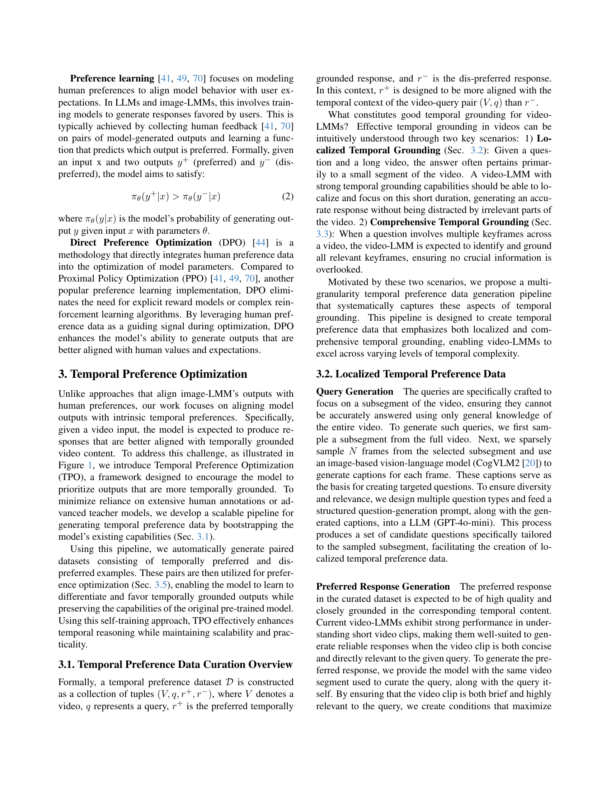
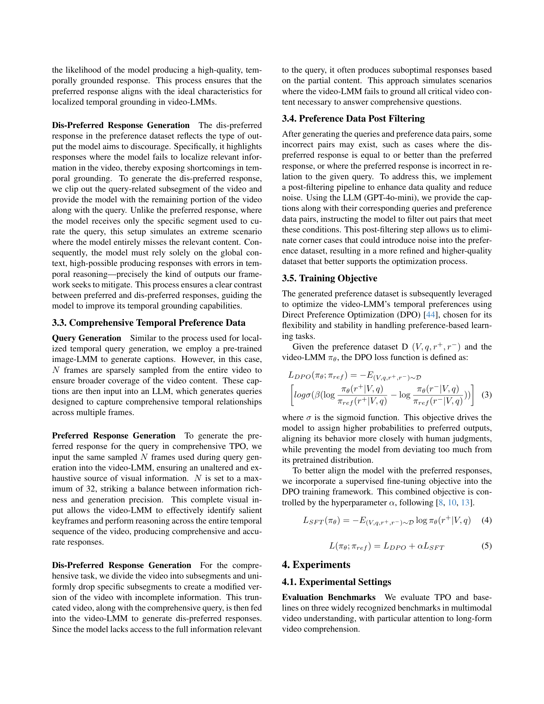
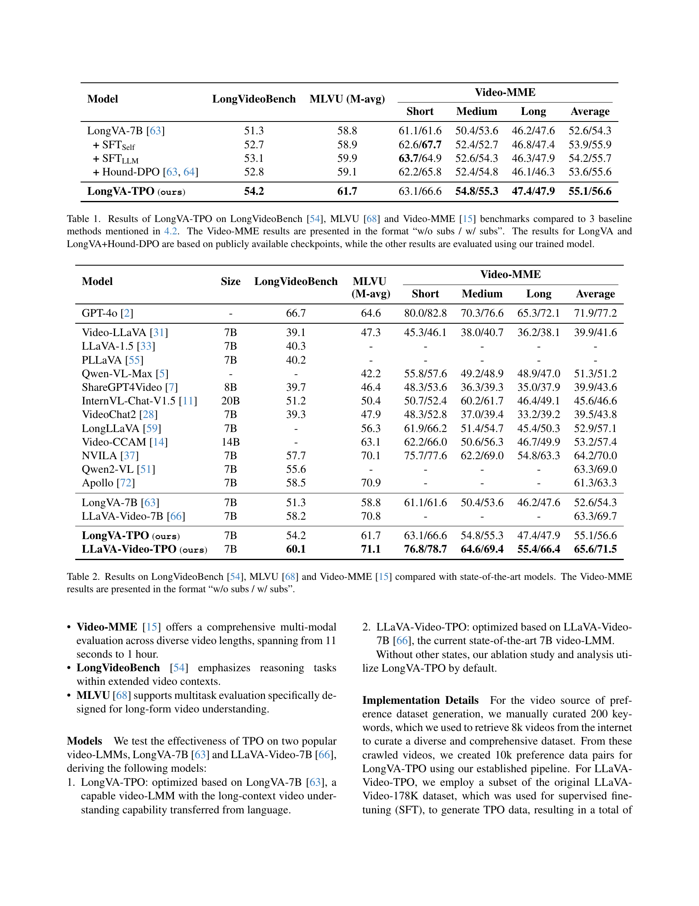
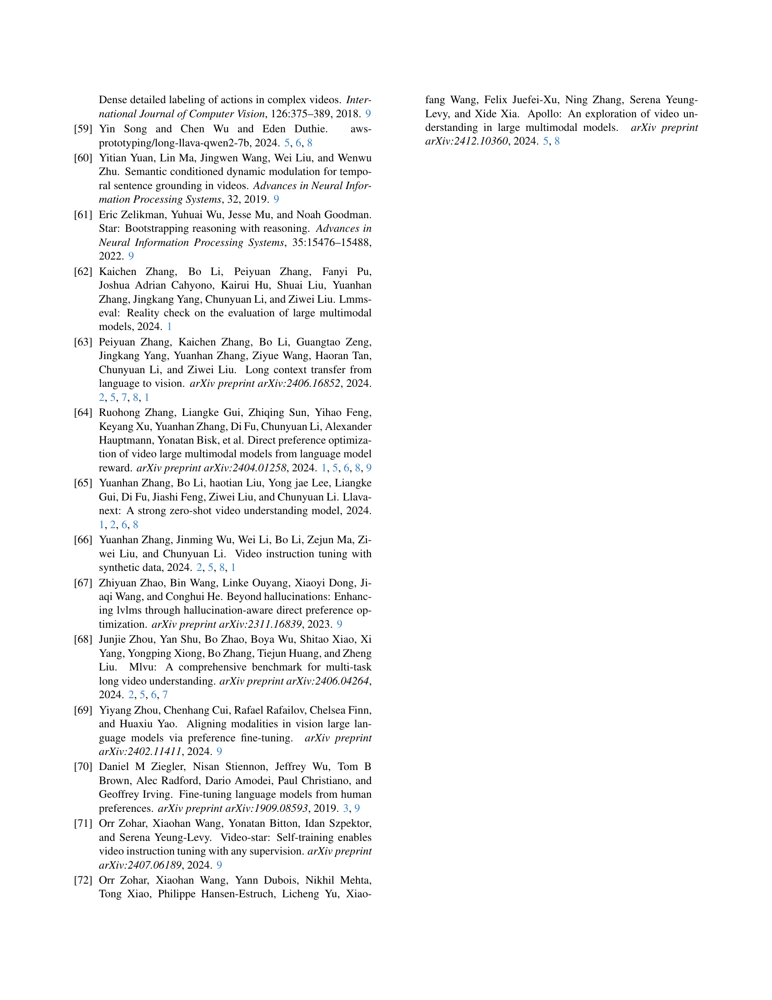
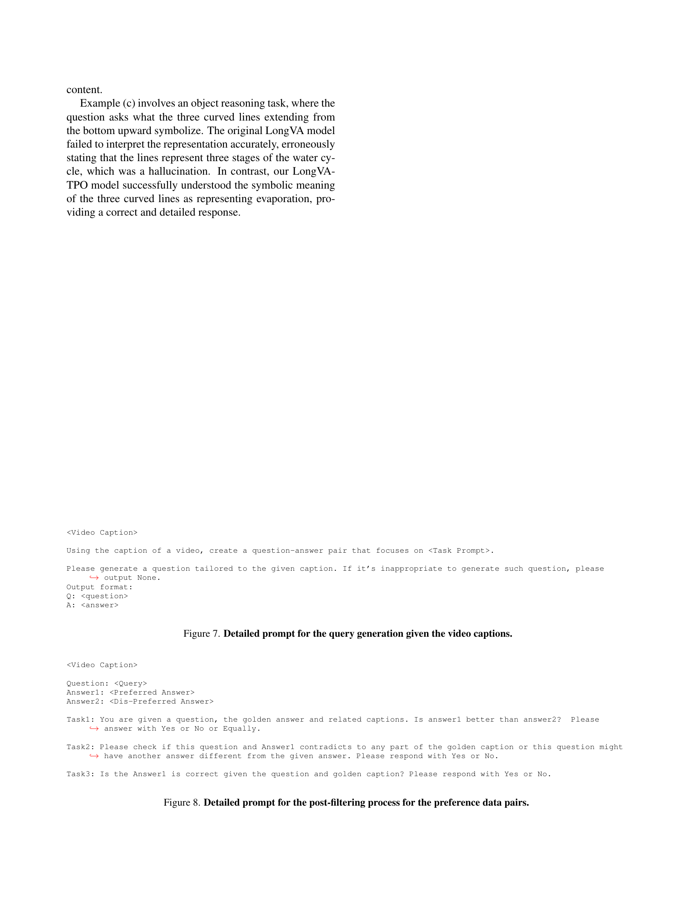

 


 2501.13919 
 Rui Li et el. 
 
 🤗 2025-01-24 
 



↗ arXiv


↗ Hugging Face


↗ Papers with Code


### TL;DR



기존의 장문 비디오 이해 모델들은 **시간적 정확도** 문제로 어려움을 겪어 왔습니다. 특히, 비디오 내에서 특정 사건의 발생 시점을 정확히 파악하는 데 어려움이 있었고, **수동으로 주석을 달아 데이터를 생성**하는 데 많은 비용이 소요되었습니다. 또한,  **긴 문맥을 이해하는 능력이 부족**하여 장문 비디오 분석에 한계가 있었습니다.

본 연구는 이러한 문제를 해결하기 위해 **시간적 선호도 최적화(TPO)** 라는 새로운 방법을 제시합니다. TPO는 모델이 시간적으로 적절한 응답을 선택하도록 유도하는 자기 학습 방식을 사용합니다.  **두 가지 수준의 시간적 선호도 데이터셋** (국소적 및 포괄적 시간적 기반)을 활용하여 모델의 시간적 이해 능력을 향상시켰습니다.  실험 결과, 세 가지 벤치마크에서 기존 최고 성능 모델을 능가하는 성능을 보였습니다.  이는 **데이터 효율성** 및 **확장성**을 높였다는 것을 의미합니다.



#### Key Takeaways


 시간적 선호도 최적화(TPO) 프레임워크를 통해 장문 비디오에서의 시간적 기반 이해 능력 향상 



 제한된 수동 주석 데이터를 사용하여 효율적인 자기 학습 방식을 통해 모델 성능 향상 



 세 가지 장문 비디오 벤치마크에서 기존 최고 성능 모델을 능가하는 성능을 입증 


#### Why does it matter?
본 논문은 장문 비디오 이해를 위한 **시간적 선호도 최적화(TPO)** 프레임워크를 제시하여 기존 비디오-LLM의 성능을 향상시킨다는 점에서 중요합니다. **비디오 이해 분야의 주요 과제인 시간적 정확도 문제를 해결**하는 데 기여하며,  **효율적인 자기 학습 방식**을 통해 어노테이션 데이터 의존도를 낮춰 확장성을 높입니다.  이는 비디오 분석 및 이해 기술 발전에 큰 영향을 미칠 뿐만 아니라, **새로운 연구 방향**을 제시하여 향후 연구를 위한 토대를 마련합니다.

------
#### Visual Insights

> 🔼 그림 1은 비디오-LMM의 시간적 이해 능력을 향상시키기 위해 설계된 자기 개선 선호도 최적화 기술인 시간적 선호도 최적화(TPO)를 보여줍니다. TPO는 지역적 및 포괄적 두 가지 수준의 시간적 선호도를 모델링합니다. 지역적 TPO(좌측 상단)에서는 짧은 구간에 초점을 맞춘 질문을 생성하고, 대상 구간을 포함하거나 제외하는 대조적인 응답을 생성합니다. 포괄적 TPO(좌측 하단)에서는 전체 비디오 대비 희소하게 다운샘플링된 비디오를 사용하여 고차원적 이해를 위한 질문을 생성합니다. 후처리 필터링 후, 대조적인 응답 쌍은 비디오-LMM을 훈련시키는 선호도 데이터 세트로 사용되어 모델이 개선된 비디오 이해를 위해 선호도가 높은 응답을 우선시하도록 안내합니다.
> 

> 
read the caption

> Figure 1: Temporal Preference Optimization (TPO) is a self-improvement preference optimization technique designed to enhance video comprehension in video-LMMs by modeling temporal preferences at two granular levels: localized and comprehensive TPO. In localized TPO (upper-left), we generate queries focused on short segments, with contrastive responses that retain or exclude the target segment. For comprehensive TPO (lower-left), queries are designed for high-level understanding, using intact video versus sparse downsampled video for contrasting responses. After post-filtering, the contrast response pairs are serving as the preference dataset to train a video-LMM, guiding the model to prioritize preferred responses for improved video understanding.
> 


| Model | LongVideoBench | MLVU (M-avg) | Video-MME Short | Video-MME Medium | Video-MME Long | Video-MME Average |
|---|---|---|---|---|---|---|
| LongVA-7B [63] | 51.3 | 58.8 | 61.1/61.6 | 50.4/53.6 | 46.2/47.6 | 52.6/54.3 |
| + SFTSelf | 52.7 | 58.9 | 62.6/67.7 | 52.4/52.7 | 46.8/47.4 | 53.9/55.9 |
| + SFTLLM | 53.1 | 59.9 | 63.7/64.9 | 52.6/54.3 | 46.3/47.9 | 54.2/55.7 |
| + Hound-DPO [64, 63] | 52.8 | 59.1 | 62.2/65.8 | 52.4/54.8 | 46.1/46.3 | 53.6/55.6 |
| LongVA-TPO (ours) | 54.2 | 61.7 | 63.1/66.6 | 54.8/55.3 | 47.4/47.9 | 55.1/56.6 |

> 🔼 표 1은 본 논문의 4.2절에서 언급된 세 가지 기준 모델과 비교하여 LongVideoBench, MLVU, Video-MME 세 가지 벤치마크에서 LongVA-TPO의 결과를 보여줍니다. Video-MME 결과는 자막 없이(w/o subs) / 자막 있이(w/ subs) 두 가지 경우로 제시됩니다. LongVA와 LongVA+Hound-DPO 결과는 공개적으로 사용 가능한 검증점을 기반으로 하며, 다른 결과는 본 논문에서 훈련된 모델을 사용하여 평가한 것입니다.
> 

> 
read the caption

> Table 1: Results of LongVA-TPO on LongVideoBench [54], MLVU [68] and Video-MME [15] benchmarks compared to 3 baseline methods mentioned in 4.2. The Video-MME results are presented in the format “w/o subs / w/ subs”. The results for LongVA and LongVA+Hound-DPO are based on publicly available checkpoints, while the other results are evaluated using our trained model.
> 

### In-depth insights

#### Temporal Grounding
영상 이해에서 **시간적 지점 파악(Temporal Grounding)**은 매우 중요한 과제입니다.  이는 장면의 시간적 흐름을 정확히 이해하고 특정 이벤트나 행동의 시작과 끝을 정확하게 찾아내는 능력을 의미합니다.  **긴 영상**에서의 시간적 지점 파악은 특히 어려운데, 이는 장기간에 걸친 문맥을 이해하고, 다양한 시각적 요소와 시간적 관계를 고려해야 하기 때문입니다. 본 논문은 **선호도 학습(Preference Learning)** 기반의 새로운 방법을 제시하여,  모델이 **시간적 지점에 대한 정확성을 높이고 장기적인 시간적 의존성을 효과적으로 학습**할 수 있도록 합니다.  **두 가지 수준의 선호도 데이터셋**을 활용하여 모델의 정확성과 효율성을 높이는 것이 핵심입니다.  **국소적(localized) 시간적 지점 파악**은 특정 영상 구간에 집중하고, **포괄적(comprehensive) 시간적 지점 파악**은 전체 영상 시퀀스를 고려하여 시간적 의존성을 파악하는 데 초점을 맞춥니다.  이는 **수동 주석 작업의 의존도를 낮추고 확장성과 효율성을 높이는** 데 기여합니다.

#### Preference Learning
선호도 학습은 **인간의 선호도를 모델링하여 모델의 행동을 사용자의 기대에 맞추는 기계 학습 방법**입니다.  이를 통해 사용자 피드백을 통해 모델이 선호하는 출력을 생성하도록 학습시킬 수 있습니다.  **직접 선호도 최적화(DPO)**는 인간의 선호도 데이터를 모델 파라미터 최적화에 직접 통합하는 방법으로,  보상 모델이나 복잡한 강화 학습 알고리즘이 필요없다는 장점이 있습니다.  **비교적 효율적이고 안정적**으로 모델의 출력물을 사람의 가치와 기대에 맞추도록 개선합니다. 본 논문에서 제시된 시간적 선호도 최적화(TPO)는 이러한 선호도 학습의 개념을 영상 이해 모델에 적용하여, **시간적 맥락을 고려한 정확한 응답을 생성**하도록 모델을 향상시키는 데 중점을 둡니다. 특히, **두 가지 세분화된 선호도 데이터셋**을 활용하여 모델의 시간적 추론 능력을 향상시키는 독창적인 접근법을 보여줍니다.

#### Long-Form Video
장문 비디오 이해는 **비디오의 시간적 측면을 효과적으로 모델링**하는 능력에 크게 의존합니다. 기존의 비디오-LLM 접근 방식은 종종 두 단계 교육 패러다임을 따르는데, 이는 대규모 다중 모드 데이터셋에서의 사전 교육과 정교하게 큐레이션된 비디오-텍스트 지침 조정 데이터셋에서의 지도 미세 조정을 포함합니다. 그러나 이러한 방법들은 **시간적 기반 능력이 명시적으로 최적화되지 않아** 장문 비디오에서 미묘한 시간적 관계를 포착하는 데 어려움을 겪을 수 있습니다. 본 논문에서 제안된 시간적 선호도 최적화(TPO)는 이러한 한계를 해결하기 위해 **선호도 학습을 통해 비디오-LLM의 시간적 기반 능력을 향상**시키는 새로운 방법을 제시합니다. TPO는 다양한 수준의 시간적 선호도를 활용하여 모델이 시간적 맥락에 잘 맞는 응답을 우선시하도록 유도하여 **장문 비디오 이해 성능을 크게 향상**시키는 것으로 나타났습니다.  특히, TPO는 수동으로 주석이 달린 데이터에 대한 의존도를 줄이면서 효율성과 확장성을 제공합니다.

#### TPO Framework
본 논문에서 제시된 TPO(Temporal Preference Optimization) 프레임워크는 **장문 비디오에 대한 효과적인 시간적 기반 이해를 위한 혁신적인 방법**입니다. 기존 비디오-LLM(Large Language Model)의 시간적 지각 능력을 향상시키는 데 초점을 맞추고 있으며, **선호도 학습(preference learning)** 접근 방식을 통해 모델이 잘 기반된 시간적 반응과 그렇지 않은 반응을 구별하도록 합니다. 특히 **두 가지 수준의 세분화된 선호도 데이터셋**을 활용하여, 특정 비디오 세그먼트에 초점을 맞춘 국소적 시간적 기반 이해와 전체 비디오 시퀀스를 아우르는 포괄적인 시간적 기반 이해를 모두 고려합니다. 이를 통해 TPO는 수동으로 주석이 달린 데이터에 대한 의존도를 줄이면서 시간적 이해력을 크게 향상시킵니다. **자기 학습 방식**을 채택하여, 비디오-LLM의 성능을 효율적으로 개선하고, 대규모 데이터셋에 대한 확장성을 보장합니다. 실험 결과는 TPO가 여러 장문 비디오 이해 벤치마크에서 우수한 성능을 보이며, 특히 **LLaVA-Video-TPO 모델은 Video-MME 벤치마크에서 최고 성능을 달성**함을 보여줍니다. 따라서 TPO는 장문 비디오 이해 분야에서 시간적 추론을 발전시키는 중요한 진전으로 평가될 수 있습니다.

#### Future of Video-LLMs
비디오-LLM의 미래는 **장기 비디오에 대한 효과적인 시간적 추론**을 달성하는 데 달려 있습니다.  현재 모델들은 짧은 비디오 클립에서는 잘 작동하지만, 긴 비디오의 미묘한 시간적 관계를 포착하는 데 어려움을 겪습니다.  **더욱 정교한 시간적 지도 학습 데이터셋**과 **더욱 효율적인 자기 학습 프레임워크**가 미래 발전에 필수적입니다.  **다중 모달리티 통합** 또한 중요한데, 시각적 정보와 언어적 정보를 원활하게 조합하여 보다 풍부하고 정확한 이해를 가능하게 합니다. 마지막으로, **확장성과 효율성**이 중요합니다.  더욱 큰 모델과 더 많은 데이터를 사용할 수 있는 능력은 더욱 발전된 시간적 추론과 일반화 성능을 가져올 것입니다.  하지만 이러한 성장은 계산 자원과 에너지 소비에 대한 우려를 불러일으킬 수 있으므로, **효율적인 학습 방법**에 대한 연구도 매우 중요합니다.

### More visual insights

More on figures

> 🔼 그림 2는 MLVU 데이터셋에서 입력 비디오 길이에 따른 LongVA-TPO와 LongVA 모델의 성능 변화를 보여줍니다. LongVA-TPO는 입력 길이가 길어질수록 성능이 지속적으로 향상되는 반면, LongVA는 입력 길이가 64 프레임을 초과하면 성능 저하를 경험합니다. 이는 LongVA-TPO가 장시간 비디오에 대한 이해 능력을 향상시키는 데 효과적임을 시사합니다.  즉, LongVA-TPO는 긴 비디오에 대해서도 성능이 개선되는 반면, LongVA는 비디오 길이가 일정 수준을 넘어서면 성능이 떨어지는 것을 보여줍니다.
> 

> 
read the caption

> Figure 2: The performance of LongVA-TPO and LongVA on MLVU with different input lengths. LongVA-TPO consistently shows performance improvements with longer inputs, whereas LongVA experiences performance degradation when the input exceeds 64 frames.
> 

> 🔼 그림 3은 논문에서 제시된 'needle-in-a-haystack' 과제에서 LongVA-TPO 모델과 원본 LongVA 모델의 성능을 비교한 그래프입니다.  x축은 비디오 프레임 수(log2 스케일), y축은 점수를 나타냅니다.  두 모델 모두 프레임 수가 증가함에 따라 성능이 향상되지만, LongVA-TPO 모델은 LongVA 모델보다 훨씬 높은 점수를 기록하며, 특히 프레임 수가 많을 때 그 차이가 더욱 두드러집니다.  이것은 LongVA-TPO 모델이 장시간 비디오에서도 시간적 정확도를 유지하며 목표 정보를 효과적으로 찾아낼 수 있음을 시사합니다.  그래프의 색상은 각 모델의 성능을 나타내는 등급(depth percent)을 보여줍니다.  즉, 색이 진할수록 해당 프레임에서 모델의 정확도가 높다는 것을 의미합니다.
> 

> 
read the caption

> Figure 3: Comparison of our LongVA-TPO model and the original LongVA model on the needle-in-a-haystack task.
> 

> 🔼 그림 4는 VideoMME 벤치마크의 두 개의 비디오에 대해 LongVA-TPO 모델과 LongVA 모델의 성능을 질적으로 비교한 것입니다.  LongVA-TPO 모델은 포괄적인 질문과 국지적인 질문 모두에서 LongVA 모델보다 뛰어난 답변 생성 품질을 보여줍니다.  즉, 비디오의 맥락을 더 잘 이해하고 더 정확하고 상세한 답변을 생성한다는 것을 의미합니다. 그림에는 두 가지 질문-답변 예시가 포함되어 있으며, 각 예시에서 LongVA-TPO 모델이 LongVA 모델보다 더 적절하고 정확한 답변을 생성하는 것을 보여줍니다.
> 

> 
read the caption

> Figure 4: Qualitative comparison between LongVA-TPO model and LongVA on two videos from VideoMME benchmark. Our LongVA-TPO model demonstrates superior generation quality on both comprehensive and localized questions.
> 

> 🔼 이 그림은 논문에서 사용된 8,000개의 크롤링 비디오의 길이 분포를 보여줍니다. x축은 비디오 길이를 나타내고 y축은 해당 길이의 비디오 개수를 나타냅니다. 이를 통해 연구에 사용된 비디오 데이터의 길이 분포가 어떠한지를 한눈에 파악할 수 있습니다.  특히, 비디오 길이의 다양성을 보여주는 데 유용하며, 짧은 비디오와 긴 비디오의 비율을 파악하는 데 도움이 됩니다.  이 정보는 모델의 성능을 평가하는 데 중요한 요소가 될 수 있습니다.
> 

> 
read the caption

> Figure 5: The distribution of lengths for 8K crawled videos.
> 

> 🔼 그림 6은 LongVA-TPO를 위한 10,000개의 큐레이션된 선호도 데이터셋에 대한 질문 유형의 분포를 보여줍니다.  각 질문 유형은 데이터셋에서 차지하는 비율을 백분율로 나타냅니다.  데이터셋은 다양한 유형의 비디오 이해 작업을 다루는 질문들을 포함하며, 시간적 추론, 행동 추론, 인과 관계 추론, 정보 추출, 서술형 질문, 요약, 개체 추론, 공간적 추론 등이 포함되어 있습니다. 이는 TPO 모델이 다양한 종류의 질문에 대해서도 효과적인 응답을 생성할 수 있도록 훈련되었음을 보여줍니다.
> 

> 
read the caption

> Figure 6: The distribution of question types for 10K curated preference dataset for LongVA-TPO.
> 

More on tables


| Model | Size | LongVideoBench | MLVU (M-avg) | Video-MME Short | Video-MME Medium | Video-MME Long | Video-MME Average |
|---|---|---|---|---|---|---|---| 
| GPT-4o[2] | - | 66.7 | 64.6 | 80.0/82.8 | 70.3/76.6 | 65.3/72.1 | 71.9/77.2 |
| Video-LLaVA[31] | 7B | 39.1 | 47.3 | 45.3/46.1 | 38.0/40.7 | 36.2/38.1 | 39.9/41.6 |
| LLaVA-1.5[33] | 7B | 40.3 | - | - | - | - | - |
| PLLaVA[55] | 7B | 40.2 | - | - | - | - | - |
| Qwen-VL-Max[5] | - | - | 42.2 | 55.8/57.6 | 49.2/48.9 | 48.9/47.0 | 51.3/51.2 |
| ShareGPT4Video[7] | 8B | 39.7 | 46.4 | 48.3/53.6 | 36.3/39.3 | 35.0/37.9 | 39.9/43.6 |
| InternVL-Chat-V1.5[11] | 20B | 51.2 | 50.4 | 50.7/52.4 | 60.2/61.7 | 46.4/49.1 | 45.6/46.6 |
| VideoChat2[28] | 7B | 39.3 | 47.9 | 48.3/52.8 | 37.0/39.4 | 33.2/39.2 | 39.5/43.8 |
| LongLLaVA[59] | 7B | - | 56.3 | 61.9/66.2 | 51.4/54.7 | 45.4/50.3 | 52.9/57.1 |
| Video-CCAM[14] | 14B | - | 63.1 | 62.2/66.0 | 50.6/56.3 | 46.7/49.9 | 53.2/57.4 |
| NVILA[37] | 7B | 57.7 | 70.1 | 75.7/77.6 | 62.2/69.0 | 54.8/63.3 | 64.2/70.0 |
| Qwen2-VL[51] | 7B | 55.6 | - | - | - | - | 63.3/69.0 |
| Apollo[72] | 7B | 58.5 | 70.9 | - | - | - | 61.3/63.3 |
| LongVA-7B[63] | 7B | 51.3 | 58.8 | 61.1/61.6 | 50.4/53.6 | 46.2/47.6 | 52.6/54.3 |
| LLaVA-Video-7B[66] | 7B | 58.2 | 70.8 | - | - | - | 63.3/69.7 |
| **LongVA-TPO (ours)** | 7B | 54.2 | 61.7 | 63.1/66.6 | 54.8/55.3 | 47.4/47.9 | 55.1/56.6 |
| **LLaVA-Video-TPO (ours)** | 7B | **60.1** | **71.1** | **76.8**/ **78.7** | **64.6**/ **69.4** | **55.4**/ **66.4** | **65.6**/ **71.5** |
> 🔼 표 2는 LongVideoBench, MLVU, Video-MME 세 가지 비디오 이해 벤치마크에서 제안된 방법(TPO)의 성능을 최첨단 모델들과 비교하여 보여줍니다. Video-MME 결과는 자막 유무에 따라 '자막 없음/자막 있음' 형식으로 제시됩니다. 이 표는 TPO가 다양한 비디오 길이와 복잡도에 걸쳐 우수한 성능을 달성함을 보여주는 실험 결과를 요약하여 보여줍니다.
> 

> 
read the caption

> Table 2: Results on LongVideoBench [54], MLVU [68] and Video-MME [15] compared with state-of-the-art models. The Video-MME results are presented in the format “w/o subs / w/ subs”.
> 


| Model | LongVideoBench | MLVU | VideoMME |
|---|---|---|---|
| LongVA | 51.3 | 58.8 | 52.6 |
| TPO2k | 52.5 | 57.8 | 52.8 |
| TPO5k | 53.7 | 59.5 | 53.6 |
| TPO10k | **54.2** | **61.7** | **55.1** |
> 🔼 표 3은 LongVA-TPO 모델을 다양한 크기의 데이터셋으로 학습시킨 결과를 보여줍니다.  데이터셋의 크기가 증가함에 따라 LongVA-TPO의 성능이 지속적으로 향상되는 것을 확인할 수 있습니다. Video-MME 벤치마크의 경우 자막 없이 평가되었습니다. 이 표는 TPO 모델의 확장성과 데이터 크기 변화에 대한 강건성을 보여주는 중요한 결과를 제시합니다.
> 

> 
read the caption

> Table 3: Results of LongVA-TPO (TPO) trained on different data scales. TPO achieves consistent performance improvements as the data scale increases. The performance on the VideoMME benchmark is evaluated without subtitles.
> 


| Model | LongVideoBench | MLVU | VideoMME |
|---|---|---|---|
| LongVA | 51.3 | 58.8 | 52.6 |
| TPOlocalized | 53.5 | 58.7 | 54.0 |
| TPOcomprehensive | 53.4 | 58.5 | 53.8 |
| TPOfull | **54.2** | **61.7** | **55.1** |
> 🔼 표 4는 다양한 데이터 세분화(localized temporal preference data와 comprehensive temporal preference data)를 사용했을 때의 성능을 비교 분석한 결과를 보여줍니다.  Localized TPO는 비디오의 특정 부분에 초점을 맞춘 질의응답 데이터를 사용하고, Comprehensive TPO는 전체 비디오 시퀀스를 고려한 질의응답 데이터를 사용합니다. 이 표를 통해 각 데이터 세분화 방식의 효과와 두 방식을 결합했을 때의 시너지 효과를 확인할 수 있습니다.  각 데이터 유형별 성능과 두 유형의 데이터를 결합했을 때의 성능 향상을 비교하여 TPO 모델의 성능 개선에 어떤 데이터 세분화 방식이 더 효과적인지 분석합니다.
> 

> 
read the caption

> Table 4: Ablation study of different data granularities.
> 


| Localized/Comprehensive TPO Ratio | LongVideoBench | MLVU | VideoMME |
|---|---|---|---|
| 10:0 | 53.5 | 58.7 | 54.0 |
| 8:2 | 53.8 | 59.9 | 54.0 |
| 5:5 (Our final TPO model) | 54.2 | 61.7 | 55.1 |
| 2:8 | 53.4 | 59.1 | 54.2 |
| 0:10 | 53.4 | 58.5 | 53.8 |
> 🔼 표 5는 LongVA 모델을 기반으로, 국소적 TPO 데이터와 종합적 TPO 데이터의 혼합 비율을 다르게 하여 학습시킨 TPO의 결과를 보여줍니다. 국소적 TPO 데이터와 종합적 TPO 데이터의 비율을 10:0, 8:2, 5:5, 2:8, 0:10으로 다르게 하여 실험하였고, 각 비율에 따른 LongVideoBench, MLVU, VideoMME 세 가지 벤치마크에서의 성능을 보여줍니다. 이를 통해 국소적 TPO와 종합적 TPO 데이터의 균형 잡힌 조합이 모델 성능 향상에 중요함을 보여줍니다.
> 

> 
read the caption

> Table 5: Results of TPO trained on different data mix ratios for localized TPO and comprehensive TPO data based on the LongVA model.
> 

### Full paper



