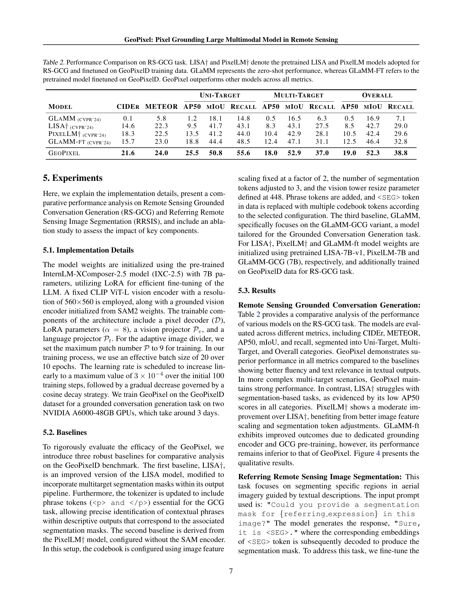

 


 2501.13925 
 Akashah Shabbir et el. 
 
 🤗 2025-01-27 
 



↗ arXiv


↗ Hugging Face


↗ Papers with Code


### TL;DR



기존의 대규모 다중 모달 모델(LMM)은 자연 이미지 영역에서는 효과적이지만, 원격 감지(RS) 이미지의 고유한 특징(예: 높은 해상도, 다양한 크기와 방향의 객체, 작은 물체)으로 인해 성능이 저하되는 문제가 있습니다. 또한, 기존 RS-LMM은 객체를 정확하게 위치 파악하는 데 경계 상자만을 사용하여 세밀한 시각적 이해가 부족하며, RS 도메인에 특화된 충분한 양의 데이터가 없습니다.

본 연구는 이러한 문제점들을 해결하기 위해 **고해상도 RS 영상에 대한 픽셀 수준의 접지(grounding)를 지원하는 최초의 엔드투엔드 LMM인 GeoPixel**을 제안합니다. GeoPixel은 대화 중에 인터리브 마스크를 생성하여 세밀한 시각적 인식을 지원하며, 최대 4K HD 해상도를 지원합니다. 또한, **RS 데이터에 맞춤화된 새로운 데이터셋 GeoPixelD**를 구축하여 LMM의 접지 대화 생성(GCG) 능력을 향상시켰습니다. GeoPixel은 단일 및 다중 목표 분할 작업에서 기존 LMM을 능가하는 뛰어난 성능을 보여주었으며, ablation study를 통해 각 구성 요소의 효과를 검증했습니다.



#### Key Takeaways


 GeoPixel은 고해상도 원격 감지 영상에서 픽셀 수준의 시맨틱 이해를 가능하게 하는 최초의 첨단 다중 모달 모델입니다. 



 GeoPixelD라는 새로운 고품질 데이터셋을 통해 다중 모달 모델의 정확도와 효율성을 향상시켰습니다. 



 4K 해상도 지원 및 포괄적인 벤치마크는 고해상도 원격 감지 영상 분석의 발전에 크게 기여할 것입니다. 


#### Why does it matter?
본 논문은 **고해상도 원격 감지 영상에 대한 정확한 픽셀 수준의 이해**를 가능하게 하는 새로운 대규모 다중 모달 모델인 GeoPixel을 제시함으로써 원격 감지 분야의 연구자들에게 중요한 의미를 가집니다. **픽셀 수준의 접지(grounding)** 기능은 기존의 경계 상자 기반 접근 방식보다 훨씬 세밀한 분석을 가능하게 하여 도로, 건물, 작물 등과 같은 중요한 지리적 특징을 보다 정확하게 식별하고 분류할 수 있습니다. 또한, **새로운 데이터셋 GeoPixelD**의 생성은 향후 연구자들이 보다 정확하고 효과적인 다중 모달 모델을 개발하는 데 도움이 될 것이며, **4K 해상도 지원**은 고해상도 영상 분석의 필요성이 증가하는 추세에 부합합니다. 이러한 발전은 자율 주행, 정밀 농업, 재해 관리 등 다양한 분야에서 원격 감지 기술의 적용을 크게 향상시킬 수 있습니다.

------
#### Visual Insights

> 🔼 제시된 그림은 GeoPixel 모델이 고해상도 원격 감지 이미지를 정확하게 해석하고 분할하는 능력을 보여줍니다.  GeoPixel은 트랙 경기장, 수영장, 축구장과 같은 주요 객체에 대해서는 개별 마스크를 적용하고, 차량과 같은 작은 객체들에 대해서는 의미론적 마스크를 적용합니다.  이미지의 중앙, 상단과 같은 공간적 위치와 스포츠 단지 내의 관계를 효과적으로 식별하고 건물, 도로, 녹지와 같은 전반적인 맥락과 국지적인 구조를 구분합니다.  세분화된 정밀도로 원격 감지 이미지를 해석하고 분할하는 능력을 강조합니다.
> 

> 
read the caption

> Figure 1: An example of visually grounded detailed descriptions generated by the proposed GeoPixel, highlighting its ability to interpret and segment high-resolution remote sensing imagery with fine-grained precision. The model applies distinct masks to key objects (ground track field, swimming pool, soccer field) and semantic mask to smaller objects (vehicles). It effectively identifies spatial positions (e.g., center, top) and relationships (within the sports complex) while distinguishing between the global context (buildings, roads, green spaces) and localized structures.
> 


| Models | Resolution | Image | Region output | Region Decoder | Pixel Grounding | End to End Model | 
|---|---|---|---|---|---|---|
| RSGPT (Hu et al., 2023) | 224 × 224 | ✓ | × | × | × | ✓ | 
| H2RSVLM (Pang et al., 2024) | 336 × 336 | ✓ | × | × | × | ✓ | 
| RS-LLaVA (Bazi et al., 2024) | 336 × 336 | ✓ | × | × | × | ✓ | 
| GeoChat (Kuckreja et al., 2024) | 504 × 504 | ✓ | ✓ | × | × | ✓ | 
| SkyEyeGPT (Zhan et al., 2024) | 448 × 448 | ✓ | ✓ | × | × | ✓ | 
| EarthGPT (Zhang et al., 2024c) | - | ✓ | ✓ | × | × | ✓ | 
| LHRS-Bot (Muhtar et al., 2024) | 224×224 | ✓ | ✓ | × | × | ✓ | 
| SkySenseGPT (Luo et al., 2024) | 504 × 504 | ✓ | ✓ | × | × | ✓ | 
| GeoPixel | dynamic upto 4k | ✓ | ✓ | ✓ | ✓ | ✓ |

> 🔼 표 1은 원격 감지 대규모 다중 모드 모델(RS-LMM)을 비교하고, 특히 객체 접지 기능에 중점을 둡니다. '영역 출력' 열은 객체를 특정 공간 영역과 연결하는 모델의 기능을 보여줍니다. 기존 모델은 주로 LLM을 사용하여 객체 접지를 위한 경계 상자 좌표를 생성하지만, 현재 RS-LMM 중 어떤 것도 '픽셀 접지' 기능, 즉 세밀한 공간 해석에 중요한 상세 분할 마스크 생성 기능을 갖추고 있지 않습니다.
> 

> 
read the caption

> Table 1: Comparison of remote sensing large multimodal models (RS-LMMs), focusing on their grounding capabilities. The ‘Region Output’ column highlights the model’s ability to associate objects with specific spatial regions. Existing models primarily utilize LLMs to generate bounding box coordinates for object grounding. However, none of the current RS-LMMs possess the capability for ‘pixel grounding’, i.e., generating detailed segmentation masks, which are crucial for fine-grained spatial interpretation.
> 

### In-depth insights

#### GeoPixel: RS-LMM
GeoPixel은 **고해상도 원격 감지 이미지 분석을 위해 특별히 설계된 최초의 픽셀 기반 접지 대규모 다중 모드 모델(RS-LMM)**입니다. 기존의 RS-LMM들이 경계 상자를 사용하여 객체를 식별하는 것과 달리 GeoPixel은 **픽셀 수준의 정확도로 객체를 식별하는 픽셀 기반 접지 기능**을 제공하여 고해상도 이미지에서도 세밀한 시각적 이해가 가능합니다.  **최대 4K 해상도**를 지원하며, **다중 객체 분할 작업**에서 우수한 성능을 보입니다.  **GeoPixelD라는 새롭게 제작된 데이터셋**을 활용하여 훈련되었으며, 이 데이터셋은 **반자동 파이프라인**을 통해 생성되어 RS 데이터에 맞춤화된 공간적 사전 정보를 사용하여 데이터 생성 과정을 체계적으로 제어합니다.  GeoPixel은 **고해상도 원격 감지 영상 분석에 대한 새로운 가능성**을 열어주는 혁신적인 모델입니다.  향후 연구는 다양한 RS 데이터에 대한 GeoPixel의 적용성을 더욱 확장하고, 모델의 성능을 개선하는 방향으로 진행될 것으로 예상됩니다.

#### Pixel Grounding
본 논문에서 제시된 "픽셀 기반 접지(Pixel Grounding)" 개념은 **고해상도 원격 감지 영상에서 픽셀 단위의 정확한 객체 식별 및 분할**을 가능하게 합니다. 기존의 영역 기반 접지 방식과 달리, 픽셀 기반 접지는 **세밀한 시맨틱 정보**를 제공하여 이미지의 미세한 특징까지 정확하게 파악할 수 있게 합니다. 이는 특히 **다양한 크기와 방향의 객체가 복잡하게 혼재된 고해상도 영상 분석**에 중요한 의미를 지닙니다.  **GeoPixel 모델은 이러한 픽셀 기반 접지를 통해 다중 객체 분할 작업에서 우수한 성능**을 보여주며, 기존의 LMM(Large Multimodal Model)들이 고해상도 원격 감지 영상에서 보이는 성능 저하 문제를 극복하는 데 기여합니다.  **GeoPixelD 데이터셋은 이러한 픽셀 기반 접지 학습에 필수적인 고품질의 데이터**를 제공하여 모델의 성능 향상에 크게 기여합니다.

#### GeoPixelD Dataset
본 논문에서 제시된 GeoPixelD 데이터셋은 **고해상도 원격 감지 영상에 대한 픽셀 수준의 정확한 이해를 가능하게 하는 다중 모드 데이터셋**입니다. 기존의 RS-LMM(원격 감지 대규모 다중 모드 모델)들이 경계 상자를 이용하여 물체를 구분하는 것과 달리, GeoPixelD는 **픽셀 단위의 정밀한 분할 마스크를 제공**하여 보다 정교한 시맨틱 정보를 제공합니다. 이는 단일 객체 뿐만 아니라 **여러 객체에 대한 정확한 위치 파악과 분류를 가능**하게 하여, 보다 복잡한 RS 영상 분석에 유용합니다.  **반자동 파이프라인을 통해 생성**된 GeoPixelD는 **다양한 크기의 객체들과 복잡한 공간적 관계를 포함**하여, 실제 원격 감지 환경의 다양성을 충실히 반영하고 있습니다. 또한, **계층적 주석 구조**를 통해 장면 전체에 대한 설명, 개별 객체의 속성, 밀집된 객체 그룹의 정보를 모두 포함하고 있어, 다양한 RS 관련 작업에 활용될 수 있습니다.  **풍부하고 정밀한 주석 정보**는 향후 RS-LMM 모델 개발과 성능 향상에 크게 기여할 것으로 예상됩니다.

#### RS-GCG Results
본 논문의 "RS-GCG 결과" 부분은 원격 감지 영상에 대한 기반 대화 생성(Grounded Conversation Generation) 작업의 성능을 평가한 결과를 보여줍니다. **GeoPixel 모델은 기존의 LMM(Large Multimodal Model)들보다 우수한 성능을 보였으며**, 특히 다중 타겟 분할 작업에서 두드러지는 성과를 나타냈습니다.  **GeoPixel은 Pixel-level grounding 기능을 통해 정확한 공간적 정보를 담은 세밀한 세분화 마스크를 생성**, 기존의 bounding box 기반 접근 방식보다 개선된 결과를 제공합니다.  **GeoPixelD 데이터셋의 고품질 주석 데이터**가 모델의 성능 향상에 크게 기여했으며, 이는 다양한 난이도의 작업에서도 뛰어난 성능을 보여주는 결과로 이어졌습니다.  하지만 일부 복잡한 시나리오, 특히 밀집된 객체가 존재하는 경우에는 성능 저하가 관찰되었고, **향후 연구에서는 복잡한 공간적 관계 및 객체 밀도에 대한 모델의 처리 능력 개선**이 필요함을 시사합니다.  **고해상도 영상 분석**에 특화된 GeoPixel 모델의 성능은 **원격 탐사 분야에서의 LMM 활용 가능성**을 보여주는 중요한 결과입니다.

#### Future Challenges
본 논문에서 제시된 GeoPixel 모델은 고해상도 원격탐사 영상에 대한 픽셀 단위의 정확한 이해와 시맨틱한 표현에 있어 상당한 진전을 보였지만, **여전히 개선의 여지가 있는 몇 가지 중요한 과제**들이 남아있습니다.  특히, 복잡한 장면에서의 **마스크 생성의 모호성 문제**, **밀집된 객체들에 대한 정확도 저하**, **다양한 센서 데이터 통합의 어려움** 등이 향후 연구의 초점이 되어야 합니다.  **보다 강건한 마스크 생성 전략**과 **동적 해상도 조정 기법**을 도입하여 복잡한 장면에서의 성능을 개선하는 연구가 필요하며, **SAR이나 적외선 영상과 같은 다양한 센서 데이터를 통합**하여 GeoPixel 모델의 활용 범위를 확장하는 연구도 중요한 과제입니다.  **데이터셋의 질적 향상**을 위해서는 **세밀한 주석 작업**이 필요하고,  **다양한 유형의 객체에 대한 풍부한 주석 정보**를 포함하는 더욱 **확장된 데이터셋 구축**이 요구됩니다. 이러한 노력들을 통해 GeoPixel 모델의 성능과 활용 가능성을 더욱 향상시키고, 원격탐사 분야에 **새로운 패러다임**을 제시할 수 있을 것입니다.

### More visual insights

More on figures

> 🔼 그림 2는 GeoPixel 아키텍처의 개요를 보여줍니다. 왼쪽에는 고해상도 RS 이미지가 동적으로 로컬 패치와 크기 조정된 글로벌 뷰로 분할되어 고정된 비전 인코더로 인코딩되는 과정을 보여줍니다. 인코딩은 분리 토큰을 사용하여 언어 도메인으로 투영됩니다. 가운데에는 비전 토큰이 텍스트와 결합되어 LLM에 입력되고, pLoRA가 비전 토큰에 적용되어 효율적이고 효과적인 다중 모드 정렬이 이루어집니다. 오른쪽에는 [SEG] 토큰에 해당하는 임베딩이 텍스트 프로젝터를 통해 디코더로 전달되고, 접지 비전 인코더의 비전 임베딩과 함께 정확한 분할 마스크를 생성합니다.
> 

> 
read the caption

> Figure 2: Overview of GeoPixel Architecture: Left: High-resolution RS images are dynamically partitioned into local patches and a resized global view, encoded by a frozen vision encoder. The encodings are projected into the language domain with separator tokens. Middle: Vision tokens, combined with text, are input into the LLM, where pLoRA is applied to vision tokens for efficient and effective multimodal alignment. Right: The corresponding embeddings for the [SEG] tokens are passed to a decoder through text projector, along with vision embeddings from the grounding vision encoders, to generate precise segmentation masks.
> 

> 🔼 이 그림은 GeoPixelD 어노테이션 파이프라인을 보여줍니다. 이 파이프라인은 원격 감지 이미지에 대한 다단계 설명을 생성하고, 객체 구문을 수동으로 주석 처리된 마스크와 정확하게 정렬합니다.  먼저, 전체 이미지 주석(왼쪽 아래)에서 LMM이 간결한 장면 설명을 생성합니다. 개별 인스턴스 주석(오른쪽 아래)에서는 공간({pos}) 및 범주형({catagorory_name}) 사전 정보와 SOM({mark_number}) 프롬프트를 사용하여 주요 객체를 설명합니다. 클러스터 주석(오른쪽 위)에서는 정밀한 공간 분석을 위해 개선된 그리드를 사용하여 작거나 조밀한 객체들을 구성합니다.
> 

> 
read the caption

> Figure 3: The GeoPixelD Annotation Pipeline provides detailed multi-tier descriptions of remote sensing imagery with object phrases aligned precisely with manually annotated masks. It begins with Holistic Image Annotation (bottom left), where an LMM generates concise scene descriptions. Individual Instance Annotation (bottom right) uses spatial({pos}) and categorical ({catagorory_name}) priors with SOM ({mark_number}) prompting to describe key objects. Cluster Annotation (top right) organizes smaller or dense objects using refined grids for precise spatial analysis.
> 

> 🔼 그림 4는 GeoPixel 모델의 원격 감지 기반 대화 생성(RS-GCG) 성능을 보여줍니다. GeoPixel은 개체의 크기와 밀도에 따라 개별 개체를 정확하게 구분하는 인스턴스 마스크 또는 차량 또는 소형 개체와 같은 광범위한 범주를 포착하는 의미 마스크를 사용하여 원격 감지 이미지에 대한 문맥적으로 풍부한 설명과 기반 개체 주석을 생성합니다. 오른쪽과 가운데 오른쪽 이미지는 인스턴스 마스크를 사용한 개별 개체의 정확한 묘사를 보여주는 반면, 가운데 왼쪽과 왼쪽 이미지는 의미 마스크를 사용하여 차량 또는 소형 개체와 같은 광범위한 범주를 포착하는 것을 보여줍니다.
> 

> 
read the caption

> Figure 4: Qualitative results of GeoPixel on RS-GCG. Contextually rich descriptions of RS imagery with grounded object annotations. Depending on object scale and density, it employs instance masks for precise delineation of individual objects (right and middle-right images) while semantic masks capture broader categories, such as large clusters of vehicles or small objects (middle-left and left images).
> 

> 🔼 그림 5는 잘못된 마스크 연결(왼쪽)과 동일한 공간 영역에서의 잘못된 인스턴스 분할(오른쪽)로 인해 발생하는 실패 사례를 보여줍니다. 왼쪽 그림은 모델이 객체를 잘못 식별하고 잘못된 마스크를 할당하여 객체 경계를 부정확하게 나타내는 경우를 보여줍니다. 오른쪽 그림은 모델이 동일한 공간 영역 내에서 객체 인스턴스를 잘못 분할하여 여러 객체를 하나로 그룹화하거나 하나의 객체를 여러 개로 나누는 경우를 보여줍니다. 이러한 실패 사례는 모델이 복잡한 이미지와 밀집된 객체를 처리하는 데 어려움을 겪음을 시사합니다.
> 

> 
read the caption

> Figure 5: Failure case due to incorrect mask association (left) and wrong instance segmentation in the same spatial region (right).
> 

More on tables


| Model | CIDEr | METEOR | Uni-Target AP50 | Uni-Target mIoU | Uni-Target Recall | Multi-Target AP50 | Multi-Target mIoU | Multi-Target Recall | Overall AP50 | Overall mIoU | Overall Recall |
|---|---|---|---|---|---|---|---|---|---|---|---| 
| GLaMM(CVPR'24) | 0.1 | 5.8 | 1.2 | 18.1 | 14.8 | 0.5 | 16.5 | 6.3 | 0.5 | 16.9 | 7.1 |
| LISA†(CVPR'24) | 14.6 | 22.3 | 9.5 | 41.7 | 43.1 | 8.3 | 43.1 | 27.5 | 8.5 | 42.7 | 29.0 |
| PixelLM†(CVPR'24) | 18.3 | 22.5 | 13.5 | 41.2 | 44.0 | 10.4 | 42.9 | 28.1 | 10.5 | 42.4 | 29.6 |
| GLaMM-ft(CVPR'24) | 15.7 | 23.0 | 18.8 | 44.4 | 48.5 | 12.4 | 47.1 | 31.1 | 12.5 | 46.4 | 32.8 |
| GeoPixel | **21.6** | **24.0** | **25.5** | **50.8** | **55.6** | **18.0** | **52.9** | **37.0** | **19.0** | **52.3** | **38.8** |
> 🔼 표 2는 원격 감지 기반 대화 생성(RS-GCG) 작업에 대한 다양한 모델의 성능을 비교 분석한 결과를 보여줍니다.  LISA†와 PixelLM†는 RS-GCG에 적용하고 GeoPixelD 학습 데이터로 미세 조정된 사전 학습된 LISA 및 PixelLM 모델을 나타냅니다. GLaMM은 제로샷(zero-shot) 성능을, GLaMM-FT는 GeoPixelD로 미세 조정된 사전 학습된 모델을 나타냅니다. GeoPixel은 모든 평가 지표에서 다른 모델보다 성능이 뛰어납니다.  표에는 CIDEr, METEOR, AP50, mIoU, 재현율(Recall)과 같은 다양한 지표가 단일 대상, 다중 대상 및 전체 세 가지 범주로 나뉘어 제시됩니다.
> 

> 
read the caption

> Table 2: Performance Comparison on RS-GCG task. LISA††\dagger† and PixelLM††\dagger† denote the pretrained LISA and PixelLM models adopted for RS-GCG and finetuned on GeoPixelD training data. GLaMM represents the zero-shot performance, whereas GLaMM-FT refers to the pretrained model finetuned on GeoPixelD. GeoPixel outperforms other models across all metrics.
> 


| Method | Validation Set |  |  | Test Set |  |  |
|---|---|---|---|---|---|---|
|  | P@0.5 | oIoU | mIoU | P@0.5 | oIoU | mIoU |
| RRN (Li et al., 2018) | 51.09 | 66.53 | 46.06 | 51.07 | 66.43 | 45.64 |
| CSMA (Ye et al., 2019) | 55.68 | 69.68 | 48.85 | 55.32 | 69.39 | 48.54 |
| LSCM (Hui et al., 2020) | 57.12 | 69.28 | 50.36 | 56.02 | 69.05 | 49.92 |
| CMPC (Huang et al., 2020) | 57.93 | 70.15 | 50.41 | 55.83 | 69.22 | 49.24 |
| BRINet (Hu et al., 2020) | 58.79 | 70.73 | 51.14 | 56.90 | 69.88 | 49.65 |
| CMPC+ (Liu et al., 2022) | 59.19 | 70.14 | 51.41 | 57.65 | 68.64 | 50.24 |
| LGCE (Yuan et al., 2024) | 68.10 | 76.68 | 60.16 | 67.65 | 76.34 | 59.37 |
| LAVT (Yang et al., 2024) | 69.54 | 77.59 | 61.46 | 69.52 | 77.19 | 61.04 |
| RMSIN (Liu et al., 2024c) | 74.66 | 78.27 | 65.10 | 74.26 | 77.79 | 64.20 |
| Geopixel-ft | **80.00** | **81.77** | **67.99** | **83.33** | **84.90** | **67.30** |
> 🔼 표 3은 GeoPixel 모델의 RRSIS-D 데이터셋에 대한 참조 표현 분할 성능 비교 결과를 보여줍니다.  참조 표현을 기반으로 한 분할 정확도는 IoU 임계값 0.5에서의 정밀도(P@0.5), 전체 교차 합집합 비율(oIoU), 평균 교차 합집합 비율(mIoU) 세 가지 지표로 나타냅니다.  다양한 모델들의 성능을 비교하여 GeoPixel의 우수성을 보여주는 표입니다.
> 

> 
read the caption

> Table 3: Performance Comparison of GeoPixel in Referring Expression Segmentation on RRSIS-D dataset. The segmentation accuracy based on referring expressions is expressed through the Precision at IoU threshold of 0.5 (P@0.5), Overall Intersection-over-Union (oIoU) and Mean Intersection-over-Union (mIoU).
> 


| Training | Inference | CIDEr | METEOR | AP50 | mIoU | Recall |
|---|---|---|---|---|---|---|
| $
mathcal{P}=9$ | $
mathcal{P}=1$ | 14.6 | 23.1 | 12.9 | 47.8 | 32.2 |
| $
mathcal{P}=4$ |  | 17.7 | 23.9 | 16.6 | 51.8 | 37.1 |
| $
mathcal{P}=9$ |  | **20.5** | **24.3** | **17.6** | **52.1** | **37.4** |
> 🔼 표 4는 추론 해상도의 영향을 보여줍니다. 보고된 지표는 해상도와 전반적인 성능 간의 관계를 보여줍니다.  구체적으로, 다양한 패치 수 (P)를 사용하여 추론을 수행했을 때 CIDEr, METEOR, AP50, mIoU, 재현율과 같은 여러 성능 지표가 어떻게 변하는지 보여줍니다. 이를 통해 해상도가 모델의 성능, 특히 이미지의 시맨틱 이해와 객체 위치 파악에 미치는 영향을 분석할 수 있습니다.  즉, 입력 이미지를 얼마나 세분화해서 처리하는지에 따라 성능이 달라짐을 보여줍니다.
> 

> 
read the caption

> Table 4: Effect of Inference Resolution. Reported metrics show the relationship between resolution and overall performance.
> 


| Data | Objects | Phrases | Avg. Len | mIoU | Recall |
|---|---|---|---|---|---|---|
| Instances only | 1,740 | 1,740 | 634 | 58.4 | 48.8 |
| Semantic only | 21,483 | 698 | 518 | 44.1 | 37.7 |
| Mix data | 38,161 | 2,989 | 737 | 50.9 | 33.3 |
> 🔼 표 5는 주석의 복잡성이 모델 성능에 미치는 영향을 보여줍니다.  세 가지 다른 주석 유형(인스턴스 전용, 의미론적 전용, 혼합 데이터)에 따른 평균 문장 길이(Avg. Len), 평균 IoU(mIoU) 및 재현율(Recall)을 비교 분석하여, 주석 복잡도가 증가함에 따라 모델 성능이 어떻게 변화하는지 보여줍니다.  특히, 혼합 데이터셋의 경우 모델의 성능이 가장 낮은 것을 확인할 수 있습니다.
> 

> 
read the caption

> Table 5: Effect of Annotation Complexity. Avg. Len is the average character length of captions.
> 


| Training Data | VP | CIDEr | METEOR | AP50 | mIoU | Recall |
|---|---|---|---|---|---|---|---|
| Set-1A | Set-1B |  |  |  |  |  |  |
| ✓ |  | T | 19.3 | 23.6 | 18.2 | 48.0 | 33.6 |
| ✓ | ✓ | T | 20.5 | 24.0 | 17.8 | 51.7 | 36.7 |
| ✓ | ✓ | F | 18.7 | 24.4 | 15.3 | 51.6 | 35.1 |
> 🔼 표 6은 데이터 복잡성과 훈련된 비전 투영(VP) 레이어의 효과를 보여줍니다.  'T'는 훈련 가능함을, 'F'는 고정됨을 나타냅니다.  이 표는 서로 다른 데이터 복잡성 수준(Set-1A와 Set-1B)에서 비전 투영 레이어를 훈련시키거나 고정시켰을 때의 성능 지표(CIDER, METEOR, AP50, mIoU, RECALL) 변화를 비교 분석하여, 데이터 복잡성과 비전 투영 레이어 훈련 여부가 모델 성능에 미치는 영향을 정량적으로 제시합니다.
> 

> 
read the caption

> Table 6: Effect of Data Complexity and Training Vision Projection (VP) Layer. T stands for Trainable and F for Frozen.
> 

### Full paper



