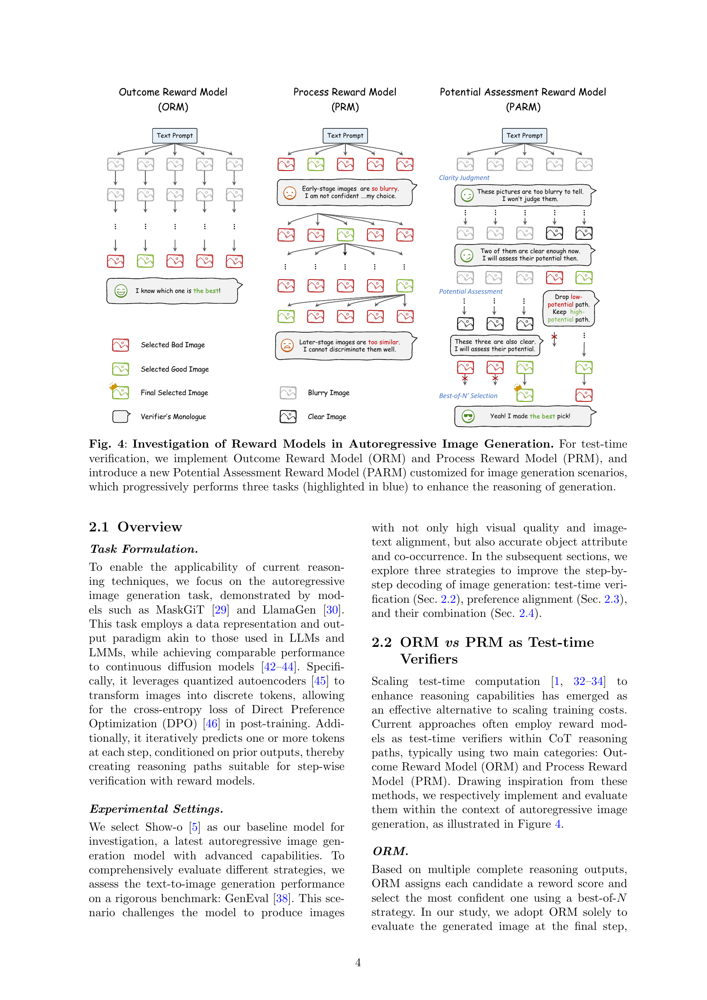
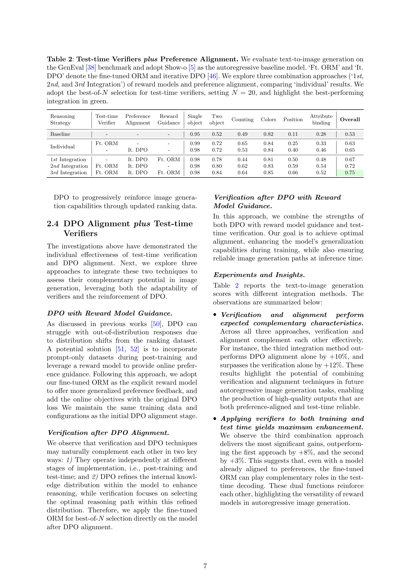
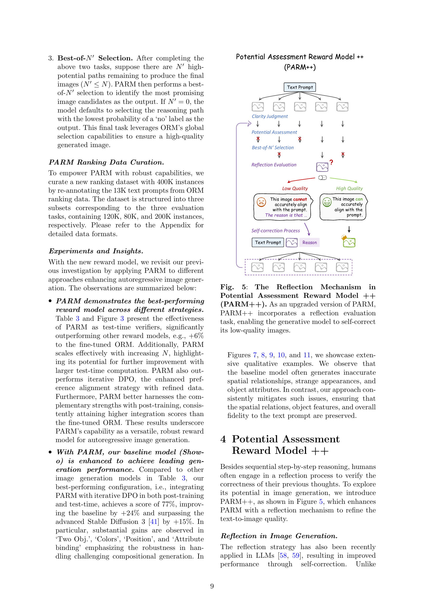
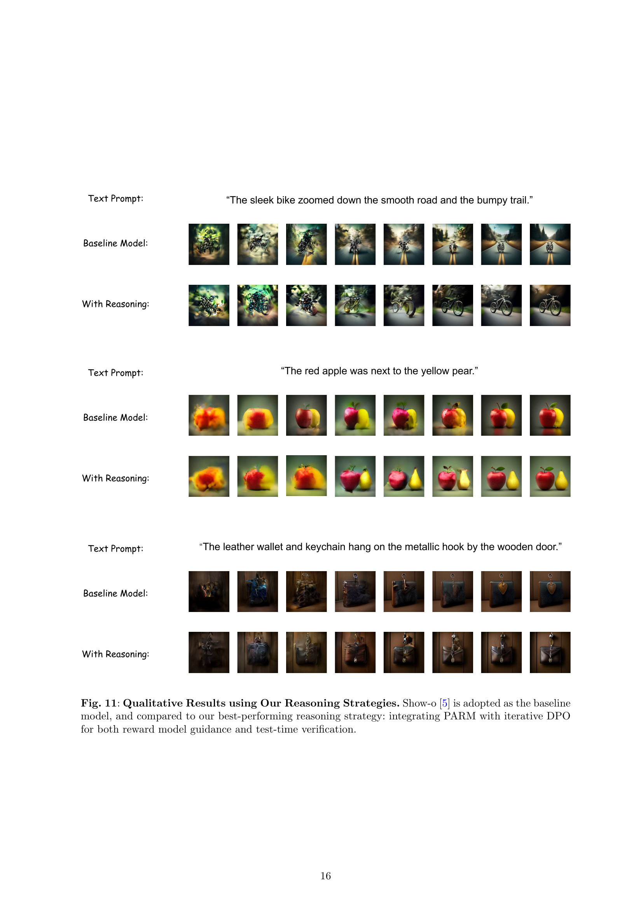
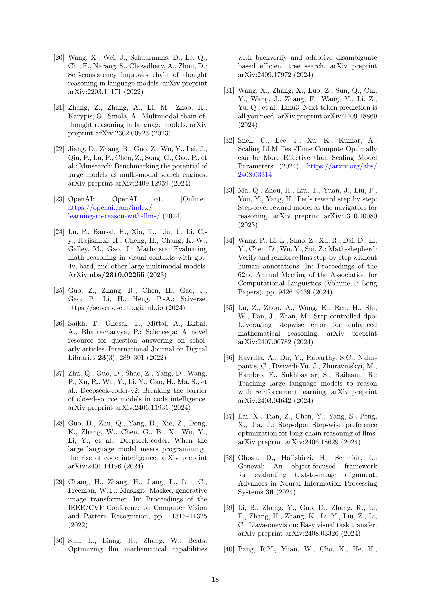

 


 2501.13926 
 Ziyu Guo et el. 
 
 🤗 2025-01-24 
 



↗ arXiv


↗ Hugging Face


↗ Papers with Code


### TL;DR



본 연구는 **대규모 모델에서 복잡한 이해 작업을 해결하기 위해 널리 연구되어 온 사고 과정 추론(CoT)의 개념을 자동 회귀적 이미지 생성에 적용**하는 최초의 연구입니다.  기존 연구에서는 수학 문제 풀이와 같은 특정 작업에 CoT를 성공적으로 적용했지만, 이미지 생성과 같은 다른 작업에 대한 적용 가능성은 미지수였습니다. 특히, **자동 회귀적 이미지 생성 모델은 단계별로 이미지를 생성**하는데, 각 단계에서 생성된 이미지의 품질을 평가하고 모델의 선호도를 사용자의 선호도와 일치시키는 것이 어려웠습니다.

본 연구에서는 **테스트 시간 검증(ORM 및 PRM)과 직접적 선호도 최적화(DPO)를 통해 자동 회귀적 이미지 생성 과정을 강화**하는 세 가지 기법을 제안했습니다.  또한, **새로운 보상 모델 PARM과 PARM++를 제안하여 각 생성 단계의 잠재력을 평가**하고, 불만족스러운 이미지를 자가 수정하는 기능을 추가했습니다.  실험 결과, 제안된 기법들을 통해 기준 모델의 GenEval 벤치마크 성능이 24% 향상되었고, Stable Diffusion 3 모델을 15% 상회하는 결과를 얻었습니다.  **PARM 및 PARM++는 자동 회귀적 이미지 생성을 위한 특수한 보상 모델로서, 생성 과정의 각 단계를 적응적으로 평가**합니다.



#### Key Takeaways


 사고 과정 추론 전략을 사용하여 자동 회귀적 이미지 생성을 향상시킬 수 있다는 것을 보여주었습니다. 



 새로운 보상 모델 PARM 및 PARM++를 제안하여 기존 모델보다 성능을 크게 향상시켰습니다. 



 테스트 시간 검증 및 선호도 정렬 기법을 결합하여 상호 보완적인 효과를 얻을 수 있음을 확인했습니다. 


#### Why does it matter?
본 논문은 **자동 회귀적 이미지 생성에 대한 사고 과정 추론의 잠재력**을 최초로 포괄적으로 조사한 연구입니다.  **새로운 보상 모델(PARM 및 PARM++)**을 제안하여 이미지 생성 품질을 크게 향상시켰으며, **테스트 시간 계산 확장, 모델 선호도 정렬 및 두 기법의 상호 보완적 통합**을 통해 자동 회귀적 이미지 생성의 성능을 상당히 개선했습니다. 이는 **이미지 생성 분야의 혁신적인 연구**이며,  향후 연구 방향에 대한 새로운 가능성을 제시합니다.

------
#### Visual Insights

> 🔼 그림 1은 Chain-of-Thought (CoT) 추론 전략을 사용하여 이미지 생성을 검증하고 강화할 수 있는지에 대한 질문을 제기합니다. 왼쪽 패널은 LLMs [1, 2] 및 LMMs [3, 4]에서 수행된 수학적 CoT 추론의 성공 사례를 보여줍니다. 본 논문에서는 오른쪽 패널에서 보여지는 것처럼, 테스트 시간 검증 및 선호도 정렬을 포함하여 최신 추론 기술을 자동 회귀적 이미지 생성에 적용하는 잠재력을 종합적으로 조사한 최초의 연구 결과를 제시합니다. 여기에는 새롭게 제안된 두 가지 특수 보상 모델인 PARM과 PARM++가 포함됩니다.
> 

> 
read the caption

> Figure 1: Can We Verify and Reinforce Image Generation with Chain-of-Thought (CoT) Reasoning Strategies? Given the success of mathematical CoT reasoning in LLMs [1, 2] and LMMs [3, 4] (Left), we provide the first investigation to comprehensively explore the potential of applying current reasoning techniques to autoregressive image generation (Right), including test-time verification and preference alignment, with two newly proposed specialized reward models, termed PARM and PARM++.
> 


| Reasoning | Strategy | Method | Setting | Single
object | Two
object | Counting | Colors | Position | Attribute
binding | Overall |
|---|---|---|---|---|---|---|---|---|---|---|
| Baseline |  | - | - | 0.95 | 0.52 | 0.49 | 0.82 | 0.11 | 0.28 | 0.53 |
| Test-time Verifier |  | ORM | Zero-Shot | 0.99 | 0.63 | 0.63 | 0.84 | 0.19 | 0.39 | 0.61 |
|  |  |  | Fine-tuned | 0.99 | 0.72 | 0.65 | 0.84 | 0.25 | 0.33 | 0.63 |
|  |  | PRM | Zero-Shot | 0.98 | 0.51 | 0.54 | 0.82 | 0.11 | 0.23 | 0.53 |
|  |  |  | Fine-tuned | 0.98 | 0.55 | 0.54 | 0.83 | 0.13 | 0.29 | 0.55 |
| Preference |  | DPO | - | 0.96 | 0.70 | 0.50 | 0.82 | 0.30 | 0.43 | 0.62 |
| Alignment | Iterative |  |  | 0.98 | 0.72 | 0.53 | 0.84 | 0.40 | 0.46 | 0.65 |

> 🔼 표 1은 GenEval [38] 벤치마크를 사용하여 텍스트-이미지 생성 작업에서 테스트 시간 검증기(ORM과 PRM)와 선호도 정렬(DPO)의 성능을 비교한 것입니다. Show-o [5] 모델을 기준 모델로 사용했습니다. ORM/PRM은 결과/과정 보상 모델을 나타내고, DPO는 직접적 선호도 최적화 [46]를 나타냅니다. 테스트 시간 검증기에는 best-of-N 선택 방식을 사용했으며, N은 20으로 설정했습니다. 각 추론 전략에서 더 나은 성능을 보이는 변형 모델을 녹색으로 강조 표시했습니다. 이 표는 테스트 시간 검증과 선호도 정렬이 이미지 생성 성능에 미치는 영향을 개별적으로 및 통합적으로 분석하여 비교합니다.
> 

> 
read the caption

> Table 1: Test-time Verifiers (ORM vs PRM) vs Preference Alignment. We evaluate text-to-image generation on the GenEval [38] benchmark and adopt Show-o [5] as the autoregressive baseline model. ‘ORM/PRM’ and ‘DPO’ denote Outcome/Process Reward Model and Direct Preference Optimization [46], respectively. We adopt the best-of-N𝑁Nitalic_N selection for test-time verifiers, setting N=20𝑁20N=20italic_N = 20, and highlight the better-performed variant of each reasoning strategy in green.
> 

### In-depth insights

#### CoT for ImageGen
본 논문은 이미지 생성(ImageGen)에 사고연쇄(Chain of Thought, CoT) 추론을 적용하는 혁신적인 시도를 제시합니다. **기존의 CoT는 주로 언어 모델의 복잡한 추론 과정 향상에 초점을 맞춰왔지만, 이 연구는 이를 이미지 생성 영역으로 확장**, 이미지 생성 과정을 단계별로 분해하여 검증 및 강화하는 방법을 제시합니다. **주요 기술로는 검증을 위한 테스트 시간 계산 확장, 모델 선호도를 사용자 선호도와 일치시키는 직접적 선호도 최적화(DPO), 그리고 상호 보완적인 효과를 위한 두 기술의 통합** 등이 있습니다. 특히, **자동 회귀적 이미지 생성을 위해 새롭게 제안된 잠재력 평가 보상 모델(PARM) 및 PARM++**는 각 생성 단계를 평가하고 불량 이미지를 자체 수정하는 기능을 제공하여 성능 향상에 크게 기여합니다. **실험 결과는 제안된 방법들이 이미지 생성 성능을 크게 향상시키며, 기존의 안정적 확산(Stable Diffusion) 모델보다 우수한 결과**를 보임을 보여줍니다.  이는 **CoT 추론을 이미지 생성에 적용하는 가능성을 확인**하고, 향후 연구 방향을 제시하는 데 중요한 의미를 지닙니다.

#### Reward Model Design
본 논문에서 제시된 'Reward Model Design'에 대한 심층적인 고찰은 다음과 같습니다. 논문은 **자동 회귀 이미지 생성(Autoregressive Image Generation)** 과정에서의 단계별 검증 및 강화를 위한 보상 모델 설계의 중요성을 강조합니다. 기존의 ORM(Outcome Reward Model)과 PRM(Process Reward Model)의 한계를 극복하기 위해, **PARM(Potential Assessment Reward Model)** 이라는 새로운 보상 모델을 제안하는데, 이는 각 생성 단계의 잠재력을 평가하고 불필요한 단계를 제거하여 효율성을 높이는 전략을 취합니다. 특히, PARM++는 **자기 수정 메커니즘(Self-correction Mechanism)**을 추가하여 생성 과정 중 발생하는 오류를 스스로 수정하는 기능을 구현함으로써 이미지 품질을 향상시킵니다. 이러한 보상 모델의 설계는 단순히 최종 결과물의 평가를 넘어, 생성 과정 전반에 대한 심층적인 이해와 개입을 통해 **더욱 정교하고 효율적인 이미지 생성**을 가능하게 합니다.  **PARM과 PARM++의 성능 비교** 분석을 통해, 제안된 모델의 우수성을 실험적으로 입증하고, 향후 자동 회귀 이미지 생성 모델의 발전 방향을 제시합니다.  **단계별 평가 및 자기 수정 기능**은  인간의 문제 해결 과정을 모방한 것으로,  더욱 **인간 친화적인 AI 시스템 개발**에 대한 중요한 시사점을 제공합니다.

#### DPO & Verification
본 논문은 이미지 생성 과정에서 **직접적 선호도 최적화(DPO)**와 **검증(Verification)**의 결합을 통해 성능 향상을 이끌어내는 연구입니다. DPO는 모델의 선호도를 사용자의 선호도와 일치시키는 기법이고, 검증은 생성된 이미지의 품질을 평가하는 과정입니다.  **DPO는 모델의 생성 과정을 개선**하고, 검증은 생성된 결과의 품질을 높이는 역할을 합니다.  두 기법을 결합함으로써, **상호 보완적인 효과**를 얻을 수 있다는 것을 실험적으로 보여줍니다.  **단순히 DPO만 사용하는 경우보다 DPO와 검증을 병행하는 경우 이미지 생성 품질이 더욱 향상**됨을 확인하였습니다. 특히, 제시된 새로운 보상 모델인 **PARM은 생성 과정을 단계별로 평가**하여 이미지 품질을 높이는데 효과적임을 보여줍니다.  이는 기존의 단순한 보상 모델보다 더욱 정교한 평가를 가능하게 하여, 보다 높은 품질의 이미지 생성을 가능하게 합니다.

#### PARM & PARM++
본 논문에서 제안하는 PARM(Potential Assessment Reward Model)과 PARM++는 오토리그레시브 이미지 생성 과정에서의 **단계별 평가 및 자기 수정**이라는 핵심적인 개념을 도입하여 기존의 보상 모델의 한계를 극복합니다.  PARM은 이미지 생성 단계별로 이미지의 명확성과 잠재력을 평가하여 불필요한 연산을 줄이고 생성 과정의 효율성을 높입니다. **초기 단계의 이미지는 대개 흐릿하여 평가가 어렵고, 후기 단계는 유사한 이미지가 많아 구별이 어려운 기존 보상 모델의 문제점을 해결**하는 것이죠.  PARM++는 여기에 더하여 **자기 반성 메커니즘**을 추가하여 생성된 이미지와 텍스트 프롬프트 간의 불일치를 감지하고 이미지를 스스로 수정합니다.  이를 통해 **이미지 품질 향상 및 텍스트와 이미지의 정합성 개선**이라는 두 마리 토끼를 잡을 수 있다는 것을 보여줍니다.  **두 모델 모두 기존 방식보다 GenEval 벤치마크에서 상당한 성능 향상**을 이끌어냈다는 점에서, 오토리그레시브 이미지 생성 분야에 중요한 기여를 했다고 평가할 수 있습니다.

#### Future of CoT
CoT(사고 연쇄)의 미래는 **매우 밝습니다**.  본 논문에서 제시된 연구는 CoT 추론을 이미지 생성에 적용하는 획기적인 시도이며, 향후 연구 방향에 대한 귀중한 통찰력을 제공합니다.  특히, **PARM 및 PARM++와 같은 새로운 보상 모델**의 개발은 CoT 기반 이미지 생성의 정확성과 효율성을 크게 향상시키는 데 기여할 것입니다.  또한, **테스트 타임 검증 및 선호도 정렬**과 같은 기법의 통합은 모델 성능을 더욱 향상시킬 수 있는 가능성을 보여줍니다.  **이러한 기술들은 다양한 멀티모달 작업**에 적용될 수 있으며, 특히 이미지 이해 및 생성 분야에 혁신적인 발전을 가져올 것으로 예상됩니다.  **향후 연구**는 더욱 정교한 보상 모델, 효율적인 선호도 정렬 방법, 그리고 다양한 멀티모달 작업에 대한 CoT 추론의 일반화 가능성에 초점을 맞춰야 할 것입니다.  **이를 통해 CoT는 인공지능의 다양한 영역**에서 복잡한 문제 해결 능력을 향상시키는 핵심 기술로 자리매김할 것입니다.

### More visual insights

More on figures

> 🔼 그림 2는 제안된 추론 전략을 사용하지 않은 경우(위쪽)와 사용한 경우(아래쪽)의 자동 회귀 이미지 생성 결과를 보여줍니다. Show-o [5] 모델을 기준 모델로 사용했는데, 이 모델은 텍스트-이미지 생성 품질이 좋지 않았습니다. 연구팀이 제안한 추론 전략(PARM과 반복적인 DPO 통합을 통한 보상 모델 안내 및 테스트 시간 검증)을 적용한 후 이미지 생성 과정이 효과적으로 향상되었습니다. 각 행은 세 가지 다른 텍스트 프롬프트에 대한 생성 결과를 보여줍니다. 각 열은 자동 회귀 생성 과정의 각 단계에서 생성된 이미지를 나타냅니다. 위쪽 행의 결과는 기준 모델에서 생성된 불만족스러운 이미지들을 보여주고, 아래쪽 행은 제안된 추론 전략을 적용한 후 생성된 향상된 이미지들을 보여줍니다.
> 

> 
read the caption

> Figure 2: Autoregressive Image Generation without (Top) and with (Bottom) Our Reasoning Strategies. We adopt Show-o [5] as the baseline model that produces unsatisfactory text-to-image generation. After using our investigated reasoning strategies (integrating PARM with iterative DPO for both reward model guidance and test-time verification), the generation process is effectively enhanced.
> 

> 🔼 그림 3은 여러 가지 보상 모델을 테스트 시간 검증자로 사용했을 때의 성능 비교를 보여줍니다. Show-o [5] 모델을 기준 모델로 사용하여 GenEval [38] 벤치마크에서 Best-of-N 선택 방식을 평가했습니다. 이 그래프는 제로샷 및 미세 조정된 ORM(결과 보상 모델)과 PRM(과정 보상 모델)의 성능을 보여주며, 제안된 PARM(잠재력 평가 보상 모델)의 우수성을 강조합니다.  N 값이 증가함에 따라 보상 모델의 성능 향상이 두드러지게 나타나고, 특히 미세 조정된 ORM과 PARM이 우수한 성능을 보입니다.
> 

> 
read the caption

> Figure 3: Comparison of Reward Models as Test-time Verifiers. We adopt Show-o [5] as the ‘Baseline’ and evaluate Best-of-N𝑁Nitalic_N selection on the GenEval [38] benchmark.
> 

> 🔼 그림 4는 자기 회귀적 이미지 생성에서 보상 모델의 역할을 조사한 것입니다. 테스트 시간 검증을 위해 결과 보상 모델(ORM)과 과정 보상 모델(PRM)을 구현하고, 이미지 생성 시나리오에 맞게 새롭게 고안된 잠재력 평가 보상 모델(PARM)을 도입했습니다. PARM은 생성 과정을 향상시키기 위해 세 가지 단계(파란색으로 강조 표시됨)를 순차적으로 수행합니다.  ORM은 최종 생성물을 평가하고, PRM은 생성 과정의 각 단계를 평가하지만, PARM은 이미지의 품질과 일관성을 단계별로 평가하고, 초기 단계의 이미지가 불분명하거나 후기 단계의 이미지가 유사할 때 발생하는 문제점을 해결합니다.
> 

> 
read the caption

> Figure 4: Investigation of Reward Models in Autoregressive Image Generation. For test-time verification, we implement Outcome Reward Model (ORM) and Process Reward Model (PRM), and introduce a new Potential Assessment Reward Model (PARM) customized for image generation scenarios, which progressively performs three tasks (highlighted in blue) to enhance the reasoning of generation.
> 

> 🔼 PARM++는 PARM의 업그레이드 버전으로, 저품질 이미지를 생성하는 모델이 자체적으로 수정할 수 있도록 하는 반사 평가 작업을 통합합니다.  이 그림은 PARM++의 반사 메커니즘을 보여줍니다.  즉, 이미지 생성 프로세스의 각 단계에서 생성된 이미지가 입력 프롬프트와 정확하게 일치하는지 평가하고, 불일치가 감지되면 자세한 설명과 함께 생성 모델에 전달하여 이미지를 반복적으로 수정하는 과정을 나타냅니다.  이러한 과정을 통해 생성된 이미지의 품질과 정확성을 향상시키는 것이 목표입니다.
> 

> 
read the caption

> Figure 5: The Reflection Mechanism in Potential Assessment Reward Model ++ (PARM++). As an upgraded version of PARM, PARM++ incorporates a reflection evaluation task, enabling the generative model to self-correct its low-quality images.
> 

> 🔼 그림 6은 제안된 PARM++에서 반영 평가 단계를 통합하여 텍스트-이미지 불일치를 감지하고 자세한 설명을 제공하여 자동 회귀 이미지 생성 모델에서 자기 수정 과정을 안내하는 방법을 보여줍니다.  PARM++는 생성된 이미지가 텍스트 프롬프트와 일치하는지 평가하는 단계를 추가하여 기존의 PARM을 개선한 모델입니다.  불일치가 감지되면 PARM++는 문제점(예: 시각적 개념의 불일치)을 자세히 설명하고, 생성 모델이 불만족스러운 이미지를 자가 수정할 수 있도록 프롬프트를 제공합니다.  이 그림은 여러 가지 텍스트 프롬프트에 대한 기본 모델과 PARM++의 결과를 비교하여 PARM++의 자기 수정 기능의 효과를 보여줍니다. 각 예시는 기본 모델의 생성 결과, PARM++의 반영 평가 결과(불일치에 대한 설명 포함), 그리고 PARM++의 자기 수정 단계를 거친 결과를 보여줍니다.
> 

> 
read the caption

> Figure 6: Qualitative Results with Reflection in PARM++. The proposed PARM++ incorporates a reflection evaluation stage to detect text-image misalignments and provides detailed explanations to guide the self-correction process in autoregressive image generation models.
> 

> 🔼 그림 7은 제시된 추론 전략들을 사용한 정성적 결과를 보여줍니다. 기준 모델로 Show-o [5]를 사용하여, 반복적인 DPO와 PARM을 통합한 최고 성능의 추론 전략과 비교 분석했습니다. 이는 보상 모델 안내 및 테스트 시간 검증을 위한 것입니다.  이 그림은 다양한 텍스트 프롬프트에 대한 기준 모델과 제시된 추론 전략을 적용한 결과 이미지들을 나란히 보여주어, 각 전략의 이미지 생성 품질 향상 효과를 시각적으로 비교할 수 있게 합니다.
> 

> 
read the caption

> Figure 7: Qualitative Results using Our Reasoning Strategies. Show-o [5] is adopted as the baseline model, and compared to our best-performing reasoning strategy: integrating PARM with iterative DPO for both reward model guidance and test-time verification.
> 

> 🔼 그림 8은 제시된 추론 전략들을 사용한 정성적 결과를 보여줍니다. 기준 모델로 Show-o [5]를 사용하고, 반복적인 DPO를 사용하여 PARM을 통합하는 최고 성능의 추론 전략과 비교합니다. 이 전략은 보상 모델의 지침과 테스트 시간 검증 모두에 사용됩니다. 이 그림은 다양한 텍스트 프롬프트에 대해 기준 모델과 제시된 추론 전략을 사용한 결과 이미지를 보여주어, 제시된 전략이 이미지 생성 품질을 개선하는 데 효과적임을 시각적으로 보여줍니다.
> 

> 
read the caption

> Figure 8: Qualitative Results using Our Reasoning Strategies. Show-o [5] is adopted as the baseline model, and compared to our best-performing reasoning strategy: integrating PARM with iterative DPO for both reward model guidance and test-time verification.
> 

> 🔼 그림 9는 제시된 추론 전략들을 사용한 정성적 결과를 보여줍니다. Show-o [5] 모델을 기준 모델로 사용하여, 반복적인 DPO와 PARM을 통합한 최고 성능의 추론 전략과 비교 분석했습니다. 이를 통해 보상 모델 가이던스와 테스트 시간 검증을 모두 활용한 결과를 보여줍니다.  다양한 이미지 생성 결과를 보여주는 것으로, 기준 모델 대비 개선된 이미지 품질과 정확도를 시각적으로 보여줍니다.
> 

> 
read the caption

> Figure 9: Qualitative Results using Our Reasoning Strategies. Show-o [5] is adopted as the baseline model, and compared to our best-performing reasoning strategy: integrating PARM with iterative DPO for both reward model guidance and test-time verification.
> 

> 🔼 그림 10은 제안된 추론 전략을 사용한 정성적 결과를 보여줍니다. Show-o [5] 모델을 기준 모델로 사용하여, 반복적인 DPO와 PARM을 통합한 최적의 추론 전략과 비교 분석했습니다. 이는 보상 모델 안내와 테스트 시간 검증 모두를 위한 것입니다. 그림은 다양한 텍스트 프롬프트에 대한 기준 모델과 제안된 추론 전략의 생성 결과를 보여주는 여러 이미지들을 보여줍니다. 이를 통해 제안된 추론 전략이 이미지 생성 품질을 향상시키는 데 효과적임을 시각적으로 보여줍니다.
> 

> 
read the caption

> Figure 10: Qualitative Results using Our Reasoning Strategies. Show-o [5] is adopted as the baseline model, and compared to our best-performing reasoning strategy: integrating PARM with iterative DPO for both reward model guidance and test-time verification.
> 

> 🔼 그림 11은 제안된 추론 전략들을 사용한 정성적 결과를 보여줍니다. 기준 모델로 Show-o [5]를 사용하고, 보상 모델 안내와 테스트 시간 검증을 위해 반복적인 DPO와 PARM을 통합한 최고 성능 추론 전략과 비교합니다. 그림에서는 다양한 텍스트 프롬프트에 대해 기준 모델과 제안된 추론 전략을 사용한 이미지 생성 결과를 보여줍니다. 이를 통해 제안된 추론 전략이 이미지 생성 품질을 향상시키는 데 효과적임을 시각적으로 보여줍니다. 각 프롬프트에 대한 생성 결과를 비교하면 제안된 추론 전략이 이미지의 세부 사항, 객체 구성 및 전반적인 사실성을 개선하는 데 효과적임을 확인할 수 있습니다.
> 

> 
read the caption

> Figure 11: Qualitative Results using Our Reasoning Strategies. Show-o [5] is adopted as the baseline model, and compared to our best-performing reasoning strategy: integrating PARM with iterative DPO for both reward model guidance and test-time verification.
> 

> 🔼  그림 12는 Show-o [5]의 중간 단계에서 생성된 이미지들을 시각화한 것입니다. 초기 단계의 이미지들은 너무 흐릿하여 해석하기 어렵고, 후기 단계의 이미지들은 서로 너무 유사하여 구분하기 어려워 PRM(Process Reward Model)의 평가에 큰 어려움을 초래합니다.  이 그림은 PRM이 이미지 생성 과정의 각 단계를 평가하는 데 어려움을 겪는 이유를 보여줍니다. 초기 단계 이미지는 흐릿해서 특징을 파악하기 어렵고, 후기 단계 이미지는 유사하여 차이점을 구분하기 어렵기 때문입니다.
> 

> 
read the caption

> Figure 12: Visualization of Early-stage and Later-stage Images. We visualize the generated images in the intermediate steps of Show-o [5], where the early-stage images are too blurry to interpret, while the later-stage images are too similar to discriminate, posing great challenges for PRMs to evaluate.
> 

### Full paper



