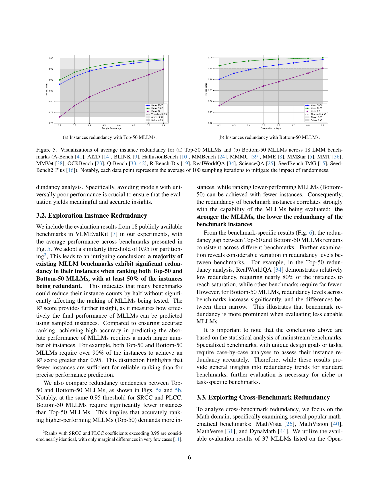

 


 2501.13953 
 Zicheng Zhang et el. 
 
 🤗 2025-01-27 
 



↗ arXiv


↗ Hugging Face


### TL;DR



매년 수백 개의 MLLM 벤치마크가 생성되면서 **중복성 문제**가 심각해지고 있습니다. 이는 **연구 자원의 낭비**와 **연구 방향의 왜곡**으로 이어질 수 있습니다.  본 논문은 이러한 문제를 해결하기 위해 **벤치마크의 중복성을 정량적으로 분석하고, 효율적인 벤치마크 설계 및 평가를 위한 원칙을 제시**합니다. 

본 논문에서는 벤치마크의 차원, 질문 수, 그리고 벤치마크 간 중복성을 세 가지 관점에서 분석하는 **새로운 프레임워크**를 제시합니다.  **수백 개의 MLLM과 20개 이상의 벤치마크에 대한 실험 결과**를 바탕으로 중복성의 수준을 정량적으로 측정하고, 이를 **해결하기 위한 구체적인 전략**을 제안합니다. 이를 통해 **MLLM 벤치마크의 효율성을 높이고, 연구 자원의 낭비를 줄이며, 연구 방향의 왜곡을 방지**하는 데 기여합니다.



#### Key Takeaways


 MLLM 벤치마크의 차원, 질문 수, 그리고 벤치마크 간 중복성이 심각하다는 것을 정량적으로 밝힘 



 중복성을 줄이기 위한 벤치마크 설계 및 평가에 대한 구체적인 원칙 및 전략 제시 



 제안된 원칙과 전략을 통해 MLLM 벤치마크의 효율성을 높이고, 연구 자원의 낭비를 줄일 수 있음을 시사 


#### Why does it matter?
본 논문은 **다양한 모드를 갖는 대규모 언어 모델(MLLM)의 벤치마크 연구**에 있어서 중복성 문제를 심도 있게 다룸으로써, **효율적인 벤치마크 설계 및 평가에 대한 중요한 통찰력**을 제공합니다.  이는 **MLLM 연구의 발전 방향을 제시**하고, **연구 자원의 낭비를 줄이는 데 기여**할 수 있다는 점에서 큰 의의를 지닙니다.  **새로운 벤치마크 개발 및 기존 벤치마크 개선에 대한 구체적인 가이드라인**을 제시하여, MLLM 연구 분야 전체에 긍정적인 영향을 미칠 것으로 예상됩니다.

------
#### Visual Insights

> 🔼 그림 1은 MLLM 벤치마크에서 중복이 존재하는 위치와 중복성을 평가해야 하는 이유를 간략하게 보여줍니다.  MLLM 벤치마크 설계 및 평가 과정에서 중복으로 인해 발생할 수 있는 문제점들을 시각적으로 설명합니다.  중복은 벤치마크의 차원(dimension) 자체에 존재하거나, 동일한 차원 내에서 여러 질문(instances)이 유사한 경우 발생할 수 있습니다. 또한, 서로 다른 벤치마크 간에도 특정 도메인에서 중복될 수 있습니다. 이 그림은 중복으로 인해 벤치마크 설계의 효율성이 떨어지고, 모델 평가의 독립성을 저해하며, 연구 자원의 낭비를 초래할 수 있음을 보여줍니다. 따라서 중복성을 평가하고 이를 해결하기 위한 전략이 필요함을 강조합니다.
> 

> 
read the caption

> Figure 1: Brief illustrations of Where Redundancy Exists? and Why Evaluate Redundancy? for MLLM benchmarks.
> 

### In-depth insights

#### MLLM Benchmark Issues
MLLM 벤치마크의 주요 문제는 **급증하는 벤치마크 수에 비해 실질적인 혁신이 부족하다는 점**입니다.  이는 **중복성(Redundancy)**으로 이어져 연구 자원의 낭비와 연구 방향의 왜곡을 초래합니다.  **차원(Dimension), 인스턴스(Instance), 벤치마크 간 상호 비교(Cross-Benchmark)** 세 가지 측면에서 중복성을 분석하여 효율적인 벤치마크 설계 원칙을 제시해야 합니다.  **상위권(Top-K) MLLM에만 초점을 맞춘 분석**을 통해 벤치마크의 실질적인 효용성을 평가하고, **다양한 상관관계 지표(Correlation Metrics)**를 활용하여 중복성을 정량적으로 측정하는 것이 중요합니다.  **개선된 벤치마크 설계 및 평가 프레임워크**는 MLLM 연구의 효율성을 높이고 발전 방향을 제시할 것입니다.  특히, **특정 도메인을 위한 벤치마크는 해당 도메인의 특징을 잘 반영**해야 하며, **다른 벤치마크와의 적절한 중복성을 유지**해야 합니다.

#### Redundancy Framework
본 논문에서 제시된 **중복성 프레임워크**는 MLLM 벤치마크 내의 중복성을 정량적으로 평가하기 위한 체계적인 접근 방식을 제공합니다. **성능 상관관계**를 기반으로 하여, 유사한 기능을 평가하는 벤치마크들 간의 상관관계를 분석함으로써 중복성의 정도를 측정합니다. 특히, **차원 중복성**, **인스턴스 중복성**, **교차 벤치마크 중복성** 세 가지 측면에서 분석하여 벤치마크 설계의 효율성을 높이고, 평가 과정을 간소화하는 데 기여합니다. 이를 통해 **최적의 벤치마크 설계 원칙**을 제시하고, 향후 MLLM 벤치마크 개발 방향을 제시하는 데 중요한 역할을 합니다.  **다양한 상관계수 측정 방식**을 활용하여 결과의 견고성을 확보하며, **상위 K개 모델 분석**을 통해 효율적인 분석을 수행합니다.  **실험 및 논의**를 통해 제시된 프레임워크의 실효성을 입증하고, **향후 연구 방향**에 대한 시사점을 제공합니다.

#### Benchmark Analysis
본 논문에서는 벤치마크 분석을 통해 **다양한 벤치마크 간의 중복성과 효율성 문제**를 심도있게 다룹니다.  **기존 벤치마크들의 과도한 중복**으로 인해 연구 자원의 낭비 및 연구 방향의 왜곡이 발생할 수 있음을 지적하고, **차원, 인스턴스, 크로스-벤치마크 세 가지 관점에서 중복성을 정량적으로 측정**하는 프레임워크를 제시합니다.  여기에는 상관관계 분석을 통한 중복성 측정과 함께, 상위/하위 모델 그룹에 따른 중복성 비교 분석도 포함되어 있어 **모델 성능 수준에 따른 중복성의 차이**를 보다 명확하게 이해할 수 있게 합니다.  특히, **최적의 벤치마크 설계를 위한 원칙**으로 독립적인 차원, 최적의 인스턴스 개수, 도메인 대표성을 제시하며, 효율적인 벤치마크 개발을 위한 실질적인 지침을 제공합니다.

#### Redundancy Mitigation
본 논문에서 제시된 중복성 완화 전략은 **벤치마크 설계 단계에서부터 시작**합니다. 즉, **중복된 차원 축소**, **불필요한 인스턴스 제거**, 그리고 **특정 도메인 내 벤치마크 간의 중복성 최소화** 등의 방법을 제안합니다.  **차원 중복성**은 벤치마크 내 과제들이 서로 겹치는 능력을 평가하는 것을 의미하며, 이는 차원 간 상관관계 분석을 통해 식별할 수 있습니다.  **인스턴스 중복성**은 유사한 질문이나 과제의 반복으로 인해 발생하며, 샘플링 기법을 통해 최소한의 인스턴스로도 유의미한 결과를 얻을 수 있는지 분석합니다.  **크로스 벤치마크 중복성**은 유사한 도메인을 다루는 벤치마크들 간의 중복을 최소화하는 것을 목표로 합니다.  **각 중복성 유형에 대한 정량적 측정**과 함께, **효율적인 벤치마크 설계를 위한 구체적인 권고 사항**도 제시하여 연구자들이 중복성을 효과적으로 관리하고, **자원 낭비 없이 MLLM의 성능을 평가**할 수 있도록 돕습니다.  **최종 목표는 더욱 효율적이고 효과적인 MLLM 벤치마크 생태계를 구축**하는 것입니다.

#### Future Work
본 논문에서 제시된 중복성 프레임워크는 **MLLM 벤치마크의 설계 및 평가를 개선**하기 위한 중요한 첫걸음입니다.  하지만, 미래 연구를 위한 여지가 많이 남아 있습니다.  **다양한 모달리티(예: 오디오, 촉각)**를 포함하는 멀티모달 모델에 대한 중복성 분석을 확장하는 것은 중요합니다.  또한, **특정 도메인에 대한 벤치마크의 대표성**을 더욱 정교하게 평가하고, **다양한 모델 아키텍처와 크기**에 따른 중복성의 영향을 분석하는 연구가 필요합니다.  **비지도 학습 및 강화 학습**과 같은 다양한 학습 방법에 따른 중복성 패턴 분석 또한 흥미로운 연구 주제가 될 수 있습니다.  궁극적으로는, **중복성을 최소화하면서 효과적인 MLLM 벤치마크를 설계하기 위한 지침**을 제시하는 것이 목표입니다. 이를 위해, 개발자들이 중복성을 효과적으로 해결할 수 있도록 도와주는 **자동화된 도구 개발** 및 **데이터셋 구성에 대한 베스트 프랙티스** 제시가 필요할 것입니다.

### More visual insights

More on figures

> 🔼 그림 2는 논문의 Redundancy Framework를 간략하게 보여줍니다. (a)는 차원 중복성, (b)는 인스턴스 중복성, (c)는 크로스 벤치마크 중복성을 계산하는 일반적인 과정을 보여줍니다. 각각의 과정은 MLLM 순위와 상관관계를 계산하여 중복성을 정량화하는 방식을 나타냅니다.  차원 중복성은 벤치마크 내에서 MLLM의 성능 순위 간의 상관관계를 계산하여 유사한 차원을 식별합니다. 인스턴스 중복성은 벤치마크의 전체 인스턴스 집합과 무작위로 선택된 하위 집합 간의 MLLM 성능 순위 상관관계를 측정하여 중복된 인스턴스를 파악합니다. 마지막으로 크로스 벤치마크 중복성은 특정 도메인 내의 여러 벤치마크 간 MLLM 성능 순위 상관관계를 분석하여 도메인 내에서 중복되는 벤치마크를 식별합니다.
> 

> 
read the caption

> Figure 2: A quick look at the redundancy framework, where (a), (b), and (c) show the general process of computing dimensions redundancy, instances redundancy, and cross-benchmark redundancy respectively.
> 

> 🔼 이 그림은 MMBench 벤치마크의 상위 50개 다중 모드 대규모 언어 모델(MLLM)에 대한 차원 중복성을 보여줍니다.  SRCC(Spearman Rank Correlation Coefficient)를 사용하여 각 차원 간의 상관 관계를 계산하고 시각화합니다. 색상은 상관 관계의 강도를 나타냅니다. 밝은 빨간색은 높은 상관 관계(높은 중복성)를, 밝은 파란색은 낮은 상관 관계(낮은 중복성)를 나타냅니다. 이를 통해 어떤 차원들이 서로 유사한 능력을 평가하는지, 즉 중복되는지 여부를 파악할 수 있습니다.
> 

> 
read the caption

> (a) Top-50 SRCC dimensions redundancy map.
> 

> 🔼 이 그림은 MMBench 벤치마크의 상위 50개 다중 모드 대규모 언어 모델(MLLM)에 대한 차원 중복성을 보여줍니다.  PLCC(피어슨 선형 상관 계수)를 사용하여 각 차원과 다른 모든 차원 간의 상관 관계를 계산합니다.  그림의 색상은 상관 관계의 강도를 나타내며, 빨간색은 높은 상관 관계(중복성이 높음), 파란색은 낮은 상관 관계(중복성이 낮음)를 나타냅니다. 이를 통해 각 차원의 정보 중복 정도와 MLLM 벤치마크 설계 개선을 위한 통찰력을 제공합니다.
> 

> 
read the caption

> (b) Top-50 PLCC dimensions redundancy map.
> 

> 🔼 이 그림은 MMBench 벤치마크의 상위 50개 다중 모드 언어 모델(MLLM)에 대한 차원 중복도를 보여줍니다.  R2 상관 계수를 사용하여 각 차원 간의 상관 관계를 시각화합니다. 색상은 상관 관계의 강도를 나타내며, 밝은 색은 높은 상관 관계(즉, 높은 중복도), 어두운 색은 낮은 상관 관계를 나타냅니다.  이를 통해 각 차원이 다른 차원과 얼마나 중복되는지를 파악하고 벤치마크 설계 개선에 활용할 수 있습니다.
> 

> 
read the caption

> (c) Top-50 R2 dimensions redundancy map.
> 

> 🔼 이 그림은 MMBench 벤치마크에서 하위 50개의 다중 모드 대규모 언어 모델(MLLM)에 대한 차원 간 상관관계를 보여주는 열지도입니다.  각 셀은 두 차원 간의 스피어만 순위 상관 계수(SRCC)를 나타내며, 색상은 상관관계의 강도를 나타냅니다. 빨간색은 높은 양의 상관관계를, 파란색은 높은 음의 상관관계를, 흰색은 상관관계가 없음을 나타냅니다. 이 그림은 MMBench의 여러 차원 간의 중복성 정도를 시각적으로 보여주어, 벤치마크 설계 개선에 대한 통찰력을 제공합니다.
> 

> 
read the caption

> (d) Bottom-50 SRCC dimensions redundancy map.
> 

> 🔼 이 그림은 MMBench 벤치마크에서 하위 50개의 다중 모드 대규모 언어 모델(MLLM)에 대한 차원 간 상관관계를 보여주는 열 지도입니다. 각 셀은 두 차원 간의 피어슨 선형 상관 계수(PLCC)를 나타내며, 색상은 상관 계수의 크기를 나타냅니다. 밝은 색상은 높은 상관 관계를, 어두운 색상은 낮은 상관 관계를 나타냅니다. 이 그림은 하위 50개의 MLLM에 대해 MMBench의 차원 간 중복성 수준을 시각적으로 분석하는 데 도움이 됩니다.
> 

> 
read the caption

> (e) Bottom-50 PLCC dimensions redundancy map.
> 

> 🔼 이 그림은 MMBench 벤치마크에서 하위 50개의 MLLM에 대한 차원 간 중복성을 보여줍니다. R2 상관 계수를 사용하여 각 차원 쌍 간의 상관 관계를 시각화합니다. 밝은 색상은 높은 상관 관계(높은 중복성)를 나타내고 어두운 색상은 낮은 상관 관계(낮은 중복성)를 나타냅니다. 이를 통해 하위 수행 MLLM의 경우, 다양한 차원에서 평가된 기능이 상당한 중복성을 보임을 알 수 있습니다.
> 

> 
read the caption

> (f) Bottom-50 R2 dimensions redundancy map.
> 

> 🔼 그림 3은 MMBench [24] 벤치마크에서 상위 50개와 하위 50개의 다중 모드 대규모 언어 모델(MLLM)에 대한 차원 중복성 시각화를 보여줍니다. 상위 50개 MLLM과 하위 50개 MLLM 모두에 대해 SRCC, PLCC, R2 세 가지 상관 관계 지표를 사용하여 차원 간 중복성을 계산했습니다. 각 지표는 히트맵으로 표현되어 차원 간의 중복성 정도를 시각적으로 보여줍니다. 또한, 각 지표에 대한 막대 그래프를 통해 각 차원의 평균 중복성 수준을 보여줍니다. 이 그림을 통해 상위 50개 MLLM과 하위 50개 MLLM 간의 차원 중복성 차이를 비교 분석하여 벤치마크 설계에 대한 통찰력을 제공합니다.
> 

> 
read the caption

> Figure 3: Visualizations of dimensions redundancy for MMBench [24] on Top-50 and Bottom-50 MLLMs.
> 

> 🔼 그림 4(a)는 MMBench 벤치마크에서 상위 50개의 MLLM에 대한 차원 중복성을 보여줍니다.  각 막대는 특정 차원의 평균 중복도를 나타내며, 더 높은 값은 다른 차원과의 상관관계가 더 높음을 의미합니다. 이는 벤치마크 내에서 일부 차원이 과도하게 중복될 수 있음을 시사합니다.  즉, 특정 능력을 여러 차원에서 반복적으로 평가하여 효율성이 떨어질 수 있음을 나타냅니다.
> 

> 
read the caption

> (a) Top-50 SRCC redundancy.
> 

> 🔼 그림 (b)는 MMBench 벤치마크에서 상위 50개의 다중 모드 대규모 언어 모델(MLLM)의 성능 순위를 사용하여 계산된 차원 중복성을 보여줍니다.  PLCC(피어슨 선형 상관 계수)를 사용하여 각 차원 간의 상관 관계를 측정하고 시각화합니다. 색상은 상관 관계의 강도를 나타내며, 밝은 빨간색은 높은 상관 관계(높은 중복성), 밝은 파란색은 낮은 상관 관계(낮은 중복성)을 나타냅니다.  이 그림은 벤치마크 내에서 어떤 차원들이 서로 유사한 기능을 평가하는지, 즉 중복되는지를 분석하는 데 사용됩니다.
> 

> 
read the caption

> (b) Top-50 PLCC redundancy.
> 

> 🔼 그림은 MMBench [24] 벤치마크에서 상위 50개 MLLM에 대한 차원 중복성을 보여줍니다.  R2는 결정 계수를 나타내며, 두 랭킹 간의 분산 설명 비율을 측정합니다.  이 그림은 서로 다른 차원 간의 상관관계를 시각화하여, 어떤 차원들이 서로 유사한 정보를 담고 있는지를 보여줍니다.  높은 R2 값은 두 차원 간의 높은 중복성을 나타냅니다.
> 

> 
read the caption

> (c) Top-50 R2 redundancy.
> 

> 🔼 그림은 MMBench 벤치마크에서 하위 50개의 다중 모달 대규모 언어 모델(MLLM)의 차원 중복성을 보여줍니다. SRCC(Spearman Rank Correlation Coefficient) 상관 계수를 사용하여 각 차원 쌍 간의 상관 관계를 계산하고 시각화합니다. 색상은 상관 관계의 강도를 나타내며, 밝은 빨간색은 높은 상관 관계(중복성이 높음), 밝은 파란색은 낮은 상관 관계(중복성이 낮음)를 나타냅니다. 이 그림을 통해 하위 50개 MLLM의 성능에 따라 벤치마크의 차원 간 중복성 패턴을 분석할 수 있습니다.
> 

> 
read the caption

> (d) Bottom-50 SRCC redundancy.
> 

> 🔼 이 그림은 MMBench 벤치마크에서 하위 50개의 MLLM에 대한 차원 중복성을 보여줍니다. 특히, PLCC(피어슨 선형 상관 계수)를 사용하여 차원 간의 선형 상관관계를 측정합니다. 각 셀의 색상은 두 차원 간의 PLCC 값을 나타내며, 밝은 색상은 높은 상관 관계를, 어두운 색상은 낮은 상관 관계를 나타냅니다. 이는 하위 수준의 MLLM에서 벤치마크의 특정 차원들이 얼마나 중복되어 평가되는지를 시각적으로 보여주는 지표입니다.
> 

> 
read the caption

> (e) Bottom-50 PLCC redundancy.
> 

> 🔼 이 그림은 MMBench 벤치마크에서 하위 50개의 다중 모드 대규모 언어 모델(MLLM)에 대한 차원 중복성을 보여줍니다.  R2 상관 계수를 사용하여 각 차원 간의 중복성 정도를 시각적으로 나타냅니다.  색상은 상관 관계의 강도를 나타내며, 붉은색은 높은 상관 관계(높은 중복성)를, 파란색은 낮은 상관 관계(낮은 중복성)를 나타냅니다.  이 그림은 상위 50개 MLLM과 비교하여 하위 50개 MLLM의 차원 간 중복성 패턴을 분석하는 데 사용됩니다.
> 

> 
read the caption

> (f) Bottom-50 R2 redundancy.
> 

> 🔼 그림 4는 MMBench [24] 벤치마크에서 상위 50개와 하위 50개의 다중 모드 대규모 언어 모델(MLLM)에 대한 차원 중복성을 막대 그래프로 나타낸 것입니다. 각 차원의 중복성 값은 해당 차원과 다른 모든 차원 간의 중복성 평균을 계산하여 얻어집니다. 상위 50개 MLLM과 하위 50개 MLLM 간의 중복성 차이를 보여줍니다.  각 그래프는 SRCC, PLCC, R2 세 가지 상관 관계 지표에 대한 결과를 보여줍니다. 이를 통해 각 지표에서 상위 50개와 하위 50개 MLLM 간의 중복성 차이를 비교 분석할 수 있습니다.
> 

> 
read the caption

> Figure 4: Bar plots of dimensions redundancy for MMBench [24] on Top-50 and Bottom-50 MLLMs. The redundancy values are computed by averaging the redundancy of each dimension with the redundancy of all other dimensions.
> 

> 🔼 그림 5(a)는 상위 50개의 다중 모드 대규모 언어 모델(MLLM)에 대한 인스턴스 중복도를 보여줍니다.  여러 벤치마크에 걸쳐 인스턴스의 일부만 사용하더라도 상위 MLLM의 순위를 정확하게 예측할 수 있음을 보여줍니다.  x축은 샘플링 비율(%), y축은 여러 상관 계수(SRCC, PLCC, R2)의 평균값을 나타냅니다. 이는 일부 벤치마크의 인스턴스가 상당한 중복성을 가지고 있음을 시사하며, 효율적인 평가를 위해서는 적은 수의 인스턴스만 사용해도 충분함을 의미합니다.
> 

> 
read the caption

> (a) Instances redundancy with Top-50 MLLMs.
> 

> 🔼 이 그림은 하위 50개의 MLLM(다중 모드 대규모 언어 모델)을 사용하여 18개의 다양한 MLLM 벤치마크에서 평균 인스턴스 중복도를 보여줍니다. 각 데이터 포인트는 무작위성의 영향을 최소화하기 위해 100번의 샘플링 반복의 평균을 나타냅니다.  그래프는 다양한 샘플 비율(샘플 인스턴스의 백분율)에서 SRCC(스피어만 순위 상관 계수), PLCC(피어슨 선형 상관 계수), R2 점수를 보여주어 샘플 인스턴스의 대표성을 평가하고 벤치마크 내의 중복도 수준을 측정합니다.  상관 관계가 0.95를 넘는 데이터 포인트는 높은 대표성을 나타내며, 샘플 비율이 증가함에 따라 대부분의 벤치마크에서 높은 상관 관계에 도달합니다. 이는 하위 50개 MLLM의 경우 상당한 인스턴스 중복이 있음을 시사합니다.
> 

> 
read the caption

> (b) Instances redundancy with Bottom-50 MLLMs.
> 

> 🔼 그림 5는 18개의 다양한 MLLM 벤치마크(A-Bench, AI2D, BLINK, HallusionBench, MMBench, MMMU, MME, MMStar, MMT, MMVet, OCRBench, Q-Bench, R-Bench-Dis, RealWorldQA, ScienceQA, SeedBench_IMG, SeedBench2_Plus)에 걸쳐 상위 50개와 하위 50개의 MLLM에 대한 평균 인스턴스 중복도를 시각적으로 보여줍니다.  각 데이터 포인트는 무작위성의 영향을 완화하기 위해 100번의 샘플링 반복의 평균을 나타냅니다.  x축은 샘플 비율을, y축은 상관관계 지표(예: SRCC, PLCC, R2)의 평균값을 나타내어, 샘플 인스턴스가 전체 벤치마크를 얼마나 잘 대표하는지를 보여줍니다.  상위 50개 MLLM과 하위 50개 MLLM 간의 중복도 차이를 비교 분석하여 벤치마크 설계 및 평가 효율성 개선에 대한 통찰력을 제공합니다.
> 

> 
read the caption

> Figure 5: Visualizations of average instance redundancy for (a) Top-50 MLLMs and (b) Bottom-50 MLLMs across 18 LMM benchmarks (A-Bench [41], AI2D [14], BLINK [9], HallusionBench [10], MMBench [24], MMMU [39], MME [8], MMStar [5], MMT [36], MMVet [38], OCRBench [23], Q-Bench [33, 42], R-Bench-Dis [19], RealWorldQA [34], ScienceQA [25], SeedBench_IMG [15], SeedBench2_Plus [16]). Notably, each data point represents the average of 100 sampling iterations to mitigate the impact of randomness.
> 

> 🔼 이 그림은 MMBench 벤치마크에서 상위 50개의 MLLM에 대한 차원 중복성을 보여줍니다.  구체적으로, 상관 관계 계수(SRCC)를 사용하여 각 차원 간의 상관 관계를 계산하고 시각화합니다. 높은 상관 관계는 차원 간의 중복성이 높다는 것을 나타내며, 이는 벤치마크 설계를 개선하기 위해 고려해야 할 사항임을 시사합니다. 그림은 각 차원의 평균 중복성 수준을 보여주는 막대 그래프 형태로 표현되어 있습니다.
> 

> 
read the caption

> (a) Top-50 SRCC redundancy.
> 

> 🔼 이 그림은 MMBench 벤치마크에서 상위 50개의 MLLM에 대한 차원 중복성을 보여줍니다.  PLCC(피어슨 선형 상관 계수)를 사용하여 각 차원 간의 상관 관계를 계산하여, 상위 50개 MLLM의 성능 순위 간의 선형적 유사성을 시각화합니다. 색상은 상관 관계의 강도를 나타내며, 밝은 색은 높은 상관 관계(높은 중복성), 어두운 색은 낮은 상관 관계(낮은 중복성)을 나타냅니다. 이를 통해 각 차원이 다른 차원과 얼마나 중복되는지, 즉 유사한 능력을 평가하는지 여부를 알 수 있습니다.
> 

> 
read the caption

> (b) Top-50 PLCC redundancy.
> 

> 🔼 그림 3(c)는 MMBench 벤치마크에서 상위 50개의 MLLM에 대한 차원 중복성을 보여줍니다.  R2 상관 계수를 사용하여 각 차원 간의 중복성을 정량적으로 측정합니다. 색상은 상관 계수의 크기를 나타내며, 밝은 빨간색은 높은 중복성, 밝은 파란색은 낮은 중복성을 나타냅니다. 이 그림을 통해 상위권 MLLM의 성능 평가에 있어서 어떤 차원들이 서로 중복되거나 상호의존적인지를 시각적으로 파악할 수 있습니다.
> 

> 
read the caption

> (c) Top-50 R2 redundancy.
> 

> 🔼 그림은 MMBench 벤치마크에서 하위 50개의 다중 모드 대규모 언어 모델(MLLM)의 성능 순위 간의 상관 관계를 보여줍니다. 각 셀은 두 가지 차원 간의 상관 관계를 나타내는 Spearman 상관 계수(SRCC) 값을 나타냅니다. 색상은 상관 관계의 강도를 나타냅니다. 밝은 색상은 높은 양의 상관 관계를 나타내고, 어두운 색상은 낮은 상관 관계 또는 음의 상관 관계를 나타냅니다. 이 그림은 상위 50개 MLLM과 비교하여 하위 50개 MLLM의 차원 간 중복성을 분석하는 데 사용됩니다.
> 

> 
read the caption

> (d) Bottom-50 SRCC redundancy.
> 

> 🔼 이 그림은 MMBench 벤치마크에서 하위 50개의 다중 모드 대규모 언어 모델(MLLM)에 대한 차원 중복성을 보여줍니다.  PLCC(피어슨 선형 상관 계수)를 사용하여 각 차원과 다른 모든 차원 간의 상관 관계를 측정합니다. 색상은 상관 관계의 강도를 나타내며, 빨간색은 높은 상관 관계(중복성이 높음), 파란색은 낮은 상관 관계(중복성이 낮음)를 나타냅니다. 이를 통해 하위 수준의 MLLM에서 어떤 차원들이 서로 얼마나 중복되어 평가되고 있는지 시각적으로 파악할 수 있습니다.
> 

> 
read the caption

> (e) Bottom-50 PLCC redundancy.
> 

> 🔼 그림은 MMBench 벤치마크에서 하위 50개의 MLLM에 대한 차원 중복성을 보여줍니다. 특히, R2 상관 계수를 사용하여 각 차원의 상관관계를 시각적으로 보여줍니다. 색상은 상관 계수의 강도를 나타내며, 빨간색은 높은 상관 관계(중복성이 높음), 파란색은 낮은 상관 관계(중복성이 낮음)를 의미합니다. 이를 통해 하위 수준의 MLLM이 상위 수준의 MLLM보다 차원 간 상관관계가 더 높다는 것을 보여줍니다.
> 

> 
read the caption

> (f) Bottom-50 R2 redundancy.
> 

> 🔼 그림 6은 Top-50 MLLM과 Bottom-50 MLLM에 대한 벤치마크별 인스턴스 중복성을 보여줍니다.  여기에는 BLINK [9], ScienceQA [25], MMMU [39], RealWorldQA [34], MMBench [24], MMStar [5], SeedBench_IMG [15], AI2D [14] 벤치마크가 포함됩니다. Top-50 및 Bottom-50 MLLM은 각 벤치마크의 성능에 따라 선택됩니다. 그림은 각 벤치마크에서 특정 비율의 인스턴스를 샘플링했을 때 전체 인스턴스와의 상관관계를 보여주는 그래프를 제시하며, 이를 통해 각 벤치마크에서의 중복성 정도를 시각적으로 파악할 수 있습니다.  샘플링 비율이 증가함에 따라 상관관계가 어떻게 변하는지 관찰하여 중복성의 정도를 판단하게 됩니다.
> 

> 
read the caption

> Figure 6: Benchmark-specific instance redundancy for (a) Top-50 MLLMs and (b) Bottom-50 MLLMs. The benchmarks include BLINK [9], ScienceQA [25], MMMU [39], RealWorldQA [34], MMBench [24], MMStar [5], SeedBench_IMG [15], and AI2D [14]. The selection of the Top-50 and Bottom-50 MLLMs is based on the corresponding benchmark.
> 

> 🔼 그림 7은 MathVista 벤치마크에서 제외된 작업의 예시를 보여줍니다. (a), (b), (c)는 과학적 그림 이해, 일반적인 VQA, 그리고 차트/표/다이어그램 QA를 포함한 일반적인 VQA 범주에서 파생된 작업을 보여줍니다. (d)는 CLEVR 데이터셋에서 추출되었지만 수학적 VQA로 분류된 질문들을 보여줍니다.  즉, MathVista 벤치마크는 순수 수학적 추론 능력 평가에 집중하기 위해, 과학 그림 분석이나 일반적인 시각적 질문응답, 차트 해석과 같은 수학과 직접적으로 관련 없는 과제들을 제외했습니다.  CLEVR 데이터셋에서 추출된 일부 문제들 역시 순수 수학적 사고와는 거리가 멀어 제외되었습니다.
> 

> 
read the caption

> Figure 7: Examples of tasks excluded from the MathVista benchmark. (a), (b), and (c) showcase tasks derived from the general-vqa category, including Scientific Figure Understanding, General VQA, and Chart/Table/Diagram QA. Panel (d) presents questions extracted from the CLEVR dataset but categorized as math-targeted-vqa.
> 

> 🔼 그림 8은 수학 관련 벤치마크들 간의 상관관계를 보여주는 지도입니다. MathVision과 MathVersion은 핵심 수학 영역에 집중되어 있으며, 다른 수학 벤치마크와 상대적으로 높은 상관관계를 보입니다. 따라서 이 두 벤치마크는 좁은 범위의 수학적 역량을 평가하는 데 더 적합합니다. 그림은 각 벤치마크 간의 Spearman Rank Correlation Coefficient를 나타내는 열 지도로, 값이 높을수록 상관관계가 높음을 의미합니다.
> 

> 
read the caption

> Figure 8: Cross-benchmark redundancy map. MathVision and MathVersion are more focused on the core domain of mathematics (with relatively higher redundancy across other math benchmarks), making them more suitable for benchmarking the mathematical capabilities of MLLMs in a narrow sense.
> 

> 🔼 이 그림은 MMBench 벤치마크의 상위 50개 다중 모달 대형 언어 모델(MLLM)에 대한 차원 중복도를 보여줍니다.  SRCC(Spearman Rank Correlation Coefficient)를 사용하여 각 차원 간의 상관관계를 계산합니다.  색상은 상관 관계의 강도를 나타냅니다. 밝은 색상은 높은 상관 관계(높은 중복도)를, 어두운 색상은 낮은 상관 관계(낮은 중복도)를 나타냅니다. 이를 통해 어떤 차원들이 서로 유사한 능력을 평가하는지, 즉 중복되는지를 시각적으로 파악할 수 있습니다.
> 

> 
read the caption

> (a) Top-50 SRCC dimensions redundancy map.
> 

> 🔼 이 그림은 MMBench 벤치마크의 상위 50개 다중 모드 언어 모델(MLLM)에 대한 차원 중복도를 보여줍니다. PLCC(피어슨 선형 상관 계수)를 사용하여 각 차원과 다른 모든 차원 간의 상관 관계를 계산합니다.  색상은 상관 관계의 강도를 나타내며, 빨간색은 높은 상관 관계(높은 중복도), 파란색은 낮은 상관 관계(낮은 중복도)를 나타냅니다.  이를 통해 벤치마크 내에서 상호 관련성이 높은 차원들을 식별하고, 벤치마크 설계 및 평가 효율성 개선에 대한 통찰력을 제공합니다.
> 

> 
read the caption

> (b) Top-50 PLCC dimensions redundancy map.
> 

> 🔼 이 그림은 MMBench 벤치마크에서 상위 50개의 MLLM에 대한 차원 중복성을 보여주는 열 지도입니다. R2 상관 계수를 사용하여 각 차원 간의 상관 관계를 정량화하여 차원 간의 중복성 수준을 시각적으로 나타냅니다. 색상은 상관 관계의 강도를 나타내며, 밝은 색상은 높은 상관 관계(높은 중복성)를, 어두운 색상은 낮은 상관 관계(낮은 중복성)를 나타냅니다. 이 그림은 벤치마크의 설계 및 효율성을 개선하는 데 도움이 되는 중복 차원을 식별하는 데 유용합니다.
> 

> 
read the caption

> (c) Top-50 R2 dimensions redundancy map.
> 

> 🔼 이 그림은 MMBench 벤치마크에서 하위 50개의 다중 모달 대규모 언어 모델(MLLM)의 성능을 기반으로 각 차원 간의 상관관계를 보여주는 상관 관계 지도입니다. SRCC(Spearman Rank Correlation Coefficient)를 사용하여 계산된 상관 관계는 색상으로 표시되며, 밝은 색상은 높은 상관 관계, 어두운 색상은 낮은 상관 관계를 나타냅니다. 이 그림을 통해 하위 수준의 MLLM에서 벤치마크 차원 간의 중복성을 파악할 수 있습니다.
> 

> 
read the caption

> (d) Bottom-50 SRCC dimensions redundancy map.
> 

> 🔼 이 그림은 MMBench 벤치마크에서 하위 50개의 다중 모드 대규모 언어 모델(MLLM)에 대한 차원 간 상관관계를 보여줍니다. PLCC(Pearson 선형 상관 계수)를 사용하여 각 차원 쌍 간의 상관 관계를 계산했습니다. 색상은 상관 관계의 강도를 나타냅니다. 빨간색은 높은 양의 상관 관계를 나타내고, 파란색은 높은 음의 상관 관계를, 그리고 흰색은 상관 관계가 없음을 나타냅니다. 이 그림을 통해 하위 수준 MLLM의 차원 간 중복성을 분석하고, 벤치마크 설계를 개선하는 데 도움이 되는 통찰력을 제공합니다.
> 

> 
read the caption

> (e) Bottom-50 PLCC dimensions redundancy map.
> 

> 🔼 이 그림은 MMBench(v1.1) 벤치마크에서 하위 50개의 MLLM에 대한 차원 간 상관관계를 R2 지표를 사용하여 시각화한 것입니다. 색상은 두 차원 간의 상관 관계의 강도를 나타내며, 빨간색은 높은 상관 관계(즉, 중복성이 높음), 파란색은 낮은 상관 관계를 나타냅니다. 이는 벤치마크의 설계 및 효율성을 개선하기 위해 차원 간의 중복성을 분석하는 데 유용합니다.
> 

> 
read the caption

> (f) Bottom-50 R2 dimensions redundancy map.
> 

> 🔼 그림 9는 AI2D 벤치마크의 상위 50개와 하위 50개 다중 모드 언어 모델(MLLM)에 대한 차원 중복성 시각화를 보여줍니다.  AI2D 벤치마크의 각 차원에 대한 상관관계 분석 결과를 시각적으로 보여주며, 상관 계수(SRCC, PLCC, R2)를 사용하여 상위 50개와 하위 50개 MLLM 그룹 간 차원 간의 중복성 정도를 비교합니다. 각 그래프는 차원 간의 상관 관계를 색상으로 표현하여 중복성의 정도를 직관적으로 파악할 수 있도록 합니다.  밝은 색상은 높은 상관 관계(높은 중복성)를, 어두운 색상은 낮은 상관 관계(낮은 중복성)를 나타냅니다.
> 

> 
read the caption

> Figure 9: Visualizations of dimensions redundancy for AI2D [14] on Top-50 and Bottom-50 MLLMs.
> 

### Full paper



