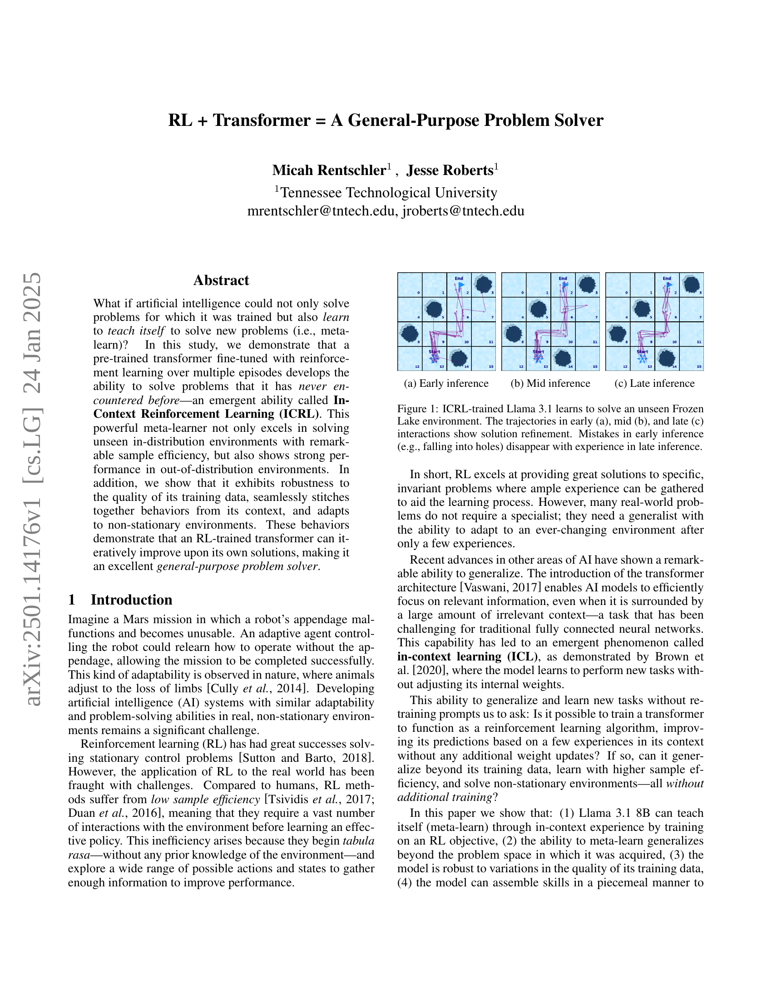
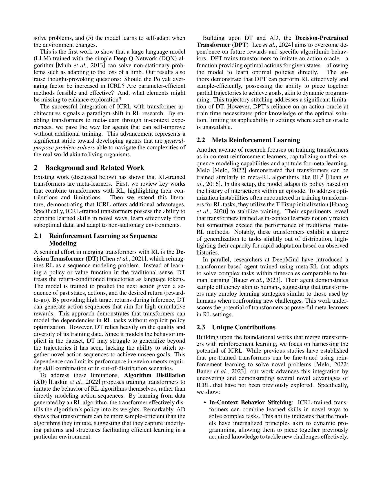
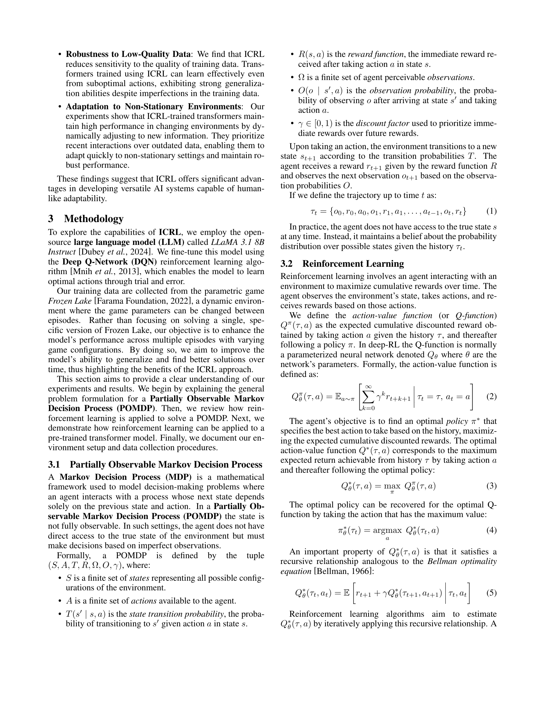
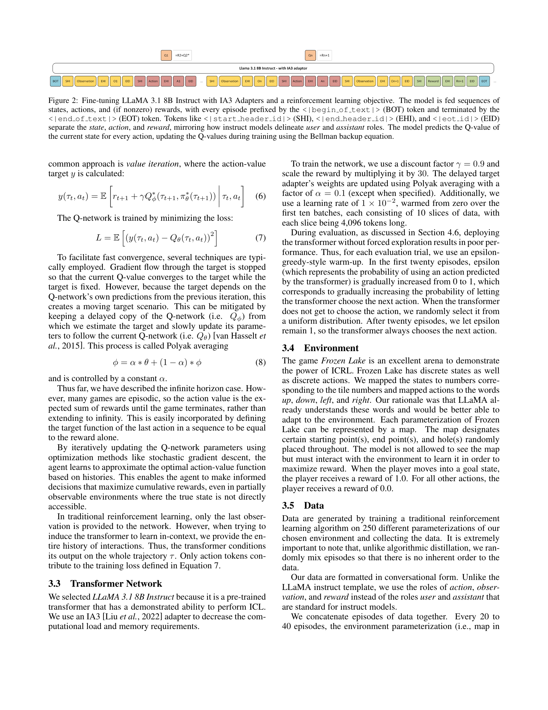
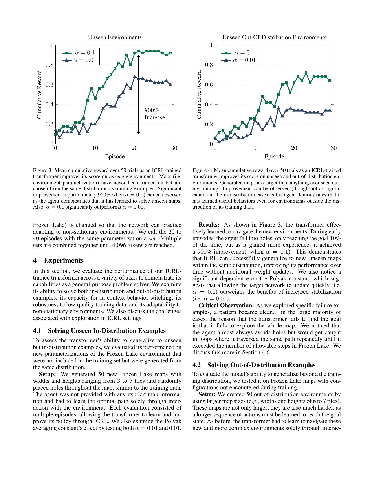
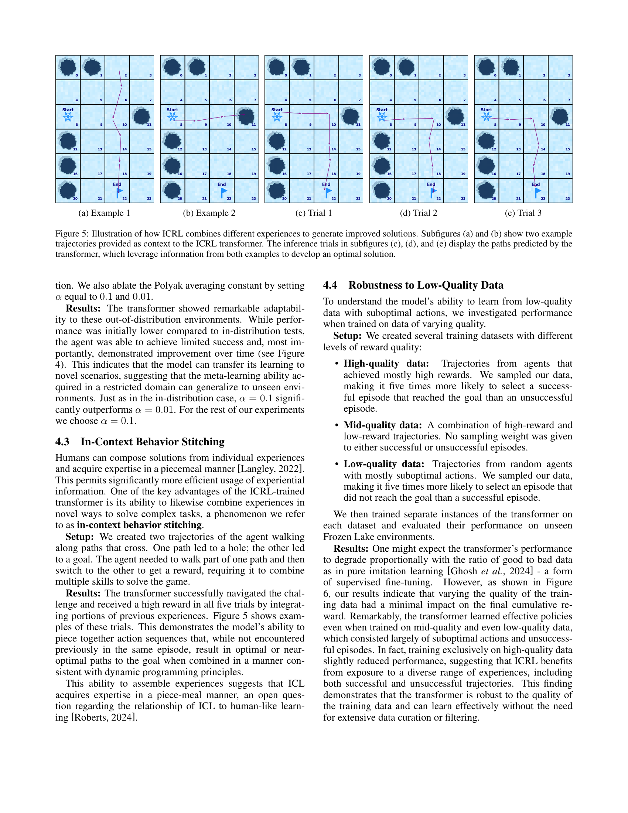
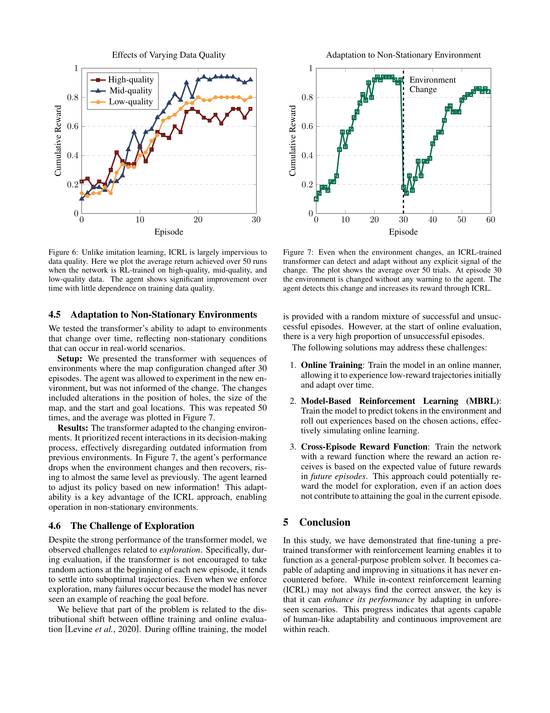
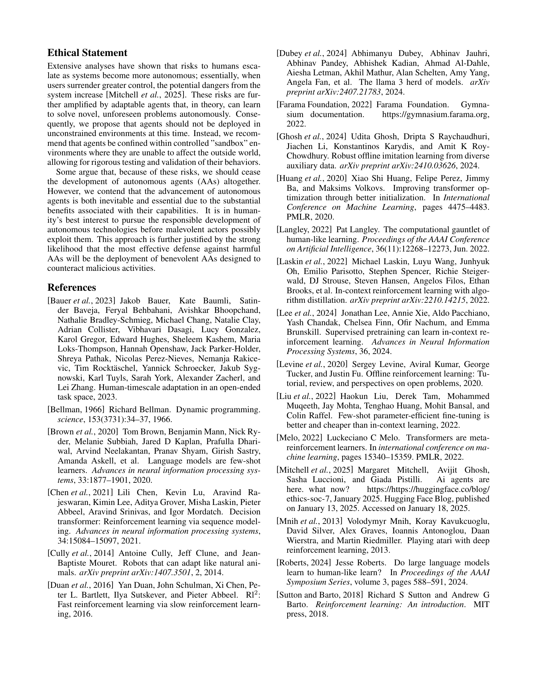

 


 2501.14176 
 Micah Rentschler et el. 
 
 🤗 2025-01-27 
 



↗ arXiv


↗ Hugging Face


↗ Papers with Code


### TL;DR



기존의 강화학습은 **데이터 품질에 민감하고, 새로운 문제에 대한 적응력이 부족**하여 실세계 적용에 어려움이 있었습니다. 특히, **샘플 효율성이 낮고, 비정상적인 환경에 대한 적응력이 떨어지는 문제**가 있었습니다.

본 연구는 이러한 문제를 해결하기 위해 **트랜스포머와 강화학습을 결합한 새로운 메타 러닝 기법**을 제시합니다.  **컨텍스트 기반 강화학습(ICRL)**이라고 불리는 이 기법은 트랜스포머의 문맥 이해 능력을 활용하여 **기존 지식을 새로운 상황에 적용**할 수 있게 합니다.  실험 결과, ICRL 기반 모델은 **샘플 효율성이 높고, 데이터 품질에 대한 민감도가 낮으며, 비정상적인 환경에도 강한 적응력**을 보이는 것으로 나타났습니다. 이는 **실세계 문제 해결에 적용 가능성**을 높이며, **인공지능 연구의 새로운 방향**을 제시합니다.



#### Key Takeaways


 트랜스포머를 이용한 컨텍스트 기반 강화 학습(ICRL)을 통해 **새로운 문제에도 효과적으로 적응**하는 인공지능 시스템 개발 



 ICRL은 **데이터 품질에 대한 민감도가 낮고, 비정상적인 환경에도 뛰어난 성능**을 보임 



 본 연구는 **인공지능의 일반적인 문제 해결 능력 향상**에 대한 새로운 접근법을 제시하고, 향후 연구 방향에 대한 시사점을 제공 


#### Why does it matter?
본 논문은 **강화 학습과 트랜스포머를 결합하여 일반적인 문제 해결 능력을 갖춘 인공지능 시스템**을 개발한 연구입니다. 기존 강화 학습의 한계를 극복하고, 다양한 문제 상황에 적응하며 지속적인 성능 향상을 보이는 모델을 제시하여 **인공지능 연구의 새로운 패러다임**을 제시합니다. 이는 **실세계 문제 해결**에 큰 영향을 미칠 수 있으며, 향후 **메타 러닝 및 트랜스포머 기반 강화 학습** 연구의 방향에 중요한 시사점을 제공합니다.

------
#### Visual Insights

> 🔼 그림 1은 ICRL로 학습된 Llama 3.1이 이전에 본 적 없는 Frozen Lake 환경에서 문제를 푸는 과정을 보여줍니다. (a)는 초기 추론 단계로, 에이전트가 목표에 도달하기 위한 경로를 찾는 과정에서 여러 실수를 하는 것을 보여줍니다. (b)는 중간 추론 단계로, 에이전트가 경험을 통해 실수를 줄이고 더 효율적인 경로를 찾는 것을 보여줍니다. (c)는 후기 추론 단계로, 에이전트가 거의 완벽하게 목표에 도달하는 최적의 경로를 찾는 것을 보여줍니다. 이는 ICRL이 에이전트가 반복적인 시행착오를 통해 학습하고 개선할 수 있도록 하는 방법을 보여주는 예시입니다.
> 

> 
read the caption

> (a) Early inference
> 

### In-depth insights

#### ICRL: A New Meta-Learner
ICRL(In-Context Reinforcement Learning)은 **전이 학습 능력**을 갖춘 새로운 메타러닝 기법으로, 사전 훈련된 변환기 모델에 강화 학습을 적용하여 **전례 없는 문제 해결 능력**을 발휘합니다. 기존 강화 학습의 한계인 낮은 샘플 효율성 문제를 극복하고, **제한된 경험만으로도 새로운 환경에 빠르게 적응**하며, **분포 외 환경에서도 강인한 성능**을 보입니다. 이는 **맥락 정보를 활용**하여 과거 경험들을 조합하고, **지속적으로 학습을 개선**하는 능력 덕분입니다.  **데이터 품질에 대한 저항성** 또한 뛰어나며, **비정상적인 환경 변화에도 유연하게 대처**합니다.  하지만 **탐색(exploration) 전략**의 개선이 필요하며, 실제 세계 적용에 대한 윤리적 고려 또한 중요합니다.  **전반적으로 ICRL은 강화 학습의 새로운 지평을 열고**, 인간과 같은 일반적인 문제 해결 능력을 갖춘 인공지능 개발의 중요한 이정표가 될 것입니다.

#### Transformer-Based RL
변환기 기반 강화 학습(Transformer-Based RL)은 **변환기 아키텍처의 장점과 강화 학습 알고리즘의 효율성을 결합**하여 복잡한 문제 해결 능력을 향상시키는 새로운 접근 방식입니다.  **변환기의 병렬 처리 능력과 장기 의존성 모델링 능력**은 강화 학습 에이전트가 복잡한 환경에서 더욱 효과적으로 학습하고 의사 결정을 내릴 수 있도록 지원합니다.  기존의 순환 신경망 기반 강화 학습에 비해 **데이터 효율성과 일반화 성능이 향상**된다는 점이 주목할 만합니다. 하지만, **매개변수 수가 많아 계산 비용이 높고, 학습 과정의 안정성 확보가 어렵다**는 등의 과제도 존재합니다.  향후 연구에서는 **계산 효율성을 높이고, 학습 안정성을 개선**하는 방향으로 발전될 것으로 예상됩니다. 특히, **소규모 데이터셋에서의 성능 개선**과 **다양한 환경에 대한 적응력 향상**은 중요한 연구 목표가 될 것입니다.  더불어, **설명 가능성 및 투명성 확보**를 위한 노력 또한 필수적입니다.

#### Frozen Lake Experiments
본 논문에서 제시된 "Frozen Lake Experiments"는 강화학습 에이전트의 성능을 평가하기 위한 실험 환경으로, **단순하면서도 다양한 변수 조절이 가능**하다는 점에서 주목할 만합니다.  **다양한 맵 크기와 장애물 배치를 통해 에이전트의 일반화 능력과 탐색 능력을 효과적으로 평가**할 수 있으며, 특히 **비정상적인 상황(Non-stationary Environments)에 대한 적응력**을 측정하는 데 유용합니다.  **In-context learning(ICL) 기반의 강화학습 모델이 이러한 동적 환경에 얼마나 효과적으로 적응하는지** 확인하는 데 초점을 맞추고 있으며, 이를 통해 **일반적인 문제 해결 능력을 가진 강화학습 모델 개발의 가능성**을 제시하고 있습니다.  **데이터 품질에 대한 강건성** 또한 검증하고 있습니다.  Frozen Lake 환경을 활용한 실험은 ICL 기반 강화학습 모델의 성능과 일반화 능력을 평가하는 데 효율적이며, **실제 세계 문제 해결을 위한 견고하고 적응력 있는 AI 시스템 개발**의 가능성을 시사합니다.

#### Generalization & Adaptability
본 논문은 **전이 학습된 트랜스포머 모델이 강화 학습을 통해 다양한 문제 해결 능력을 획득하는 과정**을 보여줍니다. 특히, **새로운 환경이나 예측 불가능한 상황에 대한 적응력**이 뛰어나다는 점을 강조하며, 이는 기존 강화 학습 방식의 한계를 극복하는 중요한 발견입니다. **샘플 효율성 향상**과 **저품질 데이터에 대한 강건성** 또한 확인되어, 실제 세계 적용 가능성을 높였습니다.  하지만, 탐험(exploration) 전략의 개선이 필요하며, 안전성 확보를 위한 추가적인 연구가 요구됩니다. **상황에 맞춰 학습 내용을 조합하는 능력**은 인간의 학습 방식에 가까워, 인공지능의 발전에 중요한 의미를 가집니다.  결론적으로, 본 연구는 **일반화 및 적응력이 뛰어난 인공지능 개발**에 대한 새로운 가능성을 제시합니다.

#### Exploration Challenges
본 논문의 "탐색 과제" 부분은 강화학습 에이전트가 **새로운 환경에서 최적의 행동을 찾는 데 어려움을 겪는 현상**을 다룹니다. 특히, 에이전트가 초기 단계에서 무작위적인 행동을 하지 않으면 최적이 아닌 경로에 갇히는 문제를 지적합니다. 이는 오프라인 학습과 온라인 평가 사이의 분포 차이로 인해 발생하는데, 오프라인 학습에서는 성공과 실패 사례가 균등하게 섞여 있지만 온라인 평가에서는 초기 단계에 실패 사례가 많기 때문입니다. 이러한 문제를 해결하기 위해 **온라인 학습, 모델 기반 강화학습(MBRL), 에피소드 간 보상 함수** 등의 해결책을 제안합니다.  **온라인 학습**은 에이전트가 환경과 상호작용하면서 학습하고 적응하는 방식이며, **MBRL**은 에이전트가 환경을 시뮬레이션하여 미래의 보상을 예측함으로써 탐색을 개선하는 방법입니다. **에피소드 간 보상 함수**는 현재 에피소드의 성공 여부에 관계없이 미래 에피소드에서의 성공 가능성을 높이는 행동을 장려함으로써 탐색을 촉진합니다.  결론적으로, 이 부분은 강화학습에서 탐색의 중요성과 어려움, 그리고 그 해결 방안에 대한 심도있는 논의를 제공합니다.

### More visual insights

More on figures

> 🔼 그림은 ICRL로 훈련된 Llama 3.1 모델이 이전에 본 적 없는 Frozen Lake 환경을 푸는 과정을 보여줍니다.  (b) Mid inference 는 학습 초기 단계보다 나아졌지만, 여전히 최적의 경로를 찾지 못하고 실수를 하는 중간 단계의 추론 과정을 시각적으로 나타냅니다.  초기 추론 단계보다 효율성이 향상되었지만, 완벽한 해결책에 도달하지는 못했음을 보여줍니다.
> 

> 
read the caption

> (b) Mid inference
> 

> 🔼 그림 1(c)는 ICRL로 훈련된 Llama 3.1 모델이 이전에 본 적 없는 Frozen Lake 환경에서 문제 해결 능력을 향상시키는 과정을 보여줍니다. 초기 시도(a)에서는 실수가 많지만(예: 구멍에 빠짐), 학습이 진행됨에 따라(b, c) 정확도가 높아지고 효율적인 경로를 찾는 모습을 보여줍니다. 이는 모델이 경험을 통해 문제 해결 전략을 개선하고 적응하는 능력을 시각적으로 보여주는 것입니다.
> 

> 
read the caption

> (c) Late inference
> 

> 🔼 그림 1은 ICRL(In-Context Reinforcement Learning) 방식으로 학습된 Llama 3.1 언어 모델이 이전에 본 적 없는 Frozen Lake 환경(게임)을 학습하고 푸는 과정을 보여줍니다.  (a)는 초기 시도, (b)는 중간 단계, (c)는 학습 후반부의 이동 경로를 나타냅니다. 초기에는 길을 잘못 찾아 구멍에 빠지는 실수를 하지만, 경험이 쌓이면서(반복 학습) 효율적인 경로를 찾아 목표에 도달하는 모습을 보여줍니다. 이는 ICRL이 모델이 새로운 문제에 적응하고 해결책을 개선해 나가는 능력을 보여주는 좋은 예시입니다.
> 

> 
read the caption

> Figure 1: ICRL-trained Llama 3.1 learns to solve an unseen Frozen Lake environment. The trajectories in early (1(a)), mid (1(b)), and late (1(c)) interactions show solution refinement. Mistakes in early inference (e.g., falling into holes) disappear with experience in late inference.
> 

> 🔼 본 그림은 IA3 어댑터와 강화 학습 목표를 사용하여 미세 조정된 LLaMA 3.1 8B Instruct 모델을 보여줍니다.  모델은 <|begin_of_text|> (BOT) 토큰으로 시작하고 <|end_of_text|> (EOT) 토큰으로 끝나는 에피소드로 구성된 상태, 행동, 그리고 보상(0이 아닌 경우) 시퀀스를 입력받습니다. <|start_header_id|> (SHI), <|end_header_id|> (EHI), <|eot_id|> (EID) 와 같은 토큰은 상태, 행동, 보상을 구분하며, 이는 지시 모델에서 사용자와 어시스턴트의 역할을 구분하는 방식을 반영합니다. 모델은 현재 상태의 각 행동에 대한 Q-값을 예측하고, 벨만 백업 방정식을 사용하여 학습 중에 Q-값을 업데이트합니다.
> 

> 
read the caption

> Figure 2: Fine-tuning LLaMA 3.1 8B Instruct with IA3 Adapters and a reinforcement learning objective. The model is fed sequences of states, actions, and (if nonzero) rewards, with every episode prefixed by the <|begin_of_text|> (BOT) token and terminated by the <|end_of_text|> (EOT) token. Tokens like <|start_header_id|> (SHI), <|end_header_id|> (EHI), and <|eot_id|> (EID) separate the state, action, and reward, mirroring how instruct models delineate user and assistant roles. The model predicts the Q-value of the current state for every action, updating the Q-values during training using the Bellman backup equation.
> 

> 🔼 그림 3은 ICRL로 학습된 트랜스포머가 이전에 본 적 없는 환경에서 점수를 향상시키는 과정을 50번의 시도에 걸쳐 평균 누적 보상으로 나타낸 것입니다.  맵(환경 매개변수화)은 학습에 사용된 적이 없지만 학습 데이터와 같은 분포에서 선택되었습니다.  α=0.1일 때 약 900%의 상당한 성능 향상이 관찰되는데, 이는 에이전트가 보지 못했던 맵을 해결하는 방법을 학습했음을 보여줍니다. 또한 α=0.1이 α=0.01보다 훨씬 더 좋은 성능을 보입니다.  이 그림은 트랜스포머가 새로운 환경에 적응하고 문제 해결 능력을 향상시키는 능력을 시각적으로 보여줍니다.
> 

> 
read the caption

> Figure 3: Mean cumulative reward over 50 trials as an ICRL-trained transformer improves its score on unseen environments. Maps (i.e. environment parametrization) have never been trained on but are chosen from the same distribution as training examples. Significant improvement (approximately 900% when α=0.1𝛼0.1\alpha=0.1italic_α = 0.1) can be observed as the agent demonstrates that it has learned to solve unseen maps. Also, α=0.1𝛼0.1\alpha=0.1italic_α = 0.1 significantly outperforms α=0.01𝛼0.01\alpha=0.01italic_α = 0.01.
> 

> 🔼 그림 4는 ICRL로 학습된 트랜스포머가 훈련 중에 본 적 없는, 분포 밖 환경에서 점수를 향상시키는 과정을 50번의 시도에 걸쳐 누적 보상으로 보여줍니다. 생성된 지도는 훈련 중에 보았던 것보다 크기가 더 큽니다. 훈련 데이터의 분포를 벗어난 환경에서도 유용한 행동을 학습했음을 보여주는 개선이 관찰되지만, 분포 내 환경에서만큼 두드러지지는 않습니다.
> 

> 
read the caption

> Figure 4: Mean cumulative reward over 50 trials as an ICRL-trained transformer improves its score on unseen and out-of-distribution environments. Generated maps are larger than anything ever seen during training. Improvement can be observed (though not as significant as in the in-distribution case) as the agent demonstrates that it has learned useful behaviors even for environments outside the distribution of its training data.
> 

> 🔼 그림 5(a)는 논문의 4.3절 '문맥 내 행동 연결'에서 설명하는, 에이전트가 경험을 통해 학습한 여러 경로들을 조합하여 복잡한 문제를 해결하는 방법을 보여주는 예시 중 하나입니다. 그림은 에이전트가 목표에 도달하기 위해 두 가지 서로 다른 경로를 조합하여 사용하는 것을 보여줍니다. 각 경로는 서로 다른 시작점과 장애물을 가지고 있으며, 에이전트는 이러한 경험들을 결합하여 최적의 경로를 찾아냅니다.
> 

> 
read the caption

> (a) Example 1
> 

> 🔼 그림 (b)는 논문의 4.3절 '문맥 내 행동 연결(In-Context Behavior Stitching)'에서 설명하는 내용을 보여줍니다.  이 그림은 에이전트가 경험을 통해 배운 여러가지 경로들을 조합하여 새로운 문제를 해결하는 방법을 보여주는 예시 중 하나입니다. 그림 (a)와 함께 두 가지 다른 경로를 보여주고, 이를 바탕으로 에이전트가 어떻게 최적의 경로를 찾아가는지를 보여줍니다.  구체적으로, (b)는 에이전트가 목표에 도달하는 두 번째 예시 경로를 나타냅니다.  (a)와 (b)의 경로를 함께 활용하여 (c), (d), (e)에서 보여지는 세 가지 다른 시도에서 에이전트가 최적의 경로를 찾아가는 과정을 시각적으로 보여줍니다.
> 

> 
read the caption

> (b) Example 2
> 

### Full paper



