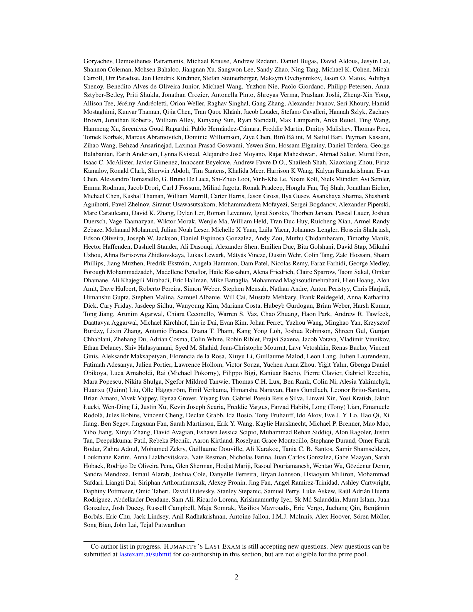

 


 2501.14249 
 Long Phan et el. 
 
 🤗 2025-01-27 
 



↗ arXiv


↗ Hugging Face


↗ Papers with Code


### TL;DR



기존의 대규모 언어 모델(LLM) 벤치마크는 난이도가 낮아 최첨단 모델의 성능을 제대로 평가하지 못하는 문제점이 있습니다.  LLM이 기존 벤치마크에서 매우 높은 정확도를 달성하면서, 이러한 벤치마크의 한계가 드러났습니다. 따라서,  더욱 어려운 평가 기준이 필요하게 되었습니다.

본 연구는 이러한 문제를 해결하기 위해 **인류의 지식 한계를 시험하는 새로운 벤치마크인 HUMANITY'S LAST EXAM (HLE)**을 제시합니다. HLE는 다양한 학문 분야를 아우르는 3,000개의 질문으로 구성되며, 전문가에 의해 개발 및 검증되었습니다.  **HLE를 통해 측정된 최첨단 LLM의 성능은 매우 낮았으며, 모델의 신뢰도 또한 낮은 것으로 나타났습니다.** 이는 현재의 LLM이 인간 전문가 수준에 크게 미치지 못함을 시사합니다.



#### Key Takeaways


 새로운 다중 모드 벤치마크 HLE가 개발되어, 기존 벤치마크의 한계를 극복했습니다. 



 HLE는 최첨단 LLM의 정확도가 낮고 보정 성능이 떨어짐을 보여주어,  현재 기술 수준과 인간 전문가 수준의 격차를 밝혔습니다. 



 HLE는 향후 AI 연구 및 정책 결정에 중요한 정보를 제공하고, 모델 성능에 대한 명확한 이해를 제공합니다. 


#### Why does it matter?
본 논문은 **최첨단 LLM의 능력을 측정하는 새로운 벤치마크인 HUMANITY'S LAST EXAM(HLE)**을 제시하여, 현재의 LLM이 **인간 전문가 수준에 크게 미치지 못함**을 보여줍니다.  이는 **향후 AI 연구 방향** 설정 및 **정책 결정**에 중요한 정보를 제공하고, **새로운 연구 분야**를 개척하는 데 기여할 것입니다.

------
#### Visual Insights

> 🔼 그림 1은 기존 벤치마크의 포화 상태와 비교하여 Humanity's Last Exam(HLE)의 정확도가 여러 최첨단 모델에서 여전히 낮음을 보여줍니다. 이는 HLE가 고급의 폐쇄형 학업 능력을 측정하는 데 효과적임을 보여줍니다. 평가 지표 출처는 C.5절에 자세히 설명되어 있으며, 표 1에서는 더 많은 최첨단 모델에 대한 HLE 평가 결과를 보여줍니다.
> 

> 
read the caption

> Figure 1: Compared against the saturation of some existing benchmarks, Humanity’s Last Exam accuracy remains low across several frontier models, demonstrating its effectiveness for measuring advanced, closed-ended, academic capabilities. The sources for our evaluation metrics are detailed in Section C.5. We further evaluate more frontier models on HLE in Table 1.
> 


| Model | Accuracy (%) ↑ | Calibration Error (%) ↓ |
|---|---|---|
| GPT-4o | 3.3 | 92.5 |
| Grok 2 | 3.8 | 93.2 |
| Claude 3.5 Sonnet | 4.3 | 88.9 |
| Gemini 1.5 Pro | 5.0 | 93.1 |
| Gemini 2.0 Flash Thinking | 6.2 | 93.9 |
| o1 | 9.1 | 93.4 |
| DeepSeek-R1* | 9.4 | 81.8 |

> 🔼 표 1은 HUMANITY'S LAST EXAM(HLE) 벤치마크에서 다양한 최첨단 언어 모델의 정확도와 RMS 보정 오차를 보여줍니다.  결과는 모든 모델에서 낮은 정확도와 높은 보정 오차를 보여주어, 환각 현상을 나타냅니다.  *표시된 모델은 다중 모드 모델이 아니며, 텍스트 전용 하위 집합에 대해 평가되었습니다. 본 논문의 C.2절에서는 모든 모델의 텍스트 전용 결과를 보고합니다.
> 

> 
read the caption

> Table 1: Accuracy and RMS calibration error of different models on HLE, demonstrating low accuracy and high calibration error across all models, indicative of hallucination. ∗Model is not multi-modal, evaluated on text-only subset. We report text-only results on all models in Section C.2.
> 

### In-depth insights

#### LLM Benchmarking
LLM 벤치마킹은 **대규모 언어 모델(LLM)**의 성능을 측정하고 비교하는 데 필수적입니다.  기존 벤치마킹의 한계를 극복하고 **인간의 지능 수준**에 도달한 모델의 성능을 평가하기 위해서는 새로운 벤치마킹 방법이 필요합니다.  **다양한 과제 유형과 난이도**, **다중 모드(텍스트 및 이미지)**, 그리고 **인간 전문가의 참여**를 통한 엄격한 평가 기준을 갖춘 벤치마킹은 LLM의 발전을 추적하고, **잠재적 위험 및 윤리적 문제점**을 파악하는 데 중요한 역할을 합니다.  특히, **모델의 신뢰성(calibration)**과 **일반화 능력**을 측정하는 것은  LLM의 실제 응용 가능성을 평가하는 데 중요한 지표입니다.  따라서, 지속적인 벤치마킹 개선과 새로운 벤치마크 개발을 통해 LLM의 발전 방향을 제시하고 안전하고 책임감 있는 AI 개발을 위한 기반을 마련해야 합니다.

#### HLE Design
HLE(인류의 마지막 시험) 설계의 핵심은 **인간의 지식 한계를 탐구하는 어려운 문제**를 통해 최첨단 LLM의 능력을 정확히 측정하는 데 있습니다. 이를 위해 **다양한 학문 분야**를 아우르는 3,000개의 질문을 포함하여 **폭넓은 지식 범위**를 확보하고, **모호함이 없고 검증이 용이한 명확한 답변**을 제공합니다.  **인터넷 검색을 통한 빠른 답변 방지**를 위해 독창적이고 정교한 질문을 사용하며, **텍스트 기반 및 이미지 기반 질문**을 혼합하여 다양한 능력을 평가합니다.  엄격한 검토 과정을 거쳐 질문의 질을 보장하며, **LLM의 난이도 확인 및 전문가 검토**를 통해 실제로 어려운 문제만 선별합니다.  **다양한 평가 지표**를 활용하여 모델의 정확도뿐 아니라 신뢰도(calibration)까지 종합적으로 평가하여, 단순한 정확도가 아닌 **모델의 진정한 능력**을 파악하고자 합니다.

#### Frontier Models
최첨단 언어 모델, 즉 **프런티어 모델**은 인간의 지능에 근접한 성능을 보이는 것을 목표로 합니다.  이러한 모델들은 방대한 데이터셋으로 훈련되며, **다양한 과제에서 인간 수준 이상의 성능**을 보여주는 경우도 있습니다. 하지만, 아직까지는 **완벽한 지능**을 갖추었다고 보기는 어렵습니다.  **일반화 능력**과 **추론 능력**에서 한계를 보이며, 때로는 **예상치 못한 오류**를 발생시키기도 합니다.  **인간의 개입** 없이 스스로 학습하고 발전하는 수준에는 아직 미치지 못하지만,  **지속적인 발전**을 통해 인간 수준의 지능을 넘어설 가능성을 가지고 있습니다.  **윤리적 문제**와 **안전성 확보**가 중요한 과제이며, 프런티어 모델의 발전 방향을 결정하는 데 큰 영향을 미칠 것입니다.  **책임감 있는 개발**과 **사회적 영향**에 대한 심도있는 논의가 필수적입니다.

#### HLE Limitations
HLE의 한계는 주로 **범위와 일반화 가능성**에 있습니다.  방대한 질문 데이터셋이지만, 학문 분야의 특정 영역에 치우쳐져 있을 가능성이 있으며, **실제 세계 문제 해결 능력**을 직접적으로 평가하지 못할 수 있습니다.  또한, **평가 방식의 제한**으로 인해 모델의 잠재력을 완전히 포착하지 못하거나, **편향된 결과**를 초래할 수 있습니다.  HLE가 특정 유형의 문제 해결에 초점을 맞추고 있어, **모델의 전반적인 지능 수준**을 완벽하게 반영하지 못할 수 있다는 점 또한 중요한 한계입니다. 따라서, HLE 결과는 모델의 능력을 평가하는 데 유용한 지표가 될 수 있지만, **절대적인 기준**으로 받아들여서는 안 됩니다.  **다른 벤치마크와의 비교 분석** 및 **지속적인 개선 노력**을 통해 HLE의 한계를 보완하는 것이 중요합니다.

#### Future Research
미래 연구 분야로는 **HLE 벤치마크의 지속적인 개선 및 확장**이 중요합니다.  더욱 다양한 분야의 질문을 추가하고, **멀티모달 질문의 비중을 늘려** AI 모델의 실제 세계 적용 능력을 더욱 정확하게 평가할 수 있도록 해야 합니다. 또한, **평가 지표의 다양화**를 통해 모델의 강점과 약점을 보다 정교하게 분석하고, **인간 전문가의 역할을 명확히** 함으로써 AI 모델의 한계를 극복하기 위한 연구 방향을 제시해야 합니다.  **모델의 신뢰성 및 설명 가능성 향상**을 위한 연구는 필수적이며, 이를 통해 HLE와 같은 벤치마크가 윤리적, 사회적 함의를 고려한 AI 개발에 기여할 수 있을 것입니다.  **새로운 평가 방식**과 **데이터 셋 구축** 연구도 중요합니다.  **데이터 증강 기법**을 활용한 효율적인 데이터 활용 방안 또한 고려되어야 할 것입니다.

### More visual insights

More on figures

> 🔼 그림 2는 HUMANITY'S LAST EXAM에 제출된 다양하고 어려운 질문들의 예시들을 보여줍니다. 각 질문은 고전, 생태학, 수학, 컴퓨터 과학, 화학, 언어학 등 다양한 학문 분야를 아우르며, 최첨단 AI 모델조차도 쉽게 답할 수 없을 정도로 높은 수준의 전문 지식과 추론 능력을 요구합니다. 이 그림은 HLE의 다양성과 난이도를 보여주는 대표적인 예시들을 제시함으로써,  본 연구에서 사용된 벤치마크의 특징을 효과적으로 설명합니다.
> 

> 
read the caption

> Figure 2: Samples of the diverse and challenging questions submitted to Humanity’s Last Exam.
> 

> 🔼 그림 3은 HUMANITY'S LAST EXAM(HLE) 데이터셋의 개요를 보여줍니다. HLE는 100개가 넘는 과목에 걸쳐 총 3,000개의 질문으로 구성되며, 그림에서는 이 질문들이 상위 수준의 범주로 그룹화되어 표시됩니다.  수학, 생물학/의학, 물리학, 컴퓨터 과학/인공지능, 인문학/사회과학, 화학, 공학 등 다양한 분야를 아우르는 질문들이 포함되어 있습니다.  각 범주에 속한 질문의 개수는 비율로 표현되어 있으며, 더 자세한 과목 목록은 본문의 B.3절에서 확인할 수 있습니다.
> 

> 
read the caption

> Figure 3: HLE consists of 3,00030003{,}0003 , 000 exam questions in over a hundred subjects, grouped into high level categories here. We provide a more detailed list of subjects in Section B.3.
> 

> 🔼 그림 4는 HUMANITY'S LAST EXAM(HLE) 데이터셋 생성 과정을 보여줍니다. 우선, 최첨단 LLM이 풀지 못하는 문제들을 수집합니다. 그런 다음, 전문가 동료 평가자들의 반복적인 검토를 통해 문제들을 다듬습니다. 최종적으로, 주최측 또는 주최측이 훈련시킨 전문가 검토자들이 각 문제를 수동으로 승인합니다. 과적합 및 공개 벤치마크에서의 게임(gaming) 문제를 평가하기 위해 공개 데이터셋 외에 비공개 테스트 세트도 유지합니다.
> 

> 
read the caption

> Figure 4: Dataset creation pipeline. We accept questions that make frontier LLMs fail, then iteratively refine them with the help of expert peer reviewers. Each question is then manually approved by organizers or expert reviewers trained by organizers. A private held-out set is kept in addition to the public set to assess model overfitting and gaming on the public benchmark.
> 

> 🔼 이 그림은 추론 모델과 비추론 모델의 평균 토큰 수를 비교하여 보여줍니다.  추론 모델은 추론 과정과 최종 답변을 생성하는 데 더 많은 토큰을 사용하는 반면, 비추론 모델은 상대적으로 적은 토큰을 사용합니다.  그림에는 수학, 생물학/의학, 물리학, 컴퓨터 과학/AI, 인문학/사회 과학, 화학, 공학, 기타 등 다양한 주제에 대한 평균 토큰 수가 제시되어 있습니다.  본 논문의 부록 C.3절에서는 비추론 모델에 대한 평균 토큰 수에 대한 자세한 내용을 확인할 수 있습니다.
> 

> 
read the caption

> Figure 5: Average completion token counts of reasoning models tested, including both reasoning and output tokens. We also plot average token counts for non-reasoning models in Section C.3.
> 

> 🔼 그림 6은 추론 능력이 없는 모델들의 평균 출력 토큰 수를 보여줍니다.  각 모델이 수행한 다양한 과제(수학, 생물학/의학, 물리학, 컴퓨터 과학/AI, 인문학/사회과학, 화학, 공학, 기타)에 대한 평균 토큰 수를 시각적으로 나타내어, 모델의 출력 길이와 과제 유형 간의 관계를 파악하는 데 도움을 줍니다. 이는 추론 모델과 비추론 모델 간의 성능 차이를 비교 분석하는 데 유용한 정보입니다.
> 

> 
read the caption

> Figure 6: Average output token counts of non-reasoning models.
> 

More on tables


| Score | Scoring Guideline | Description |
|---|---|---|
| 0 | Discard | The question is out of scope, not original, spam, or otherwise not good enough to be included in the HLE set and should be discarded. |
| 1 | Major Revisions Needed | Major revisions are needed for this question or the question is too easy and simple. |
| 2 | Some Revisions Needed | Difficulty and expertise required to answer the question is borderline. Some revisions are needed for this question. |
| 3 | Okay | The question is sufficiently challenging but the knowledge required is not graduate-level nor complex. Minor revisions may be needed for this question. |
| 4 | Great | The knowledge required is at the graduate level or the question is sufficiently challenging. |
| 5 | Top-Notch | Question is top-notch and perfect. |
| Unsure | - | Reviewer is unsure if the question fits the HLE guidelines, or unsure if the answer is right. |
> 🔼 표 2는 HLE의 텍스트 전용 질문(공개 데이터 세트의 90%)에 대한 표 1의 모델들의 정확도와 RMS 보정 오차를 보여줍니다. 즉, 이미지가 없는 텍스트 질문에 대해서만 모델의 성능을 평가한 결과입니다.  이 표는 모델의 정확도와 자신감의 정확성을 보여주는 보정 오차를 비교하여 모델의 성능을 더 자세히 파악하는 데 도움이 됩니다.
> 

> 
read the caption

> Table 2: Accuracy and RMS calibration error of models from Table 1 on the text-only questions of HLE, representing 90% of the public set.
> 


| Score | Scoring Guideline | Description |
|---|---|---|
| 0 | Discard | The question is out of scope, not original, spam, or otherwise not good enough to be included in the HLE set and should be discarded. |
| 1 | Not sure | Major revisions are needed for this question or you’re just unsure about the question. Please put your thoughts in the comment box and an organizer will evaluate this. |
| 2 | Pending | You believe there are still minor revisions that are needed on this question. Please put your thoughts in the comment box and an organizer will evaluate this. |
| 3 | Easy questions models got wrong | These are very basic questions that models got correct or the question was easily found online. Any questions which are artificially difficult (large calculations needing a calculator, requires running/rendering code, etc.) should also belong in this category. The models we evaluate cannot access these tools, hence it creates an artificial difficulty bar. Important: “Found online” means via a simple search online. Research papers/journals/books are fine |
| 4 | Borderline | The question is not interesting OR The question is sufficiently challenging, but 1 or more of the models got the answer correct. |
| 5 | Okay to include in HLE benchmark | Very good questions (usually has score of 3 in the previous review round). You believe it should be included in the HLE Benchmark. |
| 6 | Top question in its category | Great question (usually has a score of 4-5 in the previous review round), at a graduate or research level. Please note that “graduate level” is less strict for Non-STEM questions. For Non-STEM questions and Trivia, they are fine as long as they are challenging and interesting. |
> 🔼 표 3은 평가에 사용된 모델 버전과 설정 정보를 보여줍니다. 모든 모델은 온도(temperature)를 0으로 설정하여 구성하였습니다. 이는 모델이 가능한 가장 확정적인(deterministic) 출력을 생성하도록 하여, 평가 결과의 일관성과 신뢰성을 높이기 위함입니다. 표에는 모델 이름과 함께 각 모델의 구체적인 버전 정보가 제시되어 있으며, 연구의 재현성을 높이기 위해 중요한 정보입니다.
> 

> 
read the caption

> Table 3: Evaluated model versions. All models use temperature 0 when configurable.
> 

### Full paper



