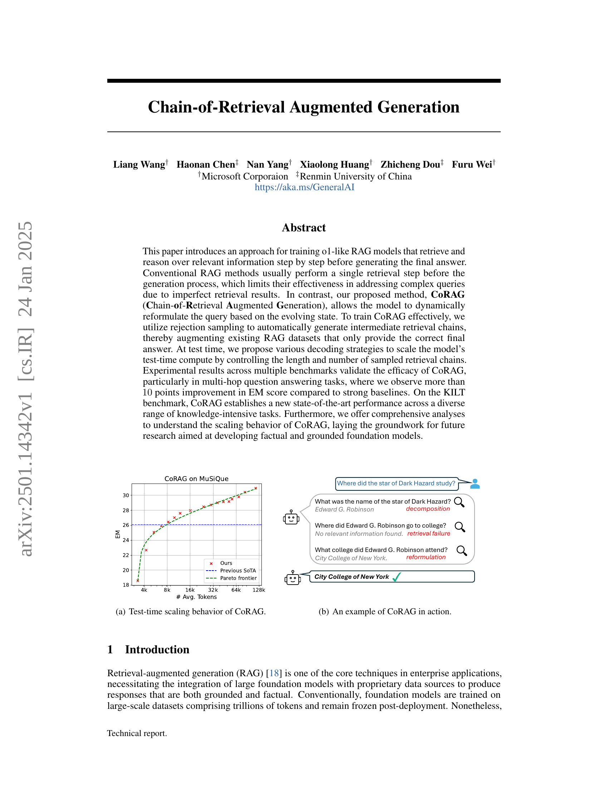
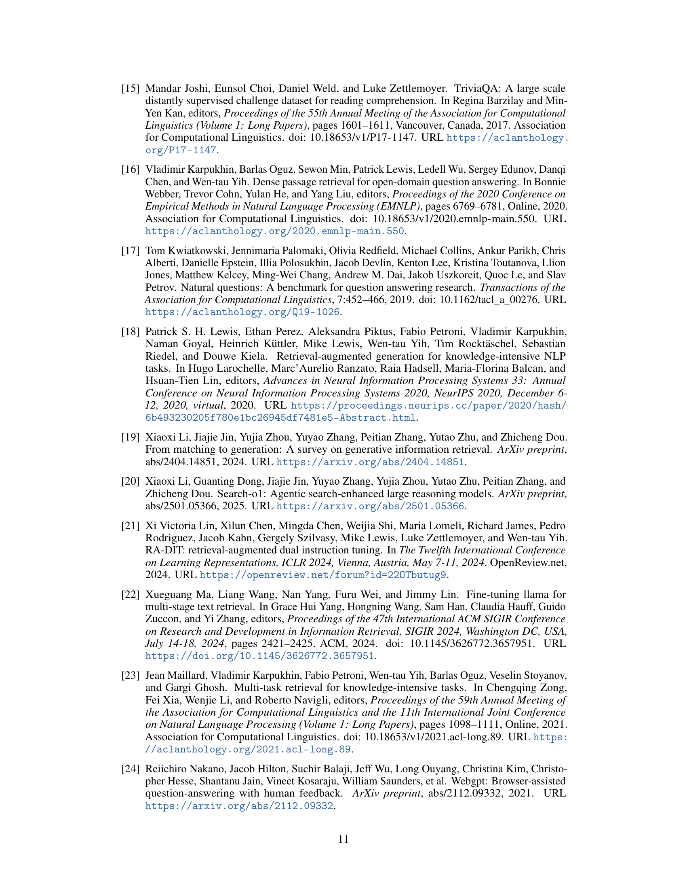

 


 2501.14342 
 Liang Wang et el. 
 
 🤗 2025-01-27 
 



↗ arXiv


↗ Hugging Face


↗ Papers with Code


### TL;DR



기존의 RAG(Retrieval-Augmented Generation) 모델은 단일 검색 단계만 수행하여 복잡한 질문에 대한 답변 생성의 효율성이 떨어지는 문제점을 가지고 있습니다. 특히, 불완전한 검색 결과로 인해 복잡한 질문에 대한 정확한 답변을 생성하는 데 어려움이 있습니다.

본 논문에서는 이러한 문제점을 해결하기 위해, 모델이 동적으로 질문을 재구성하고 단계적으로 관련 정보를 검색 및 추론하는 새로운 RAG 모델인 CoRAG(Chain-of-Retrieval Augmented Generation)를 제안합니다. CoRAG는 기존 RAG 데이터셋에 중간 검색 체인을 자동으로 생성하여 모델을 효과적으로 학습시키고, 다양한 디코딩 전략을 통해 테스트 시간 계산 비용을 제어하여 모델의 실용성을 높였습니다. 실험 결과, CoRAG는 다양한 벤치마크에서 우수한 성능을 보였으며, 특히 다중 단계 질문 응답 작업에서 기존 모델 대비 성능 향상을 보였습니다.



#### Key Takeaways


 CoRAG는 다단계 검색 ë° 추론을 통해 복잡한 질문에 대한 답변 생성 성능을 향상시킨다. 



 CoRAG는 다양한 디코딩 전략을 통해 테스트 시간 계산 비용을 효율적으로 제어한다. 



 CoRAG는 다양한 지식 집약적 작업에서 최첨단 성능을 달성한다. 


#### Why does it matter?
본 논문은 **복잡한 질문에 대한 답변 생성을 개선하기 위해 단계적 검색 및 추론을 통해 관련 정보를 검색하고 추론하는 새로운 RAG(Retrieval-Augmented Generation) 프레임워크인 CoRAG를 제시**합니다. 기존 RAG 방식의 한계를 극복하고 다양한 지식 집약적 작업에서 최첨단 성능을 달성함으로써, **사실적이고 근거 있는 기초 모델 개발을 위한 새로운 연구 방향을 제시**합니다. 특히, **다양한 디코딩 전략을 통해 테스트 시간 계산 비용을 효율적으로 제어**하는 방법을 제시하여 실제 응용 가능성을 높였습니다. 이는 RAG 분야 연구에 큰 영향을 미칠 뿐 아니라, 향후 연구에서 다양한 디코딩 전략 및 하이퍼파라미터 구성을 통해 테스트 시간 토큰 소비량과 검색기 호출 빈도를 제어할 수 있는 방법을 제시합니다. 따라서, **실제 응용 가능성이 높은 사실적이고 근거있는 기초 모델 개발을 위한 새로운 연구 방향을 제시**한다는 점에서 중요한 의미를 지닙니다.

------
#### Visual Insights

> 🔼 그림 (a)는 CoRAG 모델의 테스트 시간 확장성을 보여줍니다.  x축은 평균 토큰 수를 나타내고, y축은 MuSiQue 데이터셋에서 CoRAG 모델의 성능(EM 점수)을 나타냅니다.  다양한 토큰 수에 따른 성능 변화를 보여주는 그래프로, CoRAG 모델이 더 많은 토큰을 사용할수록 성능이 향상됨을 시각적으로 보여줍니다.  다른 최첨단 모델과의 비교를 통해 CoRAG의 우수성을 간접적으로 나타내는 그래프이기도 합니다.
> 

> 
read the caption

> (a) Test-time scaling behavior of CoRAG.
> 


| Dataset | EM | F1 | EM | F1 | EM | F1 | EM | F1 |
|---|---|---|---|---|---|---|---|---|
| **Few-shot w/o Retrieval** |  |  |  |  |  |  |  |  |
| 3-shot Llama-3.1-8B-Inst. | 27.6 | 32.1 | 20.8 | 28.8 | 17.6 | 21.3 | 3.4 | 9.7 |
| 3-shot GPT-4o | 39.5 | 47.3 | 38.2 | 51.2 | 49.6 | 61.5 | 15.8 | 27.2 |
| **w/ Retrieval** |  |  |  |  |  |  |  |  |
| 3-shot Llama-3.1-8B-Inst. | 30.7 | 39.9 | 34.1 | 46.6 | 28.0 | 37.3 | 7.7 | 15.4 |
| 3-shot GPT-4o | 49.0 | 56.2 | 45.8 | 59.4 | 53.6 | 63.8 | 15.7 | 25.8 |
| Self-RAG-7B | 12.2 | 24.1 | 16.6 | 29.4 | 5.6 | 16.8 | 4.6 | 13.2 |
| ITER-RETGEN | 35.5 | 47.4 | 45.1 | 60.4 | 40.0 | 50.7 | 26.1 | 42.0 |
| DRAG (32k) | 45.9 | 53.7 | 46.9 | 60.3 | 48.8 | 59.2 | 15.4 | 26.0 |
| IterDRAG (32k) | 44.3 | 54.6 | 38.3 | 49.8 | 46.4 | 56.2 | 12.5 | 23.1 |
| Search-o1-32B | 58.0 | 71.4 | 45.2 | 57.3 | 56.0 | 67.8 | 16.6 | 28.2 |
| Fine-tuned Llama-8B w/ E5large | 55.1 | 60.7 | 50.3 | 63.5 | 40.8 | 53.7 | 17.4 | 28.1 |
| **CoRAG-8B (Ours)** |  |  |  |  |  |  |  |  |
|  ▷ L=1, greedy | 56.5 | 62.3 | 50.1 | 63.2 | 37.6 | 51.4 | 18.6 | 29.3 |
|  ▷ L=6, greedy | 70.6 | 75.5 | 54.4 | 67.5 | 48.0 | 63.5 | 27.7 | 38.5 |
|  ▷ L=6, best-of-4 | 71.7 | 76.5 | 55.3 | 68.5 | 51.2 | 63.1 | 28.1 | 39.7 |
|  ▷ L=10, best-of-8 | **72.5** | **77.3** | **56.3** | **69.8** | 54.4 | **68.3** | **30.9** | **42.4** |

> 🔼 표 1은 다양한 디코딩 전략과 검색 체인 길이(L)를 사용하여 CoRAG-8B 모델의 성능을 다중 홉 질의응답(QA) 데이터셋에서 평가한 결과를 보여줍니다.  '퓨샷(Few-shot) w/o Retrieval' 설정은 검색 증강 없이 QA 쌍만 사용한 결과입니다. DRAG와 IterDRAG는 Gemini 1.5 Flash [29] 기반이며, Search-o1-32B는 QwQ [35]와 Bing 검색 API를 사용합니다.  각 데이터셋(2WikiMultihopQA, HotpotQA, Bamboogle, MuSiQue)에 대한 EM과 F1 점수가 제시되어 CoRAG-8B의 성능을 다양한 기준으로 비교 분석할 수 있도록 합니다.
> 

> 
read the caption

> Table 1: Results on multi-hop QA datasets. We report the performance of CoRAG-8B using various decoding strategies and retrieval chain lengths L𝐿Litalic_L. The “Few-shot w/o Retrieval” configuration utilizes only QA pairs without retrieval augmentation. Both DRAG and IterDRAG are based on Gemini 1.5 Flash [29], while Search-o1-32B is based on QwQ [35] and the Bing Search API.
> 

### In-depth insights

#### CoRAG: Step-by-Step RAG
CoRAG (Chain-of-Retrieval Augmented Generation)은 기존의 단일 검색 단계를 넘어 **다단계 검색 및 추론 과정**을 거쳐 최종 답변을 생성하는 혁신적인 접근 방식입니다. 이는 불완전한 단일 검색 결과로 인해 복잡한 질문에 대한 효과적인 답변 생성에 제한이 있었던 기존 RAG 방식의 한계를 극복하기 위한 시도입니다. CoRAG는 모델이 **진화하는 상태에 따라 질의를 동적으로 재구성**하고, 거절 샘플링을 활용하여 중간 검색 체인을 자동 생성함으로써 기존 RAG 데이터셋을 효과적으로 보강합니다. 특히 **다단계 질문 답변** 작업에서 기존 방식 대비 EM 점수가 10% 이상 향상되는 등 우수한 성능을 보이며 KILT 벤치마크에서 최첨단 성능을 달성합니다. 다양한 디코딩 전략을 통해 테스트 시간 계산량을 효율적으로 관리하는 방법 또한 제시합니다. **테스트 시간 계산량 조절**, **다양한 디코딩 전략**, 그리고 **거절 샘플링 기법**을 통한 데이터 증강은 CoRAG의 핵심적인 강점입니다.  이러한 특징들을 통해 CoRAG는 사실적이고 근거 있는 기초 모델 개발을 위한 중요한 토대를 마련합니다.

#### Rejection Sampling
본 논문에서 제안하는 **거절 샘플링(Rejection Sampling)** 기법은 기존 RAG 데이터셋의 한계를 극복하기 위해 고안되었습니다. 기존 데이터셋은 정답만 제공하지만, **CoRAG는 중간 단계의 검색 과정(retrieval chain)**을 생성하여 모델 학습에 활용합니다. 이를 통해 단순히 정답만을 예측하는 것이 아니라, 다단계 추론 과정을 거쳐 정답에 도달하는 과정을 학습시키는 것입니다. **거절 샘플링을 통해 생성된 중간 과정들은 모델이 복잡한 질문에 대해 단계적으로 추론하고, 부정확한 검색 결과를 보완하는 능력을 향상시키는 데 중요한 역할**을 합니다.  이는 기존 RAG 모델의 정확도 및 효율성을 높이는 데 기여하며, 특히 다단계 질문응답(multi-hop QA)과 같은 복잡한 작업에서 큰 성능 향상을 가져옵니다.  **샘플링 과정의 효율성 및 생성된 체인의 질은 모델 성능에 직접적인 영향**을 미치므로, 이 부분에 대한 추가적인 연구가 필요합니다.  이는 **향후 실제 응용 시나리오에서 CoRAG 모델의 신뢰성 및 확장성을 높이는 데 중요한 요소**가 될 것입니다.

#### Decoding Strategies
본 논문에서 제시된 다양한 디코딩 전략은 **테스트 시간 연산량과 성능 간의 절충**을 효과적으로 관리하는 데 중점을 둡니다.  **탐욕적 디코딩**, **Best-of-N 샘플링**, **트리 탐색** 등 세 가지 주요 전략이 제시되었으며, 각 전략은 추론 과정에서의 토큰 소비량과 리트리버 호출 빈도를 제어하는 매개변수를 제공합니다. 특히, **Best-of-N 샘플링**은 다양한 리트리벌 체인을 샘플링하여 최적의 체인을 선택함으로써 성능 향상을 가져오는 효과적인 방법임을 보여줍니다. **트리 탐색**은 탐색 공간을 더욱 포괄적으로 탐험하지만, 연산량이 증가한다는 단점이 있습니다.  이러한 다양한 전략들을 통해 모델은 특정 작업의 복잡성에 따라 테스트 시간 연산량을 동적으로 조절할 수 있으며, **자원 효율성과 성능 간의 균형**을 유지하는 데 도움이 될 것입니다.  **파레토 프런티어** 분석을 통해 이러한 전략들이 테스트 시간 연산량과 성능 간의 최적의 균형을 제공함을 확인할 수 있었습니다.

#### Scaling Test-Time
본 논문의 "스케일링 테스트 시간" 부분은 모델의 테스트 시간 연산량을 효율적으로 관리하는 전략에 초점을 맞춥니다. **탐욕적 디코딩, 베스트-N 샘플링, 트리 탐색** 등 다양한 디코딩 전략을 제시하여, **토큰 소모량과 성능 간의 균형**을 조절하는 방법을 제시합니다.  이를 통해 질의의 복잡도나 검색기의 정확도에 따라 테스트 시간 연산량을 동적으로 할당하여 효율성을 높일 수 있습니다.  **파레토 프런티어 분석**을 통해 토큰 소모량과 모델 성능 간의 관계를 분석하고, 로그 선형 관계를 보임을 보여줍니다.  이러한 분석은 모델 성능을 극대화하면서 테스트 시간 연산 비용을 최소화하는 최적의 전략을 선택하는 데 도움을 줍니다.  궁극적으로, 이 부분은 **실제 환경에서의 RAG 모델 적용 가능성을 높이고** 연산 비용 효율성을 극대화하는 데 기여합니다.

#### Iterative Training
반복적 학습은 기존 RAG 데이터셋에 중간 검색 체인을 자동으로 생성하여 **기존 RAG 모델의 성능을 향상시키는** 기술입니다.  이를 위해 **거절 샘플링** 기법을 사용하여 다양한 중간 단계의 검색 쿼리와 답변들을 생성합니다.  이렇게 생성된 중간 단계 정보는 모델이 복잡한 질문에 대해 단계적으로 추론하고 답변을 생성하는 데 도움을 줍니다.  **하지만**, 반복적 학습은 단순히 더 많은 데이터를 사용하는 것 이상의 의미를 지닙니다.  이는 모델이 **동적인 쿼리 재구성** 능력을 학습하게 함으로써 불완전한 검색 결과로 인한 한계를 극복하는 데 기여합니다.  또한, 다양한 테스트 시점 디코딩 전략을 통해 모델의 연산량을 효율적으로 제어할 수 있도록 하여, **실제 환경에서의 활용성을 높여줍니다.**  결론적으로, 반복적 학습은 단순히 데이터 증강을 넘어, 모델의 추론 능력과 효율성을 향상시키는 핵심 요소임을 알 수 있습니다.

### More visual insights

More on figures

> 🔼 그림 (b)는 CoRAG의 작동 방식을 보여주는 예시입니다. 사용자가 질문(Where did the star of Dark Hazard study?)을 입력하면, CoRAG는 먼저 관련 정보를 검색합니다. 검색 결과가 부족할 경우, CoRAG는 질문을 재구성하여(reformulation) 추가 검색을 수행하고, 최종적으로 정답(City College of New York)을 생성합니다. 이는 단일 검색 단계만 수행하는 기존 RAG 방식과 달리, CoRAG가 다단계 검색 및 추론을 통해 복잡한 질문에 대한 답변을 효과적으로 생성하는 과정을 보여줍니다.
> 

> 
read the caption

> (b) An example of CoRAG in action.
> 

> 🔼 그림 1은 본 논문에서 제안하는 CoRAG(Chain-of-Retrieval Augmented Generation) 모델의 개념을 보여줍니다.  CoRAG은 기존의 QA 데이터셋에 검색 체인(retrieval chain)을 추가하여 모델을 학습시키는 방법을 사용합니다. 각 검색 체인은 원래 질문(query)으로 시작하여 일련의 하위 질문(sub-query)과 하위 답변(sub-answer)으로 구성됩니다.  오픈소스 LLM은 현재 상태를 기반으로 다음 작업을 예측하도록 미세 조정됩니다. 추론(inference) 단계에서는 여러 가지 디코딩 전략을 사용하여 테스트 시간 연산량을 제어할 수 있습니다.  즉,  불완전한 검색 결과로 인해 복잡한 질문에 대한 응답 능력이 제한적인 기존 RAG 방식과 달리, CoRAG는 모델이 동적으로 질의를 재구성하여 다단계 추론을 가능하게 합니다. 이를 통해 더욱 정확하고 효율적인 답변을 생성할 수 있습니다.
> 

> 
read the caption

> Figure 1: Overview of CoRAG. Rejection sampling is utilized to augment QA-only datasets with retrieval chains. Each chain starts with the original query, followed by a sequence of sub-queries and sub-answers. An open-source LLM is then fine-tuned to predict the next action based on the current state. During inference, multiple decoding strategies are available to control the test-time compute.
> 

> 🔼 그림 2는 다중 호프 질의응답(QA) 데이터셋에서 테스트 시간 계산 비용을 조정하는 방법을 보여줍니다.  파레토 프런티어는 y = a × log(x + b) + c 의 형태로, 파레토 최적점에 맞춰 계산됩니다. 파레토 최적점이란, 다른 점보다 더 적은 토큰 소모량으로 더 높은 EM 점수를 달성하는 점을 의미합니다.  '평균 토큰 수' 측정값은 테스트 사례당 소모된 토큰의 평균 개수를 나타내며, 프롬프트와 생성된 토큰을 모두 합산한 값입니다. 이 그래프는 다양한 디코딩 전략(탐욕적 디코딩, best-of-N 샘플링, 트리 탐색) 하에서 테스트 시간 토큰 소모량과 성능 간의 관계를 보여줍니다.
> 

> 
read the caption

> Figure 2: Scaling test-time compute on multi-hop QA datasets. The Pareto frontier is in the form of y=a×log⁡(x+b)+c𝑦𝑎𝑥𝑏𝑐y=a\times\log(x+b)+citalic_y = italic_a × roman_log ( italic_x + italic_b ) + italic_c fitted on the Pareto optimal points. A point is considered Pareto optimal if no other point achieves a higher EM score with less token consumption. The metric “# Avg. Tokens” represents the average number of tokens consumed per test instance, summing up both the prompt and generated tokens.
> 

> 🔼 KILT 벤치마크의 세 가지 데이터셋에서 테스트 시간 계산 비용을 조정한 결과를 보여주는 그림입니다. 그림은 다양한 디코딩 전략(Greedy, Best-of-4, Best-of-8)을 사용하여 획득한 성능(EM 또는 정확도)과 토큰 소비량 간의 상관관계를 보여줍니다.  각 데이터셋(FEVER, TQA, NQ)에 대해, 체인 길이(retrieval chain length)를 변화시키면서 성능 변화를 측정했습니다.  이를 통해, 모델 성능과 테스트 시간 계산량 사이의 최적의 균형점을 찾는 데 도움이 되는 정보를 제공합니다. 공개 검증 세트(public validation set)의 점수를 기준으로 결과를 보고합니다.
> 

> 
read the caption

> Figure 3: Scaling test-time compute across three datasets from the KILT benchmark. We report scores on the public validation set.
> 

> 🔼 그림 4는 모델이 테스트 시간에 중간 검색 단계를 몇 번 수행할지 스스로 결정하도록 학습하는 방법을 보여줍니다.  세로축은 정확도(EM), 가로축은 로그 가능도 편향(logit bias) 값을 나타냅니다.  logit bias 값이 커질수록 모델은 더 일찍 중지하는 경향이 있습니다.  L=6은 항상 6번의 검색 단계를 수행하는 경우를, L=0은 중간 검색 단계를 수행하지 않는 경우를 의미합니다.  즉, 이 그래프는 테스트 시간에 계산량을 줄이기 위해 모델이 조기에 중지하도록 학습하는 전략의 효과를 보여주는 것입니다.  다양한 logit bias 값에 따른 정확도와 토큰 소모량의 상관관계를 분석하여 최적의 조기 중지 전략을 찾는 데 도움이 됩니다.
> 

> 
read the caption

> Figure 4: Learning to stop at test time. Larger logit bias values result in earlier stopping. L=6𝐿6L=6italic_L = 6 correspond to always performing 6666 retrieval steps, while L=0𝐿0L=0italic_L = 0 indicate no intermediate retrieval steps.
> 

> 🔼 본 그림은 학습 데이터 생성을 위한 리젝션 샘플링 연산의 확장성을 보여줍니다. 다른 하이퍼파라미터는 고정시킨 채 샘플링 체인의 수를 4개에서 16개로 변화시키면서, 각기 다른 멀티홉 질문응답 데이터셋(2WikiMultihopQA, HotpotQA, Bamboogle, MuSiQue)에서의 성능 변화를 EM 점수를 통해 나타냅니다.  각 그래프는 데이터셋별로 생성된 샘플링 체인의 수에 따른 EM 점수 변화를 보여주며, 리젝션 샘플링을 통해 생성된 훈련 데이터의 양이 증가함에 따라 모델 성능이 향상되는 경향을 확인할 수 있습니다. 하지만, 일정 수준 이상의 샘플링 체인 수 증가는 성능 향상에 미미한 영향을 미치는 것을 확인할 수 있습니다.
> 

> 
read the caption

> Figure 5: Scaling rejection sampling compute for training data generation. We vary the number of sampled chains from 4444 to 16161616 while maintaining all other hyperparameters fixed.
> 

> 🔼 그림 6은 멀티홉 질문응답(QA) 데이터셋에서 샘플링 온도를 다르게 했을 때의 효과를 보여줍니다.  샘플링 온도는 생성 과정에서의 확률적 다양성을 조절하는데, 온도가 높을수록 다양한 샘플이 생성되지만, 품질이 떨어질 수 있습니다.  이 그래프는 여러 멀티홉 QA 데이터셋(2WikiMultihopQA, HotpotQA, Bamboogle, MuSiQue)에 대해 서로 다른 샘플링 온도에서의 성능(EM 점수)을 비교 분석한 결과를 보여줍니다.  각 데이터셋마다 최적의 샘플링 온도가 다를 수 있음을 시각적으로 보여주는 그래프입니다.  즉, 샘플링 온도를 조절함으로써 모델 성능과 다양성 사이의 균형을 조절할 수 있음을 보여줍니다.
> 

> 
read the caption

> Figure 6: Effects of varying the sampling temperature on multi-hop QA datasets.
> 

More on tables


| System | AIDA | WnWi | WnCw | T-REx | zsRE | NQ | HoPo | TQA | FEVER | Fact |
|---|---|---|---|---|---|---|---|---|---|---|
| KILT-RAG | 72.6 | 48.1 | 47.6 | 59.2 | 44.7 | 44.4 | 27.0 | 71.3 | 86.3 |
| SEAL | - | - | - | 83.6 | 74.6 | 53.7 | 40.5 | 70.9 | 89.5 |
| Atlas-11B | 90.6 | - | - | 85.1 | 80.8 | 61.3 | 50.6 | 84.0 | **93.5** |
| RA-DIT 65B | 80.5 | - | - | 72.8 | 78.1 | 43.5 | 36.6 | 72.8 | 86.9 |
| FiD with RS | - | - | - | 85.2 | 83.7 | 61.2 | 39.1 | 84.6 | 92.2 |
| Previous Best* | 90.6 | 87.4 | 71.2 | 87.7 | 85.3 | 62.3 | 50.6 | 84.6 | **93.5** |
| CoRAG-8B (Ours) | **93.9** | **88.2** | **76.7** | **88.0** | **87.2** | **63.1** | **60.6** | **88.3** | 93.1 |
> 🔼 표 2는 KILT 벤치마크의 숨겨진 테스트 세트에 대한 다운스트림 결과를 보여줍니다. 모든 점수는 공식 리더보드에서 직접 가져온 것이며, 'RA-DIT 65B' 점수만 원본 논문 [21]에서 가져온 점수입니다.  '이전 최고점'은 2025년 1월 10일 기준으로 공개 KILT 리더보드에서 각 과제의 최고 점수를 나타냅니다. 표에는 다양한 시스템의 성능을 보여주는 여러 지표(예: 정확도, F1 점수)가 포함되어 있으며, 시스템 간의 성능 비교를 용이하게 합니다.
> 

> 
read the caption

> Table 2: The downstream results on the hidden test set of the KILT benchmark. All scores are sourced directly from the official leaderboard, with the exception that “RA-DIT 65B” is from the original paper [21]. ∗*∗: “Previous Best” refers to the highest score for each task on the public KILT leaderboard as of January 10, 2025.
> 


| Metric | 2WikiQA |  | HotpotQA |  | Bamboogle |  | MuSiQue |  |
|---|---|---|---|---|---|---|---|---|
|  | EM | F1 | EM | F1 | EM | F1 | EM | F1 |
| CoRAG-8B (L=6, greedy) | 70.6 | 75.5 | **54.4** | **67.5** | **48.0** | **63.5** | **27.7** | **38.5** |
| ▷ iterative training | **72.2** | **76.9** | 53.4 | 66.5 | 45.6 | 60.9 | 26.6 | 37.6 |
| *Weak-to-strong Generalization* |  |  |  |  |  |  |  |  |
|   w/ Llama-3.2-1B-Inst. | 59.3 | 64.2 | 50.3 | 63.6 | 40.8 | 51.6 | 22.3 | 32.7 |
|   w/ Llama-3.2-3B-Inst. | 69.9 | 74.0 | 53.9 | 67.3 | 45.6 | 59.8 | 25.2 | 36.0 |
| *Different Retrievers* |  |  |  |  |  |  |  |  |
| E5-base w/o chain-of-retrieval | 53.1 | 58.9 | 47.9 | 61.1 | 38.4 | 52.7 | 15.8 | 26.4 |
| ▷ L=6, best-of-4 | 70.8 | 75.4 | 53.0 | 66.2 | 47.2 | 59.8 | 26.3 | 37.6 |
| BM25 w/o chain-of-retrieval | 49.1 | 55.3 | 46.9 | 60.3 | 36.8 | 48.6 | 14.3 | 24.8 |
| ▷ L=6, best-of-4 | 62.6 | 67.7 | 51.6 | 64.7 | 37.6 | 52.5 | 23.5 | 33.0 |
> 🔼 표 3은 CoRAG 모델의 성능에 대한 추가 분석을 보여줍니다.  '반복 훈련(Iterative training)'은 훈련된 CoRAG 모델을 사용하여 추가적인 리젝션 샘플링을 수행하는 방식을,  '약-강 일반화(Weak-to-strong Generalization)'는 추출 체인 생성에는 성능이 약한 LLM을 사용하고 훈련에는 Llama-3.1-8B-Inst. 와 같은 강력한 LLM을 사용하는 방식을,  '다른 검색기(Different Retrievers)'는 테스트 시점에서 다른 텍스트 검색기를 사용하는 방식을 각각 나타냅니다. 이러한 세 가지 방식을 통해 CoRAG 모델의 견고성과 일반화 능력을 평가합니다.
> 

> 
read the caption

> Table 3: Ablation study results. “Iterative training” employs a trained CoRAG model for another round of rejection sampling. “Weak-to-strong Generalization” utilizes weaker LLMs for retrieval chain generation while using stronger LLMs (Llama-3.1-8B-Inst.) for training. “Different Retrievers” replaces the text retriever at test time.
> 


|           | Multi-hop QA | KILT Benchmark |
|-----------|---------------|-----------------|
| Initialization | *Llama-3.1-8B-Instruct* | *Llama-3.1-8B-Instruct* |
| Learning rate | 5 × 10-6 | 10-5 |
| Batch size | 256 | 1024 |
| Epoch | 1 | 1 |
| Warmup steps | 100 | 100 |
| # Training samples | 125k | 660k |
| # Retrieved passages | 20 | 20 |
| Max sequence length | 3072 | 3072 |
> 🔼 표 4는 본 논문에서 제안하는 CoRAG 모델을 학습시키는 데 사용된 하이퍼파라미터들을 보여줍니다.  다양한 멀티홉 질의응답(Multi-hop QA) 데이터셋과 KILT 벤치마크에 대해 각각 다른 하이퍼파라미터 설정을 사용했습니다.  표에는 초기화 방법, 학습률, 배치 크기, 에폭 수, 워밍업 단계, 학습 샘플 수, 검색된 구절 수, 최대 시퀀스 길이 등의 세부 정보가 포함되어 있습니다.  Multi-hop QA와 KILT 벤치마크에 대한 설정이 각각 별도로 제시되어 있습니다.
> 

> 
read the caption

> Table 4: Hyperparameters for training CoRAG.
> 


| System | Entity Linking |  |  | Slot Filling |  | Open QA |  |  | Fact |
|---|---|---|---|---|---|---|---|---|---|---| 
|  CoRAG-8B (Ours)  |  |  |  |  |  |  |  |  |  |
| ▷ L=1, greedy | 90.4 | 86.0 | **76.8** | **87.0** | 82.1 | 62.5 | 56.4 | 88.4 | 91.4 |
| ▷ L=6, greedy | **92.7** | **87.4** | 75.8 | 86.6 | **83.8** | **63.2** | 59.1 | 88.6 | 93.8 |
| ▷ L=6, best-of-4 | 92.5 | **87.4** | 75.8 | 86.3 | 83.5 | 62.6 | 59.6 | **88.9** | **93.9** |
| ▷ L=6, tree search | 91.8 | 86.8 | 75.5 | 86.4 | 83.0 | 62.4 | **59.9** | **88.9** | **93.9** |
> 🔼 표 5는 KILT 벤치마크의 공개 검증 세트에 대한 다운스트림 결과를 보여줍니다.  KILT 벤치마크는 지식 집약적인 여러 가지 작업(예: 엔티티 연결, 슬롯 채우기, 개방형 질문 답변, 팩트 검증)으로 구성되어 있습니다. 이 표는 CoRAG 모델을 포함한 다양한 시스템의 성능을 다양한 작업에 대해 비교 분석한 결과를 보여줍니다.  각 작업에 대한 정확도(EM 또는 F1) 점수가 제시되어 CoRAG 모델의 성능을 다른 강력한 기준 모델과 비교할 수 있도록 합니다.
> 

> 
read the caption

> Table 5: Downstream results on the public validation set of the KILT benchmark.
> 


| System | AIDA | WnWi | WnCw | T-REx | zsRE | NQ | HoPo | TQA | FEVER |
|---|---|---|---|---|---|---|---|---|---| 
| Fine-tuned E5mistral | 92.9 | 86.7 | 76.0 | 80.5 | 95.3 | 77.7 | 66.7 | 78.9 | 90.9 |
| ▷ w/ re-ranking | 93.3 | 88.0 | 77.1 | 83.2 | 97.6 | 78.2 | 78.2 | 81.5 | 92.3 |
> 🔼 표 6은 KILT 벤치마크의 공개 검증 세트에 대한 검색 결과(R-정밀도)를 보여줍니다. 다시 순위를 매기기 위해 미세 조정된 검색기에서 상위 100개의 후보를 입력으로 사용했습니다. 표는 엔티티 연결, 슬롯 채우기, 열린 질문응답, 사실 검증 등 다양한 KILT 작업에 대한 R-정밀도 점수를 보여줍니다. 각 작업에 대해 시스템의 성능을 비교하여 어떤 시스템이 특정 작업에서 가장 좋은 성능을 보이는지 보여줍니다.
> 

> 
read the caption

> Table 6: Retrieval results (R-Precision) on the public validation set of the KILT benchmark. For re-ranking, we use the top-100100100100 candidates from the fine-tuned retriever as input.
> 


| Dataset | Task Description |
|---|---| 
| HotpotQA / 2WikiMultihopQA | answer multi-hop questions |
| NQ | answer natural questions from Google search |
| AidaYago 2 / WnWi / WnCw / Blink | link the mention surrounded by [START_ENT] and [END_ENT] to the title of the correct Wikipedia page |
| FEVER | verify if the claim is supported or refuted |
| T-REx / Zero-Shot RE | given head entity and relation separated by [SEP], find the correct tail entity, return the title of its Wikipedia page |
| Trivia QA | answer trivia questions |
| MuSiQue / Bamboogle | answer multi-hop questions |
> 🔼 표 7은 논문에서 사용된 각 데이터셋에 대한 작업 설명을 보여줍니다.  각 데이터셋(HotpotQA, NQ, AidaYago, FEVER, T-REx, TriviaQA, MuSiQue, Bamboogle)에 대해 어떤 유형의 질문에 답하는지를 간략하게 설명합니다. 예를 들어 HotpotQA와 2WikiMultihopQA는 다중 단계 추론이 필요한 질문에 대한 답변을 요구하는 반면, NQ는 구글 검색에서 나온 자연어 질문에 대한 답변을 요구합니다. 이 표는 각 데이터셋의 특징을 이해하는 데 도움이 되어, 실험 결과 해석에 중요한 역할을 합니다.
> 

> 
read the caption

> Table 7: Task descriptions for each dataset.
> 


| Query | RAG without Chain-of-Retrieval | CoRAG (Ours) |
|---|---|---|
| What wrestling team is Mathew Thomas Rehwoldt a part of? | Final Answer: WWE ✗ | Sub-query 1: What is Mathew Thomas Rehwoldt’s profession?
Sub-answer 1: No relevant information found.
Sub-query 2: What is Mathew Thomas Rehwoldt’s name in the wrestling industry?
Sub-answer 2: Aiden English
Sub-query 3: What wrestling team is Aiden English a part of?
Sub-answer 3: The Vaudevillains
Final Answer: The Vaudevillains ✓ |
| How many months apart are Johan Mjällby and Neil Lennon in age? | Final Answer: two months ✗ | Sub-query 1: What is Johan Mjällby’s birthdate?
Sub-answer 1: 9 February 1971
Sub-query 2: What is Neil Lennon’s birthdate?
Sub-answer 2: 25 June 1971
Sub-query 3: What is the difference in months between 9 February 1971 and 25 June 1971?
Sub-answer 3: 4 months
Final Answer: 4 ✓ |
| Thomas Parker Sanborn was a model for the protagonist in the only novel by a poet originally from what country? | Final Answer: Italian ✗ | Sub-query 1: What country is the poet originally from?
Sub-answer 1: Hungary, Romania, Switzerland, China, Ukraine, France, Turkey.
Sub-query 2: What is the name of the poet who wrote the only novel?
Sub-answer 2: Emily Brontë
Sub-query 3: What country is the poet who wrote the only novel originally from?
Sub-answer 3: United States
Sub-query 4: What is the name of the poet who wrote the only novel that Thomas Parker Sanborn was a model for?
Sub-answer 4: George Santayana
Sub-query 5: What poet wrote the only novel that Thomas Parker Sanborn was a model for?
Sub-answer 5: George Santayana
Sub-query 6: What country is the poet George Santayana originally from?
Sub-answer 6: Spain.
Final Answer: Spain ✓ |
| Which university is further North, University of New Hampshire or Stony Brook University? | Final Answer: University of New Hampshire ✗ | Sub-query 1: What is the location of the University of New Hampshire?
Sub-answer 1: Durham, New Hampshire.
Sub-query 2: What is the location of Stony Brook University?
Sub-answer 2: Stony Brook, NY.
Sub-query 3: What is the latitude of Durham, New Hampshire?
Sub-answer 3: No relevant information found.
Sub-query 4: What is the latitude of Stony Brook, NY?
Sub-answer 4: No relevant information found.
Final Answer: University of New Hampshire ✗ |
> 🔼 표 8은 HotpotQA 검증 세트의 예시를 보여줍니다.  간결성을 위해 각 단계에서 검색된 문서는 생략되었습니다.  정답은 파란색으로, 오답은 빨간색으로 강조 표시되어 있습니다.  이 표는 CoRAG 모델이 다단계 추론 문제를 해결하는 과정을 보여주는 예시들을 제시하며, 단일 검색 단계만 사용하는 기존 방법과 비교하여 CoRAG의 장점을 시각적으로 보여줍니다. 각 예시는 질문, 기존 RAG 모델의 답변, CoRAG 모델의 답변(중간 단계 질문 및 답변 포함)으로 구성되어 있습니다.  CoRAG 모델은 중간 단계 질문을 통해 추가 정보를 얻고, 오답을 수정하며, 최종적으로 정답에 도달하는 과정을 보여줍니다.
> 

> 
read the caption

> Table 8: Examples from the validation set of the HotpotQA dataset. For conciseness, all retrieved documents at each step are omitted. Correct answers are highlighted in blue, while incorrect answers are highlighted in red.
> 

### Full paper



